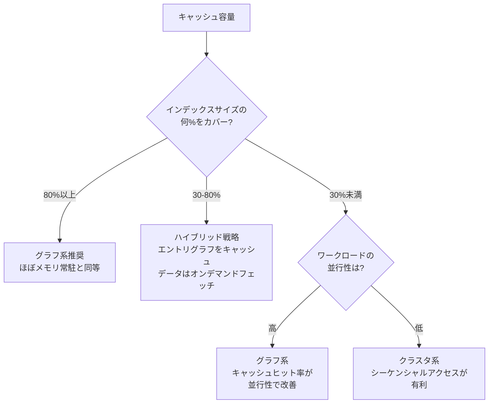

本記事は [arXiv:2511.14748](https://arxiv.org/abs/2511.14748) の解説記事です。

## 論文概要（Abstract）

「Cloud-Native Vector Search: A Comprehensive Performance Analysis」は、クラウドストレージ（リモートストレージ）上でのベクトルインデックスの性能を体系的に分析した研究論文である。著者らは、クラウドプロバイダがデフォルトで採用するクラスタベースインデックス（IVF系）の妥当性を検証し、高並行性・高再現率・高次元データを扱うワークロードではグラフベースインデックスが優位であることを示した。さらに、オンクラウド検索ではオンディスク検索とは大幅に異なるインデックス構築・検索パラメータが最適であること、既存のクラウドキャッシュとインデックス最適化の間に競合が存在することを明らかにしている。

この記事は [Zenn記事: サーバーレスベクトルDB選定2026：5サービスの課金・性能・コスト比較](https://zenn.dev/0h_n0/articles/bc0d17d1fe8b8a) の深掘りです。

## 情報源

- **arXiv ID**: 2511.14748
- **URL**: [https://arxiv.org/abs/2511.14748](https://arxiv.org/abs/2511.14748)
- **著者**: Zhaoheng Li, Wei Ding, Silu Huang, Zikang Wang, Yuanjin Lin, Ke Wu, Yongjoo Park, Jianjun Chen
- **発表年**: 2025（初版2025年11月18日、改訂2025年12月5日）
- **分野**: cs.DB（データベース）

## 背景と動機（Background & Motivation）

レコメンドシステムやRAGパイプラインにおいて、ベクトルインデックスを用いた類似検索は性能に直結する基盤技術である。データ規模とタスクの複雑性が増す中、ベクトルインデックスをリモートストレージ（クラウドストレージ）上に配置する「クラウドネイティブベクトル検索」が主要クラウドプロバイダによってサービス化されている。

著者らが指摘する課題は3つある。第一に、多様なワークロード特性（並行性、次元数、再現率要件）があるにもかかわらず、プロバイダはクラスタベースインデックスをデフォルトとして一律に採用している点。第二に、オンディスク検索の知見がそのままクラウド環境に適用されている点。第三に、クラウドのキャッシュ機構とインデックス最適化手法の間に未知の競合が存在する点である。

## 主要な貢献（Key Contributions）

- **貢献1**: クラスタベースとグラフベースのベクトルインデックスをクラウドストレージ上で体系的に比較し、各インデックスの性能ボトルネックを特定した
- **貢献2**: クラウド環境ではオンディスク環境と大幅に異なるインデックス構築・検索パラメータが最適となることを実証した
- **貢献3**: クラウドキャッシュとベクトル検索の統合における最適化競合を発見し、キャッシュ容量に応じた緩和策を提示した

## 技術的詳細（Technical Details）

### クラウドストレージの特性がインデックス設計に与える影響

ローカルSSDとクラウドストレージ（S3等）の特性差を理解することが本論文の前提となる。

| 特性 | ローカルSSD | クラウドストレージ（S3） |
|------|-----------|----------------------|
| レイテンシ | ~0.1ms/アクセス | ~10-100ms/ラウンドトリップ |
| スループット | GB/s単位 | 並列リクエストでスケール |
| アクセスコスト | 均一 | リクエスト数に比例 |
| 最適フェッチサイズ | 4KB-64KB | 数MB以上 |

この特性差により、ローカルSSD上で最適なインデックス設計がクラウドストレージ上では非効率になるケースが生じる。

### クラスタベースインデックス（IVF系）のクラウド性能

IVF（Inverted File Index）系インデックスは、ベクトル空間を$K$個のクラスタに分割し、各クラスタにベクトルのリスト（ポスティングリスト）を対応させる。検索時にはクエリベクトルに最も近い$nprobe$個のクラスタのみを走査する。

検索の計算量は以下で表される：

$$
\text{Cost}_{\text{IVF}} = nprobe \times \text{RTT} + nprobe \times |C_{avg}| \times d \times \text{cost}_{\text{distance}}
$$

ここで、$\text{RTT}$はラウンドトリップ時間、$|C_{avg}|$は平均クラスタサイズ、$d$はベクトル次元数、$\text{cost}_{\text{distance}}$は距離計算の単位コストである。

著者らの分析によると、クラウドストレージ上でIVF系が有利となる理由は以下の2点にある：

1. **フェッチ粒度の制御性**: ポスティングリスト単位でデータを取得できるため、クラウドストレージの大きな最適フェッチサイズと整合する
2. **クエリ内依存関係の少なさ**: 各クラスタの走査は独立しているため、並列リクエストが可能でラウンドトリップを最小化できる

### グラフベースインデックス（HNSW系）のクラウド性能

HNSW（Hierarchical Navigable Small World）は、各レイヤーで貪欲探索を行い、上位レイヤーで粗い近傍を特定して下位レイヤーで精密化する。

グラフ探索の性質上、次にアクセスするノードは現在のノードの探索結果に依存する。この逐次的な依存関係がクラウドストレージ上では問題となる：

$$
\text{Cost}_{\text{Graph}} = \sum_{i=1}^{H} \text{RTT}_i + \sum_{i=1}^{H} |N_i| \times d \times \text{cost}_{\text{distance}}
$$

ここで、$H$はホップ数、$\text{RTT}_i$は$i$番目のホップのラウンドトリップ時間、$|N_i|$は$i$番目のホップで取得する近傍数である。

しかし著者らは、以下の条件ではグラフベースインデックスがクラスタベースを上回ることを発見している：

1. **高並行性ワークロード**: 多数の同時クエリがある場合、グラフのランダムアクセスパターンがキャッシュヒット率の向上に寄与する
2. **高再現率要求**: Recall > 0.95を求める場合、IVF系は$nprobe$の増加が必要でフェッチ量が急増する一方、グラフ系は探索の精度制御が効率的
3. **高次元データまたは大型データ型**: 次元数が高い場合、IVFのクラスタ品質が低下する傾向がある

### パラメータ設定の差異

著者らの重要な発見の一つは、オンディスク環境で最適なパラメータがクラウド環境では最適でないことである。

```python
class CloudVectorSearchConfig:
    """クラウドネイティブ環境でのベクトル検索設定

    論文の知見: オンディスクとクラウドでは最適パラメータが大幅に異なる

    Args:
        index_type: 'ivf' or 'hnsw'
        storage: 'disk' or 'cloud'
    """

    def get_ivf_params(self, storage: str) -> dict:
        if storage == "disk":
            return {
                "nlist": 4096,
                "nprobe": 32,
                "pq_nbits": 8,
            }
        # クラウド環境: ラウンドトリップを減らすためnprobeを減らし
        # 1リクエストあたりのフェッチ量を増やす
        return {
            "nlist": 1024,      # クラスタ数を減らし各クラスタを大きくする
            "nprobe": 8,        # 走査クラスタ数を減らしRTTを最小化
            "pq_nbits": 8,
            "prefetch_mb": 4,   # フェッチサイズを拡大
        }

    def get_hnsw_params(self, storage: str) -> dict:
        if storage == "disk":
            return {
                "M": 16,
                "ef_construction": 200,
                "ef_search": 64,
            }
        # クラウド環境: エントリグラフをメモリに保持し
        # リモートアクセスを最終段階に限定
        return {
            "M": 32,             # 接続数を増やしホップ数を減らす
            "ef_construction": 400,
            "ef_search": 128,    # 精度を上げてリトライを減らす
            "entry_graph_in_memory": True,
        }
```

### キャッシュとの競合

クラウド環境では通常、頻繁にアクセスされるデータをローカルにキャッシュする。しかし著者らは、特定のインデックス最適化手法がキャッシュの効果を阻害するケースを発見している。

具体的には：

- **IVFのリスト圧縮最適化**: ポスティングリストを圧縮するとフェッチ量は減るが、キャッシュのアドレス粒度と合わなくなりキャッシュヒット率が低下する
- **グラフのレイアウト最適化**: ノードの物理配置を最適化すると逐次アクセスは改善されるが、キャッシュのプリフェッチパターンと整合しない場合がある

著者らは、キャッシュ容量に応じて以下の戦略を推奨している：



### ラウンドトリップ最小化の定量モデル

著者らの分析において、クラウドストレージ上でのベクトル検索コストは以下のモデルで近似される：

$$
T_{\text{total}} = n_{\text{RT}} \times L_{\text{RT}} + \frac{D_{\text{fetch}}}{B_{\text{throughput}}} + T_{\text{compute}}
$$

ここで、$n_{\text{RT}}$はラウンドトリップ数、$L_{\text{RT}}$は1回のラウンドトリップレイテンシ（S3で約10-100ms）、$D_{\text{fetch}}$は総フェッチデータ量、$B_{\text{throughput}}$はネットワークスループット、$T_{\text{compute}}$は距離計算等のCPU処理時間である。

クラスタ系（IVF）では$n_{\text{RT}} = nprobe$（各クラスタを1リクエストで取得する場合）または$n_{\text{RT}} = 1$（全クラスタを1バッチリクエストで取得する場合）となる。一方グラフ系（HNSW）では$n_{\text{RT}}$はグラフのホップ数に依存し、通常10-20ホップ程度となる。

このモデルから、クラウドストレージ上では「1リクエストあたりのフェッチ量を増やしてラウンドトリップ数を減らす」ことが最適化の基本戦略であることが分かる。IVF系は$nlist$を減らして（クラスタサイズを大きくして）$nprobe$を減らすことで対応できるが、グラフ系はホップ数の削減にはグラフ構造自体の変更（$M$の増加等）が必要となる。

### データ型と次元数の影響

著者らは、データ型によってもインデックス選択の最適解が変わることを報告している。float32（4バイト/次元）からfloat16（2バイト/次元）やint8量子化（1バイト/次元）に切り替えると、フェッチデータ量が大幅に削減される。この場合、グラフ系の不利（ラウンドトリップ数の多さ）が緩和されるため、量子化を併用する場合はグラフ系の適用範囲が広がる。

## 実験結果（Results）

著者らは複数のデータセット・ワークロード条件でベンチマークを実施している（具体的な実験環境はクラウドストレージを使用）。論文の主要な実験結果を以下にまとめる：

**インデックスタイプ別の優位条件:**

| 条件 | クラスタ系（IVF） | グラフ系（HNSW） |
|------|-----------------|-----------------|
| 低並行性（1-10 QPS） | 優位 | ― |
| 高並行性（100+ QPS） | ― | 優位 |
| 低次元（128-256dim） | 優位 | ― |
| 高次元（768-1536dim） | ― | 優位 |
| Recall < 0.90 | 優位 | ― |
| Recall > 0.95 | ― | 優位 |

著者らが報告した重要な定量的知見：

- クラウド環境でのIVF最適パラメータは、オンディスク環境と比較して$nprobe$が約50-75%少なく、$nlist$も約25-50%少ない値となる
- グラフ系インデックスは高並行性ワークロードでキャッシュヒット率が向上し、並行クエリ数が10→100に増加すると実効レイテンシが30-40%改善するケースが観測された
- キャッシュ容量がインデックスサイズの50%以上の場合、インデックスタイプ間の性能差は大幅に縮小する

## 実運用への応用（Practical Applications）

本論文の知見は、Zenn記事で比較した5つのサーバーレスベクトルDBの性能特性を裏付ける理論的基盤を提供する。

**Pinecone Serverless**: クラスタベースインデックスを採用しており、論文の分析では低〜中並行性ワークロードで効率的。DRNの追加により、キャッシュ容量を事実上100%に引き上げることでグラフ系との性能差を解消している

**Qdrant Cloud**: グラフベースインデックス（HNSW）を採用。論文が示す「高並行性・高再現率でのグラフ系優位」が、Qdrantの低レイテンシ（p50 ~4ms）の理論的根拠となる

**Zilliz Cloud**: Cardinalエンジンの最適化は、論文が指摘する「クラウド環境固有のパラメータチューニング」を実装レベルで実現していると考えられる

**Turbopuffer**: オブジェクトストレージ（S3）をプライマリストレージとする設計は、本論文の分析対象そのものである。SPFreshのセントロイドベースアプローチは、論文が示すクラスタ系の「フェッチ粒度制御性」と「クエリ内依存関係の少なさ」という利点を活かしている

選定への実務的示唆として：
- 散発的クエリ（日数百件）ではクラスタ系（Pinecone Serverless, Turbopuffer）が効率的
- 定常的な高並行クエリ（100+ QPS）ではグラフ系（Qdrant Cloud）を検討すべき
- キャッシュ戦略（DRN、pre-warm等）によりインデックスタイプの弱点を補える

## 関連研究（Related Work）

- **DiskANN (Subramanya et al., 2019)**: Vamanaグラフを用いたSSD上のANN検索。本論文ではグラフ系インデックスのクラウド性能分析の基盤として参照されている
- **FAISS (Johnson et al., 2019)**: Meta AIによるIVF系インデックスの標準実装。クラスタベースインデックスのベースラインとして使用されている
- **Milvus (Wang et al., 2021)**: クラウドネイティブベクトルデータベースの代表的実装。本論文の分析対象の一つと関連が深い

## まとめと今後の展望

本論文は、「クラスタ系がクラウド環境のデフォルト」という業界の暗黙の前提に対して、ワークロード特性によってはグラフ系が優位であることを実証的に示した。特に高並行性・高次元・高再現率の条件での知見は、サーバーレスベクトルDBの選定において具体的な判断基準を提供する。キャッシュとインデックス最適化の競合という発見は、DRNやpre-warm APIなどの実装がなぜ有効なのかを理論的に説明する重要な知見である。

## 参考文献

- **arXiv**: [https://arxiv.org/abs/2511.14748](https://arxiv.org/abs/2511.14748)
- **Related Zenn article**: [https://zenn.dev/0h_n0/articles/bc0d17d1fe8b8a](https://zenn.dev/0h_n0/articles/bc0d17d1fe8b8a)
