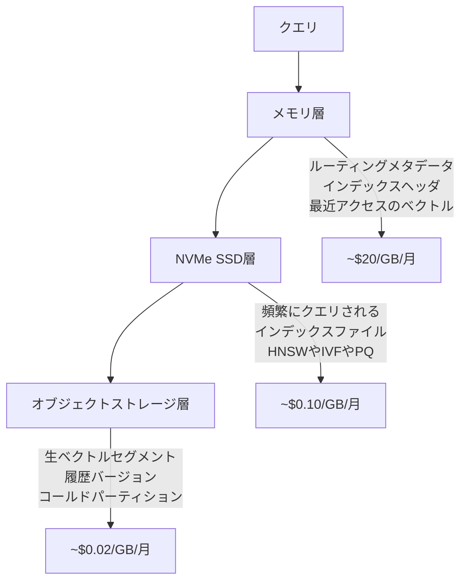

本記事は [arXiv:2601.01937](https://arxiv.org/abs/2601.01937) の解説記事です。

## 論文概要（Abstract）

「Vector Search for the Future: From Memory-Resident, Static Heterogeneous Storage, to Cloud-Native Architectures」は、ベクトル検索システムのストレージアーキテクチャの進化を3つのフェーズに分けて体系的に整理したチュートリアル論文である。SIGMOD 2026で発表が予定されている。著者らは、メモリ常駐型（低レイテンシだがスケーラビリティに限界）、SSDハイブリッド型（コスト効率は向上するがI/O設計が複雑化）、そしてクラウドネイティブ多層型（トリリオンスケールの弾力的検索を実現）の3段階を通じて、インデックス構造・検索アルゴリズム・更新戦略がどのように変容してきたかを論じている。

この記事は [Zenn記事: サーバーレスベクトルDB選定2026：5サービスの課金・性能・コスト比較](https://zenn.dev/0h_n0/articles/bc0d17d1fe8b8a) の深掘りです。

## 情報源

- **arXiv ID**: 2601.01937
- **URL**: [https://arxiv.org/abs/2601.01937](https://arxiv.org/abs/2601.01937)
- **著者**: Yitong Song, Xuanhe Zhou, Christian S. Jensen, Jianliang Xu
- **発表年**: 2026（SIGMOD 2026チュートリアルとして採択）
- **分野**: cs.DB（データベース）

## 背景と動機（Background & Motivation）

マルチモーダルAIの普及に伴い、画像・動画・コード・テキストなど多様なデータの類似検索がデータ管理の基盤技術となっている。ベクトル検索の需要はRAG（Retrieval-Augmented Generation）パイプラインやレコメンドシステムを中心に急増しており、扱うベクトル数はトリリオン（兆）規模に達しつつある。

著者らが指摘する課題は、データ規模の拡大に伴い「検索精度・レイテンシ・スケーラビリティ・コスト」の4軸を同時に最適化する必要が生じている点である。メモリ常駐型ではコストがスケールに比例して増大し、SSD活用型ではI/Oパターンの最適化が設計の中心課題となる。そして2024年以降、オブジェクトストレージ（S3互換）を活用したクラウドネイティブ型が登場し、ストレージ階層ごとのコスト・レイテンシ・スループットの最適配置が新たな研究テーマとなっている。

## 主要な貢献（Key Contributions）

- **貢献1**: ベクトル検索のストレージアーキテクチャを「メモリ常駐→SSDハイブリッド→クラウドネイティブ多層」の3フェーズに分類し、各フェーズのインデックス設計原則を体系化した
- **貢献2**: IVF系・グラフ系・ツリー系のインデックスについて、SSD/オブジェクトストレージ上での設計パターン（ブロックアラインメント、プロービング最適化、更新戦略）を包括的に比較した
- **貢献3**: Zilliz Cloud・TurboPufferなど実システムのアーキテクチャを分析し、クラウドネイティブベクトル検索における5つの未解決課題を提示した

## 技術的詳細（Technical Details）

### フェーズ1: メモリ常駐型ベクトル検索

初期のベクトル検索システムでは、生ベクトルとインデックス構造の両方をメモリ上に保持する。データアクセスのコストがほぼゼロであるため、計算効率が設計の中心となる。

代表的なインデックス手法として、著者らは以下を挙げている：

- **IVF（Inverted File）系**: ベクトル空間をクラスタに分割し、検索時にはクエリに近いクラスタのみを走査する。計算量は$O(nprobe \cdot |C_{avg}|)$（$nprobe$: 走査クラスタ数、$|C_{avg}|$: 平均クラスタサイズ）
- **ハッシュ系（LSH）**: ランダム射影によりベクトルをバケットに割り当て、同一バケット内で候補を探索する
- **量子化系（PQ）**: ベクトルを部分ベクトルに分割し、各部分をコードブックでエンコードすることでメモリ使用量を削減する
- **グラフ系（HNSW）**: 階層的な近傍グラフを構築し、貪欲探索で近傍を辿る

HNSWのアルゴリズムは以下のように記述される：

$$
\text{score}(q, v) = -\|q - v\|_2 \quad \text{or} \quad \frac{q \cdot v}{\|q\| \|v\|}
$$

ここで$q$はクエリベクトル、$v$はデータベース内のベクトルである。HNSWでは上位レイヤーで粗い近傍を特定し、下位レイヤーで精密な近傍探索を行う。メモリ常駐環境ではランダムアクセスのコストが低いため、グラフの辺を自由に辿れるが、SSD/オブジェクトストレージではこの前提が崩れる。

### フェーズ2: SSDハイブリッド型ベクトル検索

著者らは、SSDハイブリッド型のインデックス設計をIVF系・グラフ系・ツリー系に分類し、それぞれについて4つの最適化軸を分析している。

#### IVF系のSSD最適化

IVF系インデックスでは、以下の4つの設計要素が重要となる：

1. **クラスタリングとパーティショニング**: バランスドk-meansにより、各ポスティングリストがSSDブロックサイズに整合するよう調整する。偏ったクラスタは過大なページフェッチを引き起こすため回避が必要である

2. **ブロックアウェアレイアウト**: 著者らは「block-aligned list segments」と「locality-enhanced contiguous layouts（類似クラスタをグループ化する配置）」の2戦略を紹介している

3. **プロービング最適化**: 階層的クラスタリングにより検索を局所化する。論文で紹介されているZoom戦略は「圧縮ベクトルのプレビューで候補をフィルタし、SSD上の生ベクトルを取得する前に絞り込む」手法である

4. **更新メカニズム**: MicroNNはデルタストアに更新をバッファし、SPFreshは「選択的に少数のベクトルのみをクラスタ間で移動させる軽量リバランシング」を実現する

#### グラフ系のSSD最適化

グラフ系インデックス（DiskANN/Vamana等）では、以下の設計課題がある：

1. **ディスクフレンドリーグラフ**: Vamanaは「occlusion-based pruningと進行パラメータにより、ページアラインメントに適した固定次数を維持しつつ長距離エッジを保持する」

2. **ブロックローカリティレイアウト**: 結合レイアウト（ベクトルと近傍を同一ページに配置）と分離レイアウト（グラフ構造と生ベクトルを分離して個別最適化）の2方式が存在する

3. **粗→精探索**: メモリ上のエントリグラフでルーティングを行い、SSDアクセスを最小化する。PageANNは「類似ベクトルをページ単位の'スーパーノード'にクラスタリングし、論理的なグラフ探索と物理的なSSDページを一致させる」

4. **更新戦略**: FreshDiskANNは新ベクトルを専用のSSD領域にバッファし、LSM-VECは「LSMライクなインデックス構造で、最新の更新をメモリ内の高速レイヤーで処理する」

著者らは重要な洞察として、「SSD常駐グラフではI/Oを最小化しつつ精度を維持するために、グラフ構造と物理レイアウトの両方を注意深く再設計する必要がある」と述べている。これはメモリ常駐型の「データアクセスがほぼ無料」という前提とは根本的に異なる。

### フェーズ3: クラウドネイティブ多層型

論文の中核をなす第3フェーズでは、メモリ・SSD・オブジェクトストレージを統合した多層アーキテクチャを分析している。

#### アーキテクチャパターン

著者らは実システムの分析に基づき、以下のストレージ配置パターンを示している：



#### Zilliz Cloudのアーキテクチャ

著者らの分析によると、Zilliz Cloudは以下の3層パイプラインを実装している：

- **メモリ層**: ルーティングメタデータ、インデックスヘッダ、最近アクセスされたベクトルを保持
- **SSD層**: 頻繁にクエリされるインデックスファイル（HNSW/IVF/PQ）を永続化
- **オブジェクトストレージ層**: 生ベクトルセグメントと履歴バージョンを保管

#### TurboPufferのアーキテクチャ

TurboPufferについては、「ホットデータ（最近の挿入、アクティブパーティション、ルーティング構造）」をメモリに、「インデックス構造とウォームベクトル」をSSDに、「コールドパーティションと履歴ベクトル」をオブジェクトストレージに配置する設計を紹介している。さらに「遅延ページネーション（delayed pagination）と投機的プリフェッチ（speculative prefetching）」により、オブジェクトストレージからのデータ取得を最適化している。

TurboPufferで採用されているSPFreshは、セントロイドベースの近似最近傍インデックスであり、グラフベース（HNSW等）と比較して以下の利点を持つ：

- ラウンドトリップ数の最小化（セントロイド→クラスタデータの2段階フェッチ）
- 書き込み増幅（write amplification）の削減
- オブジェクトストレージの大規模シーケンシャルリードとの親和性

## 実装のポイント（Implementation）

論文の分析に基づくインデックス選択の指針を以下に示す：

```python
def select_index_type(
    data_scale: int,
    dimension: int,
    storage_tier: str,
    concurrency: int,
    recall_target: float,
) -> str:
    """ワークロード特性に基づくインデックス選択

    Args:
        data_scale: ベクトル数
        dimension: ベクトル次元数
        storage_tier: 'memory', 'ssd', 'cloud'のいずれか
        concurrency: 同時クエリ数
        recall_target: 目標再現率（0.0-1.0）

    Returns:
        推奨インデックスタイプ
    """
    if storage_tier == "memory":
        if data_scale < 1_000_000:
            return "flat"
        return "hnsw"

    if storage_tier == "ssd":
        if data_scale < 10_000_000:
            return "diskann_vamana"
        return "ivf_spann"

    # cloud-native: 論文の知見に基づく選択
    if concurrency > 100 or recall_target > 0.95 or dimension > 1024:
        return "graph_based"  # グラフ系が有利
    return "cluster_based"  # IVF系がデフォルト
```

クラウドネイティブ環境でのパラメータチューニングについて、著者らは「オンクラウド検索ではオンディスク検索とは大幅に異なるインデックス構築パラメータと検索パラメータが最適となる」と報告している。具体的には、オブジェクトストレージのラウンドトリップレイテンシ（~100ms/回）を考慮し、以下の調整が必要となる：

- IVF系: $nprobe$を増やしてラウンドトリップ数を減らす代わりに、1回のフェッチで多くのクラスタデータを取得する
- グラフ系: エントリグラフをメモリに保持し、SSD/オブジェクトストレージへのアクセスを最終段階に限定する
- キャッシュ統合: 一部のインデックス最適化がキャッシュと競合するため、キャッシュ容量に応じた設定調整が必要

## 実験結果（Results）

本論文はチュートリアル論文であり独自の大規模ベンチマークは含まないが、既存研究の成果を体系的にまとめている。

著者らが整理した代表的システムの比較（論文Table 1に基づく）：

| カテゴリ | 手法 | DRAM保持内容 | SSD保持内容 | 更新対応 | 主な革新 |
|---------|------|-------------|-----------|---------|---------|
| IVF | SPANN | セントロイド | ポスティングリスト | あり | 階層的クラスタリング |
| グラフ | DiskANN | 圧縮ベクトル | Vamana+ベクトル | あり | Vamanaグラフ |
| グラフ | Starling | 圧縮/エントリグラフ | Vamana+ベクトル | あり | 最適化レイアウト |
| ツリー | PQBF | PQメタデータ | 圧縮ベクトル | あり | PQベースフィルタリング |

クラウドネイティブ環境では、IVF系はフェッチ粒度がブロック単位で制御しやすく、クエリ内の依存関係が少ないためオブジェクトストレージとの親和性が高いとされている。一方、グラフ系は高並行性・高再現率・高次元データでは優位であるが、逐次的なグラフ探索がラウンドトリップ数の増加を招くトレードオフがある。

## 実運用への応用（Practical Applications）

この論文の知見は、Zenn記事で取り上げたサーバーレスベクトルDB 5サービスの設計思想を理解するための理論的基盤を提供する。

**Pinecone Serverless**: IVF系のクラスタベースインデックスを採用し、論文が分析するブロックアラインメント最適化を活用している。DRN（Dedicated Read Nodes）はメモリ+ローカルSSDの2層構造で、コールドスタートを排除する

**Turbopuffer**: 論文で詳述されるSPFreshのセントロイドベースインデックスをオブジェクトストレージ上で運用する設計。3層ストレージ階層のアーキテクチャパターンそのものを実装している

**Qdrant Cloud**: グラフ系インデックス（HNSW）を採用し、論文が指摘する「高並行性・高再現率ワークロードでのグラフ系の優位性」を活かしている

**Zilliz Cloud**: 論文で実システムとして分析されている。IVFベースの分散アーキテクチャでセグメント単位のデータ管理を行う

選定時のポイントとして、論文の知見を「コスト最適化」の観点で整理すると：

- ストレージコストは層が下がるほど桁違いに安くなる（メモリ~$20/GB → SSD~$0.10/GB → S3~$0.02/GB）
- クエリレイテンシはストレージ層に強く依存する（メモリ: μs単位、SSD: ms単位、S3: 100ms単位）
- 最適なインデックス構造はストレージ構成によって変わる（同一アルゴリズムでもパラメータ設定が大幅に異なる）

## 関連研究（Related Work）

- **DiskANN (Subramanya et al., 2019)**: Vamanaグラフを用いたSSD上の近似最近傍検索。本論文ではグラフ系SSD最適化の代表手法として分析されている
- **SPFresh (Zhang et al., SOSP 2023)**: セントロイドベースのインクリメンタル更新機構。TurboPufferの基盤技術として本論文でも言及されている
- **SPANN (Chen et al., NeurIPS 2021)**: 階層的クラスタリングによるIVF系SSD最適化。大規模ベクトル検索のスケーラビリティ改善に貢献した

## まとめと今後の展望

本論文は、ベクトル検索のアーキテクチャ進化を「計算中心→I/O中心→コスト意識型」という軸で整理した。著者らは5つの未解決課題を提示している：（1）層ごとのI/O特性を考慮したインデックス共同設計、（2）アクセスパターンに基づく適応的キャッシュ、（3）オブジェクトストレージ上のコールドデータへの効率的クエリ、（4）オンライン弾力性とオートスケーリング、（5）計算・SSD書き込み・帯域幅を横断するコスト最適化。これらの課題は、サーバーレスベクトルDBの次世代アーキテクチャ設計に直接影響を与える研究方向である。

## 参考文献

- **arXiv**: [https://arxiv.org/abs/2601.01937](https://arxiv.org/abs/2601.01937)
- **Related Zenn article**: [https://zenn.dev/0h_n0/articles/bc0d17d1fe8b8a](https://zenn.dev/0h_n0/articles/bc0d17d1fe8b8a)
