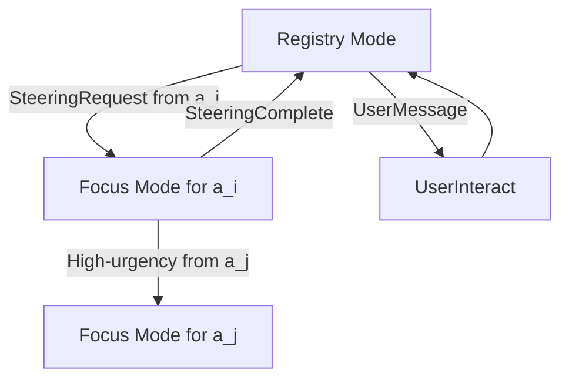

本記事は [Dynamic Attentional Context Scoping: Agent-Triggered Focus Sessions for Isolated Per-Agent Steering in Multi-Agent LLM Orchestration (arXiv:2604.07911)](https://arxiv.org/abs/2604.07911) の解説記事です。

## 論文概要（Abstract）

DACS（Dynamic Attentional Context Scoping）は、マルチエージェントLLMオーケストレーションにおける**コンテキスト汚染**（context pollution）を解決する手法である。著者のNickson Patelは、複数の並行エージェントがオーケストレーターのコンテキストウィンドウを競合する際に、タスク状態の相互汚染による意思決定品質の劣化が発生する問題を特定し、200回の試行にわたる実験で、DACSがベースライン比+36.7〜+69.0ポイントのステアリング精度向上を達成したと報告している。

この記事は [Zenn記事: Claude Codeサブエージェント設計パターン：3層マルチエージェントの実装手法](https://zenn.dev/0h_n0/articles/0c54d57a86a4a6) の深掘りです。

## 情報源

- **arXiv ID**: 2604.07911
- **URL**: [https://arxiv.org/abs/2604.07911](https://arxiv.org/abs/2604.07911)
- **著者**: Nickson Patel
- **発表年**: 2026
- **分野**: cs.MA, cs.AI, cs.LG

## 背景と動機（Background & Motivation）

Claude Codeのサブエージェントは「独立したコンテキストウィンドウで動作する」と公式ドキュメントに記載されている。この設計の背景にあるのが、コンテキスト汚染問題である。

マルチエージェントLLMシステムでは、オーケストレーター（マネージャー）が複数のエージェントを同時に管理する。従来のフラットコンテキスト方式では、全エージェントのタスク状態・出力がオーケストレーターの単一コンテキストウィンドウに蓄積される。著者は、エージェント数$N$が増加するにつれ、あるエージェント$a_i$のステアリング（方向付け）時に他の$N-1$エージェントの語彙がLLMのアテンションを奪い、意思決定の精度が低下することを指摘している。

## 主要な貢献（Key Contributions）

- **DACSメカニズムの提案**: エージェントがトリガーする非対称コンテキスト分離手法
- **200回の実験による検証**: 合成ベンチマーク（Phase 1-3）とリアルエージェント（Phase 4: Claude Haiku 4.5）の両方で有効性を実証
- **コンテキスト効率**: 最大3.53倍のコンテキスト効率向上を達成

## 技術的詳細（Technical Details）

### DACSの2つのモード

DACSはオーケストレーターに2つの動作モードを定義する：



**Registry Mode**: オーケストレーターは全エージェントの軽量サマリー（各$\leq 200$トークン）のみを保持する。

$$
R = \{r_1, r_2, \ldots, r_N\}
$$

ここで$r_i$はエージェント$a_i$のレジストリエントリ（状態の要約）である。

**Focus($a_i$) Mode**: エージェント$a_i$がSteeringRequestを発行すると、オーケストレーターのコンテキストは以下のように構成される：

$$
C_{\text{focus}} = F(a_i) + R_{-i}
$$

ここで、
- $F(a_i)$: エージェント$a_i$のフルコンテキスト（タスク記述、過去のステアリング交換、現在の出力）
- $R_{-i}$: 他の全エージェントのレジストリサマリー（$a_i$を除く）

### 計算量とコンテキスト効率

フラットコンテキスト方式では、ステアリング時のコンテキストサイズは全エージェントのフルコンテキストの合計となる：

$$
|C_{\text{flat}}| = \sum_{j=1}^{N} |F(a_j)|
$$

一方、DACSでは：

$$
|C_{\text{focus}}| = |F(a_i)| + (N-1) \cdot |r|
$$

コンテキスト効率比$\rho(N)$は：

$$
\rho(N) = \frac{|C_{\text{flat}}|}{|C_{\text{focus}}|}
$$

著者の実験（論文Table 2より）では、$|F| \approx 450\text{-}550$トークン、$|r| \approx 25$トークンであり、以下の効率が報告されている：

| エージェント数$N$ | DACS (tokens) | Baseline (tokens) | 効率比 |
|:---:|:---:|:---:|:---:|
| 3 | 561±1 | 1,191±0 | 2.12× |
| 5 | 633±25 | 1,720±151 | 2.72× |
| 10 | 816±11 | 2,883±269 | 3.53× |

経験的フィッティングにより、$|C_{\text{focus}}| \approx 500 + 25N$（$R^2 > 0.99$）と線形に近似されている。

### アルゴリズム

DACSのコアロジックを擬似コードで示す：

```python
from dataclasses import dataclass, field
from enum import Enum


class OrchestratorMode(Enum):
    REGISTRY = "registry"
    FOCUS = "focus"


@dataclass
class AgentRegistry:
    """エージェントのレジストリエントリ（軽量サマリー）"""
    agent_id: str
    status_summary: str  # ≤200 tokens
    current_task: str


@dataclass
class DACSOrchestrator:
    """DACS オーケストレーター"""
    mode: OrchestratorMode = OrchestratorMode.REGISTRY
    registry: dict[str, AgentRegistry] = field(default_factory=dict)
    focused_agent: str | None = None

    def handle_steering_request(
        self, agent_id: str, full_context: str
    ) -> str:
        """SteeringRequestを処理し、フォーカスモードに遷移"""
        self.mode = OrchestratorMode.FOCUS
        self.focused_agent = agent_id

        # フォーカスコンテキストを構成: F(a_i) + R_{-i}
        focus_context = full_context
        registry_context = "\n".join(
            f"[{rid}] {r.status_summary}"
            for rid, r in self.registry.items()
            if rid != agent_id
        )

        combined = f"{focus_context}\n---\n{registry_context}"
        steering_response = self._call_llm(combined)

        self.mode = OrchestratorMode.REGISTRY
        self.focused_agent = None
        return steering_response

    def _call_llm(self, context: str) -> str:
        """LLMにコンテキストを渡してレスポンスを得る"""
        raise NotImplementedError
```

## 実験結果（Results）

### Phase 1-3: 合成ベンチマーク（160試行）

著者は8つのシナリオでDACSとフラットコンテキストベースラインを比較している。論文Table 3-4より主要な結果を引用する：

**ステアリング精度**:

| $N$ | DACS | Baseline | 差分 | $p$値 |
|:---:|:---:|:---:|:---:|:---:|
| 3 | 96.7% | 60.0% | +36.7pp | $< 0.0001$ |
| 5 | 96.7% | 38.7% | +58.0pp | $< 0.0001$ |
| 10 | 90.0% | 21.0% | +69.0pp | $< 0.0001$ |

**誤エージェント汚染（Wrong-Agent Contamination）**:

| $N$ | DACS | Baseline |
|:---:|:---:|:---:|
| 3 | 3.3% | 56.7% |
| 5 | 14.0% | 52.0% |
| 10 | 3.7% | 29.3% |

### Phase 2: エージェント多様性の影響

著者は同質（Homogeneous）、最大多様（Crossfire）、パイプライン依存（Cascade）の3条件で検証している：

| シナリオ | 精度差分 | DACS汚染率 |
|---------|---------|-----------|
| Homogeneous（同一ドメイン） | +37.7pp | 0.8% |
| Crossfire（最大多様性） | +59.0pp | 0.0% |
| Cascade（パイプライン依存） | +37.3pp | 7.3% |

最大多様なCrossfire条件（C++キュー、拡散モデル、ゲノミクス、デバッグ、臨床試験）でDACSの優位性が最大化されている。これは、エージェント間の語彙の重複が少ないほど、フラットコンテキストでの汚染が深刻化するためと著者は分析している。

### Phase 3: 意思決定密度の影響

意思決定密度$D$（1エージェントあたりのステアリング回数）を変化させた場合：

- $D=3$（$N=3$）: ベースライン精度60.0% → $D=15$: 44.2%（15.8pp低下）
- $D=3$（$N=3$）: DACS精度96.7% → $D=15$: 98.4%（1.7pp**向上**）

著者は「より深いエージェント履歴は、DACSの分離下では付加的なシグナルとなる」と結論している。フラットコンテキストではコンテキストの肥大化で精度が低下するが、DACSではフォーカスモードにより各エージェントの履歴が他のエージェントに干渉しないため、履歴が長くなるほどむしろ性能が改善する。

### Phase 4: リアルエージェント検証（40試行）

Claude Haiku 4.5を自律エージェントとして使用した実世界検証（論文Table 6より）：

| $N$ | DACS | Baseline | 差分 |
|:---:|:---:|:---:|:---:|
| 3 | 79.8% | 62.6% | +17.2pp |
| 5 | 83.7% | 63.3% | +20.4pp |

合成ベンチマークよりも差分は小さいが、統計的に有意な改善（$p < 0.01$）が確認されている。

## 実装のポイント（Implementation）

### Claude Codeのコンテキスト分離との対応

DACSの知見は、Claude Codeのサブエージェント設計に以下の形で対応する：

1. **独立コンテキストウィンドウ**: Claude Codeのサブエージェントは「独立したコンテキストウィンドウで動作する」——これはDACSのFocusモードに概念的に対応する。各サブエージェントは自身のフルコンテキストのみで動作し、他のサブエージェントの状態は結果サマリーとしてのみメインコンテキストに反映される

2. **サマリーの簡潔さ**: DACSではレジストリエントリを$\leq 200$トークンに制限している。Claude Codeのサブエージェントが「返却サマリーが長すぎるとコンテキストを圧迫する」という問題に対応するには、サブエージェントのシステムプロンプトで返却形式を簡潔に指定することが重要

3. **エージェント数とコンテキスト効率**: DACSの結果は、エージェント数$N$が増加するほどコンテキスト分離の効果が大きくなることを示している（$N=10$で3.53倍の効率）。Claude Codeでは最大20サブエージェントが許可されているが、実用的には5-10程度が効率的と推測される

### 注意すべき制約

著者が指摘する制限として：
- Phase 1-3は合成ベンチマークであり、実世界タスクでの効果はPhase 4の結果（+17-20pp）がより現実的
- 実験はMiniMax-M2.7とClaude Haiku 4.5の2モデルのみで、他のモデルでの一般化は未検証
- 割り込み処理（Focus→Focus遷移）は自然に発生したが、独立したアブレーション評価は行われていない

## 実運用への応用（Practical Applications）

### マルチエージェントシステムの設計指針

DACSの知見から、以下の設計指針が導出される：

1. **コンテキスト分離の徹底**: サブエージェントの結果を要約してメインコンテキストに返す際、$\leq 200$トークン程度に制限することで汚染を最小化する
2. **同質エージェントの注意**: 同一ドメインのエージェント（同質シナリオ）では語彙の重複によりDACS下でも汚染率が上昇する傾向がある（7.3%）。Claude Codeで類似のサブエージェントを複数起動する場合、各エージェントの名前空間を明確に分離することが推奨される
3. **意思決定密度の管理**: 長時間稼働するサブエージェントほど、コンテキスト分離の恩恵が大きい。「計画・生成・評価」3分離パターンのように、各フェーズを独立コンテキストで実行することの有効性をDACSの結果が裏付けている

## 関連研究（Related Work）

- **MemoryScope** (Zhang et al., 2025): エージェントメモリの選択的ロード・アンロードで長期コンテキストを管理するが、ステアリング時の即座のコンテキスト切替はサポートしていない
- **Progent** (Luo et al., 2025): エージェント権限の動的制御フレームワークだが、コンテキスト構成ではなく権限付与に焦点
- **ClawArena-Team** (Xiong et al., 2026): サブエージェントオーケストレーションのベンチマークであり、DACSが解決する問題の評価基盤を提供

## まとめと今後の展望

DACSは、マルチエージェントLLMオーケストレーションにおけるコンテキスト汚染を、エージェントトリガー型の非対称フォーカスセッションで解決する手法である。200回の試行にわたる実験で、以下の知見が報告されている：

1. **ステアリング精度**: ベースライン比+36.7〜+69.0ppの改善（$p < 0.0001$）
2. **汚染削減**: 28-57%（ベースライン）→ 0-14%（DACS）
3. **コンテキスト効率**: 2.12〜3.53倍の向上
4. **エージェント数へのスケーラビリティ**: $N$の増加に伴い効果が増大

Claude Codeが採用する「独立コンテキストウィンドウ」アーキテクチャの理論的根拠を、DACSは定量的に提供している。

## 参考文献

- **arXiv**: [https://arxiv.org/abs/2604.07911](https://arxiv.org/abs/2604.07911)
- **Related Zenn article**: [https://zenn.dev/0h_n0/articles/0c54d57a86a4a6](https://zenn.dev/0h_n0/articles/0c54d57a86a4a6)
