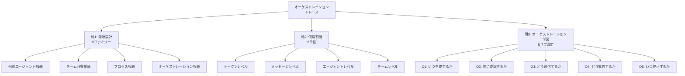

本記事は [Reinforcement Learning for LLM-based Multi-Agent Systems through Orchestration Traces (arXiv:2605.02801)](https://arxiv.org/abs/2605.02801) の解説記事です。

## 論文概要（Abstract）

本論文は、LLMベースのマルチエージェントシステム（LLM-MAS）の強化学習（RL）を**オーケストレーショントレース**——エージェントの生成・委譲・通信・集約・停止の時系列インタラクショングラフ——の観点から体系的に整理したサーベイである。著者のChenchen Zhangは84本の論文を精査し、報酬設計（8ファミリー）、信用割当（8単位）、オーケストレーション学習（5つのサブ決定）の3軸で分析した。特筆すべき発見として、「停止決定に対する明示的なRL訓練手法は2026年5月時点で存在しない」というギャップを指摘している。

この記事は [Zenn記事: Claude Codeサブエージェント設計パターン：3層マルチエージェントの実装手法](https://zenn.dev/0h_n0/articles/0c54d57a86a4a6) の深掘りです。

## 情報源

- **arXiv ID**: 2605.02801
- **URL**: [https://arxiv.org/abs/2605.02801](https://arxiv.org/abs/2605.02801)
- **著者**: Chenchen Zhang
- **発表年**: 2026
- **分野**: cs.CL

## 背景と動機（Background & Motivation）

Claude CodeのDynamic Workflowsでは、`agent()`で生成したサブエージェントを`pipeline()`や`parallel()`で制御する。しかし、「いつエージェントを生成すべきか」「誰に委譲すべきか」「いつ停止すべきか」といったオーケストレーション決定は、現在のところ人間がスクリプトでハードコードするか、LLMの判断に委ねている。

本論文は、これらのオーケストレーション決定をRLで自動最適化する可能性を体系的に調査したものである。個々のエージェントの行動最適化ではなく、**チーム全体の協調行動**を最適化するという視点が特徴である。

## 主要な貢献（Key Contributions）

- **3軸フレームワークの提案**: 報酬設計（8ファミリー）、信用割当（8単位）、オーケストレーション学習（5サブ決定）の統合的分析
- **84論文の体系的整理**: 18カラムの分類スキーマによるキュレーション
- **未解決課題の特定**: 停止決定のRL訓練手法が存在しないことを含む15の未解決問題を提示
- **産業システムとの接続**: Kimi Agent Swarm、OpenAI Codex、Anthropic Claude Codeの3つの産業システムを学術文献と対比

## 技術的詳細（Technical Details）

### 3軸フレームワーク

著者は、LLM-MASのRL最適化を3つの結合された軸で分析する：



### 軸1: 報酬設計（8ファミリー）

著者は報酬シグナルを8つのファミリーに分類している：

| ファミリー | 説明 | 84論文中の出現数 |
|-----------|------|---------------|
| 個別エージェント報酬 | 特定のサブエージェントの貢献に報酬 | — |
| チーム共有報酬 | 全エージェント共通の最終成果指標 | 10 |
| プロセス/ステップ報酬 | 中間ステップでの密な報酬シグナル | — |
| オーケストレーション報酬 | 協調決定に対する直接的シグナル | 7 |
| 討論/メッセージ報酬 | エージェント間通信の品質に報酬 | — |
| 検証者報酬 | 外部評価関数による判定 | — |
| ロールベース報酬 | エージェントの機能的役割別のシグナル | — |
| ハイブリッド合成 | 複数ファミリーの重み付き組み合わせ | 15 |

ハイブリッド合成が最多（15本）であり、著者は「Kimi Agent SwarmのPARL（Parallel-Agent RL）が、チームレベルと個別レベルの報酬分解の実例を提供している」と述べている。

### 軸2: 信用割当（8単位）

信用がどの粒度で帰属されるかを8段階で分類：

| 粒度 | 説明 | 84論文中の出現数 |
|------|------|---------------|
| トークンレベル | 個々の生成トークン | — |
| **メッセージレベル** | エージェント間の完全な通信 | **2** |
| ターンレベル | 会話ラウンドや意思決定ステップ | 5 |
| ツール呼び出しレベル | 関数呼び出しとその返却 | — |
| エージェントレベル | 個別サブエージェントの貢献 | 23 |
| ロールレベル | 機能的役割別のシグナル | 10 |
| オーケストレーターレベル | 生成・委譲決定 | 8 |
| チームレベル | システム全体の成果 | — |

著者の重要な指摘として、「メッセージレベルの明示的な反事実的信用帰属は特に希少で、84論文プール中わずか2件のみ」と報告されている。これは、エージェント間通信の品質がシステム全体の性能に影響することが知られているにもかかわらず、その最適化手法が未発達であることを示している。

### 軸3: オーケストレーション学習（5サブ決定）

著者はオーケストレーションプロセスを5つの学習可能なサブ決定に分解する：

| サブ決定 | 説明 | Claude Codeでの対応 |
|---------|------|-------------------|
| **O1**: いつ生成するか | 新しいサブエージェントが必要かどうかの判断 | `agent()`の呼び出しタイミング |
| **O2**: 誰に委譲するか | 受信エージェントまたはロールの選択 | `subagent_type`パラメータ |
| **O3**: どう通信するか | エージェント間メッセージの構造化 | `prompt`とシステムプロンプト |
| **O4**: どう集約するか | 部分結果の統合方法 | `schema`と返却値の処理 |
| **O5**: いつ停止するか | 終了条件の判断 | **未解決** |

### 停止決定のギャップ

著者の最も注目すべき発見として：

> 「2026年5月4日時点のキュレーションプール内で、停止決定に対する明示的なRL訓練手法は存在しない」

現在のシステムはヒューリスティックなタイムアウトや固定反復回数に依存しており、学習された終了ポリシーは実現されていない。Claude Codeでは`maxTurns`パラメータや`budget.remaining()`によるループ制御がこれに対応するが、いずれも手動設定であり、最適化されたものではない。

### 形式的フレームワーク: 動的Dec-POMDP拡張

著者は古典的なDec-POMDP（分散型部分観測マルコフ決定過程）を拡張し、動的エージェント集合に対応する$\mathcal{M}^+$を定義している：

$$
\mathcal{M}^+ = \langle \mathcal{I}_t, \mathcal{S}, \{\mathcal{A}(i, r_i, h_t)\}_{i \in \mathcal{I}_t}, T, \{R_f\}_{f=1}^{8}, \gamma \rangle
$$

ここで、
- $\mathcal{I}_t$: 時刻$t$でのエージェント集合（生成・消滅イベントにより動的に変化）
- $\mathcal{A}(i, r_i, h_t)$: エージェント$i$の行動空間（役割$r_i$とトレース履歴$h_t$に依存）
- $\{R_f\}_{f=1}^{8}$: 8つの報酬ファミリー
- $\gamma$: 割引率

従来のDec-POMDPは固定エージェント集合を前提としていたが、$\mathcal{M}^+$はエージェントの動的な生成・消滅を許容する点が拡張のポイントである。

### 2つの理論的観察

**観察1（信用拡散）**: 共有チーム報酬の下で、$n$個の信用帰属単位に均一に信用を分配すると、トレース長の増大に伴いシグナルの脆弱性が増す。

$$
\text{信用密度} \propto \frac{R_{\text{team}}}{n \cdot L}
$$

ここで$L$はトレース長。長いトレースほど個々の貢献の特定が困難になる。

**観察2（反事実的同定不可能性）**: オーケストレーターの生成決定（エージェントを生成した場合 vs しなかった場合）の反事実的効果は、オンポリシーのロールアウトからは同定できない。生成しなかった分岐は構造的に異なるトレースを生成するため、直接的な限界効果推定ができない。

## 産業システムとの接続

### Kimi Agent Swarm

著者はKimi（K2.5/K2.6）を「オーケストレーターのRL訓練を明示的に開示している唯一の産業システム」と位置づけている。100〜300のサブエージェントと1,500〜4,000のツール呼び出しを協調させるPARL（Parallel-Agent RL）を実装し、チームレベルと個別レベルの報酬分解を実現している。

### Anthropic Claude Code

著者はClaude Codeについて「サブエージェントの生成とカスタムロールインターフェース、並列マルチClaudeワークフロー」を持つシステムとして記述し、「インターフェース制約がRL設計の選択肢を規律する」と分析している。

## 実装のポイント（Implementation）

### Claude CodeのWorkflow設計への示唆

本論文の3軸フレームワークは、Dynamic Workflowスクリプトの設計に以下の指針を提供する：

1. **報酬設計**: `schema`オプションでStructured Outputを強制し、後続ステージでの品質検証を容易にする。これはVerifier報酬ファミリーに対応する

2. **信用割当**: `pipeline()`はアイテム単位の信用帰属が容易（各アイテムの成否を独立に追跡可能）だが、`parallel()`はバリアにより全結果をまとめて評価するため、個別貢献の特定が困難になる

3. **停止決定**: `budget.remaining()`を使ったループは、固定ラウンド数より柔軟だが、依然として最適化された停止ポリシーではない。本論文が示すギャップは、将来的にRLベースの自動停止決定が実装される可能性を示唆している

```javascript
// 現在のClaude Code: ヒューリスティックな停止
while (budget.total && budget.remaining() > 50_000) {
  const result = await agent("Find bugs", {schema: BUGS_SCHEMA});
  bugs.push(...result.bugs);
}

// 本論文が示唆する将来: 学習された停止ポリシー
// （O5の明示的RL訓練が実現した場合）
// stopPolicy.shouldContinue(traceHistory, currentResults)
```

## 実運用への応用（Practical Applications）

### 15の未解決問題からの実務的示唆

著者が提示する15の未解決問題のうち、実務に直結するものを抜粋する：

- **非同期ロールアウトの最適化**: `pipeline()`のようなノーバリア実行では、エージェントの完了タイミングが異なるため、同期的なRL更新が適用できない
- **通信帯域幅 vs 信用品質のトレードオフ**: サブエージェントの返却サマリーを簡潔にするとコンテキスト効率は上がるが、信用帰属の精度は下がる
- **並列性効率のベンチマーク**: タスク成功率だけでなく、並列化による壁時計時間の削減を評価すべき

## 関連研究（Related Work）

- **DACS** (Patel, 2026): コンテキスト汚染の解決手法。本論文の軸3（オーケストレーション学習）とは直交する問題を扱う
- **ClawArena-Team** (Xiong et al., 2026): サブエージェント管理のベンチマーク。本論文の15未解決問題のうち「並列性効率のベンチマーク」に対する部分的解答を提供
- **Kimi PARL**: 本論文で最も詳細に分析された産業システム。チームレベルと個別レベルの報酬分解の実例として引用

## まとめと今後の展望

本論文は、LLM-MASのRL最適化を3軸（報酬設計・信用割当・オーケストレーション学習）で体系化し、以下の重要な知見を提供している：

1. **報酬設計**: 8ファミリーのうちハイブリッド合成が最多（15/84本）だが、オーケストレーション専用報酬は7本と少ない
2. **信用割当**: メッセージレベルの反事実的信用帰属はわずか2本と極めて希少——エージェント間通信の品質最適化が未開拓
3. **停止決定のギャップ**: 5つのオーケストレーション決定のうち、停止決定（O5）に対するRL訓練手法は存在しない
4. **産業と学術の断絶**: Kimi Agent Swarmのみがオーケストレーター訓練を開示しており、多くの産業システムは学術的評価を超えた実践知を蓄積している

Claude Codeのマルチエージェント設計の将来を考える上で、本論文は「現在手動で行っているオーケストレーション決定が、将来的にRLで自動化される可能性がある」という研究方向を示唆している。

## 参考文献

- **arXiv**: [https://arxiv.org/abs/2605.02801](https://arxiv.org/abs/2605.02801)
- **Related Zenn article**: [https://zenn.dev/0h_n0/articles/0c54d57a86a4a6](https://zenn.dev/0h_n0/articles/0c54d57a86a4a6)
