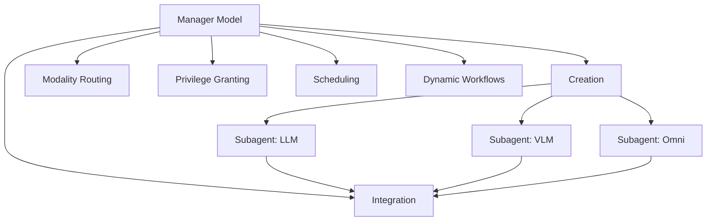

本記事は [ClawArena-Team: Benchmarking Subagent Orchestration and Dynamic Workflows in Language-Model Agents (arXiv:2606.31174)](https://arxiv.org/abs/2606.31174) の解説記事です。

## 論文概要（Abstract）

ClawArena-Teamは、LLMエージェントがサブエージェントを生成・管理する「オーケストレーション能力」を初めて体系的に評価するベンチマークである。著者らは41のマルチターンシナリオ・258の評価ラウンドを設計し、12のモデルを評価した。その結果、管理のボトルネックはモダリティ認識ではなく**権限付与（privilege granting）**にあり、APIコストと管理品質は乖離することが明らかになった。

この記事は [Zenn記事: Claude Codeサブエージェント設計パターン：3層マルチエージェントの実装手法](https://zenn.dev/0h_n0/articles/0c54d57a86a4a6) の深掘りです。

## 情報源

- **arXiv ID**: 2606.31174
- **URL**: [https://arxiv.org/abs/2606.31174](https://arxiv.org/abs/2606.31174)
- **著者**: Kaiwen Xiong, Haonian Ji, Shi Qiu, Zeyu Zheng, Cihang Xie, Xinyu Ye, Huaxiu Yao
- **発表年**: 2026
- **分野**: cs.AI
- **コード**: [https://github.com/aiming-lab/ClawArena](https://github.com/aiming-lab/ClawArena)

## 背景と動機（Background & Motivation）

Claude CodeのDynamic WorkflowsやAgent Teamsに代表されるように、現代のLLMエージェントシステムでは「マネージャー」モデルがサブエージェントを動的に生成し、タスクを委譲するアーキテクチャが主流になりつつある。しかし、既存のベンチマーク（SWE-bench、GAIAなど）は**個別エージェントのタスク遂行能力**を測定するものであり、マネージャーとしての管理能力——すなわち、適切なサブエージェントの選択、権限の付与、ワークフローのスケジューリング——を評価する手段が存在しなかった。

著者らはこの空白を埋めるべく、サブエージェントの生成（Creation）、モダリティルーティング（Modality Routing）、最小権限の付与（Least-Privilege Empowerment）、スケジューリング、Dynamic Workflows、結果統合の6つの管理操作を体系化し、これらを統合的に評価するベンチマークを構築した。

## 主要な貢献（Key Contributions）

- **サブエージェント管理能力の定量評価**: タスク正答率と管理品質を複合的に評価するSubagent-Management Score（SMS）を提案
- **管理ボトルネックの特定**: 12モデルの評価により、権限付与（特にワークスペース権限精度）がすべてのモデルで50%を超えないことを発見
- **コスト・品質乖離の実証**: APIコストが100倍以上異なるモデル間でSMSは4倍未満の差しかなく、安価なオープンモデルがパレートフロンティア上に位置することを報告

## 技術的詳細（Technical Details）

### ベンチマーク設計

ClawArena-Teamは、マネージャーモデルが固定のサブエージェントプール（gemma-4-31b-it等）を使ってタスクを遂行する設計になっている。マネージャーモデルはテキストのみをネイティブに認識し、ワークスペースの一部にしかアクセスできない。この制約により、画像・音声・動画を含むタスクではサブエージェントへの委譲が必須となる。

### 6つの管理操作

著者らは管理能力を以下の6操作に体系化している：

1. **Creation**: システムプロンプト、モデルキー、ツールサブセット、パスホワイトリストを指定してサブエージェントを生成
2. **Modality Routing**: 画像・動画はVLM、音声はOmniモデルへルーティング
3. **Least-Privilege Empowerment**: タスクに必要なツールとパスのみを付与
4. **Scheduling**: フォアグラウンド/バックグラウンド、新規/継続セッションの選択
5. **Dynamic Workflows**: 複数サブエージェントのオーケストレーションをランタイムで記述
6. **Integration**: サブエージェントの返却結果を正しい成果物に統合



### Subagent-Management Score（SMS）

著者らが提案するSMSは、タスク正答率と管理品質メトリクスの積として定義される：

$$
S_{\text{ms}} = \text{TCR} \times \frac{\text{TPP} + \text{ROC} + \text{WPP} + \text{MCA}}{4}
$$

ここで、
- $\text{TCR}$（Task Completion Rate）: ユーザー質問の平均正答率
- $\text{TPP}$（Tool-Permission Precision）: サブエージェントに付与したツール種別のうち実際に使用された割合
- $\text{ROC}$（Read-Only Compliance）: 読み取り専用サブエージェントに変更系ツールを付与していないか（0 or 1）
- $\text{WPP}$（Workspace-Permission Precision）: サブエージェントがアクセスしたファイル数 ÷ 付与されたファイル数
- $\text{MCA}$（Modality-Choice Accuracy）: 適切なモダリティモデルを選択したか

この設計により、管理品質はタスク正答率を**割り引く**方向にのみ作用し、正答率を水増しすることはできない。管理が完璧でも正解がなければスコアはゼロとなる。

### データセット構成

41シナリオは法律、医療、工学、ビジネス、科学の5ドメインにまたがり、各シナリオは以下の10の設計制約すべてを満たす：

| 制約ID | 内容 | 目的 |
|--------|------|------|
| C1 | マネージャーが直接読めない領域 | 委譲を強制 |
| C2 | ラウンド間の実質的な更新 | 回答の修正を要求 |
| C3 | 全ツール表面の使用 | 増分編集・検証を要求 |
| C4 | 8以上のディレクトリ（デコイ含む） | 権限の節制をテスト |
| C5 | 非テキストモダリティのラウンド | VLM/Omni委譲を強制 |
| C6 | 並列必須タスク | 並行スケジューリングを要求 |
| C7 | セッション再利用ペア | 新規 vs 継続の判断をテスト |
| C8 | ラウンド間依存 | 持続的な状態管理を要求 |
| C9 | モダリティデコイ | テキストショートカットへの耐性 |
| C10 | 機械的に検証可能な回答 | LLMジャッジ不要 |

## 実験結果（Results）

### 12モデルの評価結果

著者らは12のモデルを同一条件で評価した。論文Table 1より主要な結果を引用する：

| モデル | TCR | TPP | ROC | WPP | MCA | SMS | コスト($) |
|--------|-----|-----|-----|-----|-----|-----|-----------|
| claude-fable-5 | 74.4 | 76.4 | 98.8 | 49.2 | 97.9 | 60.0 | 92.8 |
| gemini-3.5-flash | 69.8 | 69.8 | 95.9 | 45.7 | 96.7 | 53.8 | 23.7 |
| gpt-5.5 | 63.6 | 79.9 | 98.7 | 47.5 | 95.2 | 51.0 | 43.3 |
| deepseek-v4-pro | 58.9 | 73.9 | 98.5 | 46.3 | 96.5 | 46.4 | 1.7 |
| gemma-4-31b | 56.6 | 79.0 | 97.7 | 37.9 | 95.5 | 43.9 | 3.5 |
| glm-4.7-flash | 34.5 | 22.4 | 85.8 | 11.7 | 57.2 | 15.3 | 0.8 |

### 知見1: 管理ボトルネックは権限付与にある

ROC（Read-Only Compliance）とMCA（Modality-Choice Accuracy）は、すべての有能なモデルで92%以上を達成しており、これらは「やるべきことが明確」な管理軸である。一方、差が付くのは権限精度の2軸である：

- **TPP**（Tool-Permission Precision）: 70〜80%程度で、不要なツールが付与されている
- **WPP**（Workspace-Permission Precision）: **すべてのモデルで50%を超えない**

著者らは「サブエージェントは日常的に、実際にアクセスするファイルの約2倍のファイルと、必要以上のツールを付与されている」と述べている。これはセキュリティリスク（過剰権限によるサブエージェントの暴走範囲拡大）とコストリスク（不要なパスによるコンテキスト肥大化）の両面で問題となる。

### 知見2: コストと管理品質は乖離する

APIコストは$0.8〜$92.8と100倍以上の開きがあるが、SMSは15.3〜60.0と4倍未満の範囲に収まっている。著者らの分析によれば：

- claude-fable-5: 最高コスト($92.8)・最高SMS(60.0)だが、gemini-3.5-flashの4倍のコストで+6 SMSポイントのみ
- deepseek-v4-pro: $1.7でSMS 46.4——コスト対効果でパレート効率的
- **安価なオープンモデルがパレートフロンティア上に位置する**

### 知見3: スコアは収束するが行動は乖離する

中間10モデルのSMSは9.9ポイント幅に収まるが、オーケストレーション行動は桁違いに異なる：

- **禁止アクセス率**: gpt-5.5が0.48に対し、deepseek-v4-proは5.78、glm-4.7-flashは11.44（約12倍の差）
- **Dynamic Workflow呼び出し回数**: 33〜112と大きくばらつく
- **バックグラウンドスケジューリング**: ほとんどのモデルが新規フォアグラウンド実行に依存

論文Table 5より、claude-fable-5はWorkflow呼び出し94回・バックグラウンド106回と最も多様なスケジューリングパターンを示した。

## 実装のポイント（Implementation）

### Claude Codeのサブエージェント設計への示唆

ClawArena-Teamの知見は、Claude Codeでサブエージェントを設計する際に直接的な示唆を与える：

1. **最小権限の原則を徹底する**: WPPが50%を超えないという結果は、`tools`フィールドを明示的に絞り、`disallowedTools`で不要なツールを除外する重要性を裏付ける

```yaml
# ClawArena-Teamの知見を反映した設計
---
name: code-reviewer
tools: Read, Grep, Glob  # Write, Edit, Bashを意図的に除外
---
```

2. **descriptionの具体性が委譲精度を決める**: MCAが高い（95%+）のにTPPが低い（70-80%）という結果は、「どのサブエージェントに委譲するか」は正確に判断できるが、「何の権限を与えるか」で失敗していることを示す

3. **Dynamic Workflowsの活用度がモデルごとに異なる**: claude-fable-5がWorkflow呼び出し94回に対し、glm-4.7-flashは8回と、ワークフロー機能の活用度に大きな差がある

### SMS計算の実装例

```python
from dataclasses import dataclass


@dataclass
class SubagentMetrics:
    """サブエージェント管理メトリクスの計算"""
    task_completion_rate: float  # TCR
    tool_permission_precision: float  # TPP
    read_only_compliance: float  # ROC (0 or 1)
    workspace_permission_precision: float  # WPP
    modality_choice_accuracy: float  # MCA

    @property
    def management_quality(self) -> float:
        """管理品質スコア（4軸の平均）"""
        return (
            self.tool_permission_precision
            + self.read_only_compliance
            + self.workspace_permission_precision
            + self.modality_choice_accuracy
        ) / 4

    @property
    def sms(self) -> float:
        """Subagent-Management Score"""
        return self.task_completion_rate * self.management_quality
```

## 実運用への応用（Practical Applications）

### Claude Codeのマルチエージェント設計への適用

ClawArena-Teamの知見をClaude Codeの3層構造（サブエージェント・Dynamic Workflows・Agent Teams）に適用すると：

- **サブエージェント層**: `tools`と`disallowedTools`による最小権限設計がWPP改善に直結する。論文の結果は、現在のLLMが「必要十分な権限を判断する能力」に限界があることを示しており、人間が事前に定義ファイルで権限を制約することの重要性を裏付ける
- **Dynamic Workflows層**: `pipeline()`と`parallel()`の使い分けは、ClawArena-Teamのスケジューリング評価（フォアグラウンド/バックグラウンド、新規/継続）と対応する
- **Agent Teams層**: セッション間協調はClawArena-Teamの評価範囲外だが、権限付与の知見は共有タスクリストでの作業分担設計に応用可能

### 注意すべき制約

著者らが指摘する制限として、固定のサブエージェントプールを使用しているため、異なるワーカー能力での結果は変わる可能性がある。また、12モデル・41シナリオという規模は、特定のユースケースでの一般化には慎重な検討が必要である。

## 関連研究（Related Work）

- **SWE-bench** (Jimenez et al., 2024): 個別エージェントのコード修正能力を評価するが、サブエージェント管理は評価対象外
- **GAIA** (Mialon et al., 2024): マルチモーダルな一般AIアシスタント評価だが、委譲・権限管理の軸がない
- **MetaGPT** (Hong et al., 2024): マルチエージェントソフトウェア開発フレームワークだが、管理能力の定量評価は行っていない

ClawArena-Teamは、サブエージェント生成・モダリティルーティング・最小権限スコアリング・非同期スケジューリング・Dynamic Workflow記述・実行ベーススコアリングの7次元を統合する初のベンチマークである。

## まとめと今後の展望

ClawArena-Teamは、LLMのサブエージェント管理能力を定量的に評価する初の包括的ベンチマークとして、以下の重要な知見を提供している：

1. **管理のボトルネックは権限付与にある**: すべてのモデルでWPPが50%を超えず、サブエージェントに過剰な権限が付与される傾向がある
2. **高コストモデルが必ずしも高品質な管理を行うわけではない**: 安価なオープンモデルがパレートフロンティア上に位置する
3. **リーダーボードスコアの裏にある行動の多様性**: SMSが近いモデルでも、オーケストレーション行動は桁違いに異なる

Claude Codeでサブエージェントを設計する際は、この論文の知見を踏まえ、`tools`/`disallowedTools`による最小権限設計を徹底し、`description`を具体的に記述することで委譲精度の向上が期待できる。

## 参考文献

- **arXiv**: [https://arxiv.org/abs/2606.31174](https://arxiv.org/abs/2606.31174)
- **Code**: [https://github.com/aiming-lab/ClawArena](https://github.com/aiming-lab/ClawArena)
- **Related Zenn article**: [https://zenn.dev/0h_n0/articles/0c54d57a86a4a6](https://zenn.dev/0h_n0/articles/0c54d57a86a4a6)
