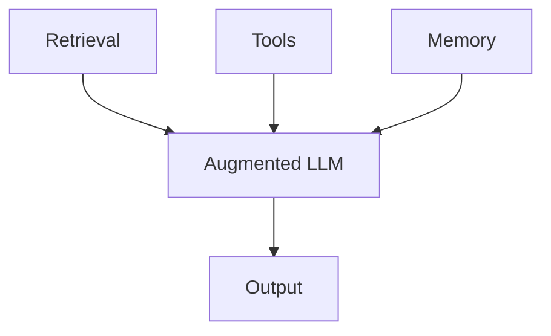
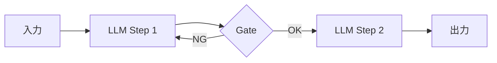
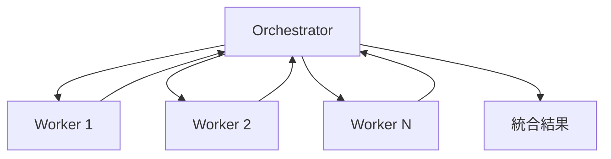

本記事は [Building Effective Agents (Anthropic Research, 2024年12月19日公開)](https://www.anthropic.com/research/building-effective-agents) の解説記事です。

## ブログ概要（Summary）

Anthropicが2024年12月に公開した「Building Effective Agents」は、LLMエージェントシステムの設計に関する公式ガイドである。著者のErik S.とBarry Zhangは、数十のチームとの協業経験を踏まえ、エージェントシステムを**ワークフロー**（事前定義されたコードパスによるオーケストレーション）と**エージェント**（LLMが自律的にプロセスを制御）の2つに分類し、5つのワークフローパターンと実装指針を体系化している。

この記事は [Zenn記事: Claude Codeサブエージェント設計パターン：3層マルチエージェントの実装手法](https://zenn.dev/0h_n0/articles/0c54d57a86a4a6) の深掘りです。

## 情報源

- **種別**: 企業テックブログ（Anthropic Research）
- **URL**: [https://www.anthropic.com/research/building-effective-agents](https://www.anthropic.com/research/building-effective-agents)
- **組織**: Anthropic
- **著者**: Erik S., Barry Zhang
- **発表日**: 2024年12月19日

## 技術的背景（Technical Background）

LLMを活用したアプリケーションが普及する中、単純なプロンプト→レスポンスのやり取りから、複数のLLM呼び出しを組み合わせた「エージェントシステム」への移行が進んでいる。しかし、フレームワークの乱立により、「エージェント」の定義が曖昧になっている問題がある。

Anthropicはこの混乱を整理するため、**ワークフロー**と**エージェント**を明確に区別した。著者らは「成功しているエージェント実装の多くは、複雑なフレームワークや専門ライブラリではなく、シンプルで組み合わせ可能なパターンで構築されている」と指摘している。

## 実装アーキテクチャ（Architecture）

### 基本構成要素: Augmented LLM

すべてのエージェントシステムの基盤は「Augmented LLM」——検索（Retrieval）、ツール（Tools）、メモリ（Memory）で拡張されたLLMである。



著者らは「現在のモデルはこれらの能力を能動的に使用できる——自ら検索クエリを生成し、適切なツールを選択し、保持すべき情報を決定する」と述べている。

### ワークフローとエージェントの区別

著者らによる定義は明確である：

- **ワークフロー**: 「LLMとツールが**事前定義されたコードパス**によってオーケストレーションされるシステム」
- **エージェント**: 「LLMが**自律的に**プロセスとツール使用を制御し、タスクの達成方法を自ら決定するシステム」

この区別はClaude Codeの3層構造に直接対応する。Dynamic Workflowsは「ワークフロー」に、サブエージェントは「エージェント」に分類される。

## 5つのワークフローパターン

### 1. Prompt Chaining（プロンプト連鎖）

タスクを連続したサブステップに分解し、各LLM呼び出しが前の出力を処理する。ステップ間にプログラム的なチェック（ゲート）を挿入して進捗を検証する。



**適用場面**: 固定されたサブタスクがあり、レイテンシ増加と引き換えに精度を向上させたい場合。例えば、マーケティングコピーの生成→翻訳、ドキュメントのアウトライン作成→本文執筆。

### 2. Routing（ルーティング）

入力を分類し、専門化されたフォローアップタスクに振り分ける。関心の分離と、入力カテゴリごとの専門プロンプトを実現する。

**適用場面**: カスタマーサポートの問い合わせ分類（一般質問/返金/技術サポート）、複雑さに応じたモデルティアへのルーティング。

Claude Codeのサブエージェント設計では、`description`フィールドの具体性がこのルーティング精度に直結する。

### 3. Parallelization（並列化）

複数のLLM操作を同時実行し、結果を集約する。2つのバリエーションがある：

- **Sectioning（セクション分割）**: タスクを独立した並列サブタスクに分割
- **Voting（投票）**: 同一タスクを複数回実行し、多様な出力を得る

**適用場面**: ガードレール実装（コンテンツスクリーニングとレスポンス生成を別インスタンスで）、複数プロンプトによるコード脆弱性レビュー。

Claude CodeのDynamic Workflowsにおける`parallel()`がこのパターンに対応する。

### 4. Orchestrator-Workers（オーケストレーター・ワーカー）

中央のLLMがタスクを動的に分解し、ワーカーLLMに委譲し、結果を統合する。Parallelizationとの違いは、サブタスクが事前定義ではなく**動的に決定される**点である。



**適用場面**: 複数ファイルにまたがるコード変更、複数情報源からの情報収集と分析。

これはClaude Codeのサブエージェント層（LLMの判断で委譲）に直接対応するパターンである。

### 5. Evaluator-Optimizer（評価者・最適化者）

一方のLLMがレスポンスを生成し、もう一方が評価とフィードバックを提供する反復ループ。明確な評価基準が存在し、反復的な改善が品質向上に寄与する場合に有効。

**適用場面**: ニュアンスのある文学翻訳、複数ラウンドの分析を要する複雑な検索タスク。

Zenn記事で紹介されている「計画・生成・評価」3分離パターンは、このEvaluator-Optimizerパターンを拡張したものである。

## エージェントパターン

著者らは、エージェントの実装は「しばしば直截的で、環境からのフィードバックに基づいてツールを使用するLLMのループに過ぎない」と述べている。

### エージェントに必要な要件

1. **複雑な入力の理解**: 曖昧さや矛盾を含む入力を解釈する能力
2. **推論と計画**: タスク達成に向けた複数ステップの計画策定
3. **信頼性の高いツール使用**: 適切なツールを正しいパラメータで呼び出す
4. **エラー回復**: 失敗からの復帰とリトライ
5. **環境からのグラウンドトゥルース**: ツール実行結果やコード実行結果による即座のフィードバック

### エージェントを使うべき場面

著者らは以下の条件を挙げている：

- ステップ数が予測できないオープンエンドな問題
- 固定パスをハードコードできないタスク
- 自律性が許容される信頼性の高い環境
- 明確な成功基準とフィードバックループがある

**トレードオフ**: 著者らは「レイテンシとコストの増大を、より優れたタスクパフォーマンスで相殺する」と明示している。

## ACI（Agent-Computer Interface）設計の原則

著者らが特に強調しているのが、ツール設計の重要性である。

### ツールプロンプトエンジニアリング

- **十分なトークン量を確保**: モデルの推論に必要な余地を与える
- **フォーマットの一貫性**: インターネット上の自然なテキストと整合的なフォーマット
- **フォーマットのオーバーヘッドを排除**: 行カウントや文字列エスケープなどの認知負荷を避ける

### 具体的な改善事例

SWE-benchエージェント開発において、相対パスから**絶対パス**に切り替えるだけでモデルのエラーが解消されたと著者らは報告している。これは、ツールインターフェースの設計がエージェント性能に直接影響することの具体例である。

### Poka-yoke原則

著者らは「ポカヨケ」の概念をツール設計に適用することを推奨している——すなわち、ミスを防ぐためのインターフェース設計である。

```python
# ❌ エラーを誘発する設計
def edit_file(path: str, content: str, line_number: int):
    """ファイルを編集する（行番号は0-indexed）"""
    pass

# ✅ Poka-yoke設計
def edit_file(
    absolute_path: str,
    old_content: str,
    new_content: str,
) -> dict[str, str]:
    """ファイル内のold_contentをnew_contentに置換する。
    absolute_pathは/で始まる絶対パスであること。
    old_contentはファイル内で一意に特定できる文字列であること。
    """
    pass
```

## パフォーマンス最適化（Performance）

### ワークフローパターン別のレイテンシとコストの傾向

著者らは各パターンのトレードオフを明示しているが、具体的な実測値は示していない。ここでは、ガイドの記述とClaude Code実装の公開情報を基に傾向を整理する。

| パターン | レイテンシ | コスト | 品質向上 |
|----------|----------|--------|---------|
| Prompt Chaining | 線形増加（ステップ数に比例） | 低〜中 | 中（ゲートによる品質保証） |
| Routing | 分類コスト＋選択パスのコスト | 低 | 中（専門プロンプトの効果） |
| Parallelization | 最長サブタスクに依存 | 中（並列分のトークン消費） | 高（投票による信頼性向上） |
| Orchestrator-Workers | 動的・予測困難 | 高 | 高（柔軟な分解と統合） |
| Evaluator-Optimizer | 反復回数に比例 | 高（複数ラウンド） | 最高（反復改善） |

著者らは「単純なプロンプトで十分な場合にこれらのパターンを適用すべきではない」と繰り返し強調しており、複雑さの追加が成果の改善を実証できた場合にのみ段階的に適用すべきだとしている。

### コスト最適化の実践的手法

著者らのガイドから導出される主なコスト最適化手法：

1. **モデルティアリング**: Routingパターンを使い、簡単なタスクをHaikuなど安価なモデルに、複雑なタスクのみOpus/Sonnetに振り分ける
2. **早期終了**: Prompt Chainingのゲートで不適切な入力を早期に棄却し、後続の高コストステップを省略する
3. **並列化の粒度制御**: Parallelizationでは必要最小限のインスタンス数に制限する
4. **キャッシング**: 同一入力への重複呼び出しを避けるため、セマンティックキャッシュを導入する

## コーディングエージェントへの特筆事項

著者らは、コーディングエージェントが特に有効な理由として以下を挙げている：

- **検証可能性**: ソリューションが自動テストで検証可能
- **反復的改善**: テストフィードバックに基づく繰り返し修正
- **明確な問題空間**: 問題の定義が比較的明確
- **客観的な品質評価**: 出力品質を客観的に測定可能

Claude Codeのサブエージェント設計（特にEvaluatorエージェント）が「PASS/FAILの二値判定」を採用しているのは、この検証可能性を最大限に活用するためである。

## 実践への示唆

### 3つの実装原則

1. **シンプルさを維持する**: 著者らは「LLM分野での成功は、最も洗練されたシステムを構築することではなく、ニーズに合った適切なシステムを構築することにある」と強調している
2. **透明性を優先する**: 明示的な計画ステップを通じた透明性の確保
3. **ACIを入念に設計する**: ツールのドキュメントとテストを重視

### フレームワークに関する注意

著者らはフレームワークの利用について「しばしば余分な抽象レイヤーを生み出し、基盤となるプロンプトとレスポンスを隠蔽して、デバッグを困難にする」と警告している。

## 運用での学び（Production Lessons）

### Anthropicが共有する実装上の教訓

著者らが数十のチームとの協業で得た教訓は、Claude Codeのマルチエージェント運用にも適用可能である。

**教訓1: 抽象化レイヤーの危険性**

著者らは「フレームワークはしばしば余分な抽象レイヤーを生み出し、基盤となるプロンプトとレスポンスを隠蔽して、デバッグを困難にする」と警告している。Claude Codeのサブエージェント定義がMarkdownファイルというシンプルな形式を採用しているのは、この教訓に基づいている。

**教訓2: 透明性の確保**

計画ステップを明示的に出力させることで、エージェントの意思決定過程を追跡可能にする。これは「計画・生成・評価」3分離パターンにおけるPlannerの計画ファイル出力に対応する。

**教訓3: サンドボックスの重要性**

著者らは「広範なテストをサンドボックス環境で行い、適切なガードレールを設ける」ことを推奨している。Claude Codeの`isolation: worktree`オプションは、この原則を実装レベルで実現する機能である。

**教訓4: 段階的な複雑さの追加**

「成功はシンプルなプロンプトから始まり、包括的な評価でそれを最適化し、シンプルなソリューションで不十分な場合にのみマルチステップのエージェントシステムを追加する」——この段階的アプローチは、Claude Codeの3層構造（サブエージェント → Dynamic Workflows → Agent Teams）を、下の層から順に検討すべきことを示唆している。

## 学術研究との関連（Academic Connection）

- **ReAct** (Yao et al., 2023): 推論（Reasoning）と行動（Acting）を交互に行うパターンは、本ガイドのエージェントループの学術的基盤
- **Toolformer** (Schick et al., 2023): ツール使用の自律的学習は、ACIの設計思想に影響を与えている
- **Chain-of-Thought** (Wei et al., 2022): プロンプト連鎖パターンの根底にある、ステップバイステップ推論の学術的根拠

本ガイドの特徴は、これらの学術的知見を**実装可能な設計パターン**として体系化した点にある。

## まとめと実践への示唆

Anthropicの「Building Effective Agents」は、以下の実践的指針を提供している：

1. **シンプルなプロンプトから始める**: 複雑さは、シンプルなソリューションで不十分な場合にのみ追加する
2. **5つのワークフローパターンを使い分ける**: タスクの特性に応じてPrompt Chaining → Routing → Parallelization → Orchestrator-Workers → Evaluator-Optimizerを選択
3. **エージェントは最後の手段**: 固定パスで対応できない、オープンエンドな問題にのみエージェントを使用する
4. **ツール設計に投資する**: ACI（Agent-Computer Interface）の品質がエージェント性能を左右する

Claude Codeのサブエージェント設計において、このガイドは基盤的な参考資料であり、Zenn記事で紹介されている3層構造やパターンの多くがここに起源を持つ。

## 参考文献

- **Blog URL**: [https://www.anthropic.com/research/building-effective-agents](https://www.anthropic.com/research/building-effective-agents)
- **Claude Agent SDK**: [https://docs.anthropic.com/en/docs/agents-and-tools/claude-agent-sdk](https://docs.anthropic.com/en/docs/agents-and-tools/claude-agent-sdk)
- **Related Zenn article**: [https://zenn.dev/0h_n0/articles/0c54d57a86a4a6](https://zenn.dev/0h_n0/articles/0c54d57a86a4a6)
