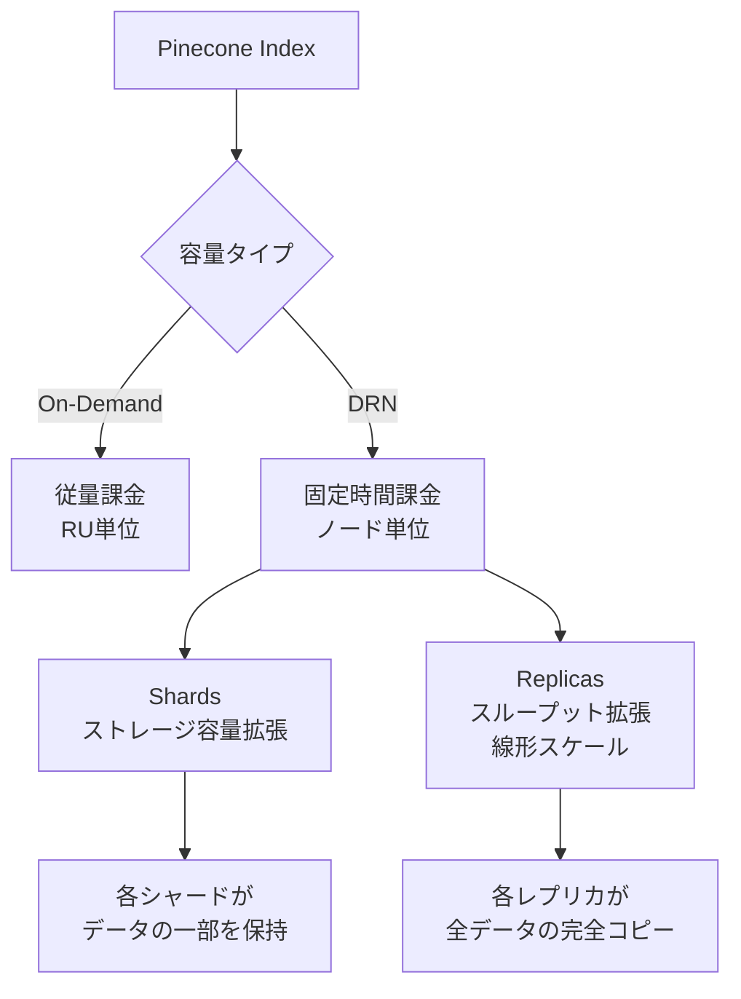
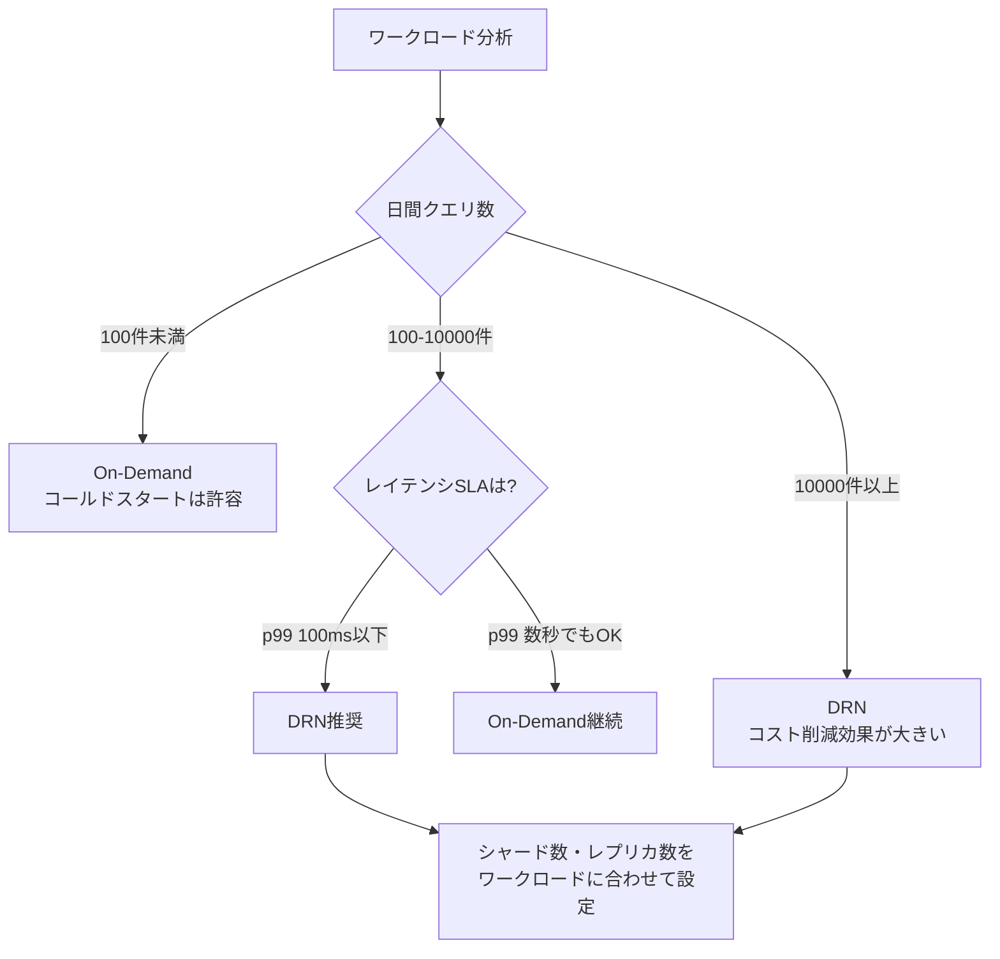

本記事は [Pinecone公式ブログ: Dedicated Read Nodes GA](https://www.pinecone.io/blog/dedicated-read-nodes-ga/) の解説記事です。

## ブログ概要（Summary）

Pineconeは2026年4月15日、Dedicated Read Nodes（DRN）の一般提供（GA）を発表した。DRNは、サーバーレスベクトルDBの根本的な課題であるコールドスタートレイテンシを、専用のメモリ+ローカルSSD上にデータを常駐させることで構造的に排除する。2025年12月のパブリックプレビュー開始から約4ヶ月でGAに到達し、最大97%のコスト削減（On-Demand比）を達成したケースが報告されている。

この記事は [Zenn記事: サーバーレスベクトルDB選定2026：5サービスの課金・性能・コスト比較](https://zenn.dev/0h_n0/articles/bc0d17d1fe8b8a) の深掘りです。

## 情報源

- **種別**: 企業テックブログ
- **URL**: [https://www.pinecone.io/blog/dedicated-read-nodes-ga/](https://www.pinecone.io/blog/dedicated-read-nodes-ga/)
- **組織**: Pinecone（ベクトルデータベースプロバイダ）
- **発表日**: 2026年4月15日
- **著者**: Gavin Johnson

## 技術的背景（Technical Background）

### サーバーレスベクトルDBのコールドスタート問題

サーバーレスベクトルDBは、クエリがない時間帯にリソースを解放することでコストを削減する。しかし、5〜10分間アクセスがないネームスペースでは、データがメモリからevictされ、次回のクエリ時にオブジェクトストレージからの再ロードが必要となる。この「コールドスタート」により、通常5-10msのレイテンシが200-800msに跳ね上がる。

この問題は、以下のワークロードで特に深刻となる：

- **レコメンドシステム**: ユーザーセッション開始時のレスポンス遅延がコンバージョン率に直結する
- **リアルタイムRAG**: エージェントワークフローで複数のベクトル検索を連鎖させる場合、コールドスタートが累積する
- **SLA要件のある本番サービス**: p99レイテンシ保証が求められる環境

### DRNの設計思想

DRNは、サーバーレスの従量課金モデルと専用インスタンスの予測可能な性能を両立させる設計を採用している。Pineconeのブログによると、DRNはデータを「メモリとローカルSSD上に常時保持する専用のデータパス」を提供し、コールドスタートを完全に排除する。

## 実装アーキテクチャ（Architecture）

### DRNのスケーリングモデル

DRNは、Shards（シャード）とReplicas（レプリカ）の2軸でスケーリングする：



Pineconeのブログ記事によると：
- **Shards**: ストレージ容量の拡張に使用。データを分割して各シャードに配置する
- **Replicas**: スループットの拡張に使用。レプリカ数に比例してQPSがほぼ線形にスケールする

重要な設計上のポイントとして、1つのPineconeプロジェクト内でOn-DemandインデックスとDRNインデックスを混在させることが可能である。開発・テスト環境はOn-Demand、本番環境のみDRNとする運用が推奨されている。

### マイグレーションパス

ブログによると、On-DemandインデックスからDRNへの移行は「単一のAPI呼び出し」で完了し、再インデックス・ダウンタイム・アプリケーション変更は不要とされている。

```python
from pinecone import Pinecone

pc = Pinecone(api_key="your-api-key")

# 既存のOn-DemandインデックスをDRNに変更
# ブログの記載: "single API call transition"
pc.configure_index(
    name="my-production-index",
    spec={
        "serverless": {
            "cloud": "aws",
            "region": "us-east-1",
            "capacity_mode": "dedicated_read_nodes",
            "replicas": 2,
            "shards": 1,
        }
    },
)
```

## パフォーマンス最適化（Performance）

### GA発表時のベンチマーク結果

Pineconeのブログでは、3つの本番ワークロードシナリオでのコスト削減率が報告されている。

| シナリオ | ベクトル数 | QPS | コスト削減率 |
|---------|----------|-----|------------|
| 大規模検索 | 10億 | 8 QPS | 77% |
| 低レイテンシ検索 | 610万 | 20-50 QPS | 83% |
| 高QPSレコメンド | 1,400万 | 200-270 QPS | 97% |

ブログの記載によると、「固定時間あたりのノード課金」がOn-Demandの「クエリあたりのRU課金」を大幅に下回るのは、クエリ頻度が高い場合（概ね日1万件以上）である。低頻度クエリ環境ではOn-Demandの方がコスト効率が高い。

### 実測傾向の分析

ブログおよびサードパーティレビュー（Zenn記事の参考文献より）に基づくDRNのレイテンシ傾向：

| 指標 | On-Demand（Warm） | On-Demand（Cold） | DRN |
|------|------------------|------------------|-----|
| p50 | 5-10ms | 200-800ms | 26-31ms |
| p99 | 20-50ms | 数秒の場合あり | 60-170ms |
| コールドスタート | あり | ― | なし |

DRNのp50がOn-DemandのWarm時より高い（26-31ms vs 5-10ms）点は注意が必要である。ブログが報告している26-31msの値は、480M〜1.4Bベクトルという大規模データセットでの測定値であり、データ規模に依存する。

### ZoomInfoのケーススタディ

ブログでは、ZoomInfoの導入事例が紹介されている。同社は3億9,000万以上のコンタクトEmbeddingをリアルタイムレコメンドに使用しており、DRNのT1ノード構成で安定した低レイテンシ性能を実現しているとされている。

## GA時点で追加された4機能

ブログによると、GA時点で以下の4つの本番向け機能が追加された：

1. **クエリ単位の性能/再現率トレードオフ設定**: クエリごとに精度と速度のバランスを調整可能
2. **メトリクスエクスポート**: Datadog、Grafana等の外部監視ツールへのメトリクス連携
3. **Webコンソール管理**: GUI経由でのDRN設定・監視
4. **マルチネームスペースサポート**: 早期アクセス段階。複数ネームスペースのDRN対応

## 運用での学び（Production Lessons）

### DRN vs On-Demandの選択指針

ブログの情報とZenn記事の分析を統合すると、以下の選択指針が導出される：



### コスト構造の理解

DRNのコスト構造は「ノード数 × 時間単価」の固定課金であり、On-Demandの「RU単位の従量課金」と本質的に異なる。この違いにより：

- **高稼働率ワークロード**: DRNの固定コストが有利（予約容量を使い切れる）
- **低稼働率ワークロード**: On-Demandの従量課金が有利（使わない時間のコストがゼロ）
- **バースト型ワークロード**: On-Demandの方がピーク時以外のコストを抑えられる

ブログが報告する「97%のコスト削減」は、高QPS（200-270 QPS）環境でDRNの予約容量を高い稼働率で使い切った場合の数値であり、すべてのワークロードに当てはまるわけではない。

### 競合サービスとの比較

DRNの設計は、サーバーレスベクトルDBのコールドスタート問題に対する解決策の一つであるが、他サービスも類似の課題に取り組んでいる：

- **Qdrant Cloud**: 常時起動型のクラスタモデルを採用しており、設計上コールドスタートが発生しない。ただし常時課金が発生する
- **Turbopuffer**: pre-warm APIを提供。ネームスペース単位でデータをキャッシュに事前ロードする。ただし、多数のネームスペースを事前warmするとコストが増加する
- **Weaviate Cloud**: テナント単位のアクティブ/インアクティブ状態管理。テナント数が多い場合のコールドスタートが課題

DRNのユニークな点は、On-Demandインデックスとの混在が可能で、既存インデックスからの無停止移行が可能な点である。

## Production Deployment Guide

### PineconeインデックスのDRN移行判定とコストモデリング

DRNへの移行を検討する際、コストモデリングが最も重要な判断材料となる。以下にOn-DemandとDRNのコスト比較モデルを示す。

```python
from dataclasses import dataclass


@dataclass
class PineconeCostEstimate:
    """Pineconeのコスト見積もりモデル

    ブログの報告値に基づく概算。実際の料金はPinecone公式の
    料金見積もりツール（pinecone.io/pricing/estimate）で確認すること。
    """

    vectors_count: int
    dimension: int
    queries_per_day: int
    avg_ru_per_query: float = 1.0

    @property
    def storage_gb(self) -> float:
        """ストレージ使用量の概算（GB）"""
        bytes_per_vector = self.dimension * 4  # float32
        metadata_overhead = 1.08  # メタデータ約8%
        return (self.vectors_count * bytes_per_vector * metadata_overhead) / (1024**3)

    def on_demand_monthly_cost(self) -> float:
        """On-Demand月額コスト概算（USD）

        RU単価: $16/100万RU（Standardプラン）
        ストレージ: $0.33/GB/月
        """
        monthly_queries = self.queries_per_day * 30
        ru_cost = (monthly_queries * self.avg_ru_per_query / 1_000_000) * 16
        storage_cost = self.storage_gb * 0.33
        return ru_cost + storage_cost

    def drn_monthly_cost(self, node_hourly_rate: float, num_nodes: int) -> float:
        """DRN月額コスト概算（USD）

        ノード時間単価 × ノード数 × 730時間/月
        """
        return node_hourly_rate * num_nodes * 730

    def breakeven_qps(self, node_hourly_rate: float, num_nodes: int) -> float:
        """損益分岐QPSの算出

        On-DemandとDRNのコストが等しくなるQPSを計算する。
        """
        drn_monthly = self.drn_monthly_cost(node_hourly_rate, num_nodes)
        storage_cost = self.storage_gb * 0.33
        available_for_ru = drn_monthly - storage_cost
        monthly_queries = (available_for_ru / 16) * 1_000_000 / self.avg_ru_per_query
        return monthly_queries / (30 * 24 * 3600)
```

### DRN構成の選択ガイドライン

ブログの情報に基づく構成選択の指針：

| ワークロード規模 | ベクトル数 | 推奨QPS範囲 | 推奨構成 |
|---------------|----------|-----------|---------|
| Small | ~1000万 | 10-50 QPS | 1 shard, 1 replica |
| Medium | ~1億 | 50-500 QPS | 1-2 shards, 2-4 replicas |
| Large | 10億+ | 500+ QPS | 4+ shards, 4+ replicas |

**レプリカ数の決定**: ブログによるとレプリカによるQPSスケーリングは「ほぼ線形」であるため、目標QPSをシングルレプリカの実測QPSで割ることでレプリカ数を算出できる。

**シャード数の決定**: 各シャードが保持できるデータ量はノードタイプに依存する。ストレージ容量を超える場合にシャード数を増やす。

### 監視と運用

DRN環境で監視すべき主要メトリクス：

```python
import boto3


def setup_pinecone_monitoring(index_name: str, alarm_topic_arn: str) -> None:
    """PineconeメトリクスのCloudWatchアラーム設定

    DRNのGA機能「メトリクスエクスポート」を使用して
    外部監視ツールに連携する前提。
    """
    cloudwatch = boto3.client("cloudwatch")

    # レイテンシ異常検知: DRNではコールドスタートがないため
    # p99が急上昇した場合はノード過負荷の可能性
    cloudwatch.put_metric_alarm(
        AlarmName=f"pinecone-drn-{index_name}-latency",
        ComparisonOperator="GreaterThanThreshold",
        EvaluationPeriods=3,
        MetricName="QueryLatencyP99",
        Namespace="Pinecone/DRN",
        Period=300,
        Statistic="Maximum",
        Threshold=200,  # p99 200ms超過でアラート
        AlarmActions=[alarm_topic_arn],
        AlarmDescription="DRNレイテンシ異常: レプリカ追加を検討",
    )

    # QPS容量監視: レプリカあたりの上限に近づいたら通知
    cloudwatch.put_metric_alarm(
        AlarmName=f"pinecone-drn-{index_name}-qps-capacity",
        ComparisonOperator="GreaterThanThreshold",
        EvaluationPeriods=2,
        MetricName="QueriesPerSecond",
        Namespace="Pinecone/DRN",
        Period=60,
        Statistic="Average",
        Threshold=800,  # 設定上限の80%でアラート
        AlarmActions=[alarm_topic_arn],
        AlarmDescription="DRN QPS容量80%到達: スケールアウト検討",
    )
```

## 学術研究との関連（Academic Connection）

DRNのアーキテクチャは、「Vector Search for the Future」（arXiv:2601.01937）で分析されているクラウドネイティブベクトル検索の進化と密接に関連している。同論文が示す3層ストレージ階層（メモリ→SSD→オブジェクトストレージ）において、DRNは「メモリ+ローカルSSD」層のリソースを予約し、オブジェクトストレージへのフォールバックを排除する設計と解釈できる。

また、「Cloud-Native Vector Search」（arXiv:2511.14748）で報告されたキャッシュ容量とインデックス性能の関係は、DRNがキャッシュ容量を事実上100%に引き上げることでインデックスタイプ間の性能差を解消するメカニズムを理論的に裏付けている。

## まとめと実践への示唆

Pinecone DRNは、サーバーレスベクトルDBの「コスト効率」と「予測可能な低レイテンシ」のトレードオフを解消する重要なアーキテクチャ進化である。ただし、すべてのワークロードでOn-Demandより有利になるわけではなく、日間クエリ数・レイテンシSLA・コスト予算に基づいた選択が必要である。コスト削減効果の報告値（77-97%）は高稼働率環境での数値であり、自社ワークロードでの試算が不可欠である。

## 参考文献

- **Blog URL**: [https://www.pinecone.io/blog/dedicated-read-nodes-ga/](https://www.pinecone.io/blog/dedicated-read-nodes-ga/)
- **Related Papers**: [https://arxiv.org/abs/2601.01937](https://arxiv.org/abs/2601.01937), [https://arxiv.org/abs/2511.14748](https://arxiv.org/abs/2511.14748)
- **Related Zenn article**: [https://zenn.dev/0h_n0/articles/bc0d17d1fe8b8a](https://zenn.dev/0h_n0/articles/bc0d17d1fe8b8a)
