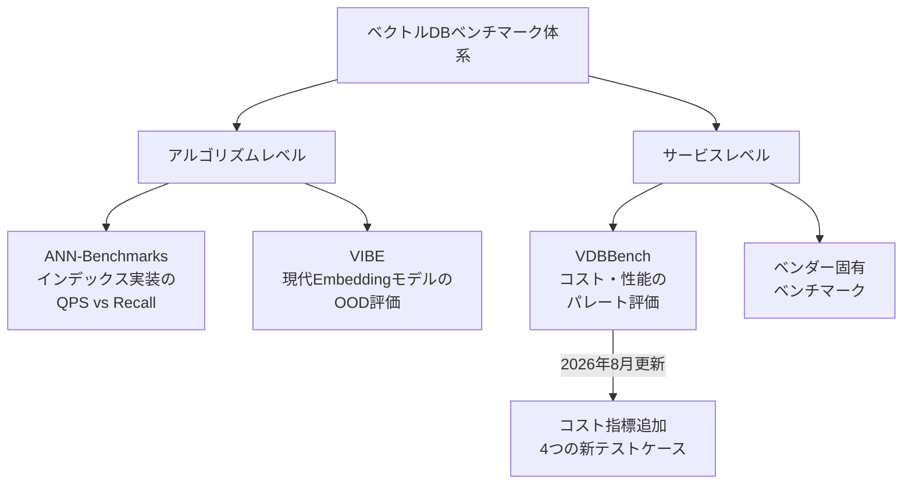
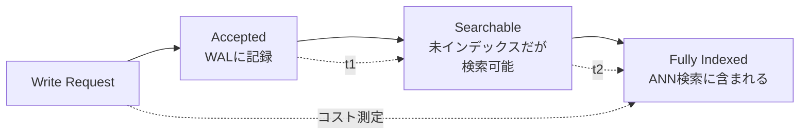
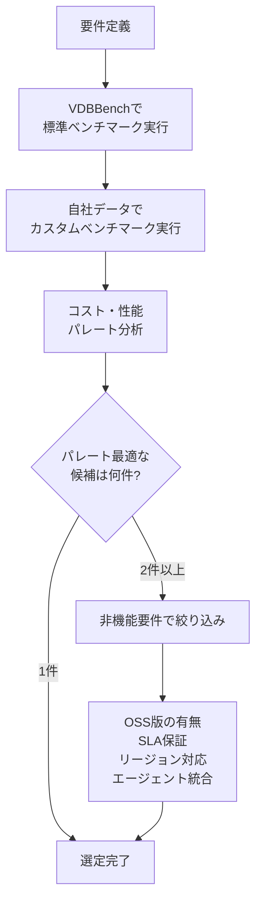

本記事は [MarTech Series: Zilliz Adds Cost-Aware Benchmarking to VDBBench](https://martechseries.com/analytics/data-management-platforms/zilliz-adds-cost-aware-benchmarking-to-vdbbench-the-open-source-vector-database-benchmark/) の解説記事です。

## ブログ概要（Summary）

Zilliz社は2026年8月、オープンソースのベクトルデータベースベンチマークVDBBench（VectorDBBench）に、コストを第一級の評価指標として追加する大幅アップデートを発表した。従来のベンチマークはピークQPS（Queries Per Second）を静的データで測定するものが主流だったが、本アップデートでは「Insert readiness（書き込みから検索可能になるまでのコスト）」「Payload-aware search（フィルタ・ペイロード形状がQPS/レイテンシ/Recallに与える影響）」「Multitenant search（マルチテナントスループット）」「Cold-start latency（コールドスタートレイテンシ）」の4つのテストケースが追加された。Zilliz社のVP of Engineering James Luan氏は「ほとんどのベンチマークは1つの質問にしか答えない — 理想的なデータでどれだけ速いか」と述べ、本番環境での選定に必要な多面的評価の必要性を強調している。

この記事は [Zenn記事: サーバーレスベクトルDB選定2026：5サービスの課金・性能・コスト比較](https://zenn.dev/0h_n0/articles/bc0d17d1fe8b8a) の深掘りです。

## 情報源

- **種別**: 企業テックブログ / プレスリリース
- **URL**: [https://martechseries.com/analytics/data-management-platforms/zilliz-adds-cost-aware-benchmarking-to-vdbbench-the-open-source-vector-database-benchmark/](https://martechseries.com/analytics/data-management-platforms/zilliz-adds-cost-aware-benchmarking-to-vdbbench-the-open-source-vector-database-benchmark/)
- **組織**: Zilliz（Milvusの商用版Zilliz Cloudを提供）
- **発表日**: 2026年8月
- **関連リポジトリ**: [https://github.com/zilliztech/VectorDBBench](https://github.com/zilliztech/VectorDBBench)

## 技術的背景（Technical Background）

### 従来のベクトルDBベンチマークの限界

ベクトルDBの性能評価は、長らく「静的データセットに対するピークQPS」と「Recall@k」の2軸で行われてきた。代表的なベンチマークにはANN-Benchmarks、Big-ANN-Benchmarks（NeurIPS 2023）、VIBE（VecDB@VLDB 2026）がある。

しかし、これらのベンチマークには本番環境での選定に不可欠な以下の視点が欠けていた：

1. **コスト**: 同じQPSを達成するのにいくらかかるか？
2. **書き込み可用性**: データを書き込んでから検索可能になるまでの時間は？
3. **フィルタ検索の影響**: メタデータフィルタやペイロード返却がQPSにどう影響するか？
4. **マルチテナント**: 数千テナントが共存する環境での実効スループットは？
5. **コールドスタート**: アイドル後の初回クエリのレイテンシは？

### VDBBenchの位置づけ

VDBBenchはZilliz社が開発・公開するオープンソースベンチマークで、30以上のベクトルDBおよび検索システムをサポートする。ベンダー中立を標榜しており、すべてのテスト結果はリポジトリ内のコードで再現可能である。



## 実装アーキテクチャ（Architecture）

### 4つの新テストケースの詳細

#### 1. Insert Readiness & Write Cost

このテストケースは、「書き込みが受理された」「データが検索可能になった」「完全にインデックス化された」の3段階を区別し、各段階までのコストを測定する。



この区別が重要な理由は、サービスによって各段階の挙動が大きく異なるためである：

- **Pinecone Serverless**: 書き込み後数秒で検索可能だが、完全なインデックス化には分単位を要する場合がある
- **Turbopuffer**: WALに記録後即座に検索可能（未インデックスデータはブルートフォーススキャン）だが、完全なインデックス化は非同期で行われる
- **Qdrant Cloud**: 書き込みとインデックス化がほぼ同期的に行われ、遅延は最小

#### 2. Payload-Aware Search

従来のベンチマークは「ベクトルIDのみを返す」検索を測定していたが、本番環境ではメタデータ（ペイロード）の返却やフィルタリングが必須である。このテストケースでは：

- フィルタ条件の有無によるQPS変動
- レスポンスに含まれるデータ量（ID のみ vs メタデータ付き vs ベクトル込み）の影響
- Recallへのフィルタリング影響

を測定する。フィルタ検索のRecall低下は、Zenn記事の「よくある問題と対処法」で取り上げた「フィルタ付き検索でRecall低下」の問題に直接関連する。

#### 3. Multitenant Search

SaaSアプリケーションでは、数千のテナントが同一のベクトルDBインスタンスを共有する。このテストケースでは、テナント数の増加に伴うスループットの変化を測定する。

テナント分離の実装方式によって性能特性が異なる：

| 分離方式 | テナント追加の影響 | 代表サービス |
|---------|----------------|------------|
| Namespace | 検索対象が限定されるため性能向上の可能性 | Pinecone, Turbopuffer |
| ネイティブMulti-tenancy | テナント単位でベクトルが分離され性能安定 | Weaviate |
| Collection分離 | テナントごとに独立だが管理コスト増 | Qdrant |
| Partition Key | パーティション数に制限あり | Zilliz Cloud |

#### 4. Cold-Start Latency

サーバーレスベクトルDBでは、一定時間アクセスがないコレクション/ネームスペースへの初回クエリで追加レイテンシが発生する。このテストケースでは：

- アイドル時間後の初回クエリレイテンシ
- Warm状態に復帰するまでのクエリ数
- Cold→Warm遷移中のRecall変動

を測定する。この指標はZenn記事で詳細に分析したPinecone DRN vs On-Demandの比較に直接関連する。

### Cost Leaderboardの設計

VDBBenchのCost Leaderboardは、コスト対性能のパレートフロントを可視化する。従来の「QPS vs Recall」に加え、「$/QPS」（1 QPSあたりのコスト）を軸とすることで、性能だけでなくコスト効率での比較が可能になる。

$$
\text{Cost Efficiency} = \frac{\text{QPS}_{\text{achieved}}}{\text{Monthly Cost (USD)}}
$$

$$
\text{Pareto Optimal} = \{(c, q, r) \mid \nexists (c', q', r') : c' \leq c \land q' \geq q \land r' \geq r\}
$$

ここで$c$は月額コスト、$q$はQPS、$r$はRecall@kである。3次元のパレートフロントを構成することで、「予算$X以内で最大のQPSを達成するサービスはどれか」「Recall 0.95以上を維持しつつ最低コストのサービスはどれか」といった実務的な問いに答えられる。

### 初回評価対象サービス

Cost Leaderboardの初回評価では、以下のサービスが含まれている：

- **Pinecone**: On-DemandおよびDRN
- **Turbopuffer**: Launch/Scale
- **Zilliz Cloud**: Serverless

この選定は「freshness（書き込み可用性）」「filtering（フィルタ検索）」「multitenancy（マルチテナント）」「cold-start（コールドスタート）」の4軸での性能バリエーションが大きいサービスを代表として選んだものとされている。

## パフォーマンス最適化（Performance）

### ベンチマーク実施時の注意点

VDBBenchの結果を解釈する際の注意事項：

1. **再現性の確保**: すべてのテスト設定はリポジトリ内に公開されている。ベンダーの公称値ではなく、自社環境で再現実行することが推奨される

2. **ワークロード代表性**: VDBBenchの標準データセットが自社のワークロードを代表するとは限らない。次元数・フィルタ条件・テナント数・書き込み頻度が異なる場合、結果が大きく変わる可能性がある

3. **コスト変動**: クラウドサービスの料金は頻繁に変更される。VDBBenchのコスト計算はテスト時点の料金に基づくため、定期的な再評価が必要

```python
from dataclasses import dataclass


@dataclass
class VDBBenchResult:
    """VDBBenchテスト結果のデータモデル"""

    service_name: str
    qps: float
    recall_at_10: float
    p99_latency_ms: float
    monthly_cost_usd: float
    cold_start_p50_ms: float | None = None
    insert_to_searchable_ms: float | None = None

    @property
    def cost_per_qps(self) -> float:
        """1 QPSあたりの月額コスト"""
        return self.monthly_cost_usd / self.qps if self.qps > 0 else float("inf")

    @property
    def cost_efficiency_score(self) -> float:
        """コスト効率スコア（高いほど良い）

        QPS × Recall / Cost で正規化
        """
        if self.monthly_cost_usd == 0:
            return float("inf")
        return (self.qps * self.recall_at_10) / self.monthly_cost_usd


def find_pareto_optimal(
    results: list[VDBBenchResult],
) -> list[VDBBenchResult]:
    """パレート最適なサービスを抽出する

    コスト・QPS・Recallの3軸でパレートフロントを構成。
    どの軸でも他に劣後しないサービスのみを返す。

    Args:
        results: VDBBenchの全テスト結果

    Returns:
        パレート最適なサービスのリスト
    """
    pareto = []
    for r in results:
        dominated = False
        for other in results:
            if (
                other.monthly_cost_usd <= r.monthly_cost_usd
                and other.qps >= r.qps
                and other.recall_at_10 >= r.recall_at_10
                and (
                    other.monthly_cost_usd < r.monthly_cost_usd
                    or other.qps > r.qps
                    or other.recall_at_10 > r.recall_at_10
                )
            ):
                dominated = True
                break
        if not dominated:
            pareto.append(r)
    return pareto
```

## 運用での学び（Production Lessons）

### VDBBenchを活用した選定フレームワーク

VDBBenchのコスト指標を活用したベクトルDB選定の実務的フレームワークを以下に示す：



### ベンダーロックイン対策

VDBBenchの結果に基づいて選定した後も、将来のサービス変更（料金改定、性能変化、サービス終了）に備えて、以下の対策が推奨される：

1. **抽象化レイヤーの導入**: LangChainやLlamaIndexのVectorStoreインターフェース経由でアクセスし、バックエンドの切り替えを容易にする

2. **定期的な再評価**: VDBBenchのテストを四半期ごとに再実行し、コスト・性能の変化を追跡する

3. **デュアルライト検証**: 移行検討時に、現行サービスと候補サービスの両方にデータを書き込み、クエリ結果を比較する

## 学術研究との関連（Academic Connection）

VDBBenchのコスト指標追加は、ベクトル検索の研究コミュニティにおける評価パラダイムの変化を反映している。VIBE（arXiv:2505.17810）がアルゴリズムレベルのRecall-QPSパレートフロントを提供する一方、VDBBenchはサービスレベルのコスト-性能パレートフロントを提供する。両者は相補的であり、アルゴリズム選択（VIBE）とサービス選択（VDBBench）の2段階で評価を行うことが推奨される。

また、「Cloud-Native Vector Search」（arXiv:2511.14748）で報告されたキャッシュとインデックス最適化の競合は、VDBBenchのCold-Start Latencyテストケースで実環境での影響を定量化する手段を提供する。

## まとめと実践への示唆

VDBBenchへのコスト指標追加は、ベクトルDB選定において「速さ」だけでなく「いくらで達成できるか」を客観的に評価する手段を提供する。4つの新テストケース（Insert readiness、Payload-aware search、Multitenant search、Cold-start latency）は、Zenn記事で分析した5サービスの差別化ポイント（課金モデル、コールドスタート、マルチテナント設計）を定量的に検証するための業界標準ツールとなる可能性がある。ベンダー公称値ではなく、オープンソースツールによる独立検証が選定の信頼性を高める。

## 参考文献

- **Blog URL**: [https://martechseries.com/analytics/data-management-platforms/zilliz-adds-cost-aware-benchmarking-to-vdbbench-the-open-source-vector-database-benchmark/](https://martechseries.com/analytics/data-management-platforms/zilliz-adds-cost-aware-benchmarking-to-vdbbench-the-open-source-vector-database-benchmark/)
- **Code**: [https://github.com/zilliztech/VectorDBBench](https://github.com/zilliztech/VectorDBBench)
- **Related Papers**: [https://arxiv.org/abs/2505.17810](https://arxiv.org/abs/2505.17810) (VIBE), [https://arxiv.org/abs/2511.14748](https://arxiv.org/abs/2511.14748) (Cloud-Native Vector Search)
- **Related Zenn article**: [https://zenn.dev/0h_n0/articles/bc0d17d1fe8b8a](https://zenn.dev/0h_n0/articles/bc0d17d1fe8b8a)
