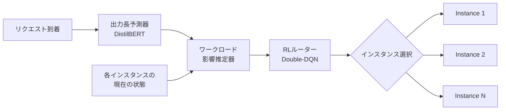

本記事は [Intelligent Router for LLM Workloads: Improving Performance Through Workload-Aware Load Balancing](https://arxiv.org/abs/2408.13510) の解説記事です。

## 論文概要（Abstract）

本論文は、LLM推論クラスタにおける負荷分散の非効率性を解決するインテリジェントルーターを提案する。LLM推論はprefill（プロンプト処理）とdecode（トークン生成）の2フェーズで構成されるが、従来のスケジューリングアルゴリズムはこの特性を無視している。著者らは、出力長予測器（fine-tuned DistilBERT）、ワークロード影響推定器（解析モデル）、強化学習ルーター（Double-DQN）の3コンポーネントからなるシステムを構築し、公開データセットでRound-Robinに対し11.43%のレイテンシ削減、実運用ワークロードで7.84%の改善を達成したと報告している。

この記事は [Zenn記事: Azure OpenAI負荷分散の障害シナリオ別レジリエンス設計とBicep実装](https://zenn.dev/0h_n0/articles/47e8c9dbd585ff) の深掘りです。

## 情報源

- **arXiv ID**: 2408.13510
- **URL**: [https://arxiv.org/abs/2408.13510](https://arxiv.org/abs/2408.13510)
- **著者**: Kunal Jain, Anjaly Parayil, Ankur Mallick, Esha Choukse et al.（Microsoft Research）
- **発表年**: 2024（2025年1月改訂）
- **分野**: cs.DC（分散コンピューティング）, eess.SY（システム・制御）

## 背景と動機（Background & Motivation）

大規模言語モデル（LLM）の推論サービスでは、複数のGPUインスタンスにリクエストを分散することが不可欠である。しかし、LLM推論には従来のWebサービスとは根本的に異なる特性がある。

LLM推論は大きく2つのフェーズに分かれる。第1のprefillフェーズではプロンプト全体を並列処理してKVキャッシュを構築し、第2のdecodeフェーズではトークンを1つずつ逐次生成する。prefillはcompute-bound（演算律速）、decodeはmemory-bound（メモリ帯域律速）であり、同一インスタンスにこれらが混在するとリソース競合が発生する。

従来のRound-Robin（RR）やJoin Shortest Queue（JSQ）などのスケジューリング手法はこのフェーズ特性を考慮しないため、非効率な負荷分散が生じる。著者らの予備実験では、JSQやLeast Connection（LC）といった古典的手法はRRに対し0.46%から2.60%程度の改善にとどまったと報告されている。この限界を打破するため、ワークロードの内部特性を理解したインテリジェントなルーティングが求められている。

## 主要な貢献（Key Contributions）

- **ワークロード特性の定式化**: LLM推論のprefill/decodeフェーズが他リクエストに与えるレイテンシペナルティを解析的にモデル化
- **出力長予測器**: fine-tuned DistilBERTにより、リクエスト到着時点で出力トークン数を79.15%の精度で予測
- **ヒューリスティック誘導型強化学習**: Double-DQNに古典的ヒューリスティクスの知識を組み込み、学習の安定化と収束速度を改善するフレームワークを提案
- **実運用データでの検証**: 公開データセットだけでなく、実際のクラウドプロバイダーのワークロードトレースで有効性を確認
- **ハードウェア横断の汎用性**: V100およびA100 GPU、さらに異なる推論最適化スタック間で頑健に動作することを実証

## 技術的詳細（Technical Details）

### システムアーキテクチャ

提案システムは以下の3コンポーネントで構成される。



### 出力長予測器（Output Length Predictor）

リクエスト到着時には入力プロンプトのみが既知であり、出力トークン数は不明である。decodeフェーズの所要時間は出力長に比例するため、正確な出力長予測がルーティング品質に直結する。

著者らはDistilBERTをfine-tuningし、プロンプトテキストから出力長を5クラス（Very Short / Short / Medium / Long / Very Long）に分類する。論文Table 4より、全体精度は79.15%、特にVery Short（86.50%）とVery Long（89.50%）の両端クラスで高精度を達成したと報告されている。

### ワークロード影響推定器（Workload Impact Estimator）

あるリクエスト $r_i$ を特定のインスタンス $m$ にルーティングした場合の「既存リクエストへのレイテンシペナルティ」と「新規リクエスト自身のレイテンシ」を解析的に推定する。

インスタンス $m$ 上で既にバッチ処理中のリクエスト集合を $R_m$ とし、各リクエスト $r_j$ のプロンプト長を $p_j^m$、残りデコード長を $d_j^m$ とする。新規リクエスト $r_i$ のプロンプト長を $p_i$、予測デコード長を $d_i$ とする。

**Prefillフェーズのペナルティ**

新規リクエストのprefill処理が既存バッチに与えるレイテンシ増加を以下の式で推定する：

$$
T_p^m = \text{grad}_1 \cdot \left( p_i^2 + \sum_{r_j \in R_m} (p_j^m + d_j^m) \right)
$$

ここで $\text{grad}_1$ はハードウェア依存の勾配パラメータである。$p_i^2$ の二次項は、長いプロンプトのprefill処理がcompute-boundであり、処理時間がプロンプト長の二乗に比例する特性を反映している。

**Decodeフェーズのペナルティ**

decode処理中の新規リクエスト自身のレイテンシ推定は以下で行う：

$$
r_d^m = -\text{grad}_2 \cdot \sum_{r_j \in R_m} (p_j^m + d_j^m) + p_i + d_i
$$

ここで $\text{grad}_2$ は負の勾配パラメータであり、バッチサイズが増加するとdecodeのスループットが向上する（memory-boundであるため、バッチ化による帯域効率の改善）ことを表現している。

**総合ペナルティスコア**

インスタンス $m$ への割り当てコストは $T_p^m$ と $r_d^m$ の加重和として算出され、RLルーターの報酬関数に入力される。

### 強化学習ルーター（RL Router）

Double-DQN（Double Deep Q-Network）をベースとし、状態空間は各インスタンスの現在のバッチ構成（各リクエストのprefill/decode状態、プロンプト長、残りデコード長）、行動空間はルーティング先インスタンスの選択である。

#### ヒューリスティック誘導（Heuristic Guidance）

著者らの重要な貢献は、古典的ヒューリスティクス（JSQ、LC等）の知識をRLの学習過程に組み込む手法である。ヒューリスティクス $h_k$ がインスタンス $a_k$ を推薦する場合、そのインスタンスに対する割引率を以下で修正する：

$$
\tilde{\gamma}_k = \lambda_k \cdot \gamma
$$

ここで $\lambda_k$ は指数減衰するスケーリング係数で、学習初期にはヒューリスティクスの影響を強くし、RLエージェントが学習を進めるにつれて自律的な判断に移行する。具体的には、エピソード番号に対して指数的に $\lambda_k \to 1$ となるよう設計されている。

この設計により、RLエージェントはランダム探索から始めるのではなく、合理的な初期方策から出発できる。結果として学習の安定性が向上し、収束までのエピソード数が削減される。

## 実装のポイント（Implementation Notes）

### 出力長予測器の学習

DistilBERTのfine-tuningには、実運用ログから抽出したプロンプト・出力長ペアを使用する。5クラス分類のしきい値は等分位数で設定し、クラス間のサンプル数バランスを確保する。推論時のオーバーヘッドはGPU使用時0.01秒、CPU使用時0.8秒と報告されている（論文Section 5.6より）。

### 勾配パラメータのキャリブレーション

$\text{grad}_1$ および $\text{grad}_2$ はハードウェアとモデルの組み合わせごとにオフラインプロファイリングで決定する。様々なバッチ構成（プロンプト長とデコード長の組み合わせ）でレイテンシを計測し、線形回帰で勾配を推定する。著者らはV100とA100の両方でプロファイリングを実施し、ハードウェア間でパラメータが大きく異なることを確認している。

### RLの学習設定

- **ネットワーク**: 3層の全結合ニューラルネットワーク
- **学習率**: 0.001（Adam optimizer）
- **バッチサイズ**: 64
- **エピソード数**: 200エピソード以内で収束
- **探索方針**: $\epsilon$-greedy（$\epsilon$は1.0から0.01まで線形減衰）

## Production Deployment Guide

### AWS実装パターン（コスト最適化重視）

本論文のインテリジェントルーターをAWS上で実装する場合の構成を、規模別に整理する。

| 項目 | Small | Medium | Large |
|------|-------|--------|-------|
| 推論エンドポイント | Bedrock (on-demand) | SageMaker Inference (ml.g5) | EKS + Karpenter (p4d/p5) |
| ルーター | Lambda + DynamoDB | ECS Fargate + ElastiCache | EKS Pod + Redis Cluster |
| 出力長予測 | Lambda (CPU推論) | SageMaker Serverless | EKS Pod (GPU推論) |
| 月額概算 | $500-2,000 | $5,000-20,000 | $50,000+ |
| 想定QPS | ~10 | ~100 | ~1,000+ |

### Terraformインフラコード

#### Small構成（Lambda + Bedrock + DynamoDB）

```hcl
# modules/intelligent_router/main.tf

variable "environment" {
  description = "Deployment environment name"
  type        = string
  default     = "production"
}

variable "bedrock_model_id" {
  description = "Bedrock model ID for LLM inference"
  type        = string
  default     = "anthropic.claude-sonnet-4-20250514"
}

# --- DynamoDB: インスタンス状態管理 ---
resource "aws_dynamodb_table" "instance_state" {
  name         = "llm-router-instance-state-${var.environment}"
  billing_mode = "PAY_PER_REQUEST"
  hash_key     = "instance_id"

  attribute {
    name = "instance_id"
    type = "S"
  }

  ttl {
    attribute_name = "expires_at"
    enabled        = true
  }
}

# --- Lambda: ルーターロジック ---
resource "aws_lambda_function" "router" {
  function_name = "llm-intelligent-router-${var.environment}"
  runtime       = "python3.12"
  handler       = "router.handler"
  timeout       = 30
  memory_size   = 512

  filename         = "${path.module}/lambda/router.zip"
  source_code_hash = filebase64sha256("${path.module}/lambda/router.zip")
  role             = aws_iam_role.router_lambda.arn

  environment {
    variables = {
      DYNAMODB_TABLE   = aws_dynamodb_table.instance_state.name
      BEDROCK_MODEL_ID = var.bedrock_model_id
    }
  }

  tracing_config {
    mode = "Active"  # X-Ray tracing
  }
}

# --- IAM: 最小権限ポリシー ---
resource "aws_iam_role_policy" "router_permissions" {
  name = "router-permissions"
  role = aws_iam_role.router_lambda.id

  policy = jsonencode({
    Version = "2012-10-17"
    Statement = [
      {
        Effect   = "Allow"
        Action   = ["dynamodb:GetItem", "dynamodb:PutItem", "dynamodb:UpdateItem"]
        Resource = aws_dynamodb_table.instance_state.arn
      },
      {
        Effect   = "Allow"
        Action   = ["bedrock:InvokeModel"]
        Resource = "arn:aws:bedrock:*:*:model/${var.bedrock_model_id}"
      }
    ]
  })
}
```

#### Large構成（EKS + Karpenter）

```hcl
# modules/intelligent_router_eks/main.tf

module "eks" {
  source  = "terraform-aws-modules/eks/aws"
  version = "~> 20.0"

  cluster_name                   = "llm-inference-${var.environment}"
  cluster_version                = "1.30"
  cluster_endpoint_public_access = false
  vpc_id                         = module.vpc.vpc_id
  subnet_ids                     = module.vpc.private_subnets

  eks_managed_node_groups = {
    router = {
      instance_types = ["c6i.2xlarge"]
      min_size = 2
      max_size = 4
      labels   = { role = "router" }
    }
  }
}

# --- Karpenter NodePool: GPU自動スケーリング ---
resource "kubectl_manifest" "gpu_nodepool" {
  yaml_body = yamlencode({
    apiVersion = "karpenter.sh/v1"
    kind       = "NodePool"
    metadata   = { name = "gpu-inference" }
    spec = {
      template = {
        spec = {
          requirements = [
            { key = "karpenter.k8s.aws/instance-family", operator = "In", values = ["p4d", "p5"] },
            { key = "karpenter.sh/capacity-type", operator = "In", values = ["on-demand", "spot"] }
          ]
        }
      }
      limits     = { cpu = "256", memory = "2048Gi" }
      disruption = { consolidationPolicy = "WhenEmptyOrUnderutilized", consolidateAfter = "30s" }
    }
  })
}

# --- Redis Cluster: インスタンス状態管理（低レイテンシ） ---
resource "aws_elasticache_replication_group" "router_state" {
  replication_group_id       = "router-state-${var.environment}"
  description                = "Router instance state cache"
  engine                     = "redis"
  node_type                  = "cache.r7g.large"
  num_cache_clusters         = 3
  at_rest_encryption_enabled = true
  transit_encryption_enabled = true
  automatic_failover_enabled = true
  multi_az_enabled           = true
}
```

### セキュリティベストプラクティス

1. **ネットワーク分離**: ルーターと推論インスタンスはPrivate Subnet内に配置し、VPCエンドポイント経由でAWSサービスにアクセスする
2. **最小権限IAM**: ルーターLambdaにはBedrock InvokeModelとDynamoDB操作のみを許可し、ワイルドカードリソースを避ける
3. **通信暗号化**: Redis/ElastiCacheではTLS（transit encryption）およびat-rest encryptionを有効化する
4. **シークレット管理**: APIキーやRedis認証トークンはAWS Secrets Managerに格納し、Lambda環境変数には直接埋め込まない
5. **監査ログ**: CloudTrailでBedrock API呼び出しを記録し、不正アクセスパターンを検出する

### 運用・監視設定

以下のメトリクスをCloudWatch + X-Rayで監視する：

- **ルーティングレイテンシ**: p50/p95/p99をダッシュボードに表示。p95が5秒を超えた場合にアラート
- **ルーティングエラー率**: 5分間で10件以上のルーティングエラーが発生した場合にSNS通知
- **インスタンス負荷分散の均一性**: 各インスタンスのバッチキュー長とGPU使用率の標準偏差を監視
- **出力長予測精度**: 予測クラスと実測クラスの一致率を日次で集計し、精度劣化を検知
- **X-Ray分散トレーシング**: ルーター → 推論インスタンス間のレイテンシ内訳を可視化（サンプリング率10%）
- **Cost Explorer**: タグ `Component=intelligent-router` でコスト推移を追跡

### コスト最適化チェックリスト

**推論インスタンス**

- [ ] Savings Plans（1年/3年）の適用を検討する
- [ ] Spot Instanceの活用可否を評価する（フォールトトレラントなワークロードの場合）
- [ ] GPU使用率が常時50%未満のインスタンスを特定し、ダウンサイジングする
- [ ] KVキャッシュサイズに基づきインスタンスタイプを選定する（メモリ不足はOOMキルを引き起こす）
- [ ] Graviton（ARM）インスタンスをルーター/前処理ノードに適用する

**ルーターコンポーネント**

- [ ] Lambda Provisioned Concurrencyの要否を評価する（コールドスタート vs コスト）
- [ ] DynamoDB On-DemandからProvisioned Capacityへの切り替えを検討する（安定QPS時）
- [ ] API Gatewayのキャッシュを有効化し、同一プロンプトの重複ルーティングを削減する
- [ ] ルーター推論（出力長予測）をCPUで実行し、GPUコストを節約する

**ネットワーク**

- [ ] VPCエンドポイント利用によるNAT Gatewayの通信量削減を確認する
- [ ] 同一AZ内通信を優先するルーティングポリシーを設定する（クロスAZ転送料金の回避）
- [ ] CloudFrontは不要（LLM推論APIはキャッシュに不向き）

**監視・ログ**

- [ ] CloudWatch Logsの保持期間を90日に設定する（デフォルト無期限は高額）
- [ ] X-Rayのサンプリングレートを10%以下に設定する（本番環境）
- [ ] 不要なカスタムメトリクスの送信を停止する（1メトリクス/月 $0.30）
- [ ] Cost Explorerでタグ別コスト分析を有効化する

**スケーリング**

- [ ] 推論インスタンスのオートスケーリングポリシーをGPU使用率ベースで設定する
- [ ] スケールイン保護期間を適切に設定する（処理中リクエストの切断防止）
- [ ] Karpenterのconsolidation policyを有効化し、未使用ノードを自動削除する
- [ ] 夜間・休日のスケジュールスケーリングを設定する

**全体**

- [ ] AWS Cost Anomaly Detectionを有効化し、異常なコスト増加を検知する
- [ ] Reserved Instanceの使用率レポートを月次で確認する
- [ ] Trusted Advisorのコスト最適化推奨を定期的に確認する

## 実験結果（Experimental Results）

著者らは3つのデータセット（ShareGPT、LMSYS-Chat-1M、実運用クラウドワークロード）で評価を実施している。

論文Table 2より、公開データセットでの結果を以下に示す。ShareGPTデータセットでは、提案手法はRound-Robinに対し11.43%のTime Between Tokens（TBT）削減を達成した。これに対し、Join Shortest Queue（JSQ）は2.60%、Least Connection（LC）は0.92%、Least Load（LL）は0.46%の改善にとどまっている。LMSYS-Chat-1Mデータセットでも同様の傾向が観察されている。

論文Table 3より、実運用クラウドプロバイダーのワークロードトレースでは、提案手法は7.84%のTBT改善を達成した。公開データセットほどの改善幅ではないが、著者らはこれを実運用ワークロードのリクエスト特性がより均一であること（プロンプト長・出力長の分散が小さい）に起因すると分析している。

論文Section 5.5より、V100とA100の異なるGPU間、およびvLLMとカスタム推論スタック間でもルーターの有効性が確認されている。ただし、勾配パラメータ（$\text{grad}_1$, $\text{grad}_2$）はハードウェアごとに再キャリブレーションが必要である。

### 制約事項

論文Section 5.6より、以下の制約が報告されている：

- 出力長予測器のオーバーヘッド（GPU: 0.01秒 / CPU: 0.8秒）がバッチごとに発生する
- プロンプトが長くデコードが短いワークロードでは改善幅が縮小する（prefillが支配的になるため）
- 同種インスタンス（homogeneous cluster）を前提としており、異種混合クラスタへの適用には拡張が必要

## 実運用への応用（Practical Applications）

### Azure OpenAI / APIMとの関連

本論文の知見は、Azure OpenAI Service + API Management（APIM）による負荷分散設計に直接的な示唆を与える。

Azure APIMのload-balancingバックエンドプール機能は、Round-Robin方式でリクエストを分散する。しかし、本論文が示すようにRRはLLM推論の特性を考慮しないため、最適ではない。APIMのカスタムポリシー（`<choose>` + `<send-request>`）を活用し、各バックエンドインスタンスのKVキャッシュ使用率やバッチキューの長さをヘルスチェックエンドポイントから取得してルーティング判断に組み込むことで、論文の提案手法に近いワークロードアウェアなルーティングを実現できる。

さらに、Azure OpenAIのProvisioned Throughput Units（PTU）環境では、各デプロイメントのTPM（Tokens Per Minute）消費率をメトリクスとして取得できる。この情報をルーティングの入力として利用することで、TPU使用率の均一化とレイテンシ最適化の両立が可能となる。

Zenn記事で解説されているBicepによるAPIM負荷分散構成に、本論文のワークロード影響推定器の考え方を組み合わせることで、障害時のフォールバックだけでなく、通常時のレイテンシ最適化も同時に達成するレジリエントな設計が実現できると考えられる。

## 関連研究（Related Work）

- **Orca** (Yu et al., 2022): LLM推論におけるイテレーションレベルスケジューリングを提案。continuous batchingの基礎概念を確立した。本論文はOrcaのスケジューリングをクラスタレベルに拡張したものと位置づけられる。
- **vLLM** (Kwon et al., 2023): PagedAttentionによるKVキャッシュの効率的管理を実現。単一インスタンス内の推論最適化に焦点を当てており、クラスタレベルのルーティングは扱っていない。本論文はvLLMを推論バックエンドとして使用しつつ、クラスタレベルの最適化を追加する。
- **S-LoRA** (Sheng et al., 2024): 複数のLoRAアダプタを効率的にサーブするためのスケジューリング手法。マルチモデルサービングにおけるルーティング問題として本論文と関連する。
- **Sarathi-Serve** (Agrawal et al., 2024): prefill/decodeフェーズの分離（disaggregation）による推論効率化を提案。本論文のワークロード影響推定器はprefill/decodeの混在ペナルティを定量化する点で相補的な関係にある。

## まとめと今後の展望

本論文は、LLM推論のprefill/decodeフェーズ特性を考慮したインテリジェントルーターにより、Round-Robinに対し最大11.43%のレイテンシ改善を達成した。特に、出力長予測器とワークロード影響推定器の組み合わせにより、各インスタンスの状態を定量的に評価するアプローチは実用性が高い。

今後の研究方向として、著者らは異種混合クラスタ（異なるGPUタイプの混在）への拡張、prefill/decodeの分離デプロイメント（disaggregated serving）との統合、およびモデル自体のKVキャッシュ管理との連携を挙げている。特にdisaggregated servingとの統合は、prefillとdecodeを別クラスタで処理することでルーティングの自由度が増し、さらなる最適化が期待できる領域である。

## 参考文献

1. Jain, K., Parayil, A., Mallick, A., Choukse, E., et al. "Intelligent Router for LLM Workloads: Improving Performance Through Workload-Aware Load Balancing." arXiv:2408.13510, 2024.
2. Yu, G. I., et al. "Orca: A Distributed Serving System for Transformer-Based Generative Models." OSDI, 2022.
3. Kwon, W., et al. "Efficient Memory Management for Large Language Model Serving with PagedAttention." SOSP, 2023.
4. Sheng, Y., et al. "S-LoRA: Serving Thousands of Concurrent LoRA Adapters." MLSys, 2024.
5. Agrawal, A., et al. "Sarathi-Serve: Optimizing Large Language Model Inference with Disaggregated Prefill and Decode." arXiv:2403.02310, 2024.
