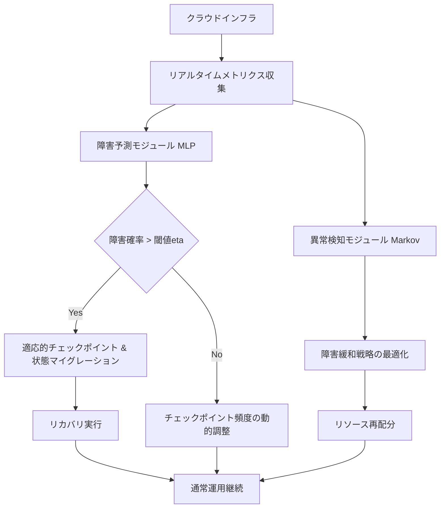
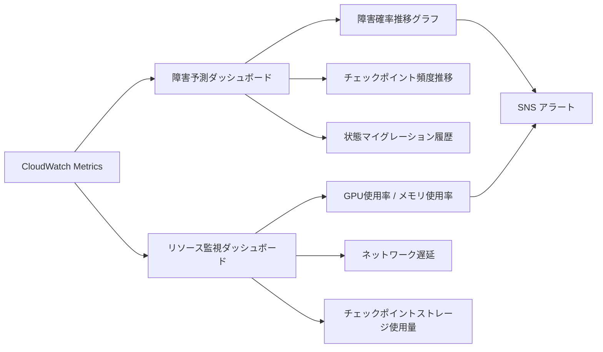

## 論文概要

本記事は [Adaptive Fault Tolerance Mechanisms of Large Language Models in Cloud Computing Environments](https://arxiv.org/abs/2503.12228) の解説記事です。

クラウド環境でのLLM運用は、ハードウェア障害、ネットワーク不安定性、リソース過負荷といった多様な障害シナリオに直面する。著者らは、既存のフォールトトレランス手法（チェックポイント、レプリケーション）が事前構成型であり、急速な状態変化への対応が不十分であると指摘している。本論文では、MLPニューラルネットワークによる障害予測、マルコフ過程に基づく異常検知と障害緩和、適応的チェックポイントとリカバリの3コンポーネントを統合したフレームワークを提案し、システムダウンタイム30%削減、障害予測精度約90%を達成したと報告している。

この記事は [Zenn記事: Azure OpenAI負荷分散の障害シナリオ別レジリエンス設計とBicep実装](https://zenn.dev/0h_n0/articles/47e8c9dbd585ff) の深掘りです。

## 情報源

- **arXiv ID**: 2503.12228
- **URL**: [https://arxiv.org/abs/2503.12228](https://arxiv.org/abs/2503.12228)
- **著者**: Yihong Jin, Ze Yang, Xinhe Xu et al.
- **採録**: IEEE ICCEA 2025
- **発表日**: 2025年3月15日
- **分野**: cs.DC, cs.AI

## 背景と動機

大規模言語モデル（LLM）のクラウドデプロイメントは急速に拡大しているが、運用上の耐障害性は依然として大きな課題である。著者らは、クラウド環境でのLLM運用が直面する3つの主要な障害カテゴリを整理している。

1. **ハードウェア障害**: GPU/TPUの故障、メモリエラー、ディスク障害。LLMの推論・学習はGPUクラスタに依存しており、単一ノードの障害がパイプライン全体を停止させうる
2. **ネットワーク不安定性**: 分散推論におけるノード間通信の遅延・断絶。テンソル並列やパイプライン並列を用いるLLMでは、通信障害が直接的なスループット低下を引き起こす
3. **リソース過負荷**: バースト的なリクエスト増加によるGPUメモリ枯渇、CPUスロットリング。特にマルチテナント環境では、テナント間のリソース競合が予測困難な障害を生む

従来のフォールトトレランス手法は、チェックポイント間隔やレプリカ数を事前に固定する静的設計に依存していた。著者らは、LLMのワークロードが推論と学習で大きく異なり、リクエストパターンも時間帯やイベントに応じて急変するため、静的な設定では過剰なリソース消費か、不十分な障害対応のいずれかに陥ると指摘している。この問題意識から、リアルタイムのシステムメトリクスに基づいて障害予測・対応を動的に調整する適応的フレームワークの必要性を主張している。

## 主要な貢献

- **障害予測と動的リソース配分の統合**: MLPニューラルネットワークでリアルタイムのシステムメトリクス（CPU使用率、メモリ使用率、ネットワーク遅延等）を監視し、障害確率を予測。予測結果に基づいてチェックポイント頻度とリソース配分を動的に調整する機構を提案
- **マルコフ過程ベースの異常検知**: システム状態をマルコフ過程としてモデル化し、状態遷移確率に基づく異常検知と障害緩和戦略を定式化。リソースコストと障害影響を同時最適化する目的関数を導入
- **適応的チェックポイントとリカバリ**: 障害確率が閾値を超えた場合の動的な状態マイグレーション機構を設計し、チェックポイントのタイミングと粒度をワークロードに応じて調整
- **統合フレームワークの実験的検証**: 3コンポーネントを統合したフレームワーク全体の有効性を、ダウンタイム削減率、障害予測精度、計算コストの観点で評価

## 技術的詳細

### フレームワークアーキテクチャ

著者らのフレームワークは、障害予測・異常検知・適応的チェックポイントの3コンポーネントが連携して動作する。以下にアーキテクチャの全体像を示す。



### コンポーネント1: 障害予測と動的リソース配分

MLPニューラルネットワークが、リアルタイムのシステムメトリクス（CPU使用率、メモリ使用率、ネットワーク遅延、I/Oスループット等）を入力として、時刻$t$における障害確率$P(\text{fault}_t)$を予測する。

$$
P(\text{fault}_t) = \text{MLP}(\mathbf{x}_t)
$$

ここで、$\mathbf{x}_t$は時刻$t$のシステムメトリクスベクトルである。この予測に基づき、チェックポイント頻度$\lambda_t$を以下の式で動的に調整する。

$$
\lambda_t = \alpha \cdot P(\text{fault}_t) + \beta \cdot I_t
$$

ここで、

- $\lambda_t$: 時刻$t$におけるチェックポイント頻度（単位時間あたりのチェックポイント回数）
- $\alpha$: 障害確率に対する感度パラメータ
- $\beta$: ワークロード重要度に対する感度パラメータ
- $I_t$: 時刻$t$のワークロード重要度指標（推論リクエストのSLA等から算出）

この設計により、障害確率が高い期間にはチェックポイント頻度を上げて状態保存を強化し、安定期にはチェックポイント頻度を下げてオーバーヘッドを最小化する。

### コンポーネント2: 異常検知と障害緩和

システム状態をマルコフ過程としてモデル化し、状態$s_t$に対する障害緩和戦略を最適化する。最適化の目的関数は以下の通りである。

$$
L(s_t) = \lambda_1 \cdot \text{ResourceCost}(s_t) + \lambda_2 \cdot \text{FaultImpact}(s_t)
$$

ここで、

- $s_t$: 時刻$t$のシステム状態（マルコフ過程の状態空間上の点）
- $\text{ResourceCost}(s_t)$: 障害緩和に必要なリソースコスト（追加GPU、ネットワーク帯域等）
- $\text{FaultImpact}(s_t)$: 障害が発生した場合の影響度（ダウンタイム、データ損失量等）
- $\lambda_1, \lambda_2$: コストと影響のトレードオフを制御する重みパラメータ

マルコフ過程の状態遷移確率に基づき、異常な状態遷移（通常のパターンから逸脱した遷移）を検出する。著者らは、状態空間を「正常」「警告」「障害」の3状態で定義し、各状態間の遷移確率をリアルタイムメトリクスから推定している。

### コンポーネント3: 適応的チェックポイントとリカバリ

障害確率$P(\text{fault}_t)$が閾値$\eta$を超えた場合に、動的な状態マイグレーションを実行する。

$$
\text{if } P(\text{fault}_t) > \eta \text{ then migrate}(s_t, \text{target\_node})
$$

ここで、$\eta$はマイグレーション実行の閾値であり、著者らの実験では$\eta = 0.7$が使用されている。状態マイグレーションでは、LLMの推論状態（KVキャッシュ、バッチキュー等）を障害リスクの低いノードに転送する。

チェックポイントの粒度も動的に制御される。低リスク時はモデル重みのみの軽量チェックポイント、高リスク時はKVキャッシュやオプティマイザ状態を含む完全チェックポイントを保存する。

```python
from dataclasses import dataclass
from enum import Enum


class RiskLevel(Enum):
    """障害リスクレベルの定義。"""
    LOW = "low"
    MEDIUM = "medium"
    HIGH = "high"
    CRITICAL = "critical"


@dataclass
class CheckpointConfig:
    """適応的チェックポイントの設定。

    Attributes:
        include_kv_cache: KVキャッシュを含めるか
        include_optimizer: オプティマイザ状態を含めるか
        include_batch_queue: バッチキュー状態を含めるか
        compression: 圧縮を有効にするか
    """
    include_kv_cache: bool
    include_optimizer: bool
    include_batch_queue: bool
    compression: bool


def determine_checkpoint_config(
    fault_probability: float,
    threshold_eta: float = 0.7,
) -> CheckpointConfig:
    """障害確率に基づいてチェックポイント構成を決定する。

    Args:
        fault_probability: MLPモデルが予測した障害確率 [0.0, 1.0]
        threshold_eta: 状態マイグレーション閾値

    Returns:
        CheckpointConfig: 適用すべきチェックポイント構成
    """
    if fault_probability > threshold_eta:
        # 高リスク: 完全チェックポイント + マイグレーション準備
        return CheckpointConfig(
            include_kv_cache=True,
            include_optimizer=True,
            include_batch_queue=True,
            compression=False,  # マイグレーション速度優先
        )
    elif fault_probability > 0.4:
        # 中リスク: KVキャッシュ含む部分チェックポイント
        return CheckpointConfig(
            include_kv_cache=True,
            include_optimizer=False,
            include_batch_queue=False,
            compression=True,
        )
    else:
        # 低リスク: 軽量チェックポイント
        return CheckpointConfig(
            include_kv_cache=False,
            include_optimizer=False,
            include_batch_queue=False,
            compression=True,
        )
```

## 実装のポイント

### MLP障害予測モデルの設計

著者らのMLPモデルはリアルタイムメトリクスを入力とするが、実装時にはメトリクス収集の遅延とモデル推論の遅延を合わせた「予測リードタイム」を考慮する必要がある。障害確率の予測が障害発生後に完了しては意味がないため、メトリクス収集間隔（著者らの実験では数秒単位）とMLPの推論時間を合わせて、十分なリードタイムを確保する設計が求められる。

### 閾値$\eta$のチューニング

状態マイグレーションの閾値$\eta$は、マイグレーション頻度と障害対応の即応性のトレードオフを決定する。$\eta$が低すぎると不要なマイグレーションが頻発してオーバーヘッドが増大し、高すぎると障害発生時の対応が遅れる。著者らは$\eta = 0.7$で実験しているが、ワークロードのSLAに応じたチューニングが必要である。

### チェックポイントストレージの選定

適応的チェックポイントでは、チェックポイント頻度が動的に変化するため、高頻度書き込みに対応できるストレージが必要である。LLMのKVキャッシュを含む完全チェックポイントは数GB以上のサイズになりうるため、ローカルNVMe SSDへの一時保存と、非同期での分散ストレージへのレプリケーションを組み合わせる設計が実用的である。

### マルコフ過程の状態空間設計

著者らは3状態（正常・警告・障害）のシンプルなモデルを採用しているが、プロダクション環境ではより細かい状態分割（例: 部分障害、性能劣化、カスケード障害前兆）が有効な場合がある。状態空間の粒度を増やすと遷移確率の推定に必要なデータ量も増加するため、運用データの蓄積量とのバランスを取る必要がある。

## Production Deployment Guide

本論文の適応的フォールトトレランスフレームワークをプロダクション環境に適用する際の実装パターンを示す。LLM推論サービスの耐障害性をAWS上で実現する構成を、トラフィック量別に整理する。

### AWS実装パターン（コスト最適化重視）

**トラフィック量別の推奨構成**:

| 構成 | トラフィック | 主要サービス | 月額概算 |
|:--|:--|:--|:--|
| Small | ~500 req/日 | Lambda + SageMaker Serverless + DynamoDB | $150-400 |
| Medium | ~5,000 req/日 | ECS Fargate + SageMaker + ElastiCache + CloudWatch | $1,200-2,500 |
| Large | 50,000+ req/日 | EKS + SageMaker Multi-Model + ElastiCache + Karpenter | $5,000-15,000 |

**Small構成の詳細**:
- Lambda: 障害予測MLPモデル推論（メモリ1024MB、タイムアウト30秒）
- SageMaker Serverless: LLM推論エンドポイント（自動スケーリング）
- DynamoDB: メトリクス履歴・チェックポイントメタデータ（On-Demandモード）
- S3: チェックポイントストレージ（Intelligent-Tiering）
- CloudWatch: メトリクス収集・アラーム

**Large構成の詳細**:
- EKS: 障害予測・異常検知サービス（c6i.xlarge、Spot優先）
- SageMaker Multi-Model: LLM推論（ml.g5.xlarge以上、レプリカ自動調整）
- ElastiCache Redis: メトリクスバッファ・状態キャッシュ（cache.r6g.large）
- S3 Express One Zone: 高速チェックポイント書き込み
- Karpenter: GPU/CPUノードの自動プロビジョニング

### Terraformインフラコード

**障害予測・監視基盤（Small構成）**:

```hcl
# Adaptive Fault Tolerance for LLM - Small構成
# Lambda + DynamoDB + CloudWatch

terraform {
  required_version = ">= 1.9"
  required_providers {
    aws = {
      source  = "hashicorp/aws"
      version = "~> 5.60"
    }
  }
}

provider "aws" {
  region = "ap-northeast-1"
}

# メトリクス履歴テーブル
resource "aws_dynamodb_table" "metrics_history" {
  name         = "llm-fault-tolerance-metrics"
  billing_mode = "PAY_PER_REQUEST"
  hash_key     = "node_id"
  range_key    = "timestamp"

  attribute {
    name = "node_id"
    type = "S"
  }

  attribute {
    name = "timestamp"
    type = "N"
  }

  ttl {
    attribute_name = "expires_at"
    enabled        = true
  }

  point_in_time_recovery {
    enabled = true
  }

  tags = {
    Service = "llm-fault-tolerance"
  }
}

# チェックポイントメタデータテーブル
resource "aws_dynamodb_table" "checkpoint_metadata" {
  name         = "llm-checkpoint-metadata"
  billing_mode = "PAY_PER_REQUEST"
  hash_key     = "checkpoint_id"
  range_key    = "created_at"

  attribute {
    name = "checkpoint_id"
    type = "S"
  }

  attribute {
    name = "created_at"
    type = "N"
  }

  ttl {
    attribute_name = "expires_at"
    enabled        = true
  }

  tags = {
    Service = "llm-fault-tolerance"
  }
}

# チェックポイントストレージ
resource "aws_s3_bucket" "checkpoints" {
  bucket = "llm-fault-tolerance-checkpoints"

  tags = {
    Service = "llm-fault-tolerance"
  }
}

resource "aws_s3_bucket_lifecycle_configuration" "checkpoints_lifecycle" {
  bucket = aws_s3_bucket.checkpoints.id

  rule {
    id     = "transition-to-ia"
    status = "Enabled"

    transition {
      days          = 7
      storage_class = "STANDARD_IA"
    }

    transition {
      days          = 30
      storage_class = "GLACIER"
    }

    expiration {
      days = 90
    }
  }
}

resource "aws_s3_bucket_server_side_encryption_configuration" "checkpoints_encryption" {
  bucket = aws_s3_bucket.checkpoints.id

  rule {
    apply_server_side_encryption_by_default {
      sse_algorithm = "aws:kms"
    }
    bucket_key_enabled = true
  }
}

# 障害予測Lambda関数用IAMロール
resource "aws_iam_role" "fault_predictor_role" {
  name = "llm-fault-predictor-role"

  assume_role_policy = jsonencode({
    Version = "2012-10-17"
    Statement = [
      {
        Action = "sts:AssumeRole"
        Effect = "Allow"
        Principal = {
          Service = "lambda.amazonaws.com"
        }
      }
    ]
  })
}

resource "aws_iam_role_policy" "fault_predictor_policy" {
  name = "llm-fault-predictor-policy"
  role = aws_iam_role.fault_predictor_role.id

  policy = jsonencode({
    Version = "2012-10-17"
    Statement = [
      {
        Effect = "Allow"
        Action = [
          "dynamodb:GetItem",
          "dynamodb:PutItem",
          "dynamodb:Query",
        ]
        Resource = [
          aws_dynamodb_table.metrics_history.arn,
          aws_dynamodb_table.checkpoint_metadata.arn,
        ]
      },
      {
        Effect = "Allow"
        Action = [
          "s3:PutObject",
          "s3:GetObject",
        ]
        Resource = "${aws_s3_bucket.checkpoints.arn}/*"
      },
      {
        Effect = "Allow"
        Action = [
          "cloudwatch:PutMetricData",
          "cloudwatch:GetMetricData",
        ]
        Resource = "*"
      },
      {
        Effect = "Allow"
        Action = [
          "logs:CreateLogGroup",
          "logs:CreateLogStream",
          "logs:PutLogEvents",
        ]
        Resource = "arn:aws:logs:*:*:*"
      },
    ]
  })
}

# CloudWatch アラーム（障害確率閾値）
resource "aws_cloudwatch_metric_alarm" "high_fault_probability" {
  alarm_name          = "llm-high-fault-probability"
  comparison_operator = "GreaterThanThreshold"
  evaluation_periods  = 2
  metric_name         = "FaultProbability"
  namespace           = "LLM/FaultTolerance"
  period              = 60
  statistic           = "Average"
  threshold           = 0.7
  alarm_description   = "Fault probability exceeds migration threshold eta"

  alarm_actions = [aws_sns_topic.fault_alerts.arn]
}

resource "aws_sns_topic" "fault_alerts" {
  name = "llm-fault-alerts"

  tags = {
    Service = "llm-fault-tolerance"
  }
}
```

**Medium/Large構成（ECS + CloudWatch Anomaly Detection）**:

```hcl
# Adaptive Fault Tolerance for LLM - Medium構成
# ECS Fargate + CloudWatch Anomaly Detection

# 障害予測サービス（ECS）
resource "aws_ecs_cluster" "fault_tolerance" {
  name = "llm-fault-tolerance"

  setting {
    name  = "containerInsights"
    value = "enhanced"
  }
}

resource "aws_ecs_task_definition" "fault_predictor" {
  family                   = "llm-fault-predictor"
  network_mode             = "awsvpc"
  requires_compatibilities = ["FARGATE"]
  cpu                      = "1024"
  memory                   = "2048"
  execution_role_arn       = aws_iam_role.ecs_execution_role.arn
  task_role_arn            = aws_iam_role.fault_predictor_task_role.arn

  container_definitions = jsonencode([
    {
      name  = "fault-predictor"
      image = "${aws_ecr_repository.fault_predictor.repository_url}:latest"
      portMappings = [
        {
          containerPort = 8080
          protocol      = "tcp"
        }
      ]
      environment = [
        {
          name  = "CHECKPOINT_BUCKET"
          value = aws_s3_bucket.checkpoints.id
        },
        {
          name  = "METRICS_TABLE"
          value = aws_dynamodb_table.metrics_history.name
        },
        {
          name  = "FAULT_THRESHOLD_ETA"
          value = "0.7"
        },
      ]
      logConfiguration = {
        logDriver = "awslogs"
        options = {
          "awslogs-group"         = "/ecs/llm-fault-predictor"
          "awslogs-region"        = "ap-northeast-1"
          "awslogs-stream-prefix" = "ecs"
        }
      }
      healthCheck = {
        command     = ["CMD-SHELL", "curl -f http://localhost:8080/health || exit 1"]
        interval    = 30
        timeout     = 5
        retries     = 3
        startPeriod = 60
      }
    }
  ])
}

# CloudWatch Anomaly Detection（マルコフ過程ベース異常検知の補完）
resource "aws_cloudwatch_metric_alarm" "cpu_anomaly" {
  alarm_name          = "llm-cpu-anomaly-detection"
  comparison_operator = "GreaterThanUpperThreshold"
  evaluation_periods  = 3
  threshold_metric_id = "ad1"
  alarm_description   = "CPU utilization anomaly detected"

  metric_query {
    id          = "ad1"
    expression  = "ANOMALY_DETECTION_BAND(m1, 2)"
    label       = "CPUUtilization (Expected)"
    return_data = true
  }

  metric_query {
    id = "m1"
    metric {
      metric_name = "CPUUtilization"
      namespace   = "AWS/ECS"
      period      = 300
      stat        = "Average"
      dimensions = {
        ClusterName = aws_ecs_cluster.fault_tolerance.name
      }
    }
    return_data = false
  }

  alarm_actions = [aws_sns_topic.fault_alerts.arn]
}

# GPU メトリクス監視（SageMaker推論エンドポイント向け）
resource "aws_cloudwatch_metric_alarm" "gpu_memory_pressure" {
  alarm_name          = "llm-gpu-memory-pressure"
  comparison_operator = "GreaterThanThreshold"
  evaluation_periods  = 2
  metric_name         = "GPUMemoryUtilization"
  namespace           = "aws/sagemaker/Endpoints"
  period              = 60
  statistic           = "Average"
  threshold           = 85
  alarm_description   = "GPU memory utilization exceeding safe threshold"

  alarm_actions = [aws_sns_topic.fault_alerts.arn]
}
```

### セキュリティベストプラクティス

本フレームワークをプロダクション環境にデプロイする際のセキュリティ上の考慮点を整理する。

1. **チェックポイントデータの暗号化**: LLMのチェックポイントにはモデル重みとKVキャッシュが含まれ、推論入力の情報が残存する可能性がある。S3のサーバサイド暗号化（SSE-KMS）を必須とし、KMSキーのローテーションポリシーを設定する
2. **メトリクスアクセスの最小権限**: 障害予測モジュールが参照するCloudWatchメトリクスへのアクセスは、必要なメトリクス名・名前空間に限定する。IAMポリシーでリソースARNを明示的に指定する
3. **状態マイグレーション時のネットワーク分離**: ノード間の状態転送はVPC内で完結させ、TLSを強制する。Transit Gatewayやインターフェース型VPCエンドポイントを使用し、パブリックインターネットを経由しない設計とする
4. **監査ログ**: CloudTrailで全API呼び出しを記録し、チェックポイントの作成・削除・マイグレーション操作の監査証跡を確保する

### 運用・監視設定

フォールトトレランスフレームワークの運用に必要な監視ダッシュボードの構成要素を以下に示す。



**主要メトリクス**:

| メトリクス | 閾値 | アクション |
|:--|:--|:--|
| FaultProbability | > 0.7 | 状態マイグレーション実行、オンコール通知 |
| FaultProbability | > 0.4 | チェックポイント頻度増加、KVキャッシュ保存有効化 |
| GPUMemoryUtilization | > 85% | スケールアウト検討、バッチサイズ削減 |
| CheckpointWriteLatency | > 5s | ストレージ性能レビュー |
| MigrationSuccessRate | < 95% | ネットワーク・ストレージの問題調査 |

**アラート設計のポイント**:
- 障害確率のアラートは連続2回以上の閾値超過で発火（フラッピング防止）
- マイグレーション失敗はP1（即時対応）、チェックポイント遅延はP2（翌営業日対応）で分類
- CloudWatch Logsのメトリクスフィルタで構造化ログからカスタムメトリクスを生成

### コスト最適化チェックリスト

- [ ] チェックポイントストレージにS3 Intelligent-Tieringを適用し、古いチェックポイントを自動的にGlacierへ移行
- [ ] 障害予測Lambdaのメモリサイズを実行プロファイルに基づいて最適化（AWS Lambda Power Tuning）
- [ ] ECSタスクのSpot Fargate利用でコンピュートコストを最大70%削減（障害予測モジュールは短時間中断許容）
- [ ] CloudWatch Logsの保持期間を90日に設定し、長期保存はS3エクスポートで対応
- [ ] SageMaker推論エンドポイントのAuto Scalingポリシーを、障害確率メトリクスと連動させてスケールイン/アウト
- [ ] リザーブドインスタンスまたはSavings Plansで、ベースライン分のECS/EKSコストを最大40%削減

**コスト試算の注意事項**: 上記はAWS ap-northeast-1（東京）リージョンの2026年8月時点の概算値である。実際のコストはトラフィックパターン、GPUインスタンスタイプ、チェックポイント頻度により大きく変動する。最新料金はAWS料金計算ツールで確認を推奨する。

## 実験結果

著者らは、DSTCデータセットを用いた評価実験で以下の結果を報告している。

**システムダウンタイムの削減**: 提案フレームワークにより、システムダウンタイムが従来手法と比較して約30%削減されたと報告している（論文Fig. 4）。3コンポーネントの統合により、障害の予測段階から緩和・リカバリまでを一貫して最適化することで、障害発生から復旧までの時間を短縮している。

**障害予測精度**: MLPベースの障害予測モジュールは約90%の障害予測精度を達成している（論文Fig. 5）。CPU使用率、メモリ使用率、ネットワーク遅延の3つのメトリクスが予測精度に大きく寄与しており、これらの組み合わせが障害の前兆パターンを捕捉していると著者らは分析している。

**計算コスト**: 提案手法の計算コストは8.30秒であり、従来手法と比較して効率的であると報告されている（論文Table 1）。

| 手法 | 計算コスト (秒) |
|:--|:--|
| 提案手法（Adaptive FT） | 8.30 |
| Checkpointing (CP) | 10.25 |
| Replication (RP) | 12.50 |
| State Migration (SM) | 15.75 |
| All Defenses (AD) | 20.00 |

提案手法が最も低い計算コストを達成している点は注目に値する。これは、適応的にチェックポイント頻度やリカバリ戦略を調整することで、不要なオーバーヘッドを削減していることが要因である。

ただし、著者ら自身が認めているように、評価はDSTCデータセットに限定されており、大規模なリアルワールドのクラウドデプロイメントでの検証は行われていない。実運用環境での有効性については、追加の検証が必要である。

## 実運用への応用

### Azure OpenAI APIMとの関連

本論文のフレームワークは、Zenn記事で解説されているAzure OpenAIの負荷分散・レジリエンス設計と密接に関連する。Azure API Management（APIM）のcircuit breakerパターンは、本論文の異常検知コンポーネントに対応するプロダクション実装の一例として位置づけられる。

APIMのcircuit breakerは「閉（正常）→ 開（障害）→ 半開（回復テスト）」の3状態遷移を持ち、これは本論文のマルコフ過程モデルにおける「正常→ 警告→ 障害」の状態遷移と構造的に類似している。本論文の貢献は、この状態遷移にリアルタイムメトリクスに基づく障害確率予測を統合し、「circuit breakerが開く前に予防的なアクションを取る」ことを可能にする点にある。

Bicepで実装するAPIMのバックエンドプール（複数Azure OpenAIリージョンへの負荷分散）は、本論文の状態マイグレーション機構に対応する。特定リージョンの障害確率が閾値を超えた場合に、そのリージョンへのトラフィックを予防的にシフトする設計は、本論文の適応的アプローチとAPIMのweighted round-robinを組み合わせることで実現可能である。

### 実用上の留意点

本論文の手法をAzure OpenAI環境に適用する場合、以下の点に留意する必要がある。マネージドサービス（Azure OpenAI Service）では、インフラ層の障害はクラウドプロバイダが対処するため、本論文のGPU障害予測やチェックポイントはそのまま適用できない。一方、API層の障害（スロットリング、リージョン障害）やアプリケーション層の障害（プロンプト処理エラー、タイムアウト）に対しては、本論文の適応的閾値制御とマルコフ過程ベースの異常検知が参考になる。

## 関連研究

著者らは、関連研究として以下の分野を整理している。分散システムにおけるチェックポイント技術は長い歴史を持ち、Chandy-Lamportアルゴリズム（分散スナップショット）が基盤となっている。LLM特有の課題として、モデルサイズの巨大さ（数十〜数百GB）によるチェックポイントI/Oのボトルネックが挙げられる。DeepSpeedのZeROチェックポイントやMegatron-LMのパイプライン並列チェックポイントが先行研究として位置づけられている。異常検知の分野では、時系列データに対する統計的手法（ARIMA、指数平滑化）や深層学習ベースの手法（LSTM-AE、Transformer-based anomaly detection）が存在するが、LLMのクラウドデプロイメントに特化した統合フレームワークは限られており、本論文の貢献が位置づけられている。

## まとめと今後の展望

本論文は、クラウド環境でのLLM運用における適応的フォールトトレランスフレームワークを提案し、障害予測（MLP）、異常検知（マルコフ過程）、適応的チェックポイントの3コンポーネントを統合することで、ダウンタイム30%削減と予測精度90%を実現したことを示した。

フレームワークの設計思想 -- リアルタイムメトリクスに基づく動的な障害対応 -- は、Azure OpenAI APIMのcircuit breakerパターンやバックエンドプールによる負荷分散と組み合わせることで、よりレジリエントなLLM推論基盤の構築に寄与しうる。

一方で、評価がDSTCデータセットに限定されている点、大規模クラウド環境での実証が不足している点は、今後の研究課題として著者ら自身が認めている。特に、マルチテナント環境でのリソース競合や、マルチリージョンデプロイメントにおける状態マイグレーションのレイテンシは、実運用で顕在化する可能性が高い課題である。

## 参考文献

1. Jin, Y., Yang, Z., Xu, X., Zhang, Y., & Ji, S. (2025). Adaptive Fault Tolerance Mechanisms of Large Language Models in Cloud Computing Environments. *arXiv:2503.12228*. [https://arxiv.org/abs/2503.12228](https://arxiv.org/abs/2503.12228)
2. Chandy, K. M., & Lamport, L. (1985). Distributed Snapshots: Determining Global States of Distributed Systems. *ACM Transactions on Computer Systems*, 3(1), 63-75.
3. Rajbhandari, S., et al. (2020). ZeRO: Memory Optimizations Toward Training Trillion Parameter Models. *SC20*.
4. Shoeybi, M., et al. (2019). Megatron-LM: Training Multi-Billion Parameter Language Models Using Model Parallelism. *arXiv:1909.08053*.
