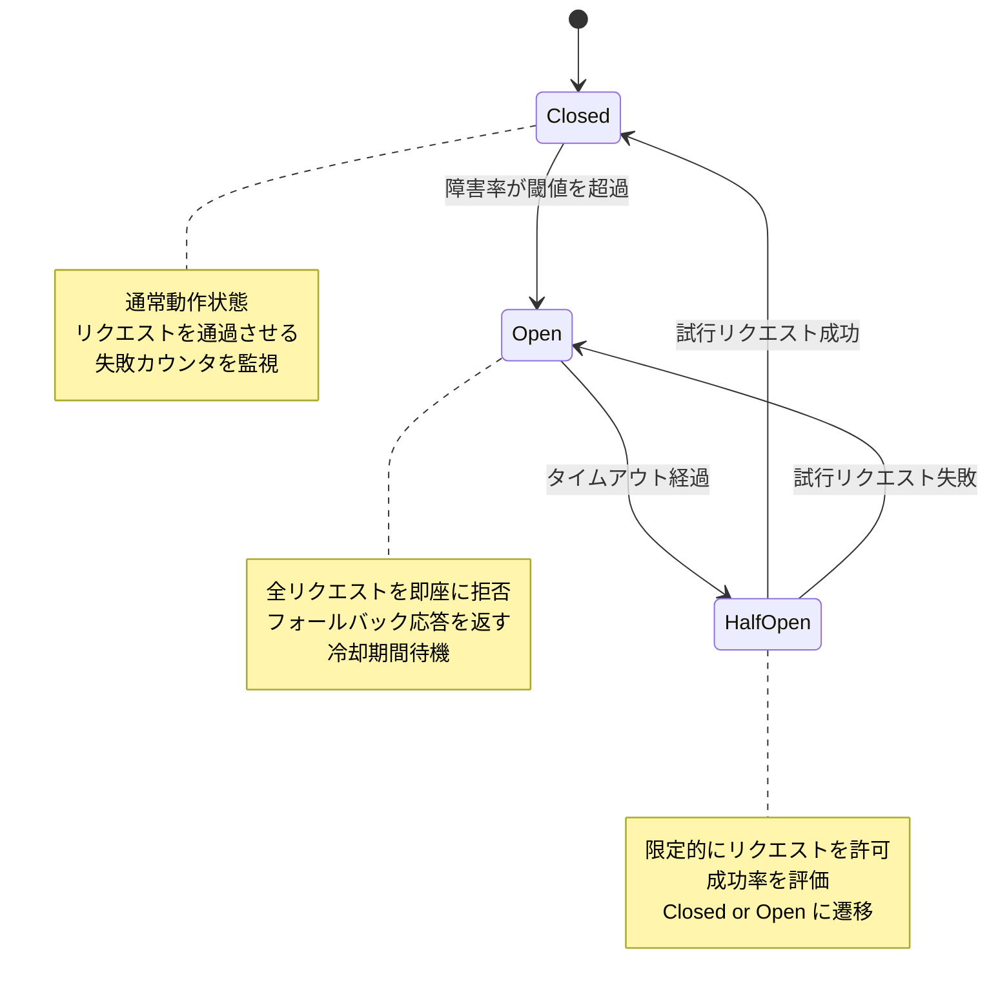
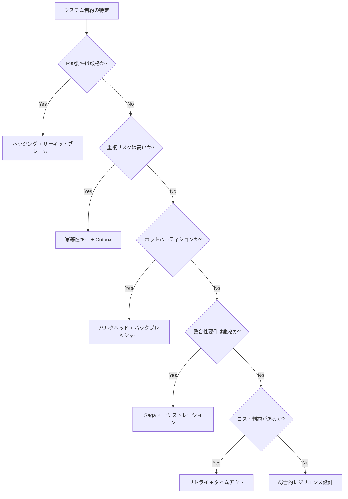
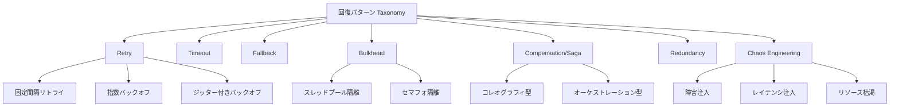
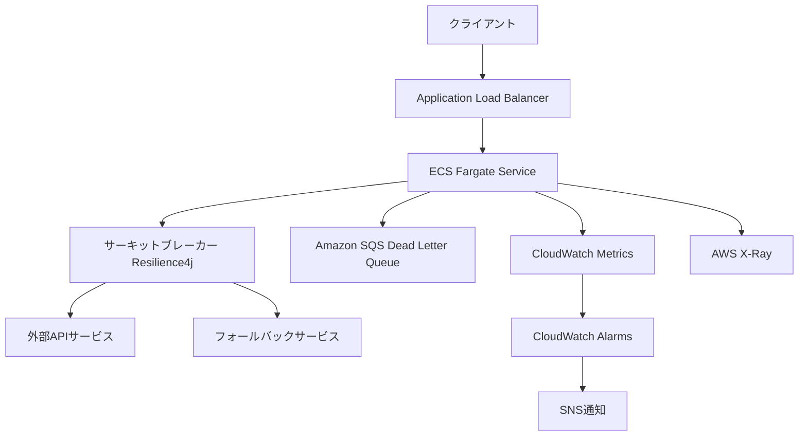

本記事は [Resilient Microservices: A Systematic Review of Recovery Patterns, Strategies, and Evaluation Frameworks (arXiv:2512.16959)](https://arxiv.org/abs/2512.16959) の解説記事です。

## 論文概要（Abstract）

本論文は、マイクロサービスアーキテクチャにおけるレジリエンス（障害回復能力）のパターン・戦略・評価フレームワークを体系化したPRISMA準拠の系統的レビューである。著者Muzeeb Mohammadは、2014年から2025年までの26研究を分析し、9つのレジリエンステーマ、10項目のResilience Evaluation Score（RES）チェックリスト、制約別の決定マトリクス、および5段階の成熟度モデル（RML）を提示している。サーキットブレーカーと境界付きリトライの組み合わせでP99レイテンシが2600msから1100msに改善される知見は、本番環境での障害設計に直接適用可能である。

この記事は [Zenn記事: Azure OpenAI負荷分散の障害シナリオ別レジリエンス設計とBicep実装](https://zenn.dev/0h_n0/articles/47e8c9dbd585ff) の深掘りです。

## 情報源

- **arXiv ID**: 2512.16959
- **URL**: [https://arxiv.org/abs/2512.16959](https://arxiv.org/abs/2512.16959)
- **著者**: Muzeeb Mohammad
- **発表年**: 2025年12月18日（2026年 IEEE国際会議採択）
- **分野**: cs.SE（ソフトウェア工学）

## 背景と動機（Background & Motivation）

マイクロサービスアーキテクチャの普及に伴い、サービス間通信の障害がシステム全体に連鎖するカスケード障害が深刻な課題となっている。モノリシックアーキテクチャでは関数呼び出しであった処理がネットワーク越しのRPC/HTTPとなり、部分的な障害（partial failure）が常態化する。

著者は、既存のレジリエンスパターン研究が個別のパターン（サーキットブレーカー、リトライ等）に焦点を当てるものが多く、パターン間の相互作用やトレードオフ、組織の成熟度に応じた段階的導入指針が不足していると指摘している。特に、サーキットブレーカーの閾値チューニングにおいて、過度に厳格な閾値がスループットを低下させる問題や、ジッターなしのリトライがサンダーリングハード（thundering herd）問題を引き起こすケースなど、実装上の落とし穴は文献横断的な整理なしには把握しにくい。

本論文はPRISMA（Preferred Reporting Items for Systematic Reviews and Meta-Analyses）に準拠し、再現性のあるプロトコルで文献を選別・分析することで、これらの知見を体系化したものである。

## 主要な貢献（Key Contributions）

- **9つのレジリエンステーマ（T1-T9）の体系化**: 26研究から抽出したパターンを9テーマに分類し、各テーマの定量的効果を整理
- **Resilience Evaluation Score（RES）**: レジリエンス設計の成熟度を10項目で評価する標準化チェックリスト
- **制約別決定マトリクス**: システム制約（厳格なP99要件、高重複リスク等）からパターンを選択するための実践的ガイド
- **Resilience Maturity Levels（RML）**: 組織のレジリエンス成熟度を5段階で定義する進化モデル
- **回復パターンの分類法（Taxonomy）**: Retry, Timeout, Fallback, Bulkhead, Compensation/Saga, Redundancy, Chaos Engineeringの7パターン体系

## 技術的詳細（Technical Details）

### 9つのレジリエンステーマ

著者は26研究の分析結果を以下の9テーマに分類している（論文Table/Figureより）。

| テーマ | 名称 | 内容 | 定量的知見 |
|--------|------|------|-----------|
| T1 | サーキットブレーカー閾値チューニング | 障害率に応じた動的閾値調整 | 過度に厳格な閾値はスループットを低下させる |
| T2 | Saga/補償トランザクション | 分散トランザクションの整合性保証 | コレオグラフィ型とオーケストレーション型の比較 |
| T3 | ジッター付きリトライ | 指数バックオフ+ランダムジッターによるリトライ | ジッターなし: P99=2600ms, エラー率17% |
| T4 | 冪等性/Outboxパターン | 重複実行の安全性保証 | メッセージ重複リスクの根本的解消 |
| T5 | バルクヘッド/バックプレッシャー | リソース隔離と流量制御 | 効率オーバーヘッド約15% |
| T6 | ヘッジングリクエスト | 複数レプリカへの並列リクエスト | P99を約40%削減 |
| T7 | 結果整合性 | 非同期データ同期パターン | CQRS/Event Sourcingとの組み合わせ |
| T8 | 可観測性/分散トレーシング | 障害の検出・診断能力 | OpenTelemetry等による計装 |
| T9 | コスト便益トレードオフ | レジリエンス投資対効果 | パターン導入のROI分析 |

### サーキットブレーカーの定量的知見

著者は、サーキットブレーカーとリトライの組み合わせに関する具体的な数値を報告している。

**ジッター付き境界リトライ + サーキットブレーカーの場合**:
- P99レイテンシ: 1100ms
- エラー率: 3%

**ジッターなしリトライの場合**:
- P99レイテンシ: 2600ms
- エラー率: 17%



ジッターの効果は、複数クライアントが同時にリトライする「thundering herd」問題の緩和にある。ジッターなしの場合、バックオフ後のリトライタイミングが同期し、障害回復直後のサービスに再び負荷が集中する。著者は、ランダムジッターの導入によりリトライタイミングが分散され、結果としてP99が58%改善（2600ms → 1100ms）し、エラー率が82%低下（17% → 3%）したと報告している。

### Resilience Evaluation Score（RES）

著者は、マイクロサービスのレジリエンス設計を評価するための10項目チェックリストを提案している。各項目は0または1で採点し、合計10点満点で評価する。

| # | 評価項目 | 説明 |
|---|---------|------|
| 1 | 障害モード仕様（Failure-mode specification） | 想定する障害シナリオが文書化されているか |
| 2 | ワークロード特性化（Workload characterization） | 負荷パターン（定常、バースト等）が定義されているか |
| 3 | テールメトリクス（Tail metrics） | P95/P99レイテンシ等のテール指標を計測しているか |
| 4 | パターンパラメータ（Pattern parameters） | タイムアウト値、リトライ回数等が明示されているか |
| 5 | 隔離（Isolation） | バルクヘッドやスレッドプール分離が実装されているか |
| 6 | バックプレッシャー（Backpressure） | 下流サービスの過負荷を上流に伝播する仕組みがあるか |
| 7 | 冪等性（Idempotency） | リトライ時の重複実行が安全であるか |
| 8 | 補償（Compensation） | 障害時のロールバック/補償トランザクションが定義されているか |
| 9 | トレーシング（Tracing） | 分散トレーシングによる障害の追跡が可能か |
| 10 | 脅威の議論（Threats discussion） | 未対応の障害シナリオやリスクが議論されているか |

著者は、調査対象の26研究の多くがRES 10点中4-6点にとどまり、特にバックプレッシャー（項目6）と脅威の議論（項目10）のスコアが低い傾向にあると報告している。

### 制約別決定マトリクス

著者は、システム制約に応じたパターン選択を支援する決定マトリクスを提示している。

| 制約条件 | 推奨パターン | 根拠 |
|----------|-------------|------|
| 厳格なP99要件 | ヘッジングリクエスト + サーキットブレーカー | P99を約40%削減（T6） |
| 高い重複リスク | 冪等性キー + Outboxパターン | メッセージの重複実行を防止（T4） |
| ホットパーティション | バルクヘッド + バックプレッシャー | リソース隔離で連鎖障害を防止（T5） |
| 厳格な整合性要件 | Saga（オーケストレーション型） | 補償トランザクションによる整合性保証（T2） |
| コスト制約 | ジッター付きリトライ + タイムアウト | 最小限のインフラで最大効果（T3） |
| 信頼性の低いプロバイダー | サーキットブレーカー + フォールバック | 不安定な外部サービスへの依存を隔離 |



### Resilience Maturity Levels（RML）

著者は、組織のレジリエンス成熟度を5段階で定義している。

| レベル | 名称 | 特徴 |
|--------|------|------|
| RML 1 | Ad-hoc | 障害対応が場当たり的。パターンの体系的適用なし |
| RML 2 | Reactive | 基本的なリトライ・タイムアウトを導入。障害発生後に対応 |
| RML 3 | Proactive | サーキットブレーカー、バルクヘッドを導入。障害を事前に隔離 |
| RML 4 | Systematic | カオスエンジニアリングによる障害注入テスト。RESスコアで評価 |
| RML 5 | Optimized | AI支援による動的閾値チューニング。自律的な障害回復 |

### 回復パターンの分類法

著者は、文献から抽出した回復パターンを以下の7カテゴリに体系化している。



## 実装のポイント（Implementation Notes）

著者は、レジリエンスパターンの実装に利用可能なツール群を以下のように整理している。

| ツール | 用途 | 対応パターン |
|--------|------|-------------|
| **Resilience4j** | Javaアプリケーション向けレジリエンスライブラリ | サーキットブレーカー、リトライ、バルクヘッド、レートリミッター |
| **Istio** | サービスメッシュによるインフラレベルレジリエンス | リトライ、タイムアウト、サーキットブレーカー、フォールトインジェクション |
| **Kubernetes** | コンテナオーケストレーション | ヘルスチェック、自動再起動、ローリングアップデート |
| **Temporal** | ワークフローエンジン | Saga、補償トランザクション、リトライポリシー |
| **Kafka** | イベントストリーミング | 非同期メッセージング、結果整合性、Outboxパターン |
| **Chaos Monkey** | カオスエンジニアリング | 障害注入テスト |
| **OpenTelemetry** | 可観測性 | 分散トレーシング、メトリクス収集 |

アプリケーションレベル（Resilience4j）とインフラレベル（Istio）のパターン実装は相互に排他的ではなく、著者は両者を組み合わせた多層防御（defense in depth）を推奨している。Resilience4jでアプリケーション固有のフォールバックロジックを実装しつつ、Istioでサービス間通信のリトライ・タイムアウトを統一的に管理する構成が、RESスコアの向上に寄与すると述べている。

## Production Deployment Guide

本論文のレジリエンスパターン分類と決定マトリクスは、実際のクラウドインフラ設計に直接適用可能である。以下に、AWS環境での実装パターンを示す。

### AWS実装アーキテクチャ



### Terraformインフラコード

**ECS Fargateサービス + サーキットブレーカー設定**:

```hcl
# --- ECS Service with Circuit Breaker ---
resource "aws_ecs_service" "resilient_api" {
  name            = "resilient-api"
  cluster         = aws_ecs_cluster.main.id
  task_definition = aws_ecs_task_definition.api.arn
  desired_count   = 3
  launch_type     = "FARGATE"

  # ECS組み込みサーキットブレーカー
  deployment_circuit_breaker {
    enable   = true
    rollback = true
  }

  deployment_configuration {
    maximum_percent         = 200
    minimum_healthy_percent = 100
  }

  network_configuration {
    subnets          = module.vpc.private_subnets
    security_groups  = [aws_security_group.ecs_tasks.id]
    assign_public_ip = false
  }

  load_balancer {
    target_group_arn = aws_lb_target_group.api.arn
    container_name   = "api"
    container_port   = 8080
  }
}

# --- SQS Dead Letter Queue（リトライ失敗メッセージの隔離） ---
resource "aws_sqs_queue" "dlq" {
  name                       = "resilient-api-dlq"
  message_retention_seconds  = 1209600 # 14日間保持
  receive_wait_time_seconds  = 20

  tags = {
    Project     = "resilient-api"
    Environment = "production"
    CostCenter  = "platform"
  }
}

resource "aws_sqs_queue" "main" {
  name                       = "resilient-api-main"
  visibility_timeout_seconds = 300
  receive_wait_time_seconds  = 20

  redrive_policy = jsonencode({
    deadLetterTargetArn = aws_sqs_queue.dlq.arn
    maxReceiveCount     = 3 # 3回リトライ後にDLQへ
  })
}

# --- ALB ヘルスチェック（障害検出） ---
resource "aws_lb_target_group" "api" {
  name        = "resilient-api-tg"
  port        = 8080
  protocol    = "HTTP"
  vpc_id      = module.vpc.vpc_id
  target_type = "ip"

  health_check {
    enabled             = true
    path                = "/health"
    port                = "traffic-port"
    healthy_threshold   = 2
    unhealthy_threshold = 3
    timeout             = 5
    interval            = 15
    matcher             = "200"
  }
}
```

**バルクヘッド: ECSタスクのリソース隔離**:

```hcl
# --- タスク定義: コンテナレベルのリソース隔離（バルクヘッド） ---
resource "aws_ecs_task_definition" "api" {
  family                   = "resilient-api"
  requires_compatibilities = ["FARGATE"]
  network_mode             = "awsvpc"
  cpu                      = 1024  # 1 vCPU
  memory                   = 2048  # 2 GB

  container_definitions = jsonencode([
    {
      name  = "api"
      image = "${aws_ecr_repository.api.repository_url}:latest"
      portMappings = [
        { containerPort = 8080, protocol = "tcp" }
      ]
      # コンテナレベルのリソース制限（バルクヘッド）
      cpu    = 768
      memory = 1536
      environment = [
        { name = "CIRCUIT_BREAKER_FAILURE_RATE_THRESHOLD", value = "50" },
        { name = "CIRCUIT_BREAKER_WAIT_DURATION_MS", value = "30000" },
        { name = "RETRY_MAX_ATTEMPTS", value = "3" },
        { name = "RETRY_WAIT_DURATION_MS", value = "500" },
        { name = "BULKHEAD_MAX_CONCURRENT_CALLS", value = "25" },
      ]
      logConfiguration = {
        logDriver = "awslogs"
        options = {
          "awslogs-group"         = "/ecs/resilient-api"
          "awslogs-region"        = "ap-northeast-1"
          "awslogs-stream-prefix" = "api"
        }
      }
    }
  ])
}
```

### セキュリティベストプラクティス

```hcl
# --- セキュリティグループ: 最小権限アクセス ---
resource "aws_security_group" "ecs_tasks" {
  name        = "resilient-api-ecs-tasks"
  description = "ECS tasks security group"
  vpc_id      = module.vpc.vpc_id

  # ALBからのみ受信を許可
  ingress {
    from_port       = 8080
    to_port         = 8080
    protocol        = "tcp"
    security_groups = [aws_security_group.alb.id]
    description     = "Allow traffic from ALB only"
  }

  # 外向きは必要なエンドポイントのみ
  egress {
    from_port   = 443
    to_port     = 443
    protocol    = "tcp"
    cidr_blocks = ["0.0.0.0/0"]
    description = "HTTPS outbound for external APIs"
  }

  tags = {
    Name = "resilient-api-ecs-tasks"
  }
}

# --- IAMロール: 最小権限 ---
resource "aws_iam_role" "ecs_task_role" {
  name = "resilient-api-task-role"

  assume_role_policy = jsonencode({
    Version = "2012-10-17"
    Statement = [
      {
        Action = "sts:AssumeRole"
        Effect = "Allow"
        Principal = {
          Service = "ecs-tasks.amazonaws.com"
        }
      }
    ]
  })
}

resource "aws_iam_role_policy" "task_policy" {
  name = "resilient-api-task-policy"
  role = aws_iam_role.ecs_task_role.id

  policy = jsonencode({
    Version = "2012-10-17"
    Statement = [
      {
        Effect = "Allow"
        Action = [
          "sqs:SendMessage",
          "sqs:ReceiveMessage",
          "sqs:DeleteMessage",
          "sqs:GetQueueAttributes"
        ]
        Resource = [
          aws_sqs_queue.main.arn,
          aws_sqs_queue.dlq.arn
        ]
      },
      {
        Effect = "Allow"
        Action = [
          "xray:PutTraceSegments",
          "xray:PutTelemetryRecords"
        ]
        Resource = "*"
      },
      {
        Effect = "Allow"
        Action = [
          "cloudwatch:PutMetricData"
        ]
        Resource = "*"
        Condition = {
          StringEquals = {
            "cloudwatch:namespace" = "ResilientAPI"
          }
        }
      }
    ]
  })
}
```

### 運用・監視設定

**CloudWatch Logs Insights: サーキットブレーカー状態遷移の監視**:

```
fields @timestamp, circuit_breaker_name, state, failure_rate, slow_call_rate
| filter event = "circuit_breaker_state_change"
| stats count(*) as transitions,
        latest(state) as current_state,
        avg(failure_rate) as avg_failure_rate
  by circuit_breaker_name, bin(1h)
| sort transitions desc
```

**CloudWatchアラーム + X-Rayトレーシング（Python）**:

```python
import boto3
from aws_xray_sdk.core import xray_recorder, patch_all

patch_all()  # boto3/requests自動計装

cloudwatch = boto3.client("cloudwatch")


def setup_resilience_alarms() -> None:
    """レジリエンス関連のCloudWatchアラームを設定する。"""
    # サーキットブレーカーOpen状態アラーム
    cloudwatch.put_metric_alarm(
        AlarmName="circuit-breaker-open-alert",
        MetricName="CircuitBreakerOpenCount",
        Namespace="ResilientAPI",
        Statistic="Sum",
        Period=300,
        EvaluationPeriods=1,
        Threshold=1.0,
        ComparisonOperator="GreaterThanOrEqualToThreshold",
        AlarmActions=["arn:aws:sns:ap-northeast-1:ACCOUNT:resilience-alerts"],
        TreatMissingData="notBreaching",
    )

    # P99レイテンシ閾値超過アラーム
    cloudwatch.put_metric_alarm(
        AlarmName="p99-latency-breach",
        MetricName="ResponseLatency",
        Namespace="ResilientAPI",
        ExtendedStatistic="p99",
        Period=300,
        EvaluationPeriods=3,
        Threshold=1100.0,  # 論文のP99目標値
        ComparisonOperator="GreaterThanThreshold",
        AlarmActions=["arn:aws:sns:ap-northeast-1:ACCOUNT:resilience-alerts"],
    )

    # DLQメッセージ滞留アラーム
    cloudwatch.put_metric_alarm(
        AlarmName="dlq-message-accumulation",
        MetricName="ApproximateNumberOfMessagesVisible",
        Namespace="AWS/SQS",
        Dimensions=[
            {"Name": "QueueName", "Value": "resilient-api-dlq"},
        ],
        Statistic="Maximum",
        Period=300,
        EvaluationPeriods=2,
        Threshold=10.0,
        ComparisonOperator="GreaterThanThreshold",
        AlarmActions=["arn:aws:sns:ap-northeast-1:ACCOUNT:resilience-alerts"],
    )


@xray_recorder.capture("resilient_call")
def call_with_resilience(service_name: str, request: dict) -> dict:
    """X-Rayトレーシング付きレジリエントAPI呼び出し。"""
    subsegment = xray_recorder.current_subsegment()
    subsegment.put_annotation("service", service_name)
    subsegment.put_annotation("pattern", "circuit_breaker+retry")
    subsegment.put_metadata("request", request, "input")

    # レジリエンスメトリクス送信
    cloudwatch.put_metric_data(
        Namespace="ResilientAPI",
        MetricData=[
            {
                "MetricName": "ServiceCallAttempt",
                "Dimensions": [
                    {"Name": "Service", "Value": service_name},
                ],
                "Value": 1.0,
                "Unit": "Count",
            },
        ],
    )
    # ... 実際のAPI呼び出し + リトライ/サーキットブレーカーロジック
    return {"status": "ok"}
```

### コスト最適化チェックリスト

**アーキテクチャ選択**: トラフィック量に応じて構成を選択する。低トラフィック（~100 req/s）はLambda + API Gateway、中トラフィック（~1,000 req/s）はECS Fargate、高トラフィック（10,000+ req/s）はECS on EC2 + Spot Instancesが適切である。

**リソース最適化**: ECS FargateのCPU/メモリはバルクヘッドのmax concurrent callsに合わせて設定する。Savings Plansで安定ワークロードのコストを最大72%削減する。Application Auto Scalingでターゲットトラッキングポリシー（CPU 70%）を設定し、過剰プロビジョニングを防止する。

**レジリエンスパターンのコスト影響**: ヘッジングリクエスト（T6）はP99を約40%改善するが、リクエスト数が2倍になるためコストも増加する。コスト制約がある場合は、ジッター付きリトライ+タイムアウト（T3）が最もコスト効率が高い。バルクヘッド（T5）の効率オーバーヘッド約15%は、カスケード障害防止による可用性向上で回収可能である。

**監視コスト管理**: CloudWatch Custom Metricsの数を最小限に抑える（1メトリクス = $0.30/月）。X-Rayのサンプリングレートを本番環境では5-10%に設定し、コストを抑制する。CloudWatch Logs Insightsクエリは必要時のみ実行し、定常監視にはMetric Filtersを使用する。

**リソース管理**: タグ戦略（`Project`/`Environment`/`CostCenter`）で全リソースにタグ付けする。AWS Budgetsで月次上限アラートを設定する。Cost Anomaly Detectionで異常コストの早期検出を行う。開発環境のECSサービスは夜間・休日にdesired countを0に設定する。

## 実運用への応用 -- Azure APIMサーキットブレーカーとの接続

Zenn記事「Azure OpenAI負荷分散の障害シナリオ別レジリエンス設計とBicep実装」で解説されているAzure API Management（APIM）のサーキットブレーカー設定は、本論文のT1（サーキットブレーカー閾値チューニング）と直接対応する。

本論文の知見をAzure環境に適用する際のポイントは以下の通りである。

1. **閾値設計**: 著者が警告する「過度に厳格な閾値」の問題は、APIMのcircuit-breaker policyにおけるfailure count/percentageの設定に直結する。Zenn記事で紹介されているBicepでのサーキットブレーカー設定において、閾値を障害シナリオごとに差別化する設計が重要である
2. **ジッター付きリトライ**: APIMのretry policyにおいて、`delta`/`max-delta`パラメータでジッターを導入することで、論文が示すP99改善効果（2600ms → 1100ms）に近い結果が期待できる
3. **バルクヘッド適用**: 複数のOpenAIバックエンドに対して、APIMのbackendプールを分離し、障害の影響範囲を限定する設計は、T5（バルクヘッド/バックプレッシャー）パターンの実践である
4. **RES評価の活用**: Zenn記事で設計したレジリエンス構成を、RES 10項目チェックリストで自己評価することで、不足している設計要素を特定できる

## 関連研究

著者は、レジリエンスパターンの研究が以下の3つの系譜に分類されると述べている。第一に、Netflix OSS（Hystrix）やResilience4jを起点とするアプリケーションレベルのパターン研究。第二に、IstioやLinkerdを中心としたサービスメッシュによるインフラレベルのレジリエンス研究。第三に、Chaos Monkey（Netflix, 2011年）を起点とするカオスエンジニアリングの研究である。本論文は、これら3つの系譜を横断的に分析し、統一的な評価フレームワーク（RES）を提供した点に独自性がある。著者は、AI支援による動的閾値チューニング（RML 5）が今後の重要な研究方向であると指摘している。

## まとめ

本論文は、マイクロサービスのレジリエンスパターンを26研究のPRISMAレビューに基づいて体系化した包括的なサーベイである。9テーマの分類、RES評価チェックリスト、制約別決定マトリクス、RML成熟度モデルという4つの成果物は、レジリエンス設計の実践的なガイドとして機能する。特に、ジッター付きリトライとサーキットブレーカーの組み合わせによるP99 58%改善（2600ms → 1100ms）の知見は、Azure APIMやAWS環境でのレジリエンス設計に直接適用可能である。

## 参考文献

1. Mohammad, M. (2025). Resilient Microservices: A Systematic Review of Recovery Patterns, Strategies, and Evaluation Frameworks. arXiv:2512.16959. [https://arxiv.org/abs/2512.16959](https://arxiv.org/abs/2512.16959)
2. Nygard, M. T. (2018). Release It! Design and Deploy Production-Ready Software (2nd ed.). Pragmatic Bookshelf.
3. Resilience4j. [https://resilience4j.readme.io/](https://resilience4j.readme.io/)
4. Istio. Traffic Management - Fault Injection. [https://istio.io/latest/docs/tasks/traffic-management/fault-injection/](https://istio.io/latest/docs/tasks/traffic-management/fault-injection/)
5. Netflix. (2011). The Netflix Simian Army. [https://netflixtechblog.com/the-netflix-simian-army-16e57fbab116](https://netflixtechblog.com/the-netflix-simian-army-16e57fbab116)
6. OpenTelemetry. [https://opentelemetry.io/](https://opentelemetry.io/)
7. Temporal. [https://temporal.io/](https://temporal.io/)
