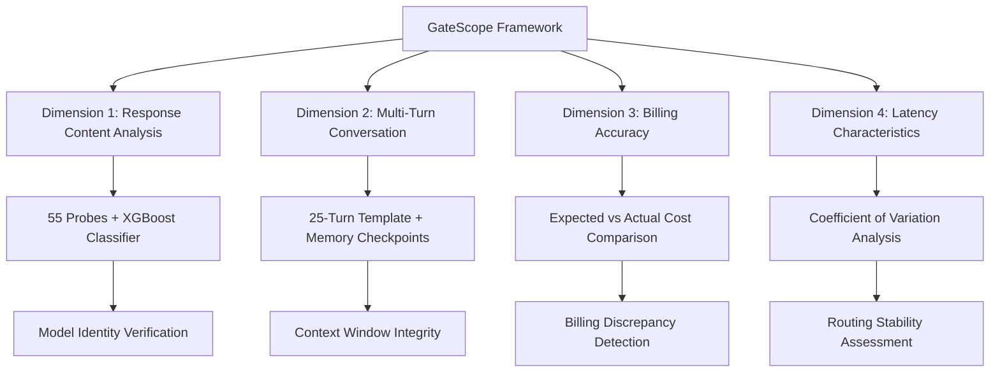
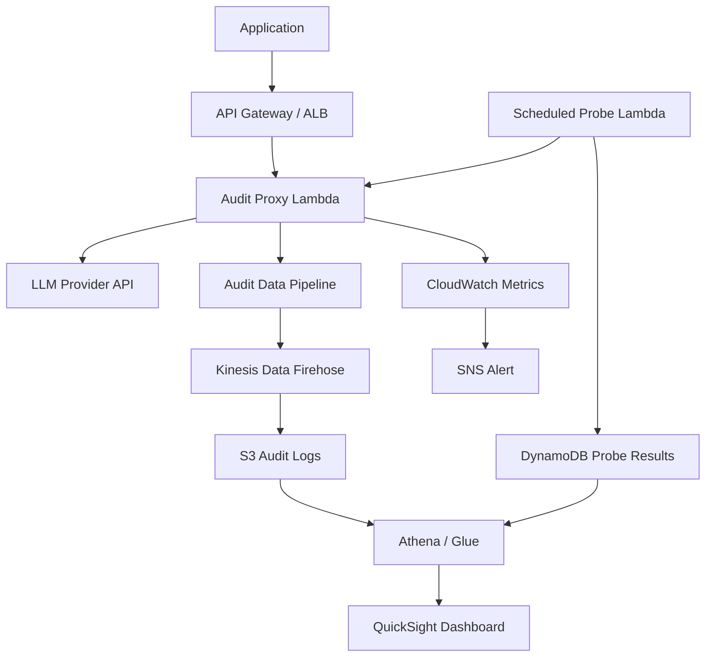

本記事は [Behavioral Consistency and Transparency Analysis on Large Language Model API Gateways](https://arxiv.org/abs/2604.21083)（Lin et al., IMC 2026）の解説記事です。

## 論文概要（Abstract）

サードパーティLLM APIゲートウェイは、OpenAIやAnthropic等のモデルプロバイダとエンドユーザーの間に位置するブラックボックスの仲介者である。本論文では、これらのゲートウェイの内部ルーティング、キャッシュ戦略、課金精度について外部から監査するフレームワーク「GateScope」を提案している。著者らは24種類のLLMを3つのベンダーから選定し、10の商用ゲートウェイに対して合計15,840件のレコードを収集して分析を行った。その結果、モデルのすり替え（GPT-4oの識別率が46.91%-98.18%）、課金の乖離（最大62.8%）、レイテンシの不安定性（変動係数が最大1.10）といった問題が検出されたと報告している。

この記事は [Zenn記事: Azure OpenAI負荷分散の障害シナリオ別レジリエンス設計とBicep実装](https://zenn.dev/0h_n0/articles/47e8c9dbd585ff) の深掘りです。

## 情報源

- **会議名**: IMC 2026（ACM Internet Measurement Conference）
- **年**: 2026
- **URL**: [https://arxiv.org/abs/2604.21083](https://arxiv.org/abs/2604.21083)
- **著者**: Guanjie Lin, Yinxin Wan, Shichao Pei, Ting Xu, Kuai Xu, Guoliang Xue
- **採択日**: 2026年3月13日（arXiv公開: 2026年4月22日）

## カンファレンス情報

**IMCについて**: ACM Internet Measurement Conference（IMC）は、インターネット計測・ネットワーク分析分野のトップカンファレンスの1つである。ネットワークインフラストラクチャ、プロトコル挙動、セキュリティ、プライバシーに関する実証的研究を対象としている。本論文はLLM APIゲートウェイという新たなインターネットインフラストラクチャの透明性を実証的に分析した点で、IMCの測定指向の研究方針に合致しており、論文の信頼性を裏付けている。

## 背景と動機

### LLM APIゲートウェイの問題構造

LLMの商用利用が拡大する中、直接プロバイダのAPIを利用するのではなく、サードパーティのゲートウェイ（APIリセラー）を経由してモデルにアクセスするケースが増加している。これらのゲートウェイは、低価格、レート制限の緩和、複数プロバイダへの統一アクセスなどを訴求している。

しかし、著者らは以下の根本的な問題を指摘している。

**透明性の欠如**: ゲートウェイの内部で、リクエストがどのモデルにルーティングされているか、キャッシュが適用されているか、課金が正確かをユーザーが検証する手段がない。これはAPIゲートウェイがブラックボックスとして機能しているためであり、Azure API Management（APIM）やAWS API Gatewayのようなファーストパーティの負荷分散構成とは根本的に異なる信頼モデルである。

**モデルすり替えのリスク**: 安価なモデルに差し替えることで利益率を上げる動機がゲートウェイ側に存在する。GPT-4oを購入したつもりがGPT-4o-miniで応答されていた場合、出力品質の低下に加え、推論コストの差額がゲートウェイの不当利益となる。

### 本研究の位置づけ

本論文は、ゲートウェイの挙動を外部から体系的に監査するフレームワークを初めて提案した研究である。Zenn記事で解説されているAzure APIMによる負荷分散設計は、ファーストパーティのゲートウェイを自前で構築するアプローチであるが、本論文の知見は「なぜサードパーティゲートウェイを安易に信頼すべきでないか」を定量的に示しており、自前ゲートウェイ構築の合理性を裏付けるエビデンスとなる。

## 技術的詳細（GateScopeフレームワーク）

GateScopeは4つの分析次元からゲートウェイの挙動を監査するブラックボックステストフレームワークである。



### Dimension 1: レスポンスコンテンツ分析

モデルのすり替えを検出するため、著者らは55種類のプローブ（テストクエリ）を設計している。各プローブに対するレスポンスから特徴量を抽出し、XGBoost分類器でモデルを識別する。

**分類器の性能**: 5-fold交差検証において、マクロ平均F1スコアは$0.968 \pm 0.085$を達成したと報告されている。この高い識別精度は、各LLMが固有の応答パターン（語彙選択、文章構造、推論スタイル）を持つことに基づいている。

プローブは以下のカテゴリで構成されている。

- **知識プローブ**: 特定の知識カットオフを持つ事実に関する質問
- **推論プローブ**: 数学的推論・論理パズル（モデルの能力差が顕著に出る）
- **スタイルプローブ**: 特定の形式（JSON、コード等）での応答を求め、フォーマティングの癖を検出
- **自己同定プローブ**: モデルに自身のアイデンティティを問う（ただし、ゲートウェイが応答を書き換える可能性があるため補助的な指標）

### Dimension 2: マルチターン会話性能

著者らは25ターンの会話テンプレートを設計し、特定のターンにメモリチェックポイントを設置している。これにより、ゲートウェイが会話コンテキストを正しく維持しているかを検証する。

テストでは、以下の観点を評価している。

- **会話の連続性**: 前のターンで提示した情報を後のターンで正確に参照できるか
- **コンテキストウィンドウの管理**: ゲートウェイがコンテキストを切り詰めたり要約したりしていないか
- **セッション管理**: マルチターンセッションが正しく維持されているか

メモリの劣化が検出された場合、ゲートウェイがコンテキストウィンドウを制限している（コスト削減のため）か、異なるモデルインスタンスにリクエストが分散されている可能性がある。

### Dimension 3: 課金精度分析

課金の乖離を検出するため、著者らは期待コストを以下の数式で定義している。

$$
C_{\text{expected}} = (n_{\text{in}} - n_{\text{cached}}) \times p_{\text{in}} + n_{\text{cached}} \times p_{\text{cached}} + n_{\text{out}} \times p_{\text{out}}
$$

ここで、
- $n_{\text{in}}$: 入力トークン数
- $n_{\text{cached}}$: キャッシュ済み入力トークン数
- $p_{\text{in}}$: 入力トークン単価
- $p_{\text{cached}}$: キャッシュ済みトークン単価
- $n_{\text{out}}$: 出力トークン数
- $p_{\text{out}}$: 出力トークン単価

実際にゲートウェイが報告する課金額$C_{\text{actual}}$との乖離率を計算し、課金の正確性を評価する。乖離の要因としては、トークンカウントの不一致、キャッシュ適用の非透明性、独自の価格マークアップなどが考えられる。

### Dimension 4: レイテンシ特性分析

レイテンシの変動係数（Coefficient of Variation）を用いてルーティングの安定性を評価する。

$$
CV = \frac{\sigma_T}{\mu_T}
$$

ここで$\sigma_T$はレイテンシの標準偏差、$\mu_T$はレイテンシの平均値である。CVが高い場合、ゲートウェイが異なるバックエンド（異なるリージョン、異なるモデル、異なるインスタンス）にリクエストをルーティングしている可能性がある。

ベースライン（直接プロバイダアクセス）のCVが0.63であるのに対し、一部のゲートウェイではCVが1.10に達しており、著者らはこれをルーティングの不安定性の指標としている。

## 実験結果

著者らは3つのベンダー（OpenAI、Anthropic、Google）から24種類のLLMを選定し、10の商用ゲートウェイを対象に合計15,840件のレコードを収集して分析を行った。

### モデルすり替え率

| モデル | ベースライン識別率 | ゲートウェイ最低識別率 | ゲートウェイ最高識別率 |
|--------|-------------------|---------------------|---------------------|
| GPT-4o | 98.18% | 46.91% | 98.18% |
| GPT-5 | - | 13.09% | - |

GPT-4oの識別率がゲートウェイによって46.91%まで低下する事実は、リクエストの半数以上が異なるモデルで処理されている可能性を示唆している。GPT-5においては、一部のゲートウェイで識別率が13.09%まで低下しており、著者らはこれを深刻なモデルすり替えの証拠と解釈している。

### 課金の乖離

分析の結果、課金乖離は最大62.8%に達したと報告されている。この乖離の主要因は以下の通りである。

- **トークンカウントの不一致**: ゲートウェイ独自のトークナイザーの使用
- **キャッシュの非透明性**: プロンプトキャッシュが適用されているにもかかわらず、非キャッシュ料金で課金
- **隠れたマークアップ**: 公表価格に上乗せされた手数料

### レイテンシの不安定性

ベースライン（直接アクセス）のCV=0.63に対し、ゲートウェイ経由のCVは最大1.10を記録している。CVが1.0を超える場合、レイテンシの標準偏差が平均値を上回っていることを意味し、予測不可能な応答時間が生じる。これはSLAの策定やタイムアウト設計を困難にする。

## 実装のポイント

GateScope的な監査を自社環境で実装するためのポイントを以下に示す。

### モデルフィンガープリンティング

本論文のXGBoost分類器アプローチは、自社でも以下の手順で実装可能である。

1. **プローブセットの設計**: 利用するモデルに特化したテストクエリを20-30種類用意する。数学的推論、コード生成、知識質問を含める
2. **ベースライン収集**: 直接プロバイダAPIにプローブを投入し、応答の特徴量（語彙分布、応答長、フォーマット特性）を収集する
3. **分類器訓練**: XGBoostまたはLightGBMで5-fold交差検証を行い、F1 >= 0.95を目標とする
4. **定期監査**: ゲートウェイ経由の応答をバッチで分類し、識別率の推移を監視する

### 課金監査の自動化

課金乖離の検出には、独立したトークンカウンターが必要である。tiktoken（OpenAI）やAnthropic Token Counting APIを用いて、リクエスト・レスポンスのトークン数を自前で計算し、ゲートウェイの報告値と比較する仕組みが有効である。

## Production Deployment Guide

本論文の知見を踏まえ、LLM APIゲートウェイの監査・監視パイプラインをプロダクション環境に実装する方法を示す。以下ではAWS上での構成を解説する。

### アーキテクチャ概要



GateScope的な監査をプロダクション環境で実現するには、3つの要素が必要である。

1. **Audit Proxy**: LLM APIへのリクエストを中継し、レイテンシ・トークン数・コストを記録するプロキシレイヤー
2. **Scheduled Probe**: 定期的にモデル識別プローブを送信し、応答の一貫性を検証するスケジュールジョブ
3. **Analytics Pipeline**: 監査データを集約・可視化し、異常を検知するデータパイプライン

### AWS実装パターン

**注意**: 以下のコスト試算は2026年8月時点のAWS ap-northeast-1（東京）リージョン料金に基づく概算値である。実際のコストはトラフィックパターン、リージョン、バースト使用量により変動する。最新料金はAWS料金計算ツールで確認を推奨する。

| 構成 | ユースケース | 主要コンポーネント | 月額概算 |
|------|------------|------------------|---------|
| Small | 個人/PoC（~100 req/日） | Lambda + DynamoDB + CloudWatch | $30-80 |
| Medium | チーム利用（~1,000 req/日） | ECS Fargate + Kinesis + Athena | $200-500 |
| Large | エンタープライズ（10,000+ req/日） | EKS + MSK + OpenSearch | $1,500-3,000 |

### Terraformインフラコード

#### Audit Proxy Lambda（Small構成）

```hcl
# audit_proxy_infra.tf
# GateScope式LLM API監査 - Serverless構成

provider "aws" {
  region = "ap-northeast-1"
}

# --- IAM Role ---
resource "aws_iam_role" "audit_lambda_role" {
  name = "llm-audit-proxy-role"
  assume_role_policy = jsonencode({
    Version = "2012-10-17"
    Statement = [{
      Action    = "sts:AssumeRole"
      Effect    = "Allow"
      Principal = { Service = "lambda.amazonaws.com" }
    }]
  })
}

resource "aws_iam_role_policy" "audit_lambda_policy" {
  name = "llm-audit-proxy-policy"
  role = aws_iam_role.audit_lambda_role.id
  policy = jsonencode({
    Version = "2012-10-17"
    Statement = [
      {
        Effect   = "Allow"
        Action   = ["dynamodb:PutItem", "dynamodb:GetItem", "dynamodb:Query"]
        Resource = aws_dynamodb_table.audit_records.arn
      },
      {
        Effect = "Allow"
        Action = [
          "cloudwatch:PutMetricData"
        ]
        Resource = "*"
        Condition = {
          StringEquals = {
            "cloudwatch:namespace" = "LLMAudit"
          }
        }
      },
      {
        Effect = "Allow"
        Action = [
          "logs:CreateLogGroup",
          "logs:CreateLogStream",
          "logs:PutLogEvents"
        ]
        Resource = "arn:aws:logs:ap-northeast-1:*:*"
      },
      {
        Effect   = "Allow"
        Action   = ["secretsmanager:GetSecretValue"]
        Resource = aws_secretsmanager_secret.llm_api_keys.arn
      }
    ]
  })
}

# --- Secrets Manager（APIキー管理） ---
resource "aws_secretsmanager_secret" "llm_api_keys" {
  name                    = "llm-audit/api-keys"
  recovery_window_in_days = 7
}

# --- DynamoDB（監査レコード） ---
resource "aws_dynamodb_table" "audit_records" {
  name         = "llm-audit-records"
  billing_mode = "PAY_PER_REQUEST"
  hash_key     = "request_id"
  range_key    = "timestamp"

  attribute {
    name = "request_id"
    type = "S"
  }

  attribute {
    name = "timestamp"
    type = "N"
  }

  attribute {
    name = "gateway_id"
    type = "S"
  }

  global_secondary_index {
    name            = "gateway-timestamp-index"
    hash_key        = "gateway_id"
    range_key       = "timestamp"
    projection_type = "ALL"
  }

  point_in_time_recovery {
    enabled = true
  }

  ttl {
    attribute_name = "ttl"
    enabled        = true
  }
}

# --- Lambda Function（Audit Proxy） ---
resource "aws_lambda_function" "audit_proxy" {
  function_name = "llm-audit-proxy"
  runtime       = "python3.12"
  handler       = "handler.lambda_handler"
  role          = aws_iam_role.audit_lambda_role.arn
  timeout       = 120
  memory_size   = 512

  filename         = "lambda_package.zip"
  source_code_hash = filebase64sha256("lambda_package.zip")

  environment {
    variables = {
      DYNAMODB_TABLE     = aws_dynamodb_table.audit_records.name
      SECRET_ARN         = aws_secretsmanager_secret.llm_api_keys.arn
      METRICS_NAMESPACE  = "LLMAudit"
    }
  }
}

# --- CloudWatch Alarm（レイテンシCV異常検知） ---
resource "aws_cloudwatch_metric_alarm" "latency_cv_alarm" {
  alarm_name          = "llm-audit-latency-cv-high"
  comparison_operator = "GreaterThanThreshold"
  evaluation_periods  = 3
  metric_name         = "LatencyCV"
  namespace           = "LLMAudit"
  period              = 300
  statistic           = "Average"
  threshold           = 0.8
  alarm_description   = "LLM Gateway latency CV exceeds 0.8 (baseline: 0.63)"
  alarm_actions       = [aws_sns_topic.audit_alerts.arn]
}

# --- SNS Topic（アラート通知） ---
resource "aws_sns_topic" "audit_alerts" {
  name = "llm-audit-alerts"
}
```

#### Scheduled Probe（定期モデル識別テスト）

```hcl
# scheduled_probe.tf
# GateScope式定期プローブ - EventBridge + Lambda

resource "aws_lambda_function" "probe_runner" {
  function_name = "llm-audit-probe-runner"
  runtime       = "python3.12"
  handler       = "probe_handler.lambda_handler"
  role          = aws_iam_role.audit_lambda_role.arn
  timeout       = 300
  memory_size   = 1024

  filename         = "probe_package.zip"
  source_code_hash = filebase64sha256("probe_package.zip")

  environment {
    variables = {
      DYNAMODB_TABLE  = aws_dynamodb_table.audit_records.name
      SECRET_ARN      = aws_secretsmanager_secret.llm_api_keys.arn
      PROBE_COUNT     = "55"
      TARGET_GATEWAYS = "gateway_a,gateway_b,direct_baseline"
    }
  }
}

# 6時間ごとにプローブ実行
resource "aws_cloudwatch_event_rule" "probe_schedule" {
  name                = "llm-audit-probe-schedule"
  schedule_expression = "rate(6 hours)"
}

resource "aws_cloudwatch_event_target" "probe_target" {
  rule = aws_cloudwatch_event_rule.probe_schedule.name
  arn  = aws_lambda_function.probe_runner.arn
}

resource "aws_lambda_permission" "allow_eventbridge" {
  statement_id  = "AllowEventBridgeInvoke"
  action        = "lambda:InvokeFunction"
  function_name = aws_lambda_function.probe_runner.function_name
  principal     = "events.amazonaws.com"
  source_arn    = aws_cloudwatch_event_rule.probe_schedule.arn
}
```

### Audit Proxy実装例

```python
"""LLM API Audit Proxy - GateScope inspired implementation."""
import json
import time
import hashlib
from dataclasses import dataclass, field
from decimal import Decimal
from typing import Any

import boto3
import tiktoken


@dataclass(frozen=True)
class AuditRecord:
    """監査レコード"""

    request_id: str
    gateway_id: str
    model_requested: str
    model_detected: str
    input_tokens_expected: int
    input_tokens_reported: int
    output_tokens_reported: int
    cost_expected: Decimal
    cost_reported: Decimal
    latency_ms: float
    timestamp: float = field(default_factory=time.time)

    @property
    def cost_discrepancy_pct(self) -> float:
        """課金乖離率を計算"""
        if self.cost_expected == 0:
            return 0.0
        return float(
            abs(self.cost_reported - self.cost_expected)
            / self.cost_expected
            * 100
        )

    @property
    def token_discrepancy_pct(self) -> float:
        """トークン数乖離率を計算"""
        if self.input_tokens_expected == 0:
            return 0.0
        return abs(
            self.input_tokens_reported - self.input_tokens_expected
        ) / self.input_tokens_expected * 100


def count_tokens_independent(
    text: str,
    model: str = "gpt-4o",
) -> int:
    """独立したトークンカウント（tiktoken使用）

    Args:
        text: トークンカウント対象テキスト
        model: モデル名（エンコーディング選択用）

    Returns:
        トークン数
    """
    try:
        encoding = tiktoken.encoding_for_model(model)
    except KeyError:
        encoding = tiktoken.get_encoding("cl100k_base")
    return len(encoding.encode(text))


def calculate_expected_cost(
    input_tokens: int,
    output_tokens: int,
    cached_tokens: int = 0,
    price_input: Decimal = Decimal("0.0025"),
    price_cached: Decimal = Decimal("0.00125"),
    price_output: Decimal = Decimal("0.01"),
) -> Decimal:
    """期待コストを計算（論文の数式に基づく）

    C_expected = (n_in - n_cached) * p_in
                 + n_cached * p_cached
                 + n_out * p_out

    Args:
        input_tokens: 入力トークン数
        output_tokens: 出力トークン数
        cached_tokens: キャッシュ済みトークン数
        price_input: 入力トークン単価（$/1Kトークン）
        price_cached: キャッシュ済みトークン単価
        price_output: 出力トークン単価

    Returns:
        期待コスト（USD）
    """
    non_cached = input_tokens - cached_tokens
    cost = (
        Decimal(non_cached) / 1000 * price_input
        + Decimal(cached_tokens) / 1000 * price_cached
        + Decimal(output_tokens) / 1000 * price_output
    )
    return cost.quantize(Decimal("0.000001"))


def calculate_latency_cv(
    latencies: list[float],
) -> float:
    """レイテンシの変動係数を計算

    CV = sigma_T / mu_T

    Args:
        latencies: レイテンシのリスト（ms）

    Returns:
        変動係数（CV）
    """
    if len(latencies) < 2:
        return 0.0
    mean = sum(latencies) / len(latencies)
    if mean == 0:
        return 0.0
    variance = sum((x - mean) ** 2 for x in latencies) / len(latencies)
    std_dev = variance ** 0.5
    return std_dev / mean
```

### セキュリティベストプラクティス

LLM API監査システムを構築する際のセキュリティ上の注意点を以下に示す。

**APIキー管理**:
- APIキーはSecrets Managerに保存し、Lambda環境変数には格納しない
- キーのローテーションをSecrets Managerの自動ローテーション機能で90日ごとに実施する
- 監査用APIキーは本番ワークロード用とは別に発行し、最小権限で運用する

**ネットワークセキュリティ**:
- LLM APIへの外向き通信はVPCエンドポイントまたはNAT Gatewayを経由させる
- 監査データへのアクセスはVPC内に限定し、DynamoDBにはVPCエンドポイント経由でアクセスする

**データ保護**:
- 監査レコードにはプロンプトの全文を保存しない。ハッシュ値（SHA-256）とトークン数のみを記録する
- DynamoDBはサーバーサイド暗号化（AWS管理キーまたはCMK）を有効にする
- TTLを設定し、90日を超えた監査レコードは自動削除する

### 運用・監視設定

GateScope論文の知見を監視に反映するための主要メトリクスとアラート閾値を以下に示す。

| メトリクス | 説明 | アラート閾値 | 根拠 |
|-----------|------|------------|------|
| `LatencyCV` | レイテンシ変動係数 | > 0.8 | ベースラインCV=0.63に対し25%超過 |
| `ModelIdentificationRate` | モデル識別率 | < 90% | GPT-4oベースライン98.18%に対し大幅低下 |
| `BillingDiscrepancy` | 課金乖離率 | > 10% | 論文で最大62.8%を検出 |
| `TokenCountMismatch` | トークン数不一致率 | > 5% | 独立カウントとの乖離 |
| `MemoryDegradation` | マルチターン記憶劣化 | チェックポイント失敗 >= 2 | 25ターン中の記憶チェック |

```python
"""CloudWatch Custom Metrics for LLM Gateway Audit."""
import boto3
from typing import Any


def publish_audit_metrics(
    gateway_id: str,
    latency_cv: float,
    identification_rate: float,
    billing_discrepancy_pct: float,
    namespace: str = "LLMAudit",
) -> None:
    """監査メトリクスをCloudWatchに送信

    Args:
        gateway_id: ゲートウェイ識別子
        latency_cv: レイテンシ変動係数
        identification_rate: モデル識別率（0-1）
        billing_discrepancy_pct: 課金乖離率（%）
        namespace: CloudWatch名前空間
    """
    cloudwatch = boto3.client("cloudwatch")
    cloudwatch.put_metric_data(
        Namespace=namespace,
        MetricData=[
            {
                "MetricName": "LatencyCV",
                "Value": latency_cv,
                "Unit": "None",
                "Dimensions": [
                    {"Name": "GatewayId", "Value": gateway_id},
                ],
            },
            {
                "MetricName": "ModelIdentificationRate",
                "Value": identification_rate,
                "Unit": "None",
                "Dimensions": [
                    {"Name": "GatewayId", "Value": gateway_id},
                ],
            },
            {
                "MetricName": "BillingDiscrepancy",
                "Value": billing_discrepancy_pct,
                "Unit": "Percent",
                "Dimensions": [
                    {"Name": "GatewayId", "Value": gateway_id},
                ],
            },
        ],
    )
```

### コスト最適化チェックリスト

| 項目 | 施策 | 削減率目安 |
|------|------|----------|
| プローブ頻度 | 全プローブ55本を6時間ごとではなく、ランダムサンプリング15本/時に変更 | API呼出し-70% |
| データ保持 | DynamoDB TTLで90日後に自動削除、長期保存はS3 Glacier | ストレージ-60% |
| Lambda実行 | Arm64（Graviton2）ランタイムを使用 | 計算コスト-20% |
| 分析クエリ | AthenaによるS3直接クエリ（DynamoDBスキャン回避） | 分析コスト-80% |
| アラート | CloudWatch Anomaly Detectionで動的閾値（手動チューニング削減） | 運用工数-50% |

## 実運用への応用

### Azure APIMを使う場合のゲートウェイ透明性確保

Zenn記事で解説されているAzure APIMによるOpenAI負荷分散構成は、GateScope論文の知見に照らすと以下の利点がある。

**自前ゲートウェイのメリット**:
- ルーティングロジックが完全に制御可能であり、モデルすり替えのリスクが構造的に排除される
- APIMのDiagnostics LoggingでリクエストごとのバックエンドURL、レイテンシ、ステータスコードを記録できる
- 課金はAzure OpenAIの使用量メーターに基づくため、ゲートウェイによるマークアップが発生しない

**GateScope的監査の適用**:
- APIMのHealth Probeとして論文のプローブ設計を応用し、バックエンドOpenAIインスタンスの応答一貫性を監視する
- レイテンシCVの計算をAPIM Policy内のログデータから実施し、特定のバックエンドインスタンスの劣化を早期検知する
- 複数リージョンにまたがるAPIM構成では、リージョン間のレイテンシ差を論文のCV分析で定量化できる

本論文の結果は、コスト削減を理由にサードパーティゲートウェイを採用する場合でも、GateScope的な監査パイプラインの並行運用が不可欠であることを示唆している。Azure APIMやAWS API Gatewayのようなファーストパーティソリューションを採用した場合でも、バックエンドの応答品質を継続的に監視する体制は有益である。

## 関連研究

LLM APIの信頼性と透明性に関する研究は比較的新しい分野である。著者らは以下の関連研究との差異を述べている。

- **LLM Benchmark研究**: LMSYS Chatbot Arena（Chiang et al., 2024）等はモデル自体の能力を評価するが、ゲートウェイの仲介による品質変化は対象外である
- **APIセキュリティ研究**: 従来のAPIセキュリティ研究はRESTful APIの認証・認可に焦点を当てており、LLM固有の課題（モデルすり替え、トークン課金、コンテキスト管理）は未探索であった
- **サプライチェーン信頼性**: ソフトウェアサプライチェーンの信頼性（Sigstore、SLSA等）の概念をLLM APIに拡張する試みとして本研究を位置づけている

本論文は、LLM APIゲートウェイを「インターネットインフラストラクチャの一部」として捉え、計測科学の手法で体系的に分析した点に独自性がある。

## まとめ

本論文は、10の商用LLM APIゲートウェイに対してGateScopeフレームワークによるブラックボックス監査を実施し、以下の問題を定量的に明らかにした。

- **モデルすり替え**: GPT-4oの識別率がゲートウェイにより46.91%まで低下、GPT-5では13.09%まで低下
- **課金の乖離**: 最大62.8%の課金差異を検出
- **レイテンシの不安定性**: 変動係数が最大1.10（ベースライン0.63）

これらの知見は、LLM APIを利用するシステムにおいて、ゲートウェイの透明性を独立して検証する仕組みの必要性を裏付けている。Azure APIMやAWS API Gatewayのようなファーストパーティのゲートウェイを自前で構築する場合でも、本論文の4次元分析（レスポンスコンテンツ、マルチターン、課金、レイテンシ）を監視フレームワークに組み込むことで、バックエンドの応答品質を継続的に保証できる。

著者らの提言する「独立した検証、マルチターンテスト、課金監査、レイテンシ監視」の4本柱は、LLMベースのシステムを本番運用する全てのチームにとって実践的な指針となる。

## 参考文献

- Lin, G., Wan, Y., Pei, S., Xu, T., Xu, K., & Xue, G. (2026). Behavioral Consistency and Transparency Analysis on Large Language Model API Gateways. *Proceedings of the ACM Internet Measurement Conference (IMC 2026)*. [https://arxiv.org/abs/2604.21083](https://arxiv.org/abs/2604.21083)
- Chiang, W.-L., et al. (2024). Chatbot Arena: An Open Platform for Evaluating LLMs by Human Preference. *arXiv preprint arXiv:2403.04132*.
- OpenAI. (2024). Tokenizer and Pricing Documentation. [https://platform.openai.com/docs/guides/text-generation](https://platform.openai.com/docs/guides/text-generation)
