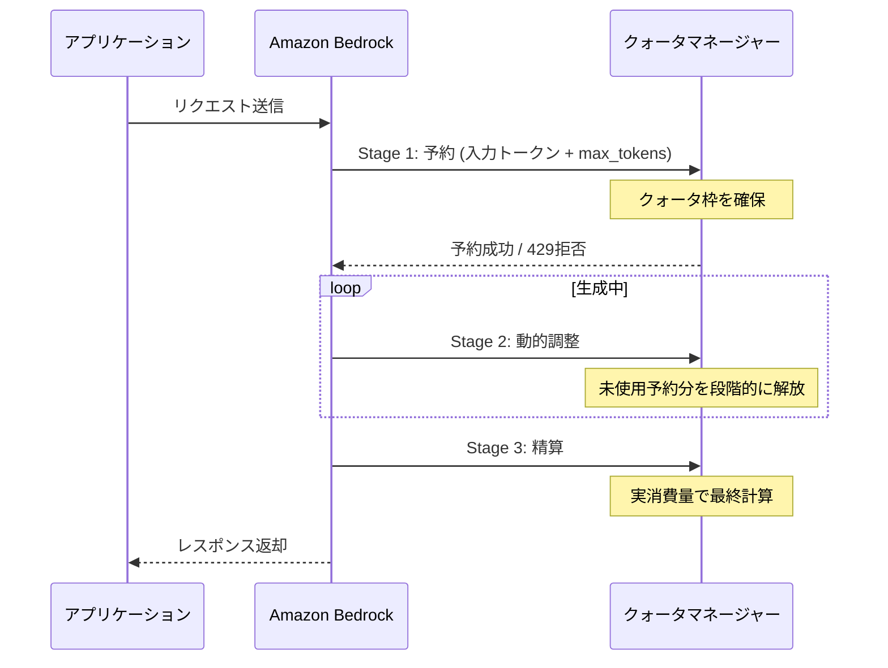
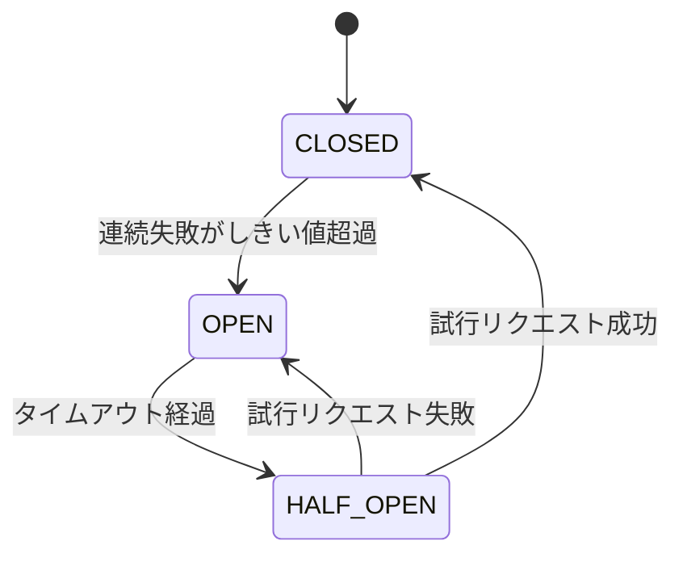

本記事は [Optimize your applications for scale and reliability on Amazon Bedrock](https://aws.amazon.com/blogs/machine-learning/optimize-your-applications-for-scale-and-reliability-on-amazon-bedrock/) の解説記事です。

## ブログ概要

AWS公式ブログでは、Amazon Bedrockを本番環境で運用する際のスケーラビリティとレジリエンスの最適化手法が体系的に解説されています。具体的には、429 ThrottlingExceptionと503 ServiceUnavailableExceptionの区別に基づくエラーハンドリング、トークンクォータの3段階ライフサイクル（予約・動的調整・精算）、Exponential Backoff with Jitterによるリトライ戦略、サーキットブレーカーパターン、Cross-Region Inference（CRIS）による地理的分散、そしてCloudWatchを活用した監視設計が網羅されています。Azure OpenAI + API Managementによる負荷分散と対比すると、AWSはプラットフォーム組み込みの機能で同等のレジリエンスを実現するアプローチを採用しています。

この記事は [Zenn記事: Azure OpenAI負荷分散の障害シナリオ別レジリエンス設計とBicep実装](https://zenn.dev/0h_n0/articles/47e8c9dbd585ff) の深掘りです。

## 情報源

- **種別**: 企業テックブログ（AWS Machine Learning Blog）
- **URL**: [Optimize your applications for scale and reliability on Amazon Bedrock](https://aws.amazon.com/blogs/machine-learning/optimize-your-applications-for-scale-and-reliability-on-amazon-bedrock/)
- **著者**: Farzin Bagheri（Principal TAM）、Abel Laura（Sr. TPM, Resilience）、Arun KM（Principal TAM, Bedrock）、Aswath Ram A Srinivasan（Sr. Worldwide Specialist SA, GenAI）
- **公開日**: 2026年2月11日

## 技術的背景

LLM APIサービスの本番運用において、レート制限とサービス障害への耐性設計は避けて通れない課題です。Azure OpenAIではAPI Management（APIM）を前段に配置し、ポリシーベースで429リトライ・バックエンドプール切り替え・サーキットブレーカーを実装するアプローチが一般的です。Zenn記事で解説されているように、APIMのretry-policyやcircuit-breakerポリシーをBicepで宣言的に定義し、障害シナリオごとに挙動を制御します。

一方、Amazon Bedrockでは、クォータ管理・リトライ・リージョン分散がプラットフォーム側の機能として提供されており、アプリケーションコードとCloudWatch監視の組み合わせでレジリエンスを構築します。Azure APIMが「インフラ層での制御」であるのに対し、Bedrockは「SDK + プラットフォーム機能 + アプリケーション層のパターン」という構成であり、それぞれの利点を理解することが重要です。

## 実装アーキテクチャ

### エラー分類: 429 vs 503

AWS公式ブログでは、Amazon Bedrockが返す2種類のエラーを明確に区別して対処することが推奨されています。

| エラーコード | 例外名 | 原因 | 対処方針 |
|:---:|:---|:---|:---|
| 429 | ThrottlingException | クォータ超過（RPM/TPM） | Backoff + クォータ調整 |
| 503 | ServiceUnavailableException | 一時的なサービス障害 | リトライ + リージョン切替 |

429 ThrottlingExceptionはさらに2種類に細分化されます。RPMベース（リクエスト数超過）は「Too many requests, please wait before trying again」、TPMベース（トークン数超過）は「Too many tokens, please wait before trying again」というメッセージで区別できます。

Azure OpenAI APIMでは、バックエンドから返却される`Retry-After`ヘッダーを参照してリトライ間隔を決定しますが、Bedrockではアプリケーション側でExponential Backoffを実装する必要があります。

### トークンクォータライフサイクル

AWS公式ブログでは、トークンクォータが3段階で管理されることが説明されています。



**Stage 1（予約）**: リクエスト到着時に`入力トークン数 + max_tokens`の合計をクォータから予約します。

**Stage 2（動的調整）**: 生成中に、実際に使用されないと判明した予約分を段階的に解放し、並行リクエストがクォータを利用できるようにします。

**Stage 3（精算）**: リクエスト完了時に実消費量で最終計算を行います。精算時の計算式は以下の通りです。

$$
\text{消費量} = \text{InputTokenCount} + \text{CacheWriteInputTokens} + (\text{OutputTokenCount} \times \text{burndown\_rate})
$$

Burndown rateはモデルによって異なり、AWS公式ブログでは以下の値が示されています。

| モデル | Burndown Rate |
|:---|:---:|
| Claude 4.8 | 15x |
| Claude Sonnet 5 | 10x |
| Claude 4.7以前 | 5x |

なお、`CacheReadInputTokens`はクォータにカウントされないと説明されています。

### サーキットブレーカー状態遷移

AWS公式ブログでは、サーキットブレーカーパターンの3状態遷移が推奨されています。



- **CLOSED（通常状態）**: リクエストが正常に処理される状態
- **OPEN（遮断状態）**: 連続失敗がしきい値を超えた場合、新規リクエストを即座に拒否する
- **HALF_OPEN（テスト状態）**: 一定時間経過後に試行リクエストを許可し、成功すればCLOSEDに復帰する

Azure APIMではcircuit-breakerポリシーとして宣言的に定義できますが、Bedrockではアプリケーションコード内でpybreakerやtenacityといったライブラリを使って実装します。

## Production Deployment Guide

### AWS実装パターン: Small / Medium / Large

本番環境の規模に応じた推奨構成を以下に示します。AWS公式ブログの推奨事項を基に、段階的なアーキテクチャを整理しました。

**Small（単一リージョン・単一アプリ）**: 1つのAWSアカウント・1リージョンで運用し、SDK組み込みのadaptiveリトライとアプリケーション層のサーキットブレーカーで対応します。

**Medium（マルチアプリ・クォータ分離）**: AWS公式ブログでは、クォータがアカウント+リージョンレベルで共有されるため、複数アプリケーションがある場合はAWSアカウントを分離することが推奨されています。

**Large（マルチリージョン・高可用性）**: Cross-Region Inference（CRIS）のgeographic inference profileを複数組み合わせ、リージョン障害時にもサービスを継続します。

### リトライ実装: Exponential Backoff with Jitter

AWS公式ブログで示されているリトライ戦略をPythonで実装します。

```python
"""Amazon Bedrock向けExponential Backoff with Jitterリトライ実装.

AWS公式ブログの推奨パラメータに基づく実装。
429 ThrottlingExceptionと503 ServiceUnavailableExceptionの
両方に対応する。
"""

import random
import time
from typing import Any

import boto3
from botocore.config import Config
from botocore.exceptions import ClientError


# AWS公式ブログ推奨パラメータ
MAX_RETRIES: int = 5
BASE_DELAY: float = 1.0  # 秒
MAX_DELAY: float = 60.0  # 秒
RETRYABLE_ERROR_CODES: frozenset[str] = frozenset({
    "ThrottlingException",
    "ServiceUnavailableException",
})


def calculate_backoff_delay(attempt: int) -> float:
    """Exponential Backoff with Jitterで待機時間を算出する.

    Args:
        attempt: 現在のリトライ回数（0始まり）

    Returns:
        待機時間（秒）。MAX_DELAYを上限とする。
    """
    exponential_delay = min(BASE_DELAY * (2 ** attempt), MAX_DELAY)
    jitter = random.uniform(0, 1)
    return exponential_delay + jitter


def invoke_with_retry(
    client: Any,
    model_id: str,
    body: str,
) -> dict[str, Any]:
    """リトライ付きでBedrock invoke_modelを呼び出す.

    Args:
        client: boto3 bedrock-runtime クライアント
        model_id: 使用するモデルID
        body: リクエストボディ（JSON文字列）

    Returns:
        Bedrockのレスポンス辞書

    Raises:
        ClientError: MAX_RETRIES回リトライしても成功しない場合
    """
    for attempt in range(MAX_RETRIES + 1):
        try:
            response = client.invoke_model(
                modelId=model_id,
                body=body,
            )
            return response
        except ClientError as e:
            error_code = e.response["Error"]["Code"]
            if error_code not in RETRYABLE_ERROR_CODES:
                raise
            if attempt == MAX_RETRIES:
                raise
            delay = calculate_backoff_delay(attempt)
            time.sleep(delay)

    # ここには到達しないが型チェッカーのために記述
    raise RuntimeError("Unreachable")
```

Azure APIMの`retry-policy`では`retry-after`ヘッダーに基づく待機が自動的に行われますが、Bedrockではこのようにアプリケーション側でバックオフロジックを実装します。

### Token-Aware Rate Limiter

AWS公式ブログでは、60秒のスライディングウィンドウでトークン消費量を追跡するレートリミッターが紹介されています。

```python
"""Token-Awareレートリミッター.

60秒のスライディングウィンドウでTPM消費量を追跡し、
クォータ超過前にリクエストを制御する。

注意: AWS公式ブログで指摘されているように、Amazon Bedrockの
クォータはアカウント+リージョンレベルで共有されるため、
マルチアプリケーション環境ではアプリ単独の追跡では不十分。
"""

import time
from collections import deque
from dataclasses import dataclass, field


@dataclass
class TokenUsageEntry:
    """トークン使用量の記録エントリ."""

    timestamp: float
    tokens_used: int


@dataclass
class TokenAwareRateLimiter:
    """スライディングウィンドウ方式のトークンレートリミッター.

    Attributes:
        tpm_limit: 1分あたりのトークン上限
        window_seconds: スライディングウィンドウの秒数
    """

    tpm_limit: int
    window_seconds: int = 60
    _usage: deque[TokenUsageEntry] = field(
        default_factory=deque, init=False, repr=False,
    )

    def _evict_expired(self) -> None:
        """ウィンドウ外のエントリを除去する."""
        cutoff = time.monotonic() - self.window_seconds
        while self._usage and self._usage[0].timestamp < cutoff:
            self._usage.popleft()

    @property
    def current_usage(self) -> int:
        """現在のウィンドウ内トークン消費量を返す."""
        self._evict_expired()
        return sum(entry.tokens_used for entry in self._usage)

    def can_make_request(self, estimated_tokens: int) -> bool:
        """リクエストがクォータ内に収まるか判定する.

        Args:
            estimated_tokens: 推定トークン消費量
                （入力トークン + max_tokens）

        Returns:
            クォータ内であればTrue
        """
        return self.current_usage + estimated_tokens <= self.tpm_limit

    def record_usage(self, tokens_used: int) -> None:
        """実際のトークン消費量を記録する.

        Args:
            tokens_used: 消費されたトークン数
        """
        self._usage.append(
            TokenUsageEntry(
                timestamp=time.monotonic(),
                tokens_used=tokens_used,
            )
        )
```

### サーキットブレーカー実装

AWS公式ブログで推奨されているpybreakerを使った実装パターンです。

```python
"""pybreakerによるサーキットブレーカー実装.

AWS公式ブログで推奨されているライブラリを使用。
Azure APIMではcircuit-breakerポリシーとして宣言的に
定義できるが、Bedrockではアプリケーションコードで実装する。
"""

import json
from typing import Any

import pybreaker

# サーキットブレーカーの設定
bedrock_breaker = pybreaker.CircuitBreaker(
    fail_max=5,          # OPEN遷移までの連続失敗数
    reset_timeout=30,    # HALF_OPEN遷移までの秒数
)


@bedrock_breaker
def invoke_bedrock_with_circuit_breaker(
    client: Any,
    model_id: str,
    prompt: str,
    max_tokens: int = 1250,
) -> dict[str, Any]:
    """サーキットブレーカー付きでBedrockを呼び出す.

    Args:
        client: boto3 bedrock-runtime クライアント
        model_id: 使用するモデルID
        prompt: ユーザープロンプト
        max_tokens: 最大出力トークン数

    Returns:
        パース済みのレスポンス辞書

    Raises:
        pybreaker.CircuitBreakerError: 回路がOPEN状態の場合
    """
    body = json.dumps({
        "anthropic_version": "bedrock-2023-05-31",
        "max_tokens": max_tokens,
        "messages": [{"role": "user", "content": prompt}],
    })
    response = client.invoke_model(modelId=model_id, body=body)
    return json.loads(response["body"].read())
```

### 監視・アラーム設定

AWS公式ブログでは、CloudWatchメトリクスに基づく監視設計が推奨されています。以下はTerraformによるアラーム定義の例です。

```hcl
# CloudWatchアラーム: 429スロットリング検出
# AWS公式ブログ推奨: クォータ使用率80%でアラート

resource "aws_cloudwatch_metric_alarm" "bedrock_throttling" {
  alarm_name          = "bedrock-throttling-alarm"
  comparison_operator = "GreaterThanThreshold"
  evaluation_periods  = 1
  metric_name         = "InvocationThrottles"
  namespace           = "AWS/Bedrock"
  period              = 300 # 5分間
  statistic           = "Sum"
  threshold           = 10  # 5分間で10回以上のスロットリング
  alarm_description   = "Bedrock 429 ThrottlingException detected"

  dimensions = {
    ModelId = "anthropic.claude-sonnet-4-6-20260610-v1:0"
  }

  alarm_actions = [aws_sns_topic.alerts.arn]
}

# CloudWatchアラーム: 503サービス障害検出
resource "aws_cloudwatch_metric_alarm" "bedrock_server_errors" {
  alarm_name          = "bedrock-server-errors-alarm"
  comparison_operator = "GreaterThanThreshold"
  evaluation_periods  = 2
  metric_name         = "InvocationServerErrors"
  namespace           = "AWS/Bedrock"
  period              = 300
  statistic           = "Sum"
  threshold           = 5
  alarm_description   = "Bedrock 503 ServiceUnavailableException detected"

  dimensions = {
    ModelId = "anthropic.claude-sonnet-4-6-20260610-v1:0"
  }

  alarm_actions = [aws_sns_topic.alerts.arn]
}

# SNSトピック（アラート通知先）
resource "aws_sns_topic" "alerts" {
  name = "bedrock-resilience-alerts"
}
```

AWS公式ブログでは、さらにサービス成功率SLO（10分間で95%未満をアラート）やクォータ使用率メトリクス（`max_tokens`を含むカスタムメトリクスをCloudWatch Logsに記録）の設定も推奨されています。

Azure APIMではApplication InsightsとAzure Monitorの組み合わせで同等の監視を実現しますが、Bedrockの`InvocationThrottles`のように429を直接カウントする専用メトリクスが用意されている点は運用上の利点です。

### セキュリティとコスト最適化

AWS公式ブログの内容を踏まえ、運用上の要点を整理します。

**セキュリティ**:
- IAMポリシーで`bedrock:InvokeModel`を必要なモデルIDに限定する
- `com.amazonaws.{region}.bedrock-runtime`のPrivateLinkでトラフィックをAWSネットワーク内に閉じる
- CloudWatch Logsへのモデル呼び出しログで入出力トークン数の監査証跡を残す

**コスト最適化**:
- `max_tokens`を明示設定し、不要なクォータ予約を防止（デフォルト64,000は過剰）
- Batch Inference APIで最大50%コスト削減（バッチあたり最大10,000レコード）
- `CacheReadInputTokens`はクォータ非消費のため、プロンプトキャッシュを積極活用
- CloudWatchメトリクスでクォータ使用率80%到達時にアラート

## パフォーマンス最適化

### Token-Aware Rate Limiting

AWS公式ブログでは、60秒のスライディングウィンドウでトークン消費量を追跡するレートリミッターが紹介されています。RPMだけでなくTPMも管理することで、大量トークンを消費する少数リクエストによるクォータ枯渇を防止できます。

ただし重要な制約として、Bedrockのクォータはアカウント+リージョンレベルで共有されるため、マルチアプリ環境ではアプリ単独の追跡では不十分です。AWSアカウントの分離が推奨されています。

### Cross-Region Inference（CRIS）

CRISはリクエストを複数リージョンに分散する機能で、2種類のInference Profileが提供されています。

- **Global Inference Profile**: モデルがデプロイされている全リージョンにリクエストを分散する
- **Geographic Inference Profile**: 特定の地理的範囲（US、EU、APAC）内のリージョンに限定して分散する

AWS公式ブログでは、CRISは「キャパシティ分散メカニズム」であり災害復旧（DR）ソリューションではないと明記されています。リージョン間移動時にはプロンプトキャッシュミス（TTL 5分）が発生する点も注意です。

Azure APIMではバックエンドプールに複数リージョンを登録して分散しますが、CRISはプラットフォーム側で透過的にルーティングするため、アプリケーションコード変更が不要です。

## 運用での学び

### max_tokens設定の落とし穴

AWS公式ブログで特に強調されているのが、`max_tokens`を未設定にした場合の影響です。Claudeモデルではデフォルトが64,000トークンに設定されるため、実際には1,000トークン程度しか生成しないユースケースでも、クォータ予約時に64,000トークン分が確保されます。AWS公式ブログの例では、`max_tokens=32,000`を設定した場合と`max_tokens=1,250`を設定した場合で、入力8,000トークンのリクエストのクォータ予約量が40,000トークン対9,250トークンと4倍以上の差が生じることが示されています。

これはAzure OpenAIでも同様の課題があり、TPM（Tokens Per Minute）の消費量計算にmax_tokensが影響するため、両プラットフォームに共通する重要な最適化ポイントです。

### マルチアプリケーション環境の課題

AWS公式ブログでは、クォータがアカウント+リージョンレベルで共有される設計に起因する課題が指摘されています。複数アプリケーションが同一アカウント・リージョンを使用する場合、あるアプリの急増トラフィックが他のアプリのクォータを圧迫します。Bedrockの推奨対策であるAWSアカウント分離は、Azure OpenAIにおける「リソースを分離して個別にTPMを割り当てる」アプローチと対応しています。

## 学術研究との関連

サーキットブレーカーパターンはMichael Nygardの「Release It!」で体系化されたパターンであり、AWS公式ブログでもCLOSED/OPEN/HALF_OPENの3状態モデルが採用されています。Azure APIMのcircuit-breakerポリシーも同じ概念モデルに基づいており、実装レイヤーが異なるだけです。Exponential Backoff with JitterはAWSが2015年に公開した同名ブログの手法がそのまま適用されています。

Azure APIMアプローチ（インフラ層での宣言的定義）とBedrockアプローチ（SDK + アプリケーション層）は、APIMが統一ポリシー管理に優れる一方、Bedrockはアプリケーションごとの最適化が可能というトレードオフがあります。

## まとめと実践への示唆

AWS公式ブログでは、Amazon Bedrockの本番運用に必要なレジリエンスパターンが体系的にまとめられています。429/503のエラー分類、トークンクォータの3段階ライフサイクル、max_tokens設定の最適化、サーキットブレーカー、CRISによる地理的分散、CloudWatch監視と、Zenn記事で解説したAzure OpenAI APIMアプローチと対比しながら理解することで、クラウドLLMサービス共通のレジリエンス設計原則が明確になります。実装時には、まずmax_tokensの明示的設定とCloudWatch監視の導入から着手し、段階的にサーキットブレーカーやCRISを追加するアプローチが現実的です。

## 参考文献

1. Bagheri, F., Laura, A., KM, A., & Srinivasan, A. R. A. (2026). "Optimize your applications for scale and reliability on Amazon Bedrock." AWS Machine Learning Blog. [https://aws.amazon.com/blogs/machine-learning/optimize-your-applications-for-scale-and-reliability-on-amazon-bedrock/](https://aws.amazon.com/blogs/machine-learning/optimize-your-applications-for-scale-and-reliability-on-amazon-bedrock/)
2. AWS. (2015). "Exponential Backoff And Jitter." AWS Architecture Blog. [https://aws.amazon.com/blogs/architecture/exponential-backoff-and-jitter/](https://aws.amazon.com/blogs/architecture/exponential-backoff-and-jitter/)
3. Nygard, M. (2007). "Release It!: Design and Deploy Production-Ready Software." Pragmatic Bookshelf.
4. 0h-n0. (2026). "Azure OpenAI負荷分散の障害シナリオ別レジリエンス設計とBicep実装." Zenn. [https://zenn.dev/0h_n0/articles/47e8c9dbd585ff](https://zenn.dev/0h_n0/articles/47e8c9dbd585ff)
