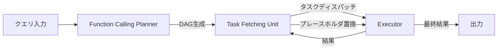

本記事は [An LLM Compiler for Parallel Function Calling](https://arxiv.org/abs/2312.04511)（ICML 2024採択）の解説記事です。

## 論文概要（Abstract）

LLMCompilerは、LLMエージェントの関数呼び出しを効率的に並列化するフレームワークである。著者らは、関数呼び出し間の依存関係を有向非巡回グラフ（DAG）として自動的に識別し、独立したタスクを並列実行するアーキテクチャを提案している。論文のベンチマーク結果によると、ReActと比較してレイテンシを最大3.7倍短縮、コストを最大6.7倍削減し、精度も最大約9%向上させている。

この記事は [Zenn記事: LangGraphステートマシンの状態爆発を防ぐSubGraph分割とReducer設計](https://zenn.dev/0h_n0/articles/013c55b172d67d) の深掘りです。

## 情報源

- **arXiv ID**: 2312.04511
- **URL**: [https://arxiv.org/abs/2312.04511](https://arxiv.org/abs/2312.04511)
- **著者**: Sehoon Kim, Suhong Moon, Ryan Tabrizi, Nicholas Lee, Michael W. Mahoney, Kurt Keutzer, Amir Gholami
- **発表年**: 2024（ICML 2024採択）
- **分野**: cs.CL
- **コード**: [https://github.com/SqueezeAILab/LLMCompiler](https://github.com/SqueezeAILab/LLMCompiler)

## 背景と動機（Background & Motivation）

LLMエージェントがツール呼び出しを行う際、ReActのような従来手法では「思考→関数呼び出し→結果観察」を1つずつ逐次実行する。この逐次実行は2つの問題を引き起こす。第一に、独立した関数呼び出し（例: 2つの異なる企業の時価総額を検索する）が並列実行されないためレイテンシが増大する。第二に、各ステップでLLMの推論が介在するためトークン消費が蓄積し、コストが膨らむ。

著者らはこの問題を、従来のコンパイラ最適化の考え方で解決する。プログラミング言語のコンパイラが命令の依存関係を解析して並列実行可能な命令を特定するのと同様に、LLMCompilerは関数呼び出し間の依存関係をDAGとして解析し、並列実行を可能にする。

## 主要な貢献（Key Contributions）

- **3コンポーネントアーキテクチャ**: Function Calling Planner、Task Fetching Unit、Executorの3つの独立したコンポーネントによる関数呼び出しのオーケストレーション
- **DAGベースの依存関係解析**: 関数呼び出し間の依存関係を自動的にDAGとして構築し、独立したタスクを並列化
- **プレースホルダ変数**: 依存するタスク間の結果受け渡しに`$1`, `$2`などのプレースホルダ変数を使用し、実行時に実値で置換
- **ストリーミングプランナー最適化**: 計画の生成とタスク実行をパイプライン化し、追加で最大1.3倍の高速化を実現（論文Section 3.2より）

## 技術的詳細（Technical Details）

### 3コンポーネントアーキテクチャ

LLMCompilerは以下の3つのコンポーネントで構成される:



**1. Function Calling Planner（計画生成器）**

クエリを受け取り、関数呼び出しのDAGを生成する。LLMを使って以下の形式で計画を出力する:

```
1. search("Microsoft market cap") → $1
2. search("Apple market cap") → $2
3. divide($1, $2) → $3
```

この例では、タスク1とタスク2は互いに独立しているため並列実行でき、タスク3はタスク1, 2の結果に依存する。プランナーは定義済みのプロンプトとツール定義を入力として、この依存構造を自動的に識別する。

**2. Task Fetching Unit（タスクフェッチャー）**

CPUのインストラクションフェッチに相当するコンポーネントである。著者らは「貪欲ポリシー」を採用し、依存関係が解決されたタスクを即座にExecutorにディスパッチする。プレースホルダ変数（`$1`, `$2`）は、先行タスクの完了時に実際の値で置換される。

**3. Executor（実行器）**

フェッチされたタスクを非同期に並列実行する。各タスクは専用のメモリを持ち、実行結果は依存する下流タスクに伝播される。ツールの種類は単純な計算からLLMベースのエージェントまで多岐にわたる。

### 依存関係グラフの構築

著者らは、プランナーが生成する計画をDAGとして構造化する。具体的な例を示す:

$$
G = (V, E) \quad \text{where} \quad V = \{t_1, t_2, \ldots, t_n\}, \quad E = \{(t_i, t_j) \mid t_j \text{ depends on } t_i\}
$$

ここで、$V$ はタスクの集合、$E$ は依存関係のエッジの集合である。DAGの性質により、依存関係のないタスク群は同時に実行できる。

### ストリーミングプランナー

標準のプランナーは全タスクの計画が完了してから実行を開始するが、ストリーミングプランナーはLLMの出力をストリーミングし、各タスクの計画が生成された時点で即座に実行を開始する。これにより、長時間のツール実行を含むワークフローで追加の高速化が得られる。

```python
from typing import TypedDict, Any
from concurrent.futures import ThreadPoolExecutor, Future

class TaskNode(TypedDict):
    task_id: int
    function_name: str
    args: list[Any]
    dependencies: list[int]

def execute_dag(tasks: list[TaskNode], tools: dict) -> dict[int, Any]:
    """DAGに基づく並列タスク実行

    Args:
        tasks: タスクノードのリスト（DAG順）
        tools: ツール名→関数のマッピング

    Returns:
        タスクID→結果のマッピング
    """
    results: dict[int, Any] = {}
    futures: dict[int, Future] = {}

    with ThreadPoolExecutor(max_workers=8) as executor:
        pending = list(tasks)

        while pending:
            ready = [
                t for t in pending
                if all(dep in results for dep in t["dependencies"])
            ]

            for task in ready:
                resolved_args = [
                    results[a] if isinstance(a, str) and a.startswith("$")
                    else a
                    for a in task["args"]
                ]
                fn = tools[task["function_name"]]
                futures[task["task_id"]] = executor.submit(fn, *resolved_args)
                pending.remove(task)

            for tid, future in list(futures.items()):
                if future.done() and tid not in results:
                    results[tid] = future.result()

    return results
```

## 実験結果（Results）

### 主要ベンチマーク結果（論文Table 1, 2, 3より）

| ベンチマーク | LLMCompiler精度 | ReAct精度 | レイテンシ短縮 | コスト削減 |
|------------|---------------|----------|------------|----------|
| HotpotQA (GPT) | 62.00% | 56.67% | 1.80× | 3.37× |
| Movie Rec. (GPT) | 77.13% | 68.60% | 3.74× | 6.73× |
| ParallelQA (GPT) | 89.38% | 81.25% | 2.15× | 4.65× |
| Game of 24 (GPT-4) | 75.33% | — | 2.89× | — |

### トークン効率（論文Table 4より）

| ベンチマーク | 手法 | 入力トークン | 出力トークン | コスト/1k例 |
|------------|------|-----------|-----------|-----------|
| HotpotQA | ReAct | 2,900 | 120 | $5.00 |
| HotpotQA | LLMCompiler | 1,300 | 80 | $1.47 |
| Movie Rec. | ReAct | 20,000 | 230 | $20.46 |
| Movie Rec. | LLMCompiler | 2,800 | 115 | $3.04 |

Movie Recommendationでは、入力トークンが7.1倍削減されている。これは、ReActが各ステップで累積するコンテキストを再送信するのに対し、LLMCompilerは計画時に1回のみLLMを呼び出すためである。

### ReActの失敗モード分析（論文Section 4.2より）

著者らはReActの主要な2つの失敗モードを特定している:

1. **早期終了**: Movie Recommendationにおいて、ReActの約85%の例で十分な情報を収集する前に処理が打ち切られる
2. **反復ループ**: HotpotQAの約10%の例で4回以上の関数呼び出しが必要になり、無限ループに陥る

LLMCompilerはこれらの問題を構造的に回避する。計画フェーズで必要な関数呼び出しを事前に列挙するため、早期終了や反復ループが発生しにくい。

## 実装のポイント（Implementation）

LLMCompilerの設計思想は、LangGraphのSend APIによる動的fan-out/fan-inパターンと直接対応する:

1. **Planner ↔ conditional_edges**: LLMCompilerのPlannerが生成するDAGは、LangGraphの`add_conditional_edges`で実現できる条件分岐に相当する

2. **Task Fetching Unit ↔ Send API**: 依存関係が解決されたタスクの即座ディスパッチは、LangGraphの`Send`APIによる動的ノード生成と同じパターンである

3. **Executor ↔ 並列ノード実行**: 並列タスク実行はLangGraphの静的fan-out（`START`から複数ノードへのエッジ）および動的fan-out（Send API）で実現できる

4. **プレースホルダ変数 ↔ Reducer**: タスク間の結果受け渡しは、LangGraphの`Annotated[list, operator.add]`によるReducerパターンで安全に管理できる

```python
from langgraph.graph import StateGraph, START, END
from langgraph.types import Send

class CompilerState(TypedDict):
    query: str
    plan: list[dict]
    results: Annotated[list[dict], add]

def plan_tasks(state: CompilerState) -> dict:
    """LLMCompilerのPlannerに相当: クエリからタスクDAGを生成"""
    # LLMで計画を生成（省略）
    return {"plan": planned_tasks}

def route_to_executors(state: CompilerState) -> list[Send]:
    """Task Fetching Unitに相当: 並列実行可能なタスクをディスパッチ"""
    independent_tasks = [
        t for t in state["plan"] if not t.get("dependencies")
    ]
    return [
        Send("execute_task", {"task": t, "query": state["query"]})
        for t in independent_tasks
    ]

def execute_task(state: dict) -> dict:
    """Executorに相当: 個別タスクの実行"""
    task = state["task"]
    result = run_tool(task["function"], task["args"])
    return {"results": [{"task_id": task["id"], "result": result}]}
```

## 実運用への応用（Practical Applications）

LLMCompilerの並列実行戦略は、以下のプロダクションシナリオで有効である:

1. **マルチソース情報検索**: RAGパイプラインで複数のデータソースを並列に検索するケース。Zenn記事で議論されているSend APIの動的fan-outで実装可能

2. **バッチドキュメント処理**: 複数ドキュメントの並列要約・分析。LLMCompilerの3.7倍高速化は、100件のドキュメント処理で実時間を約27%に短縮することを意味する

3. **APIレート制限への対応**: 論文では言及されていないが、本番環境ではLLM APIのレート制限が並列実行のボトルネックになる。Zenn記事のSend API注意点で指摘されているとおり、並列数の制御機構が必要

## 関連研究（Related Work）

- **ReAct** (Yao et al., 2023): 思考-行動-観察の逐次ループ。LLMCompilerの直接的なベースラインであり、全ベンチマークで下回っている
- **OpenAI Parallel Function Calling**: OpenAIのAPIレベルの並列関数呼び出し機能。LLMCompilerはこれをフレームワークレベルで汎用化し、オープンソースモデルにも適用可能にしている
- **Tree of Thoughts** (Yao et al., 2024): Game of 24ベンチマークで比較対象。LLMCompilerは2.89倍の高速化を達成

## まとめと今後の展望

LLMCompilerは、コンパイラ最適化の概念をLLMエージェントの関数呼び出しに適用し、DAGベースの依存関係解析と並列実行により、レイテンシ・コスト・精度のすべてで改善を実現している。Zenn記事で議論されているLangGraphのSend APIとReducerパターンは、LLMCompilerの実行モデルをアプリケーション開発者向けに抽象化したものと位置づけられる。

今後の課題として、動的再計画（実行中に計画を修正する機能）の効率化と、より複雑な依存関係パターン（条件分岐を含むDAG）への対応が挙げられている。

## 参考文献

- **arXiv**: [https://arxiv.org/abs/2312.04511](https://arxiv.org/abs/2312.04511)
- **Code**: [https://github.com/SqueezeAILab/LLMCompiler](https://github.com/SqueezeAILab/LLMCompiler)
- **ICML 2024**: [https://dl.acm.org/doi/abs/10.5555/3692070.3693047](https://dl.acm.org/doi/abs/10.5555/3692070.3693047)
- **Related Zenn article**: [https://zenn.dev/0h_n0/articles/013c55b172d67d](https://zenn.dev/0h_n0/articles/013c55b172d67d)
