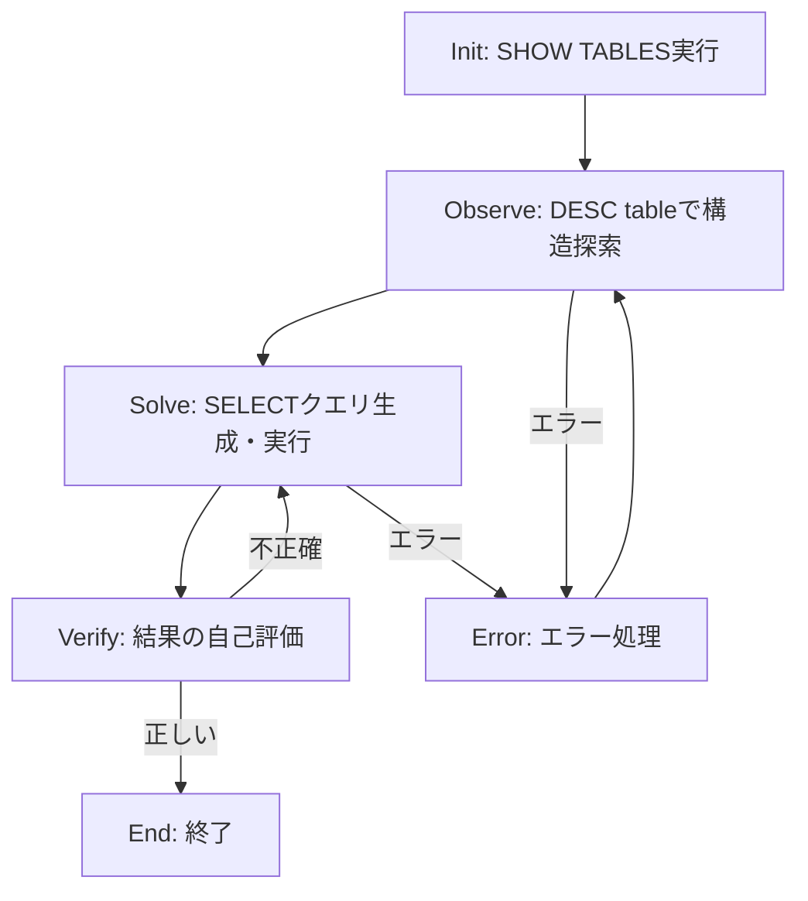

本記事は [StateFlow: Enhancing LLM Task-Solving through State-Driven Workflows](https://arxiv.org/abs/2403.11322)（COLM 2024採択）の解説記事です。

## 論文概要（Abstract）

StateFlowは、LLMを用いた複雑なタスク解決プロセスを有限状態機械（FSM）として形式化するフレームワークである。著者らは「プロセス制御（状態遷移）」と「サブタスク実行（状態内アクション）」を分離する二層設計を提案し、制御性と解釈可能性を向上させている。InterCode SQLベンチマークではReAct比で13%の成功率向上と5倍のコスト削減、ALFWorldでは28%の成功率向上と3倍のコスト削減を報告している。

この記事は [Zenn記事: LangGraphステートマシンの状態爆発を防ぐSubGraph分割とReducer設計](https://zenn.dev/0h_n0/articles/013c55b172d67d) の深掘りです。

## 情報源

- **arXiv ID**: 2403.11322
- **URL**: [https://arxiv.org/abs/2403.11322](https://arxiv.org/abs/2403.11322)
- **著者**: Yiran Wu, Tianwei Yue, Shaokun Zhang, Chi Wang, Qingyun Wu
- **発表年**: 2024（COLM 2024採択）
- **分野**: cs.CL, cs.AI
- **コード**: [https://github.com/yiranwu0/StateFlow](https://github.com/yiranwu0/StateFlow)

## 背景と動機（Background & Motivation）

LLMエージェントがツール呼び出しや環境操作を伴う複雑なタスクを解く際、ReActのような手法では思考（Thought）→行動（Action）→観察（Observation）を逐次的に繰り返す。しかしこのアプローチでは、すべての制御ロジックが単一のプロンプトに集約されるため、タスクが複雑になるにつれてプロンプトが肥大化し、LLMの推論精度が低下する。

著者らはこの問題を「プロセス制御とサブタスク実行の未分離」と特定している。ReActでは1つのプロンプトに全工程の指示を詰め込むため、トークン消費が増大し（論文Table 5より、ReActは1例あたり約2,043トークンに対し、StateFlowは約400トークン）、コストと精度の両面で不利になる。StateFlowはDavid Harelのステートチャート（1987）の階層的状態管理の考え方をLLMワークフローに適用し、この問題を解決する。

## 主要な貢献（Key Contributions）

- **状態機械による形式化**: LLMタスク解決をトランスデューサ有限状態機械 $\langle S, s_0, F, \delta, \Gamma, \Omega \rangle$ として定式化し、状態遷移と状態内アクションを明確に分離
- **二層設計**: 「プロセスの基盤付け（process grounding）」を状態遷移で、「サブタスク実行（sub-task solving）」をアクション関数で担当する二層アーキテクチャ
- **コスト効率**: 状態ごとに最適化されたプロンプトを使用することで、ReAct比で最大5倍のコスト削減を実現
- **Reflexionとの互換性**: 反復的な自己改善手法であるReflexionと組み合わせることで、ALFWorldで94.8%の成功率を達成（論文Section 5.3より）

## 技術的詳細（Technical Details）

### 状態機械の形式化

StateFlowは以下の6-tupleで定義されるトランスデューサFSMとしてタスク解決を形式化する:

$$
\mathcal{M} = \langle S, s_0, F, \delta, \Gamma, \Omega \rangle
$$

ここで、
- $S$: 状態の集合（タスク解決の各フェーズに対応）
- $s_0 \in S$: 初期状態
- $F \subseteq S$: 終了状態の集合
- $\delta: S \times \Gamma^* \rightarrow S$: 遷移関数（現在の状態とコンテキスト履歴から次状態を決定）
- $\Gamma$: 出力の集合（プロンプト $P$、LLM応答 $C$、ツール出力 $O$）
- $\Omega$: 出力関数の集合（各状態で実行されるアクション）

この定式化の要点は、遷移関数 $\delta$ がコンテキスト履歴 $\Gamma^*$ 全体を参照できる点である。これにより、単純な文字列マッチングによる決定論的遷移と、LLMによる文脈依存の遷移の両方を統一的に扱える。

### 遷移メカニズム

著者らは2種類の遷移メカニズムを提案している:

1. **静的文字列マッチング**: ツール出力に特定の文字列（例: "execution failed"）が含まれるかで遷移先を決定。決定論的で高速
2. **LLMベースの状態判定**: コンテキスト履歴をLLMに入力し、次の遷移先を判断させる。柔軟だがコストがかかる

### アルゴリズム

論文Algorithm 1に基づく実行フローを以下に示す:

```python
from typing import TypedDict, Callable

class State:
    def __init__(
        self,
        name: str,
        output_fns: list[Callable],
        is_final: bool = False,
    ):
        self.name = name
        self.output_fns = output_fns
        self.is_final = is_final

def run_stateflow(
    task: str,
    initial_state: State,
    transition_fn: Callable,
    max_transitions: int = 20,
) -> tuple[State, list[str]]:
    """StateFlowの実行ループ

    Args:
        task: 入力タスク文字列
        initial_state: 初期状態
        transition_fn: 遷移関数 δ(s, Γ*) -> s'
        max_transitions: 最大遷移回数

    Returns:
        (最終状態, コンテキスト履歴)
    """
    context_history: list[str] = [task]
    current_state = initial_state
    counter = 0

    while not current_state.is_final and counter < max_transitions:
        for output_fn in current_state.output_fns:
            result = output_fn(context_history)
            context_history.append(result)

        current_state = transition_fn(current_state, context_history)
        counter += 1

    return current_state, context_history
```

### SQL タスクの状態設計

論文で示されたInterCode SQLタスクの StateFlow は6つの状態で構成される:



各状態は専用のプロンプトを持ち、そのフェーズに必要な指示のみを含む。例えばObserve状態では「`DESC [table_name]`コマンドを1つだけ実行し、テーブル構造を確認せよ」という限定的な指示になる。これにより、ReActの単一プロンプト（2,043トークン）に対して約400トークンまで削減される。

## 実験結果（Results）

### InterCode SQL（論文Table 2より）

| 手法 | 成功率 | 平均ターン数 | エラー率 | コスト($) |
|------|-------|------------|---------|----------|
| Plan & Solve | 47.68% | 4.31 | 12.5% | 2.38 |
| ReAct | 50.68% | 5.58 | 16.3% | 17.73 |
| ReAct_Refined | 57.74% | 5.47 | 3.82% | 18.05 |
| **StateFlow** | **63.73%** | 5.67 | 6.82% | **3.82** |

StateFlowはReAct比で+13.05%の成功率向上を達成しつつ、コストを約4.6倍削減している。

### 難易度別の成功率（論文Table 3より）

| 難易度 | Easy | Medium | Hard | Extra Hard |
|-------|------|--------|------|-----------|
| StateFlow | 87.9% | 62.9% | 59.8% | 36.7% |

### ALFWorld（論文Table 4より）

| 手法 | Pick | Clean | Heat | Cool | Look | Pick2 | 全体 |
|------|------|-------|------|------|------|-------|------|
| ReAct | 83.3% | 36.6% | 53.6% | 58.7% | 63.0% | 41.2% | 55.5% |
| ALFChat(3agent) | 84.7% | 60.2% | 69.6% | 77.8% | 68.5% | 41.2% | 67.7% |
| **StateFlow** | **91.7%** | **83.9%** | **85.5%** | 79.4% | **92.6%** | **62.7%** | **83.3%** |

### Reflexionとの統合（論文Section 5.3より）

StateFlow + Reflexionは6イテレーションで94.8%の成功率を達成し、総コスト$8.6であった。一方、ReAct + Reflexionは74.6%で$27.9のコストがかかっている。

### アブレーション研究（論文Table 5より）

| 除去した状態 | 成功率変化 |
|------------|----------|
| Observe状態を除去 | -5.9% |
| Error状態を除去 | -5.0% |
| Verify状態を除去 | -1.45% |

Error状態は困難なタスクほど重要性が増す（Hardタスクでは20%のケースでError状態に遷移する）。

## 実装のポイント（Implementation）

StateFlowを実装する際の注意点:

1. **状態粒度のトレードオフ**: 状態が細かすぎると遷移ロジックが複雑になり、粗すぎると単一プロンプトの肥大化という元の問題に戻る。論文ではSQLタスクで6状態、ALFWorldで7〜10状態が適切としている

2. **プロンプトの状態特化**: 各状態のプロンプトはその状態のサブタスクに特化させる。汎用的な指示は避け、具体的なツール呼び出しパターンを指定する

3. **遷移条件の設計**: 決定論的（文字列マッチング）とLLMベースの遷移を適切に使い分ける。ツール出力のパースには決定論的遷移が適し、文脈依存の判断にはLLMベースが適する

4. **Error状態の必須化**: アブレーション結果が示すとおり、Error状態の除去は5%の性能低下を招く。エラーリカバリパスを設計に含めることが重要

```python
from typing import Literal
from langgraph.graph import StateGraph, START, END

class SQLTaskState(TypedDict):
    query: str
    tables: list[str]
    current_sql: str
    result: str
    errors: list[str]
    phase: Literal["init", "observe", "solve", "verify", "error", "end"]

def build_sql_stateflow() -> StateGraph:
    """StateFlowパターンに基づくSQLタスクグラフ"""
    builder = StateGraph(SQLTaskState)

    builder.add_node("init", init_show_tables)
    builder.add_node("observe", explore_schema)
    builder.add_node("solve", generate_and_execute_sql)
    builder.add_node("verify", self_evaluate_result)
    builder.add_node("error", handle_error)

    builder.add_edge(START, "init")
    builder.add_edge("init", "observe")
    builder.add_conditional_edges(
        "observe",
        route_from_observe,
        {"solve": "solve", "error": "error"},
    )
    builder.add_conditional_edges(
        "solve",
        route_from_solve,
        {"verify": "verify", "error": "error"},
    )
    builder.add_conditional_edges(
        "verify",
        route_from_verify,
        {"end": END, "solve": "solve"},
    )
    builder.add_edge("error", "observe")

    return builder
```

## 実運用への応用（Practical Applications）

StateFlowの設計原則は、LangGraphでのエージェントワークフロー設計と直接的に対応する。Zenn記事で議論されている状態爆発問題に対して、StateFlowは以下の示唆を与える:

1. **プロセス制御とサブタスク実行の分離**: LangGraphのSubGraphパターンと同じ思想。各SubGraphは1つの「状態」に対応し、内部でサブタスク実行を担当する

2. **プロンプトの分割**: ReActの単一プロンプトを状態ごとに分割することで、トークン消費を約80%削減できる。これはLangGraphの各ノードに専用プロンプトを割り当てるパターンと一致する

3. **段階的な状態追加**: 著者らはALFWorldで初期7状態モデルを10状態に拡張し、性能を83.3%から88.8%に向上させた（論文Section 5.2より）。LangGraphでも初期設計を小さく保ち、ボトルネック分析に基づいて状態を追加する戦略が有効

4. **コスト最適化**: 状態特化プロンプトによるトークン削減は、API呼び出しコストの直接的な削減につながる。本番環境では数千〜数万回の呼び出しが発生するため、5倍のコスト削減は大きなインパクトとなる

## 関連研究（Related Work）

- **ReAct** (Yao et al., 2023): 思考・行動・観察の逐次サイクル。StateFlowの直接的なベースライン。全情報を単一プロンプトに集約するため、タスク複雑化に伴いプロンプトが肥大化する
- **Plan & Solve** (Wang et al., 2023): 計画生成と実行の2段階アプローチ。StateFlowより成功率が約16%低いが、コストは最小
- **AutoGen** (Wu et al., 2023): マルチエージェント会話フレームワーク。ALFChatとして評価され、StateFlowの67.7%に対して83.3%の成功率で下回る
- **Reflexion** (Shinn et al., 2024): 自己反省による反復改善。StateFlowと組み合わせることで相乗効果を発揮し、94.8%を達成

## まとめと今後の展望

StateFlowは、LLMタスク解決を有限状態機械として形式化することで、制御性・解釈可能性・コスト効率を同時に向上させるフレームワークである。論文のベンチマーク結果は、状態機械ベースの設計がReActのような汎用手法を大幅に上回ることを示している。

一方で、著者ら自身が認めているとおり、StateFlowの状態設計にはタスクワークフローに関するドメイン知識が必要である。LangGraphのSubGraph設計でも同様に、適切な関心事の分離にはドメイン理解が求められる。今後の研究方向として、LLMを用いたStateFlowの自動構築やアクティブラーニングによる状態の動的追加・削除が挙げられている。

## 参考文献

- **arXiv**: [https://arxiv.org/abs/2403.11322](https://arxiv.org/abs/2403.11322)
- **Code**: [https://github.com/yiranwu0/StateFlow](https://github.com/yiranwu0/StateFlow)
- **COLM 2024**: [https://openreview.net/forum?id=3nTbuygoop](https://openreview.net/forum?id=3nTbuygoop)
- **Related Zenn article**: [https://zenn.dev/0h_n0/articles/013c55b172d67d](https://zenn.dev/0h_n0/articles/013c55b172d67d)
