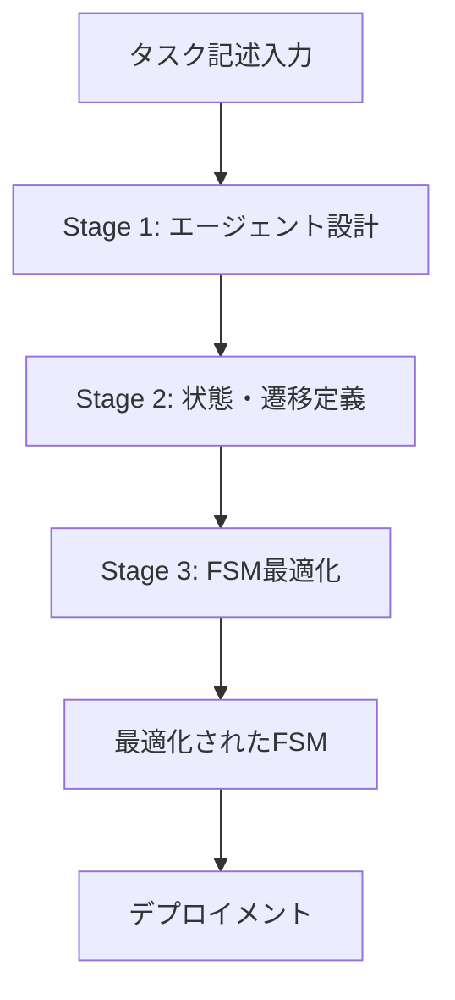

本記事は [MetaAgent: Automatically Constructing Multi-Agent Systems Based on Finite State Machines](https://arxiv.org/abs/2507.22606)（ICML 2025採択）の解説記事です。

## 論文概要（Abstract）

MetaAgentは、タスク記述からFSM（有限状態機械）ベースのマルチエージェントシステムを自動的に設計・最適化するフレームワークである。著者らは、既存の自動設計手法が「ツール統合の欠如」「外部訓練データへの依存」「固定的なコミュニケーション構造」という制約を持つことを指摘し、FSMによる柔軟な状態遷移と状態トレースバック機構でこれらを克服している。論文のベンチマーク結果によると、自動設計手法の中で最高性能を達成し、人間が設計したシステムの97%の性能に到達している（論文Table 3より）。

この記事は [Zenn記事: LangGraphステートマシンの状態爆発を防ぐSubGraph分割とReducer設計](https://zenn.dev/0h_n0/articles/013c55b172d67d) の深掘りです。

## 情報源

- **arXiv ID**: 2507.22606
- **URL**: [https://arxiv.org/abs/2507.22606](https://arxiv.org/abs/2507.22606)
- **著者**: Yaolun Zhang, Xiaogeng Liu, Chaowei Xiao
- **発表年**: 2025（ICML 2025採択）
- **分野**: cs.AI

## 背景と動機（Background & Motivation）

LLMベースのマルチエージェントシステムの設計は、従来は人間のエンジニアが手動で行ってきた。エージェントの役割定義、コミュニケーション構造、ツール割り当て、エラーリカバリパスをすべて事前に設計する必要があり、新しいタスクドメインへの適応コストが高い。

既存の自動設計手法（AutoAgents, SPP, ADAS等）は、この問題に取り組んでいるが、著者らは3つの根本的な制約を指摘している:

1. **ツール統合の欠如**: SPPやADASはツール呼び出し（検索エンジン、コードインタプリタ等）をサポートしていない
2. **外部訓練データへの依存**: ADASは既存のマルチエージェントコードを訓練データとして必要とする
3. **固定的な通信構造**: 線形パイプラインや中央集権型オーケストレータに限定され、状態トレースバック（前の状態に戻る）機能がない

MetaAgentはFSMを基盤構造として採用することで、これらの制約を統一的に解決する。

## 主要な貢献（Key Contributions）

- **FSMベースの汎用構造**: 線形パイプライン、分散議論、中央集権オーケストレータがすべてFSMの特殊ケースであることを証明し、FSMを統一的な基盤構造として提案
- **自動構築パイプライン**: タスク記述からエージェント設計→状態定義→遷移条件設定→FSM最適化を自動実行
- **状態トレースバック**: 後続状態で問題が検出された場合に前の状態に戻れる機構。ソフトウェア開発でQAテスト失敗時にプログラマー状態に戻るなどの実用的なシナリオに対応
- **外部訓練データ不要**: LLMアダプターのみで構築が完了し、既存のマルチエージェントコードを必要としない

## 技術的詳細（Technical Details）

### FSMの形式化

MetaAgentのFSMは以下の5-tupleで定義される:

$$
\mathcal{M} = (\Sigma, S, s_0, F, \delta)
$$

ここで、
- $\Sigma$: タスクドメインの入力事例の集合
- $S$: 状態の集合（各状態は問題解決過程の特定のフェーズを表す）
- $s_0 \in S$: 初期状態
- $F \subseteq S$: 終了状態の集合
- $\delta: S \times \Sigma \rightarrow S$: 状態遷移関数

各状態 $s \in S$ は以下の4つの要素を持つ:

| 要素 | 説明 |
|------|------|
| 状態指示 (instruction) | 割り当てられたエージェントへの自然言語の作業指示 |
| 割当エージェント (agent) | その状態で作業を担当するエージェント |
| 条件検証器 (verifier) | エージェントの出力が遷移条件を満たすか判定するコンポーネント |
| リスナーエージェント (listeners) | 状態出力を自身のメモリに記録する他のエージェント群 |

### 3段階の構築プロセス

MetaAgentの構築は以下の3段階で行われる:



**Stage 1: エージェント設計**

LLMアダプターがタスク記述を解析し、必要なエージェントの役割、システムプロンプト、使用ツールを生成する。

```json
{
  "agent_id": "0",
  "name": "RequirementDesigner",
  "system_prompt": "You are RequirementDesigner...",
  "tools": ["search_engine"]
}
```

**Stage 2: 状態・遷移条件定義**

各エージェントに対応する状態と、状態間の遷移条件を定義する。

```json
{
  "state_id": "1",
  "agent_id": "0",
  "instruction": "Gather and analyze requirements...",
  "is_initial": true,
  "is_final": false,
  "listener": ["1"]
}
```

遷移条件の例:

```json
{
  "from_state": "1",
  "to_state": "2",
  "condition": "If requirements are clear and complete"
}
```

**Stage 3: FSM最適化**

構築されたFSMに対して、等価な状態のマージによる最適化を行う。

### FSM最適化アルゴリズム

最適化は状態のペアワイズ比較に基づく反復的なマージプロセスである（論文Algorithm 1より）:

```python
def optimize_fsm(states: list[State], llm_adaptor) -> list[State]:
    """FSMの状態をマージして最適化

    Args:
        states: 初期状態リスト
        llm_adaptor: LLMベースの等価性判定器

    Returns:
        最適化された状態リスト
    """
    changed = True
    while changed:
        changed = False
        for i, s_i in enumerate(states):
            for j, s_j in enumerate(states):
                if i >= j:
                    continue
                if llm_adaptor.are_mergeable(s_i, s_j):
                    merged = merge_states(s_i, s_j)
                    states = [s for s in states if s not in (s_i, s_j)]
                    states.append(merged)
                    changed = True
                    break
            if changed:
                break
    return states
```

マージ可能性の判定は以下の3基準に基づく:
1. エージェント間の役割が十分に区別されているか
2. 状態間の情報伝達が必要か
3. ツール割り当てに重複があるか

### 状態トレースバック機構

MetaAgentの独自機能である状態トレースバックは、後の状態で問題が検出された場合に前の状態に戻ることを可能にする。

$$
\delta(s_j, \sigma) = s_i \quad \text{where} \quad i < j
$$

条件検証器にはNull遷移の選択肢もある。Null遷移は現在の状態に留まり、エージェントにフィードバックを与えて出力を修正させる。

論文のアブレーション結果（Table 6より）によると、トレースバック機能を無効化するとソフトウェア開発タスクの性能が58.8%低下する。これは、反復的な修正が必要な複雑タスクでのトレースバックの重要性を示している。

### FSMの汎用性の証明

著者らは、既存のマルチエージェント通信構造がFSMの特殊ケースであることを示している:

| 構造 | FSM表現 |
|------|---------|
| 線形パイプライン | $s_1 \rightarrow s_2 \rightarrow \cdots \rightarrow s_n$（一方向遷移のみ） |
| 分散議論 | $s_1 \leftrightarrows s_2 \leftrightarrows s_3$（相互遷移） |
| 中央集権オーケストレータ | $s_{hub} \leftrightarrows s_i$（ハブ状遷移） |

FSMはこれらを包含し、さらに条件分岐や状態トレースバックも表現できる。

## 実験結果（Results）

### テキストベースタスク（論文Table 2より）

| 手法 | Writing | GPQA |
|------|---------|------|
| MetaAgent | **0.86** | **0.60** |
| SPP (auto-designed) | 0.79 | 0.45 |

### 機械学習ベンチマーク（論文Table 3より）

MetaAgentは正規化平均スコア0.83を達成し、人間が設計した最良システムの97%の性能に到達している。

### ソフトウェア開発（論文Table 4より）

| 手法 | 平均チェックポイント通過率 |
|------|----------------------|
| MetaAgent | **0.85** |
| MetaGPT (human-designed) | 0.35 |
| AutoAgents | 0.28 |

MetaAgentは人間設計のMetaGPTを大幅に上回っている。

### アブレーション研究（論文Table 6より）

| 除去した機能 | Writing | GPQA | ML Bench | SWE Dev |
|------------|---------|------|----------|---------|
| Full MetaAgent | 0.86 | 0.60 | 0.83 | 0.85 |
| ツール除去 | -8.1% | -13.33% | — | — |
| 最適化除去 | — | — | -26.5% | -35.3% |
| トレースバック除去 | — | — | — | -58.8% |

### コスト分析（論文Table 7より）

5つのMLタスクに対する総トークン消費:
- MetaAgent設計: 6,226トークン
- MetaAgentデプロイ: 39,663トークン
- **合計: 46,289トークン**（比較手法中で最小）

## 実装のポイント（Implementation）

MetaAgentのFSM設計は、LangGraphのSubGraphパターンと以下の点で対応する:

1. **状態 ↔ SubGraph**: MetaAgentの各状態はLangGraphのSubGraphに対応する。各SubGraphは独立したエージェントと専用の状態スキーマを持つ

2. **遷移条件 ↔ conditional_edges**: 条件検証器は`add_conditional_edges`の分岐関数に対応する。Zenn記事で議論されている`Literal`型による分岐先制約がここでも有効

3. **トレースバック ↔ サイクルエッジ**: LangGraphはDAGに限定されず循環エッジをサポートするため、MetaAgentのトレースバックも自然に表現できる

4. **最適化 ↔ SubGraph統合**: 等価な状態のマージは、LangGraphにおける不要なSubGraphの統合に相当する。Zenn記事の「状態変数が3つ以下ならフラットグラフが適切」という指針は、この最適化の判断基準になる

```python
from langgraph.graph import StateGraph, START, END

class MetaAgentState(TypedDict):
    task: str
    phase: str
    agent_outputs: Annotated[list[dict], add]
    needs_traceback: bool
    traceback_target: str

def build_metaagent_graph(agents: list[dict], transitions: list[dict]):
    """MetaAgentのFSMをLangGraphで構築"""
    builder = StateGraph(MetaAgentState)

    for agent in agents:
        builder.add_node(agent["name"], create_agent_node(agent))

    for trans in transitions:
        if trans.get("is_conditional"):
            builder.add_conditional_edges(
                trans["from"],
                create_verifier(trans["conditions"]),
                {c["target"]: c["target"] for c in trans["conditions"]},
            )
        else:
            builder.add_edge(trans["from"], trans["to"])

    builder.add_edge(START, agents[0]["name"])
    return builder.compile()
```

## 実運用への応用（Practical Applications）

MetaAgentの自動構築アプローチは以下のシナリオで有効である:

1. **プロトタイピング**: 新しいタスクドメインに対するマルチエージェントシステムの迅速な構築。人間の設計コストを削減しつつ、97%の性能を達成できる

2. **状態トレースバックの活用**: ソフトウェア開発パイプラインやデータ処理パイプラインで、後段のQAで問題が検出された場合に前段に自動的に戻る機能は実用上不可欠

3. **FSM最適化による状態爆発の防止**: 自動的に等価な状態をマージすることで、Zenn記事で議論されている状態数の指数的増加を抑制できる

## 関連研究（Related Work）

- **AutoAgents** (Chen et al., 2024): エージェントを自動生成するが、トレースバック機能がなく、ソフトウェア開発で0.28の低い通過率にとどまる
- **SPP (Solo Performance Prompting)** (Wang et al., 2024): ケースごとにマルチエージェントシステムを設計する。汎用性はあるがツール統合がない
- **ADAS** (Hu et al., 2024): 自動エージェント設計だが、外部訓練データに依存し、ツール統合もない
- **MetaGPT** (Hong et al., 2023): 人間が設計したソフトウェア開発用マルチエージェント。MetaAgentの自動設計が人間設計を上回る結果を示した

## まとめと今後の展望

MetaAgentは、FSMという形式的な基盤の上にマルチエージェントシステムの自動構築を実現し、既存の自動設計手法を上回り、人間設計のシステムに匹敵する性能を達成している。状態トレースバック機構は、複雑なタスクにおけるエラーリカバリの重要性を実証的に示した。

Zenn記事で議論されているSubGraph分割やReducer設計を、人間の設計判断なしに自動化できる可能性を本論文は示唆している。今後の課題として、より大規模なタスクへのスケーラビリティと、動的な状態追加・削除機構の導入が期待される。

## 参考文献

- **arXiv**: [https://arxiv.org/abs/2507.22606](https://arxiv.org/abs/2507.22606)
- **ICML 2025**: [https://icml.cc/virtual/2025/poster/43677](https://icml.cc/virtual/2025/poster/43677)
- **Related Zenn article**: [https://zenn.dev/0h_n0/articles/013c55b172d67d](https://zenn.dev/0h_n0/articles/013c55b172d67d)
