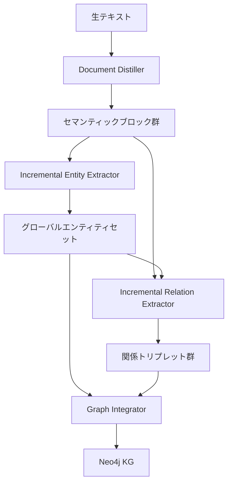

本記事は [https://arxiv.org/abs/2409.03284](https://arxiv.org/abs/2409.03284) の解説記事です。

## 論文概要（Abstract）

iText2KGは、LLMを活用してテキストからナレッジグラフ（KG）をゼロショットかつインクリメンタルに構築するフレームワークである。Document Distiller、Incremental Entity Extractor、Incremental Relation Extractor、Graph Integratorの4モジュールで構成され、コサイン類似度に基づくエンティティ解決により、既存手法と比較してFalse Discovery Rate（FDR）を大幅に低減できると著者らは報告している。

この記事は [Zenn記事: Neo4j×GraphRAGで社内インシデント対応ナレッジ検索を構築する実装手法](https://zenn.dev/0h_n0/articles/dc86d7aa3ffa00) の深掘りです。

## 情報源

- **arXiv ID**: 2409.03284
- **URL**: [arXiv:2409.03284](https://arxiv.org/abs/2409.03284)
- **著者**: Yassir Lairgi, Ludovic Moncla, Rémy Cazabet et al.
- **発表年**: 2024年9月（WISE 2024 採択）
- **分野**: cs.AI, cs.CL, cs.IR

## 背景と動機（Background & Motivation）

ナレッジグラフの構築は従来、以下の課題を抱えていた。

1. **オントロジー依存**: ドメイン固有のスキーマ定義に大きな労力がかかる
2. **エンティティの重複**: 文書ごとに独立して抽出すると「GPT-4」「OpenAI GPT-4」「gpt4」が別エンティティとして登録される
3. **ファインチューニングの必要性**: 多くの既存手法がドメイン固有データでの事前学習を要求する

GraphRAGの普及に伴い、非構造化テキストからKGを自動構築するニーズが急速に高まっている。しかし、LangchainのLLMGraphTransformerやNeo4jのSimpleKGPipelineは、エンティティ解決が不十分なため重複ノードが大量に生成される。iText2KGはこのギャップを埋める手法として提案された。

## 主要な貢献（Key Contributions）

- **4モジュールのパイプライン設計**: テキストからKGへのエンドツーエンド変換を実現
- **インクリメンタルなエンティティ解決**: コサイン類似度ベースのマッチングで文書をまたいだエンティティの一意性を保証
- **ゼロショット適用**: ファインチューニングやオントロジー定義なしにKGを構築
- **グローバル vs ローカルコンテキストの比較分析**: 関係抽出におけるコンテキスト範囲の影響を定量評価

## 技術的詳細（Technical Details）

### 全体アーキテクチャ



### Module 1: Document Distiller

生テキストをLLMが処理しやすい「セマンティックブロック」に変換する。ユーザー定義のJSON形式ブループリントに基づき、LLMがテキストを構造化する。

```json
{
  "personal_information": {"name": "string", "title": "string"},
  "education": [{"degree": "string", "institution": "string"}],
  "experience": [{"role": "string", "company": "string", "description": "string"}]
}
```

スキーマの設計が出力品質に大きく影響するため、ドメインに応じたブループリント調整が推奨されている。

### Module 2: Incremental Entity Extractor

セマンティックブロックからエンティティを反復抽出し、グローバルエンティティセットとの整合性を維持する。

#### エンティティ解決アルゴリズム

**Step 1: 直接マッチング** -- 名前の正規化（小文字化、空白除去）後に完全一致を検索する。

$$
\text{match}_{\text{exact}}(e_{\text{new}}, \mathcal{E}) = \{e_i \in \mathcal{E} \mid \text{normalize}(e_{\text{new}}) = \text{normalize}(e_i)\}
$$

**Step 2: コサイン類似度マッチング** -- 直接マッチングで見つからない場合、埋め込みベクトル間のコサイン類似度を計算する。

$$
\text{sim}(e_{\text{new}}, e_i) = \frac{\mathbf{v}_{e_{\text{new}}} \cdot \mathbf{v}_{e_i}}{\|\mathbf{v}_{e_{\text{new}}}\| \cdot \|\mathbf{v}_{e_i}\|}
$$

ここで $\mathbf{v}_{e}$ はtext-embedding-3-largeで計算した埋め込みベクトルである。

**Step 3: 閾値判定**

$$
e_{\text{resolved}} =
\begin{cases}
e_i^* & \text{if } \max_{e_i \in \mathcal{E}} \text{sim}(e_{\text{new}}, e_i) \geq \tau \\
e_{\text{new}} & \text{otherwise}
\end{cases}
$$

$\tau = 0.7$ が推奨値。未マッチのエンティティはグローバルセット $\mathcal{E}$ に追加される。

```python
from dataclasses import dataclass
import numpy as np

@dataclass
class Entity:
    name: str
    label: str
    properties: dict
    embedding: np.ndarray | None = None

def resolve_entity(
    new_entity: Entity,
    global_entities: list[Entity],
    threshold: float = 0.7,
) -> Entity:
    """インクリメンタルなエンティティ解決"""
    normalized = new_entity.name.lower().strip()
    for entity in global_entities:
        if entity.name.lower().strip() == normalized:
            return entity

    if new_entity.embedding is None:
        global_entities.append(new_entity)
        return new_entity

    best_match, best_score = None, 0.0
    for entity in global_entities:
        if entity.embedding is None:
            continue
        score = float(
            np.dot(new_entity.embedding, entity.embedding)
            / (np.linalg.norm(new_entity.embedding) * np.linalg.norm(entity.embedding))
        )
        if score > best_score:
            best_score, best_match = score, entity

    if best_score >= threshold and best_match is not None:
        return best_match
    global_entities.append(new_entity)
    return new_entity
```

### Module 3: Incremental Relation Extractor

エンティティ間の関係トリプレット $(h, r, t)$ を抽出する。著者らは2つのコンテキスト変種を提案している。

- **Global Context**: 全セマンティックブロックの情報を含む。離れた位置の関係も抽出可能だが、ノイジーで偽関係が生成されやすい
- **Local Context**: 処理中ブロック内のみ。ノイズが少なく精度が高いが、ブロック間関係を見逃す可能性がある

著者らの実験ではLocal Contextの方が一貫して高精度を示している。関係もコサイン類似度ベースのマッチングが行われ、「works_at」と「is_employed_by」の重複を防止する。

### Module 4: Graph Integrator

抽出されたエンティティと関係をNeo4jに格納する。エンティティはノード、関係はエッジとして、Cypherクエリで作成される。

## 実装のポイント（Implementation）

### Zenn記事のSimpleKGPipelineとの対比

| 観点 | SimpleKGPipeline | iText2KG |
|------|-----------------|----------|
| エンティティ解決 | LLM任せ（重複発生） | コサイン類似度（重複抑制） |
| スキーマ定義 | `NodeType`/`RelationshipType`で事前定義 | Document Distillerで動的生成 |
| ゼロショット対応 | スキーマ定義が必要 | 完全ゼロショット |
| Neo4j統合 | ネイティブ対応 | Graph Integratorで統合 |

`neo4j-graphrag`の`SimpleKGPipeline`では`NodeType`/`RelationshipType`の事前定義が必要で、未知のエンティティタイプを柔軟に扱えない。iText2KGのDocument Distillerはこの制約を緩和する。

**実装上の注意点**:
- **埋め込みモデル**: text-embedding-3-largeの代替としてオープンソースモデルも使用可能だが、閾値 $\tau$ の再調整が必要
- **温度設定**: エンティティ抽出の再現性確保のため`temperature=0`が推奨
- **バッチ処理**: 大量文書ではAPI呼び出し回数をバッチ化で削減

## Production Deployment Guide

以下のコスト試算は2026年8月時点のAWS ap-northeast-1料金に基づく概算値である。実際のコストはトラフィックパターンにより変動するため、最新料金はAWS料金計算ツールで確認を推奨する。

### トラフィック量別AWS構成

| 構成 | トラフィック | 主要サービス | 月額概算 |
|------|-------------|-------------|---------|
| Small | ~100 req/日 | Lambda + Bedrock + DynamoDB + Neptune Serverless | $80-200 |
| Medium | ~1,000 req/日 | ECS Fargate + Bedrock Batch + ElastiCache + Neptune | $400-1,000 |
| Large | 10,000+ req/日 | EKS + Spot + SageMaker Endpoint + Neptune Cluster | $2,500-6,000 |

**Small**: Lambda（1024MB）でパイプライン実行、Bedrockでエンティティ抽出、DynamoDBでエンティティキャッシュ、Neptune Serverlessでグラフ格納。**Medium**: ECS Fargateでワーカーコンテナ化、Bedrock Batch APIで50%削減、ElastiCache（Redis）で埋め込みキャッシュ、SQSでピーク吸収。**Large**: EKS + Karpenter（Spot優先）、SageMakerで埋め込みモデルセルフホスティング、Neptune Provisionedクラスタ（リードレプリカ付き）、Step Functionsでオーケストレーション。

### Terraformインフラコード（Small構成）

```hcl
terraform {
  required_version = ">= 1.5"
  required_providers {
    aws = { source = "hashicorp/aws", version = "~> 5.0" }
  }
}

provider "aws" { region = "ap-northeast-1" }

variable "project_name" { default = "itext2kg" }

# Lambda実行ロール
resource "aws_iam_role" "lambda_role" {
  name = "${var.project_name}-lambda-role"
  assume_role_policy = jsonencode({
    Version = "2012-10-17"
    Statement = [{ Action = "sts:AssumeRole", Effect = "Allow",
      Principal = { Service = "lambda.amazonaws.com" } }]
  })
}

resource "aws_iam_role_policy" "bedrock_access" {
  name = "${var.project_name}-bedrock"
  role = aws_iam_role.lambda_role.id
  policy = jsonencode({
    Version = "2012-10-17"
    Statement = [{ Effect = "Allow",
      Action = ["bedrock:InvokeModel", "bedrock:InvokeModelWithResponseStream"],
      Resource = "arn:aws:bedrock:ap-northeast-1::foundation-model/*" }]
  })
}

# Lambda関数
resource "aws_lambda_function" "processor" {
  function_name = "${var.project_name}-processor"
  role          = aws_iam_role.lambda_role.arn
  handler       = "handler.lambda_handler"
  runtime       = "python3.12"
  timeout       = 900
  memory_size   = 1024
  filename      = "lambda_package.zip"

  environment {
    variables = {
      ENTITY_TABLE       = aws_dynamodb_table.entities.name
      SIMILARITY_THRESHOLD = "0.7"
      BEDROCK_MODEL_ID   = "anthropic.claude-3-5-sonnet-20241022-v2:0"
    }
  }
}

# DynamoDB（エンティティキャッシュ）
resource "aws_dynamodb_table" "entities" {
  name         = "${var.project_name}-entities"
  billing_mode = "PAY_PER_REQUEST"
  hash_key     = "entity_id"
  attribute { name = "entity_id"; type = "S" }
  ttl { attribute_name = "expires_at"; enabled = true }
}

# CloudWatchアラーム
resource "aws_cloudwatch_metric_alarm" "lambda_errors" {
  alarm_name          = "${var.project_name}-errors"
  comparison_operator = "GreaterThanThreshold"
  evaluation_periods  = 2
  metric_name         = "Errors"
  namespace           = "AWS/Lambda"
  period              = 300
  statistic           = "Sum"
  threshold           = 5
  dimensions = { FunctionName = aws_lambda_function.processor.function_name }
  alarm_actions = [aws_sns_topic.alerts.arn]
}

resource "aws_sns_topic" "alerts" { name = "${var.project_name}-alerts" }
```

### Large構成（EKS + Karpenter）

```hcl
module "eks" {
  source  = "terraform-aws-modules/eks/aws"
  version = "~> 20.0"
  cluster_name    = "${var.project_name}-cluster"
  cluster_version = "1.30"
  vpc_id     = module.vpc.vpc_id
  subnet_ids = module.vpc.private_subnets
  eks_managed_node_groups = {
    system = { instance_types = ["m6i.large"], min_size = 2, max_size = 4,
               desired_size = 2, capacity_type = "ON_DEMAND" }
  }
}

# Karpenter NodePool（Spot優先）
resource "kubectl_manifest" "karpenter_pool" {
  yaml_body = <<-YAML
    apiVersion: karpenter.sh/v1
    kind: NodePool
    metadata: { name: itext2kg-workers }
    spec:
      template:
        spec:
          requirements:
            - key: karpenter.sh/capacity-type
              operator: In
              values: ["spot", "on-demand"]
            - key: node.kubernetes.io/instance-type
              operator: In
              values: ["m6i.xlarge", "m6i.2xlarge", "m5.xlarge"]
          nodeClassRef: { group: karpenter.k8s.aws, kind: EC2NodeClass, name: default }
      limits: { cpu: "100", memory: 400Gi }
      disruption: { consolidationPolicy: WhenEmptyOrUnderutilized, consolidateAfter: 60s }
  YAML
}

# Cost Anomaly Detection
resource "aws_ce_anomaly_monitor" "cost" {
  name = "${var.project_name}-cost"
  monitor_type = "DIMENSIONAL"
  monitor_dimension = "SERVICE"
}
```

### 運用・監視設定

**CloudWatch Logs Insights**:

```
# Bedrockトークン使用量の急増検知
fields @timestamp, @message
| filter @message like /bedrock/
| parse @message '"inputTokens":*,' as input_tokens
| stats sum(input_tokens) as total_input by bin(1h)
| sort @timestamp desc
```

**X-Rayトレーシング**: `aws_xray_sdk`でboto3呼び出しを自動計装し、エンティティ解決ごとにアノテーション（`entity_name`、`resolved_to_existing`）を記録する。

**Cost Explorer日次レポート**: `get_cost_and_usage` APIでProjectタグベースのコストを集計し、SNS通知で運用チームに共有する。

### コスト最適化チェックリスト

**アーキテクチャ選択（4項目）**: トラフィック量に応じた構成選択 / 非リアルタイム処理のバッチ分離 / Neptune Serverless vs Provisionedの判断 / マルチAZ構成の必要性評価

**リソース最適化（5項目）**: Spot Instance優先のKarpenter NodePool / Neptune・ElastiCacheの1年予約（40%削減） / Compute Savings Plans適用 / Lambda Power Tuningでメモリ最適化 / VPCエンドポイントでNATトラフィック削減

**LLMコスト削減（5項目）**: Bedrock Batch API適用（50%削減） / Prompt Caching有効化（30-90%削減） / ブループリントキャッシュでLLM呼び出し削減 / チャンクサイズ最適化 / 埋め込みモデルのSageMakerセルフホスティング検討

**監視・アラート（4項目）**: AWS Budgets月次予算アラート / CloudWatch Dashboard / Cost Anomaly Detection / SNS日次コストレポート

**リソース管理（5項目）**: 未使用スナップショット定期削除 / タグ戦略徹底 / S3ライフサイクルポリシー / 開発環境の夜間停止 / DynamoDB TTLで不要キャッシュ自動削除

## 実験結果（Results）

### Schema Consistency

| データセット | Schema Consistency |
|-------------|-------------------|
| CVs（履歴書） | 0.97 +/- 0.09 |
| Scientific Papers | 0.98 +/- 0.04 |
| Websites | 0.94 +/- 0.13 |

いずれも0.94以上の高いスキーマ準拠率を著者らは報告している。

### Triplet Extraction Precision

| Context方式 | CS | Music |
|------------|-----|-------|
| Global Context | 0.83 +/- 0.06 | 0.81 +/- 0.05 |
| Local Context | 0.94 +/- 0.06 | 0.90 +/- 0.07 |

Local Contextが一貫して高精度を達成しており、LLMへのコンテキスト絞り込みがハルシネーション抑制に有効であることを示唆している。

### Entity Resolution FDR

| 手法 | 論文 | Websites |
|------|------|----------|
| OpenAI Function Calling | 0.11 +/- 0.04 | 0.31 +/- 0.05 |
| Langchain LLMGraphTransformer | 0.14 +/- 0.08 | 0.29 +/- 0.06 |
| iText2KG | 0.01 +/- 0.01 | 0 |

iText2KGのFDRは桁違いに低い。特にWebsitesではFDR=0であり、コサイン類似度ベースのエンティティ解決がLLMのみに依存する手法の不安定性（温度パラメータや文脈長による変動）を解消していることがわかる。

## 実運用への応用（Practical Applications）

### GraphRAGパイプラインへの統合

1. **SimpleKGPipelineの後段にエンティティ解決を追加**: ネイティブNeo4j統合の利便性を維持しつつ重複エンティティを削減
2. **インクリメンタル更新**: 新規ドキュメント追加時に既存KGへ差分反映。継続的なナレッジベース蓄積に適合
3. **閾値のドメイン調整**: インシデント対応で「PostgreSQL 15.3」と「PostgreSQL」を同一視するかは $\tau$ で制御

### スケーリング戦略

- グローバルエンティティセットの肥大化に対してはFAISS等の近似最近傍探索で $O(n) \to O(\log n)$
- LLM呼び出しがレイテンシのボトルネック。Batch APIとPrompt Cachingの活用が重要
- マルチテナントではテナントごとにエンティティセットを分離

## 関連研究（Related Work）

- **LLMGraphTransformer（Langchain）**: LLMでKGトリプレットを直接抽出。エンティティ解決がプロンプト依存でFDRが高い
- **SimpleKGPipeline（neo4j-graphrag）**: NodeType/RelationshipTypeベースのNeo4jネイティブKG構築
- **REBEL（Cabot and Navigli, 2021）**: seq2seqでトリプレット生成。ファインチューニングが必要でゼロショット不可
- **GraphRAG（Microsoft, 2024）**: コミュニティ検出とサマリー生成のRAGフレームワーク。KG構築時のエンティティ解決はiText2KGと相補的

## まとめと今後の展望

iText2KGは、LLMのゼロショット能力とコサイン類似度ベースのエンティティ解決を組み合わせ、KG構築における重複エンティティ問題を大幅に改善した手法である。FDRの低さはプロダクション環境でのKG品質保証において重要な指標である。

今後の方向として、動的閾値調整（エンティティタイプに応じた $\tau$ 自動調整）、大規模データでのスケーラビリティ検証、マルチモーダルデータへの拡張が著者らにより挙げられている。

実務的には、Zenn記事のGraphRAGパイプラインのエンティティ解決層としてiText2KGのアプローチを部分導入することが、最も投資対効果の高い適用方法と考えられる。

## 参考文献

- **arXiv**: [https://arxiv.org/abs/2409.03284](https://arxiv.org/abs/2409.03284)
- **Code**: [https://github.com/AuvaLab/itext2kg](https://github.com/AuvaLab/itext2kg)
- **Related Zenn article**: [https://zenn.dev/0h_n0/articles/dc86d7aa3ffa00](https://zenn.dev/0h_n0/articles/dc86d7aa3ffa00)
- **WISE 2024**: Web Information Systems Engineering (WISE 2024)
- **neo4j-graphrag**: [https://github.com/neo4j/neo4j-graphrag-python](https://github.com/neo4j/neo4j-graphrag-python)
