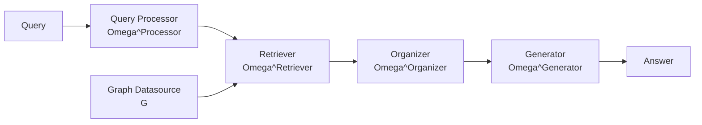

## 論文概要

本記事は [https://arxiv.org/abs/2501.00309](https://arxiv.org/abs/2501.00309) の解説記事です。

Han et al. (2024) は、グラフ構造データを用いた Retrieval-Augmented Generation（GraphRAG）に関する体系的なサーベイを行い、GraphRAG のパイプラインを5つのコンポーネント（Query Processor、Retriever、Organizer、Generator、Graph Datasource）に分解するフレームワークを提案している。著者らは 10 種類のグラフドメインを対象に既存手法を分類・整理し、従来のテキストベース RAG との差異と GraphRAG 固有の技術的課題を明確化している。本サーベイは GraphRAG 分野の全体像を俯瞰するための基盤となる論文である。

この記事は [Zenn記事: Neo4j×GraphRAGで社内インシデント対応ナレッジ検索を構築する実装手法](https://zenn.dev/0h_n0/articles/dc86d7aa3ffa00) の深掘りです。

## 情報源

- **arXiv ID**: 2501.00309
- **URL**: [https://arxiv.org/abs/2501.00309](https://arxiv.org/abs/2501.00309)
- **著者**: Haoyu Han, Yu Wang, Harry Shomer et al.
- **発表年**: 2024年（v2: 2025年1月）
- **分野**: cs.IR, cs.CL, cs.LG

## 背景と動機

大規模言語モデル（LLM）は流暢なテキスト生成が可能であるが、学習データに含まれない知識やリアルタイムの情報を扱う場合にハルシネーション（事実と異なる生成）が生じる。この問題に対処するために Retrieval-Augmented Generation（RAG）が広く研究されてきた。従来の RAG はテキストチャンクを独立した断片として検索・注入するため、エンティティ間の関係性や構造的な依存関係を十分に活用できないという課題がある。

一方、Knowledge Graph（KG）やソーシャルグラフ、分子グラフなどのグラフ構造データは、ノードとエッジによるリレーショナルな情報を表現できる。著者らは、こうしたグラフ構造を RAG パイプラインに統合する手法が多数提案されているにもかかわらず、統一的なフレームワークが存在しなかった点を課題として指摘し、GraphRAG の体系的な整理を試みている。

## 主要な貢献

著者らは以下の貢献を報告している。

- **統一フレームワークの提案**: GraphRAG パイプラインを Query Processor、Retriever、Organizer、Generator、Graph Datasource の5コンポーネントに分解し、既存手法を統一的に記述可能にした
- **10ドメインの体系的分類**: Knowledge Graph、Document Graph、Scientific Graph など 10 種類のグラフドメインを特定し、各ドメインにおける GraphRAG の適用パターンを整理した
- **RAG と GraphRAG の差異の明確化**: データ形式、検索信号、エンコーダなどの観点で従来 RAG との本質的な差異を整理し、GraphRAG 固有の技術的課題を特定した
- **課題と今後の方向性**: スケーラビリティ、動的グラフ対応、ドメイン横断的なグラフ統合といったオープンな研究課題を提示した

## 技術的詳細

### 5コンポーネントフレームワーク

著者らが提案するフレームワークは、GraphRAG のパイプラインを以下の5つのコンポーネントとして定式化している。



#### 1. Query Processor ($\Omega^{\text{Processor}}$)

ユーザーの自然言語クエリをグラフ検索可能な形式に変換するコンポーネントである。著者らは以下の手法を整理している。

- **Named Entity Recognition（NER）**: クエリ中のエンティティを抽出し、グラフ上のノードにリンクする。SpaCy や LLM ベースの NER が用いられる
- **関係抽出**: エンティティ間の関係を特定し、トリプレット（主語、述語、目的語）として構造化する
- **GQL 変換**: クエリを Graph Query Language（Cypher、SPARQL 等）に変換する。LLM を用いた Text-to-Cypher 変換が主流
- **クエリ分解**: 複雑なクエリを複数のサブクエリに分解し、段階的に回答を構成する
- **クエリ拡張**: 同義語やグラフ上の隣接概念を追加して検索範囲を広げる

#### 2. Retriever ($\Omega^{\text{Retriever}}$)

グラフデータソースから関連情報を検索するコンポーネントであり、GraphRAG の中核を担う。著者らは検索手法を以下の3カテゴリに分類している。

**ヒューリスティック手法**:

- **BFS/DFS 走査**: クエリに一致するノードを起点として、幅優先探索（BFS）または深さ優先探索（DFS）でサブグラフを取得する。走査の深さ $k$ がハイパーパラメータとなる
- **エンティティリンク**: クエリ中のエンティティをグラフノードにマッピングし、関連するエッジとともにサブグラフを切り出す
- **パーソナライズド PageRank**: ランダムウォークに基づくスコアリングで、クエリに関連するノードを優先的に選択する

**学習ベース手法**:

- **Node2Vec**: ランダムウォークで得たノード系列を Word2Vec で埋め込み、ベクトル類似度検索を行う。ノード $v$ の埋め込みベクトル $\mathbf{z}_v \in \mathbb{R}^d$ を学習する

$$
\max_{\mathbf{z}} \sum_{v \in V} \sum_{u \in N_R(v)} \log P(u \mid \mathbf{z}_v)
$$

ここで $N_R(v)$ はノード $v$ からのランダムウォークで訪問されるノード集合、$P(u \mid \mathbf{z}_v)$ は softmax で定義される予測確率である。

- **GNN ベースエンコーダ**: Graph Neural Network を用いてノード・エッジの分散表現を学習し、クエリとの類似度で検索する

**高度な手法**:

- **ニューラル-シンボリック統合**: GNN によるニューラル表現とグラフクエリ言語によるシンボリック操作を組み合わせる
- **反復検索（Iterative Retrieval）**: 生成結果をフィードバックとして再検索を行い、段階的に関連サブグラフを拡張する

#### 3. Organizer ($\Omega^{\text{Organizer}}$)

検索されたサブグラフを生成に適した形式に加工するコンポーネントである。

- **グラフプルーニング**: 検索結果から無関係なノード・エッジを除去し、コンテキスト窓に収まるサイズに縮小する
- **リランキング**: 検索されたサブグラフの関連度を再スコアリングし、上位 $k$ 件を選択する
- **グラフ拡張**: 検索されたサブグラフに対して、隣接ノードやコミュニティ情報を追加する
- **言語化（Verbalization）**: グラフ構造をテキストに変換する。LLM のコンテキストに注入するために不可欠なステップである

**言語化手法の詳細**:

テンプレートベースの手法では、トリプレット $(e_1, r, e_2)$ を以下のようにテキスト変換する。

```
"(entity1, relation, entity2)" -> "The {relation} of {entity1} is: {entity2}"
```

例: `(Tokyo, capital_of, Japan)` を `"The capital_of of Tokyo is: Japan"` に変換する。

モデルベースの手法では、fine-tuned Transformer をグラフ-テキスト変換タスクで訓練し、より自然なテキストを生成する。

#### 4. Generator ($\Omega^{\text{Generator}}$)

検索・整理された情報をもとに最終的な出力を生成するコンポーネントである。

- **判別モデル（GNN）**: ノード分類やリンク予測など、グラフ固有のタスクに GNN を直接適用する
- **LLM ベース生成**: 言語化されたグラフ情報をコンテキストとして LLM に注入し、テキスト応答を生成する
- **グラフ生成器**: 新しいノードやエッジを予測・追加するタスク（Knowledge Graph Completion 等）に対応する

#### 5. Graph Datasource ($G$)

GraphRAG の情報源となるグラフデータであり、2種類に分類される。

- **明示的グラフ（Explicit Graph）**: 定義済みの関係を持つグラフ。Knowledge Graph、ソーシャルグラフなどが該当する
- **暗黙的グラフ（Implicit Graph）**: 元データにグラフ構造がなく、導出された相関関係からグラフを構築する。テキストから NER と関係抽出でナレッジグラフを自動構築する手法が典型例である

### GNN の定式化

著者らは Retriever や Generator で用いられる GNN の定式化を以下のように整理している。

**ノードレベル畳み込み（Message Passing）**:

$$
\mathbf{h}_v^{(l+1)} = \text{UPDATE}\left(\mathbf{h}_v^{(l)}, \text{AGG}\left(\left\{\mathbf{h}_u^{(l)} : u \in \mathcal{N}(v)\right\}\right)\right)
$$

ここで、
- $\mathbf{h}_v^{(l)}$: レイヤー $l$ でのノード $v$ の表現ベクトル
- $\mathcal{N}(v)$: ノード $v$ の隣接ノード集合
- $\text{AGG}$: 集約関数（sum, mean, max 等）
- $\text{UPDATE}$: 更新関数（MLP、GRU 等）

**エッジレベル畳み込み**: エッジの特徴量を考慮した拡張であり、関係の種類によって異なる重みを適用する。

**グラフレベルプーリング**: サブグラフ全体の表現を得るために、ノード表現を集約する。

$$
\mathbf{h}_G = \text{READOUT}\left(\left\{\mathbf{h}_v^{(L)} : v \in V\right\}\right)
$$

$\text{READOUT}$ は mean pooling や attention-based pooling が用いられる。

### 10種類のグラフドメイン分類

著者らは GraphRAG が適用される 10 種類のグラフドメインを以下のように分類している。

| ドメイン | グラフ構造 | 主要タスク | 代表的手法 |
|---------|----------|----------|----------|
| Knowledge Graphs | エンティティ-関係 | QA、補完、ファクトチェック | KGQA、KG-RAG |
| Document Graphs | 文書-引用/セクション | 要約、検索、分類 | Graph-of-Thought |
| Scientific Graphs | 分子/タンパク質 | 分子生成、タンパク質予測 | MoleculeSTM |
| Social Graphs | ユーザー-ユーザー | 推薦、エンティティ分類 | GraphSAGE+RAG |
| Planning/Reasoning | タスク-依存関係 | タスク実行、計画 | Graph-of-Action |
| Tabular Graphs | レコード-属性 | 不正検出、補完 | GNN+Tabular |
| Infrastructure Graphs | 道路/ネットワーク | 行動予測、ナビゲーション | SpatialRAG |
| Biological Graphs | 遺伝子-相互作用 | 遺伝子分析 | BioKG-RAG |
| Scene Graphs | オブジェクト-関係 | 視覚QA | Scene-Graph QA |
| Random Graphs | 合成ノード-エッジ | 構造クエリ | GraphQA |

### RAG と GraphRAG の比較

著者らは従来の RAG と GraphRAG を以下の観点で比較している。

| 側面 | RAG | GraphRAG |
|------|-----|----------|
| データ形式 | テキストチャンク / 画像 | 多様なグラフ（KG、分子、ソーシャル等） |
| 情報単位 | 独立したチャンク | 相互依存するノード・エッジ |
| 検索信号 | 語彙類似度 / 意味的埋め込み | 構造パターン + 意味的類似度 |
| エンコーダ | 言語モデル / 視覚モデル | GNN + テキストエンコーダ |
| コンテキスト構築 | チャンク連結 | サブグラフ言語化 / 構造エンコーディング |
| スケーリング | チャンク数に線形 | グラフサイズ・密度に依存（非線形） |

従来 RAG では「検索対象が独立したテキストチャンクであること」が暗黙の前提となっていたが、GraphRAG ではノード間の関係性を辿ることで、マルチホップ推論や因果関係の追跡が可能になると著者らは主張している。

## 実装のポイント

### Zenn記事（Neo4j×GraphRAG）との対応関係

Zenn記事「Neo4j×GraphRAGで社内インシデント対応ナレッジ検索を構築する実装手法」では、Neo4j を Graph Datasource として用い、Cypher クエリによる検索を実装している。本サーベイのフレームワークと対応付けると以下のようになる。

| サーベイのコンポーネント | Zenn記事の実装 |
|----------------------|-------------|
| Query Processor | LLM による Text-to-Cypher 変換 |
| Retriever | Neo4j のグラフ走査（BFS ベース） |
| Organizer | 検索結果のテキスト言語化 |
| Generator | LLM によるテキスト生成 |
| Graph Datasource | Neo4j（明示的グラフ） |

### 実装時の注意点

本サーベイの知見から、GraphRAG を実装する際の主要な注意点を以下に整理する。

1. **グラフ構築の品質が全体性能を支配する**: 暗黙的グラフを構築する場合、NER と関係抽出の精度がボトルネックとなる。著者らはエンティティリンクの曖昧性解消が実運用上の重要課題であると指摘している

2. **走査深度のトレードオフ**: BFS/DFS の走査深度 $k$ を大きくすると網羅性は上がるが、ノイズも増加する。Neo4j での実装では `apoc.path.subgraphAll` のような APOC プロシージャで深度を制御できる

3. **言語化戦略の選択**: テンプレートベースの言語化は実装が容易だがテキスト品質が低い。LLM を用いたモデルベースの言語化はコストがかかるが、より自然なコンテキストを提供できる

4. **コンテキスト窓の制約**: サブグラフが大きすぎると LLM のコンテキスト窓に収まらないため、プルーニングとリランキングの設計が重要になる

```python
from typing import Any

from neo4j import GraphDatabase


class GraphRAGRetriever:
    """GraphRAG Retriever implementation with Neo4j.

    Implements BFS-based subgraph retrieval with configurable depth.

    Args:
        uri: Neo4j connection URI
        auth: Tuple of (username, password) for Neo4j authentication
    """

    def __init__(self, uri: str, auth: tuple[str, str]) -> None:
        self.driver = GraphDatabase.driver(uri, auth=auth)

    def retrieve_subgraph(
        self,
        entity: str,
        depth: int = 2,
        max_nodes: int = 50,
    ) -> list[dict[str, Any]]:
        """Retrieve subgraph around a given entity using BFS.

        Args:
            entity: Starting entity name for graph traversal
            depth: BFS traversal depth (default: 2)
            max_nodes: Maximum number of nodes to return (default: 50)

        Returns:
            List of dictionaries containing node and relationship data
        """
        query = """
        MATCH (start {name: $entity})
        CALL apoc.path.subgraphAll(start, {maxLevel: $depth})
        YIELD nodes, relationships
        UNWIND nodes AS node
        WITH node, relationships
        LIMIT $max_nodes
        RETURN node, relationships
        """
        with self.driver.session() as session:
            result = session.run(
                query,
                entity=entity,
                depth=depth,
                max_nodes=max_nodes,
            )
            return [record.data() for record in result]

    def verbalize_triples(
        self,
        triples: list[tuple[str, str, str]],
    ) -> str:
        """Convert graph triples to natural language text.

        Uses template-based verbalization as described in the survey.

        Args:
            triples: List of (subject, relation, object) tuples

        Returns:
            Verbalized text representation of the triples
        """
        sentences: list[str] = []
        for subj, rel, obj in triples:
            readable_rel = rel.replace("_", " ")
            sentences.append(f"The {readable_rel} of {subj} is: {obj}")
        return ". ".join(sentences)

    def close(self) -> None:
        """Close the Neo4j driver connection."""
        self.driver.close()
```

## Production Deployment Guide

本論文はサーベイ論文であるが、GraphRAG パイプラインを AWS 上にプロダクションデプロイする際の汎用的な構成を整理する。以下のコスト試算は2026年8月時点の AWS ap-northeast-1（東京）リージョン料金に基づく概算値であり、実際のコストはトラフィックパターン、リージョン、バースト使用量により変動する。最新料金は [AWS料金計算ツール](https://calculator.aws/) で確認を推奨する。

### AWS実装パターン（コスト最適化重視）

GraphRAG パイプラインの構成要素は「グラフDB + 検索エンジン + LLM推論 + API」の4層であり、トラフィック量に応じて以下の3構成を推奨する。

**トラフィック量別の推奨構成**:

| 項目 | Small (~100 req/日) | Medium (~1,000 req/日) | Large (10,000+ req/日) |
|------|-------------------|---------------------|---------------------|
| API層 | Lambda (256MB) | ECS Fargate (0.5vCPU) | EKS + Karpenter |
| グラフDB | Neptune Serverless | Neptune r6g.large | Neptune r6g.2xlarge x2 |
| LLM推論 | Bedrock (on-demand) | Bedrock (Provisioned) | Bedrock + SageMaker |
| ベクトル検索 | OpenSearch Serverless | OpenSearch t3.medium | OpenSearch r6g.xlarge x3 |
| キャッシュ | DynamoDB (on-demand) | ElastiCache t3.micro | ElastiCache r6g.large |
| 月額概算 | $80-200 | $500-1,200 | $3,000-8,000 |

**Small構成の内訳** (~100 req/日):
- Lambda: $0.20/100万リクエスト + 実行時間 ≈ $5/月
- Neptune Serverless: 最小1 NCU ≈ $50/月
- Bedrock Claude Sonnet: ~500トークン/req × 100req ≈ $5/月
- OpenSearch Serverless: 最小0.5 OCU ≈ $20/月
- DynamoDB on-demand: $1-5/月

**Medium構成の内訳** (~1,000 req/日):
- ECS Fargate (0.5vCPU, 1GB): ≈ $30/月
- Neptune r6g.large: ≈ $350/月
- Bedrock Provisioned Throughput: ≈ $200/月
- OpenSearch t3.medium: ≈ $80/月
- ElastiCache t3.micro: ≈ $15/月

**Large構成の内訳** (10,000+ req/日):
- EKS コントロールプレーン: $75/月 + ワーカーノード
- Neptune r6g.2xlarge x2: ≈ $1,400/月
- Bedrock + SageMaker endpoint: ≈ $1,000/月
- OpenSearch r6g.xlarge x3: ≈ $700/月
- ElastiCache r6g.large: ≈ $200/月

**コスト削減テクニック**:
- Spot Instances活用（EKSワーカー）: 最大90%削減
- Reserved Instances（Neptune, OpenSearch）: 1年コミットで最大40%削減、3年で最大60%削減
- Bedrock Batch API: 非リアルタイム処理で50%削減
- Prompt Caching: 繰り返しクエリで30-90%削減
- Neptune Serverless: アイドル時自動スケールダウンで60-80%削減

### Terraformインフラコード

#### Small構成（Serverless）

```hcl
# GraphRAG Small Configuration - Serverless
# Lambda + Neptune Serverless + Bedrock + DynamoDB
# Estimated cost: $80-200/month (ap-northeast-1, 2026-08 estimate)

terraform {
  required_version = ">= 1.9"
  required_providers {
    aws = {
      source  = "hashicorp/aws"
      version = "~> 5.60"
    }
  }
}

provider "aws" {
  region = "ap-northeast-1"
}

# --- VPC (NAT Gateway不使用でコスト削減) ---
resource "aws_vpc" "graphrag" {
  cidr_block           = "10.0.0.0/16"
  enable_dns_support   = true
  enable_dns_hostnames = true
  tags = { Name = "graphrag-vpc", Project = "graphrag" }
}

resource "aws_subnet" "private" {
  count             = 2
  vpc_id            = aws_vpc.graphrag.id
  cidr_block        = "10.0.${count.index + 1}.0/24"
  availability_zone = data.aws_availability_zones.available.names[count.index]
  tags = { Name = "graphrag-private-${count.index}" }
}

data "aws_availability_zones" "available" {
  state = "available"
}

# --- IAM Role (最小権限) ---
resource "aws_iam_role" "lambda_graphrag" {
  name = "graphrag-lambda-role"
  assume_role_policy = jsonencode({
    Version = "2012-10-17"
    Statement = [{
      Action = "sts:AssumeRole"
      Effect = "Allow"
      Principal = { Service = "lambda.amazonaws.com" }
    }]
  })
}

resource "aws_iam_role_policy" "lambda_policy" {
  name = "graphrag-lambda-policy"
  role = aws_iam_role.lambda_graphrag.id
  policy = jsonencode({
    Version = "2012-10-17"
    Statement = [
      {
        Effect   = "Allow"
        Action   = ["bedrock:InvokeModel"]
        Resource = "arn:aws:bedrock:ap-northeast-1::foundation-model/anthropic.claude-*"
      },
      {
        Effect   = "Allow"
        Action   = ["neptune-db:connect", "neptune-db:ReadDataViaQuery"]
        Resource = "*"
      },
      {
        Effect = "Allow"
        Action = [
          "dynamodb:GetItem", "dynamodb:PutItem",
          "dynamodb:Query", "dynamodb:UpdateItem"
        ]
        Resource = aws_dynamodb_table.cache.arn
      },
      {
        Effect = "Allow"
        Action = [
          "logs:CreateLogGroup", "logs:CreateLogStream", "logs:PutLogEvents"
        ]
        Resource = "arn:aws:logs:*:*:*"
      }
    ]
  })
}

# --- DynamoDB (キャッシュ用、On-Demand) ---
resource "aws_dynamodb_table" "cache" {
  name         = "graphrag-cache"
  billing_mode = "PAY_PER_REQUEST"
  hash_key     = "query_hash"

  attribute {
    name = "query_hash"
    type = "S"
  }

  ttl {
    attribute_name = "expires_at"
    enabled        = true
  }

  server_side_encryption {
    enabled = true  # KMS暗号化
  }

  tags = { Project = "graphrag" }
}

# --- Lambda関数 ---
resource "aws_lambda_function" "graphrag_api" {
  function_name = "graphrag-api"
  role          = aws_iam_role.lambda_graphrag.arn
  handler       = "handler.lambda_handler"
  runtime       = "python3.12"
  timeout       = 60
  memory_size   = 256
  filename      = "lambda.zip"

  environment {
    variables = {
      NEPTUNE_ENDPOINT  = "neptune-endpoint.cluster-xxx.ap-northeast-1.neptune.amazonaws.com"
      CACHE_TABLE       = aws_dynamodb_table.cache.name
      BEDROCK_MODEL_ID  = "anthropic.claude-sonnet-4-20250514"
      MAX_GRAPH_DEPTH   = "2"
    }
  }

  tracing_config {
    mode = "Active"  # X-Ray有効化
  }

  tags = { Project = "graphrag" }
}

# --- CloudWatch アラーム (コスト監視) ---
resource "aws_cloudwatch_metric_alarm" "lambda_errors" {
  alarm_name          = "graphrag-lambda-errors"
  comparison_operator = "GreaterThanThreshold"
  evaluation_periods  = 2
  metric_name         = "Errors"
  namespace           = "AWS/Lambda"
  period              = 300
  statistic           = "Sum"
  threshold           = 10
  alarm_description   = "Lambda error rate exceeded threshold"
  dimensions = {
    FunctionName = aws_lambda_function.graphrag_api.function_name
  }
}
```

#### Large構成（Container）

```hcl
# GraphRAG Large Configuration - EKS + Karpenter
# Estimated cost: $3,000-8,000/month (ap-northeast-1, 2026-08 estimate)

module "eks" {
  source          = "terraform-aws-modules/eks/aws"
  version         = "~> 20.24"
  cluster_name    = "graphrag-cluster"
  cluster_version = "1.31"

  vpc_id     = aws_vpc.graphrag.id
  subnet_ids = aws_subnet.private[*].id

  # Karpenter用のIAMロール設定
  enable_cluster_creator_admin_permissions = true

  cluster_endpoint_public_access = false  # セキュリティ: プライベートのみ
}

# --- Karpenter Provisioner (Spot優先) ---
resource "kubectl_manifest" "karpenter_nodepool" {
  yaml_body = yamlencode({
    apiVersion = "karpenter.sh/v1"
    kind       = "NodePool"
    metadata   = { name = "graphrag-workers" }
    spec = {
      template = {
        spec = {
          requirements = [
            { key = "karpenter.sh/capacity-type", operator = "In", values = ["spot", "on-demand"] },
            { key = "node.kubernetes.io/instance-type", operator = "In",
              values = ["m6i.xlarge", "m6a.xlarge", "m5.xlarge"] },
          ]
          nodeClassRef = { name = "default" }
        }
      }
      limits   = { cpu = "100", memory = "400Gi" }
      disruption = {
        consolidationPolicy = "WhenEmptyOrUnderutilized"
        consolidateAfter    = "30s"
      }
    }
  })
}

# --- Secrets Manager (Bedrock/Neptune設定) ---
resource "aws_secretsmanager_secret" "graphrag_config" {
  name                    = "graphrag/config"
  recovery_window_in_days = 7
}

resource "aws_secretsmanager_secret_version" "graphrag_config" {
  secret_id = aws_secretsmanager_secret.graphrag_config.id
  secret_string = jsonencode({
    neptune_endpoint = "neptune-cluster.xxx.ap-northeast-1.neptune.amazonaws.com"
    bedrock_model_id = "anthropic.claude-sonnet-4-20250514"
    opensearch_endpoint = "search-graphrag-xxx.ap-northeast-1.es.amazonaws.com"
  })
}

# --- AWS Budgets (予算アラート) ---
resource "aws_budgets_budget" "graphrag_monthly" {
  name         = "graphrag-monthly-budget"
  budget_type  = "COST"
  limit_amount = "5000"
  limit_unit   = "USD"
  time_unit    = "MONTHLY"

  notification {
    comparison_operator       = "GREATER_THAN"
    threshold                 = 80
    threshold_type            = "PERCENTAGE"
    notification_type         = "ACTUAL"
    subscriber_email_addresses = ["ops-team@example.com"]
  }

  notification {
    comparison_operator       = "GREATER_THAN"
    threshold                 = 100
    threshold_type            = "PERCENTAGE"
    notification_type         = "FORECASTED"
    subscriber_email_addresses = ["ops-team@example.com"]
  }
}
```

### 運用・監視設定

**CloudWatch Logs Insights クエリ**:

```
# コスト異常検知: 1時間あたりのBedrock トークン使用量
fields @timestamp, @message
| filter @message like /bedrock/
| stats sum(input_tokens) as total_input, sum(output_tokens) as total_output by bin(1h)
| filter total_input > 100000

# レイテンシ分析: P95, P99
fields @timestamp, duration_ms
| stats percentile(duration_ms, 95) as p95,
        percentile(duration_ms, 99) as p99,
        avg(duration_ms) as avg_ms
  by bin(5m)
| filter p99 > 5000
```

**CloudWatch アラーム設定（Python）**:

```python
import boto3


def create_graphrag_alarms(function_name: str, sns_topic_arn: str) -> None:
    """Create CloudWatch alarms for GraphRAG monitoring.

    Args:
        function_name: Lambda function name to monitor
        sns_topic_arn: SNS topic ARN for alarm notifications
    """
    cw = boto3.client("cloudwatch", region_name="ap-northeast-1")

    # Bedrock トークン使用量スパイク検知
    cw.put_metric_alarm(
        AlarmName="graphrag-bedrock-token-spike",
        MetricName="InputTokenCount",
        Namespace="GraphRAG/Bedrock",
        Statistic="Sum",
        Period=3600,
        EvaluationPeriods=1,
        Threshold=500000,
        ComparisonOperator="GreaterThanThreshold",
        AlarmActions=[sns_topic_arn],
    )

    # Lambda 実行時間異常検知
    cw.put_metric_alarm(
        AlarmName="graphrag-lambda-duration",
        MetricName="Duration",
        Namespace="AWS/Lambda",
        Statistic="p99",
        Period=300,
        EvaluationPeriods=3,
        Threshold=30000,
        ComparisonOperator="GreaterThanThreshold",
        Dimensions=[{"Name": "FunctionName", "Value": function_name}],
        AlarmActions=[sns_topic_arn],
    )
```

**X-Ray トレーシング設定（Python）**:

```python
from aws_xray_sdk.core import xray_recorder, patch_all

# boto3自動計装
patch_all()

@xray_recorder.capture("graphrag_retrieve")
def retrieve_and_generate(query: str) -> str:
    """Retrieve subgraph and generate answer with X-Ray tracing.

    Args:
        query: User query string

    Returns:
        Generated answer text
    """
    subsegment = xray_recorder.current_subsegment()
    subsegment.put_annotation("query_type", "graphrag")
    subsegment.put_metadata("query", query, "input")

    # ... GraphRAG pipeline execution ...
    return "answer"
```

**Cost Explorer 自動レポート（Python）**:

```python
from datetime import datetime, timedelta

import boto3


def get_daily_cost_report() -> dict:
    """Fetch daily cost report for GraphRAG services.

    Returns:
        Dictionary containing cost breakdown by service
    """
    ce = boto3.client("ce", region_name="us-east-1")
    today = datetime.utcnow().date()

    response = ce.get_cost_and_usage(
        TimePeriod={
            "Start": str(today - timedelta(days=1)),
            "End": str(today),
        },
        Granularity="DAILY",
        Metrics=["UnblendedCost"],
        Filter={
            "Tags": {
                "Key": "Project",
                "Values": ["graphrag"],
            }
        },
        GroupBy=[{"Type": "DIMENSION", "Key": "SERVICE"}],
    )

    costs = {}
    for group in response["ResultsByTime"][0]["Groups"]:
        service = group["Keys"][0]
        amount = float(group["Metrics"]["UnblendedCost"]["Amount"])
        costs[service] = amount

    total = sum(costs.values())

    # $100/日超過でSNS通知
    if total > 100:
        sns = boto3.client("sns", region_name="ap-northeast-1")
        sns.publish(
            TopicArn="arn:aws:sns:ap-northeast-1:123456789012:graphrag-alerts",
            Subject="GraphRAG Daily Cost Alert",
            Message=f"Daily cost: ${total:.2f}. Breakdown: {costs}",
        )

    return costs
```

### コスト最適化チェックリスト

**アーキテクチャ選択**:
- [ ] トラフィック量に応じた構成選択（<500 req/日: Serverless、500-5000: Hybrid、>5000: Container）
- [ ] Neptune Serverless vs プロビジョンドの判断基準を確認
- [ ] OpenSearch Serverless vs マネージドの選択

**リソース最適化**:
- [ ] EKS ワーカー: Spot Instances 優先（m6i/m6a/m5 混合で可用性確保）
- [ ] Neptune: Reserved Instance 1年コミット（40%削減）
- [ ] OpenSearch: Reserved Instance 検討
- [ ] Savings Plans: Compute Savings Plans 1年コミット
- [ ] Lambda: メモリサイズ最適化（Power Tuning で最適値特定）
- [ ] ECS/EKS: アイドル時スケールダウン（Karpenter consolidation）

**LLMコスト削減**:
- [ ] Bedrock Batch API: 非リアルタイムのグラフ構築処理に適用（50%削減）
- [ ] Prompt Caching: 繰り返し使用するシステムプロンプトのキャッシュ有効化
- [ ] モデル選択ロジック: 単純クエリは Haiku、複雑クエリは Sonnet を動的選択
- [ ] トークン数制限: サブグラフ言語化時の最大トークン数を制限（4096トークン以下）
- [ ] グラフプルーニング: LLM に渡す前に不要ノードを除去

**監視・アラート**:
- [ ] AWS Budgets: 月次予算 + 80%/100% アラート設定
- [ ] CloudWatch アラーム: Lambda エラー率、レイテンシ P99
- [ ] Cost Anomaly Detection: 自動異常検知有効化
- [ ] 日次コストレポート: Cost Explorer + SNS 通知

**リソース管理**:
- [ ] 未使用リソース削除: 月次で未使用 Neptune スナップショット、古い Lambda バージョン削除
- [ ] タグ戦略: 全リソースに Project/Environment/Owner タグ付与
- [ ] ライフサイクルポリシー: S3 バケットの 90日 Glacier 移行、CloudWatch Logs 30日保持
- [ ] 開発環境夜間停止: EventBridge + Lambda で平日 22:00-8:00 停止
- [ ] Neptune スナップショット: 7日保持、それ以降は削除

## 実験結果

本論文はサーベイ論文であり、著者ら自身が新手法の実験を行ったものではない。ただし、各ドメインにおける代表的手法の性能を横断的に整理しており、以下に主要な比較結果を示す。

### Knowledge Graph QA 手法の比較

著者らがサーベイした Knowledge Graph QA における代表的手法の性能比較を以下に示す（各論文の報告値に基づく）。

| 手法 | Retriever 種別 | WebQSP (Hits@1) | CWQ (Hits@1) | 特徴 |
|------|--------------|-----------------|-------------|------|
| KD-CoT | 反復検索 | 73.7% | 50.5% | 知識蒸留 + Chain-of-Thought |
| ToG | BFS走査 | 76.2% | 58.3% | Think-on-Graph、反復的推論 |
| RoG | 学習ベース | 85.7% | 62.6% | 推論パス計画 + 忠実生成 |
| GNN-RAG | GNNエンコーダ | 88.2% | 63.5% | GNN推論 + RAG統合 |

著者らの整理によると、GNN ベースの Retriever と LLM ベースの Generator を組み合わせた手法（GNN-RAG 等）が高い性能を示す傾向がある。これは GNN がグラフの構造的パターンを効率的に捕捉し、LLM が言語的な推論を担当するという相補的な役割分担が有効であることを示唆していると著者らは考察している。

### ドメイン別の技術的課題

| ドメイン | 主要課題 | 著者らの指摘 |
|---------|---------|------------|
| Knowledge Graphs | 不完全性 | KG は常に不完全であり、検索ミスが生成品質に直結する |
| Document Graphs | スケーラビリティ | 大規模文書コーパスでのグラフ構築コストが課題 |
| Scientific Graphs | ドメイン知識 | 分子・タンパク質グラフは専門的な GNN 設計が必要 |
| Social Graphs | プライバシー | ユーザー情報の匿名化とグラフ構造の両立 |

## 実運用への応用

### 社内ナレッジシステムへの適用

Zenn 記事で紹介されている社内インシデント対応ナレッジ検索は、本サーベイの Knowledge Graph ドメインに該当する。実運用を考えた場合、以下の点が重要である。

**グラフ構築戦略**: 社内ドキュメント（Confluence、Notion 等）からの暗黙的グラフ構築では、NER の精度が業務ドメイン固有の用語に依存する。ドメイン特化の NER モデル（fine-tuned SpaCy 等）の導入が有効と考えられる。

**検索戦略の選択**: 著者らの分類に基づくと、社内ナレッジの場合はヒューリスティック手法（BFS + エンティティリンク）が実装コストと性能のバランスが良い。マルチホップ推論が必要な場合は、反復検索手法の導入を検討する。

**スケーリング**: グラフのノード数が 100 万を超える規模では、PartitionedGraph や分散グラフDB（例: Amazon Neptune のリードレプリカ）の導入が必要になると考えられる。

### プロダクション環境での考慮事項

- **レイテンシ**: グラフ走査 + LLM 推論のエンドツーエンド遅延は、BFS 深度 2 で 1-3 秒程度（Neptune + Bedrock の場合）。キャッシュ層の導入でリピートクエリの応答を 100ms 以下に短縮可能
- **コスト効率**: トリプレット数 10 万規模の KG では Neptune Serverless で月額 $50-100 程度。LLM 呼び出しコストが支配的になるため、Prompt Caching とモデル選択ロジックが重要
- **更新頻度**: 社内ナレッジは日次〜週次で更新されるため、増分グラフ更新パイプライン（CDC: Change Data Capture）の設計が必要

## 関連研究

- **Lewis et al. (2020) "Retrieval-Augmented Generation for Knowledge-Intensive NLP Tasks"**: テキストベース RAG の原論文。GraphRAG はこの枠組みをグラフ構造データに拡張したものとして位置付けられる
- **Yasunaga et al. (2021) "QA-GNN: Reasoning with Language Models and Knowledge Graphs for Question Answering"**: GNN と LLM を統合した初期の手法であり、本サーベイで整理された GNN ベース Retriever の代表例
- **Microsoft GraphRAG (Edge et al., 2024)**: コミュニティ検出とグローバル要約を組み合わせた実装であり、Organizer コンポーネントのグラフ拡張手法として分類される
- **Luo et al. (2024) "Reasoning on Graphs"**: 推論パスの計画と忠実な生成を統合した RoG 手法で、著者らの整理では Retriever の高度な手法に分類される

## まとめ

Han et al. は GraphRAG の体系的なフレームワークとして5コンポーネント分解を提案し、10ドメインにわたる既存手法を統一的に整理した。従来のテキストベース RAG とは異なり、GraphRAG ではグラフの構造的パターン（ノード間の関係、コミュニティ構造、パス情報）を検索信号として活用できる点が本質的な差異である。

実務への示唆としては、(1) グラフ構築の品質管理がパイプライン全体の性能を左右すること、(2) 走査深度・プルーニング・言語化の各ステップでトレードオフ判断が必要なこと、(3) GNN と LLM の相補的な組み合わせが有効であることが挙げられる。今後の研究方向として、著者らは動的グラフへの対応、異種グラフの統合、そして GraphRAG の評価ベンチマーク整備を課題として指摘している。

## 参考文献

- **arXiv**: [https://arxiv.org/abs/2501.00309](https://arxiv.org/abs/2501.00309)
- **Related Zenn article**: [https://zenn.dev/0h_n0/articles/dc86d7aa3ffa00](https://zenn.dev/0h_n0/articles/dc86d7aa3ffa00)
- Lewis, P. et al. (2020). "Retrieval-Augmented Generation for Knowledge-Intensive NLP Tasks." *NeurIPS 2020*.
- Yasunaga, M. et al. (2021). "QA-GNN: Reasoning with Language Models and Knowledge Graphs for Question Answering." *NAACL 2021*.
- Edge, D. et al. (2024). "From Local to Global: A Graph RAG Approach to Query-Focused Summarization." *arXiv:2404.16130*.
- Luo, L. et al. (2024). "Reasoning on Graphs: Faithful and Interpretable Large Language Model Reasoning." *ICLR 2024*.
