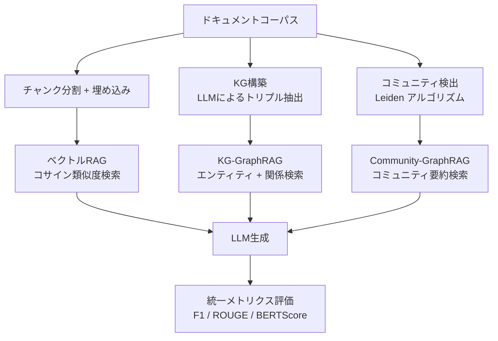

## 論文概要

本記事は [RAG vs. GraphRAG: A Systematic Evaluation and Key Insights (arXiv:2502.11371)](https://arxiv.org/abs/2502.11371) の解説記事です。

Haoyu Han, Li Ma, Yu Wang ら（ミシガン州立大学、Meta AI）による本論文は、Retrieval-Augmented Generation（RAG）と GraphRAG を7つのベンチマークデータセットにわたって体系的に比較評価した研究である。著者らは質問応答（QA）タスク4種と要約タスク3種を用いて、従来のベクトル検索ベースRAGと、ナレッジグラフ（KG）ベースの GraphRAG（KG-GraphRAG, Community-GraphRAG, HippoRAG2）の性能・効率性・構築コストを多角的に分析している。その結果、「GraphRAG は常に RAG より優れている」という一般的な想定に対して、タスク特性によって有効性が大きく異なることを定量的に示し、両手法を統合する Selection 戦略・Integration 戦略の有効性を報告している。

## 情報源

| 項目 | 内容 |
|------|------|
| 種別 | arXiv論文 (cs.IR) |
| タイトル | RAG vs. GraphRAG: A Systematic Evaluation and Key Insights |
| 著者 | Haoyu Han, Li Ma, Yu Wang, Harry Shomer, Yongjia Lei, Zhisheng Qi, Kai Guo, Zhigang Hua, Bo Long, Hui Liu, Charu C. Aggarwal, Jiliang Tang |
| URL | [https://arxiv.org/abs/2502.11371](https://arxiv.org/abs/2502.11371) |
| 発表日 | 2025年2月（v3: 2026年3月） |
| 関連Zenn記事 | [Neo4j×GraphRAGで社内インシデント対応ナレッジ検索を構築する実装手法](https://zenn.dev/0h_n0/articles/dc86d7aa3ffa00) |

## 背景と動機

大規模言語モデル（LLM）の知識は学習データの時点で固定されるため、最新情報や組織固有の知識を扱うには外部知識源からの検索が不可欠である。RAG はベクトル埋め込みによるチャンク検索で広く普及しているが、エンティティ間の関係推論が求められるマルチホップQAや、文書全体の構造理解が必要な要約タスクでは限界があると指摘されてきた。

GraphRAG はこの限界を克服するために、文書からナレッジグラフを構築し、グラフ上の構造的な関係を活用して検索・回答を行う手法である。しかし著者らは、GraphRAG の優位性を主張する先行研究の多くが限定的な評価設定に基づいていると問題提起している。具体的には、評価データセットの偏り、タスクタイプの限定、構築コスト・検索時間の未考慮などが挙げられる。

本論文の動機は、RAG と GraphRAG を公平かつ包括的に比較し、実務者がタスク特性に応じて手法を選択できる定量的な指針を提供することにある。

## 主要な貢献

著者らは以下の貢献を報告している。

- **包括的ベンチマーク**: QA（NQ, HotpotQA, MultiHop-RAG, NovelQA）と要約（SQuALITY, QMSum, ODSum）の7データセットで RAG と GraphRAG の3変種を統一条件で評価
- **タスク特性別の分析**: 単一ホップ・マルチホップ・推論型・比較型・時間型など、クエリタイプ別の性能差を定量化
- **効率性の定量評価**: インデックス構築時間と検索時間を含む end-to-end コストの比較
- **統合戦略の提案と評価**: Selection（クエリ分類によるルーティング）と Integration（並列実行+証拠結合）の2戦略を提案し、それぞれの改善幅を報告
- **KG品質の影響分析**: KG構築に用いるLLMの性能差（GPT-4o-mini vs GPT-4o）がGraphRAG精度に与える影響を定量化

## 技術的詳細

### 評価フレームワーク

著者らの評価フレームワークは、同一のドキュメントコーパスに対して RAG と GraphRAG を並列適用し、統一メトリクスで比較する構成を取る。



QAタスクでは F1 スコア、要約タスクでは ROUGE-2 と BERTScore を主要メトリクスとして用いている。LLM には Llama 3.1-8B と GPT-4o-mini の2モデルを使用し、モデル依存性も検証している。

### RAG と GraphRAG の比較手法

本論文で評価対象となっている手法は以下の通りである。

**ベクトル RAG**: 文書をチャンクに分割し、各チャンクの埋め込みベクトルを生成。クエリとのコサイン類似度で上位 $$k$$ チャンクを検索し、LLM のコンテキストとして提供する。検索スコアは以下で計算される。

$$
\text{score}(q, c_i) = \frac{\mathbf{e}_q \cdot \mathbf{e}_{c_i}}{\|\mathbf{e}_q\| \|\mathbf{e}_{c_i}\|}
$$

ここで $$\mathbf{e}_q$$ はクエリの埋め込み、$$\mathbf{e}_{c_i}$$ はチャンク $$c_i$$ の埋め込みである。

**KG-GraphRAG**: LLM を用いてドキュメントから (subject, predicate, object) のトリプルを抽出し、ナレッジグラフを構築する。クエリからエンティティを抽出し、KG 上で関連するサブグラフを検索して LLM に提供する。

**Community-GraphRAG**: Microsoft の GraphRAG アプローチに基づき、KG 上で Leiden アルゴリズムによるコミュニティ検出を実行し、各コミュニティの要約を生成する。Local 検索（関連コミュニティの直接利用）と Global 検索（全コミュニティの map-reduce 集約）の2モードがある。

**HippoRAG2**: 人間の記憶モデル（海馬）に着想を得た手法で、KG とベクトル検索のハイブリッド検索を行い、Personal PageRank で関連ノードを拡張する。

### 統合戦略

著者らは RAG と GraphRAG を組み合わせる2つの統合戦略を提案している。

**Selection 戦略**: クエリを分類し、タスク特性に応じて RAG または GraphRAG にルーティングする。分類器は LLM ベースで、クエリが「単一ホップの事実検索」か「マルチホップの関係推論」かを判定する。

$$
\text{method}(q) = \begin{cases} \text{RAG} & \text{if } \text{classify}(q) = \text{single-hop} \\ \text{GraphRAG} & \text{if } \text{classify}(q) = \text{multi-hop} \end{cases}
$$

**Integration 戦略**: RAG と GraphRAG を並列実行し、両者の検索結果（証拠）を統合してLLMに提供する。これにより、ベクトル検索の高い再現率と KG の構造的関係推論を同時に活用できる。

$$
\text{context}(q) = \text{RAG\_results}(q) \cup \text{GraphRAG\_results}(q)
$$

## 実装のポイント

### KG構築の品質管理

著者らの分析によれば、KG の品質は GraphRAG の性能を大きく左右する。論文 Table 9 より、KG 構築に GPT-4o を用いた場合の MultiHop-RAG F1 は 75.08% であるのに対し、GPT-4o-mini では 71.17%、ベースライン RAG は 65.77% であったと報告されている。実装時には KG 構築用 LLM の選定とトリプル抽出プロンプトの品質が重要となる。

### KG のカバレッジ問題

著者らは KG-GraphRAG の検索精度が HotpotQA で 39.20% に留まる原因として、回答に必要なエンティティの 65.8% しか KG に出現しないことを報告している（論文 Section 5.2）。これは LLM によるトリプル抽出の網羅性に限界があることを示しており、実装時にはチャンクサイズ、抽出プロンプト、エンティティ解決の精度に注意が必要である。

### クエリタイプ別のルーティング

論文のクエリタイプ別分析（Table 5）では、Inference 型クエリで RAG が F1=92.16% と高い一方、Temporal 型では RAG が F1=30.70% に対し HippoRAG2 が 49.91%、Community-GraphRAG(Local) が 50.60% と大きな差が出ている。実装では、クエリの特性を判定するルーティングレイヤーを設けることで、全体精度を底上げできる可能性がある。

## Production Deployment Guide

### AWS実装パターン（コスト最適化重視）

以下は論文の知見に基づき、RAG/GraphRAG システムを AWS 上に展開する際の推奨構成である。コスト試算は2026年8月時点のAWS東京リージョン概算値である。

| 構成 | トラフィック | アーキテクチャ | 月額コスト概算 |
|------|------------|--------------|--------------|
| Small | ~1,000 req/日 | Lambda + Bedrock + OpenSearch Serverless | ~$150-300 |
| Medium | ~10,000 req/日 | ECS Fargate + Bedrock + OpenSearch + Neptune Serverless | ~$800-1,500 |
| Large | ~100,000 req/日 | EKS + Karpenter + OpenSearch + Neptune + ElastiCache | ~$3,000-6,000 |

#### Small構成の内訳

| サービス | 用途 | 月額概算 |
|---------|------|---------|
| Lambda | クエリ処理・ルーティング | ~$5 |
| Bedrock (Claude 3.5 Haiku) | 回答生成 | ~$50-150 |
| OpenSearch Serverless | ベクトル検索 | ~$70 |
| DynamoDB | KGトリプル格納 | ~$10 |
| S3 | ドキュメント・インデックス保存 | ~$5 |
| CloudWatch | ログ・メトリクス | ~$10 |

#### Medium構成の内訳

| サービス | 用途 | 月額概算 |
|---------|------|---------|
| ECS Fargate (2 タスク) | API サーバー | ~$100 |
| Bedrock (Claude 3.5 Sonnet) | 回答生成・KG構築 | ~$300-700 |
| OpenSearch (2 ノード) | ベクトル検索 | ~$200 |
| Neptune Serverless | グラフDB (KG格納) | ~$150-300 |
| ElastiCache (Redis) | キャッシュ | ~$50 |
| ALB | ロードバランシング | ~$30 |

#### Large構成の内訳

| サービス | 用途 | 月額概算 |
|---------|------|---------|
| EKS + Karpenter (4-8 ノード) | コンテナオーケストレーション | ~$500-1,000 |
| Bedrock (Claude 3.5 Sonnet) | 回答生成 | ~$1,000-2,500 |
| OpenSearch (3 ノード, r6g.xlarge) | ベクトル検索 | ~$600 |
| Neptune (db.r6g.xlarge) | グラフDB | ~$500 |
| ElastiCache (Redis クラスタ) | キャッシュ・セッション | ~$200 |
| ALB + WAF | セキュリティ・負荷分散 | ~$100 |
| CloudFront | CDN (静的資産) | ~$50 |

### Terraformインフラコード

#### Small構成（Lambda + Bedrock + DynamoDB）

```hcl
# main.tf - RAG/GraphRAG Small構成
terraform {
  required_version = ">= 1.5"
  required_providers {
    aws = {
      source  = "hashicorp/aws"
      version = "~> 5.0"
    }
  }
}

provider "aws" {
  region = "ap-northeast-1"
}

# DynamoDB for KG triples
resource "aws_dynamodb_table" "kg_triples" {
  name         = "rag-kg-triples"
  billing_mode = "PAY_PER_REQUEST"
  hash_key     = "subject"
  range_key    = "predicate_object"

  attribute {
    name = "subject"
    type = "S"
  }

  attribute {
    name = "predicate_object"
    type = "S"
  }

  attribute {
    name = "object"
    type = "S"
  }

  global_secondary_index {
    name            = "object-index"
    hash_key        = "object"
    projection_type = "ALL"
  }

  point_in_time_recovery {
    enabled = true
  }

  tags = {
    Project     = "rag-graphrag"
    Environment = "production"
  }
}

# S3 for document storage
resource "aws_s3_bucket" "documents" {
  bucket = "rag-graphrag-documents-${data.aws_caller_identity.current.account_id}"

  tags = {
    Project = "rag-graphrag"
  }
}

resource "aws_s3_bucket_versioning" "documents" {
  bucket = aws_s3_bucket.documents.id
  versioning_configuration {
    status = "Enabled"
  }
}

resource "aws_s3_bucket_server_side_encryption_configuration" "documents" {
  bucket = aws_s3_bucket.documents.id
  rule {
    apply_server_side_encryption_by_default {
      sse_algorithm = "aws:kms"
    }
  }
}

resource "aws_s3_bucket_public_access_block" "documents" {
  bucket                  = aws_s3_bucket.documents.id
  block_public_acls       = true
  block_public_policy     = true
  ignore_public_acls      = true
  restrict_public_buckets = true
}

# IAM Role for Lambda
resource "aws_iam_role" "lambda_role" {
  name = "rag-graphrag-lambda-role"

  assume_role_policy = jsonencode({
    Version = "2012-10-17"
    Statement = [
      {
        Action = "sts:AssumeRole"
        Effect = "Allow"
        Principal = {
          Service = "lambda.amazonaws.com"
        }
      }
    ]
  })
}

resource "aws_iam_role_policy" "lambda_policy" {
  name = "rag-graphrag-lambda-policy"
  role = aws_iam_role.lambda_role.id

  policy = jsonencode({
    Version = "2012-10-17"
    Statement = [
      {
        Effect = "Allow"
        Action = [
          "dynamodb:GetItem",
          "dynamodb:Query",
          "dynamodb:BatchGetItem"
        ]
        Resource = [
          aws_dynamodb_table.kg_triples.arn,
          "${aws_dynamodb_table.kg_triples.arn}/index/*"
        ]
      },
      {
        Effect = "Allow"
        Action = [
          "bedrock:InvokeModel",
          "bedrock:InvokeModelWithResponseStream"
        ]
        Resource = "arn:aws:bedrock:ap-northeast-1::foundation-model/*"
      },
      {
        Effect = "Allow"
        Action = [
          "s3:GetObject",
          "s3:ListBucket"
        ]
        Resource = [
          aws_s3_bucket.documents.arn,
          "${aws_s3_bucket.documents.arn}/*"
        ]
      },
      {
        Effect = "Allow"
        Action = [
          "logs:CreateLogGroup",
          "logs:CreateLogStream",
          "logs:PutLogEvents"
        ]
        Resource = "arn:aws:logs:*:*:*"
      }
    ]
  })
}

# Lambda function for query routing
resource "aws_lambda_function" "query_router" {
  function_name = "rag-graphrag-query-router"
  role          = aws_iam_role.lambda_role.arn
  handler       = "handler.lambda_handler"
  runtime       = "python3.12"
  timeout       = 60
  memory_size   = 512

  filename         = "lambda_package.zip"
  source_code_hash = filebase64sha256("lambda_package.zip")

  environment {
    variables = {
      KG_TABLE_NAME       = aws_dynamodb_table.kg_triples.name
      DOCUMENT_BUCKET     = aws_s3_bucket.documents.id
      BEDROCK_MODEL_ID    = "anthropic.claude-3-5-haiku-20241022-v1:0"
      ROUTING_STRATEGY    = "integration"
      LOG_LEVEL           = "INFO"
    }
  }

  tracing_config {
    mode = "Active"
  }

  tags = {
    Project = "rag-graphrag"
  }
}

# API Gateway
resource "aws_apigatewayv2_api" "api" {
  name          = "rag-graphrag-api"
  protocol_type = "HTTP"

  cors_configuration {
    allow_origins = ["*"]
    allow_methods = ["POST", "OPTIONS"]
    allow_headers = ["Content-Type", "Authorization"]
    max_age       = 3600
  }
}

resource "aws_apigatewayv2_integration" "lambda" {
  api_id                 = aws_apigatewayv2_api.api.id
  integration_type       = "AWS_PROXY"
  integration_uri        = aws_lambda_function.query_router.invoke_arn
  payload_format_version = "2.0"
}

resource "aws_apigatewayv2_route" "query" {
  api_id    = aws_apigatewayv2_api.api.id
  route_key = "POST /query"
  target    = "integrations/${aws_apigatewayv2_integration.lambda.id}"
}

resource "aws_apigatewayv2_stage" "prod" {
  api_id      = aws_apigatewayv2_api.api.id
  name        = "prod"
  auto_deploy = true

  access_log_settings {
    destination_arn = aws_cloudwatch_log_group.api_logs.arn
    format = jsonencode({
      requestId      = "$context.requestId"
      ip             = "$context.identity.sourceIp"
      requestTime    = "$context.requestTime"
      httpMethod     = "$context.httpMethod"
      routeKey       = "$context.routeKey"
      status         = "$context.status"
      protocol       = "$context.protocol"
      responseLength = "$context.responseLength"
      integrationLatency = "$context.integrationLatency"
    })
  }
}

resource "aws_cloudwatch_log_group" "api_logs" {
  name              = "/aws/apigateway/rag-graphrag"
  retention_in_days = 30
}

resource "aws_lambda_permission" "api_gateway" {
  statement_id  = "AllowAPIGateway"
  action        = "lambda:InvokeFunction"
  function_name = aws_lambda_function.query_router.function_name
  principal     = "apigateway.amazonaws.com"
  source_arn    = "${aws_apigatewayv2_api.api.execution_arn}/*/*"
}

data "aws_caller_identity" "current" {}

output "api_endpoint" {
  value = "${aws_apigatewayv2_api.api.api_endpoint}/prod/query"
}
```

#### Large構成（EKS + Karpenter）

```hcl
# main.tf - RAG/GraphRAG Large構成
terraform {
  required_version = ">= 1.5"
  required_providers {
    aws = {
      source  = "hashicorp/aws"
      version = "~> 5.0"
    }
    helm = {
      source  = "hashicorp/helm"
      version = "~> 2.12"
    }
    kubectl = {
      source  = "gavinbunney/kubectl"
      version = "~> 1.14"
    }
  }
}

provider "aws" {
  region = "ap-northeast-1"
}

locals {
  cluster_name = "rag-graphrag-cluster"
  vpc_cidr     = "10.0.0.0/16"
}

# VPC
module "vpc" {
  source  = "terraform-aws-modules/vpc/aws"
  version = "~> 5.0"

  name = "${local.cluster_name}-vpc"
  cidr = local.vpc_cidr

  azs             = ["ap-northeast-1a", "ap-northeast-1c", "ap-northeast-1d"]
  private_subnets = ["10.0.1.0/24", "10.0.2.0/24", "10.0.3.0/24"]
  public_subnets  = ["10.0.101.0/24", "10.0.102.0/24", "10.0.103.0/24"]

  enable_nat_gateway   = true
  single_nat_gateway   = false
  enable_dns_hostnames = true
  enable_dns_support   = true

  public_subnet_tags = {
    "kubernetes.io/role/elb" = 1
  }
  private_subnet_tags = {
    "kubernetes.io/role/internal-elb" = 1
    "karpenter.sh/discovery"         = local.cluster_name
  }

  tags = {
    Project = "rag-graphrag"
  }
}

# EKS Cluster
module "eks" {
  source  = "terraform-aws-modules/eks/aws"
  version = "~> 20.0"

  cluster_name    = local.cluster_name
  cluster_version = "1.30"

  vpc_id     = module.vpc.vpc_id
  subnet_ids = module.vpc.private_subnets

  cluster_endpoint_public_access = true

  eks_managed_node_groups = {
    system = {
      instance_types = ["m6i.large"]
      min_size       = 2
      max_size       = 4
      desired_size   = 2

      labels = {
        role = "system"
      }
    }
  }

  cluster_addons = {
    coredns    = { most_recent = true }
    kube-proxy = { most_recent = true }
    vpc-cni    = { most_recent = true }
  }

  tags = {
    Project                          = "rag-graphrag"
    "karpenter.sh/discovery"         = local.cluster_name
  }
}

# Karpenter
module "karpenter" {
  source  = "terraform-aws-modules/eks/aws//modules/karpenter"
  version = "~> 20.0"

  cluster_name = module.eks.cluster_name

  node_iam_role_additional_policies = {
    AmazonSSMManagedInstanceCore = "arn:aws:iam::aws:policy/AmazonSSMManagedInstanceCore"
  }

  tags = {
    Project = "rag-graphrag"
  }
}

# Karpenter NodePool for RAG workloads
resource "kubectl_manifest" "karpenter_node_pool" {
  yaml_body = yamlencode({
    apiVersion = "karpenter.sh/v1"
    kind       = "NodePool"
    metadata = {
      name = "rag-workloads"
    }
    spec = {
      template = {
        metadata = {
          labels = {
            role = "rag-worker"
          }
        }
        spec = {
          requirements = [
            {
              key      = "karpenter.k8s.aws/instance-category"
              operator = "In"
              values   = ["m", "r"]
            },
            {
              key      = "karpenter.k8s.aws/instance-generation"
              operator = "Gte"
              values   = ["6"]
            },
            {
              key      = "kubernetes.io/arch"
              operator = "In"
              values   = ["amd64"]
            },
            {
              key      = "karpenter.sh/capacity-type"
              operator = "In"
              values   = ["spot", "on-demand"]
            }
          ]
          nodeClassRef = {
            group = "karpenter.k8s.aws"
            kind  = "EC2NodeClass"
            name  = "default"
          }
        }
      }
      limits = {
        cpu    = "64"
        memory = "256Gi"
      }
      disruption = {
        consolidationPolicy = "WhenEmptyOrUnderutilized"
        consolidateAfter    = "1m"
      }
    }
  })

  depends_on = [module.karpenter]
}

# Neptune for Knowledge Graph
resource "aws_neptune_cluster" "kg" {
  cluster_identifier                  = "rag-graphrag-kg"
  engine                              = "neptune"
  engine_version                      = "1.3.2.0"
  serverless_v2_scaling_configuration {
    min_capacity = 2.5
    max_capacity = 16
  }
  vpc_security_group_ids = [aws_security_group.neptune.id]
  neptune_subnet_group_name = aws_neptune_subnet_group.kg.name
  storage_encrypted      = true
  deletion_protection    = true

  tags = {
    Project = "rag-graphrag"
  }
}

resource "aws_neptune_cluster_instance" "kg" {
  cluster_identifier = aws_neptune_cluster.kg.id
  instance_class     = "db.serverless"
  engine             = "neptune"

  tags = {
    Project = "rag-graphrag"
  }
}

resource "aws_neptune_subnet_group" "kg" {
  name       = "rag-graphrag-kg"
  subnet_ids = module.vpc.private_subnets
}

resource "aws_security_group" "neptune" {
  name_prefix = "rag-graphrag-neptune-"
  vpc_id      = module.vpc.vpc_id

  ingress {
    from_port       = 8182
    to_port         = 8182
    protocol        = "tcp"
    security_groups = [module.eks.node_security_group_id]
  }

  egress {
    from_port   = 0
    to_port     = 0
    protocol    = "-1"
    cidr_blocks = ["0.0.0.0/0"]
  }
}

# OpenSearch for vector search
resource "aws_opensearch_domain" "vectors" {
  domain_name    = "rag-graphrag-vectors"
  engine_version = "OpenSearch_2.13"

  cluster_config {
    instance_type          = "r6g.xlarge.search"
    instance_count         = 3
    zone_awareness_enabled = true
    zone_awareness_config {
      availability_zone_count = 3
    }
  }

  ebs_options {
    ebs_enabled = true
    volume_size = 100
    volume_type = "gp3"
    throughput  = 250
    iops        = 3000
  }

  encrypt_at_rest {
    enabled = true
  }

  node_to_node_encryption {
    enabled = true
  }

  domain_endpoint_options {
    enforce_https       = true
    tls_security_policy = "Policy-Min-TLS-1-2-2019-07"
  }

  vpc_options {
    subnet_ids         = slice(module.vpc.private_subnets, 0, 3)
    security_group_ids = [aws_security_group.opensearch.id]
  }

  tags = {
    Project = "rag-graphrag"
  }
}

resource "aws_security_group" "opensearch" {
  name_prefix = "rag-graphrag-opensearch-"
  vpc_id      = module.vpc.vpc_id

  ingress {
    from_port       = 443
    to_port         = 443
    protocol        = "tcp"
    security_groups = [module.eks.node_security_group_id]
  }

  egress {
    from_port   = 0
    to_port     = 0
    protocol    = "-1"
    cidr_blocks = ["0.0.0.0/0"]
  }
}

# ElastiCache Redis for caching
resource "aws_elasticache_replication_group" "cache" {
  replication_group_id = "rag-graphrag-cache"
  description          = "RAG/GraphRAG query cache"
  node_type            = "cache.r7g.large"
  num_cache_clusters   = 3
  engine               = "redis"
  engine_version       = "7.1"
  port                 = 6379
  subnet_group_name    = aws_elasticache_subnet_group.cache.name
  security_group_ids   = [aws_security_group.redis.id]
  at_rest_encryption_enabled = true
  transit_encryption_enabled = true
  automatic_failover_enabled = true

  tags = {
    Project = "rag-graphrag"
  }
}

resource "aws_elasticache_subnet_group" "cache" {
  name       = "rag-graphrag-cache"
  subnet_ids = module.vpc.private_subnets
}

resource "aws_security_group" "redis" {
  name_prefix = "rag-graphrag-redis-"
  vpc_id      = module.vpc.vpc_id

  ingress {
    from_port       = 6379
    to_port         = 6379
    protocol        = "tcp"
    security_groups = [module.eks.node_security_group_id]
  }

  egress {
    from_port   = 0
    to_port     = 0
    protocol    = "-1"
    cidr_blocks = ["0.0.0.0/0"]
  }
}

output "eks_cluster_endpoint" {
  value = module.eks.cluster_endpoint
}

output "neptune_endpoint" {
  value = aws_neptune_cluster.kg.endpoint
}

output "opensearch_endpoint" {
  value = aws_opensearch_domain.vectors.endpoint
}
```

### セキュリティベストプラクティス

RAG/GraphRAG システムのセキュリティ設計で考慮すべき点を以下に示す。

**データ保護**:
- ドキュメント・KGデータは保存時暗号化（SSE-KMS）と転送時暗号化（TLS 1.2+）を必須とする
- OpenSearch / Neptune はVPC内に配置し、パブリックアクセスを禁止
- S3 バケットのパブリックアクセスブロックを有効化

**IAM 最小権限**:
- Lambda / ECS タスクロールには必要最小限の権限のみ付与
- Bedrock のモデルアクセスは使用するモデルIDに限定
- DynamoDB / Neptune へのアクセスはリソースARNで制限

**ネットワーク分離**:
- VPC エンドポイントを使用して S3, DynamoDB, Bedrock への通信をAWSネットワーク内に閉じる
- Security Group はソースをアプリケーション SG に限定し、CIDR ベースのルールを避ける

**入力検証とプロンプトインジェクション対策**:
- ユーザークエリのサニタイズ（HTMLエスケープ、長さ制限）
- 検索結果に含まれる文書コンテンツからのプロンプトインジェクション対策として、システムプロンプトで検索結果の扱いを明示的に指示
- レート制限（API Gateway のスロットリング設定）

**監査ログ**:
- CloudTrail でAPI呼び出しを記録
- VPC Flow Logs でネットワーク通信を記録
- Bedrock のモデル呼び出しログを有効化

```python
# プロンプトインジェクション対策の実装例
from typing import Final

MAX_QUERY_LENGTH: Final[int] = 1000
FORBIDDEN_PATTERNS: Final[list[str]] = [
    "ignore previous instructions",
    "system prompt",
    "you are now",
]

def sanitize_query(query: str) -> str:
    """ユーザークエリをサニタイズする。

    Args:
        query: ユーザーからの入力クエリ

    Returns:
        サニタイズ済みのクエリ文字列

    Raises:
        ValueError: クエリが不正な場合
    """
    if not query or not query.strip():
        raise ValueError("Query must not be empty")

    query = query.strip()[:MAX_QUERY_LENGTH]

    query_lower = query.lower()
    for pattern in FORBIDDEN_PATTERNS:
        if pattern in query_lower:
            raise ValueError(f"Query contains forbidden pattern: {pattern}")

    return query
```

### 運用・監視設定

#### CloudWatch Logs Insights クエリ

```
# RAG vs GraphRAG のレイテンシ比較
fields @timestamp, method, duration_ms, query_type
| filter event = "query_completed"
| stats avg(duration_ms) as avg_latency,
        p50(duration_ms) as p50,
        p95(duration_ms) as p95,
        p99(duration_ms) as p99,
        count(*) as request_count
  by method, query_type
| sort method, query_type

# エラー率の監視
fields @timestamp, event, error.type, error.message
| filter level = "ERROR"
| stats count(*) as error_count by error.type, bin(1h)
| sort error_count desc

# KG構築バッチの進捗監視
fields @timestamp, event, documents_processed, triples_extracted, duration_ms
| filter event = "kg_build_progress"
| stats sum(documents_processed) as total_docs,
        sum(triples_extracted) as total_triples,
        avg(duration_ms) as avg_batch_time
  by bin(10m)

# コスト関連: Bedrock トークン使用量
fields @timestamp, model_id, input_tokens, output_tokens
| filter event = "bedrock_invocation"
| stats sum(input_tokens) as total_input,
        sum(output_tokens) as total_output,
        count(*) as invocations
  by model_id, bin(1d)
```

#### CloudWatch アラーム

```hcl
# CloudWatch Alarms
resource "aws_cloudwatch_metric_alarm" "high_latency" {
  alarm_name          = "rag-graphrag-high-latency"
  comparison_operator = "GreaterThanThreshold"
  evaluation_periods  = 3
  metric_name         = "Duration"
  namespace           = "RAGGraphRAG"
  period              = 300
  statistic           = "p95"
  threshold           = 10000
  alarm_description   = "P95 latency exceeds 10 seconds"
  alarm_actions       = [aws_sns_topic.alerts.arn]

  dimensions = {
    Service = "QueryRouter"
  }
}

resource "aws_cloudwatch_metric_alarm" "high_error_rate" {
  alarm_name          = "rag-graphrag-high-error-rate"
  comparison_operator = "GreaterThanThreshold"
  evaluation_periods  = 2
  threshold           = 5

  metric_query {
    id          = "error_rate"
    expression  = "(errors / total) * 100"
    label       = "Error Rate %"
    return_data = true
  }

  metric_query {
    id = "errors"
    metric {
      metric_name = "5XXError"
      namespace   = "AWS/ApiGateway"
      period      = 300
      stat        = "Sum"
      dimensions = {
        ApiId = aws_apigatewayv2_api.api.id
      }
    }
  }

  metric_query {
    id = "total"
    metric {
      metric_name = "Count"
      namespace   = "AWS/ApiGateway"
      period      = 300
      stat        = "Sum"
      dimensions = {
        ApiId = aws_apigatewayv2_api.api.id
      }
    }
  }

  alarm_description = "Error rate exceeds 5%"
  alarm_actions     = [aws_sns_topic.alerts.arn]
}

resource "aws_cloudwatch_metric_alarm" "neptune_cpu" {
  alarm_name          = "rag-graphrag-neptune-cpu"
  comparison_operator = "GreaterThanThreshold"
  evaluation_periods  = 3
  metric_name         = "CPUUtilization"
  namespace           = "AWS/Neptune"
  period              = 300
  statistic           = "Average"
  threshold           = 80
  alarm_description   = "Neptune CPU exceeds 80%"
  alarm_actions       = [aws_sns_topic.alerts.arn]

  dimensions = {
    DBClusterIdentifier = aws_neptune_cluster.kg.cluster_identifier
  }
}

resource "aws_sns_topic" "alerts" {
  name = "rag-graphrag-alerts"
}

resource "aws_sns_topic_subscription" "email" {
  topic_arn = aws_sns_topic.alerts.arn
  protocol  = "email"
  endpoint  = "ops-team@example.com"
}
```

#### X-Ray トレーシング設定

```python
# X-Ray によるエンドツーエンドトレーシング
from aws_xray_sdk.core import xray_recorder
from aws_xray_sdk.core import patch_all

patch_all()


@xray_recorder.capture("query_routing")
def route_query(query: str) -> dict:
    """クエリをRAGまたはGraphRAGにルーティングする。

    Args:
        query: ユーザーからの入力クエリ

    Returns:
        ルーティング結果と検索結果を含む辞書
    """
    subsegment = xray_recorder.current_subsegment()
    subsegment.put_annotation("query_length", len(query))

    # クエリ分類
    with xray_recorder.in_subsegment("classify_query"):
        query_type = classify_query(query)
        subsegment.put_annotation("query_type", query_type)

    # RAG検索
    with xray_recorder.in_subsegment("rag_search"):
        rag_results = search_rag(query)
        subsegment.put_metadata("rag_result_count", len(rag_results))

    # GraphRAG検索（Integration戦略の場合）
    with xray_recorder.in_subsegment("graphrag_search"):
        graphrag_results = search_graphrag(query)
        subsegment.put_metadata("graphrag_result_count", len(graphrag_results))

    # 証拠統合
    with xray_recorder.in_subsegment("evidence_integration"):
        combined = integrate_evidence(rag_results, graphrag_results)

    return combined
```

#### Cost Explorer 設定

```hcl
# AWS Budgets for cost control
resource "aws_budgets_budget" "monthly" {
  name         = "rag-graphrag-monthly"
  budget_type  = "COST"
  limit_amount = "2000"
  limit_unit   = "USD"
  time_unit    = "MONTHLY"

  cost_filter {
    name   = "TagKeyValue"
    values = ["user:Project$rag-graphrag"]
  }

  notification {
    comparison_operator        = "GREATER_THAN"
    threshold                  = 80
    threshold_type             = "PERCENTAGE"
    notification_type          = "ACTUAL"
    subscriber_email_addresses = ["ops-team@example.com"]
  }

  notification {
    comparison_operator        = "GREATER_THAN"
    threshold                  = 100
    threshold_type             = "PERCENTAGE"
    notification_type          = "FORECASTED"
    subscriber_email_addresses = ["ops-team@example.com"]
  }
}
```

### コスト最適化チェックリスト

以下は RAG/GraphRAG システムの AWS 運用コストを最適化するためのチェックリストである。

**コンピュート最適化**:
- [ ] Lambda のメモリサイズを負荷テスト結果に基づいて最適化（Power Tuning 活用）
- [ ] ECS/EKS ワーカーに Spot インスタンスを活用（Karpenter の `spot` capacity-type）
- [ ] Graviton (arm64) インスタンスの採用検討（ECS Fargate, EKS ノード）
- [ ] Lambda の Provisioned Concurrency は最小限に設定（コールドスタートが許容できる場合は不要）
- [ ] EKS ノードの Karpenter Consolidation Policy を有効化し、アイドルノードを自動縮退

**ストレージ最適化**:
- [ ] S3 にライフサイクルポリシーを設定（古いインデックスを Glacier に移行）
- [ ] DynamoDB の未使用 GSI を削除（各 GSI がコスト増となるため）
- [ ] OpenSearch の古いインデックスを UltraWarm / Cold Storage に移行
- [ ] EBS ボリュームの gp3 IOPS / スループットをワークロードに合わせて調整

**ネットワーク最適化**:
- [ ] VPC エンドポイントを使用して NAT Gateway 経由のデータ転送コストを削減
- [ ] 同一 AZ 内通信を優先するサービス配置
- [ ] CloudFront で静的資産をキャッシュし、オリジンリクエストを削減

**LLM コスト最適化**:
- [ ] Bedrock のバッチ推論を KG 構築時に活用（リアルタイム推論比で最大50%削減）
- [ ] Prompt Caching を有効化（Bedrock 対応モデルで繰り返しシステムプロンプトのコスト削減）
- [ ] クエリ分類（Selection 戦略）を導入し、単純なクエリでは GraphRAG を不要に実行しない
- [ ] 回答キャッシュ（Redis）で同一・類似クエリの LLM 呼び出しを削減
- [ ] KG 構築には低コストモデル（Claude 3.5 Haiku）を使用し、回答生成のみ高性能モデルを使用

**検索最適化**:
- [ ] OpenSearch のレプリカ数をクエリ負荷に応じて調整（読み取り負荷が低い場合は1レプリカ）
- [ ] Neptune Serverless の min capacity を夜間・低負荷時に下げる
- [ ] 検索結果の top-k を必要最小限に設定（k が大きいほど LLM トークン消費が増加）

**監視・運用最適化**:
- [ ] CloudWatch Logs の保持期間を適切に設定（30日で十分な場合が多い）
- [ ] 不要なカスタムメトリクスを削除（メトリクス数課金）
- [ ] AWS Budgets アラートを設定し、予算超過を早期検知
- [ ] Cost Explorer のタグベースレポートで RAG vs GraphRAG コンポーネント別コストを可視化

## 実験結果

### QAタスクの比較

論文 Table 2 より、Llama 3.1-8B を用いた主要な QA タスクの F1 スコアを以下に示す。

| データセット | タスク特性 | RAG | KG-GraphRAG | Community-GraphRAG (Local) | HippoRAG2 |
|------------|----------|-----|------------|--------------------------|-----------|
| NQ | 単一ホップ | **64.78%** | 41.19% | 63.01% | 59.67% |
| HotpotQA | マルチホップ | 60.04% | 36.30% | 54.24% | **63.01%** |
| MultiHop-RAG | マルチホップ | 67.02% | 55.53% | 69.01% | **70.27%** |
| NovelQA | 長文書 | **39.93%** | 8.56% | 29.39% | 29.82% |

著者らは、単一ホップの事実検索（NQ）ではベクトル RAG が最も高い性能を示す一方、マルチホップの関係推論（HotpotQA, MultiHop-RAG）では HippoRAG2 が優位であったと報告している。注目すべきは KG-GraphRAG が全データセットで最低性能であり、これはKGのカバレッジ不足に起因すると分析されている。

### クエリタイプ別の分析

論文 Table 5 より、MultiHop-RAG におけるクエリタイプ別の F1 スコアを示す。

| クエリタイプ | RAG | HippoRAG2 | Community-GraphRAG (Local) |
|-----------|-----|-----------|--------------------------|
| Inference | **92.16%** | 91.54% | 86.89% |
| Comparison | 57.59% | 58.41% | **60.63%** |
| Temporal | 30.70% | 49.91% | **50.60%** |
| Null (答えなし) | 59.23% | **79.87%** | 70.86% |

Temporal（時間的推論）クエリで RAG と GraphRAG の差が最も大きく、RAG の 30.70% に対して GraphRAG 系は約 50% と報告されている。これはグラフ構造がエンティティ間の時間的関係を保持できるためと著者らは分析している。

### 効率性の比較

論文 Table 7 より、MultiHop-RAG データセットにおける処理時間を示す。

| 手法 | 構築時間 (秒) | 検索時間 (秒) | 構築時間倍率 |
|------|------------|------------|------------|
| RAG | 135 | 1,724 | 1x |
| KG-GraphRAG | 7,702 | 14,434 | 57x |
| Community-GraphRAG | 5,560 | 1,249 | 41x |
| HippoRAG2 | 7,709 | 1,714 | 57x |

著者らは、GraphRAG の構築コストが RAG の 41-57 倍であることを報告している。一方、検索時間については Community-GraphRAG が RAG より高速であり、これはコミュニティ要約による効率的な情報圧縮のためと分析されている。

### 統合戦略の効果

著者らは RAG と GraphRAG の統合戦略について、以下の改善を報告している。

- **Selection 戦略**（クエリ分類によるルーティング）: ベースラインRAG比 +1.1% の F1 改善
- **Integration 戦略**（並列実行+証拠結合）: ベースラインRAG比 +6.4% の F1 改善

Integration 戦略がより大きな改善を示した理由として、著者らはベクトル検索の高い再現率と KG の構造的関係推論が相補的に作用するためと分析している。

## 実運用への応用

### インシデント対応ナレッジ検索との関連

関連 Zenn 記事「[Neo4j×GraphRAGで社内インシデント対応ナレッジ検索を構築する実装手法](https://zenn.dev/0h_n0/articles/dc86d7aa3ffa00)」で扱われている社内インシデント対応ナレッジ検索は、本論文の知見を直接活用できるユースケースである。

**クエリタイプの分布に注目**: インシデント対応では「このエラーの原因は？」（単一ホップ）と「過去に同様のインシデントで、どのサービスが影響を受け、どの手順で復旧したか？」（マルチホップ）の両方が発生する。本論文の結果に基づけば、単一ホップクエリにはベクトル RAG、マルチホップクエリには GraphRAG（特に HippoRAG2 や Community-GraphRAG）をルーティングする Integration 戦略が有効であると考えられる。

**KG構築の投資判断**: 本論文で報告された構築コスト（RAG の 41-57 倍）は、インシデントナレッジのような継続的に蓄積されるコーパスでは初期投資として正当化しやすい。一方、頻繁に内容が更新されるドキュメント（ランブック等）ではインクリメンタルな KG 更新戦略が必要となる。

**Neo4j との対応**: 論文の Community-GraphRAG は Leiden アルゴリズムによるコミュニティ検出を用いているが、Neo4j の Graph Data Science (GDS) ライブラリにはこのアルゴリズムが実装されており、Zenn 記事の Neo4j ベースのアーキテクチャとの親和性が高い。

## 関連研究

著者らは本論文の位置づけとして、以下の関連研究を挙げている。

- **Microsoft GraphRAG** (Edge et al., 2024): コミュニティ検出ベースの GraphRAG の提案。本論文では Community-GraphRAG として評価対象に含まれている
- **HippoRAG** (Gutiérrez et al., 2024) および **HippoRAG2**: 海馬の記憶モデルに着想を得た KG+ベクトルのハイブリッド検索。本論文で最も性能の高い GraphRAG 変種として報告されている
- **GRAG** (Dong et al., 2024): サブグラフベースの GraphRAG。本論文の KG-GraphRAG と類似するアプローチ
- **LightRAG** (Guo et al., 2024): 軽量な GraphRAG 実装。構築コスト削減を目指す研究

本論文の独自性は、これらの手法を統一条件で比較した初の体系的ベンチマークであり、さらに統合戦略の有効性を定量的に示した点にある。

## まとめと今後の展望

本論文は、RAG と GraphRAG の「どちらが優れているか」という二項対立的な問いに対して、「タスク特性に依存する」という定量的な回答を提示した重要な研究である。

著者らの報告をまとめると、以下の実務的な指針が得られる:
- 単一ホップの事実検索にはベクトル RAG が依然として有効
- マルチホップ推論・時間的推論には GraphRAG（特に HippoRAG2, Community-GraphRAG）が優位
- Integration 戦略（並列実行+証拠結合）が最も高い改善効果（+6.4%）を示す
- KG 構築コストは RAG の 41-57 倍であり、投資対効果の判断が重要

今後の研究方向として、著者らは KG 構築の自動化・効率化、ドメイン適応型の統合戦略、およびインクリメンタルな KG 更新手法の必要性を指摘している。

## 参考文献

1. Han, H., Ma, L., Wang, Y., et al. (2025). RAG vs. GraphRAG: A Systematic Evaluation and Key Insights. arXiv:2502.11371. [https://arxiv.org/abs/2502.11371](https://arxiv.org/abs/2502.11371)
2. Edge, D., et al. (2024). From Local to Global: A Graph RAG Approach to Query-Focused Summarization. arXiv:2404.16130. [https://arxiv.org/abs/2404.16130](https://arxiv.org/abs/2404.16130)
3. Gutiérrez, B. J., et al. (2024). HippoRAG: Neurobiologically Inspired Long-Term Memory for Large Language Models. arXiv:2405.14831. [https://arxiv.org/abs/2405.14831](https://arxiv.org/abs/2405.14831)
4. Lewis, P., et al. (2020). Retrieval-Augmented Generation for Knowledge-Intensive NLP Tasks. NeurIPS 2020. [https://arxiv.org/abs/2005.11401](https://arxiv.org/abs/2005.11401)
5. Traag, V. A., Waltman, L., & van Eck, N. J. (2019). From Louvain to Leiden: guaranteeing well-connected communities. Scientific Reports, 9(1), 5233.
