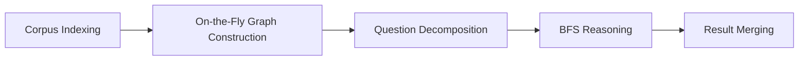

本記事は [https://arxiv.org/abs/2510.02827](https://arxiv.org/abs/2510.02827) の解説記事です。

## 論文概要

StepChain GraphRAGは、知識グラフ（KG）上での推論を活用してマルチホップ質問応答（Multi-Hop QA）の精度を向上させるフレームワークである。従来のGraphRAGが静的なグラフ構造に依存していたのに対し、StepChainは推論時にKGを動的に構築し、質問を段階的に分解した上でBFS（幅優先探索）によるエビデンスチェーンの収集を行う。著者らは、MuSiQue・2WikiMultiHopQA・HotpotQAの3データセットにおいて、既存手法を上回る性能を報告している。

この記事は [Zenn記事: Neo4j×GraphRAGで社内インシデント対応ナレッジ検索を構築する実装手法](https://zenn.dev/0h_n0/articles/dc86d7aa3ffa00) の深掘りです。

## 情報源

- **arXiv ID**: 2510.02827
- **URL**: [https://arxiv.org/abs/2510.02827](https://arxiv.org/abs/2510.02827)
- **著者**: Tengjun Ni, Xin Yuan, Shenghong Li, et al.
- **発表年**: 2025年
- **分野**: cs.CL（計算言語学）, cs.IR（情報検索）

## 背景と動機

マルチホップ質問応答は、複数の文書にまたがる情報を統合して回答を導出する必要があるタスクである。例えば「Xが監督した映画の主演俳優が生まれた都市はどこか」のような質問では、(1) Xが監督した映画の特定、(2) その映画の主演俳優の特定、(3) その俳優の出生地の特定、という3段階の推論が必要になる。

従来のRAG手法は、単一のクエリでベクトル検索を行うため、複数ホップにわたる推論に弱い。BM25やDense Retrievalでは関連文書を取りこぼすことが多く、GraphRAGはグラフの要約に依存するためノード間の推論パスを十分に活用できないという課題があった。RAPTORやHopRAGといった改良手法も提案されているが、質問の複雑さに応じた段階的な推論と、動的なグラフ構築を組み合わせたアプローチは十分に探索されていなかった。

StepChainは、この問題に対して「質問分解 + 動的KG構築 + BFS推論チェーン」の3つを統合的に組み合わせることで、マルチホップQAの精度を向上させることを目指している。

## 主要な貢献

著者らが報告している主要な貢献は以下の通りである。

- **On-the-Fly Graph Construction**: 推論時にコーパスからKGを動的に構築する仕組みを提案。事前に固定的なグラフを構築するのではなく、クエリに応じてインクリメンタルにグラフを更新する
- **Question Decomposition + BFS Reasoning**: 複雑なクエリをサブ質問に分解し、各サブ質問に対してBFSでKG上のエビデンスチェーンを収集するパイプラインを構築
- **3つのマルチホップQAベンチマークでの性能向上**: MuSiQue・2WikiMultiHopQA・HotpotQAにおいて、BM25・GraphRAG・RAPTOR・HopRAGといった既存手法を上回るExact Match（EM）およびF1スコアを達成

## 技術的詳細

### 5段階パイプラインの全体像

StepChain GraphRAGは、以下の5段階からなるパイプラインで構成される。



#### Stage 1: Corpus Indexing

入力コーパスを検索可能な単位にチャンク化する段階である。著者らは1,200トークン/100トークンオーバーラップという設定を採用している。

$$
D_i = \text{Chunk}(\tau_i) = \{c_{i,1}, c_{i,2}, \ldots, c_{i,n_i}\}
$$

ここで、$\tau_i$ は $i$ 番目の文書、$c_{i,j}$ は $j$ 番目のチャンク、$n_i$ は文書 $i$ のチャンク数である。オーバーラップを設けることで、チャンク境界でのエンティティ断裂を防いでいる。

#### Stage 2: On-the-Fly Graph Construction

推論時にKGを動的に構築する段階であり、StepChainの特徴的なコンポーネントである。以下の手順で進行する。

**エンティティ抽出**: 各チャンクからエンティティとその信頼度を抽出する。

$$
\text{Extract}(c_{i,j}) = \{(e, \alpha_e) \mid e \text{ appears in } c_{i,j}\}
$$

ここで $e$ はエンティティ、$\alpha_e$ は信頼度スコアである。

**関係検出**: 同一チャンク内に共起するエンティティペア間の関係を検出する。

$$
r = \text{Link}(e_a, e_b, c_{i,j})
$$

**クラスタリング**: Leiden algorithmを用いて、グラフ上のコミュニティ構造を検出する。

$$
\mathcal{C}_G = \text{Cluster}(G) = \{C_1, C_2, \ldots, C_k\}
$$

$k$ はクラスタ数であり、関連するエンティティがグループ化される。

**インクリメンタル更新**: 新しいチャンクが処理されるたびに、グラフにノードとエッジを追加する。

$$
G.\text{add\_nodes\_from}(V^{new}), \quad G.\text{add\_edges\_from}(E^{new})
$$

この動的構築により、クエリに関連する部分のみにKGが成長するため、静的な全体グラフ構築と比較して計算コストを抑えつつ、推論に必要な情報を漏れなく収集できる。

#### Stage 3: Question Decomposition

複雑なマルチホップ質問を、単一ホップで回答可能なサブ質問に分解する。

$$
\{q_1, q_2, \ldots, q_m\} = \text{Decompose}(q)
$$

ここで $q$ は元の質問、$q_i$ は $i$ 番目のサブ質問、$m$ はサブ質問数である。例えば「Aが監督した映画の主演俳優の出身地は？」という質問は次のように分解される。

- $q_1$: Aが監督した映画は何か？
- $q_2$: その映画の主演俳優は誰か？
- $q_3$: その俳優の出身地はどこか？

分解はLLM（著者らの実験ではGPT-4o）を用いて行われる。

#### Stage 4: BFS Reasoning

各サブ質問に対して、KG上でBFS（幅優先探索）を実行し、エビデンスチェーンを収集する。

$$
\text{BFS}(s_u, h) = \{v \in V \mid \text{dist}(s_u, v) \leq h\}
$$

ここで、
- $s_u$: サブ質問 $q_u$ に対応する開始ノード（シードエンティティ）
- $h$: 探索の最大深さ（著者らは $h = 2$ を採用）
- $\text{dist}(s_u, v)$: $s_u$ から $v$ への最短パス長
- $V$: KGのノード集合

深さ $h = 2$ のBFSにより、直接的な関係だけでなく、1ホップ先のエンティティを介した間接的な関係も収集できる。収集されたエビデンスチェーンは、各サブ質問への回答に使用される。

#### Stage 5: Result Merging

各サブ質問の部分回答を統合し、最終的な回答を生成する。

$$
A_{final} = \mathcal{M}(q \| A_{merge})
$$

ここで $\mathcal{M}$ はマージ関数、$q$ は元の質問、$A_{merge}$ は全サブ質問の部分回答を連結したものである。$\|$ は文字列の連結を表す。最終回答の生成にもLLMを使用し、部分回答間の矛盾解消や情報の統合を行う。

### BFS推論の擬似コード

```python
from collections import deque
from typing import Any

import networkx as nx


def bfs_evidence_chain(
    graph: nx.Graph,
    seed_entity: str,
    max_depth: int = 2,
) -> list[dict[str, Any]]:
    """BFS で KG 上のエビデンスチェーンを収集する。

    Args:
        graph: 知識グラフ（NetworkX Graph）
        seed_entity: 探索開始ノード
        max_depth: BFS の最大深さ

    Returns:
        エビデンスチェーンのリスト
    """
    visited: set[str] = set()
    queue: deque[tuple[str, int]] = deque([(seed_entity, 0)])
    evidence_chains: list[dict[str, Any]] = []

    while queue:
        node, depth = queue.popleft()
        if node in visited or depth > max_depth:
            continue
        visited.add(node)

        for neighbor in graph.neighbors(node):
            edge_data = graph.edges[node, neighbor]
            evidence_chains.append({
                "source": node,
                "target": neighbor,
                "relation": edge_data.get("relation", ""),
                "depth": depth + 1,
            })
            if depth + 1 < max_depth:
                queue.append((neighbor, depth + 1))

    return evidence_chains
```

### 質問分解アルゴリズム

```python
def decompose_question(
    question: str,
    llm_client: Any,
) -> list[str]:
    """マルチホップ質問をサブ質問に分解する。

    Args:
        question: 元のマルチホップ質問
        llm_client: LLM API クライアント

    Returns:
        サブ質問のリスト
    """
    prompt = (
        "Break the following multi-hop question into "
        "simple single-hop sub-questions.\n"
        "Return each sub-question on a new line.\n\n"
        f"Question: {question}\n\n"
        "Sub-questions:"
    )
    response = llm_client.generate(prompt)
    sub_questions = [
        sq.strip()
        for sq in response.strip().split("\n")
        if sq.strip()
    ]
    return sub_questions
```

## 実装のポイント

### Zenn記事のVectorCypherRetrieverとの関連

Zenn記事「Neo4j×GraphRAGで社内インシデント対応ナレッジ検索を構築する実装手法」で取り上げられている`VectorCypherRetriever`は、ベクトル検索とグラフ走査を組み合わせた検索手法である。StepChainのBFS推論は、このアプローチと概念的に共通する部分がある。

- **共通点**: ベクトル検索で候補を絞り込み、グラフ構造を走査してコンテキストを拡張する点
- **相違点**: VectorCypherRetrieverは事前構築されたNeo4jグラフに対してCypherクエリを実行するのに対し、StepChainは推論時にグラフを動的構築する点。また、StepChainは質問分解を組み合わせている

### 実装上の注意点

1. **チャンクサイズの調整**: 1,200トークン/100トークンオーバーラップは著者らの実験設定であり、ドメインによっては調整が必要になる。エンティティが長い技術文書では、より大きなチャンクサイズが有効な場合がある

2. **エンティティ抽出の精度**: LLMベースのエンティティ抽出はプロンプト設計に依存する。ドメイン固有のエンティティ（例: 社内システム名、インシデントID）には、few-shotプロンプトの追加が必要になるケースが多い

3. **BFS深さの設定**: 著者らは $h = 2$ を採用しているが、深い推論チェーンが必要なタスクでは $h = 3$ 以上も検討する必要がある。ただし、探索ノード数は深さに対して指数的に増加するため、計算コストとのトレードオフを考慮すべきである

4. **Leiden algorithmのパラメータ**: コミュニティ検出の解像度パラメータはグラフの規模やドメインに応じて調整が必要である

## Production Deployment Guide

StepChain GraphRAGをAWS上でプロダクション運用するための構成ガイドである。KGの動的構築とBFS推論を含むパイプラインは、レイテンシとコストのバランスが重要となる。以下のコスト試算は2026年8月時点のAWS東京リージョン（ap-northeast-1）の概算値であり、実際のコストはトラフィックパターン、バースト使用量、リージョンにより変動する。最新料金はAWS料金計算ツールで確認を推奨する。

### AWS実装パターン（コスト最適化重視）

| 項目 | Small (~100 req/日) | Medium (~1,000 req/日) | Large (10,000+ req/日) |
|------|-------------------|----------------------|----------------------|
| **コンピュート** | Lambda (512MB, 30s) | ECS Fargate (2vCPU, 8GB) | EKS + Karpenter (Spot) |
| **LLM** | Bedrock (Claude Sonnet) | Bedrock (Claude Sonnet) | Bedrock Batch API + Prompt Caching |
| **グラフDB** | DynamoDB (On-Demand) | Neptune Serverless | Neptune + Read Replica |
| **ベクトルDB** | OpenSearch Serverless | OpenSearch Serverless | OpenSearch Managed (3ノード) |
| **キャッシュ** | DynamoDB TTL | ElastiCache Redis (t4g.micro) | ElastiCache Redis (r7g.large) |
| **月額概算** | $80-150 | $400-800 | $2,500-5,000 |

**Small構成の内訳**: Lambda実行($15) + Bedrock推論($30-60) + DynamoDB($5-10) + OpenSearch Serverless($25) + CloudWatch($5) = $80-150/月

**Medium構成の内訳**: ECS Fargate($80-120) + Bedrock推論($150-300) + Neptune Serverless($50-100) + OpenSearch Serverless($50) + ElastiCache($20) + CloudWatch($10) = $400-800/月

**Large構成の内訳**: EKS + Spot($300-600) + Bedrock Batch($500-1,500) + Neptune($400-800) + OpenSearch($300-500) + ElastiCache($200-400) + 監視($50-100) = $2,500-5,000/月

**コスト削減テクニック**:
- Spot Instances活用（EKSワーカーノード）で最大90%削減
- Reserved Instances購入（Neptune、OpenSearch）で最大72%削減
- Bedrock Batch API使用でオンデマンド比50%削減
- Prompt Caching有効化でLLM呼び出しコスト30-90%削減
- BFS結果のキャッシュにより同一パターンのグラフ走査を回避

### Terraformインフラコード

**Small構成（Serverless: Lambda + Bedrock + DynamoDB）**:

```hcl
# --- VPC基盤（NAT Gateway不使用でコスト削減） ---
module "vpc" {
  source  = "terraform-aws-modules/vpc/aws"
  version = "~> 5.0"

  name = "stepchain-small-vpc"
  cidr = "10.0.0.0/16"

  azs             = ["ap-northeast-1a", "ap-northeast-1c"]
  private_subnets = ["10.0.1.0/24", "10.0.2.0/24"]
  public_subnets  = ["10.0.101.0/24", "10.0.102.0/24"]

  enable_nat_gateway = false  # コスト削減: VPCエンドポイント使用
}

# --- VPCエンドポイント（NAT Gateway代替） ---
resource "aws_vpc_endpoint" "dynamodb" {
  vpc_id       = module.vpc.vpc_id
  service_name = "com.amazonaws.ap-northeast-1.dynamodb"
  vpc_endpoint_type = "Gateway"
  route_table_ids   = module.vpc.private_route_table_ids
}

resource "aws_vpc_endpoint" "bedrock" {
  vpc_id             = module.vpc.vpc_id
  service_name       = "com.amazonaws.ap-northeast-1.bedrock-runtime"
  vpc_endpoint_type  = "Interface"
  subnet_ids         = module.vpc.private_subnets
  security_group_ids = [aws_security_group.vpce.id]
  private_dns_enabled = true
}

# --- IAMロール（最小権限） ---
resource "aws_iam_role" "stepchain_lambda" {
  name = "stepchain-lambda-role"
  assume_role_policy = jsonencode({
    Version = "2012-10-17"
    Statement = [{
      Action = "sts:AssumeRole"
      Effect = "Allow"
      Principal = { Service = "lambda.amazonaws.com" }
    }]
  })
}

resource "aws_iam_role_policy" "stepchain_lambda" {
  name = "stepchain-lambda-policy"
  role = aws_iam_role.stepchain_lambda.id
  policy = jsonencode({
    Version = "2012-10-17"
    Statement = [
      {
        Effect   = "Allow"
        Action   = ["bedrock:InvokeModel"]
        Resource = "arn:aws:bedrock:ap-northeast-1::foundation-model/anthropic.claude-*"
      },
      {
        Effect   = "Allow"
        Action   = ["dynamodb:GetItem", "dynamodb:PutItem", "dynamodb:Query", "dynamodb:BatchWriteItem"]
        Resource = aws_dynamodb_table.stepchain_graph.arn
      },
      {
        Effect   = "Allow"
        Action   = ["logs:CreateLogGroup", "logs:CreateLogStream", "logs:PutLogEvents"]
        Resource = "arn:aws:logs:ap-northeast-1:*:*"
      }
    ]
  })
}

# --- Lambda関数 ---
resource "aws_lambda_function" "stepchain" {
  function_name = "stepchain-graphrag"
  runtime       = "python3.12"
  handler       = "handler.lambda_handler"
  memory_size   = 512
  timeout       = 120  # BFS + LLM推論に十分な時間

  role = aws_iam_role.stepchain_lambda.arn

  environment {
    variables = {
      GRAPH_TABLE   = aws_dynamodb_table.stepchain_graph.name
      BFS_MAX_DEPTH = "2"
      CHUNK_SIZE    = "1200"
      CHUNK_OVERLAP = "100"
    }
  }

  tracing_config {
    mode = "Active"  # X-Ray有効化
  }
}

# --- DynamoDB（On-Demandモード） ---
resource "aws_dynamodb_table" "stepchain_graph" {
  name         = "stepchain-knowledge-graph"
  billing_mode = "PAY_PER_REQUEST"  # コスト最適化: On-Demand
  hash_key     = "PK"
  range_key    = "SK"

  attribute {
    name = "PK"
    type = "S"
  }
  attribute {
    name = "SK"
    type = "S"
  }

  server_side_encryption {
    enabled = true  # KMS暗号化
  }

  point_in_time_recovery {
    enabled = true
  }

  ttl {
    attribute_name = "expires_at"
    enabled        = true
  }
}

# --- CloudWatchアラーム ---
resource "aws_cloudwatch_metric_alarm" "lambda_errors" {
  alarm_name          = "stepchain-lambda-errors"
  comparison_operator = "GreaterThanThreshold"
  evaluation_periods  = 2
  metric_name         = "Errors"
  namespace           = "AWS/Lambda"
  period              = 300
  statistic           = "Sum"
  threshold           = 5
  alarm_actions       = [aws_sns_topic.alerts.arn]

  dimensions = {
    FunctionName = aws_lambda_function.stepchain.function_name
  }
}
```

**Large構成（Container: EKS + Karpenter + Spot Instances）**:

```hcl
# --- EKSクラスタ ---
module "eks" {
  source  = "terraform-aws-modules/eks/aws"
  version = "~> 20.0"

  cluster_name    = "stepchain-large"
  cluster_version = "1.31"

  vpc_id     = module.vpc.vpc_id
  subnet_ids = module.vpc.private_subnets

  cluster_endpoint_public_access = false  # セキュリティ: プライベートのみ

  enable_cluster_creator_admin_permissions = true
}

# --- Karpenter Provisioner（Spot優先） ---
resource "kubectl_manifest" "karpenter_nodepool" {
  yaml_body = yamlencode({
    apiVersion = "karpenter.sh/v1"
    kind       = "NodePool"
    metadata   = { name = "stepchain-spot" }
    spec = {
      template = {
        spec = {
          requirements = [
            { key = "karpenter.sh/capacity-type", operator = "In", values = ["spot", "on-demand"] },
            { key = "node.kubernetes.io/instance-type", operator = "In",
              values = ["m7i.xlarge", "m7a.xlarge", "m6i.xlarge", "c7i.xlarge"] },
          ]
          nodeClassRef = { name = "default" }
        }
      }
      limits   = { cpu = "64", memory = "256Gi" }
      disruption = {
        consolidationPolicy = "WhenEmptyOrUnderutilized"
        consolidateAfter    = "30s"
      }
    }
  })
}

# --- Secrets Manager ---
resource "aws_secretsmanager_secret" "bedrock_config" {
  name = "stepchain/bedrock-config"
  kms_key_id = aws_kms_key.stepchain.arn
}

# --- AWS Budgets ---
resource "aws_budgets_budget" "stepchain" {
  name         = "stepchain-monthly"
  budget_type  = "COST"
  limit_amount = "5000"
  limit_unit   = "USD"
  time_unit    = "MONTHLY"

  notification {
    comparison_operator       = "GREATER_THAN"
    threshold                 = 80
    threshold_type            = "PERCENTAGE"
    notification_type         = "ACTUAL"
    subscriber_email_addresses = ["ops-team@example.com"]
  }

  notification {
    comparison_operator       = "GREATER_THAN"
    threshold                 = 100
    threshold_type            = "PERCENTAGE"
    notification_type         = "FORECASTED"
    subscriber_email_addresses = ["ops-team@example.com"]
  }
}
```

### 運用・監視設定

**CloudWatch Logs Insights クエリ**（コスト異常検知・レイテンシ分析）:

```
# Bedrock トークン使用量の1時間集計
fields @timestamp, @message
| filter @message like /bedrock/
| stats sum(input_tokens) as total_input, sum(output_tokens) as total_output by bin(1h)
| sort @timestamp desc

# BFS推論レイテンシ P95/P99
fields @timestamp, bfs_duration_ms
| filter event = "bfs_reasoning"
| stats percentile(bfs_duration_ms, 95) as p95, percentile(bfs_duration_ms, 99) as p99 by bin(5m)
```

**CloudWatch アラーム設定**（Python boto3）:

```python
import boto3


def create_bedrock_token_alarm(sns_topic_arn: str) -> None:
    """Bedrock トークン使用量スパイク検知アラームを作成する。"""
    cw = boto3.client("cloudwatch", region_name="ap-northeast-1")
    cw.put_metric_alarm(
        AlarmName="stepchain-bedrock-token-spike",
        MetricName="InputTokenCount",
        Namespace="AWS/Bedrock",
        Statistic="Sum",
        Period=3600,
        EvaluationPeriods=1,
        Threshold=500000,
        ComparisonOperator="GreaterThanThreshold",
        AlarmActions=[sns_topic_arn],
    )
```

**X-Ray トレーシング設定**:

```python
from aws_xray_sdk.core import patch_all, xray_recorder

patch_all()  # boto3 自動計装


@xray_recorder.capture("stepchain_bfs_reasoning")
def bfs_reasoning(graph: dict, seed: str, depth: int = 2) -> list:
    """BFS推論をX-Rayトレースで計測する。"""
    subsegment = xray_recorder.current_subsegment()
    subsegment.put_annotation("seed_entity", seed)
    subsegment.put_annotation("max_depth", depth)

    results = _execute_bfs(graph, seed, depth)

    subsegment.put_metadata("evidence_count", len(results))
    return results
```

**Cost Explorer 自動レポート**:

```python
import boto3
from datetime import datetime, timedelta


def daily_cost_report(sns_topic_arn: str) -> None:
    """日次コストレポートを取得し、閾値超過時にSNS通知する。"""
    ce = boto3.client("ce", region_name="us-east-1")
    today = datetime.utcnow().strftime("%Y-%m-%d")
    yesterday = (datetime.utcnow() - timedelta(days=1)).strftime("%Y-%m-%d")

    resp = ce.get_cost_and_usage(
        TimePeriod={"Start": yesterday, "End": today},
        Granularity="DAILY",
        Metrics=["UnblendedCost"],
        Filter={
            "Tags": {"Key": "Project", "Values": ["stepchain-graphrag"]}
        },
        GroupBy=[{"Type": "DIMENSION", "Key": "SERVICE"}],
    )

    total = sum(
        float(g["Metrics"]["UnblendedCost"]["Amount"])
        for group in resp["ResultsByTime"]
        for g in group["Groups"]
    )

    if total > 100:
        sns = boto3.client("sns", region_name="ap-northeast-1")
        sns.publish(
            TopicArn=sns_topic_arn,
            Subject="StepChain Cost Alert",
            Message=f"Daily cost ${total:.2f} exceeded $100 threshold.",
        )
```

### コスト最適化チェックリスト

**アーキテクチャ選択**:
- [ ] トラフィック量に応じた構成を選択（~100 req/日→Serverless、~1,000→Hybrid、10,000+→Container）
- [ ] グラフDBはトラフィック量に応じて選択（DynamoDB→Neptune Serverless→Neptune Managed）

**リソース最適化**:
- [ ] EKSワーカーノードはSpot Instances優先（最大90%削減）
- [ ] Neptune/OpenSearchはReserved Instances購入（1年で最大42%、3年で最大72%削減）
- [ ] Savings Plans検討（Compute Savings Plans）
- [ ] Lambda メモリサイズを512MB基準で最適化（AWS Lambda Power Tuningで検証）
- [ ] ECS/EKSのアイドル時スケールダウン設定（Karpenter consolidationPolicy）
- [ ] 不要なNAT Gatewayを廃止し、VPCエンドポイントに置換

**LLMコスト削減**:
- [ ] Bedrock Batch API使用（非リアルタイム処理で50%削減）
- [ ] Prompt Caching有効化（システムプロンプト・few-shotキャッシュで30-90%削減）
- [ ] モデル選択ロジック実装（単純なサブ質問はHaiku、複雑な統合はSonnet）
- [ ] 入出力トークン数制限（max_tokens設定）
- [ ] BFS結果キャッシュ（同一エンティティへの再走査を回避、ElastiCache/DynamoDB TTL活用）

**監視・アラート**:
- [ ] AWS Budgets設定（月額上限の80%でアラート）
- [ ] CloudWatch アラーム（Lambda エラー率、Bedrock トークンスパイク）
- [ ] Cost Anomaly Detection有効化
- [ ] 日次コストレポート自動送信（SNS経由）

**リソース管理**:
- [ ] 未使用リソースの定期削除（月次レビュー）
- [ ] タグ戦略統一（`Project=stepchain-graphrag`、`Environment`、`CostCenter`）
- [ ] S3/DynamoDBライフサイクルポリシー（古いグラフデータの自動削除）
- [ ] 開発環境の夜間・週末停止（EventBridge Scheduler）
- [ ] CloudTrail/Config有効化（監査・コンプライアンス）

## 実験結果

### メインの実験結果

著者らは、GPT-4oをLLMバックエンドとし、top-20の検索結果を使用した条件で以下の結果を報告している（論文Table 2より）。

| データセット | Exact Match (EM) | F1 |
|-------------|:-:|:-:|
| MuSiQue | 43.90 | 55.38 |
| 2WikiMultiHopQA | 62.40 | 70.72 |
| HotpotQA | 66.70 | 79.50 |
| **平均** | **57.67** | **68.53** |

### ベースラインとの比較

以下に、同一条件下での主要なベースラインとの比較を示す（論文Table 2より）。

| 手法 | MuSiQue EM | 2Wiki EM | HotpotQA EM | 平均 EM |
|------|:-:|:-:|:-:|:-:|
| BM25 | 13.80 | 40.30 | 41.20 | 31.77 |
| GraphRAG | 12.10 | 22.50 | 31.70 | 22.10 |
| RAPTOR | 36.40 | 53.80 | 58.00 | 49.40 |
| HopRAG | 42.20 | 61.10 | 62.00 | 55.10 |
| **StepChain** | **43.90** | **62.40** | **66.70** | **57.67** |

StepChainは全データセットで最高スコアを達成している。特にMuSiQueは4ホップの推論を要する高難度タスクであり、BM25のEM 13.80に対してStepChainは43.90と大幅な改善を示している。GraphRAG（Microsoft方式）のEM 22.10に対しても35ポイント以上の差がついている点は注目に値する。

### アブレーション分析

各コンポーネントの寄与を確認するため、著者らはアブレーション実験を行っている（論文Table 3相当）。

| 構成 | 平均 EM | 平均 F1 |
|------|:-:|:-:|
| ベースライン（ナイーブRAG） | 20.77 | 28.20 |
| + 質問分解のみ | 36.33 | 45.80 |
| + GraphRAG + 分解 | 48.03 | 60.21 |
| Full system (StepChain) | 57.67 | 68.53 |

質問分解だけで平均EMが20.77から36.33へ+15.56ポイント改善しており、マルチホップQAにおける質問分解の有効性が確認できる。さらにGraphRAGとBFS推論を組み合わせることで48.03から57.67へ+9.64ポイントの追加改善が得られている。

### 計算コスト

著者らは、BFS走査とグラフ更新のオーバーヘッドは3秒未満/クエリであると報告している。パイプライン全体の所要時間は約80秒/クエリであり、GPT-4oの推論コストが支配的である。グラフ構築と走査自体の計算負荷は全体の4%未満に抑えられているため、ボトルネックはLLMの推論レイテンシとコストにある。

## 実運用への応用

### 社内ナレッジ検索への適用

Zenn記事で取り上げられているインシデント対応ナレッジ検索への応用を考えると、StepChainの以下の特性が有用である。

1. **動的グラフ構築**: インシデントレポートが追加されるたびにKGを再構築する必要がなく、既存グラフにインクリメンタルに統合できる。Neo4jのMERGE操作との親和性が高い

2. **質問分解**: 「先月のネットワーク障害で影響を受けたサービスのうち、SLA違反が発生したものの復旧手順は？」のような複合的な問い合わせを段階的に処理できる

3. **BFS推論チェーン**: インシデント→影響サービス→SLA定義→復旧手順というエビデンスパスを明示的に追跡でき、回答の根拠が透明になる

### スケーリングの考慮点

- **グラフの肥大化**: 長期運用ではノード・エッジ数が増大するため、TTL付きのエッジ削除やコミュニティ統合による圧縮が必要になる
- **LLMコスト**: 質問分解・エンティティ抽出・最終回答生成の各段階でLLMを呼び出すため、1クエリあたりのLLM呼び出し回数が3-5回程度になる。Prompt Cachingの活用やモデルの使い分け（サブ質問にはHaiku、統合にはSonnet等）でコスト削減が可能
- **レイテンシ**: 80秒/クエリという著者らの報告値はGPT-4oに依存している。ストリーミング応答やサブ質問の並列処理でユーザー体験を改善できる余地がある

## 関連研究

- **GraphRAG (Microsoft, 2024)**: コーパス全体からグローバルKGを構築し、コミュニティ要約を用いて回答を生成する手法。StepChainとの主な違いは、GraphRAGが静的なグラフ要約に依存する一方、StepChainは動的構築とBFS走査を行う点である
- **RAPTOR (Sarthi et al., 2024)**: テキストチャンクを再帰的に要約して木構造を構築し、異なる粒度での検索を可能にする手法。StepChainはRAPTORの平均EMを8.27ポイント上回っている
- **HopRAG (Li et al., 2025)**: グラフ上のホップ推論を活用するRAG手法。StepChainと類似のアプローチだが、StepChainは質問分解との統合とBFSの明示的な深さ制御により改善を達成している

## まとめと今後の展望

StepChain GraphRAGは、動的KG構築・質問分解・BFS推論チェーンの3つを統合することで、マルチホップQAの精度を向上させるフレームワークである。著者らは3つのベンチマークでHopRAGを含む既存手法を上回る性能を報告しており、特にBFS走査のオーバーヘッドが3秒未満と実用的なレベルに収まっている点が注目される。

実務的には、Neo4jベースの既存GraphRAGパイプラインに質問分解とBFS推論を追加する形で段階的に導入可能であり、Zenn記事で紹介されているVectorCypherRetrieverのアーキテクチャとも自然に統合できる。今後の課題として、著者らはより深い推論チェーン（$h > 2$）への拡張や、グラフ更新の効率化を挙げている。

## 参考文献

- **arXiv**: [https://arxiv.org/abs/2510.02827](https://arxiv.org/abs/2510.02827)
- **Related Zenn article**: [https://zenn.dev/0h_n0/articles/dc86d7aa3ffa00](https://zenn.dev/0h_n0/articles/dc86d7aa3ffa00)
- Edge et al., "From Local to Global: A Graph RAG Approach to Query-Focused Summarization," arXiv:2404.16130, 2024.
- Sarthi et al., "RAPTOR: Recursive Abstractive Processing for Tree-Organized Retrieval," arXiv:2401.18059, 2024.
- Li et al., "HopRAG: Multi-Hop Reasoning Augmented Generation," 2025.
