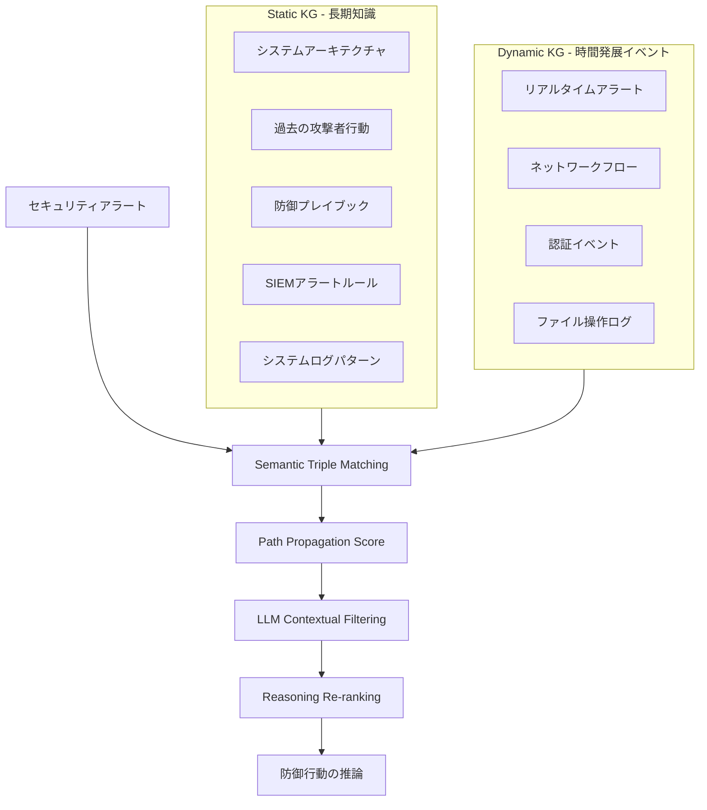
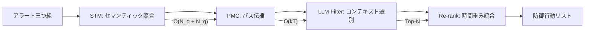
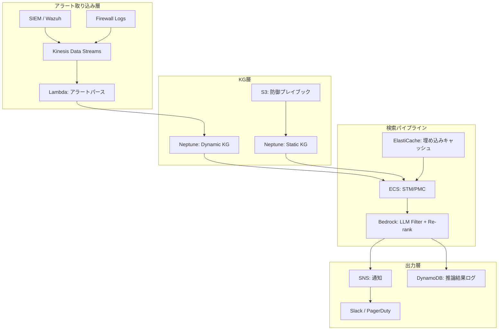

## 論文概要（Abstract）

本記事は [https://arxiv.org/abs/2606.21059](https://arxiv.org/abs/2606.21059) の解説記事です。

DEFENGRAPH は、サイバーセキュリティのBlue Team防御において、LLMの推論能力をナレッジグラフ（KG）で強化するフレームワークである。著者らは、静的KG（SKG）と動的KG（DKG）からなる二層アーキテクチャを提案し、セマンティック三つ組マッチング（STM）、パス伝播スコア（PMC）、LLMコンテキストフィルタリング、推論リランキングの4段階検索プロセスを通じて、セキュリティアラートに対する防御行動を推論する。ACDCサイバーレンジの実データ（8.2Mファイアウォールログ、6.1M+ Wazuhアラート）を用いた評価で、GPT-4oにおけるTicket-Action Recall が52.17%から72.46%へ20.29ポイント改善したと報告されている。

この記事は [Zenn記事: Neo4j×GraphRAGで社内インシデント対応ナレッジ検索を構築する実装手法](https://zenn.dev/0h_n0/articles/dc86d7aa3ffa00) の深掘りです。

## 情報源

- **arXiv ID**: 2606.21059
- **URL**: [arXiv:2606.21059](https://arxiv.org/abs/2606.21059)
- **著者**: Zhen Wang, Kristen Moore, Qin Wang, Guangsheng Yu, Minjune Kim, Diksha Goel, Gang Li, Ahmed Ibrahim, Ahmad Mohsin, Helge Janicke（10名）
- **発表年**: 2026年6月
- **分野**: Cryptography and Security (cs.CR)

## 背景と動機（Background）

### サイバー防御におけるLLMの課題

SOC（Security Operations Center）アナリストは、日々膨大なセキュリティアラートに直面している。SIEM（Security Information and Event Management）から発生する数百万件のアラートを、限られた人員で分析し、適切な防御行動を取る必要がある。LLMはこの負荷を軽減する有望な技術だが、以下の深刻な課題がある。

**ハルシネーション**: LLMは学習データに存在しないセキュリティコンテキスト（組織固有のネットワーク構成、既知の攻撃パターン、防御プレイブック）を正確に把握できない。その結果、存在しないCVEの引用や、環境に不適切な対処法の提案といったハルシネーションが生じる。

**時間的コンテキストの欠如**: サイバー攻撃は時間的に発展する。最初の偵察行動から横展開、データ窃取に至る一連の攻撃チェーンを、LLM単体では時系列的に追跡できない。30分前のブルートフォース試行と現在の権限昇格が同一攻撃者によるものかどうか、コンテキストなしでは判断が困難である。

**組織固有知識の不在**: 各組織のネットワークトポロジー、導入済みセキュリティ製品、インシデント対応プレイブックは固有であり、汎用LLMはこれらを知らない。

### Zenn記事との関連

Zenn記事「Neo4j×GraphRAGで社内インシデント対応ナレッジ検索を構築する実装手法」では、インシデント対応ナレッジをNeo4jのKGとして構築し、GraphRAGで検索するアプローチを紹介した。DEFENGRAPHは、このアプローチをサイバー防御ドメインに特化させ、静的・動的の二層KGアーキテクチャと段階的検索プロセスによって、より高度な推論を実現するフレームワークである。

## 主要な貢献（Key Contributions）

著者らは以下の4つの貢献を報告している。

1. **二層KGアーキテクチャ**: 長期的な防御知識を格納するStatic KG（SKG）と、時間発展するセキュリティイベントを追跡するDynamic KG（DKG）の分離設計
2. **4段階検索プロセス**: STM → PMC → LLMフィルタリング → 推論リランキングの段階的な知識検索パイプライン
3. **時間重み付け機構**: 動的KGにおけるタイムスタンプベースの減衰関数により、最近のイベントを優先する仕組み
4. **ACDCデータセットでの実証**: 軍事レベルのサイバーレンジ演習データを用いた大規模実験による有効性の実証

## 技術的詳細（Technical Details）

### 二層KGアーキテクチャ

DEFENGRAPHの中核は、知識を**静的層**と**動的層**に分離する設計にある。



**Static KG（SKG）**は、システムアーキテクチャ、過去の攻撃者行動パターン、SIEMアラートルール、システムログの定常パターン、防御プレイブックなどの長期的な知識を格納する。これらは頻繁に変更されず、防御行動の根拠となるベースライン知識を提供する。

**Dynamic KG（DKG）**は、タイムスタンプ付きのセキュリティイベントを格納する。新規アラートの発生、ネットワークフローの変化、認証イベントなど、時間とともに発展するデータを三つ組（主語-述語-目的語）として表現する。DKGには時間重み付けが適用される。

$$w_t = \exp(-\alpha |t_i - t_q|)$$

ここで $t_i$ はイベントのタイムスタンプ、$t_q$ はクエリ時刻、$\alpha$ は減衰パラメータである。この指数減衰により、直近のイベントほど高い重みを持ち、古いイベントは自然に重要度が低下する。例えば、$\alpha = 0.1$（時間単位）の場合、1時間前のイベントは $w_t \approx 0.90$ 、10時間前は $w_t \approx 0.37$ となり、攻撃チェーンの時間的近接性を反映できる。

### 4段階検索プロセス

#### Stage 1: Semantic-based Triple Matching（STM）

セキュリティアラートを三つ組形式に変換し、事前学習済み言語モデルでKG内の三つ組とのセマンティック類似度を計算する。

$$m^t = \sigma(h_q W_q^t \cdot h_g^t W_g^t)$$

ここで：
- $h_q$: アラート三つ組の埋め込みベクトル
- $h_g^t$: KG三つ組の埋め込みベクトル
- $W_q^t, W_g^t$: 学習可能な射影行列
- $\sigma$: シグモイド関数

この段階では、「SSH brute force detected on 10.0.1.5」というアラートが、KG内の「SSH攻撃 → 試行 → 認証サービス」という三つ組と高い類似度を持つことを検出する。単純なキーワードマッチングではなく、セマンティック空間での照合により、表現の揺れに対するロバスト性を確保する。

#### Stage 2: Path Propagation Score（PMC）

STMで特定した三つ組の隣接ノードへスコアを伝播させ、関連するパスを構築する。

$$S_t^k = S_{t-1}^k \cdot m_t^k$$

ここで $S_t^k$ は $k$ 番目のパスのステップ $t$ における累積スコアである。各ステップで隣接三つ組のマッチングスコアを乗算し、パス全体の関連度を算出する。スコアの積を取ることで、パスの途中に無関係なノードが含まれると全体スコアが大きく減衰する仕組みとなっている。

例えば、SSHブルートフォースアラートから始まり、「認証失敗 → 権限昇格試行 → ラテラルムーブメント」という攻撃パスがKG上で高スコアのパスとして検出される。

#### Stage 3: LLM Contextual Filtering

PMCで得られた候補パスの中から、LLMのコンテキスト理解力を活用してTop-Nパスを選択する。

$$P_{\text{top-N}} = \arg\max S_{\text{context}}^{\text{LLM}}(P_i | W_q)$$

LLMは、各パスがクエリ（セキュリティアラート）のコンテキストに照らして意味的に妥当かどうかを判定する。グラフ構造上はスコアが高くても、セキュリティドメインの知識から見て不合理なパス（例：プリンタ障害とSSH攻撃の関連付け）を除外する。

#### Stage 4: Reasoning Re-ranking

最終段階では、静的KGからの防御コンテキストと動的KGの時間重みを組み合わせてリランキングを行う。

$$P_{\text{rank-N}} = \arg\max(S_{\text{reason}}^{\text{LLM}} \cdot W_t)$$

ここで $S_{\text{reason}}^{\text{LLM}}$ はLLMの推論スコア、$W_t$ は時間重みである。静的KGの防御プレイブック知識（「このタイプのアラートにはファイアウォールルール追加が有効」等）と、動的KGの時間的近接性を統合することで、最も適切な防御行動を順位付けする。

### 4段階パイプラインの処理フロー



計算量について、著者らはSTM/PMCの複合計算量を $O(N_q + N_g + kT)$ と報告している。$N_q$ はクエリ三つ組数、$N_g$ はKG三つ組数、$k$ は伝播ステップ数、$T$ はパス数である。GPT-4oでの推論（Stage 3-4）は26-44秒を要する。

## 実装のポイント（Implementation Notes）

### Zenn記事のインシデント対応KGとの対比

Zenn記事で構築したNeo4j×GraphRAGのインシデント対応KGは、DEFENGRAPHの**Static KG（SKG）に相当**する。過去のインシデント対応ナレッジ、対処手順、影響範囲などを静的に格納し、新しいインシデント発生時にGraphRAGで関連知識を検索する構成である。

DEFENGRAPHはこのアプローチを以下の点で拡張している。

| 観点 | Zenn記事のGraphRAG | DEFENGRAPH |
|------|-------------------|-----------|
| KG層 | 単一層（静的） | 二層（静的+動的） |
| 時間考慮 | なし | 指数減衰の時間重み |
| 検索手法 | ベクトル類似度検索 | 4段階パイプライン |
| パス推論 | 1ホップ近傍 | マルチホップ伝播 |
| リランキング | なし | LLM推論+時間重み |

実装面で注目すべきは、Zenn記事のNeo4jベースのGraphRAGに**Dynamic KG層を追加**することで、DEFENGRAPHのアーキテクチャに近い構成が構築可能な点である。具体的には以下のような拡張が考えられる。

```python
from datetime import datetime, timedelta
from math import exp
from dataclasses import dataclass

@dataclass
class TemporalTriple:
    """時間重み付き三つ組。DKGのエッジに対応。"""
    subject: str
    predicate: str
    obj: str
    timestamp: datetime

    def temporal_weight(self, query_time: datetime, alpha: float = 0.1) -> float:
        """時間減衰重みを計算。

        Args:
            query_time: クエリ実行時刻
            alpha: 減衰パラメータ（大きいほど急速に減衰）

        Returns:
            0.0-1.0の時間重み。直近ほど1.0に近い。
        """
        delta_hours = abs(
            (self.timestamp - query_time).total_seconds()
        ) / 3600.0
        return exp(-alpha * delta_hours)
```

```python
from typing import Protocol

class TripleEncoder(Protocol):
    """三つ組をベクトル化するエンコーダのインターフェース。"""
    def encode(self, triple: TemporalTriple) -> list[float]: ...

def semantic_triple_matching(
    alert_triple: TemporalTriple,
    kg_triples: list[TemporalTriple],
    encoder: TripleEncoder,
    threshold: float = 0.7,
) -> list[tuple[TemporalTriple, float]]:
    """STM: アラート三つ組とKG三つ組のセマンティック照合。

    Args:
        alert_triple: 入力アラートの三つ組表現
        kg_triples: KG内の三つ組リスト
        encoder: 埋め込みモデル（SentenceTransformer等）
        threshold: マッチング閾値

    Returns:
        閾値以上のスコアを持つ(三つ組, スコア)のリスト
    """
    alert_vec = encoder.encode(alert_triple)
    results = []
    for kg_triple in kg_triples:
        kg_vec = encoder.encode(kg_triple)
        score = _cosine_similarity(alert_vec, kg_vec)
        if score >= threshold:
            results.append((kg_triple, score))
    return sorted(results, key=lambda x: x[1], reverse=True)
```

### Cold-Start問題

著者らは、DKGをリセットした場合（Cold-Start）の性能劣化を報告している。RAR（Reasoning-Action Recall）は58.26%、TAR（Ticket-Action Recall）は37.43%に低下する。これは、動的KGの時間コンテキストが推論品質に大きく寄与していることを示しており、実運用ではDKGの初期化戦略が重要となる。

## Production Deployment Guide

DEFENGRAPHの二層KGアーキテクチャをAWS上にデプロイするための構成を以下に示す。コスト試算は2026年8月時点の概算であり、リージョンや利用状況により変動する。

### トラフィック量別AWS構成

| 構成要素 | Small（~1K alerts/日） | Medium（~50K alerts/日） | Large（~1M alerts/日） |
|---------|----------------------|------------------------|---------------------|
| **Neo4j** | Neptune Serverless | Neptune db.r6g.2xlarge | Neptune db.r6g.8xlarge x3 |
| **KG更新Worker** | Lambda (ARM64) | ECS Fargate (2vCPU/4GB) | ECS on EC2 (c6g.2xlarge x4) |
| **STM/PMC推論** | Lambda + SageMaker Serverless | ECS Fargate (4vCPU/8GB) | ECS on EC2 (g5.xlarge GPU) |
| **LLMフィルタリング** | Bedrock (Claude/GPT) | Bedrock Provisioned | Bedrock Provisioned + キャッシュ |
| **アラート取り込み** | SQS Standard | SQS FIFO + Kinesis Data Streams | Kinesis Data Streams (シャード x8) |
| **キャッシュ** | ElastiCache t4g.micro | ElastiCache r6g.large | ElastiCache r6g.2xlarge クラスタ |
| **月額概算** | $800-1,200 | $4,500-7,000 | $18,000-28,000 |

### アーキテクチャ概要



### Terraformコード

```hcl
# ---- Neptune (KG層) ----
resource "aws_neptune_cluster" "defengraph_kg" {
  cluster_identifier                  = "defengraph-kg"
  engine                              = "neptune"
  engine_version                      = "1.3.4.0"
  serverless_v2_scaling_configuration {
    min_capacity = 2.5
    max_capacity = 32
  }
  iam_database_authentication_enabled = true
  storage_encrypted                   = true
  kms_key_id                          = aws_kms_key.defengraph.arn
  vpc_security_group_ids              = [aws_security_group.neptune.id]
  neptune_subnet_group_name           = aws_neptune_subnet_group.private.name

  tags = {
    Environment = "production"
    Project     = "defengraph"
    Component   = "knowledge-graph"
  }
}

resource "aws_neptune_cluster_instance" "kg_writer" {
  cluster_identifier = aws_neptune_cluster.defengraph_kg.id
  instance_class     = "db.serverless"
  engine             = "neptune"
}

# ---- Kinesis Data Streams (アラート取り込み) ----
resource "aws_kinesis_stream" "alert_stream" {
  name             = "defengraph-alerts"
  shard_count      = 4
  retention_period = 168  # 7日間

  stream_mode_details {
    stream_mode = "PROVISIONED"
  }

  encryption_type = "KMS"
  kms_key_id      = aws_kms_key.defengraph.arn

  tags = {
    Environment = "production"
    Project     = "defengraph"
  }
}

# ---- ECS Fargate (STM/PMC推論) ----
resource "aws_ecs_service" "stm_pmc" {
  name            = "defengraph-stm-pmc"
  cluster         = aws_ecs_cluster.defengraph.id
  task_definition = aws_ecs_task_definition.stm_pmc.arn
  desired_count   = 2
  launch_type     = "FARGATE"

  network_configuration {
    subnets          = var.private_subnet_ids
    security_groups  = [aws_security_group.ecs_stm.id]
    assign_public_ip = false
  }

  service_registries {
    registry_arn = aws_service_discovery_service.stm_pmc.arn
  }
}

resource "aws_ecs_task_definition" "stm_pmc" {
  family                   = "defengraph-stm-pmc"
  requires_compatibilities = ["FARGATE"]
  network_mode             = "awsvpc"
  cpu                      = "4096"
  memory                   = "8192"
  execution_role_arn       = aws_iam_role.ecs_execution.arn
  task_role_arn            = aws_iam_role.ecs_task.arn

  container_definitions = jsonencode([
    {
      name      = "stm-pmc"
      image     = "${aws_ecr_repository.stm_pmc.repository_url}:latest"
      essential = true
      portMappings = [
        { containerPort = 8080, protocol = "tcp" }
      ]
      environment = [
        { name = "NEPTUNE_ENDPOINT", value = aws_neptune_cluster.defengraph_kg.endpoint },
        { name = "CACHE_ENDPOINT", value = aws_elasticache_replication_group.embeddings.primary_endpoint_address },
        { name = "ALPHA_DECAY", value = "0.1" }
      ]
      logConfiguration = {
        logDriver = "awslogs"
        options = {
          "awslogs-group"         = "/ecs/defengraph/stm-pmc"
          "awslogs-region"        = var.aws_region
          "awslogs-stream-prefix" = "stm"
        }
      }
    }
  ])
}

# ---- ElastiCache (埋め込みキャッシュ) ----
resource "aws_elasticache_replication_group" "embeddings" {
  replication_group_id = "defengraph-emb-cache"
  description          = "Embedding cache for STM triple matching"
  node_type            = "cache.r6g.large"
  num_cache_clusters   = 2
  engine               = "redis"
  engine_version       = "7.1"
  port                 = 6379
  at_rest_encryption_enabled = true
  transit_encryption_enabled = true
  subnet_group_name    = aws_elasticache_subnet_group.private.name
  security_group_ids   = [aws_security_group.redis.id]

  automatic_failover_enabled = true
}

# ---- CloudWatch アラーム ----
resource "aws_cloudwatch_metric_alarm" "stm_latency_high" {
  alarm_name          = "defengraph-stm-p99-latency"
  comparison_operator = "GreaterThanThreshold"
  evaluation_periods  = 3
  metric_name         = "STMLatencyP99"
  namespace           = "DefenGraph/STM"
  period              = 60
  statistic           = "p99"
  threshold           = 5000
  alarm_description   = "STM p99 latency exceeds 5s for 3 consecutive minutes"
  alarm_actions       = [aws_sns_topic.alerts.arn]

  dimensions = {
    ServiceName = "stm-pmc"
  }
}

resource "aws_cloudwatch_metric_alarm" "neptune_cpu_high" {
  alarm_name          = "defengraph-neptune-cpu"
  comparison_operator = "GreaterThanThreshold"
  evaluation_periods  = 5
  metric_name         = "CPUUtilization"
  namespace           = "AWS/Neptune"
  period              = 60
  statistic           = "Average"
  threshold           = 80
  alarm_description   = "Neptune CPU > 80% for 5 minutes"
  alarm_actions       = [aws_sns_topic.alerts.arn]

  dimensions = {
    DBClusterIdentifier = aws_neptune_cluster.defengraph_kg.cluster_identifier
  }
}

resource "aws_cloudwatch_metric_alarm" "kinesis_iterator_age" {
  alarm_name          = "defengraph-kinesis-lag"
  comparison_operator = "GreaterThanThreshold"
  evaluation_periods  = 3
  metric_name         = "GetRecords.IteratorAgeMilliseconds"
  namespace           = "AWS/Kinesis"
  period              = 60
  statistic           = "Maximum"
  threshold           = 300000
  alarm_description   = "Kinesis iterator age > 5 min — alert ingestion lag"
  alarm_actions       = [aws_sns_topic.alerts.arn]

  dimensions = {
    StreamName = aws_kinesis_stream.alert_stream.name
  }
}

resource "aws_cloudwatch_metric_alarm" "dkg_triple_count" {
  alarm_name          = "defengraph-dkg-growth"
  comparison_operator = "GreaterThanThreshold"
  evaluation_periods  = 1
  metric_name         = "DKGTripleCount"
  namespace           = "DefenGraph/KG"
  period              = 3600
  statistic           = "Maximum"
  threshold           = 5000000
  alarm_description   = "DKG triple count > 5M — consider TTL cleanup"
  alarm_actions       = [aws_sns_topic.alerts.arn]
}
```

### CloudWatch ダッシュボード設定

```python
"""CloudWatch カスタムメトリクス送信ユーティリティ。"""

import boto3
from datetime import datetime
from typing import Any


def put_defengraph_metrics(
    stm_latency_ms: float,
    pmc_latency_ms: float,
    llm_latency_ms: float,
    matched_triples: int,
    dkg_triple_count: int,
    region: str = "ap-northeast-1",
) -> dict[str, Any]:
    """DEFENGRAPHパイプラインのカスタムメトリクスをCloudWatchに送信。

    Args:
        stm_latency_ms: STMステージのレイテンシ（ミリ秒）
        pmc_latency_ms: PMCステージのレイテンシ（ミリ秒）
        llm_latency_ms: LLMフィルタリングのレイテンシ（ミリ秒）
        matched_triples: マッチした三つ組数
        dkg_triple_count: DKG内の三つ組総数
        region: AWSリージョン

    Returns:
        CloudWatch PutMetricData レスポンス
    """
    client = boto3.client("cloudwatch", region_name=region)
    now = datetime.utcnow()

    return client.put_metric_data(
        Namespace="DefenGraph/Pipeline",
        MetricData=[
            {
                "MetricName": "STMLatencyP99",
                "Timestamp": now,
                "Value": stm_latency_ms,
                "Unit": "Milliseconds",
                "Dimensions": [
                    {"Name": "ServiceName", "Value": "stm-pmc"},
                ],
            },
            {
                "MetricName": "PMCLatencyP99",
                "Timestamp": now,
                "Value": pmc_latency_ms,
                "Unit": "Milliseconds",
                "Dimensions": [
                    {"Name": "ServiceName", "Value": "stm-pmc"},
                ],
            },
            {
                "MetricName": "LLMFilterLatency",
                "Timestamp": now,
                "Value": llm_latency_ms,
                "Unit": "Milliseconds",
                "Dimensions": [
                    {"Name": "ServiceName", "Value": "llm-filter"},
                ],
            },
            {
                "MetricName": "MatchedTriples",
                "Timestamp": now,
                "Value": matched_triples,
                "Unit": "Count",
            },
            {
                "MetricName": "DKGTripleCount",
                "Timestamp": now,
                "Value": dkg_triple_count,
                "Unit": "Count",
            },
        ],
    )
```

### コスト最適化チェックリスト

以下は2026年8月時点の概算に基づくチェックリストである。

1. **Neptune Serverless活用**: 低トラフィック時（夜間等）にキャパシティを自動縮小。min_capacity=2.5 NCUで月額約$200の固定費から開始可能
2. **Kinesis On-Demandモード検討**: アラート量が不規則な場合、Provisionedよりコスト効率が良い場合がある
3. **ElastiCache Reserved Nodes**: 1年Reservedで最大35%割引。埋め込みキャッシュは長期利用が確定しているため有効
4. **Bedrock Provisioned Throughput**: LLMフィルタリングが高頻度の場合、Provisioned Throughputでトークン単価を40-60%削減
5. **Lambda ARM64 (Graviton)**: KG更新Workerにarm64ランタイムを使用し、x86比で最大20%のコスト削減
6. **S3 Intelligent-Tiering**: 防御プレイブックやログアーカイブにIntelligent-Tieringを適用
7. **NAT Gateway共有**: 複数サブネットで単一NAT Gatewayを共有（小規模構成時）
8. **ECS Spot Fargate**: STM/PMC推論ワーカーにSpot Fargateを利用し最大70%削減。ただし中断耐性の設計が必要
9. **CloudWatch Logs Insights vs. OpenSearch**: ログ分析にOpenSearchを使わず、CloudWatch Logs Insightsで十分な場合はコスト削減可能
10. **VPCエンドポイント活用**: S3、DynamoDB、Bedrock等へのVPCエンドポイントでNAT Gateway通信量を削減
11. **DKG TTLポリシー**: 古い三つ組を自動削除するTTLを設定し、Neptuneストレージコストを抑制
12. **埋め込みモデルの選択**: 軽量モデル（all-MiniLM-L6-v2等）でSTMを実行し、SageMaker推論コストを削減
13. **バッチ推論の活用**: リアルタイム性が不要なアラート（低優先度）はバッチ処理でLLMコストを削減
14. **KG更新の非同期化**: DKG更新をSQSキュー経由で非同期化し、ピーク時のCompute負荷を平準化
15. **Auto Scaling設定**: ECSサービスのTarget Tracking Scalingで CPU70%をターゲットに設定
16. **マルチAZ冗長の適正化**: 開発環境では単一AZに限定してコスト半減
17. **CloudWatch メトリクスの解像度**: カスタムメトリクスを標準解像度（60秒）に統一。高解像度（1秒）は本当に必要な場合のみ
18. **Savings Plans**: ECS Fargate用のCompute Savings Plansで最大50%割引
19. **RI + Spot混在**: STM/PMCワーカーのベースラインをReserved、バースト分をSpotで処理
20. **タグベースのコスト配分**: 全リソースにProject/Environment/Componentタグを付与し、Cost Explorerでのコスト追跡を有効化
21. **Bedrock Model Distillation**: 大規模モデル（GPT-4o相当）でのフィルタリング結果を教師データとして、軽量モデルへの蒸留を検討
22. **Neptune Read Replica**: 読み取り負荷の高いSTM/PMCクエリをRead Replicaに分散
23. **Kinesis Enhanced Fan-Out回避**: コンシューマが少ない場合はStandard Fan-Outで十分。Enhanced Fan-Outはコンシューマ数に比例して課金

## 実験結果（Experimental Results）

### ACDCサイバーレンジデータ

著者らは、ACDC（Australian Cyber Defence Centre）サイバーレンジでの5日間のライブ演習データを使用して評価を行っている。このデータセットの規模は以下の通りである。

- **参加者**: Red Team 6名 vs Blue Team 8名
- **環境**: 55+のIT/OTシステム（海洋港湾環境を模擬）
- **データ量**: 8.2Mファイアウォールログ、6.1M+ Wazuhアラート
- **グラウンドトゥルース**: 326インシデントレスポンスチケット、55件の確認済み攻撃-アラート-チケットトリプル

### 性能改善

著者らは、Static KGのみの構成とDEFENGRAPH（SKG+DKG+4段階検索）の比較を報告している。

| 指標 | Static KGのみ | DEFENGRAPH | 改善幅 |
|------|--------------|-----------|--------|
| Reasoning-Recall (GPT-4o) | 61.45% | 73.49% | +12.04pp |
| Ticket-Action Recall (GPT-4o) | 52.17% | 72.46% | +20.29pp |
| Ticket-Action Precision (GPT-4o) | 24.49% | 29.24% | +4.75pp |

Ticket-Action Recall（TAR）の20.29ポイント改善は、DEFENGRAPHが326件のインシデントレスポンスチケットに記録された防御行動のうち、より多くの行動を正しく推論できたことを意味する。著者らによれば、検出されたアクション数はStatic KGのみの36件からDEFENGRAPHの50件に増加した（GPT-4o使用時）。

一方で、Ticket-Action Precisionは24.49%から29.24%への4.75ポイント改善にとどまっている。これは、DEFENGRAPHが多くの防御行動候補を生成する（Recallの向上）一方で、誤検出も含まれることを示唆している。実運用では、Precision/RecallのトレードオフをTop-Nのしきい値調整で制御する必要がある。

### マルチモデル比較

著者らは、複数のLLMバックエンドでの性能を比較している。

| Model | TARベースライン | TAR (DEFENGRAPH) | 改善幅 | 検出アクション数 |
|-------|---------------|-----------------|--------|---------------|
| GPT-4o | 52.17% | 72.46% | +20.29pp | 50 (vs 36) |
| LLaMA 3.1 | 42.03% | 56.52% | +14.49pp | 39 |
| DeepSeek R1 | 43.48% | 59.42% | +15.94pp | 41 |
| QWen 3 | 42.03% | 46.38% | +4.35pp | 32 |

全モデルでDEFENGRAPHによる改善が確認されているが、改善幅にはモデル間で差がある。GPT-4oが最大の改善（+20.29pp）を示す一方、QWen 3は+4.35ppと限定的である。著者らはこの差異の要因を詳細に分析していないが、LLMのコンテキスト理解力とKGからの知識統合能力の差が影響していると考えられる。

### 計算コスト

GPT-4oを用いた推論（Stage 3-4）は1アラートあたり26-44秒を要すると報告されている。STM/PMC（Stage 1-2）は $O(N_q + N_g + kT)$ の計算量であり、KGの規模に依存する。リアルタイム防御には、STM/PMCの結果キャッシュとLLM推論の並列化が必要となる。

## 実運用への応用（Practical Applications）

### SOCオペレーションへの統合

DEFENGRAPHは、既存のSOCワークフローに以下のように統合できる。

1. **アラートトリアージの自動化**: SIEMアラートをDEFENGRAPHで自動分析し、優先度と推奨アクションを付与してアナリストに提示する。現状のルールベーストリアージと比較して、攻撃チェーンの検出率を向上させる
2. **インシデント対応の知識蓄積**: 対応が完了したインシデントをStatic KGに追加し、組織固有の防御知識を継続的に蓄積する。Zenn記事で紹介したNeo4j KGへのフィードバックループに相当する
3. **プレイブックの動的適用**: Static KGに格納された防御プレイブックを、Dynamic KGの現在のコンテキストに基づいて動的に選択・適用する

### 導入時の考慮事項

**Cold-Start問題**: 著者らが報告したCold-Start時の性能劣化（RAR=58.26%、TAR=37.43%）は、新規導入時やシステムリセット後の課題である。対策として、過去のインシデントログからDKGを事前構築する「ウォームアップ期間」の設計が必要となる。

**LLM選択のトレードオフ**: GPT-4oは最高の性能を示すが、推論コストが高い。LLaMA 3.1やDeepSeek R1はオンプレミスでの運用が可能であり、データ主権の観点から選択される場合がある。QWen 3は改善幅が限定的であるため、単独での利用は推奨されない。

**Precision/Recallバランス**: TAR 72.46%に対しPrecision 29.24%は、推奨アクションの約7割が不要な可能性を意味する。運用では、Top-Nのしきい値を調整し、Precisionを許容範囲に維持しながらRecallを最大化する運用設計が求められる。

## 関連研究（Related Work）

DEFENGRAPHは、以下の研究領域の交差点に位置する。

**KG-augmented LLM**: Retrieval-Augmented Generation（RAG）のナレッジグラフ拡張は、KAPING（Baek et al., 2023）やGraph-RAG（Microsoft, 2024）が代表的である。DEFENGRAPHは、これらの汎用フレームワークをサイバーセキュリティドメインに特化させ、時間重み付け機構を追加した点で差別化される。

**サイバーセキュリティKG**: MITRE ATT&CKフレームワークに基づくKG構築は広く研究されているが、動的なイベント追跡を含む二層構造は著者らの新規提案である。従来のサイバーセキュリティKGは静的な知識表現に限定されていた。

**LLMによるセキュリティ分析**: SecGPT（Fang et al., 2024）やPentestGPT（Deng et al., 2024）はLLMを攻撃側（Red Team）に適用する研究であるのに対し、DEFENGRAPHは防御側（Blue Team）に焦点を当てている点で補完的な関係にある。

## まとめ（Conclusion）

DEFENGRAPHは、静的-動的二層KGアーキテクチャと4段階検索プロセスにより、LLMのサイバー防御推論能力を強化するフレームワークである。ACDCサイバーレンジの実データでTicket-Action Recallを52.17%から72.46%へ20.29ポイント改善した結果は、KGによるLLM強化がサイバーセキュリティ分野で有効であることを示唆している。

Zenn記事で紹介したNeo4j×GraphRAGによるインシデント対応KGの構成は、DEFENGRAPHのStatic KGに対応する。Dynamic KG層の追加と段階的検索パイプラインの実装により、より高度な防御推論システムへの拡張が可能である。

一方で、Ticket-Action Precisionが29.24%にとどまる点やCold-Start問題は、実運用に向けた課題として残されている。LLMバックエンドの選択も性能とコストのトレードオフがあり、運用環境に応じた設計が求められる。

## 参考文献

1. Wang, Z., Moore, K., Wang, Q., Yu, G., Kim, M., Goel, D., Li, G., Ibrahim, A., Mohsin, A., Janicke, H. (2026). DEFENGRAPH: Knowledge Graph-Enhanced LLMs for Blue Team Cyber Defense. arXiv:2606.21059.
2. Baek, J., Aji, A. F., Saffari, A. (2023). Knowledge-Augmented Language Model Prompting for Zero-Shot Knowledge Graph Question Answering. arXiv:2306.04136.
3. Microsoft Research. (2024). From Local to Global: A Graph RAG Approach to Query-Focused Summarization. arXiv:2404.16130.
4. Fang, R., Bindu, R., Gupta, A., Kang, D. (2024). LLM Agents can Autonomously Hack Websites. arXiv:2402.06664.
5. Deng, G., Liu, Y., Mayoral-Vilches, V., Liu, P., Li, Y., Xu, Y., Zhang, T., Liu, Y., Pinzger, M., Rass, S. (2024). PentestGPT: An LLM-empowered Automatic Penetration Testing Tool. arXiv:2308.06782.
