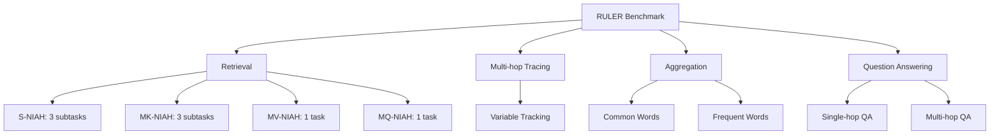

本記事は [https://arxiv.org/abs/2404.06654](https://arxiv.org/abs/2404.06654) の解説記事です。

## 論文概要（Abstract）

RULER（What's the Real Context Size of Your Long-Context Language Models?）は、ロングコンテキストLLMの実効的な処理能力を多面的に評価するための合成ベンチマークである。従来のNeedle-in-a-Haystack（NIAH）テストが「単一の情報を長文から検索する」という表面的な能力しか測定できない問題に対し、RULERは4カテゴリ・13タスクの構成で、検索・マルチホップ推論・集約・質問応答の各能力を系統的に評価する。著者らは17のロングコンテキストLLMを評価し、バニラNIAHではほぼ満点を達成するモデルが、複雑なタスクでは大幅な性能低下を示すことを明らかにした。32K以上のコンテキスト長に対応すると公称するモデルの半数が、実際には32Kで十分な性能を維持できないと報告されている。

この記事は [Zenn記事: ロングコンテキストLLMの精度検証パイプライン：合成テストから本番監視まで](https://zenn.dev/0h_n0/articles/a1267e20486141) の深掘りです。

## 情報源

- **arXiv ID**: 2404.06654
- **URL**: [arXiv:2404.06654](https://arxiv.org/abs/2404.06654)
- **著者**: Cheng-Ping Hsieh, Simeng Sun, Samuel Kriman, Shantanu Acharya, Dima Rekesh, Fei Jia, Yang Zhang, Boris Ginsburg
- **所属**: NVIDIA
- **発表年**: 2024年4月（COLM 2024 採択）
- **分野**: cs.CL

## 背景と動機（Background & Motivation）

### NIAHテストの限界

Needle-in-a-Haystack（NIAH）テストは、長い文脈（haystack）の中に埋め込まれた短い情報（needle）を正確に検索できるかを評価する手法であり、ロングコンテキストLLMの評価において広く採用されてきた。しかし、NIAHには以下の本質的な限界がある。

1. **単一検索のみ**: 1つの情報を1回だけ取り出す能力しか測定しない
2. **推論不要**: 検索した情報に対する推論や統合が求められない
3. **固定的な難易度**: タスク複雑度を柔軟に調整できず、モデル間の差異を検出しにくい
4. **表面的な合格**: ほぼすべてのロングコンテキストLLMがバニラNIAHで満点近い精度を達成してしまう

### 公称コンテキスト長の問題

2024年時点で、多くのLLMが32K〜1Mトークンのコンテキスト長に対応すると公称していた。しかし、「対応する」という主張の実態は曖昧であり、以下の問題が指摘されていた。

- 訓練時にその長さのシーケンスを処理できるだけで、実タスクでの性能は未検証
- ポジションエンコーディングの外挿に依存し、長い入力で精度が劣化する可能性がある
- 実運用で必要な「複数情報の検索」「情報の統合」「推論」などの能力は未評価

著者らはこの問題を「公称コンテキスト長 vs 実効コンテキストサイズ」のギャップとして定式化し、RULERによる定量的な検証を提案した。

### 既存ベンチマークとの比較

| ベンチマーク | 平均長 | データ種別 | 多様性 | 知識非依存 | 制御可能 |
|:---|:---|:---|:---|:---|:---|
| ZeroSCROLLS | 約10K | 実データ | あり | なし | なし |
| L-Eval | 約8K | 実データ | あり | なし | なし |
| LongBench | 約8K | ハイブリッド | あり | なし | なし |
| InfiniteBench | 約200K | ハイブリッド | あり | あり | なし |
| **RULER** | **任意** | **合成** | **あり** | **あり** | **あり** |

RULERの最大の差別化要因は、シーケンス長とタスク複雑度を自由に制御できる点と、合成データによりモデルの事前知識（パラメトリック知識）の影響を排除できる点にある。

## 主要な貢献（Key Contributions）

1. **13タスク・4カテゴリの体系的ベンチマーク**: 検索（Retrieval）、マルチホップトレーシング（Multi-hop Tracing）、集約（Aggregation）、質問応答（Question Answering）の4カテゴリにわたる13のタスクを設計
2. **実効コンテキストサイズの定義**: モデルが基準性能を維持できる最大シーケンス長を「実効コンテキストサイズ」として定量化
3. **17モデルの包括的評価**: クローズドモデル（GPT-4、Gemini-1.5-Pro）とオープンモデル15種を、4K〜128Kの各コンテキスト長で体系的に評価
4. **公称値と実効値のギャップの実証**: 32K+対応を公称する全モデルのうち、半数が32Kで基準性能を維持できないことを実証
5. **非Transformerアーキテクチャの評価**: RWKV-v5やMamba等のSSMベースモデルも評価対象に含め、ロングコンテキスト処理の限界を分析

## 技術的詳細（Technical Details）

### 全体設計



RULERの13タスクは、バニラNIAHの3つの制約（単一needle、単一クエリ、推論不要）を段階的に緩和する形で設計されている。各タスクについて、needle数・クエリ数・必要な推論の種類が異なり、モデルのロングコンテキスト能力を多角的に検証する。

### カテゴリ1: 検索（Retrieval） — 8タスク

#### Single NIAH（S-NIAH）: 3サブタスク

バニラNIAHの直接的な拡張。長い文脈中に埋め込まれた単一のキー・バリューペアを検索する。3つのバリエーションが存在する。

- **S-NIAH-W（Word-Number）**: ランダム単語とランダム数値のペアを、繰り返しノイズテキスト中に配置。最も基本的な検索タスク
- **S-NIAH-E（Essay-Word）**: Paul Grahamのエッセイを文脈として使用し、単語と数値のペアを検索。自然言語テキスト中での検索能力を測定
- **S-NIAH-UUID（Essay-UUID）**: エッセイ中にUUID（32桁の16進文字列）をバリューとして埋め込む。長い文字列の正確な複写能力を同時に評価

#### Multi-Keys NIAH（MK-NIAH）: 3サブタスク

ターゲットneedleに加え、複数のディストラクタneedle（偽のキー・バリューペア）を文脈中に挿入する。モデルはディストラクタを無視し、正しいneedleのみを選択する必要がある。

- **MK-NIAH-W**: ディストラクタ4個を含むノイズテキスト中の検索
- **MK-NIAH-Line**: haystack全体をディストラクタで埋め尽くす行検索バリアント
- **MK-NIAH-UUID**: UUID形式のキー・バリューをディストラクタとともに配置

#### Multi-Values NIAH（MV-NIAH）: 1タスク

同一キーに対して複数のバリュー（デフォルト4個）が関連付けられており、モデルはすべてのバリューを漏れなく検索する必要がある。検索の網羅性（recall completeness）を測定する。

#### Multi-Queries NIAH（MQ-NIAH）: 1タスク

異なるキー・バリューペアが複数存在し、モデルは4つのクエリそれぞれに対応するバリューを同時に返す必要がある。並行検索能力を測定する。

### カテゴリ2: マルチホップトレーシング（Multi-hop Tracing） — 1タスク

#### Variable Tracking（VT）

共参照解決（coreference resolution）を模倣した変数追跡タスク。変数の代入チェーンを通じて、元の値に到達するすべての変数名を特定する。

**タスク例**:

```
X1 = "apple"
X2 = X1
X3 = X2
X4 = X3
X5 = X4
```

この例では、X1〜X5のすべてが"apple"を指しており、モデルは5つの変数名すべてを出力する必要がある。デフォルトではチェーン長4（変数5個）が設定されている。

このタスクは単純な検索では解決できず、代入チェーンを追跡する多段推論が要求される。ディストラクタとして無関係な変数代入文がコンテキスト中に散在する。

### カテゴリ3: 集約（Aggregation） — 2タスク

#### Common Words Extraction（CWE）

コンテキスト全体にわたる頻度集計を要求するタスク。10個の「共通語」がそれぞれ30回出現し、残りの「非共通語」は各3回のみ出現するよう設計されている。モデルは出現頻度上位10語を特定する必要がある。

評価の工夫として、1-shotの例題が付与される。これは、モデルが例題の回答をそのまま複写する「コピー行動」を検出するためである。著者らはYi-34Bにおいて、128Kのコンテキスト長でCWEタスクの出力の80%以上が1-shot例題からの複写であったと報告している。

#### Frequent Words Extraction（FWE）

より現実的な単語頻度分布をモデル化したタスク。単語の出現頻度がZipf則に従うゼータ分布から生成される。

$$f(k) = \frac{k^{-\alpha} \cdot N}{\zeta(\alpha)}$$

ここで、$k$は頻度ランク、$\alpha = 2.0$はゼータ分布のパラメータ、$N$は総単語数、$\zeta(\alpha)$はリーマンゼータ関数である。最も高頻度の単語はノイズとして扱い、モデルは2位〜4位の頻出語3つを特定する必要がある。

CWEが均一頻度の語を検出する能力を測るのに対し、FWEは頻度の微妙な差を識別する能力を測定する。

### カテゴリ4: 質問応答（Question Answering） — 2タスク

#### Single-hop QA

SQuADデータセットをベースとした質問応答タスク。回答を含む「ゴールデンパラグラフ」1つと、回答を含まないディストラクタパラグラフを文脈に配置する。コンテキスト長の増加に伴いディストラクタ数を増やすことで、検索と理解の両方を要求する。

#### Multi-hop QA

HotpotQAデータセットをベースとした多段推論質問応答タスク。回答に必要な情報が複数のゴールデンパラグラフに分散しており、モデルはそれらを統合して推論する必要がある。ディストラクタパラグラフはシーケンス長に比例して増加する。

### 実効コンテキストサイズの定義

著者らは「実効コンテキストサイズ（effective context size）」を以下のように定義している。

> Llama2-7B（chat）の4Kにおける平均スコア85.6%をベースラインとし、あるモデルがこの閾値以上のスコアを維持できる最大のシーケンス長を、そのモデルの実効コンテキストサイズとする。

この定義により、「コンテキスト長Xに対応」という公称値に対して、実際にどの程度の長さまで実用的な性能を維持できるかを定量的に示すことが可能になる。

## 実験結果（Experimental Results）

### 評価対象: 17モデル

| モデル | パラメータ数 | 公称コンテキスト長 | 実効コンテキストサイズ |
|:---|:---|:---|:---|
| Gemini-1.5-Pro | 非公開 | 1M | >128K |
| GPT-4 | 非公開 | 128K | 64K |
| Llama3.1-70B | 70B | 128K | 64K |
| GLM4-9B | 9B | 1M | 64K |
| Llama3.1-8B | 8B | 128K | 32K |
| Qwen2-72B | 72B | 128K | 32K |
| Command-R-plus | 104B | 128K | 32K |
| Yi-34B-200K | 34B | 200K | 32K |
| Mixtral-8x22B | 39B/141B (MoE) | 64K | 32K |
| Phi3-medium-14B | 14B | 128K | 32K |
| GradientAI/Llama3-70B | 70B | 1M | 16K |
| Mistral-v0.2-7B | 7B | 32K | 16K |
| DBRX | 36B/132B (MoE) | 32K | 8K |
| Together-7B | 7B | 32K | 4K |
| LWM-7B | 7B | 1M | <4K |
| LongChat-7B | 7B | 32K | <4K |
| LongAlpaca-13B | 13B | 32K | <4K |

### 全体性能の比較

13タスクの平均スコアにおいて、コンテキスト長の増加に伴う性能推移は以下のとおりである。

| モデル | 4K | 8K | 16K | 32K | 64K | 128K |
|:---|:---|:---|:---|:---|:---|:---|
| Gemini-1.5-Pro | 96.7 | 95.8 | 96.0 | 95.9 | 95.9 | 94.4 |
| GPT-4 | 96.6 | 96.3 | 95.2 | 93.2 | 87.0 | 81.2 |
| Llama3.1-70B | 96.5 | 95.8 | 95.4 | 94.8 | 88.4 | 66.6 |
| Qwen2-72B | 96.9 | 96.1 | 94.9 | 94.1 | 79.8 | 53.7 |
| Yi-34B-200K | 93.3 | 92.2 | 91.3 | 87.5 | 83.2 | 77.3 |
| Mixtral-8x22B | 95.6 | 94.9 | 93.4 | 90.9 | 84.7 | 31.7 |
| Mistral-v0.2-7B | 93.6 | 91.2 | 87.2 | 75.4 | 49.0 | 13.8 |
| LongAlpaca-13B | 60.6 | 57.0 | 56.6 | 43.6 | 0.0 | 0.0 |

Gemini-1.5-Proが唯一128Kまでスコア94%以上を維持しており、他のモデルを大きく引き離している。GPT-4とLlama3.1-70Bは64Kまでは比較的高い性能を保つが、128Kで顕著な劣化が観察される。

### カテゴリ別の分析

#### 検索タスクの結果

検索タスク（8タスク平均）では、多くのモデルが短いコンテキスト長で高い性能を示すが、コンテキスト長の増加に伴い差が拡大する。

| モデル | 4K | 32K | 128K |
|:---|:---|:---|:---|
| Gemini-1.5-Pro | 99.8 | 99.7 | 99.6 |
| GPT-4 | 99.9 | 98.3 | 84.8 |
| Llama3.1-70B | 100.0 | 99.6 | 78.9 |
| Yi-34B-200K | 98.2 | 95.1 | 90.2 |

#### マルチホップトレーシングの結果

Variable Trackingタスクでは、多段推論を要求するため、性能劣化がより顕著になる。

| モデル | 4K | 32K | 128K |
|:---|:---|:---|:---|
| Gemini-1.5-Pro | 100.0 | 100.0 | 100.0 |
| GPT-4 | 100.0 | 100.0 | 100.0 |
| Qwen2-72B | 100.0 | 100.0 | 56.4 |
| Yi-34B-200K | 99.8 | 94.5 | 76.8 |

GPT-4とGemini-1.5-Proは128Kでも100%を維持する一方、Qwen2-72Bは128Kで急激に56.4%まで低下している。

#### 集約タスクの結果

集約タスク（CWE/FWE平均）は、コンテキスト全体を走査して情報を統合する必要があるため、最も困難なカテゴリの1つである。

| モデル | 4K | 32K | 128K |
|:---|:---|:---|:---|
| Gemini-1.5-Pro | 97.7 | 98.6 | 90.9 |
| GPT-4 | 99.0 | 95.0 | 79.7 |
| Yi-34B-200K | 91.4 | 75.3 | 43.4 |

Yi-34B-200Kは公称200Kのコンテキスト長に対し、集約タスクでは128Kで43.4%まで低下しており、実用上の大きな課題が示されている。

#### 質問応答の結果

QAタスク（SQuAD/HotpotQA平均）は、モデルのパラメトリック知識と検索能力の両方が影響するため、全体的にスコアが低い傾向がある。

| モデル | 4K | 32K | 128K |
|:---|:---|:---|:---|
| Gemini-1.5-Pro | 81.9 | 75.9 | 74.1 |
| GPT-4 | 79.0 | 68.0 | 59.0 |
| Yi-34B-200K | 72.7 | 66.2 | 59.9 |

### Yi-34B-200K の詳細エラー分析

著者らはYi-34B-200K（公称200K対応）について詳細なエラー分析を行い、以下のパターンを特定している。

1. **Needle種別への感受性**: 単語-数値ペアの検索はほぼ完璧だが、UUID（32桁文字列）の検索では最大の精度劣化が観察された
2. **ディストラクタによる性能低下**: ディストラクタneedle数の増加により、256Kで約40ポイントの精度低下が発生
3. **不完全な検索**: 複数バリューの検索において、すべてのバリューを返すことができず、重複回答が頻発
4. **コピー行動**: CWEタスクの128Kにおいて、出力の80%以上が1-shot例題からの単純な複写であった
5. **QAでの幻覚**: ディストラクタパラグラフの増加に伴い、回答精度がコンテキストなしのベースラインに近づく

### 追加分析: 訓練コンテキスト長の影響

LWMシリーズ（7Bパラメータ固定、訓練コンテキスト長32K/128K/256K/512K/1M）を用いた分析では、以下が報告されている。

- 訓練コンテキスト長が大きいほど全般的に性能が向上する
- ただし、LWM-1MがLWM-512Kより256Kで劣る場合があり、ランキングは一貫しない
- 訓練時のコンテキスト長を超えた外挿では急激な性能低下が発生する
- 訓練コンテキスト長内では、対数スケールでほぼ線形の性能劣化が観察される

### 追加分析: モデルサイズの影響

Yiシリーズ（200K訓練、パラメータ数6B/9B/34B）を用いた分析では、パラメータ数が大きいモデルほど4Kでの基本性能が高く、かつコンテキスト長増加に伴う性能劣化の度合いも小さいことが確認されている。

### 追加分析: 非Transformerアーキテクチャ

RWKV-v5およびMamba-2.8Bを評価した結果、いずれも8Kへの拡張で顕著な性能劣化を示し、Transformerベースのベースライン（Llama2-7B）を大幅に下回ることが報告されている。著者らは、SSMベースのアーキテクチャにおけるロングコンテキスト処理は、2024年時点では限定的であると結論づけている。

## 実装のポイント（Implementation Guide）

### RULERのカスタムテスト構築

RULERはオープンソースで公開されており、独自のモデル評価やカスタムタスクの追加が可能である。以下に、評価パイプライン構築の要点を示す。

#### タスクパラメータの設定

RULERの各タスクは、以下のパラメータで難易度を制御できる。

```python
from dataclasses import dataclass
from typing import Literal

@dataclass
class RulerTaskConfig:
    """RULERタスクの設定パラメータ."""

    task_type: Literal[
        "s_niah", "mk_niah", "mv_niah", "mq_niah",
        "vt", "cwe", "fwe", "qa_single", "qa_multi"
    ]
    context_length: int  # 4096, 8192, 16384, 32768, 65536, 131072
    num_needles: int = 1  # needle数（MK-NIAH, MV-NIAH用）
    num_queries: int = 1  # クエリ数（MQ-NIAH用）
    num_hops: int = 4  # チェーン長（VT用）
    num_examples: int = 500  # 評価インスタンス数
    distractor_ratio: float = 0.75  # ディストラクタの割合
```

#### 評価メトリクスの設計

RULERでは、タスクごとに異なる評価基準が適用される。

```python
def evaluate_ruler_task(
    predictions: list[str],
    references: list[list[str]],
    task_type: str,
) -> float:
    """RULERタスクの評価関数.

    Args:
        predictions: モデルの出力リスト
        references: 正解リスト（1インスタンスに複数正解あり）
        task_type: タスク種別

    Returns:
        正解率（0.0〜1.0）
    """
    correct = 0
    for pred, refs in zip(predictions, references):
        if task_type in ("mv_niah", "mq_niah", "vt", "cwe", "fwe"):
            # 複数回答タスク: すべての正解が含まれるか
            if all(ref.lower() in pred.lower() for ref in refs):
                correct += 1
        else:
            # 単一回答タスク: 正解のいずれかが含まれるか
            if any(ref.lower() in pred.lower() for ref in refs):
                correct += 1
    return correct / len(predictions)
```

#### 実効コンテキストサイズの計算

```python
def compute_effective_context_size(
    scores: dict[int, float],
    baseline_threshold: float = 85.6,
) -> int | str:
    """実効コンテキストサイズを計算する.

    Args:
        scores: {コンテキスト長: 平均スコア} の辞書
        baseline_threshold: Llama2-7B 4Kベースライン（85.6%）

    Returns:
        実効コンテキストサイズ（閾値を超える最大長）
    """
    sorted_lengths = sorted(scores.keys())
    effective_size = "<4K"
    for length in sorted_lengths:
        if scores[length] >= baseline_threshold:
            effective_size = f"{length // 1024}K"
        else:
            break
    return effective_size
```

### 自社モデル評価のベストプラクティス

1. **ベースラインの確立**: まずバニラNIAHで基本的な検索能力を確認し、次にRULERの全13タスクで多面的に評価する
2. **段階的なコンテキスト長テスト**: 4K → 8K → 16K → 32K → 64K → 128Kと段階的に評価し、性能低下の閾値を特定する
3. **カテゴリ別の分析**: 検索・推論・集約・QAのカテゴリ別にスコアを分析し、モデルの弱点を特定する
4. **タスク複雑度のスイープ**: needle数、クエリ数、チェーン長などのパラメータを変えて、限界を探索する

## 実運用への応用（Practical Applications）

### モデル選定ガイドライン

RULERの結果に基づき、ユースケースごとのモデル選定指針を以下に示す。

#### ユースケース別の推奨

| ユースケース | 必要な能力 | RULERカテゴリ | 推奨モデル群（2024年時点） |
|:---|:---|:---|:---|
| 文書検索・RAG | 単一/複数情報検索 | Retrieval | 64K以下: GPT-4, Llama3.1-70B |
| コード解析 | 変数追跡・依存関係解析 | Multi-hop | Gemini-1.5-Pro, GPT-4 |
| 文書要約 | 全文走査・情報統合 | Aggregation | Gemini-1.5-Pro |
| 複合質問応答 | 検索+推論 | QA | Gemini-1.5-Pro, GPT-4 |

#### 実効コンテキスト長の活用

モデル選定時に公称コンテキスト長ではなくRULERによる実効コンテキストサイズを使用することで、以下のリスクを回避できる。

- **過信によるチャンキング不足**: 公称128Kのモデルに128Kの入力を与えた場合、実効32Kのモデルでは後半の情報が事実上無視される可能性がある
- **コスト最適化の誤り**: 不必要に長いコンテキストを入力することで、API費用が増加する一方で性能は改善しない
- **品質劣化の未検出**: 長い入力に対するモデルの回答品質が、ベンチマーク未実施のため把握できない

### 継続的な品質モニタリングへの組み込み

RULERの合成タスクは自動生成が可能であるため、本番環境でのモデル品質モニタリングに組み込むことが可能である。モデルのバージョンアップ時やファインチューニング後に定期的にRULERを実行し、ロングコンテキスト性能の回帰を検出する運用が推奨される。

## 関連研究（Related Work）

### NIAH系ベンチマーク

- **Passkey Retrieval** (Mohtashami & Jaggi, 2023): 長い文脈中に埋め込まれた5桁のパスキーを検索するタスク。RULERにおけるS-NIAHの原型
- **Vanilla NIAH** (Kamradt, 2023): Greg Kamradtが提案した、ポール・グレアムのエッセイ中に情報を埋め込む手法。広く普及したが、前述の限界がある
- **Line/KV Retrieval** (Liu et al., 2024; Li et al., 2023): RULERのMK-NIAHに対応するバリエーション

### 包括的ロングコンテキストベンチマーク

- **HELMET** (Yen et al., 2024): 実タスクベースのロングコンテキスト評価。RULERが合成タスクに特化するのに対し、HELMETは実データでの評価を重視
- **InfiniteBench** (Zhang et al., 2024): 200K以上の超長コンテキスト評価。RULERと相補的な関係にある
- **LongBench** (Bai et al., 2023): ハイブリッド型（合成+実データ）のベンチマーク。平均8K程度と比較的短い

### ロングコンテキスト拡張技術

RULERの結果は、以下のロングコンテキスト拡張技術の有効性検証にも活用されている。

- **RoPE拡張**: YaRN、NTK-aware RoPEなどのポジションエンコーディング拡張
- **継続事前学習**: LongAlpaca、LWMなどの長いシーケンスでの追加訓練
- **アーキテクチャ変更**: SSMベース（Mamba, RWKV）のTransformer代替

## まとめと今後の展望

### 本論文の意義

RULERは、ロングコンテキストLLMの評価において以下の転換点を示した研究である。

1. **NIAHの限界の定量的実証**: バニラNIAHでほぼ満点を取るモデルが、複雑なタスクでは大幅に性能低下することを13タスクで体系的に示した
2. **実効コンテキストサイズの概念確立**: 公称値に代わる実用的な指標として、実効コンテキストサイズを定義・計測する方法論を確立した
3. **合成ベンチマークの優位性**: 制御可能でパラメトリック知識非依存な合成タスクが、ロングコンテキスト能力の純粋な評価に適していることを示した

### 今後の研究方向

- **タスクカテゴリの拡張**: RULERが対象としない数値推論、時系列理解、マルチモーダル入力などへの拡張
- **動的難易度調整**: タスクの複雑度を適応的に変化させ、モデルの限界をより効率的に探索する手法
- **実タスクとの相関分析**: RULERスコアと実際のダウンストリームタスク性能の相関をより詳細に検証
- **非Transformerアーキテクチャの進化**: Mamba-2やJambaなどの新しいSSM/ハイブリッドアーキテクチャのロングコンテキスト性能検証

RULERのコードはオープンソースで公開されており、研究者や実務者が自身のモデル評価に活用できる。ロングコンテキストLLMの真の能力を把握するうえで、公称スペックに頼らず、RULERのような多面的ベンチマークで検証することの重要性は、今後ますます高まるものと考えられる。

## 参考文献

1. Hsieh, C.-P., Sun, S., Kriman, S., Acharya, S., Rekesh, D., Jia, F., Zhang, Y., & Ginsburg, B. (2024). RULER: What's the Real Context Size of Your Long-Context Language Models? *arXiv:2404.06654*. [https://arxiv.org/abs/2404.06654](https://arxiv.org/abs/2404.06654)
2. Kamradt, G. (2023). Needle in a Haystack - Pressure Testing LLMs. [https://github.com/gkamradt/LLMTest_NeedleInAHaystack](https://github.com/gkamradt/LLMTest_NeedleInAHaystack)
3. Mohtashami, A., & Jaggi, M. (2023). Landmark Attention: Random-Access Infinite Context Length for Transformers. *arXiv:2305.16300*.
4. Yen, H., Gao, T., Hou, M., Ding, K., Fleischer, D., Izsak, P., Wasserblat, M., & Chen, D. (2024). HELMET: How to Evaluate Long-Context Language Models Effectively and Thoroughly. *arXiv:2410.02694*.
5. Zhang, X., Chen, Y., Hu, S., Xu, Q., Chen, J., Hao, M., Han, X., Thai, S., Wang, S., & Liu, Z. (2024). InfiniteBench: Extending Long Context Evaluation Beyond 100K Tokens. *arXiv:2402.13718*.
6. Bai, Y., Lv, X., Zhang, J., Lyu, H., Tang, J., Huang, Z., Du, Z., Liu, X., Zeng, A., Hou, L., Dong, Y., Tang, J., & Li, J. (2023). LongBench: A Bilingual, Multitask Benchmark for Long Context Understanding. *arXiv:2308.14508*.
7. Liu, N. F., Lin, K., Hewitt, J., Paranjape, A., Bevilacqua, M., Petroni, F., & Liang, P. (2024). Lost in the Middle: How Language Models Use Long Contexts. *Transactions of the ACL*.
8. Li, D., Shao, R., Xie, A., Sheng, Y., Zheng, L., Gonzalez, J. E., Stoica, I., Ma, X., & Zhang, H. (2023). How Long Can Open-Source LLMs Truly Promise on Context Length? *arXiv:2306.15595*.
