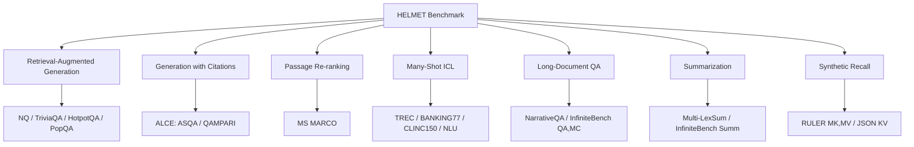
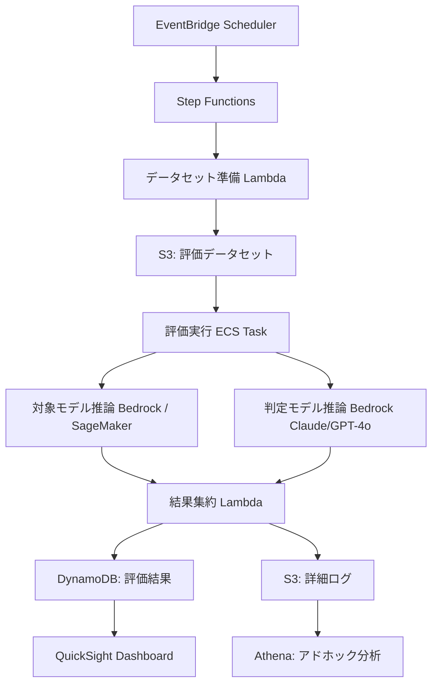

本記事は [https://arxiv.org/abs/2410.02694](https://arxiv.org/abs/2410.02694) の解説記事です。

## 論文概要（Abstract）

HELMETは、ロングコンテキスト言語モデル（LCLM）を包括的に評価するためのベンチマークである。既存の評価手法がNeedleIn A Haystack（NIAH）等の合成タスクや限定的なタスクサブセットに依存しており、実用タスクへの予測力が低いという問題に対して、著者らは7つのアプリケーション指向カテゴリを設計した。128Kトークンまでの制御可能なコンテキスト長、GPT-4oベースのモデル評価、few-shot promptingによるバイアス低減を導入し、59のLCLMを体系的に評価している。

この記事は [Zenn記事: ロングコンテキストLLMの精度検証パイプライン：合成テストから本番監視まで](https://zenn.dev/0h_n0/articles/a1267e20486141) の深掘りです。

## 情報源

- **arXiv ID**: 2410.02694
- **URL**: [arXiv:2410.02694](https://arxiv.org/abs/2410.02694)
- **著者**: Howard Yen, Tianyu Gao, Minmin Hou, Ke Ding, Daniel Fleischer, Peter Izsak, Moshe Wasserblat, Danqi Chen
- **発表年**: 2024年10月（ICLR 2025 採択）
- **分野**: cs.CL（Computation and Language）
- **GitHub**: [princeton-nlp/HELMET](https://github.com/princeton-nlp/HELMET)

## 背景と動機（Background & Motivation）

ロングコンテキスト言語モデル（LCLM）は急速に発展し、128K〜1Mトークンのコンテキストウィンドウを持つモデルが登場している。しかし、これらのモデルの評価方法には大きな課題がある。

**既存評価の問題点:**

1. **合成タスクへの偏重**: NIAHやRULERなどの合成タスクは実装が容易だが、実用タスクとの相関が低い。著者らは35のinstruction-tunedモデルでSpearman順位相関を計測し、NIAH系タスクと下流タスクの平均相関がρ < 0.8であることを示している（論文Table 3より）。
2. **評価信頼性の問題**: 既存ベンチマーク（LongBench、SCROLLS等）はコンテキスト長の制御が不十分であり、モデル間のフェアな比較が困難である。
3. **スコアリングの不安定性**: 文字列一致ベースの評価（F1、Exact Match）はLLMの多様な出力形式に対応できず、正しい回答を不当に低評価する場合がある。

HELMETはこれらのギャップを埋めるべく、実用的なアプリケーションに基づく7カテゴリを定義し、制御された条件下でLCLMを評価するフレームワークとして設計されている。

## 主要な貢献（Key Contributions）

- **7つのアプリケーション指向タスクカテゴリ**: RAG、引用付き生成、パッセージリランキング、many-shot ICL、長文書QA、要約、合成タスクの包括的カバレッジ
- **制御可能なコンテキスト長**: 各タスクで入力長を4K〜128Kトークンに段階的に調整する仕組みを実装
- **モデルベース評価の標準化**: GPT-4oを判定モデルとして使用し、文字列一致ベースの評価に比べて安定した結果を実現
- **59モデルの体系的ベンチマーク**: オープンソース・クローズドソースの双方を含む大規模な比較分析
- **タスク間相関分析**: 合成タスクが下流タスク性能の代替指標として不十分であることを実証

## 技術的詳細（Technical Details）

### 7つのタスクカテゴリの設計



#### 1. Retrieval-Augmented Generation（RAG）

Natural Questions、TriviaQA、HotpotQA、PopQAの4データセットを使用する。Gold passage（正解を含むパッセージ）をdistractor（無関係なパッセージ）の中に配置し、コンテキスト長を制御する。distractorの数を調整することで4K〜128Kの入力長を実現している。評価はモデルベースのCorrectness判定（0-3スケール）で行う。

#### 2. Generation with Citations（Cite）

ALCE（Attributed Language and Comprehension Evaluation）ベンチマークからASQAとQAMPARIを採用する。モデルは回答文に対して適切な引用を付与する必要があり、引用の正確性（citation precision/recall）と回答の正しさの両方を評価する。

#### 3. Passage Re-ranking（Re-rank）

MS MARCOデータセットを使用し、与えられたクエリに対してパッセージの関連度順序付けを行う。NDCG@10（Normalized Discounted Cumulative Gain at 10）で評価する。著者らはlistwise re-rankingプロンプトを採用しており、モデルはパッセージIDのランキングリストを出力する。

#### 4. Many-Shot In-Context Learning（ICL）

TREC-coarse（6クラス）、TREC-fine（50クラス）、BANKING77（77クラス）、CLINC150（150クラス）、NLU（68クラス）の5つの分類タスクを使用する。ラベルを数字にマッピングし、モデルが新しいタスクを学習する能力を評価する。ラベルの意味が推測できないようにすることで、純粋なfew-shot学習能力を測定している。

#### 5. Long-Document QA（LongQA）

NarrativeQAと∞Bench（InfiniteBench）のQA・MCタスクを含む。NarrativeQAでは書籍全体（最大518Kトークン）に基づく質問応答を行い、∞BenchのMCタスクでは長文の多肢選択問題に回答する。

#### 6. Summarization（Summ）

Multi-LexSumと∞Bench要約タスクを使用する。150Kトークンを超える長文の要約能力を評価し、モデルベースのatomic claims分解（後述）で精度を測定する。

#### 7. Synthetic Recall

RULERのMulti-Key Needle（MK）、Multi-Value（MV）、およびJSON KVタスクを採用する。NIAHより紛らわしいコンテキストを使用し、合成検索能力をより厳密に評価する。

### モデルベース評価の数式

HELMETでは、GPT-4oを判定モデルとして使用する2種類の評価スキームを導入している。

#### QA評価スキーム

GPT-4oが生成された回答を以下の2軸で評価する:

$$
\text{Fluency}(a) \in \{0, 1\}
$$

$$
\text{Correctness}(a, r) \in \{0, 1, 2, 3\}
$$

ここで $a$ はモデルの回答、$r$ は参照回答（gold answer）である。最終スコアは以下の式で算出する:

$$
\text{Score}_{\text{QA}} = \frac{\text{Fluency}(a) \times \text{Correctness}(a, r)}{3} \times 100
$$

Fluencyは回答の流暢性（文法的に正しく、質問に対応しているか）を判定し、Correctnessは参照回答との意味的一致度を4段階で評価する。Fluency = 0の場合、Correctnessに関わらずスコアは0になる。

#### 要約評価スキーム

要約タスクでは、より精緻なatomic claims分解ベースの評価を行う。

**Step 1**: 参照要約を原子的主張（atomic claims）のリストに分解する。

$$
R = \{c_1, c_2, \ldots, c_n\}
$$

**Step 2**: 生成された要約がカバーするatomic claimsを判定し、recall/precisionを算出する。

$$
\text{Recall} = \frac{|\{c_i \in R \mid c_i \text{ is covered by } a\}|}{|R|}
$$

$$
\text{Precision} = \frac{|\{c_i \in R \mid c_i \text{ is covered by } a\}|}{|\text{claims in } a|}
$$

**Step 3**: F1スコアとfluencyを組み合わせる。

$$
\text{Score}_{\text{Summ}} = F_1(\text{Recall}, \text{Precision}) \times \text{Fluency}(a)
$$

著者らは、このモデルベース評価が文字列一致ベースの評価（F1、EM）と比較して、人間の判定との相関が高いことを検証している。

## 実装のポイント（Implementation Notes）

### コンテキスト長の制御

HELMETの実装（[GitHub: princeton-nlp/HELMET](https://github.com/princeton-nlp/HELMET)）では、各タスクでコンテキスト長を制御するために以下の方法を採用している。

1. **RAG/Re-rank**: distractorパッセージの数を調整してターゲット長に到達させる。distractorはContriever-MSMARCOで検索した上位パッセージとランダムパッセージを混合する。
2. **ICL**: デモンストレーション事例の数を増やしてコンテキスト長を拡張する。
3. **LongQA/Summ**: 元の文書が十分長い（128K超）ものを使用し、必要に応じて切断する。
4. **Synthetic**: フィラーテキストの量を調整する。

### Few-Shot Promptingによるバイアス低減

著者らは、zero-shot設定では多くのモデルがJSON出力等の特定フォーマットに失敗することを確認し、2-shot few-shot promptingを標準採用している。これにより出力フォーマットの不一致による評価バイアスを低減している。

### 評価コストの考慮

GPT-4oベースの評価は高精度だがコストが発生する。著者らは1回の完全評価（59モデル x 7カテゴリ x 複数長さ）の評価コストについて、GPT-4o APIの料金を考慮した設計としている。高速開発ではRAGタスクのみの部分評価を推奨している。

## Production Deployment Guide

### HELMETベースLLM評価パイプラインのAWS実装

HELMETの評価手法を社内LLM評価パイプラインとしてAWSに構築する場合の推奨構成を示す。評価対象モデルの切り替えやコンテキスト長の段階的テストを自動化し、継続的な品質モニタリングを実現する。

#### AWS構成パターン

| 規模 | 評価頻度 | 推奨構成 | 月額コスト | 主要サービス |
|------|---------|---------|-----------|-------------|
| **Small** | 週次・3モデル以下 | Serverless | $150-400 | Lambda + Bedrock + DynamoDB |
| **Medium** | 日次・10モデル以下 | Hybrid | $800-2,500 | ECS Fargate + Bedrock + Aurora Serverless |
| **Large** | 常時・20モデル以上 | Container | $4,000-12,000 | EKS + Karpenter + SageMaker Endpoints |

**コスト試算の注意事項**: 上記は2026年8月時点のAWS ap-northeast-1リージョン料金に基づく概算値です。LLM推論コスト（Bedrock / SageMaker）がTotal Costの60-80%を占めます。最新料金は [AWS料金計算ツール](https://calculator.aws/) で確認してください。

#### 評価パイプラインアーキテクチャ



#### Terraformインフラコード（Small構成）

```hcl
# --- Step Functions State Machine ---
resource "aws_sfn_state_machine" "helmet_eval_pipeline" {
  name     = "helmet-eval-pipeline"
  role_arn = aws_iam_role.sfn_role.arn

  definition = jsonencode({
    StartAt = "PrepareDatasets"
    States = {
      PrepareDatasets = {
        Type     = "Task"
        Resource = aws_lambda_function.prepare_datasets.arn
        Next     = "RunEvaluation"
      }
      RunEvaluation = {
        Type     = "Task"
        Resource = aws_lambda_function.run_evaluation.arn
        TimeoutSeconds = 900
        Retry = [{
          ErrorEquals     = ["States.TaskFailed"]
          IntervalSeconds = 30
          MaxAttempts     = 2
          BackoffRate     = 2.0
        }]
        Next = "AggregateResults"
      }
      AggregateResults = {
        Type     = "Task"
        Resource = aws_lambda_function.aggregate_results.arn
        End      = true
      }
    }
  })
}

# --- DynamoDB: 評価結果ストア ---
resource "aws_dynamodb_table" "eval_results" {
  name         = "helmet-eval-results"
  billing_mode = "PAY_PER_REQUEST"
  hash_key     = "model_id"
  range_key    = "eval_timestamp"

  attribute {
    name = "model_id"
    type = "S"
  }

  attribute {
    name = "eval_timestamp"
    type = "S"
  }

  attribute {
    name = "task_category"
    type = "S"
  }

  global_secondary_index {
    name            = "task-category-index"
    hash_key        = "task_category"
    range_key       = "eval_timestamp"
    projection_type = "ALL"
  }

  ttl {
    attribute_name = "expire_at"
    enabled        = true
  }
}

# --- S3: 評価データセット・ログ ---
resource "aws_s3_bucket" "eval_data" {
  bucket = "helmet-eval-data-${data.aws_caller_identity.current.account_id}"
}

resource "aws_s3_bucket_lifecycle_configuration" "eval_data_lifecycle" {
  bucket = aws_s3_bucket.eval_data.id

  rule {
    id     = "archive-old-logs"
    status = "Enabled"

    transition {
      days          = 30
      storage_class = "INTELLIGENT_TIERING"
    }

    expiration {
      days = 365
    }

    filter {
      prefix = "logs/"
    }
  }
}

# --- Lambda: データセット準備 ---
resource "aws_lambda_function" "prepare_datasets" {
  function_name = "helmet-prepare-datasets"
  runtime       = "python3.12"
  handler       = "handler.prepare"
  timeout       = 300
  memory_size   = 1024

  environment {
    variables = {
      EVAL_BUCKET    = aws_s3_bucket.eval_data.id
      RESULTS_TABLE  = aws_dynamodb_table.eval_results.name
    }
  }

  filename = data.archive_file.prepare_datasets.output_path
  role     = aws_iam_role.lambda_role.arn
}

# --- Lambda: 評価実行 ---
resource "aws_lambda_function" "run_evaluation" {
  function_name = "helmet-run-evaluation"
  runtime       = "python3.12"
  handler       = "handler.evaluate"
  timeout       = 900
  memory_size   = 3008

  environment {
    variables = {
      BEDROCK_MODEL_ID  = "anthropic.claude-sonnet-4-20250514"
      JUDGE_MODEL_ID    = "anthropic.claude-sonnet-4-20250514"
      EVAL_BUCKET       = aws_s3_bucket.eval_data.id
      RESULTS_TABLE     = aws_dynamodb_table.eval_results.name
    }
  }

  filename = data.archive_file.run_evaluation.output_path
  role     = aws_iam_role.lambda_role.arn
}
```

#### Terraformインフラコード（Large構成: EKS + Karpenter）

```hcl
# --- EKS Cluster ---
module "eks" {
  source  = "terraform-aws-modules/eks/aws"
  version = "~> 20.0"

  cluster_name    = "helmet-eval-cluster"
  cluster_version = "1.31"

  vpc_id     = module.vpc.vpc_id
  subnet_ids = module.vpc.private_subnets

  cluster_addons = {
    karpenter = { most_recent = true }
  }

  eks_managed_node_groups = {
    system = {
      instance_types = ["m7i.large"]
      min_size       = 2
      max_size       = 4
      desired_size   = 2
    }
  }
}

# --- Karpenter NodePool for evaluation workloads ---
resource "kubectl_manifest" "karpenter_nodepool" {
  yaml_body = yamlencode({
    apiVersion = "karpenter.sh/v1"
    kind       = "NodePool"
    metadata   = { name = "eval-workers" }
    spec = {
      template = {
        spec = {
          requirements = [
            { key = "karpenter.sh/capacity-type", operator = "In", values = ["spot", "on-demand"] },
            { key = "node.kubernetes.io/instance-type", operator = "In", values = ["m7i.xlarge", "m7i.2xlarge", "c7i.2xlarge"] }
          ]
          nodeClassRef = { name = "default" }
        }
      }
      limits   = { cpu = "128", memory = "512Gi" }
      disruption = {
        consolidationPolicy = "WhenEmpty"
        consolidateAfter    = "30s"
      }
    }
  })
}

# --- Kubernetes Job Template for Evaluation ---
resource "kubectl_manifest" "eval_job_template" {
  yaml_body = yamlencode({
    apiVersion = "batch/v1"
    kind       = "Job"
    metadata = {
      name      = "helmet-eval-batch"
      namespace = "evaluation"
    }
    spec = {
      parallelism = 8
      completions = 8
      template = {
        spec = {
          containers = [{
            name  = "evaluator"
            image = "${aws_ecr_repository.evaluator.repository_url}:latest"
            resources = {
              requests = { cpu = "2", memory = "8Gi" }
              limits   = { cpu = "4", memory = "16Gi" }
            }
            env = [
              { name = "TASK_CATEGORY", valueFrom = { fieldRef = { fieldPath = "metadata.annotations['helmet/task-category']" } } },
              { name = "CONTEXT_LENGTH", value = "128000" },
              { name = "BEDROCK_REGION", value = "ap-northeast-1" }
            ]
          }]
          restartPolicy = "OnFailure"
          nodeSelector  = { "karpenter.sh/nodepool" = "eval-workers" }
        }
      }
    }
  })
}
```

#### 運用・監視設定

```hcl
# --- CloudWatch Alarm: 評価ジョブ失敗率 ---
resource "aws_cloudwatch_metric_alarm" "eval_failure_rate" {
  alarm_name          = "helmet-eval-failure-rate"
  comparison_operator = "GreaterThanThreshold"
  evaluation_periods  = 1
  threshold           = 20

  metric_query {
    id          = "failure_rate"
    expression  = "(failed / total) * 100"
    label       = "Failure Rate %"
    return_data = true
  }

  metric_query {
    id = "failed"
    metric {
      metric_name = "EvalJobFailed"
      namespace   = "HELMET/Pipeline"
      period      = 3600
      stat        = "Sum"
    }
  }

  metric_query {
    id = "total"
    metric {
      metric_name = "EvalJobTotal"
      namespace   = "HELMET/Pipeline"
      period      = 3600
      stat        = "Sum"
    }
  }

  alarm_actions = [aws_sns_topic.alerts.arn]
}

# --- CloudWatch Dashboard ---
resource "aws_cloudwatch_dashboard" "helmet_eval" {
  dashboard_name = "helmet-eval-overview"
  dashboard_body = jsonencode({
    widgets = [
      {
        type   = "metric"
        x = 0, y = 0, width = 12, height = 6
        properties = {
          title   = "Model Scores by Task Category"
          metrics = [
            ["HELMET/Pipeline", "AvgScore", "TaskCategory", "RAG"],
            ["HELMET/Pipeline", "AvgScore", "TaskCategory", "Cite"],
            ["HELMET/Pipeline", "AvgScore", "TaskCategory", "Re-rank"],
            ["HELMET/Pipeline", "AvgScore", "TaskCategory", "ICL"],
            ["HELMET/Pipeline", "AvgScore", "TaskCategory", "LongQA"],
            ["HELMET/Pipeline", "AvgScore", "TaskCategory", "Summ"],
            ["HELMET/Pipeline", "AvgScore", "TaskCategory", "Synthetic"]
          ]
          period = 86400
          stat   = "Average"
        }
      },
      {
        type   = "metric"
        x = 12, y = 0, width = 12, height = 6
        properties = {
          title   = "Evaluation Latency (p50/p99)"
          metrics = [
            ["HELMET/Pipeline", "EvalLatency", "Percentile", "p50"],
            ["HELMET/Pipeline", "EvalLatency", "Percentile", "p99"]
          ]
          period = 3600
          stat   = "Average"
        }
      },
      {
        type   = "metric"
        x = 0, y = 6, width = 24, height = 6
        properties = {
          title   = "Daily Evaluation Cost"
          metrics = [["HELMET/Pipeline", "EstimatedCostUSD"]]
          period  = 86400
          stat    = "Sum"
        }
      }
    ]
  })
}

# --- X-Ray Tracing ---
resource "aws_xray_sampling_rule" "helmet_eval" {
  rule_name      = "helmet-eval-tracing"
  priority       = 1000
  reservoir_size = 10
  fixed_rate     = 0.1
  host           = "*"
  http_method    = "*"
  url_path       = "*"
  service_name   = "helmet-eval-*"
  service_type   = "*"
  resource_arn   = "*"
  version        = 1
}
```

#### コスト最適化チェックリスト

**推論コスト（最重要: 全体の60-80%）:**

- [ ] Bedrock: batch推論API（非同期）で単価を最大50%削減
- [ ] SageMaker: Spot Instancesでエンドポイントコストを最大70%削減
- [ ] 判定モデル: Claude Sonnet等の軽量モデルで十分な場合はGPT-4o以外も検討
- [ ] プロンプトキャッシュ: 同一system prompt部分をキャッシュして入力トークンコストを削減
- [ ] コンテキスト長の段階的テスト: まず短い長さ（4K, 8K）で差が出ないモデルをフィルタし、128Kテストの対象を絞る

**コンピュート:**

- [ ] Lambda: メモリサイズの最適化（AWS Lambda Power Tuning で計測）
- [ ] ECS/EKS: Spot Instancesの活用（中断耐性のあるバッチ処理に適合）
- [ ] Karpenter: consolidationPolicyでアイドルノードを自動縮退
- [ ] EventBridge: 評価スケジュールをオフピーク時間帯に設定

**ストレージ:**

- [ ] S3: Intelligent-Tieringで低頻度アクセスの評価ログを自動階層化
- [ ] DynamoDB: TTLで古い評価結果を自動削除（保持期間: 90日推奨）
- [ ] ECR: ライフサイクルポリシーで古いイメージを自動削除

**ネットワーク:**

- [ ] VPCエンドポイント: S3、DynamoDB、Bedrock用のゲートウェイ/インターフェースエンドポイントでNATコストを削減
- [ ] 同一リージョンでBedrock/SageMakerと評価ワーカーを配置

**監視:**

- [ ] CloudWatch: カスタムメトリクスの粒度を1分→5分に調整（コスト削減）
- [ ] Cost Explorer: 日次コストアラートを設定（閾値: 想定月額の110%）
- [ ] X-Ray: サンプリングレートを本番環境では10%以下に設定
- [ ] CloudWatch Logs: ログ保持期間を30日に設定

**セキュリティベストプラクティス:**

- [ ] IAMロール: 最小権限の原則（Bedrock InvokeModel、S3 GetObject/PutObject のみ）
- [ ] KMS: DynamoDB・S3の暗号化にカスタマーマネージドキーを使用
- [ ] VPC: 評価ワーカーをプライベートサブネットに配置
- [ ] Secrets Manager: APIキー・外部サービス認証情報の管理
- [ ] CloudTrail: Bedrock API呼び出しの監査ログを有効化
- [ ] GuardDuty: 異常なAPI呼び出しパターンの検知

## 実験結果（Experimental Results）

### 主要な発見

著者らは59のLCLMを対象に、7カテゴリの評価を実施した。以下に主要な結果を示す。

**全体ランキング（論文Table 1, Figure 3より）:**
- GPT-4o-08-06とGemini-1.5-Proが全体的に上位に位置している
- Citation generation（引用付き生成）とRe-ranking（パッセージリランキング）では、closed-sourceモデルとopen-sourceモデルの間に30-40ポイントの差が見られると報告されている

**合成タスクと下流タスクの相関（論文Table 3, Figure 4より）:**
- 35のinstruction-tunedモデルでSpearman順位相関を計測した結果、NIAH系合成タスクと下流タスクの相関は平均ρ < 0.8であった
- RAGタスクが下流タスク性能の最良proxyであり、他のタスクカテゴリとの相関が最も高い
- Gemini-1.5-FlashがGemini-1.5-Proを一部のRULER合成タスクで上回る結果が観測され、合成タスクの評価信頼性に疑問を投げかけている

**コンテキスト長の影響（論文Figure 5より）:**
- 多くのモデルで16K〜32Kトークンを超えるとスコアが低下する傾向が確認されている
- 要約タスクではコンテキスト長の増加に対する性能劣化が特に顕著である

### base model vs instruction-tuned model

著者らはbase modelとinstruction-tuned modelの性能差も分析している。RAG、ICL、Synthetic Recallタスクはbase modelでも比較的良好な性能を示すが、Citation generationやSummarizationはinstruction-tuningが不可欠であると報告されている。

## 実運用への応用（Practical Applications）

### 社内LLM選定への活用

HELMETのフレームワークは、以下のような実運用シナリオに直接適用できる。

1. **モデル選定**: 自社ユースケースに近いタスクカテゴリ（RAG、要約等）でモデルを評価し、定量的な比較根拠とする。著者らが推奨するように、高速な選定にはRAGタスクのみの評価が有効である。
2. **品質ゲート**: CI/CDパイプラインにHELMET評価を組み込み、モデル更新時の性能回帰を自動検知する。特にBedrock/SageMakerのモデルバージョン更新時に有用である。
3. **コンテキスト長の最適化**: 128Kトークンを公称するモデルでも、32K以降でスコアが低下するケースがある。実データでの評価により、実効的なコンテキスト長上限を把握できる。
4. **コスト対効果の分析**: 各タスクカテゴリの評価スコアとモデルの推論コストを比較し、要件を満たす最も安価なモデルを選定する。

### 注意点

HELMETの評価結果を解釈する際には以下に留意する必要がある。

- 評価にGPT-4oを使用するため、評価コストが発生する。大規模な定常評価には軽量な判定モデルの検討も必要である。
- 合成タスクで高スコアでも下流タスクでの性能を保証しない。複数カテゴリでの評価が不可欠である。
- ベンチマークのデータ汚染（test set contamination）の可能性がある。経時的にスコアが上昇した場合は注意が必要である。

## 関連研究（Related Work）

- **RULER** ([Hsieh et al., 2024](https://arxiv.org/abs/2404.06654)): NIAHを拡張した合成ベンチマーク。Multi-Key、Multi-Value等のバリアントを導入したが、著者らはRULERのスコアが下流タスク性能と必ずしも一致しないことをHELMETで実証している。
- **InfiniteBench (∞-Bench)** ([Zhang et al., 2024](https://arxiv.org/abs/2402.13718)): 100K+トークンの極長文タスクを提供するベンチマーク。HELMETはInfiniteBenchの一部タスク（QA、MC、要約）を採用しつつ、より多様なカテゴリで補完している。
- **LongBench** ([Bai et al., 2023](https://arxiv.org/abs/2308.14508)): 6つのタスクカテゴリで長文理解を評価するベンチマーク。HELMETとの主な違いは、コンテキスト長の制御可能性とモデルベース評価の導入である。
- **U-NIAH** ([Arize AI, 2024](https://docs.arize.com/phoenix/evaluation/benchmarks/u-niah)): NIAHに非関連情報の理解度テストを追加した拡張。HELMETはU-NIAHのアプローチを合成タスクカテゴリに内包している。

## まとめと今後の展望

HELMETは、ロングコンテキストLLMの評価において「合成タスク単体での評価は危険である」という重要な知見を実証的に示した。7つのアプリケーション指向タスクカテゴリとモデルベース評価の組み合わせにより、従来の文字列一致ベースの評価やNIAH単体評価の限界を克服している。

今後の課題としては、評価対象コンテキスト長の1M+トークンへの拡張、多言語対応、判定モデルのコスト削減（軽量LLMによる代替評価の検証）が挙げられる。また、モデルのバージョン更新に伴うベンチマーク汚染の監視も重要な課題である。実運用においては、HELMETのRAGタスクを中心とした部分評価から開始し、段階的にカバレッジを拡大するアプローチが著者らにより推奨されている。

## 参考文献

- **HELMET論文**: [https://arxiv.org/abs/2410.02694](https://arxiv.org/abs/2410.02694)
- **HELMET GitHub**: [https://github.com/princeton-nlp/HELMET](https://github.com/princeton-nlp/HELMET)
- **RULER**: [https://arxiv.org/abs/2404.06654](https://arxiv.org/abs/2404.06654)
- **InfiniteBench**: [https://arxiv.org/abs/2402.13718](https://arxiv.org/abs/2402.13718)
- **LongBench**: [https://arxiv.org/abs/2308.14508](https://arxiv.org/abs/2308.14508)
- **ALCE**: [https://arxiv.org/abs/2305.14627](https://arxiv.org/abs/2305.14627)
- **関連Zenn記事**: [https://zenn.dev/0h_n0/articles/a1267e20486141](https://zenn.dev/0h_n0/articles/a1267e20486141)
