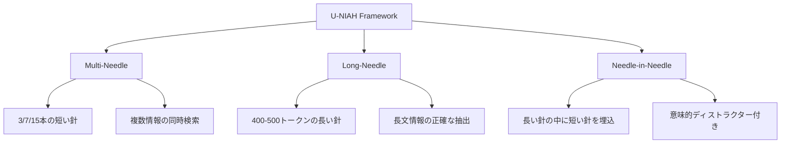
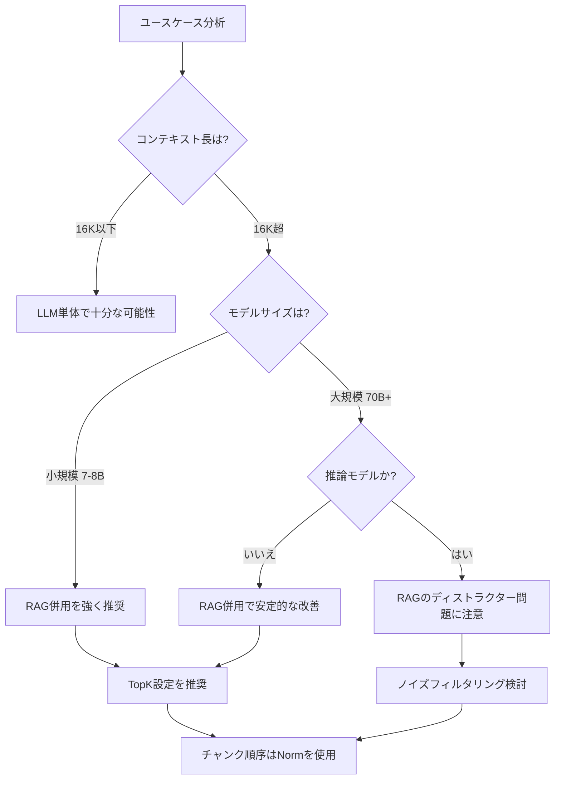

## 論文概要

本記事は [https://arxiv.org/abs/2503.00353](https://arxiv.org/abs/2503.00353) の解説記事です。

U-NIAH（Unified Needle-In-A-Haystack）は、LLMの長文処理能力とRAGシステムの検索精度を**同一フレームワーク上で統一的に比較・評価**するための手法である。従来のNIAH（Needle-In-A-Haystack）テストが単一の「針」をコンテキスト中から探す単純な構成に留まっていたのに対し、U-NIAHはMulti-Needle、Long-Needle、Needle-in-Needleという3つの拡張構成を導入し、より実践的なシナリオでの評価を可能にしている。

著者らは事前学習知識の汚染を排除するため、完全架空の「Starlight Academy」データセットを設計した。実験の結果、RAG（TopK構成）はstandalone LLMに対して平均スコア9.04（SD 1.48）、82.58%のwin-rateで優位性を示した。一方で、高度な推論モデル（DeepSeek-Reasoner、O1-mini等）ではRAGとの併用による改善が限定的であることも報告されている。

この記事は [Zenn記事: ロングコンテキストLLMの精度検証パイプライン：合成テストから本番監視まで](https://zenn.dev/0h_n0/articles/a1267e20486141) の深掘りである。

## 情報源

- **arXiv ID**: 2503.00353
- **URL**: [arXiv:2503.00353](https://arxiv.org/abs/2503.00353)
- **掲載誌**: ACM Transactions on Information Systems (TOIS) 2025
- **著者**: Yunfan Gao, Yun Xiong, Wenlong Wu, Zijing Huang, Bohan Li, Haofen Wang
- **コード**: [https://github.com/Tongji-KGLLM/U-NIAH](https://github.com/Tongji-KGLLM/U-NIAH)

## 背景と動機

### LLMコンテキスト拡張とRAGの評価断片化

近年、LLMのコンテキストウィンドウは急速に拡大している。GPT-4oは128Kトークン、Gemini 1.5 Proは1Mトークンを処理可能であり、かつては「コンテキスト長の制約」がRAG導入の主要な動機であった前提が揺らいでいる。

しかし、LLMのロングコンテキスト能力とRAGの性能を**公正に比較した研究**は限定的であった。著者らは既存の評価手法について以下の3つの課題を指摘している。

1. **評価フレームワークの非統一性**: LLM評価（LongBench, InfiniteBench等）とRAG評価（RAGAS, RGB等）が別々の基準で設計されており、直接比較が困難
2. **単純すぎるNIAHテスト**: 従来のNIAHは「ピザの材料」のような単一情報の検索に限定されており、実運用で求められる複数情報の統合的な検索能力を測定できない
3. **事前学習知識の汚染**: 既存のベンチマークデータがLLMの学習データに含まれている可能性があり、コンテキスト内検索能力の正確な測定を妨げている

### 3つの研究質問

著者らは以下の3つのResearch Question（RQ）を設定している。

- **RQ1**: LLMとRAGの性能トレードオフはどのような条件で変化するか
- **RQ2**: RAGシステムのエラーパターンをどのように体系的に特定できるか
- **RQ3**: 複雑な設定（Multi-Needle、Needle-in-Needle等）におけるRAGの限界はどこにあるか

## 主要な貢献

U-NIAHの貢献は大きく3つに整理される。

### 1. 統一評価フレームワーク

LLMのlong-context処理とRAGの検索能力を同一の実験条件（同じコンテキスト、同じ質問、同じ評価基準）で比較可能にするフレームワークを提案した。これにより「LLMとRAGのどちらが優れているか」という問いに対して定量的な回答が可能になる。

### 2. Starlight Academyデータセット

GPQAの「Google-proof」哲学に着想を得て、完全架空の魔法大学「Starlight Academy」を舞台とする合成データセットを設計した。魔法システム、カリキュラム、キャンパス生活、教育手法といった要素で構成され、事前学習データとの重複を原理的に排除している。さらに、姉妹校「Lunaris Academy」のコンテンツをディストラクター（意味的妨害情報）として含めることで、検索システムのロバスト性を評価できる。

### 3. 拡張NIAH構成

従来の単一needle構成を、以下の3つの実践的な構成に拡張した。

## 技術的詳細

### Multi-Needle構成

Multi-Needleでは、コンテキスト中に複数の「針」（正解情報）を配置し、モデルがそれらを漏れなく検索・統合できるかを評価する。

**針の配置アルゴリズム**: 最初の針を深さ $d_1 = \alpha H$（$H$はコンテキスト全長、$\alpha$は深さパラメータ、例えば10%）に配置し、残りの$k-1$本を以下の式で均等に分散させる。

$$
\{d_i\}_{i=2}^{k} = \left\{ d_1 + \left\lfloor \frac{(i-1)(H - d_1)}{k} \right\rfloor \mid i = 2, \ldots, k \right\}
$$

テストケースとしては以下が用意されている。

| テストケース | 針の本数 | 針の長さ | 内容 |
|---|---|---|---|
| Rainbow Potion | 7 | 短（50-100トークン） | 色と物質のペア |
| First-year Course | 15 | 短（50-100トークン） | 1年次の履修科目 |
| Starlight Teaching | 3 | 長（約500トークン） | 教育手法の詳細 |
| Graduation Trials | 7 | 長（約500トークン） | 卒業試験の統合的記述 |

### Long-Needle構成

短い針（50-100トークン）ではなく400-500トークンの長い正解テキストを埋め込む。これにより、RAGのチャンク分割が正解情報を複数チャンクに分断してしまう問題を検証できる。チャンクサイズ600トークン、オーバーラップ100トークンという設定において、長い針が必然的にチャンク境界をまたぐため、検索精度への影響を定量的に評価できる。

### Needle-in-Needle構成

最も複雑な構成であり、長い針の内部にさらに短い針（核心情報）を埋め込む。加えて、姉妹校Lunaris Academyの情報を**意味的ディストラクター**（セマンティック・ハードネガティブ）として混入させる。これにより、RAGの埋め込みモデルが類似した文脈を持つ偽情報に惑わされるかどうかを検証する。

### 性能行列と評価スコア

各実験条件の性能を以下の行列で表現する。

$$
H_{ij} = \mathbb{E}[M(A, \hat{A}) \mid L_i, d_j]
$$

ここで$L_i$はコンテキスト長、$d_j$は針の挿入深さ、$A$は正解、$\hat{A}$はモデル出力、$M$は評価関数を表す。評価は10点満点のスケールで行われ、1（完全に無関係）から10（正解と完全一致）まで定義されている。

### RAG構成

RAGの検索戦略として以下の3種類を比較している。

- **TopK**: 類似度上位$K$チャンクを取得（3-needle: $K=5$、7-needle: $K=10$、15-needle: $K=20$）
- **Half-Length**: コンテキストウィンドウの50%を取得チャンクで埋める
- **Full-Length**: コンテキストウィンドウ全体を取得チャンクで埋める

チャンク順序も変数として制御される。

- **Norm順序**: 類似度昇順（最も関連性の高いチャンクをクエリから最も遠くに配置）
- **Reverse順序**: 類似度降順（最も関連性の高いチャンクをクエリの直前に配置）

ノイズ注入は以下の式で定式化される。

$$
R' = R_{\text{topK}} \cup H_{\text{rand}\lfloor \eta L \rfloor}
$$

ここで$\eta$はノイズ比率パラメータであり、無関係なチャンクの混入割合を制御する。

## 実装のポイント

### 評価フレームワーク構築ガイド

U-NIAHの[公開リポジトリ](https://github.com/Tongji-KGLLM/U-NIAH)では、以下のコンポーネントが提供されている。

**設定ファイル**: `model_config.yaml`でモデルプロバイダ（OpenAI/Anthropic）とAPI設定を定義し、`needle_cases.yaml`でテストケース（針の内容、クエリ、期待される回答）を記述する。

**実行スクリプト**: LLM評価用の`run_llm_multi_needle_test.py`とRAG評価用の`run_rag_multi_needle_test.py`が分かれており、同一のテストケースに対して両方を実行することで公正な比較が可能になる。

**対応モデル**: OpenAI SDK互換のAPIを持つモデル（GPT-4o、DeepSeek、Qwen、SiliconFlow等）とAnthropic SDK対応モデル（Claude-3系）をサポートしている。

自前の評価パイプラインを構築する場合、以下の点が重要である。

1. **針の挿入位置を文境界に合わせる**: 文の途中に針を挿入すると不自然なコンテキストになり、モデルの挙動が変わる。U-NIAHでは完全な文の後にのみ針を挿入する
2. **コーパスの一貫性**: ヘイスタック（干し草）テキストはファイル名のアルファベット順で結合し、再現性を確保する
3. **チャンクサイズとオーバーラップの明示**: 結果の比較可能性のため、チャンクサイズ（600トークン）とオーバーラップ（100トークン）を固定して報告する

## 実験結果

### RAG vs. LLM：全体的な比較

著者らは12種類のLLM（GPT-3.5-turbo、GPT-4o、GPT-4o-mini、DeepSeek-v3、DeepSeek-chat、Qwen-max、Qwen-plus、Qwen2.5-7B、Qwen2.5-72B、Llama-3.1-8B、Llama-3.3-70B等）と3種類の推論モデル（DeepSeek-Reasoner、O1-mini、O3-mini）を評価している。

RAG（TopK構成）の主要結果は以下の通りである。

| 指標 | RAG (TopK) | LLM (Standalone) |
|---|---|---|
| 平均スコア | 9.04 (SD 1.48) | 8.67 (SD 2.01) |
| Win-Rate | **82.58%** | 17.42% |

コンテキスト長別のRAG win-rateを見ると、長文になるほどRAGの優位性が明確になる。

| コンテキスト長 | RAG Win-Rate |
|---|---|
| 1K - 16K | 57.4% |
| 16K - 32K | 77.0% |
| 32K - 64K | 86.7% |
| 64K - 128K | 92.7% |

### モデルサイズ別の分析

RAGの恩恵はモデルサイズによって大きく異なる。小規模モデルでのRAG改善効果が顕著である。

- **Qwen2.5-7B**（64-128K）: LLMスコア5.3 (SD 2.9) → RAGスコア9.8 (SD 0.7)
- **Llama-3.1-8B**（64-128K）: LLMスコア5.2 (SD 2.2) → RAGスコア9.8 (SD 0.7)
- **GPT-4o**（64-128K）: LLMスコア9.8 (SD 0.7) → RAGスコア9.7 (SD 0.9)

GPT-4oのような大規模モデルでは既にlong-context性能が高いため、RAGによる追加的な改善は限定的であった。

### エラーパターン分析

著者らは5つのエラーカテゴリを特定している。

**1. Retrieval Bottleneck（検索のボトルネック）**

RAGの検索精度は針の本数が増えるにつれ低下する。完全想起率は3-needle: 99.03%、7-needle: 90.78%、15-needle: 79.59%と報告されている。全エラーの10.18%がこの検索段階の失敗に起因する。

**2. Omission（情報欠落）**

最も支配的なエラータイプである。15-needleケースではエラーの86.9%がomissionのみで構成される。コンテキスト長の増加に伴い顕著になる。

**3. Hallucination/Noise Distraction（幻覚/ノイズ混同）**

ノイズ比率が44%を超えると、検索漏れの割合が33.53%増加すると報告されている。3-needleケースではエラーの51%にhallucinationが関与する。小規模モデルで特に深刻な問題となる。

**4. Noise Critical Pattern（ノイズ臨界パターン）**

長コンテキスト+高ノイズ比率（97%超）の条件下で発生する。偽の要素生成が355.82%増加するという極端な悪化が観察されている。主に小規模モデルで発生する。

**5. Self-Doubt（自己疑念）**

モデルが正しい要素を生成した後、自らその回答を否定・撤回する現象である。小規模モデルの長コンテキスト処理時に11.30%の発生率で観察され、小規模モデルは大規模モデルに比べて377%高い確率でこの行動を示す。

### 推論モデルとRAGの相互作用

DeepSeek-Reasoner、O1-mini、O3-miniといった推論特化モデルでは、RAGとの併用効果が標準モデルと異なるパターンを示す。著者らは推論モデルがRAGコンテキスト中の**セマンティックディストラクター**（意味的に類似した偽情報）に対する感度が増加し、RAGの恩恵が減少する傾向を報告している。

### チャンク順序の影響

Reverse順序（関連チャンクをクエリ近くに配置）は、Norm順序に比べてomissionを59.4%増加させる。特にLlama-3.1-8Bで-16.89%、Qwen2.5-7Bで-10.75%の性能低下が観察されている。これは「recency bias（直近偏重）」がチャンク順序にも影響することを示唆している。

## 実運用への応用

### RAG vs. LLM選定のための評価フロー

U-NIAHの知見を基に、実運用システムでの「RAGを使うべきか、ロングコンテキストLLMで十分か」を判断するためのフローを以下のように整理できる。

### 実運用での留意点

1. **RAGは万能ではない**: 82.58%のwin-rateは高いが、推論モデルやGPT-4oクラスの大規模モデルでは改善幅が限定的である。モデルのベースライン性能を先に評価し、RAGの追加コスト（レイテンシ、インフラ）に見合うかを判断する必要がある
2. **検索品質が全体性能を律速する**: 15-needle構成での完全想起率が79.59%に低下することから、検索段階の改善（リランキング、ハイブリッド検索等）が全体性能の向上に直結する
3. **チャンク順序はNormを選択**: 直感に反するが、最も関連性の高いチャンクをクエリから遠い位置に配置するNorm順序の方が性能が高い。これはLLMのattention機構における位置バイアスと関連していると考えられる
4. **ノイズ管理が重要**: ノイズ比率44%を超えると性能が急激に劣化するため、検索結果のフィルタリングやスコア閾値の設定が実運用では不可欠である

## 関連研究

U-NIAHは以下の先行研究を踏まえて設計されている。

**ロングコンテキスト評価ベンチマーク**:
- **LongBench** (Bai et al., 2024): 21の二言語データセットによるロングコンテキスト理解ベンチマーク。ただしLLMのみを対象としており、RAGとの比較は含まない
- **InfiniteBench** (Zhang et al., 2024): 100K+トークンの評価に特化。やはりRAGとの統一比較は未対応
- **RULER** (Hsieh et al., 2024): 合成タスクによるロングコンテキスト評価。Multi-keyやMulti-valueのNIAH変種を含むが、RAGとの比較は行われていない
- **HELMET** (Yen et al., 2024): 自然言語ベースのロングコンテキスト評価。タスク多様性は高いがRAG統合評価は範囲外
- **InfiniteBench** (Zhang et al., 2024): 100K+トークンでの包括的評価

**Lost-in-the-Middle現象**:
- Liu et al. (2024)が報告した、コンテキスト中央部の情報をLLMが見落としやすい現象。U-NIAHの実験でもこの傾向が確認されており、RAGがこの問題を軽減する効果があることが定量的に示されている

**RAG評価フレームワーク**:
- **RAGAS**, **RGB**等の既存RAG評価手法はRAG単体の品質測定に焦点を当てており、LLMのlong-context能力との比較基盤を提供していない。U-NIAHはこのギャップを埋める位置づけにある

## まとめと今後の展望

U-NIAHは、LLMのロングコンテキスト処理とRAGの検索能力を統一的に評価するフレームワークとして、以下の主要な知見を提供している。

1. **RAGはコンテキスト長16K以上で明確に有効**: win-rateは57.4%（1-16K）から92.7%（64-128K）へと単調増加する
2. **小規模モデルへのRAG効果が特に大きい**: 7-8Bモデルでは64-128Kでのスコアが5.2-5.3から9.8へと大幅に向上する
3. **推論モデルはRAGとの相性に課題**: セマンティックディストラクターへの感度増加が報告されている
4. **エラーパターンの体系的理解**: omission、hallucination、self-doubtの3大エラーとその発生条件が明らかにされた

今後の研究方向として著者らは、推論モデルに適した検索プロセス（反復的検索、能動的検索）の探索、動的なノイズフィルタリング機構の開発、コンテキスト対応のRAGチューニング戦略、LCとRAGのハイブリッドアプローチの調査を挙げている。

本研究の意義は、「RAGかLLMか」という二項対立的な議論を超えて、ユースケースごとの最適な選択を定量的に支援するフレームワークを提供した点にある。実運用においては、モデルサイズ、コンテキスト長、検索品質、ノイズ環境という4つの軸で自システムを評価し、RAG導入の判断を行うことが推奨される。

## 参考文献

- Gao, Y., Xiong, Y., Wu, W., Huang, Z., Li, B., & Wang, H. (2025). U-NIAH: Unified RAG and LLM Evaluation for Long Context Needle-In-A-Haystack. *ACM Transactions on Information Systems (TOIS)*. [arXiv:2503.00353](https://arxiv.org/abs/2503.00353)
- Liu, N. F., Lin, K., Hewitt, J., Paranjape, A., Bevilacqua, M., Petroni, F., & Liang, P. (2024). Lost in the Middle: How Language Models Use Long Contexts. *Transactions of the Association for Computational Linguistics*.
- Hsieh, C.-P., Sun, S., Kriman, S., Acharya, S., Rekesh, D., Jia, F., & Ginsburg, B. (2024). RULER: What's the Real Context Size of Your Long-Context Language Models? [arXiv:2404.06654](https://arxiv.org/abs/2404.06654)
- Yen, H., Gao, T., & Chen, D. (2024). HELMET: How to Evaluate Long-Context Language Models Effectively and Thoroughly. [arXiv:2410.02694](https://arxiv.org/abs/2410.02694)
- Bai, Y., et al. (2024). LongBench: A Bilingual, Multitask Benchmark for Long Context Understanding. [arXiv:2308.14508](https://arxiv.org/abs/2308.14508)
- Zhang, X., et al. (2024). InfiniteBench: Extending Long Context Benchmark Beyond 100K Tokens. [arXiv:2402.13718](https://arxiv.org/abs/2402.13718)
- GitHub リポジトリ: [Tongji-KGLLM/U-NIAH](https://github.com/Tongji-KGLLM/U-NIAH)
