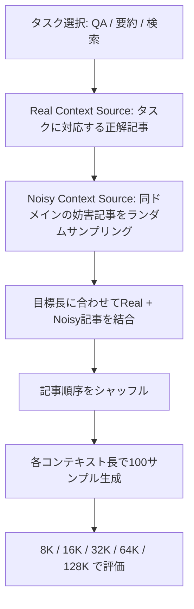
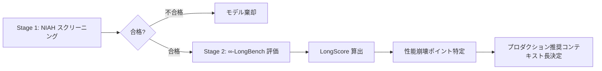

## 論文概要（Abstract）

本記事は [https://arxiv.org/abs/2505.19293](https://arxiv.org/abs/2505.19293) の解説記事です。

∞-LongBench は、既存のロングコンテキストベンチマーク（LongBench等）が抱える2つの根本的問題を指摘し、その解決策を提案した研究である。第一に、従来のベンチマークはモデルの基礎能力（短いコンテキストでの性能）とロングコンテキスト能力を分離するメトリクスを持たないため、モデル間比較が不正確になる。第二に、固定入力長での評価は性能劣化ポイントの特定を不可能にする。著者らはこれらの課題に対し、入力長を自在に制御できるLength-Controllableベンチマークと、基礎能力を補正するLongScoreメトリクスを提案している。

この記事は [Zenn記事: ロングコンテキストLLMの精度検証パイプライン：合成テストから本番監視まで](https://zenn.dev/0h_n0/articles/a1267e20486141) の深掘りです。

## 情報源

- **会議名**: ACL 2025 Findings（Association for Computational Linguistics）
- **開催地**: Vienna, Austria（2025年7月）
- **URL**: [https://aclanthology.org/2025.findings-acl.903/](https://aclanthology.org/2025.findings-acl.903/)
- **著者**: Wang Yang, Hongye Jin, Shaochen Zhong, Song Jiang, Qifan Wang, Vipin Chaudhary, Xiaotian Han
- **DOI**: 10.18653/v1/2025.findings-acl.903
- **ページ**: 17560--17576
- **コード**: [https://github.com/uservan/100-LongBench.git](https://github.com/uservan/100-LongBench.git)

## カンファレンス情報

ACL（Association for Computational Linguistics）は、自然言語処理（NLP）分野における最高峰の国際会議である。ACL 2025はオーストリア・ウィーンで開催された。Findings of ACLは、メインカンファレンスには惜しくも採択されなかったものの高品質と判断された論文が掲載される査読付き論文集であり、そのレベルはトップカンファレンスに準ずる。本論文はFindings枠として採択されている。

## 技術的詳細（Technical Details）

### 既存ベンチマークの2つの問題

著者らは既存のロングコンテキスト評価に2つの構造的問題があると指摘している。

**問題1: 基礎能力とロングコンテキスト能力の混同**

従来のベンチマーク（LongBench等）は、各コンテキスト長でのスコアをそのまま報告する。しかし、このスコアにはモデルが元来持っている基礎的な言語理解能力と、長いコンテキストを処理する能力が不可分に混在している。

著者らは論文中で具体的な例を示している。LLaMA 3.1-8Bは短いテキストではQwen 2.5-7Bよりも低い性能を示すが、128K--256Kトークンの長さでは逆転する。従来の平均スコアではこの違いが覆い隠される。

**問題2: 固定入力長の限界**

LongBenchのようなベンチマークは入力長が約8Kトークン前後に偏っており、各サンプルの長さが固定されている。このため、あるモデルが何トークンの時点で性能劣化を起こすのかを特定できない。現代のLLMが128K--1Mトークンのコンテキスト長を公称する中で、この制約は深刻である。

### LongScoreメトリクス

著者らが提案するLongScoreは、基礎能力を補正することで純粋なロングコンテキスト耐性を評価するメトリクスである。

まず、ベースライン能力（Base Ability）を以下のように定義する:

$$
\text{Base Ability} = \frac{S_{2K} + S_{4K} + S_{6K}}{3}
$$

ここで、$S_{2K}$, $S_{4K}$, $S_{6K}$ はそれぞれコンテキスト長2K, 4K, 6Kトークンでのスコアである。著者らは、評価対象のモデルの多くがpre-extensionコンテキストウィンドウとして4Kまたは8Kを持つことから、2K/4K/6Kの3点を基礎能力の代表値として採用している。

次に、コンテキスト長 $l$ でのLongScore（論文中ではLC: Long-Context scoreと表記）を以下のように計算する:

$$
\text{LC}_l = \frac{S_l - \text{Base Ability}}{\text{Base Ability}}
$$

ここで、
- $S_l$: コンテキスト長 $l$ でのスコア
- $\text{Base Ability}$: 上記で計算した基礎能力スコア
- $\text{LC}_l > 0$: ロングコンテキストでも性能を維持（または向上）
- $\text{LC}_l < 0$: ロングコンテキストにより性能が劣化

この設計のポイントは、異なるモデルの基礎能力の差を正規化することで、「ロングコンテキスト処理による性能変化率」を直接比較可能にしている点にある。

### LongScoreの導出の直感

LongScoreは相対変化率として設計されている。これにより、基礎能力が60点のモデルAと40点のモデルBが128Kトークンでそれぞれ54点と38点を取った場合、以下のように評価される:

$$
\text{LC}_{128K}^{A} = \frac{54 - 60}{60} = -0.10 \quad (-10\%)
$$

$$
\text{LC}_{128K}^{B} = \frac{38 - 40}{40} = -0.05 \quad (-5\%)
$$

従来の評価では $S_{128K}^{A} = 54 > S_{128K}^{B} = 38$ だからモデルAが優れているように見えるが、LongScoreでは モデルBの方がロングコンテキスト耐性が高い（劣化幅が小さい）ことが明確になる。

### Length-Controllableベンチマークの設計

∞-LongBenchは、コンテキスト長を自在に制御できるベンチマーク構築手法を提案している。



構築手順は以下の通りである:

1. **Real Context Sourceの選定**: 正解に必要な記事（Ground Truth文書）を1つ選択する
2. **Noisy Context Sourceのサンプリング**: 同じドメインから妨害用の記事をランダムに選択する
3. **目標長への調整**: Real記事とNoisy記事を結合し、目標のコンテキスト長（8K, 16K, 32K, 64K, 128K）に合わせる
4. **シャッフル**: 記事の順序をランダムに並び替え、位置バイアスを排除する
5. **サンプル生成**: 各コンテキスト長で100サンプルを生成する

このアプローチの特徴は、"real-life reflective"な設計にある。Needle-in-a-Haystackのような純粋合成テストでは、パディングコンテンツとターゲット情報の間に意味的関連性がない。一方、∞-LongBenchでは妨害記事がタスクと同じドメインから選ばれるため、RAGパイプラインのような実際の使用状況を反映している。

### タスクカテゴリとデータセット

∞-LongBenchは4カテゴリ8タスクで構成されている:

| カテゴリ | タスク | Real Sources | Noisy Sources |
|----------|--------|-------------|---------------|
| Key Retrieval | KV Retrieval, Counting Stars | N/A (合成) | 9データセット |
| Information Retrieval | Passage Retrieval, Passage Count | 7データセット | 7データセット |
| Comprehension | Single-doc QA, Multi-doc QA | 8データセット | 8データセット |
| Summarization | Single-doc Sum, Multi-doc Sum | 6データセット | 6データセット |

具体的なデータソースには、QASPER、MultiFieldQA、NarrativeQA、HotpotQA、WikiMQA、MusiQue、CNN-DailyMail、Gov-Report、QMSum等が含まれる。

### QAフィルタリング機構

QAタスクにおいて重要な工夫がある。モデルがコンテキストを読まずとも事前学習で獲得した知識だけで正答できてしまう質問を除外する機構が導入されている。コンテキストなしで正答率が閾値を超える質問は、ベンチマークから除外される。これにより、「ロングコンテキスト処理能力」の評価がモデルの暗記知識に汚染されることを防いでいる。

### 評価メトリクスの詳細

著者らはタスクに応じて異なる評価手法を採用している:

**QAタスク（GPT-4o-miniベースの自動評価）**:
- Fluency: 3段階（0, 1, 2）
- Correctness: 4段階（0, 1, 2, 3）
- 最終スコア = Fluency × Correctness

**要約タスク**:
- Fluency: 2段階
- Precision = (関連文の数) / (出力全文数)

LLMベースの自動評価を採用することで、大規模な評価を効率的に実施可能としている。

## 実装のポイント（Implementation Notes）

LongScoreを自身の評価パイプラインに組み込む際の実装上の注意点を整理する。

### ベースライン精度の要件

著者らは論文のLimitationsセクションで明記している通り、LongScoreは**モデルが十分な基礎能力を持つことを前提とする**。Base Abilityが極端に低い（例: ランダム正答率に近い）場合、分母が小さくなることでLongScoreが過度に振れ、信頼性の低い評価になる。

```python
from dataclasses import dataclass


@dataclass
class LongScoreResult:
    """LongScore計算結果を格納するデータクラス

    Attributes:
        base_ability: 短いコンテキストでの平均スコア
        lc_scores: 各コンテキスト長でのLongScore
        avg_lc: LongScoreの平均値
        reliable: ベースライン精度が十分かどうか
    """
    base_ability: float
    lc_scores: dict[int, float]
    avg_lc: float
    reliable: bool


def compute_longscore(
    scores: dict[int, float],
    base_lengths: tuple[int, ...] = (2048, 4096, 6144),
    min_base_ability: float = 0.3,
) -> LongScoreResult:
    """LongScoreメトリクスを計算する

    Args:
        scores: コンテキスト長をキー、スコアを値とする辞書
                例: {2048: 0.65, 4096: 0.62, ..., 131072: 0.41}
        base_lengths: Base Ability算出に使う短コンテキスト長
        min_base_ability: Base Abilityの最低閾値（これ未満は信頼性低）

    Returns:
        LongScoreResult: 計算結果
    """
    # Base Ability の算出
    base_scores = [scores[l] for l in base_lengths if l in scores]
    if not base_scores:
        raise ValueError(
            f"scores に base_lengths {base_lengths} のいずれも含まれていません"
        )
    base_ability = sum(base_scores) / len(base_scores)

    # 信頼性チェック
    reliable = base_ability >= min_base_ability

    # 各コンテキスト長での LongScore (LC) 算出
    lc_scores: dict[int, float] = {}
    for length, score in scores.items():
        if length not in base_lengths:
            lc_scores[length] = (score - base_ability) / base_ability

    # 平均 LongScore
    avg_lc = sum(lc_scores.values()) / len(lc_scores) if lc_scores else 0.0

    return LongScoreResult(
        base_ability=base_ability,
        lc_scores=lc_scores,
        avg_lc=avg_lc,
        reliable=reliable,
    )
```

### コンテキスト長の選定

Base Abilityに使う短コンテキスト長の選定は、モデルのpre-extensionウィンドウサイズに依存する。著者らは2K/4K/6Kを用いているが、これは評価対象モデルの多くが4Kまたは8Kのpre-extensionウィンドウを持つためである。異なるモデルを評価する場合は、対象モデルのpre-extensionウィンドウに合わせた調整が必要になる。

### サンプル数と統計的安定性

各コンテキスト長で100サンプルを生成する設計は、評価の統計的安定性を確保するためである。実運用で計算コストが問題になる場合は、著者らの公開コードを参考にサンプル数の影響を事前検証することが推奨される。

### 妨害文書のドメイン整合

Length-Controllableベンチマークを構築する際、妨害記事は正解記事と同じドメインから選ぶことが重要である。ランダムなテキストをパディングに使うと、Needle-in-a-Haystackと同様の問題を再現してしまい、実タスクの性能を正しく反映できない。

## 実験結果（Experimental Results）

### 従来メトリクスとLongScoreの比較

著者らの実験で最も注目すべき結果は、従来メトリクスとLongScoreでモデルのランキングが逆転する点である。論文Table 4の結果を以下に要約する:

| モデル | Base Ability | Base順位 | Avg LC | LC順位 |
|--------|-------------|---------|--------|--------|
| Qwen 2.5-14B-Instruct | 59.1 | 1位 | -31.1 | 4位 |
| Qwen 2.5-7B-Instruct | 52.8 | 2位 | -24.2 | 3位 |
| LLaMA 3.1-8B-Instruct | 44.0 | 3位 | -17.4 | **1位** |
| LLaMA 3.2-1B-Instruct | 31.3 | 4位 | -22.3 | 2位 |

Qwen 2.5-14Bは基礎能力では1位だが、ロングコンテキスト耐性ではLongScoreが-31.1と最も大きく劣化しており、4位（最下位）となる。一方、LLaMA 3.1-8Bは基礎能力では3位だが、LongScoreは-17.4と劣化幅が最も小さく、1位に浮上する。この結果は、従来メトリクスが基礎能力とロングコンテキスト能力を混同していたことを端的に示している。

### RULERベンチマークでの検証

著者らはRULERベンチマーク（Hsieh et al., 2024）にもLongScoreを適用し、同様の傾向を確認している。論文Table 5の主要な結果は以下の通りである:

| モデル | パラメータ数 | 公称長 | 128K精度 | LC Score |
|--------|------------|-------|---------|----------|
| LLaMA 3.1 | 70B | 128K | -- | -- |
| Yi | 34B | 200K | 77.3% | -17.1 |
| Phi3-medium | 14B | 128K | 46.1% | -50.5 |
| LWM | 7B | 1M | -- | -13.9 |

著者らの分析によると、Yi（34B）はLLaMA 3.1（70B）と比較して128K以前では若干低い総合スコアを示すが、128Kでは大幅に上回る。Phi3-mediumは128Kで精度が46.1%まで低下し、LCスコアは-50.5と深刻な劣化を示している。

### NTK vs PI: 拡張手法の比較

従来のLongBenchメトリクスとLongScoreの差異が最も顕著に現れたのが、コンテキスト長拡張手法の比較である。論文Table 6によると、NTK（Neural Tangent Kernel）とPI（Position Interpolation）はLongBenchでは同程度のスコア（両方とも約15.5）を示す。しかし、LongScoreを適用すると、NTKは-18.40、PIは-27.68と、NTKの方がロングコンテキスト耐性において優れていることが明らかになる。

### ドメイン特化タスクでの知見

論文Table 8では、ヘルスケア・法律ドメインのデータセットを追加した場合の影響が報告されている。著者らの実験によると、LLaMA 3.2-1BのLCスコアは汎用タスクの-22.27から-30.27に悪化した。これは、モデルが特定ドメインの専門知識を欠く場合、ロングコンテキスト性能がさらに低下することを示唆している。

### 性能崩壊ポイントの特定

Length-Controllableベンチマークにより、各モデルの性能崩壊ポイントが明確に特定できる。著者らの分析によると、公称1Mトークンのモデルであっても、要約や多文書QAのような複雑タスクでは128K付近から顕著な性能低下が観察される。Key Retrievalのような単純タスクでは維持される性能も、Comprehensionタスクでは早期に崩壊する傾向がある。

## 実運用への応用（Practical Applications）

### モデル選定におけるLongScore活用

LongScoreは、プロダクションでのLLMモデル選定において以下の判断材料を提供する:

1. **ロングコンテキストが必要なユースケース**: LongScoreが高い（劣化が小さい）モデルを優先する。著者らの結果では、LLaMA 3.1-8Bが14Bや70Bクラスのモデルよりもロングコンテキスト耐性が高い場合がある
2. **短コンテキストで十分なユースケース**: Base Abilityが高いモデル（Qwen 2.5-14B等）を選択すれば、ロングコンテキスト耐性は不問
3. **コストとのトレードオフ**: パラメータ数が小さくてもLC耐性が高いモデルが存在するため、コスト効率の良い選択が可能

### 評価パイプラインへの統合

Zenn記事「ロングコンテキストLLMの精度検証パイプライン」で紹介されている合成テスト + 本番監視のパイプラインにLongScoreを組み込むことで、より正確なモデル評価が可能になる。

```python
def evaluate_model_for_production(
    model_name: str,
    task_type: str,
    context_lengths: list[int],
    scores: dict[int, float],
) -> dict:
    """プロダクション向けモデル評価

    LongScoreを用いて、タスク種別に応じた推奨コンテキスト長を算出する。

    Args:
        model_name: モデル名
        task_type: タスク種別（qa / summarization / retrieval）
        context_lengths: 評価対象のコンテキスト長リスト
        scores: 各コンテキスト長でのスコア

    Returns:
        評価結果の辞書
    """
    result = compute_longscore(scores)

    # 性能崩壊ポイントの特定
    # LC が -0.2 (20%劣化) を超えた最初の長さ
    degradation_threshold = -0.20
    breakdown_point = None
    for length in sorted(result.lc_scores.keys()):
        if result.lc_scores[length] < degradation_threshold:
            breakdown_point = length
            break

    return {
        "model": model_name,
        "task": task_type,
        "base_ability": result.base_ability,
        "avg_lc": result.avg_lc,
        "reliable": result.reliable,
        "breakdown_point": breakdown_point,
        "recommended_max_length": (
            breakdown_point // 2 if breakdown_point else max(context_lengths)
        ),
    }
```

### Needle-in-a-Haystackとの併用

著者らの分析は、バニラNIAH（Needle-in-a-Haystack）スコアと実タスク性能の相関が低いことを示している。しかし、NIAHを完全に捨てるべきではない。NIAHは計算コストが低く、基本的な位置エンコーディングの健全性を確認するスクリーニング検査として有用である。∞-LongBenchのような実タスクベースの評価と組み合わせることで、多段階の評価パイプラインが構築できる。



## 関連研究（Related Work）

### RULER (Hsieh et al., 2024)

RULERは、コンテキスト長と正解の位置を制御可能に設計されたロングコンテキストベンチマークである。∞-LongBenchの著者らはRULERにもLongScoreを適用して検証を行っており（論文Table 5）、メトリクスの汎用性を示している。RULERは長さ制御が可能だが、基礎能力との分離メトリクスは提供していない点で∞-LongBenchと相補的である。

### HELMET (Yen et al., 2024)

HELMETは制御可能なコンテキスト長に加えて多様なタスク設計を備え、LLMベースのメトリクスも導入している。∞-LongBenchはHELMETと同様に制御可能な長さを持つが、Base Abilityの分離という独自の観点を加えている。

### LongBench v2 / L-Eval / ∞-Bench

LongBench v2、L-Eval、∞-Benchは入力長を128K以上に拡張した改良版ベンチマークである。しかし、著者らはこれらのベンチマークでもコンテキスト長が制御不可能であり、固定長評価の限界を克服していないと指摘している。

### LongBench Pro (Wang et al., 2025)

LongBench Proは∞-LongBenchと同時期に提案されたベンチマークで、長さ制御とより挑戦的なタスク設計を特徴とする。両者は独立に同じ問題意識（既存ベンチマークの不十分さ）に取り組んでおり、この問題の重要性を裏付けている。

## まとめ

∞-LongBenchの最大の貢献は、「従来のロングコンテキストベンチマークが実際にはロングコンテキスト能力を正しく測定していない」ことを定量的に示した点にある。LongScoreメトリクスによるモデルランキングの逆転（Table 4: Qwen 2.5-14Bが基礎能力1位からLC耐性4位へ、LLaMA 3.1-8Bが3位から1位へ）は、この問題の深刻さを端的に物語っている。

実務的には、LongScoreは既存の評価パイプラインに低コストで統合可能な補正メトリクスとして活用できる。モデル選定時にBase AbilityとLongScoreを分離して比較することで、ユースケースに応じた最適なモデル選択が可能になる。また、Length-Controllableベンチマークの手法は、自社データでのカスタムベンチマーク構築にも応用可能である。

著者らが指摘する通り、LLMのコンテキスト長が拡大し続ける中で、その能力を正しく評価する手法の重要性は今後さらに増すと考えられる。

## 参考文献

- **ACL Anthology**: [https://aclanthology.org/2025.findings-acl.903/](https://aclanthology.org/2025.findings-acl.903/)
- **arXiv**: [https://arxiv.org/abs/2505.19293](https://arxiv.org/abs/2505.19293)
- **Code**: [https://github.com/uservan/100-LongBench.git](https://github.com/uservan/100-LongBench.git)
- **Related Zenn article**: [https://zenn.dev/0h_n0/articles/a1267e20486141](https://zenn.dev/0h_n0/articles/a1267e20486141)
- Hsieh, C.-P. et al. (2024). RULER: What's the Real Context Size of Your Long-Context Language Models? arXiv:2404.06654
- Yen, H. et al. (2024). HELMET: How to Evaluate Long-Context Language Models Effectively and Thoroughly. arXiv:2410.02694
- Wang, Y. et al. (2025). LongBench Pro: Leveling Up Long-Context Evaluation with Challenging Tasks. arXiv preprint
