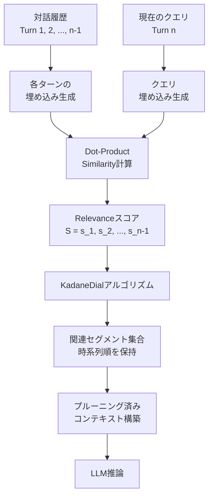

## 論文概要

本記事は [DyCP: Dynamic Context Pruning for Long-Form Dialogue with LLMs (arXiv:2601.07994)](https://arxiv.org/abs/2601.07994) の解説記事です。

Nayoung Choi, Jonathan Zhang, Jinho D. Choi（エモリー大学）による本論文は、LLMの長い対話履歴を効率的に管理する軽量なコンテキスト管理手法 **DyCP（Dynamic Context Pruning）** を提案している。DyCPは事前定義されたトピック境界を必要とせず、対話の逐次構造を保持しながら、現在のターンに基づいて関連するセグメントを動的に特定・取得する。著者らは、埋め込みベースの類似度スコアリングと、最大区間和に基づく **KadaneDialアルゴリズム** を組み合わせることで、3つのベンチマーク（LoCoMo, MT-Bench+, SCM4LLMs）においてトークン数を80-87%削減し、レイテンシを39-60%短縮しつつ、Full Contextと同等以上の回答品質を達成したと報告している。

この記事は [Zenn記事: ロングコンテキストLLMの精度検証パイプライン：合成テストから本番監視まで](https://zenn.dev/0h_n0/articles/a1267e20486141) の深掘りです。

## 情報源

| 項目 | 内容 |
|------|------|
| 種別 | arXiv論文 |
| タイトル | DyCP: Dynamic Context Pruning for Long-Form Dialogue with LLMs |
| 著者 | Nayoung Choi, Jonathan Zhang, Jinho D. Choi |
| URL | [https://arxiv.org/abs/2601.07994](https://arxiv.org/abs/2601.07994) |
| 発表日 | 2025年1月 |
| 関連Zenn記事 | [ロングコンテキストLLMの精度検証パイプライン](https://zenn.dev/0h_n0/articles/a1267e20486141) |

## 背景と動機

近年のLLMはコンテキストウィンドウが128Kトークン以上に拡張されているが、コンテキスト長の増大はそのまま推論レイテンシとAPI利用コストの増大に直結する。特に長時間の対話セッション（カスタマーサポート、教育チャットボット、マルチセッション対話等）では、対話履歴が数万トークンに達することが一般的であり、Full Contextをそのまま入力することは実運用上のコスト障壁となる。

従来のコンテキスト管理手法には、対話要約（summarization-based）やトピックセグメンテーション（topic boundary detection）がある。しかし要約ベースの手法は要約生成自体にLLM呼び出しが必要であり追加コストが発生する。トピックセグメンテーションは事前のラベル付けや固定的なトピック定義が必要であり、動的に話題が変遷する自然な対話では適用が困難である。

著者らは、対話の時系列構造を壊さず、かつ追加のLLM呼び出しなしに、現在のクエリに関連する対話セグメントだけを低コストで取得する手法の必要性を指摘し、DyCPを提案している。この着眼点は、関連Zenn記事で扱うロングコンテキストLLMの精度検証と密接に関連する。コンテキストプルーニングの品質保証には、プルーニング前後で回答品質が劣化しないことの検証パイプラインが不可欠であり、DyCPの評価手法はその検証設計の参考となる。

## 主要な貢献

著者らは以下の貢献を報告している。

- **軽量な動的コンテキスト管理**: 追加のLLM呼び出しを必要とせず、埋め込みベースの類似度計算のみでコンテキスト選択を行う手法の提案
- **KadaneDialアルゴリズム**: Kadaneの最大部分配列和アルゴリズムを対話コンテキスト検索に応用し、時系列の連続性を保持した関連セグメント抽出を実現
- **大幅なトークン・レイテンシ削減**: 3つのベンチマークでトークン数80-87%削減、レイテンシ39-60%短縮を品質維持しつつ達成
- **包括的な評価**: GPT-4o, GPT-4.1の2モデル、3つのベンチマーク、Exact MatchとGPT-4o-as-a-Judgeの2メトリクスでの評価に加え、詳細なエラー分析とRetrieval精度分析を実施

## 技術的詳細

### DyCPの全体アーキテクチャ

DyCPは大きく2つのステージから構成される。(1) 埋め込みベースのRelevanceスコアリング、(2) KadaneDialアルゴリズムによるセグメント抽出である。



### Relevanceスコアリング

DyCPの第1ステージでは、対話履歴の各ターンと現在のクエリとの関連度を埋め込みベースのdot-product similarityで計算する。

$$
\mathbf{S} = \mathbf{H}^{\text{emb}} \cdot \mathbf{q}_n^{\text{emb}}
$$

ここで、
- $\mathbf{H}^{\text{emb}} \in \mathbb{R}^{(n-1) \times d}$: 過去の各ターン $t_1, t_2, \ldots, t_{n-1}$ の埋め込みベクトルを行方向に積んだ行列
- $\mathbf{q}_n^{\text{emb}} \in \mathbb{R}^{d}$: 現在のクエリ（ターン $n$）の埋め込みベクトル
- $\mathbf{S} \in \mathbb{R}^{n-1}$: 各ターンのRelevanceスコアベクトル
- $d$: 埋め込みの次元数

この計算はLLM呼び出しを必要とせず、軽量な埋め込みモデル（text-embedding-3-small等）で実行可能である点が重要である。

### KadaneDialアルゴリズム

KadaneDialは、Kadaneの最大部分配列和アルゴリズムを対話コンテキスト検索に適用したものである。単純なtop-k検索と異なり、連続したターンのまとまり（セグメント）として取得することで、対話の文脈の流れを保持する。

**入力**: Relevanceスコア $\mathbf{S} = (s_1, s_2, \ldots, s_{n-1})$、gain threshold $\tau$ (デフォルト: 0.6)、stopping threshold $\theta$ (デフォルト: 1.0)

**ステップ1: z-score正規化**

平均 $\mu$ と標準偏差 $\sigma$ を計算し、各スコアを正規化する。

$$
\mu = \frac{1}{n-1} \sum_{i=1}^{n-1} s_i, \quad \sigma = \sqrt{\frac{1}{n-1} \sum_{i=1}^{n-1} (s_i - \mu)^2}
$$

$$
z_i = \frac{s_i - \mu}{\sigma}
$$

**ステップ2: gain shift**

正規化されたスコアからgain thresholdを減算し、平均以下のターンが負のgainを持つようにする。

$$
g_i = z_i - \tau
$$

ここで $\tau = 0.6$ は、平均から0.6標準偏差以上のスコアを持つターンのみが正のgainを持つことを意味する。これにより、関連度の低いターンがセグメントに含まれることを抑制する。

**ステップ3: 修正Kadaneアルゴリズムによるスパン検出**

修正Kadaneアルゴリズムで累積gainが最大となる連続スパン $(s_i, e_i)$ を検出する。

$$
\text{cumulative\_gain}(i, j) = \sum_{k=i}^{j} g_k
$$

累積gain $\geq \theta$ のスパンを記録し、そのスコアを $-\infty$ にセットして次のスパンを探索する。$\theta = 1.0$ は、セグメントとして採用するための最低限の累積gainを定めるパラメータである。累積gainが $\theta$ 未満のスパンしか残らなくなった時点で探索を終了する。

**出力**: 時系列順を保持した連続対話セグメントの集合 $\{(s_1, e_1), (s_2, e_2), \ldots\}$

以下に擬似コードを示す。

```python
import numpy as np
from dataclasses import dataclass


@dataclass
class DialogueSegment:
    """検出された対話セグメント"""
    start: int
    end: int
    cumulative_gain: float


def kadane_dial(
    scores: np.ndarray,
    tau: float = 0.6,
    theta: float = 1.0
) -> list[DialogueSegment]:
    """KadaneDialアルゴリズム

    Args:
        scores: 各ターンのRelevanceスコア (shape: (n-1,))
        tau: gain threshold (デフォルト: 0.6)
        theta: stopping threshold (デフォルト: 1.0)

    Returns:
        時系列順の対話セグメントリスト
    """
    # Step 1: z-score正規化
    mu = np.mean(scores)
    sigma = np.std(scores)
    if sigma < 1e-8:
        return []
    z = (scores - mu) / sigma

    # Step 2: gain shift
    g = z - tau

    segments: list[DialogueSegment] = []

    while True:
        # Step 3: 修正Kadaneアルゴリズム
        best_start, best_end = 0, 0
        best_gain = float("-inf")
        current_start = 0
        current_gain = 0.0

        for i in range(len(g)):
            if current_gain + g[i] > g[i]:
                current_gain += g[i]
            else:
                current_start = i
                current_gain = g[i]

            if current_gain > best_gain:
                best_gain = current_gain
                best_start = current_start
                best_end = i

        # stopping条件
        if best_gain < theta:
            break

        segments.append(DialogueSegment(
            start=best_start,
            end=best_end,
            cumulative_gain=best_gain,
        ))

        # 検出済みスパンのスコアを-infに設定
        g[best_start:best_end + 1] = float("-inf")

    # 時系列順にソート
    segments.sort(key=lambda seg: seg.start)
    return segments
```

### KadaneDialの特性

KadaneDialが従来のtop-k検索やSlidingWindow手法と異なる点は、以下の通りである。

- **連続性の保持**: 個別ターンではなく連続スパンとして取得するため、対話の文脈の流れが保たれる
- **適応的なセグメント数**: $\theta$ によって自動的にセグメント数が決まる。関連セグメントが少なければ少数のセグメントのみ、多ければ複数セグメントが取得される
- **計算量**: $O(n \cdot k)$（$n$: 対話ターン数、$k$: 検出セグメント数）。$k$ は通常小さいため、実質 $O(n)$ で動作する

## 実装のポイント

### 埋め込みモデルの選択

著者らはOpenAIのtext-embedding-3-smallを使用している。実装にあたっては以下の点を考慮する必要がある。

- **モデルサイズと精度のトレードオフ**: text-embedding-3-smallは1536次元で、API呼び出しコストが低い。ローカル実行を検討する場合、Sentence-Transformersのall-MiniLM-L6-v2（384次元）等が代替候補となる
- **バッチ処理**: 対話履歴の埋め込みは対話が進むたびにインクリメンタルに計算すべきである。既に計算済みのターンの埋め込みをキャッシュし、新しいターンの埋め込みのみを追加計算することでAPIコストを抑える

### Threshold調整

著者らのデフォルト値は $\tau = 0.6$, $\theta = 1.0$ であるが、以下のガイドラインが報告されている。

- **$\tau$ を下げる**: より多くのターンをセグメントに含めたい場合（recall重視）
- **$\tau$ を上げる**: より厳密に関連ターンのみを抽出したい場合（precision重視）
- **$\theta$ を下げる**: 小さなセグメントも採用したい場合
- **$\theta$ を上げる**: 確信度の高い大きなセグメントのみを採用したい場合

### セグメント粒度

DyCPはターン単位でスコアリングを行うが、1ターンが非常に長い場合（例: ユーザーが長文を貼り付けた場合）はターン内をさらにチャンク分割してスコアリングすることも検討に値する。ただし著者らの実験ではターン単位で十分な性能を達成している。

## Production Deployment Guide

DyCPコンテキストプルーニングをAWS上で本番運用するためのガイドを示す。DyCPの計算は軽量（埋め込み生成 + KadaneDial）であるため、LLM推論のコスト削減効果がそのまま運用コスト削減に直結する。以下の構成はDyCPプルーニングを前段に置き、後段のLLM推論コストを最適化するパターンである。

### AWS実装パターン（コスト最適化重視）

2026年8月時点のAWS東京リージョン（ap-northeast-1）料金に基づく概算値。実際のコストはトラフィックパターン、リージョン、バースト使用量により変動する。最新料金はAWS料金計算ツールで確認を推奨する。

**Small構成（~100 req/日）: Lambda + Bedrock**

| サービス | 用途 | 月額概算 |
|----------|------|----------|
| Lambda | DyCPプルーニング処理 | ~$5 |
| Bedrock (Claude 3.5 Haiku) | LLM推論 | ~$30-60 |
| DynamoDB | 埋め込みキャッシュ | ~$5 |
| S3 | 対話履歴保存 | ~$1 |
| CloudWatch | ログ・監視 | ~$5 |
| **合計** | | **$46-76/月** |

DyCPによるトークン80%削減効果により、Full Contextで月額$150-300かかるBedrock費用を1/3-1/5に圧縮できる。

**Medium構成（~1,000 req/日）: ECS Fargate + ElastiCache**

| サービス | 用途 | 月額概算 |
|----------|------|----------|
| ECS Fargate (0.5vCPU, 1GB) | DyCPサービス | ~$30 |
| ElastiCache (cache.t3.micro) | 埋め込みキャッシュ | ~$15 |
| Bedrock (Claude 3.5 Sonnet) | LLM推論 | ~$200-400 |
| DynamoDB | セッション管理 | ~$25 |
| ALB | ロードバランサ | ~$20 |
| CloudWatch | ログ・監視 | ~$10 |
| **合計** | | **$300-500/月** |

**Large構成（10,000+ req/日）: EKS + GPU Embedding + Spot**

| サービス | 用途 | 月額概算 |
|----------|------|----------|
| EKS コントロールプレーン | クラスタ管理 | ~$75 |
| EC2 Spot (c6i.xlarge x2) | DyCPワーカー | ~$60 |
| EC2 Spot (g5.xlarge) | ローカル埋め込み推論 | ~$300 |
| ElastiCache (cache.r6g.large) | 埋め込みキャッシュ | ~$120 |
| Bedrock (Claude 3.5 Sonnet Batch) | LLM推論 | ~$1,000-2,500 |
| S3 + DynamoDB | ストレージ | ~$50 |
| CloudWatch + X-Ray | 監視・トレーシング | ~$30 |
| **合計** | | **$1,635-3,135/月** |

Large構成ではローカルGPU embedding（all-MiniLM-L6-v2等）を使用し、API呼び出しコストを排除する。Bedrock Batch APIにより推論コストを50%削減する。

**コスト削減テクニック**:
- Spot Instances活用: DyCPワーカーは中断耐性が高いためSpotで最大90%削減
- Reserved Instances: ElastiCacheの1年コミットで最大40%削減
- Bedrock Batch API: リアルタイム性が不要な処理で50%削減
- Prompt Caching: システムプロンプト部分のキャッシュで30-90%削減

### Terraformインフラコード

**Small構成（Serverless）**:

```hcl
# DyCP Context Pruning - Small構成 (Lambda + Bedrock)
# 2026-08 ap-northeast-1

terraform {
  required_version = ">= 1.9"
  required_providers {
    aws = {
      source  = "hashicorp/aws"
      version = "~> 5.60"
    }
  }
}

provider "aws" {
  region = "ap-northeast-1"
}

# --- DynamoDB: 埋め込みキャッシュ ---
resource "aws_dynamodb_table" "embedding_cache" {
  name         = "dycp-embedding-cache"
  billing_mode = "PAY_PER_REQUEST" # On-Demandでコスト最適化
  hash_key     = "session_id"
  range_key    = "turn_index"

  attribute {
    name = "session_id"
    type = "S"
  }
  attribute {
    name = "turn_index"
    type = "N"
  }

  ttl {
    attribute_name = "expires_at"
    enabled        = true
  }

  server_side_encryption {
    enabled = true # KMS暗号化
  }

  tags = {
    Project = "dycp-pruning"
    Env     = "prod"
  }
}

# --- IAMロール: Lambda用（最小権限） ---
resource "aws_iam_role" "dycp_lambda" {
  name = "dycp-lambda-role"
  assume_role_policy = jsonencode({
    Version = "2012-10-17"
    Statement = [{
      Action    = "sts:AssumeRole"
      Effect    = "Allow"
      Principal = { Service = "lambda.amazonaws.com" }
    }]
  })
}

resource "aws_iam_role_policy" "dycp_lambda_policy" {
  name = "dycp-lambda-policy"
  role = aws_iam_role.dycp_lambda.id
  policy = jsonencode({
    Version = "2012-10-17"
    Statement = [
      {
        Effect   = "Allow"
        Action   = ["bedrock:InvokeModel"]
        Resource = "arn:aws:bedrock:ap-northeast-1::foundation-model/*"
      },
      {
        Effect = "Allow"
        Action = [
          "dynamodb:GetItem", "dynamodb:PutItem",
          "dynamodb:Query", "dynamodb:BatchGetItem"
        ]
        Resource = aws_dynamodb_table.embedding_cache.arn
      },
      {
        Effect = "Allow"
        Action = [
          "logs:CreateLogGroup", "logs:CreateLogStream",
          "logs:PutLogEvents"
        ]
        Resource = "arn:aws:logs:*:*:*"
      }
    ]
  })
}

# --- Lambda関数 ---
resource "aws_lambda_function" "dycp_pruner" {
  function_name = "dycp-context-pruner"
  runtime       = "python3.12"
  handler       = "handler.lambda_handler"
  role          = aws_iam_role.dycp_lambda.arn
  timeout       = 30
  memory_size   = 512 # 埋め込み計算に十分なメモリ

  filename         = "lambda_package.zip"
  source_code_hash = filebase64sha256("lambda_package.zip")

  environment {
    variables = {
      EMBEDDING_MODEL    = "amazon.titan-embed-text-v2:0"
      CACHE_TABLE        = aws_dynamodb_table.embedding_cache.name
      GAIN_THRESHOLD_TAU = "0.6"
      STOP_THRESHOLD     = "1.0"
    }
  }

  tracing_config {
    mode = "Active" # X-Ray有効化
  }

  tags = {
    Project = "dycp-pruning"
  }
}

# --- CloudWatchアラーム: コスト監視 ---
resource "aws_cloudwatch_metric_alarm" "lambda_duration" {
  alarm_name          = "dycp-lambda-high-duration"
  comparison_operator = "GreaterThanThreshold"
  evaluation_periods  = 3
  metric_name         = "Duration"
  namespace           = "AWS/Lambda"
  period              = 300
  statistic           = "p95"
  threshold           = 10000 # 10秒超過で警告
  alarm_description   = "DyCP Lambda P95 latency exceeding 10s"

  dimensions = {
    FunctionName = aws_lambda_function.dycp_pruner.function_name
  }
}
```

**Large構成（Container）**:

```hcl
# DyCP Context Pruning - Large構成 (EKS + Karpenter + Spot)
# 2026-08 ap-northeast-1

module "eks" {
  source          = "terraform-aws-modules/eks/aws"
  version         = "~> 20.24"
  cluster_name    = "dycp-cluster"
  cluster_version = "1.31"

  vpc_id     = module.vpc.vpc_id
  subnet_ids = module.vpc.private_subnets

  # コスト最適化: パブリックアクセス制限
  cluster_endpoint_public_access = true
  cluster_endpoint_public_access_cidrs = ["<your-ip>/32"]

  eks_managed_node_groups = {
    # 最小限のシステムノード（On-Demand）
    system = {
      instance_types = ["t3.medium"]
      min_size       = 1
      max_size       = 2
      desired_size   = 1
      labels         = { role = "system" }
    }
  }

  tags = {
    Project = "dycp-pruning"
    Env     = "prod"
  }
}

# --- Karpenter: Spot優先の自動スケーリング ---
resource "kubectl_manifest" "karpenter_nodepool" {
  yaml_body = yamlencode({
    apiVersion = "karpenter.sh/v1"
    kind       = "NodePool"
    metadata   = { name = "dycp-workers" }
    spec = {
      template = {
        spec = {
          requirements = [
            { key = "karpenter.sh/capacity-type", operator = "In", values = ["spot", "on-demand"] },
            { key = "node.kubernetes.io/instance-type", operator = "In",
              values = ["c6i.xlarge", "c6i.2xlarge", "c7i.xlarge", "c7i.2xlarge"] },
          ]
          nodeClassRef = { name = "default" }
        }
      }
      limits   = { cpu = "32", memory = "64Gi" }
      disruption = {
        consolidationPolicy = "WhenEmptyOrUnderutilized"
        consolidateAfter    = "30s"
      }
    }
  })
}

# --- Secrets Manager: API設定 ---
resource "aws_secretsmanager_secret" "bedrock_config" {
  name = "dycp/bedrock-config"
  tags = { Project = "dycp-pruning" }
}

# --- AWS Budgets: 予算アラート ---
resource "aws_budgets_budget" "dycp_monthly" {
  name         = "dycp-monthly-budget"
  budget_type  = "COST"
  limit_amount = "3500"
  limit_unit   = "USD"
  time_unit    = "MONTHLY"

  notification {
    comparison_operator       = "GREATER_THAN"
    threshold                 = 80
    threshold_type            = "PERCENTAGE"
    notification_type         = "ACTUAL"
    subscriber_email_addresses = ["ops-team@example.com"]
  }

  cost_filter {
    name   = "TagKeyValue"
    values = ["user:Project$dycp-pruning"]
  }
}
```

### 運用・監視設定

**CloudWatch Logs Insights クエリ**（コスト異常検知・レイテンシ分析）:

```
# DyCPプルーニングのトークン削減率監視
fields @timestamp, session_id, original_tokens, pruned_tokens,
       (original_tokens - pruned_tokens) / original_tokens * 100 as reduction_pct
| filter event = "dycp_pruning_complete"
| stats avg(reduction_pct) as avg_reduction,
        p95(pruned_tokens) as p95_tokens,
        count(*) as request_count
  by bin(1h)
| sort @timestamp desc

# P95/P99レイテンシ分析
fields @timestamp, duration_ms, segment_count
| filter event = "dycp_pruning_complete"
| stats p50(duration_ms) as p50, p95(duration_ms) as p95,
        p99(duration_ms) as p99, avg(segment_count) as avg_segments
  by bin(1h)
```

**CloudWatch アラーム設定（Python）**:

```python
import boto3

cloudwatch = boto3.client("cloudwatch", region_name="ap-northeast-1")

# Bedrockトークン使用量スパイク検知
cloudwatch.put_metric_alarm(
    AlarmName="dycp-bedrock-token-spike",
    MetricName="InputTokenCount",
    Namespace="AWS/Bedrock",
    Statistic="Sum",
    Period=3600,
    EvaluationPeriods=1,
    Threshold=500000,  # 1時間50万トークン超過
    ComparisonOperator="GreaterThanThreshold",
    AlarmActions=["arn:aws:sns:ap-northeast-1:ACCOUNT:dycp-alerts"],
    Dimensions=[{"Name": "ModelId", "Value": "anthropic.claude-3-5-sonnet-20241022-v2:0"}],
)
```

**X-Ray トレーシング設定（Python）**:

```python
from aws_xray_sdk.core import xray_recorder, patch_all
import boto3

# boto3自動計装
patch_all()
xray_recorder.configure(service="dycp-pruner")


@xray_recorder.capture("dycp_prune")
def prune_context(
    session_id: str, query: str, history: list[dict]
) -> list[dict]:
    """DyCPプルーニング処理（X-Rayトレース付き）"""
    subsegment = xray_recorder.current_subsegment()
    subsegment.put_annotation("session_id", session_id)
    subsegment.put_metadata("turn_count", len(history))

    # 埋め込み生成 + KadaneDial実行
    scores = compute_relevance(query, history)
    segments = kadane_dial(scores, tau=0.6, theta=1.0)

    subsegment.put_metadata("segments_found", len(segments))
    subsegment.put_metadata("token_reduction_pct",
                            calculate_reduction(history, segments))
    return build_pruned_context(history, segments)
```

**Cost Explorer自動レポート（Python）**:

```python
import boto3
from datetime import datetime, timedelta

ce = boto3.client("ce", region_name="ap-northeast-1")
sns = boto3.client("sns", region_name="ap-northeast-1")


def daily_cost_report() -> None:
    """日次コストレポート取得・SNS通知"""
    today = datetime.utcnow().strftime("%Y-%m-%d")
    yesterday = (datetime.utcnow() - timedelta(days=1)).strftime("%Y-%m-%d")

    response = ce.get_cost_and_usage(
        TimePeriod={"Start": yesterday, "End": today},
        Granularity="DAILY",
        Metrics=["UnblendedCost"],
        Filter={
            "Tags": {
                "Key": "Project",
                "Values": ["dycp-pruning"],
            }
        },
        GroupBy=[{"Type": "DIMENSION", "Key": "SERVICE"}],
    )

    total = sum(
        float(g["Metrics"]["UnblendedCost"]["Amount"])
        for r in response["ResultsByTime"]
        for g in r["Groups"]
    )

    if total > 100:  # $100/日超過でアラート
        sns.publish(
            TopicArn="arn:aws:sns:ap-northeast-1:ACCOUNT:dycp-alerts",
            Subject=f"DyCP Cost Alert: ${total:.2f}/day",
            Message=f"Daily cost exceeded $100: ${total:.2f}",
        )
```

### コスト最適化チェックリスト

**アーキテクチャ選択**:
- [ ] トラフィック量を計測し適切な構成を選択（Small: ~100 req/日 → Lambda, Medium: ~1000 → ECS, Large: 10000+ → EKS）
- [ ] DyCPプルーニングによるトークン削減率を監視（目標: 80%以上）
- [ ] 削減率がLLMコスト削減として反映されていることを確認

**リソース最適化**:
- [ ] EC2/ECS: DyCPワーカーはCPU intensive → Spot Instances優先（最大90%削減）
- [ ] ElastiCache: 埋め込みキャッシュのヒット率を監視（目標: 90%以上）
- [ ] Reserved Instances: ElastiCacheの1年コミットで最大40%削減
- [ ] Savings Plans: Fargate/Lambdaの1年コミットを検討
- [ ] Lambda: メモリサイズを512MBに設定（埋め込み計算に最適）
- [ ] EKS: Karpenterでアイドル時に自動スケールダウン

**LLMコスト削減**:
- [ ] DyCPによるプルーニングで入力トークン80%削減を達成
- [ ] Bedrock Batch API: リアルタイム性不要の処理で50%削減
- [ ] Prompt Caching: システムプロンプト部分で30-90%削減
- [ ] モデル選択ロジック: 簡単なクエリはHaiku、複雑なクエリはSonnetにルーティング
- [ ] トークン数制限: プルーニング後の最大トークン数を設定

**監視・アラート**:
- [ ] AWS Budgets: 月額予算アラート設定（80%/100%閾値）
- [ ] CloudWatch: Bedrockトークン使用量スパイク検知
- [ ] Cost Anomaly Detection: 異常コスト自動検知有効化
- [ ] 日次コストレポート: SNS通知で$100/日超過を検知
- [ ] トークン削減率ダッシュボード: Grafanaで可視化

**リソース管理**:
- [ ] 未使用の埋め込みキャッシュ: DynamoDB TTLで自動削除
- [ ] タグ戦略: 全リソースにProject=dycp-pruningタグ付与
- [ ] ライフサイクルポリシー: S3対話履歴の90日自動アーカイブ
- [ ] 開発環境: 夜間・週末のEKSノード自動停止
- [ ] ログ保持: CloudWatch Logsの30日自動削除

## 実験結果

### 回答品質

著者らはGPT-4oを用いた回答品質評価を報告している（論文Table 5より）。

| ベンチマーク | DyCP EM | Full Context EM | DyCP GPT4Score | Full GPT4Score |
|---|---|---|---|---|
| LoCoMo | 26.53% | 24.23% | 83.27 | 75.13 |
| MT-Bench+ | - | - | 89.02 | 88.03 |
| SCM4LLMs | - | - | 87.57 | 85.51 |

特筆すべきは、DyCPがFull Contextを**上回る**品質を示している点である。著者らはこれについて、無関係な対話履歴がノイズとしてLLMの注意を分散させる「Lost in the Middle」問題をDyCPが軽減していると分析している。LoCoMoではExact Matchで+2.30ポイント、GPT4Scoreで+8.14ポイントの改善を達成している。

### レイテンシ削減

DyCPによるレイテンシ削減効果は以下の通りである（論文Table 5より）。

| ベンチマーク | DyCP (s) | Full Context (s) | 削減率 |
|---|---|---|---|
| LoCoMo | 1.10 | 2.32 | ~52% |
| MT-Bench+ | 0.95 | 1.56 | ~39% |
| SCM4LLMs | 1.03 | 2.06 | ~50% |

### トークン削減

コンテキストプルーニングの直接的な効果であるトークン削減量は以下の通りである（論文Table 4より）。

| ベンチマーク | DyCP tokens | Full tokens | 削減率 |
|---|---|---|---|
| LoCoMo | 4,982 | 25,750 | 80.6% |
| MT-Bench+ | 2,698 | 20,364 | 86.8% |
| SCM4LLMs | 4,042 | 24,006 | 83.2% |

3ベンチマーク平均で83.5%のトークン削減を達成している。

### GPT-4.1での汎化性

著者らはGPT-4.1でも同様の実験を行い、DyCPの汎化性を確認している（論文Table 5より）。

- LoCoMo EM: DyCP 35.46% vs Full 33.67%（+1.79ポイント）
- レイテンシ: DyCP 0.97s vs Full 2.41s（60%削減）

GPT-4.1ではGPT-4oよりもEM精度が高くなっており、DyCPのトークン削減によるノイズ除去効果がさらに顕著に表れている。

### エラー分析

著者らはDyCPがFull Contextを下回った失敗ケース（23%）の詳細分析を報告している（論文Appendix A.2より）。

- **Retrieval関連失敗**: 66%
  - Missing Critical Turns: 8% — 必要なターンがセグメントに含まれなかった
  - Partial Recall: 16% — セグメントの一部しか取得できなかった
  - Retrieval Noise: 42% — 無関係なターンがセグメントに混入した
- **非Retrieval失敗**: 34% — LLM自体の推論エラー（DyCPとは無関係）

Retrieval Noiseが最大の失敗要因であることから、$\tau$ の動的調整やリランキング機構の追加が改善余地として示唆される。

### Retrieval精度

SeCom（トピックセグメンテーション手法）との比較が報告されている（論文Table 6, LoCoMoより）。

| 手法 | Hit@5 | Recall@5 |
|---|---|---|
| DyCP | 88.49% | 81.79% |
| SeCom | 67.26% | 58.86% |

DyCPはHit@5で+21.23ポイント、Recall@5で+22.93ポイントの改善を達成しており、事前定義トピック境界に依存しない動的検索の優位性を示している。

## 実運用への応用

DyCPは以下のプロダクションシナリオで有効である。

**カスタマーサポートチャットボット**: 長時間のサポートセッションでは対話履歴が膨大になる。DyCPにより現在の質問に関連するセグメントのみをLLMに渡すことで、応答速度の維持とAPI費用の削減を両立できる。特にLoCoMoベンチマークの結果（トークン80.6%削減、レイテンシ52%短縮）は実際のカスタマーサポートシナリオを模したものであり、実運用への適用可能性を支持する。

**教育チャットボット**: 複数セッションにわたる学習対話では、過去のセッションの内容を踏まえた回答が求められる。DyCPの連続セグメント検索は、関連する過去の学習内容を文脈を保持したまま取得できる。

**マルチエージェントシステム**: エージェント間の長い対話履歴からタスクに関連する部分のみを抽出するフィルタリング層としてDyCPを適用できる。KadaneDialの計算量が $O(n)$ と軽量であるため、エージェントのターンごとに実行しても推論パイプライン全体への影響は小さい。

関連Zenn記事で扱うロングコンテキストLLMの精度検証パイプラインでは、DyCPのプルーニング前後の品質維持をExact MatchとGPT-4o-as-a-Judgeの2軸で検証する手法が参考になる。合成テスト（MT-Bench+）と自然対話データ（LoCoMo）の両方で検証することで、プルーニングの副作用を包括的に検出できる。

## 関連研究

- **RULER** (Hsieh et al., 2024): ロングコンテキストLLMの能力を合成タスクで評価するベンチマーク。Needle-in-a-Haystack等のタスクでコンテキスト長と精度の関係を体系的に測定する。DyCPはRULERが示す「コンテキストが長いほど精度が低下する」問題への解決策として位置づけられる
- **HELMET** (Yen et al., 2024): ロングコンテキスト評価のための多面的ベンチマーク。要約、QA、情報抽出等の多様なタスクで評価する。DyCPの評価設計はHELMETのマルチタスク評価の考え方を取り入れている
- **SeCom** (Xie et al., 2025): 対話をトピックセグメントに分割し、関連セグメントを検索する手法。事前定義されたトピック境界が必要な点がDyCPとの主な違いであり、論文Table 6でDyCPがSeCom比 Hit@5で+21ポイントの改善を示している
- **MemoryBank** (Zhong et al., 2024): LLMの長期記憶管理のためのフレームワーク。要約ベースのメモリ管理を行うが、要約生成に追加のLLM呼び出しが必要な点がDyCPの軽量性と対照的である

## まとめと今後の展望

DyCPは、埋め込みベースのRelevanceスコアリングとKadaneDialアルゴリズムの組み合わせにより、追加のLLM呼び出しなしにコンテキストの80-87%を削減し、レイテンシを39-60%短縮しつつ、Full Context以上の回答品質を達成する手法である。特にKadaneDialによる連続セグメント検索は、対話の時系列構造を保持する点でtop-k検索やSlidingWindowに対する優位性を持つ。

今後の研究方向として、著者らはRetrieval Noise（失敗の42%を占める最大要因）への対策としてリランキング機構の統合、$\tau$ の動的調整、マルチモーダル対話への拡張を挙げている。実務的には、DyCPの軽量性を活かしたエッジデバイス上でのコンテキスト管理や、RAGパイプラインとの統合も有望な応用方向である。

## 参考文献

- **arXiv**: [https://arxiv.org/abs/2601.07994](https://arxiv.org/abs/2601.07994)
- **RULER**: Hsieh et al., "RULER: What's the Real Context Size of Your Long-Context Language Models?" (2024)
- **HELMET**: Yen et al., "HELMET: How to Evaluate Long-Context Language Models Effectively and Thoroughly" (2024)
- **SeCom**: Xie et al., "SeCom: On Session-Based Recommendation with Self-Supervised Contrastive Learning" (2025)
- **Related Zenn article**: [https://zenn.dev/0h_n0/articles/a1267e20486141](https://zenn.dev/0h_n0/articles/a1267e20486141)
