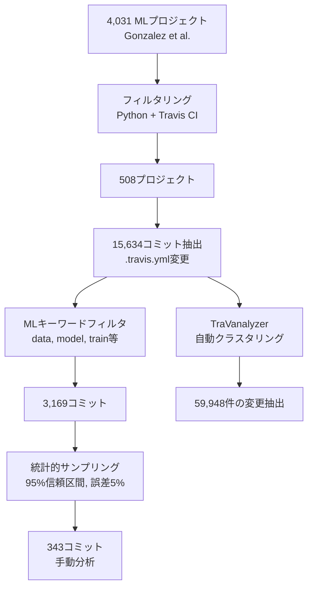
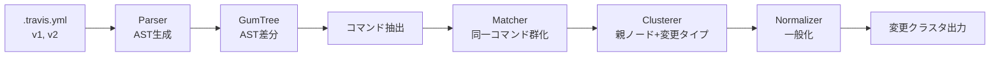
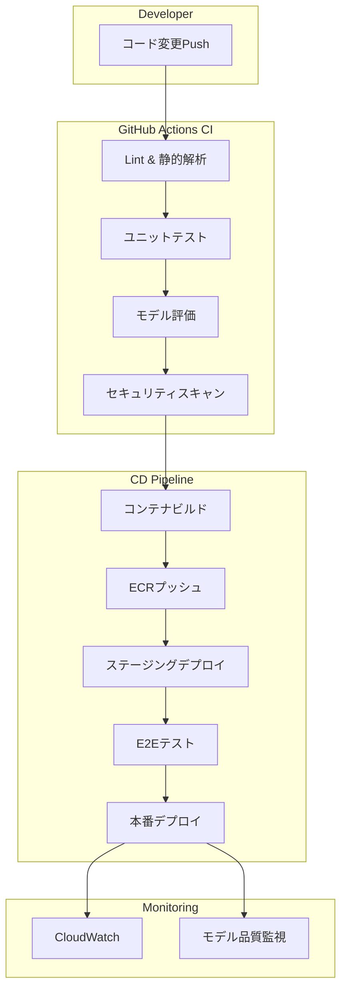

## 論文概要

本記事は [Empirical Analysis on CI/CD Pipeline Evolution in Machine Learning Projects](https://arxiv.org/abs/2403.12199) の解説記事です。

著者ら（Rzig, Houerbi, Chavan, Hassan; University of Michigan - Dearborn）は、MLプロジェクトにおけるCI/CDパイプラインがどのように進化するかを初めて体系的に調査した実証研究を報告している。508のオープンソースMLプロジェクトから抽出した15,634コミットを対象に、343コミットの手動分析とCI/CD構成変更のクラスタリングツール（TraVanalyzer）による自動分析を実施し、14種類の共変化カテゴリの分類体系を構築した。著者らは、MLプロジェクトのCI/CD進化が一般的なOSSプロジェクトとは異なるパターンを示すことを明らかにしている。

## この記事について

この記事は [OllamaオンプレLLMのモデルCI/CD構築 GitHub Actions×自動評価で安全にモデル更新](https://zenn.dev/0h_n0/articles/8318f1309a4f18) の深掘りです。Zenn記事ではLLMモデルのCI/CDパイプラインを実装する方法を解説していますが、本論文はMLプロジェクトにおけるCI/CD構成がどのように進化し、どのような問題を抱えているかを実証的に分析した基盤研究です。

## 情報源

- **論文**: Rzig, D. E., Houerbi, A., Chavan, R. G., & Hassan, F. (2024). Empirical Analysis on CI/CD Pipeline Evolution in Machine Learning Projects. arXiv:2403.12199 [cs.SE]
- **初版投稿日**: 2024年3月18日（v4: 2025年2月23日）
- **ライセンス**: CC BY-NC-ND 4.0

## 背景と動機

CI/CD（継続的インテグレーション/継続的デリバリー）は、ソフトウェア開発において品質保証と迅速なリリースを両立するための基盤技術として広く普及している。従来のソフトウェアプロジェクトにおけるCI/CD構成の進化については、Zampettiら（2021）やMcIntoshら（2011）による研究が存在する。

しかし、MLプロジェクトは従来のソフトウェアとは異なる特性を持つ。モデルの学習・評価に計算資源を大量に消費し、データのバージョン管理が必要であり、モデルの品質評価指標も従来のテストカバレッジとは異なる。著者らは、このようなML固有の特性がCI/CDパイプラインの進化にどう影響するかについて、体系的な研究が存在しなかったと指摘している（論文Section 1）。

Gonzalezら（2020）のGitHub上のMLプロジェクト10年間の調査や、Rzigら（2022）のML開発におけるCI導入率とビルド失敗の研究が先行研究として挙げられるが、CI/CD構成の進化パターンそのものに焦点を当てた研究は本論文が初めてである。

## 主要な貢献

著者らは以下の4つの貢献を報告している（論文Section 1）。

- **RQ1**: MLプロジェクトにおけるCI/CDパイプラインの進化パターンの特定（61.8%がビルドポリシー変更）
- **RQ2**: CI/CDとMLコンポーネント間の共変化パターンの分類体系（14カテゴリ）の構築
- **RQ3**: 15,634コミットから59,948件の変更を抽出するクラスタリングツール（TraVanalyzer）の開発
- **RQ4**: 開発者の経験レベルとCI/CD構成変更の相関分析（Spearman相関: 0.86）

## 技術的詳細

### 研究手法

著者らの分析手法は、手動分析と自動クラスタリングの2段階で構成される。



プロジェクト選定では、Gonzalezらの4,031 MLプロジェクトデータセットからPythonを主言語としTravis CIを使用する508プロジェクトを抽出している（論文Section 3.1）。手動分析の343コミットは、3,169コミットから95%信頼区間・誤差率5%で統計的にサンプリングされたものである。手動ラベリングは2名のDevOps専門家が実施し、評価者間一致度はCohenのカッパ係数でRQ1が0.72、RQ2が0.65と報告されている（論文Section 3.2）。

### 14カテゴリの共変化分類体系

著者らはCI/CDとMLコンポーネントの共変化を以下の14カテゴリに分類している（論文Section 4.2, Table記載の割合）。

| カテゴリ | 割合 | 説明 |
|---------|------|------|
| Testing | 21.00% | MLモデルのテスト作成・更新 |
| Dependency Management | 20.31% | 依存パッケージの追加・更新 |
| Documentation | 8.73% | README、APIドキュメント更新 |
| Bug Fixing | 8.64% | バグの修正 |
| Refactoring | 7.46% | 外部動作を変えないコード構造改善 |
| Code Cleanup | 6.87% | 不要コード・変数の除去 |
| Model Training | 6.08% | モデル学習・ファインチューニング |
| Pipeline Automation | 5.69% | CI/CD内の自動化スクリプト導入 |
| Integration | 5.50% | 外部システム・サービスとの接続 |
| Feature Development | 4.81% | 新規ML機能の追加 |
| Performance Optimization | 2.65% | モデルまたはCI/CDのパフォーマンス最適化 |
| Deployment | 1.57% | 本番環境へのモデルデプロイ |
| Security | 0.39% | セキュリティ脆弱性の対応 |
| Model and Data Versioning | 0.29% | データ・モデルのバージョン管理 |

特筆すべきは、Deployment（1.57%）とModel and Data Versioning（0.29%）の割合が極めて低い点であり、著者らはMLプロジェクトにおけるデプロイ自動化とバージョン管理の未成熟さを示す結果だと指摘している。

### TraVanalyzer: 変更クラスタリングツール

TraVanalyzerは `.travis.yml` ファイルの変更を自動分析するツールである。



Travis CI設定ファイルからAST（抽象構文木）を生成し、GumTreeアルゴリズムでバージョン間のノードレベル差分を計算する。抽出されたコマンドをパラメータを無視して同一コマンド名でマッチングし、親ノード名（Travis CIキーワード）と変更タイプに基づいてクラスタリングを行う（論文Section 3.3）。

### アソシエーションルール分析

著者らは共変化パターン間の関連性を定量化するためにアソシエーションルール分析を実施している（論文Section 4.2）。

| 先行条件 | 結果 | Support | Confidence |
|---------|------|---------|------------|
| Feature Development | Testing | 0.10 | 0.75 |
| Pipeline Automation | Testing | 0.12 | 0.72 |
| Integration | Testing | 0.11 | 0.71 |
| Documentation | Dependency Management | 0.18 | 0.71 |
| Pipeline Automation | Dependency Management | 0.11 | 0.67 |
| Model Training | Testing | 0.11 | 0.66 |

Feature Developmentの75%でTestingが同時に変更されるという高い信頼度が報告されている。

## 実装のポイント

本論文の知見からMLプロジェクトのCI/CD設計で注意すべき実装上のポイントを整理する。

**依存関係管理の外部化**: 著者らは、`.travis.yml`（あるいは現在のGitHub Actions workflow）内に直接 `pip install` を記述するのではなく、`requirements.txt` や `pyproject.toml` に外部化すべきと指摘している。これにより依存関係の可視性が向上し、CI/CD構成の肥大化を防ぐことができる。

**テストフレームワークの自動検出機能活用**: pytest や nosetests の自動検出機能を活用し、CI/CD構成ファイルにテストコマンドを直接記述する代わりにフレームワークの規約に従うべきとされている。

**キャッシュ戦略の導入**: 論文によるとキャッシュ関連の変更は661件にとどまり、MLプロジェクトの計算集約的な性質を考慮すると十分に活用されていないと著者らは報告している（論文Section 4.3）。

**非推奨設定の排除**: `sudo` キーの使用が960件検出されるなど、非推奨のCI/CD設定が残存している実態が明らかにされている。

## Production Deployment Guide

本論文の知見を踏まえ、MLプロジェクト向けCI/CDパイプラインの本番運用設計ガイドを示す。論文が指摘するアンチパターンを回避しつつ、実運用で求められる要件を満たすアーキテクチャを構築する。

### アーキテクチャ全体像



### Terraformによるインフラ構成

論文で指摘された「デプロイ自動化の未成熟さ」（Deployment: 1.57%）を踏まえ、IaCでデプロイパイプラインを定義する。

```hcl
# ECRリポジトリ（MLモデルコンテナ用）
resource "aws_ecr_repository" "ml_model" {
  name                 = "ml-model-serving"
  image_tag_mutability = "IMMUTABLE"

  image_scanning_configuration {
    scan_on_push = true  # 論文指摘: Security変更は0.39%と過少
  }

  encryption_configuration {
    encryption_type = "AES256"
  }

  tags = {
    Environment = "production"
    ManagedBy   = "terraform"
  }
}

# ECSタスク定義（モデルサービング用）
resource "aws_ecs_task_definition" "ml_serving" {
  family                   = "ml-model-serving"
  requires_compatibilities = ["FARGATE"]
  network_mode             = "awsvpc"
  cpu                      = 2048
  memory                   = 4096
  execution_role_arn       = aws_iam_role.ecs_execution.arn
  task_role_arn            = aws_iam_role.ecs_task.arn

  container_definitions = jsonencode([{
    name  = "model-server"
    image = "${aws_ecr_repository.ml_model.repository_url}:latest"
    portMappings = [{
      containerPort = 8080
      protocol      = "tcp"
    }]
    healthCheck = {
      command     = ["CMD-SHELL", "curl -f http://localhost:8080/health || exit 1"]
      interval    = 30
      timeout     = 5
      retries     = 3
      startPeriod = 60
    }
    logConfiguration = {
      logDriver = "awslogs"
      options = {
        "awslogs-group"         = "/ecs/ml-model-serving"
        "awslogs-region"        = var.aws_region
        "awslogs-stream-prefix" = "model"
      }
    }
  }])
}
```

### GitHub Actionsワークフロー設計

論文の知見（61.8%がビルドポリシー変更、依存管理の外部化不足）を反映したワークフロー設計を示す。

```yaml
# .github/workflows/ml-ci-cd.yml
name: ML Model CI/CD Pipeline
on:
  push:
    branches: [main]
    paths:
      - 'src/**'
      - 'models/**'
      - 'tests/**'
      - 'requirements.txt'  # 依存関係は外部ファイルで管理（論文の推奨）
  pull_request:
    branches: [main]

env:
  PYTHON_VERSION: "3.11"
  AWS_REGION: "ap-northeast-1"

jobs:
  lint-and-test:
    runs-on: ubuntu-latest
    steps:
      - uses: actions/checkout@v4

      - uses: actions/setup-python@v5
        with:
          python-version: ${{ env.PYTHON_VERSION }}
          # キャッシュ活用（論文指摘: キャッシュ変更661件と過少）
          cache: 'pip'

      # 依存関係は requirements.txt から（直接記述しない）
      - run: pip install -r requirements.txt -r requirements-dev.txt

      - name: Lint
        run: ruff check src/ tests/

      # テストフレームワークの自動検出を活用（論文の推奨）
      - name: Unit Tests
        run: pytest tests/ --tb=short -q --junitxml=test-results.xml

      - name: Upload Test Results
        if: always()
        uses: actions/upload-artifact@v4
        with:
          name: test-results
          path: test-results.xml

  model-evaluation:
    needs: lint-and-test
    runs-on: ubuntu-latest
    steps:
      - uses: actions/checkout@v4

      - uses: actions/setup-python@v5
        with:
          python-version: ${{ env.PYTHON_VERSION }}
          cache: 'pip'

      - run: pip install -r requirements.txt

      - name: Model Quality Gate
        run: |
          python scripts/evaluate_model.py \
            --metrics accuracy,latency,memory \
            --threshold-file config/quality_gates.yaml \
            --output evaluation-report.json

      - name: Upload Evaluation Report
        uses: actions/upload-artifact@v4
        with:
          name: evaluation-report
          path: evaluation-report.json

  security-scan:
    # 論文指摘: Security変更は2.33%と著しく低い
    needs: lint-and-test
    runs-on: ubuntu-latest
    steps:
      - uses: actions/checkout@v4

      - name: Dependency Security Scan
        run: pip-audit -r requirements.txt

      - name: Secret Detection
        uses: trufflesecurity/trufflehog@main
        with:
          path: ./

  deploy:
    if: github.ref == 'refs/heads/main' && github.event_name == 'push'
    needs: [model-evaluation, security-scan]
    runs-on: ubuntu-latest
    environment: production
    steps:
      - uses: actions/checkout@v4

      - uses: aws-actions/configure-aws-credentials@v4
        with:
          role-to-arn: ${{ secrets.AWS_ROLE_ARN }}
          aws-region: ${{ env.AWS_REGION }}

      - uses: aws-actions/amazon-ecr-login@v2
        id: ecr-login

      - name: Build and Push Container
        env:
          ECR_REGISTRY: ${{ steps.ecr-login.outputs.registry }}
          IMAGE_TAG: ${{ github.sha }}
        run: |
          docker build -t $ECR_REGISTRY/ml-model-serving:$IMAGE_TAG .
          docker push $ECR_REGISTRY/ml-model-serving:$IMAGE_TAG

      - name: Deploy to ECS
        run: |
          aws ecs update-service \
            --cluster ml-production \
            --service ml-model-serving \
            --force-new-deployment
```

### モニタリングとアラート設計

論文で「Performance Optimization」が2.65%にとどまると報告されていることを踏まえ、パフォーマンス監視を組み込む。主要な監視項目は以下の通りである。

- **推論レイテンシ監視**: CloudWatch Metric Alarmで `model_inference_latency_p99` が500msを超過した場合にSNSで通知
- **モデル品質ドリフト検知**: `model_accuracy` が閾値（例: 0.85）を下回った場合にアラート発火
- **リソース使用率**: ECS Fargateタスクの CPU/メモリ使用率をダッシュボードで可視化

### コストチェックリスト

MLプロジェクトのCI/CDパイプラインは計算集約的であるため、コスト管理が重要である。

| 項目 | 確認事項 | 推定月額コスト |
|------|---------|-------------|
| GitHub Actions | ML評価ジョブの実行時間上限設定 | $50-200（使用量依存） |
| ECR | イメージライフサイクルポリシー設定 | $5-20 |
| ECS Fargate | タスク数とCPU/メモリのライトサイジング | $100-500 |
| CloudWatch | ログ保持期間の適切な設定 | $10-50 |
| データ転送 | リージョン間転送の最小化 | $20-100 |
| S3（モデル保存） | ライフサイクルルールによる古いモデルの自動移行 | $10-50 |

**コスト最適化の要点**: キャッシュの徹底活用（論文で指摘されたキャッシュ活用不足の改善）、モデル変更がない場合の評価ジョブスキップ、学習ジョブへのスポットインスタンス活用、全ジョブへの `timeout-minutes` 設定による暴走防止。

## 実験結果

### RQ1: CI/CDパイプラインの進化パターン

著者らは、343コミットの手動分析から以下の分布を報告している（論文Section 4.1）。

- **Build Policy**: 61.8%
- **Maintainability**: 13.7%
- **Infrastructure**: 9.32%
- **Performance**: 8.45%
- **Security**: 2.33%
- **Dashboard/Notifications**: 2.33%
- **Build Process Organization**: 2.04%

著者らは、一般的なOSSプロジェクトではPerformanceとMaintainabilityが上位を占めるのに対し、MLプロジェクトではBuild Policyが圧倒的に多い点を特徴的だと指摘している。この偏りは、依存パッケージの頻繁な変更やインストールポリシーの調整が常態化していることを示すと著者らは述べている。

### RQ3: 変更パターンのクラスタリング

TraVanalyzerによる15,634コミットの自動分析では、59,948件の変更が抽出された（論文Section 4.3）。主な変更カテゴリは以下の通りである。

- **環境変数設定（env key）**: 5,183件
- **Pythonバージョン更新**: 頻繁な変更
- **非推奨sudo設定**: 960件（セキュリティアンチパターン）
- **キャッシュ設定**: 661件

### RQ4: 開発者の経験レベルとCI/CD変更

1,951名の開発者を分析した結果、開発者の経験レベル（コミット頻度で代理指標化）とCI/CD構成変更の関与度に強い正の相関が確認されている（論文Section 4.4）。

$$\rho_{\text{Spearman}} = 0.86 \quad (p < 0.001)$$

$$\tau_{\text{Kendall}} = 0.68 \quad (p < 0.001)$$

この結果は、CI/CD構成の変更が一部の経験豊富な開発者に集中していることを示しており、著者らはMLコミュニティ全体でのCI/CD知識の不足を示唆する結果だと解釈している。

## 実運用への応用

本論文の知見はMLプロジェクトのCI/CD設計に直接的な示唆を与える。

**依存管理の標準化**: 論文で最も多く報告されたBuild Policy変更（61.8%）の主因は依存パッケージ管理である。`pyproject.toml` や `requirements.txt` への外部化、依存バージョンのピン留め、Dependabotによる自動更新を組み合わせることで、CI/CD構成の変更頻度を削減できる。

**テスト自動化の改善**: Testing（21.00%）とDependency Management（20.31%）が共変化カテゴリの上位を占めることから、テスト設定の変更がCI/CD構成変更の大きな要因となっている。pytestの自動検出機能やconftest.pyによるフィクスチャ管理を活用し、CI/CD構成からテスト定義を分離すべきである。

**セキュリティの組み込み**: Security変更が0.39%（共変化分析）、2.33%（CI/CD構成分析）と極めて低い現状は、ShiftLeft型のセキュリティ統合が必要であることを示している。pip-audit、Snyk、TruffleHogなどのツールをパイプラインに組み込む必要がある。

**デプロイ自動化**: Deployment（1.57%）の低さは、手動デプロイが依然として主流であることを示唆している。Blue/Greenデプロイやカナリアリリースをパイプラインに組み込むことで、モデル更新のリスクを低減できる。OllamaベースのLLMサービングにおいても、自動評価ゲートを通過した場合のみデプロイを実行する仕組みが有効である。

## 関連研究

著者らが言及している主要な関連研究を以下に示す。

- **Zampetti et al. (2021)**: 一般的なOSSプロジェクトにおけるCI/CD再構成行為の分類体系を構築。本論文はこの分類体系をMLプロジェクトに適用・拡張している
- **Gonzalez et al. (2020)**: GitHub上のMLプロジェクト10年間の開発状態調査。本論文のプロジェクト選定の基盤データセット（4,031プロジェクト）を提供
- **Rzig et al. (2022)**: MLプロジェクトにおけるCI導入率とビルド失敗の分析。本論文と同じ著者グループによる先行研究
- **McIntosh et al. (2011)**: ビルドシステムの進化と開発者の労力に関する研究
- **Barrak et al. (2021)**: DVC（Data Version Control）ファイルの共変化分析
- **Karlas et al. (2020)**: 従来のCIがMLプロジェクトのテストに不十分であるという課題の指摘

## まとめ

本論文は、508のMLオープンソースプロジェクトを対象に、CI/CDパイプラインの進化パターンを初めて体系的に分析した研究である。著者らは、MLプロジェクトでは61.8%のコミットがビルドポリシー変更に集中し、パフォーマンス最適化（8.45%）やセキュリティ（2.33%）への関心が低いことを明らかにしている。また、14種類の共変化カテゴリの分類体系と変更クラスタリングツール（TraVanalyzer）は、今後のMLOps研究の基盤となるものである。

実務的には、依存管理の外部化、テストフレームワークの自動検出活用、セキュリティの組み込み、デプロイ自動化の4点が改善の優先事項として導出される。これらの知見は、Zenn記事で解説したOllamaオンプレLLMのCI/CDパイプライン設計においても、構成変更の頻度削減とパイプラインの安定性向上に直接活用できる。

## 参考文献

1. Rzig, D. E., Houerbi, A., Chavan, R. G., & Hassan, F. (2024). Empirical Analysis on CI/CD Pipeline Evolution in Machine Learning Projects. arXiv:2403.12199.
2. Zampetti, F., et al. (2021). CI/CD restructuring actions in OSS projects. *Empirical Software Engineering*.
3. Gonzalez, D., et al. (2020). The State of the ML-universe: 10 Years of Artificial Intelligence & Machine Learning Software Development on GitHub. *MSR 2020*.
4. McIntosh, S., et al. (2011). An empirical study of build maintenance effort. *ICSE 2011*.
5. Barrak, A., et al. (2021). Co-evolution of ML pipelines and source code. *ASE 2021*.
6. Karlas, B., et al. (2020). Building Continuous Integration Services for Machine Learning. *KDD 2020*.
7. Rzig, D. E., et al. (2022). Characterizing the Usage of CI Tools in ML Projects. *SANER 2022*.
