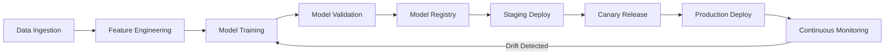

本記事は [https://arxiv.org/abs/2405.09819](https://arxiv.org/abs/2405.09819) の解説記事です。

## 論文概要（Abstract）

Liang, Song, Zhan, Chen, Yuanらによる本論文は、MLモデルの訓練自動化・デプロイメント・継続的監視をソフトウェアエンジニアリングと統合するMLOpsの体系的アプローチを提案している。著者らは、CI/CDパイプラインをML固有の要件に適応させる障壁を分析し、コンテナ化・バージョン管理・自動テストによる解決策を提示している。Netflixの大規模MLOps実装を事例として、提案フレームワークの実用性を検証している。

この記事は [Zenn記事: OllamaオンプレLLMのモデルCI/CD構築 GitHub Actions×自動評価で安全にモデル更新](https://zenn.dev/0h_n0/articles/8318f1309a4f18) の深掘りです。

## 情報源

- **arXiv ID**: 2405.09819
- **URL**: [https://arxiv.org/abs/2405.09819](https://arxiv.org/abs/2405.09819)
- **著者**: Penghao Liang, Bo Song, Xiaoan Zhan, et al.
- **発表年**: 2024
- **分野**: cs.SE（ソフトウェア工学）, cs.LG（機械学習）

## 背景と動機（Background & Motivation）

MLモデルの本番導入は従来のデプロイメントと本質的に異なる。著者らは、従来のCI/CDがコード変更のみを対象とするのに対し、MLシステムではデータ・モデル・コードの三つの変更軸が存在すると指摘している。

以下の課題が実務で頻発していると著者らは述べている。

1. **再現性の欠如**: 訓練環境と本番環境の差異により、同一コードでも異なる推論結果が生じる
2. **モデルドリフト**: デプロイ後にデータ分布が変化し、精度が劣化する（concept drift / data drift）
3. **デプロイメントの複雑さ**: GPUドライバ、CUDA、依存ライブラリのバージョン不整合による障害
4. **監視の不足**: 従来のインフラ監視ではモデル固有のメトリクス（精度・公平性・遅延）を捕捉できない

著者らは、これらがMLプロジェクトの本番化率の低さに直結すると主張し、ソフトウェアエンジニアリングとML運用を統合するフレームワークの必要性を論じている。

## 主要な貢献（Key Contributions）

著者らは以下の4つの貢献を主張している。

- **自動化モデル訓練フレームワーク**: バージョン管理システム（Git）とMLパイプラインを統合し、データ・コード・モデル・ハイパーパラメータの全履歴を追跡可能にする仕組みの提案。DVC（Data Version Control）やMLflowとの連携パターンを含む
- **CI/CDパイプライン統合手法**: ML固有の障壁（非決定性、長時間の訓練、大容量アーティファクト）を克服するためのコンテナ化戦略と環境バージョニングの設計指針
- **継続的監視メカニズム**: デプロイ後のモデル性能を自動的に監視し、精度劣化を検知して再訓練をトリガーするフィードバックループの設計
- **産業実践の体系化**: Netflixの大規模MLOps実装をケーススタディとして分析し、理論と実践のギャップを橋渡しするベストプラクティスの抽出

## 技術的詳細（Technical Details）

### MLOpsパイプラインアーキテクチャ

著者らが提案するMLOpsパイプラインは、以下の3つのフェーズから構成される。



### バージョン管理と再現性

著者らは、MLシステムの再現性を確保するために、以下の要素を全てバージョン管理下に置くべきだと主張している。

$$
\text{ML\_Artifact} = f(\mathcal{D}, \mathcal{C}, \mathcal{H}, \mathcal{E})
$$

ここで、
- $\mathcal{D}$: データセット（バージョン・前処理パイプラインを含む）
- $\mathcal{C}$: ソースコード（モデル定義・訓練スクリプト）
- $\mathcal{H}$: ハイパーパラメータ（学習率、バッチサイズ等）
- $\mathcal{E}$: 実行環境（依存ライブラリ、ランタイムバージョン）

この4要素のいずれかが変わればアーティファクトも変わるため、全てを追跡可能にすることで初めて再現性が担保されると著者らは述べている。

### コンテナ化によるCI/CD統合

従来のCI/CDパイプラインにMLワークロードを統合する際の主要な障壁として、著者らは以下を挙げている。

1. **訓練時間の長さ**: 数時間から数日かかる訓練を通常のCIジョブと同列に扱えない
2. **非決定性**: 同一コード・データでも乱数シードやGPU演算順序により結果が異なる
3. **アーティファクトサイズ**: モデルファイルが数GBに達し、通常のアーティファクトストレージでは対応困難

著者らはDockerコンテナ化と環境バージョニングの組み合わせを解決策として提案している。

```python
from dataclasses import dataclass
from typing import Any


@dataclass(frozen=True)
class PipelineConfig:
    """MLパイプラインの再現性を担保する設定クラス"""

    data_version: str          # DVCで管理されるデータバージョン
    code_commit: str           # Gitコミットハッシュ
    base_image: str            # Dockerベースイメージ（CUDA含む）
    python_version: str
    requirements_hash: str     # requirements.txtのSHA256ハッシュ
    hyperparams: dict[str, Any]
    random_seed: int           # 再現性のためのシード値


def validate_environment(config: PipelineConfig) -> bool:
    """実行環境がPipelineConfigと一致するか検証する"""
    # コンテナ内のランタイムと設定の一致を検証
    # 不一致時はCI/CDパイプラインを停止
    ...
```

### 継続的監視とモデルドリフト検知

著者らは、デプロイ後のモデル性能監視において、以下の指標を追跡すべきだと述べている。

モデルの予測精度の変化を検知するために、著者らはPSI（Population Stability Index）を用いた分布シフトの定量化を提案している。

$$
\text{PSI} = \sum_{i=1}^{k} (p_i - q_i) \cdot \ln\left(\frac{p_i}{q_i}\right)
$$

ここで、
- $p_i$: 本番データにおけるビン$i$の割合
- $q_i$: 訓練データにおけるビン$i$の割合
- $k$: ビン数

著者らは、PSI > 0.2 の場合にモデルの再訓練を推奨するとしている。この閾値は業界標準として広く採用されている値である。

## 実装のポイント（Implementation）

著者らの提案を実際のMLOpsパイプラインに適用する際の重要なポイントを以下にまとめる。

**データバージョニング**: Git LFSやDVCを用いて、大容量のデータセットとモデルアーティファクトをバージョン管理する。論文では、DVCによるデータリネージの追跡が再現性確保の鍵であると述べられている。

**コンテナイメージ戦略**: ベースイメージにCUDAランタイムを含め、アプリケーション層のみを差分ビルドすることで、ビルド時間を短縮する。著者らは、マルチステージビルドを推奨し、訓練用イメージと推論用イメージを分離する設計を提案している。

**テスト戦略**: 従来の単体テストに加え、データ検証テスト（スキーマ検証、分布チェック）とモデル検証テスト（精度閾値、推論遅延、メモリ使用量）をCIパイプラインに組み込むことを著者らは推奨している。

**段階的デプロイ**: カナリアリリースやA/Bテストにより、新モデルを段階的に本番トラフィックに公開し、問題発生時に即座にロールバックできる設計が必要だと著者らは述べている。

## Production Deployment Guide

本論文はMLOpsのデプロイ自動化を直接扱っており、著者らの提案をAWS上で実現するための構成を以下に示す。

### AWS実装パターン（コスト最適化重視）

著者らが提案するMLOpsパイプラインをAWSで実装する場合、トラフィック量に応じた3つの構成を推奨する。

| 構成 | トラフィック | 主要サービス | 月額コスト概算 |
|------|------------|-------------|--------------|
| Small | ~100 req/日 | Lambda + ECR + S3 + Step Functions | $50-150 |
| Medium | ~1000 req/日 | ECS Fargate + ECR + SageMaker | $300-800 |
| Large | 10000+ req/日 | EKS + Karpenter + SageMaker Pipelines | $2,000-5,000 |

**Small構成**: Lambda推論 + Step Functions訓練オーケストレーション。月額内訳はLambda（$5-10）、S3（$5-20）、Step Functions（$5-10）、ECR（$5-10）、CloudWatch（$10-20）程度。

**Medium構成**: ECS Fargateサービング + SageMaker Training Jobs。月額内訳はFargate（$100-300）、SageMaker（$50-200）、NAT Gateway（$45）、その他（$30-60）程度。

**Large構成**: EKS + Karpenter + Spot Instances（最大90%削減）+ SageMaker Pipelinesでフルパイプライン構築。

**注意**: 上記は2026年8月時点のap-northeast-1料金に基づく概算値。AWS Pricing Calculatorでの確認を推奨する。

### Terraformインフラコード

#### Small構成（Serverless: Lambda + Step Functions）

```hcl
# MLOps Pipeline - Small構成（Serverless） / 月額 $50-150
terraform {
  required_version = ">= 1.9"
  required_providers {
    aws = { source = "hashicorp/aws", version = "~> 5.60" }
  }
}

provider "aws" { region = "ap-northeast-1" }

# S3: モデルアーティファクト（KMS暗号化 + バージョニング）
resource "aws_s3_bucket" "ml_artifacts" {
  bucket = "mlops-artifacts-${data.aws_caller_identity.current.account_id}"
}
resource "aws_s3_bucket_server_side_encryption_configuration" "ml_artifacts" {
  bucket = aws_s3_bucket.ml_artifacts.id
  rule { apply_server_side_encryption_by_default { sse_algorithm = "aws:kms" } }
}
resource "aws_s3_bucket_versioning" "ml_artifacts" {
  bucket = aws_s3_bucket.ml_artifacts.id
  versioning_configuration { status = "Enabled" }
}

# IAMロール: 最小権限（S3モデル読取のみ）
resource "aws_iam_role" "lambda_inference" {
  name = "mlops-lambda-inference"
  assume_role_policy = jsonencode({
    Version = "2012-10-17"
    Statement = [{ Action = "sts:AssumeRole", Effect = "Allow",
      Principal = { Service = "lambda.amazonaws.com" } }]
  })
}

# Lambda: コンテナイメージベースの推論関数
resource "aws_lambda_function" "inference" {
  function_name = "mlops-inference"
  package_type  = "Image"
  image_uri     = "${aws_ecr_repository.inference.repository_url}:latest"
  role          = aws_iam_role.lambda_inference.arn
  timeout       = 60
  memory_size   = 1024
  environment {
    variables = { MODEL_BUCKET = aws_s3_bucket.ml_artifacts.id }
  }
}

# ECR: イミュータブルタグ + 脆弱性スキャン
resource "aws_ecr_repository" "inference" {
  name                 = "mlops-inference"
  image_tag_mutability = "IMMUTABLE"
  image_scanning_configuration { scan_on_push = true }
}

# CloudWatch: 異常呼び出し検知
resource "aws_cloudwatch_metric_alarm" "lambda_cost" {
  alarm_name          = "mlops-lambda-spike"
  comparison_operator = "GreaterThanThreshold"
  evaluation_periods  = 1
  metric_name         = "Invocations"
  namespace           = "AWS/Lambda"
  period              = 3600
  statistic           = "Sum"
  threshold           = 1000
  dimensions = { FunctionName = aws_lambda_function.inference.function_name }
}

data "aws_caller_identity" "current" {}
```

#### Large構成（Container: EKS + Karpenter）

```hcl
# MLOps Pipeline - Large構成 / 月額 $2,000-5,000（Spot活用時）
module "eks" {
  source  = "terraform-aws-modules/eks/aws"
  version = "~> 20.24"
  cluster_name    = "mlops-cluster"
  cluster_version = "1.30"
  vpc_id     = module.vpc.vpc_id
  subnet_ids = module.vpc.private_subnets
  cluster_endpoint_public_access = false
  eks_managed_node_groups = {
    system = { instance_types = ["m7i.large"], min_size = 2, max_size = 3, desired_size = 2 }
  }
}

# Karpenter: Spot優先GPU自動スケーリング
resource "kubectl_manifest" "karpenter_nodepool" {
  yaml_body = yamlencode({
    apiVersion = "karpenter.sh/v1", kind = "NodePool"
    metadata = { name = "ml-inference" }
    spec = {
      template = { spec = {
        requirements = [
          { key = "karpenter.sh/capacity-type", operator = "In", values = ["spot", "on-demand"] },
          { key = "node.kubernetes.io/instance-type", operator = "In",
            values = ["g5.xlarge", "g5.2xlarge", "g6.xlarge"] },
        ]
        nodeClassRef = { group = "karpenter.k8s.aws", kind = "EC2NodeClass", name = "default" }
      } }
      limits     = { cpu = "100", memory = "400Gi" }
      disruption = { consolidationPolicy = "WhenEmptyOrUnderutilized", consolidateAfter = "30s" }
    }
  })
}

# AWS Budgets: 月額$5,000アラート（80%閾値）
resource "aws_budgets_budget" "mlops_monthly" {
  name = "mlops-monthly-budget"
  budget_type = "COST", limit_amount = "5000", limit_unit = "USD", time_unit = "MONTHLY"
  notification {
    comparison_operator = "GREATER_THAN", threshold = 80
    threshold_type = "PERCENTAGE", notification_type = "ACTUAL"
    subscriber_email_addresses = ["ml-ops-team@example.com"]
  }
}

resource "aws_kms_key" "mlops" {
  description = "MLOps encryption key"
  enable_key_rotation = true
}
```

### 運用・監視設定

#### CloudWatch Logs Insights クエリ

```
# 推論レイテンシ分析（P95, P99）
fields @timestamp, @message | filter @message like /inference_latency/
| stats percentile(latency_ms, 95) as p95, percentile(latency_ms, 99) as p99 by bin(1h)

# モデルドリフト検知（PSI > 0.2 で再訓練トリガー）
fields @timestamp, psi_score, feature_name | filter psi_score > 0.2 | sort psi_score desc
```

#### CloudWatchアラーム・X-Ray設定

```python
import boto3
from aws_xray_sdk.core import xray_recorder, patch_all

patch_all()  # boto3, requests等を自動計装


def create_model_drift_alarm(
    model_name: str, psi_threshold: float = 0.2, sns_topic_arn: str = "",
) -> dict:
    """モデルドリフト検知用CloudWatchアラームを作成する

    Args:
        model_name: 監視対象モデル名
        psi_threshold: PSIアラーム閾値（0.2超で再訓練推奨）
        sns_topic_arn: 通知先SNSトピックARN

    Returns:
        作成されたアラームの情報
    """
    cw = boto3.client("cloudwatch", region_name="ap-northeast-1")
    return cw.put_metric_alarm(
        AlarmName=f"mlops-{model_name}-drift",
        MetricName="PSIScore",
        Namespace="MLOps/ModelMonitoring",
        Statistic="Maximum",
        Period=3600,
        EvaluationPeriods=1,
        Threshold=psi_threshold,
        ComparisonOperator="GreaterThanThreshold",
        AlarmActions=[sns_topic_arn],
        Dimensions=[{"Name": "ModelName", "Value": model_name}],
    )


@xray_recorder.capture("model_inference")
def run_inference(model_name: str, input_data: dict) -> dict:
    """X-Rayトレーシング付きモデル推論"""
    subsegment = xray_recorder.current_subsegment()
    subsegment.put_annotation("model_name", model_name)
    subsegment.put_metadata("input_shape", str(len(input_data)))
    result = {"prediction": "...", "confidence": 0.95}
    subsegment.put_metadata("confidence", result["confidence"])
    return result
```

#### Cost Explorer日次レポート

```python
import boto3
from datetime import datetime, timedelta


def get_daily_mlops_cost(sns_topic_arn: str) -> dict:
    """MLOps関連サービスの日次コストを取得し、$100超過時にSNS通知する

    Args:
        sns_topic_arn: 通知先SNSトピックARN

    Returns:
        日次コストレポート
    """
    ce = boto3.client("ce", region_name="us-east-1")
    end = datetime.utcnow().strftime("%Y-%m-%d")
    start = (datetime.utcnow() - timedelta(days=1)).strftime("%Y-%m-%d")

    response = ce.get_cost_and_usage(
        TimePeriod={"Start": start, "End": end},
        Granularity="DAILY",
        Metrics=["UnblendedCost"],
        Filter={"Or": [
            {"Dimensions": {"Key": "SERVICE", "Values": [svc]}}
            for svc in ["Amazon Elastic Kubernetes Service", "AWS Lambda",
                        "Amazon SageMaker", "Amazon ECR"]
        ]},
        GroupBy=[{"Type": "DIMENSION", "Key": "SERVICE"}],
    )
    total = sum(
        float(g["Metrics"]["UnblendedCost"]["Amount"])
        for r in response["ResultsByTime"] for g in r["Groups"]
    )
    if total > 100:
        boto3.client("sns", region_name="ap-northeast-1").publish(
            TopicArn=sns_topic_arn,
            Subject=f"MLOps日次コスト警告: ${total:.2f}",
            Message=f"日次コストが$100を超過: ${total:.2f}",
        )
    return {"date": start, "total_cost": total}
```

### コスト最適化チェックリスト

**アーキテクチャ選択**:
- [ ] トラフィック量で構成選択（~100: Serverless、~1000: Hybrid、10000+: Container）
- [ ] 推論と訓練ワークロードの分離

**リソース最適化**:
- [ ] Spot Instances優先（最大90%削減）
- [ ] Reserved Instances: 安定ワークロード向け1年コミット（最大72%削減）
- [ ] Lambda: Power Tuningでメモリサイズ最適化
- [ ] EKS: Karpenterで未使用ノード自動回収（30秒）
- [ ] Savings Plans検討

**MLワークロード固有**:
- [ ] SageMaker Spot Training Jobs（最大90%削減）
- [ ] Multi-Model Endpointでリソース共有
- [ ] モデル量子化（FP32→FP16/INT8）で推論コスト半減
- [ ] バッチ推論ではBatch Transform使用

**監視・アラート**:
- [ ] AWS Budgets: 月次予算アラート（80%・100%閾値）
- [ ] CloudWatch: 推論回数・レイテンシ・エラー率
- [ ] Cost Anomaly Detection有効化
- [ ] Cost Explorer日次レポート + SNS通知

**リソース管理**:
- [ ] 未使用SageMakerエンドポイント定期削除
- [ ] タグ戦略: `project`, `environment`, `team`
- [ ] S3ライフサイクル: 90日後Glacier移行
- [ ] 開発環境夜間停止（EventBridge + Lambda）
- [ ] ECRライフサイクル: 古いイメージ自動削除

## 実験結果（Results）

### Netflixケーススタディ

著者らは、Netflixの大規模MLOps実装を事例として分析し、提案フレームワークの有効性を検証している。

Netflixでは推薦システム・コンテンツ最適化・異常検知など多数のMLモデルが稼働しており、以下のプラクティスが導入されていると著者らは報告している。

| プラクティス | Netflix実装 | 著者らの提案との対応 |
|------------|------------|-------------------|
| バージョニング | Metaflow + S3 | バージョン管理フレームワーク |
| コンテナ化 | Docker + Titus | コンテナ化CI/CD統合 |
| A/Bテスト | 独自基盤 | 段階的デプロイ |
| 監視 | 独自システム | 継続的監視メカニズム |

著者らは以下の知見を抽出している: (1) Metaflowによるパイプライン標準化でデータサイエンティストがインフラを意識せずにワークフローを定義可能、(2) モデル異常時の自動フォールバック切替が不可欠、(3) 数百モデルの同時運用にはリソース管理の自動化が必須。

なお、本論文はNetflixとの共著ではなく公開情報に基づく分析であり、具体的な数値的改善率は明示されていない。

## 実運用への応用（Practical Applications）

本論文の提案フレームワークは、Zenn記事で実装されているOllamaオンプレLLMのCI/CDパイプラインと直接的な対応関係がある。

**モデルバージョニングとOllama**: Zenn記事のModelfileバージョンタグ管理 + GitHub Actions自動評価は、本論文の「自動化モデル訓練フレームワーク」の具体的な実装例と位置づけられる。

**CI/CD統合**: 著者らが指摘するML固有の障壁（長時間訓練、非決定性、大容量アーティファクト）はLLMのCI/CDでも発生する。Zenn記事のGPUランナー自動評価は、著者らのコンテナ化戦略と合致する。

**継続的監視**: PSIベースのドリフト検知をLLM出力品質に応用可能である。自動評価メトリクス（BLEU, ROUGE等）とPSIを組み合わせた監視パイプラインが有効と考えられる。

## 関連研究（Related Work）

- **Sculley et al. (2015) "Hidden Technical Debt in ML Systems"**: MLシステムの技術的負債を体系化した先駆的研究。「コードはMLシステムのごく一部」という知見が本論文の動機付けの基盤となっている
- **Amershi et al. (2019) "SE for ML: A Case Study"**: MicrosoftのML実践報告。本論文のケーススタディアプローチに影響を与えている
- **Paleyes et al. (2022) "Challenges in Deploying ML"**: MLデプロイ課題のサーベイ。本論文はこのサーベイで特定された課題への具体的解決策を提供する

## まとめと今後の展望

本論文は、バージョン管理・コンテナ化CI/CD統合・継続的監視の3つの柱でMLOpsのデプロイ自動化フレームワークを提案し、Netflixの事例で実用性を論じている。

今後の研究方向として、著者らはフェデレーテッドラーニング環境でのMLOps、エッジデプロイ自動化、公平性・説明可能性の監視統合を挙げている。LLMの台頭により、本フレームワークのLLMOpsへの拡張も重要な方向性である。

## 参考文献

- **arXiv**: [https://arxiv.org/abs/2405.09819](https://arxiv.org/abs/2405.09819)
- **Related Zenn article**: [https://zenn.dev/0h_n0/articles/8318f1309a4f18](https://zenn.dev/0h_n0/articles/8318f1309a4f18)
- Sculley, D. et al. (2015). "Hidden Technical Debt in Machine Learning Systems." NeurIPS 2015.
- Amershi, S. et al. (2019). "Software Engineering for Machine Learning: A Case Study." ICSE-SEIP 2019.
- Paleyes, A. et al. (2022). "Challenges in Deploying Machine Learning: a Survey of Case Studies." ACM Computing Surveys.
