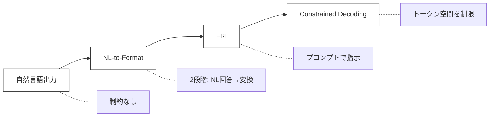
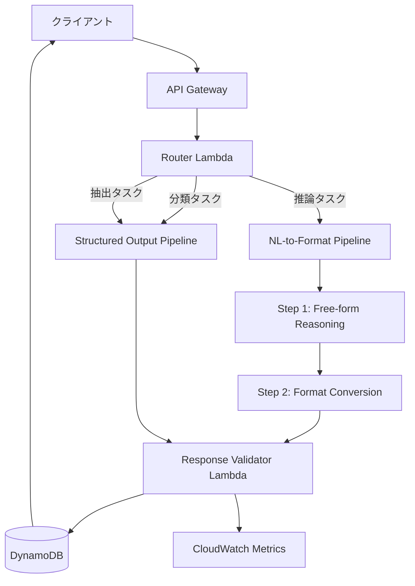
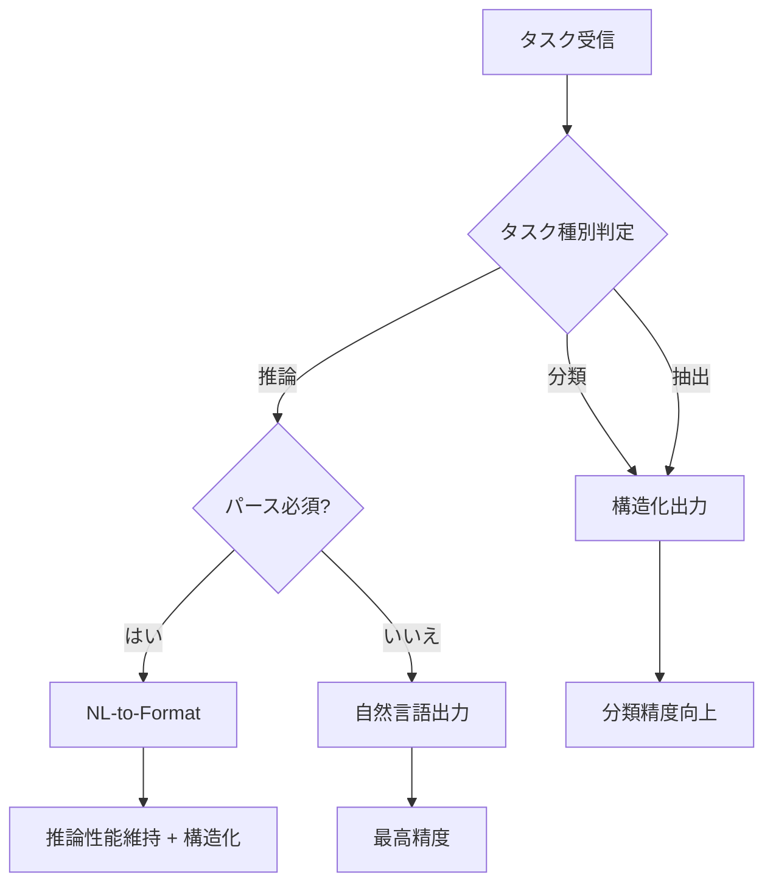

本記事は [Let Me Speak Freely? A Study on the Impact of Format Restrictions on Performance of Large Language Models](https://arxiv.org/abs/2408.02442) の解説記事です。

関連Zenn記事「[Gemini 2.5 Flash×Pydanticで画像・PDF・動画から構造化データを自動抽出する](https://zenn.dev/0h_n0/articles/c13718739ea17a)」では、GeminiとPydanticを用いた構造化データ抽出パイプラインを紹介しています。本論文は、そうした構造化出力の利便性の裏に潜む**推論能力への影響**を実証的に明らかにしたものです。構造化出力を本番システムに組み込む際に、どのようなタスクで性能低下リスクがあるかを判断するうえで不可欠な知見を提供しています。

## 論文概要（Abstract）

Tam et al. (2024) は、LLMにJSON・XML・YAMLなどの構造化フォーマットで出力させることが、推論能力および知識活用能力に与える影響を体系的に調査した。GPT-3.5-Turbo、Claude-3-Haiku、Gemini-1.5-Flash、LLaMA-3-8B、Gemma-2-9Bの5モデルに対し、数学的推論・記号推論・分類の7タスクで実験を行い、以下の主要な発見を報告している。

1. **推論タスク**ではフォーマット制約が厳しいほど性能が低下する（最大63ポイント低下）
2. **分類タスク**では逆に構造化出力が性能を向上させる場合がある
3. 性能低下の主因はパース失敗ではなく、推論プロセスそのものへの干渉である
4. NL-to-Format（自然言語で回答後にフォーマット変換）が緩和策として有効である

## 情報源

| 項目 | 内容 |
|------|------|
| 論文タイトル | Let Me Speak Freely? A Study on the Impact of Format Restrictions on Performance of Large Language Models |
| 著者 | Zhi Rui Tam, Cheng-Kuang Wu, Yi-Lin Tsai, Chieh-Yen Lin, Hung-yi Lee, Yun-Nung Chen |
| 所属 | National Taiwan University 他 |
| arXiv ID | 2408.02442 (v3: 2024年10月14日) |
| カテゴリ | cs.CL (Computation and Language) |
| URL | [https://arxiv.org/abs/2408.02442](https://arxiv.org/abs/2408.02442) |

## 背景と動機

LLMの本番システムへの統合が進む中、APIレスポンスのパース容易性を確保するために構造化出力が広く採用されている。OpenAIのJSON mode、GeminiのresponseSchema、LangChainのStructuredOutputParserなど、構造化出力を実現するツールは充実している。関連Zenn記事で紹介したPydanticによる型安全な構造化抽出も、この潮流の一例である。

実務において構造化出力が求められる理由は明快である。自然言語レスポンスをパースして後段処理に渡す場合、正規表現やルールベースのパーサーは脆弱であり、フォーマットのばらつきがパイプライン全体の信頼性を損なう。JSON-modeやPydanticによるバリデーションを組み合わせることで、型安全かつ決定論的なデータフローを構築できるため、プロダクション環境では構造化出力がデファクトスタンダードになりつつある。

しかし、従来の研究（IFEval、INFOBENCH、FOFOなど）はLLMが指定フォーマットにどの程度従えるかを評価してきたものの、**フォーマット制約がコンテンツの品質そのものに影響するか**という問いは未検証であった。IFEval（Zhou et al., 2023）はフォーマット遵守率を測定し、FOFO（Xia et al., 2024）はフォーマット遵守能力に特化したベンチマークを提供しているが、いずれも「フォーマットに従えるか」という観点に限定されている。「フォーマットに従うことで何を失うか」という逆方向の問いを立てた研究は、本論文以前にはほとんど存在しなかった。

著者らはこのギャップに着目し、「フォーマット制約は推論タスクの正確性を犠牲にしているのではないか」という仮説のもとで体系的な実験を設計した。

この問いは実務的にも重要である。構造化出力はパイプラインの信頼性を高める一方で、もし推論性能を大幅に損なうのであれば、タスクの性質に応じた使い分けが必要になるためである。特に、LLMを推論エンジンとして使用するRAGパイプラインやエージェントシステムでは、推論精度の低下がシステム全体の品質に直結する。

## 主要な貢献

著者らが報告している本論文の貢献は以下の通りである。

1. **フォーマット制約の3段階分類**: Constrained Decoding（JSON-mode）、Format-Restricting Instructions（FRI）、NL-to-Formatの3つのアプローチを制約の厳しさで体系的に分類した
2. **タスク種別ごとの影響の非対称性の発見**: 推論タスクでは性能低下、分類タスクでは性能向上という逆方向の影響を実証した
3. **性能低下メカニズムの解明**: パース失敗ではなく、推論プロセスへの構造的干渉が主因であることを示した
4. **実用的な緩和策の提案**: NL-to-Formatアプローチやスキーマ制約の緩和など、具体的な対処法を提示した

## 技術的詳細

### 実験設計

著者らは3種類のフォーマット制約アプローチを定義し、制約の厳しさの軸で実験を構成している。



**Constrained Decoding（JSON-mode）**: APIレベルでトークン生成空間を制限する最も厳しい方式。OpenAIの`response_format={"type": "json_object"}`やGeminiの`responseMimeType`に対応する。Willard & Louf (2023) やKoo et al. (2024) に基づく文脈自由文法による制約が用いられていると推定される。この方式では、各デコーディングステップにおいて文法的に許容されるトークンのみが候補に残るため、出力は必ず有効なJSON/XMLになる。その代償として、モデルの生成自由度が最も強く制限される。

**Format-Restricting Instructions（FRI）**: プロンプト内でJSON・XML・YAML形式での出力を指示する方式。スキーマ指定の有無でさらに細分化される。トークン空間自体は制限されないため、モデルは制約に従わない出力を生成する可能性がある。実務上はPydanticのバリデーションやリトライロジックと組み合わせて使用されることが多い。FRIはConstrained Decodingほど厳密ではないが、モデルがフォーマットを意識しながら生成する点で自然言語出力とは異なる。

**NL-to-Format**: まず自然言語で回答させ、その後に指定フォーマットへ変換する2段階方式。推論フェーズにフォーマット制約が介入しないため、最も緩い制約となる。API呼び出しが2回必要になるためレイテンシとコストが増加するが、推論品質を維持しつつ構造化出力を得られるという利点がある。

### 評価対象タスクと制約の分類

| カテゴリ | タスク | データソース | 評価指標 |
|----------|--------|-------------|----------|
| 推論 | GSM8K | 数学文章題 | Exact Match |
| 推論 | Last Letter Concatenation | 記号推論 | Exact Match |
| 推論 | Shuffled Objects | 状態追跡（BigBench） | Exact Match |
| 分類 | DDXPlus | 医療診断（49疾患） | Accuracy |
| 分類 | MultiFin | 金融テキスト分類（5カテゴリ） | Accuracy |
| 分類 | Sports Understanding | スポーツ文の妥当性判定（BigBench） | Accuracy |
| 分類 | NI-Task 280 | ステレオタイプ分類 | Accuracy |

出力スキーマは意図的にシンプルに設計されており、`reasoning`（推論過程）と`answer`（回答）の2つのキーのみで構成されている。これにより、スキーマの複雑さではなく、フォーマット制約そのものの影響を分離して測定している。なお、各タスクに対して3種類のタスク記述文と3種類のフォーマット指定を組み合わせた計9パターンのプロンプトで実験を行い、プロンプトの偶然的な影響を平均化している点も実験設計上の重要な工夫である。

評価にあたっては、正規表現ベースのパーサーではなくLLMベースの「完全テキストパーサー」を採用している。具体的には、Claude-3-Haikuを回答抽出用のパーサーとして使用し、GPT-4-Turboとのパーサー間一致度をCohenのkappa係数で検証した結果0.86を達成したと報告されている。これにより、パース手法の違いによる評価バイアスを排除している。

### 性能低下のメカニズム分析

著者らは性能低下の原因を以下のように分析している。

**1. キー順序効果（Key Ordering Effect）**: JSON-modeではキーの出力順序がモデルに強制される場合がある。GSM8Kタスクにおいて、GPT-3.5-TurboのJSON-modeレスポンスの100%が`answer`キーを`reason`キーより先に出力しており、Chain-of-Thought推論が行われる前に回答が確定してしまう現象が確認された。これはAutoregressive（自己回帰）モデルの本質的な特性に起因する。自己回帰モデルは左から右へトークンを逐次生成するため、`answer`が先に生成されると、その後の`reason`フィールドは既に確定した回答を正当化する事後的説明になってしまう。つまり、推論→回答という本来の認知プロセスが、回答→正当化に逆転するのである。

**2. パース失敗は主因ではない**: 性能低下の原因としてまず疑われるのは「フォーマット制約に従えずパースに失敗するケース」だが、著者らはこの仮説を明確に否定している。LLaMA-3-8BのLast Letter ConcatenationタスクでJSON形式を使用した場合、パース失敗率はわずか0.148%であるにもかかわらず、性能は自然言語の70.1%から28.0%へ42.1ポイント低下した（論文Table 3, Table 9より）。このことから、フォーマット制約は出力の構文的正しさではなく、推論プロセスそのものに干渉していると著者らは結論づけている。フォーマットを維持するために割かれる「認知的リソース」が推論に使える容量を圧迫するという解釈が示唆されている。

**3. スキーマ指定の影響**: 「JSON形式で出力してください」という緩い指示と、具体的なスキーマ（キー名・型を指定）付きの指示では、後者の方が大幅に性能を低下させる。Claude-3-HaikuのGSM8Kでは、スキーマなしの86.51%からスキーマ付きの23.44%へ63ポイント低下が観測されている（論文Table 1より）。この結果は、スキーマが詳細であるほどモデルがフォーマット遵守に注意を割く必要があり、結果として推論に使えるリソースが減少することを示唆している。実務的には、Pydanticモデルでネストの深いスキーマを指定する場合に特に注意が必要である。

**4. 分類タスクでの逆効果**: 推論タスクとは対照的に、分類タスクでは構造化出力が性能を向上させる場合がある。DDXPlusタスクでGemini-1.5-Flashは、自然言語の41.6%からJSON形式の60.3%へ約19ポイント向上した（論文Table 10より）。著者らはこれを、構造化出力が回答の自由度を制限し、定義済みカテゴリからの正確な選択を促すためと分析している。自然言語で自由に回答すると「おそらくAだと思いますが、Bの可能性もあります」のような曖昧な回答が生成されやすく、回答の抽出が困難になる。構造化出力はこの曖昧さを排除し、明確なカテゴリ選択を強制する効果がある。

## 実装のポイント

論文の知見を踏まえると、構造化出力の使用にあたっては以下の実装上の工夫が有効である。

### タスク種別に応じた出力方式の選択

```python
from enum import Enum
from dataclasses import dataclass


class TaskType(Enum):
    """タスクの種別を表す列挙型。

    論文の知見に基づき、推論タスクと分類タスクで
    最適な出力方式が異なることを反映する。
    """
    REASONING = "reasoning"
    CLASSIFICATION = "classification"
    EXTRACTION = "extraction"


class OutputStrategy(Enum):
    """LLMの出力方式を表す列挙型。

    制約の厳しさ順: CONSTRAINED > FRI > NL_TO_FORMAT > FREE_FORM
    """
    FREE_FORM = "free_form"
    NL_TO_FORMAT = "nl_to_format"
    FRI = "format_restricting_instruction"
    CONSTRAINED = "constrained_decoding"


@dataclass
class OutputConfig:
    """タスクに応じた出力方式の設定。

    Attributes:
        strategy: 採用する出力方式
        include_schema: スキーマ指定を含めるか
        reason: 方式選択の根拠
    """
    strategy: OutputStrategy
    include_schema: bool
    reason: str


def select_output_strategy(task_type: TaskType, requires_parsing: bool) -> OutputConfig:
    """タスク種別とパース要件に基づいて最適な出力方式を選択する。

    論文 "Let Me Speak Freely?" (Tam et al., 2024) の知見に基づき、
    推論タスクでは緩い制約を、分類タスクでは構造化出力を推奨する。

    Args:
        task_type: タスクの種別（推論/分類/抽出）
        requires_parsing: 後段処理でパース可能な出力が必須かどうか

    Returns:
        OutputConfig: 推奨する出力方式の設定
    """
    if task_type == TaskType.REASONING:
        if requires_parsing:
            return OutputConfig(
                strategy=OutputStrategy.NL_TO_FORMAT,
                include_schema=False,
                reason="推論タスクではNL-to-Formatで推論性能を維持しつつ構造化出力を得る",
            )
        return OutputConfig(
            strategy=OutputStrategy.FREE_FORM,
            include_schema=False,
            reason="推論タスクでパース不要なら自然言語出力が最も高精度",
        )

    if task_type == TaskType.CLASSIFICATION:
        return OutputConfig(
            strategy=OutputStrategy.FRI,
            include_schema=True,
            reason="分類タスクでは構造化出力が回答のばらつきを抑え性能向上に寄与",
        )

    # EXTRACTION: Pydanticベースの抽出はFRIが適切
    return OutputConfig(
        strategy=OutputStrategy.FRI,
        include_schema=True,
        reason="データ抽出タスクではスキーマ指定付きFRIが精度・パース両立に有効",
    )
```

### NL-to-Format方式の実装例

```python
import json
from typing import Any


async def nl_to_format_pipeline(
    llm_client: Any,
    prompt: str,
    target_schema: dict[str, Any],
    model: str = "gemini-2.5-flash",
) -> dict[str, Any]:
    """NL-to-Format方式で推論性能を維持しつつ構造化出力を得るパイプライン。

    第1段階で自然言語による推論を行い、第2段階で構造化フォーマットに変換する。
    論文のFigure 3で示されたNL-to-Formatアプローチの実装例。

    Args:
        llm_client: LLM APIクライアント（generate メソッドを持つ）
        prompt: ユーザーからの入力プロンプト
        target_schema: 変換先のJSONスキーマ定義
        model: 使用するモデル名

    Returns:
        target_schemaに準拠したJSON辞書

    Raises:
        ValueError: JSON変換に失敗した場合
    """
    # 第1段階: 自然言語で推論（フォーマット制約なし）
    reasoning_response = await llm_client.generate(
        model=model,
        prompt=f"{prompt}\n\nステップバイステップで考えて回答してください。",
        # response_format は指定しない
    )

    # 第2段階: 構造化フォーマットへ変換
    schema_str = json.dumps(target_schema, ensure_ascii=False, indent=2)
    conversion_prompt = (
        f"以下の回答を指定のJSONスキーマに変換してください。\n\n"
        f"【回答】\n{reasoning_response}\n\n"
        f"【スキーマ】\n{schema_str}\n\n"
        f"JSONのみを出力してください。"
    )
    structured_response = await llm_client.generate(
        model=model,
        prompt=conversion_prompt,
        response_format={"type": "json_object"},
    )

    try:
        return json.loads(structured_response)
    except json.JSONDecodeError as e:
        raise ValueError(f"JSON変換に失敗: {e}") from e
```

### スキーマ制約の緩和

論文の知見に基づくと、スキーマ指定の詳細度を下げることで推論性能の低下を緩和できる。以下にスキーマの厳密さと推論性能のトレードオフを示す。

```python
# 非推奨: 厳密なスキーマ指定（推論タスクで最大63pt低下）
STRICT_SCHEMA_PROMPT = """
以下のJSONスキーマに厳密に従って出力してください:
{
  "reasoning": {"type": "string", "description": "推論過程を記述"},
  "answer": {"type": "number", "description": "最終的な数値回答"}
}
"""

# 推奨: 緩いフォーマット指示（推論性能の低下を抑制）
LOOSE_FORMAT_PROMPT = """
JSON形式で回答してください。reasoningキーに推論過程を、
answerキーに回答を含めてください。
"""

# 最も推奨: 推論後に変換（推論性能を最大限維持）
NL_FIRST_PROMPT = """
ステップバイステップで推論し、最後に回答を述べてください。
"""
```

## Production Deployment Guide

構造化出力と自由形式出力を適応的に切り替えるLLMパイプラインをAWSにデプロイするための設計と実装を解説する。論文の知見から、推論タスクではフォーマット制約を緩和し、分類・抽出タスクでは構造化出力を活用するという**適応的切り替え**が性能最適化の鍵となる。

### アーキテクチャ概要



このアーキテクチャの核心は、**タスクタイプに応じたパイプラインの動的分岐**にある。Router Lambdaがリクエストの`task_type`フィールドを参照し、推論タスクはNL-to-Format方式（2段階呼び出し）を、分類・抽出タスクは直接構造化出力を使用するパイプラインに振り分ける。NL-to-Formatパイプラインでは、第1段階でフォーマット制約なしの自然言語推論を実行し、第2段階で推論結果を指定スキーマに変換する。この2段階方式により、推論精度を維持しつつパース可能な構造化出力を得ることができる。

Response Validator Lambdaは両パイプラインの出力をJSONスキーマでバリデーションし、失敗時にはリトライまたはフォールバック処理を行う。全リクエストのメタデータ（タスクタイプ、使用パイプライン、レイテンシ、成功/失敗）はDynamoDBに記録され、CloudWatchでリアルタイム監視される。

### Terraformによるインフラ定義

```hcl
# --- API Gateway ---
resource "aws_apigatewayv2_api" "llm_pipeline" {
  name          = "llm-adaptive-pipeline"
  protocol_type = "HTTP"
  description   = "Adaptive LLM output pipeline with format switching"
}

resource "aws_apigatewayv2_stage" "prod" {
  api_id      = aws_apigatewayv2_api.llm_pipeline.id
  name        = "prod"
  auto_deploy = true

  default_route_settings {
    throttling_burst_limit = 100
    throttling_rate_limit  = 50
  }
}

# --- Router Lambda ---
resource "aws_lambda_function" "router" {
  function_name = "llm-pipeline-router"
  runtime       = "python3.12"
  handler       = "router.handler"
  timeout       = 30
  memory_size   = 256

  filename         = data.archive_file.router_zip.output_path
  source_code_hash = data.archive_file.router_zip.output_base64sha256
  role             = aws_iam_role.lambda_exec.arn

  environment {
    variables = {
      NL_PIPELINE_FUNCTION_ARN     = aws_lambda_function.nl_pipeline.arn
      STRUCT_PIPELINE_FUNCTION_ARN = aws_lambda_function.struct_pipeline.arn
      DYNAMODB_TABLE               = aws_dynamodb_table.results.name
    }
  }
}

# --- NL-to-Format Pipeline Lambda ---
resource "aws_lambda_function" "nl_pipeline" {
  function_name = "llm-nl-to-format-pipeline"
  runtime       = "python3.12"
  handler       = "nl_pipeline.handler"
  timeout       = 120  # 2段階呼び出しのため長めに設定
  memory_size   = 512

  filename         = data.archive_file.nl_pipeline_zip.output_path
  source_code_hash = data.archive_file.nl_pipeline_zip.output_base64sha256
  role             = aws_iam_role.lambda_exec.arn

  environment {
    variables = {
      LLM_MODEL           = "gemini-2.5-flash"
      MAX_RETRIES          = "2"
      CONVERSION_TIMEOUT_S = "30"
    }
  }
}

# --- Structured Output Pipeline Lambda ---
resource "aws_lambda_function" "struct_pipeline" {
  function_name = "llm-structured-pipeline"
  runtime       = "python3.12"
  handler       = "struct_pipeline.handler"
  timeout       = 60
  memory_size   = 256

  filename         = data.archive_file.struct_pipeline_zip.output_path
  source_code_hash = data.archive_file.struct_pipeline_zip.output_base64sha256
  role             = aws_iam_role.lambda_exec.arn

  environment {
    variables = {
      LLM_MODEL   = "gemini-2.5-flash"
      MAX_RETRIES = "2"
    }
  }
}

# --- DynamoDB for results & audit trail ---
resource "aws_dynamodb_table" "results" {
  name         = "llm-pipeline-results"
  billing_mode = "PAY_PER_REQUEST"
  hash_key     = "request_id"
  range_key    = "timestamp"

  attribute {
    name = "request_id"
    type = "S"
  }

  attribute {
    name = "timestamp"
    type = "S"
  }

  ttl {
    attribute_name = "ttl"
    enabled        = true
  }
}

# --- CloudWatch Dashboard ---
resource "aws_cloudwatch_dashboard" "llm_pipeline" {
  dashboard_name = "llm-adaptive-pipeline"
  dashboard_body = jsonencode({
    widgets = [
      {
        type   = "metric"
        x      = 0
        y      = 0
        width  = 12
        height = 6
        properties = {
          metrics = [
            ["LLMPipeline", "ReasoningAccuracy", "Pipeline", "nl_to_format"],
            ["LLMPipeline", "ReasoningAccuracy", "Pipeline", "structured"],
          ]
          title  = "Reasoning Accuracy by Pipeline"
          period = 3600
          stat   = "Average"
        }
      },
      {
        type   = "metric"
        x      = 12
        y      = 0
        width  = 12
        height = 6
        properties = {
          metrics = [
            ["LLMPipeline", "ParseFailureRate", "Pipeline", "nl_to_format"],
            ["LLMPipeline", "ParseFailureRate", "Pipeline", "structured"],
          ]
          title  = "Parse Failure Rate"
          period = 3600
          stat   = "Average"
        }
      },
      {
        type   = "metric"
        x      = 0
        y      = 6
        width  = 12
        height = 6
        properties = {
          metrics = [
            ["LLMPipeline", "LatencyP99", "Pipeline", "nl_to_format"],
            ["LLMPipeline", "LatencyP99", "Pipeline", "structured"],
          ]
          title  = "P99 Latency (ms)"
          period = 3600
          stat   = "p99"
        }
      }
    ]
  })
}
```

### Router Lambda実装

```python
"""Router Lambda: タスクタイプに応じてパイプラインを振り分ける。

論文の知見に基づき、推論タスクではNL-to-Format方式を、
分類・抽出タスクでは構造化出力方式を選択する。
"""
import json
import os
import uuid
from datetime import datetime, timezone
from typing import Any

import boto3


lambda_client = boto3.client("lambda")
dynamodb = boto3.resource("dynamodb")
table = dynamodb.Table(os.environ["DYNAMODB_TABLE"])

# タスクタイプとパイプラインのマッピング
PIPELINE_MAP: dict[str, str] = {
    "reasoning": os.environ["NL_PIPELINE_FUNCTION_ARN"],
    "classification": os.environ["STRUCT_PIPELINE_FUNCTION_ARN"],
    "extraction": os.environ["STRUCT_PIPELINE_FUNCTION_ARN"],
}


def handler(event: dict[str, Any], context: Any) -> dict[str, Any]:
    """リクエストをタスクタイプに応じた適切なパイプラインに振り分ける。

    Args:
        event: API Gatewayからのイベント（body に task_type, prompt, schema を含む）
        context: Lambda実行コンテキスト

    Returns:
        API Gatewayレスポンス形式の辞書
    """
    body = json.loads(event.get("body", "{}"))
    task_type = body.get("task_type", "reasoning")
    request_id = str(uuid.uuid4())
    timestamp = datetime.now(tz=timezone.utc).isoformat()

    target_arn = PIPELINE_MAP.get(task_type)
    if target_arn is None:
        return {
            "statusCode": 400,
            "body": json.dumps({"error": f"Unknown task_type: {task_type}"}),
        }

    # パイプラインLambdaを同期呼び出し
    response = lambda_client.invoke(
        FunctionName=target_arn,
        InvocationType="RequestResponse",
        Payload=json.dumps({
            "request_id": request_id,
            "task_type": task_type,
            "prompt": body.get("prompt", ""),
            "schema": body.get("schema"),
        }),
    )

    result = json.loads(response["Payload"].read())

    # 監査ログをDynamoDBに記録
    table.put_item(Item={
        "request_id": request_id,
        "timestamp": timestamp,
        "task_type": task_type,
        "pipeline": "nl_to_format" if task_type == "reasoning" else "structured",
        "latency_ms": result.get("latency_ms", 0),
        "success": result.get("success", False),
        "ttl": int(datetime.now(tz=timezone.utc).timestamp()) + 86400 * 30,
    })

    return {
        "statusCode": 200,
        "body": json.dumps(result.get("data", {})),
    }
```

### 運用・監視

**監視すべきメトリクス**:

| メトリクス | 閾値 | アラート条件 |
|-----------|------|-------------|
| パース失敗率 | 5% | NL-to-Formatの変換段階で5%超が連続3分 |
| NL-to-Format追加レイテンシ | 3,000ms | P99が3秒超 |
| 推論精度 (サンプル検証) | タスク依存 | ベースライン比10%以上低下 |
| Lambda同時実行数 | 100 | Reserved Concurrencyの80%到達 |

**CloudWatch Alarmの設定**:

```hcl
resource "aws_cloudwatch_metric_alarm" "parse_failure_rate" {
  alarm_name          = "llm-pipeline-parse-failure-high"
  comparison_operator = "GreaterThanThreshold"
  evaluation_periods  = 3
  metric_name         = "ParseFailureRate"
  namespace           = "LLMPipeline"
  period              = 60
  statistic           = "Average"
  threshold           = 0.05
  alarm_description   = "Parse failure rate exceeded 5% for 3 consecutive minutes"
  alarm_actions       = [aws_sns_topic.alerts.arn]

  dimensions = {
    Pipeline = "nl_to_format"
  }
}
```

**フォールバック戦略**: NL-to-Formatパイプラインの変換段階で失敗した場合、自然言語レスポンスをそのまま返却し、クライアント側で正規表現ベースのパースにフォールバックする。これにより推論結果を損なわずに運用を継続できる。論文の知見によれば、パース失敗は性能低下の主因ではないため、フォーマット変換の失敗を過度に恐れて推論精度を犠牲にする必要はない。

**A/Bテスト戦略**: 本番環境への導入時には、推論タスクの一部トラフィックを構造化出力パイプラインとNL-to-Formatパイプラインに分割し、精度・レイテンシ・コストを比較するA/Bテストを推奨する。論文ではモデルごとにフォーマット制約への耐性が大きく異なることが示されているため（Geminiは耐性が高く、Claude/LLaMAは低い）、使用モデルを変更した際には再評価が必要である。

### コスト最適化チェックリスト

論文Table 5-6のコスト分析を踏まえたチェックリストを示す。

- [ ] **NL-to-Formatの2段階呼び出しコスト**: 推論段階と変換段階で2回のAPI呼び出しが発生する。変換段階には小型・低コストモデル（Gemini-2.0-Flash-Liteなど）を使用してコストを抑制する
- [ ] **フォーマット別トークン効率**: 論文によるとYAMLが最もトークン効率が良い（論文Table 5より）。構造化出力を使う場合はYAMLを検討する
- [ ] **Lambda関数のメモリ・タイムアウト設定**: NL-to-Formatは120秒、構造化出力は60秒を上限とし、実測値に基づいて調整する
- [ ] **DynamoDB TTL**: 監査ログは30日で自動削除し、ストレージコストを抑制する
- [ ] **API Gatewayスロットリング**: バースト上限100、レート上限50 req/sで外部からの過剰呼び出しを防止する
- [ ] **推論タスクの割合モニタリング**: 推論タスク比率が高い場合、NL-to-Formatの追加コストがかさむため、タスク分類の精度とコストのバランスを定期的に見直す

## 実験結果

### 推論タスクにおけるフォーマット別性能

論文の実験結果から、主要な数値を以下にまとめる。

**GSM8K（数学的推論）** における各モデルの正答率（論文Table 1, Figure 2より）:

| モデル | 自然言語 | FRI (JSON) | JSON-mode | 低下幅 |
|--------|---------|-----------|-----------|--------|
| GPT-3.5-Turbo | 75.99% (±3.1) | 74.70% (±1.1) | 49.25% (±12.0) | -26.74pt |
| Claude-3-Haiku | 86.51% (±0.8) | 86.99% (±0.2) | 23.44% (±22.9) | -63.07pt |
| Gemini-1.5-Flash | 89.33% (±0.8) | 89.66% (±0.3) | 89.21% (±1.5) | -0.12pt |
| LLaMA-3-8B | 75.13% (±0.9) | 64.67% (±2.2) | 48.90% (±6.7) | -26.23pt |

この結果から複数の重要な知見が読み取れる。第一に、Gemini-1.5-Flashが例外的にJSON-modeでもほぼ性能を維持している点は注目に値する。Geminiのトレーニングデータやファインチューニング手法にフォーマット制約下での推論を含むデータが多く含まれている可能性がある。第二に、Claude-3-HaikuはJSON-modeで63ポイントもの劇的な低下を示しており、モデルによってフォーマット制約への耐性が大きく異なることが分かる。第三に、FRI（プロンプトでの指示）とJSON-mode（APIレベルの制約）の差が大きい。GPT-3.5-TurboではFRIで1.29ポイントの低下にとどまるのに対し、JSON-modeでは26.74ポイント低下しており、制約の厳しさが性能低下の程度に直結することが明確に示されている。

また、標準偏差の大きさにも注意が必要である。Claude-3-HaikuのJSON-modeは±22.9という極めて大きな標準偏差を示しており、プロンプトの微妙な違いによって結果が大きく変動することを意味する。Sclar et al. (2023) がNI-Task 280で最大56%のプロンプト感度を報告しているが、フォーマット制約はこのプロンプト感度をさらに増幅させる可能性がある。

**Last Letter Concatenation（記号推論）** の結果（論文Table 9より）:

| モデル | 自然言語 | JSON | XML | YAML |
|--------|---------|------|-----|------|
| Gemini-1.5-Flash | 65.4% | 77.0% | 74.2% | 71.4% |
| GPT-3.5-Turbo | 56.7% | 25.2% | 22.3% | 66.9% |
| LLaMA-3-8B | 70.1% | 28.0% | 15.9% | 16.1% |

LLaMA-3-8Bでは自然言語の70.1%からXML形式の15.9%へ54.2ポイントの低下が観測されている。オープンウェイトモデルはプロプライエタリモデルに比べてフォーマット制約への耐性が低い傾向があり、ローカルデプロイメントでの構造化出力使用には特に注意が必要である。一方、Gemini-1.5-FlashはJSON形式で自然言語を上回る77.0%を記録しており、このタスクではフォーマット制約が推論を補助するケースも存在することが示唆されている。

### 分類タスクにおける逆効果

**DDXPlus（医療診断分類）** の結果（論文Table 10より）:

| モデル | 自然言語 | JSON | 変化幅 |
|--------|---------|------|--------|
| Gemini-1.5-Flash | 41.6% | 60.3% | **+18.7pt** |
| GPT-3.5-Turbo | 44.1% | 55.5% | **+11.4pt** |
| Claude-3-Haiku | 33.8% | 52.0% | **+18.2pt** |

分類タスクでは構造化出力が一貫して性能を向上させている。著者らは、構造化出力が回答の自由度を制限し、定義済みカテゴリからの正確な選択を促すためと分析している。

### JSON-Schema（文脈自由文法）の効果

GPT-4o-miniでJSON-Schema（Structured Outputs API）を使用した場合の結果（論文Table 2より）:

| タスク | 自然言語 | FRI | JSON-mode | JSON-Schema |
|--------|---------|-----|-----------|------------|
| GSM8K | 94.57% | 87.17% | 86.95% | 91.71% |
| Shuffled Objects | 82.85% | 81.46% | 76.43% | 81.77% |
| Last Letter | 83.11% | 84.73% | 76.00% | 86.07% |

JSON-SchemaはJSON-modeより改善されているものの、自然言語の性能には届かない。GSM8Kでは自然言語の94.57%に対しJSON-Schemaは91.71%で2.86ポイントの差がある。文脈自由文法による制約はトークン空間の制限を緩和するが、フォーマット制約そのものの認知的負荷は依然として存在するためと考えられる。

この結果は、OpenAIの2024年8月にリリースされたStructured Outputs API（JSON-Schema）が従来のJSON-modeよりも推論性能への悪影響が小さいことを示しているが、完全な解決策ではないことも明らかにしている。構造化出力を使用する場合でも、可能な限り最新のStructured Outputs APIを選択することが推奨される。

## 実運用への応用

### 構造化出力 vs 自由形式の使い分け指針

論文の知見を実務に落とし込むと、以下の使い分けが推奨される。

**構造化出力を積極的に使用すべきケース**:
- **分類タスク**: カテゴリ分類、ラベリング、センチメント分析など、回答が有限集合から選択されるタスク
- **データ抽出**: 関連Zenn記事で紹介したPydanticベースの構造化抽出のように、入力データから特定フィールドを取り出すタスク
- **パイプライン統合**: 後段処理がパース可能な出力を必須とする場合（ただし推論タスクではNL-to-Format方式を検討）

**構造化出力を避ける、または緩和すべきケース**:
- **数学的推論**: GSM8Kのような段階的推論が必要なタスクでは、JSON-modeで最大63ポイントの低下が報告されている
- **記号推論**: 状態追跡やパターン認識を含むタスク
- **自由記述生成**: 要約・翻訳・創作など、推論の自由度が品質に直結するタスク

**推奨される折衷案**:



### Zenn記事との関連: Pydantic構造化抽出のトレードオフ

関連Zenn記事で紹介されている Gemini + Pydantic による構造化データ抽出は、本論文の知見に照らすと以下のように位置づけられる。

1. **データ抽出タスクはフォーマット制約の悪影響が小さい**: 画像・PDF・動画からの情報抽出は、推論よりも分類・抽出に近いタスクであり、構造化出力による性能低下リスクは比較的低い
2. **Geminiはフォーマット制約への耐性が高い**: 論文の結果によれば、Gemini-1.5-FlashはGSM8KでJSON-modeでも0.12ポイントの低下にとどまり、他モデルに比べてフォーマット制約への耐性が高いと報告されている
3. **ただしスキーマの複雑さに注意**: Pydanticモデルのネストが深くなるほどスキーマ制約が厳しくなり、推論を伴う抽出（例: 文脈から推測が必要なフィールド）では性能低下が起こりうる

したがって、Pydanticベースの構造化抽出パイプラインにおいても、推論的判断が求められるフィールド（例: 要約、分類理由の説明）は別途自然言語で生成し、後から統合する設計が有効である。

## 関連研究

本論文の知見と関連する研究を以下に挙げる。

**1. Chain-of-Thought Prompting (Kojima et al., 2022; Wei et al., 2022)**: LLMに「ステップバイステップで考えよ」と指示することで推論性能が向上することを示した研究群。本論文は、構造化出力制約がこのCoTプロセスを阻害するメカニズムを明らかにした点で、CoT研究の重要な補完的知見を提供している。

**2. Reasoning Step Count and Accuracy (Jin et al., 2024)**: 推論ステップ数と正答率の相関を示した研究。フォーマット制約がキー順序を強制することで実質的に推論ステップ数を制限してしまうという本論文の発見と整合する。

**3. FOFO Benchmark (Xia et al., 2024)**: フォーマット遵守能力に特化したベンチマーク。本論文はFOFOが評価しない「フォーマット遵守のコスト」を定量化した点で、FOFOの研究を補完している。

**4. Constrained Decoding (Willard & Louf, 2023; Koo et al., 2024)**: 文脈自由文法を用いた制約付きデコーディングの理論的基盤。本論文はこれらの手法が推論性能に与える実証的影響を初めて体系的に示した。

## まとめと今後の展望

本論文は、LLMの構造化出力が推論タスクの性能を有意に低下させることを実証的に示した重要な研究である。主要な知見を再掲する。

1. **推論タスクでは制約が厳しいほど性能が低下する**: JSON-modeで最大63ポイント（Claude-3-Haiku, GSM8K）の低下が報告されている
2. **分類タスクでは逆に性能が向上する**: 回答空間の制限が正確な分類を促す
3. **性能低下の主因は推論プロセスへの干渉**: パース失敗率が0.15%未満でも42ポイントの性能低下が生じる
4. **NL-to-Format方式が有効な緩和策**: 推論を自然言語で行い、後からフォーマット変換する

今後の展望として、著者らは推論タスクの難易度による影響の変化や、ローカルLLMの学習時にフォーマット指示の多様性を取り入れることの効果を挙げている。また、本論文の実験は2024年時点のモデルに基づいており、2025年以降のモデル（GPT-4o、Gemini 2.5シリーズなど）でフォーマット制約への耐性がどの程度改善されているかは継続的な検証が必要である。

実務的には、**タスクの性質を正確に分類し、推論タスクでは構造化出力の使用を最小限にする**という設計指針が重要である。構造化出力の利便性は明確だが、その「コスト」を認識したうえで、NL-to-Format方式やスキーマ緩和といった緩和策を適切に組み合わせることが推奨される。

## 参考文献

1. Tam, Z. R., Wu, C.-K., Tsai, Y.-L., Lin, C.-Y., Lee, H., & Chen, Y.-N. (2024). Let Me Speak Freely? A Study on the Impact of Format Restrictions on Performance of Large Language Models. arXiv:2408.02442.
2. Kojima, T., Gu, S. S., Reid, M., Matsuo, Y., & Iwasawa, Y. (2022). Large Language Models are Zero-Shot Reasoners. NeurIPS 2022.
3. Jin, Y., et al. (2024). Impact of Reasoning Step Length on Large Language Models.
4. Wei, J., et al. (2022). Chain-of-Thought Prompting Elicits Reasoning in Large Language Models. NeurIPS 2022.
5. Zhou, J., et al. (2023). Instruction-Following Evaluation for Large Language Models (IFEval).
6. Qin, Y., et al. (2024). INFOBENCH: Evaluating Instruction Following Ability of Large Language Models.
7. Xia, M., et al. (2024). FOFO: A Benchmark to Evaluate LLMs' Format-Following Capability.
8. Willard, B. T., & Louf, R. (2023). Efficient Guided Generation for Large Language Models.
9. Koo, R., et al. (2024). Automating the Generation of Constrained Decoders for LLMs.
10. Wang, X., & Zhou, D. (2024). Chain-of-Thought Reasoning Without Prompting.
