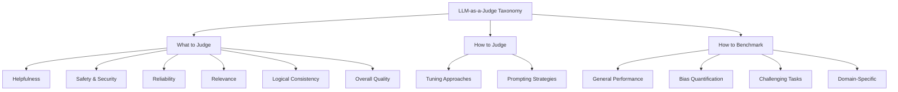
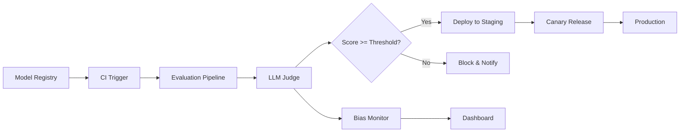

本記事は [From Generation to Judgment: Opportunities and Challenges of LLM-as-a-judge](https://arxiv.org/abs/2411.16594) の解説記事です。

## 論文概要

LLMの出力評価において、従来のBLEUやROUGEなどのマッチングベース指標や小規模モデルによる評価は、オープンエンドな生成タスクや動的なシナリオでは限界がある。著者らは、LLMを評価者として活用する「LLM-as-a-Judge」パラダイムを体系的にサーベイし、**何を評価するか（What to judge）**、**どう評価するか（How to judge）**、**どうベンチマークするか（How to benchmark）** の3次元で分類体系（taxonomy）を構築している。13名の著者による包括的なサーベイであり、評価の定義フレームワーク、6つの評価属性、バイアスと脆弱性の分析、将来の研究方向性を提示している。

## Zenn記事との関連

この記事は [OllamaオンプレLLMのモデルCI/CD構築 GitHub Actions×自動評価で安全にモデル更新](https://zenn.dev/0h_n0/articles/8318f1309a4f18) の深掘りです。Zenn記事ではOllamaを用いたオンプレミスLLMのCI/CDパイプラインにおいて、キーワードベース評価とLLM-as-a-Judgeの比較が議論されている。本論文は、そのLLM-as-a-Judge手法の理論的基盤と体系的な分類を提供するものである。

## 情報源

| 項目 | 詳細 |
|------|------|
| 会議名 | EMNLP 2025 (Empirical Methods in Natural Language Processing) |
| 論文種別 | Conference Paper |
| arXiv ID | 2411.16594 (v7: 2025年9月29日) |
| 初回投稿 | 2024年11月25日 |
| URL | [https://arxiv.org/abs/2411.16594](https://arxiv.org/abs/2411.16594) |
| 著者 | Dawei Li, Bohan Jiang, Liangjie Huang, Alimohammad Beigi, Chengshuai Zhao, Zhen Tan, Amrita Bhattacharjee, Yuxuan Jiang, Canyu Chen, Tianhao Wu, Kai Shu, Lu Cheng, Huan Liu（計13名） |
| ライセンス | CC BY 4.0 |

## カンファレンス情報

EMNLP（Empirical Methods in Natural Language Processing）は、ACL（Association for Computational Linguistics）が主催する自然言語処理分野のトップカンファレンスの一つである。EMNLP 2025にて採択された本論文は、LLM評価の体系化という時宜を得たテーマを扱っており、LLM-as-a-Judgeという急速に発展する研究領域の包括的な見取り図を提供している。

## 技術的詳細

### 定義フレームワーク：入力と出力の視点

著者らは、LLM-as-a-Judgeの定義フレームワークを**入力形式**と**出力形式**の2軸で整理している。

#### 入力形式

**Point-Wise（単一候補評価）**: LLM審判が1つの候補サンプルのみに焦点を当てて評価する方式である。

**Pair/List-Wise（複数候補比較評価）**: 2つ以上の候補（$$n \geq 2$$）を比較して評価する方式である。著者らはこれを以下の式で定式化している。

$$R = J(C_1, \ldots, C_n)$$

ここで、$$C_i$$は候補サンプル、$$J$$は審判関数、$$R$$は評価結果を表す。

#### 出力形式

**Score-Based（スコアベース）**: 各候補にスコアを付与する方式である。

$$R = \{C_1: S_1, \ldots, C_n: S_n\}$$

**Ranking-Based（ランキングベース）**: 候補間の順序関係を出力する方式である。

$$R = \{C_i > \ldots > C_j\}$$

**Selection-Based（選択ベース）**: 候補プールから最適な候補を選択する方式である。

### 3次元タクソノミー



#### 第1次元：What to Judge（何を評価するか）

著者らは、評価対象を以下の6つの属性に分類している。

| 属性 | 定義 |
|------|------|
| **Helpfulness（有用性）** | 生成された応答のユーティリティと情報量を測定する基準 |
| **Safety & Security（安全性）** | 有害なコンテンツの生成や悪意ある入力への不適切な応答がないことを保証する基準 |
| **Reliability（信頼性）** | 不確実性を提示したり、知識の欠如を認識しつつ、忠実なコンテンツを生成する能力 |
| **Relevance（関連性）** | タスク横断的な文脈的適切性をより洗練された方法で評価する基準 |
| **Logical Consistency（論理的整合性）** | 計画・推論・意思決定における候補アクションやステップの論理的正確性 |
| **Overall Quality（総合品質）** | 複数の次元を組み合わせた総合評価、またはタスク固有の判定 |

#### 第2次元：How to Judge（どう評価するか）

評価手法は**チューニングアプローチ**と**プロンプティング戦略**に大別される。

**チューニングアプローチ**では、人手ラベルデータやGPT-4などの強力なモデルによる合成フィードバックを用いて、SFT（Supervised Fine-tuning）、DPO、RLHF、メタリワーディングなどの訓練技法を適用する。

**プロンプティング戦略**として、著者らは以下の6つを挙げている。

1. **Swapping Operation**: 候補の順序を入れ替えて2回審判を実行し、結果が一致しない場合は「引き分け」とする位置バイアス対策
2. **Rule Augmentation**: 原則・参照情報・評価ルーブリックをプロンプトに埋め込む手法
3. **Multi-Agent Collaboration**: Peer Rankアルゴリズム、Mixture-of-Agents、ロールプレイ、討論、投票・集約による多エージェント協調
4. **Demonstration**: In-contextサンプルによる具体例の提示
5. **Multi-Turn Interaction**: LLM審判と候補モデルの複数ラウンドにわたる動的対話
6. **Comparison Acceleration**: トーナメント方式やランク付きペアリングによる計算コスト削減

#### 第3次元：How to Benchmark（どうベンチマークするか）

著者らはベンチマークを4カテゴリに分類している。

- **General Performance**: Cohen's kappaやDiscernment Scoreなどのアライメント指標で人間の判定との一致度を測定。Chatbot Arenaがリーダーボードとして活用される
- **Bias Quantification**: EvalBiasBenchやCALMによるバイアスの定量測定
- **Challenging Task Performance**: Arena-HardやJudgeBenchによる困難な問題での評価
- **Domain-Specific Performance**: CodeJudge-Eval（コード生成）、マルチモーダル・多言語ベンチマーク

### バイアスと脆弱性

著者らは、LLM-as-a-Judgeに内在する以下のバイアスを特定している。

| バイアス | 説明 |
|----------|------|
| **Length Bias（長さバイアス）** | より長い応答を好む傾向 |
| **Format Bias（形式バイアス）** | 整形された出力を好む傾向 |
| **Authority Bias（権威バイアス）** | 権威があるように見える応答を好む傾向 |
| **Egocentric Bias（自己中心バイアス）** | 自身の出力を好む傾向 |
| **Preference Leakage** | 審判のバイアスが評価を汚染する現象 |

さらに、プロンプトインジェクション攻撃や敵対的フレーズによる判定への影響、候補の位置を入れ替えると結果が変わる位置感度（Position Sensitivity）などの脆弱性も報告されている。

## 実装のポイント

LLM-as-a-Judgeを実装する際の重要な設計判断として、著者らの知見から以下が導出される。

**入出力形式の選択**: CI/CDパイプラインでの品質ゲートにはPoint-Wise + Score-Basedが最も実装しやすい。閾値ベースの合否判定が可能であり、パイプラインの自動化と相性が良い。一方、モデル比較にはPair-Wise + Selection-Basedが適している。

**バイアス緩和策の組み込み**: Swapping Operation（候補順序の入れ替え）は位置バイアス対策として必須に近い。著者らが報告するように、順序を入れ替えて2回評価し、結果が一致しない場合は引き分けとする実装が推奨される。

**評価属性の選定**: 6つの評価属性すべてを使う必要はない。用途に応じてHelpfulness + Reliability（一般的な品質ゲート）やSafety + Logical Consistency（安全性重視のデプロイ）など、属性を組み合わせてルーブリックを設計する。

**コスト最適化**: Comparison Accelerationで述べられるトーナメント方式を活用し、全ペア比較（$$O(n^2)$$）を避けて$$O(n \log n)$$に削減する設計が、大規模なモデル比較では重要となる。

## Production Deployment Guide

本論文の評価手法をCI/CDパイプラインの品質ゲートとして本番デプロイする際の実装ガイドを示す。

### アーキテクチャ概要



### Terraformによるインフラ構成

AWS上でLLM-as-a-Judge評価パイプラインを構築する場合の主要リソースを示す。

```hcl
# evaluation_pipeline.tf
resource "aws_sqs_queue" "evaluation_queue" {
  name                       = "llm-judge-evaluation-queue"
  visibility_timeout_seconds = 900
  redrive_policy = jsonencode({
    deadLetterTargetArn = aws_sqs_queue.evaluation_dlq.arn
    maxReceiveCount     = 3
  })
}

resource "aws_lambda_function" "judge_orchestrator" {
  function_name = "llm-judge-orchestrator"
  runtime       = "python3.12"
  timeout       = 900
  environment {
    variables = {
      JUDGE_MODEL_ENDPOINT = aws_sagemaker_endpoint.judge_model.name
      SWAP_CANDIDATES      = "true"  # 位置バイアス対策
    }
  }
}
```

### GitHub ActionsによるCI/CD統合

Ollamaオンプレミス環境でのLLM-as-a-Judge品質ゲートをGitHub Actionsに統合する例を示す。

```yaml
# .github/workflows/model-evaluation.yml
name: LLM Model Quality Gate

on:
  push:
    paths:
      - 'models/**'
      - 'Modelfile'

jobs:
  evaluate:
    runs-on: [self-hosted, gpu]
    timeout-minutes: 60
    steps:
      - uses: actions/checkout@v4

      - name: Start Ollama
        run: |
          ollama serve &
          sleep 5
          ollama pull ${{ env.JUDGE_MODEL }}

      - name: Run LLM-as-a-Judge Evaluation
        env:
          JUDGE_MODEL: "llama3.1:70b"
          CANDIDATE_MODEL: "custom-model:latest"
          EVAL_THRESHOLD: "0.7"
        run: |
          python scripts/llm_judge_evaluate.py \
            --judge-model "$JUDGE_MODEL" \
            --candidate-model "$CANDIDATE_MODEL" \
            --eval-set data/eval_set.jsonl \
            --attributes helpfulness,reliability,safety \
            --swap-candidates \
            --output results/evaluation.json

      - name: Check Quality Gate
        run: |
          python scripts/check_quality_gate.py \
            --results results/evaluation.json \
            --threshold ${{ env.EVAL_THRESHOLD }} \
            --bias-threshold 0.15
```

### 評価スクリプトの実装例

論文のタクソノミーに基づくPoint-Wise + Score-Based評価の核心部分を示す。

```python
"""LLM-as-a-Judge評価パイプライン（論文のタクソノミーに基づく実装）."""

from dataclasses import dataclass
from enum import Enum
import json
import httpx


class EvalAttribute(Enum):
    """論文で定義された6つの評価属性."""

    HELPFULNESS = "helpfulness"
    SAFETY = "safety"
    RELIABILITY = "reliability"
    RELEVANCE = "relevance"
    LOGICAL_CONSISTENCY = "logical_consistency"
    OVERALL_QUALITY = "overall_quality"


@dataclass(frozen=True)
class JudgeResult:
    """評価結果."""

    attribute: EvalAttribute
    score: float  # 0.0 - 1.0
    reasoning: str
    swap_consistent: bool  # Swapping Operationで一貫性があるか


async def pointwise_judge(
    client: httpx.AsyncClient,
    judge_model: str,
    candidate_response: str,
    prompt: str,
    attribute: EvalAttribute,
    rubric: str,
) -> JudgeResult:
    """Point-Wise + Score-Based評価（Swapping Operation適用）."""
    judge_prompt = f"""あなたはAI出力の品質を評価する審判です。
評価属性: {attribute.value}
ルーブリック: {rubric}
プロンプト: {prompt}
候補応答: {candidate_response}
JSON形式で回答: {{"score": <0.0-1.0>, "reasoning": "<理由>"}}"""

    result1 = await _call_judge(client, judge_model, judge_prompt)

    # Swapping Operation: 提示順を変えて再評価（位置バイアス対策）
    swapped_prompt = judge_prompt.replace(
        f"プロンプト: {prompt}\n候補応答: {candidate_response}",
        f"候補応答: {candidate_response}\nプロンプト: {prompt}",
    )
    result2 = await _call_judge(client, judge_model, swapped_prompt)

    score_diff = abs(result1["score"] - result2["score"])
    return JudgeResult(
        attribute=attribute,
        score=(result1["score"] + result2["score"]) / 2,
        reasoning=result1["reasoning"],
        swap_consistent=score_diff <= 0.15,
    )


async def _call_judge(
    client: httpx.AsyncClient, model: str, prompt: str
) -> dict:
    """Ollama APIを呼び出してJSON応答を取得する."""
    resp = await client.post(
        "http://localhost:11434/api/generate",
        json={"model": model, "prompt": prompt, "stream": False},
        timeout=120.0,
    )
    resp.raise_for_status()
    return json.loads(resp.json()["response"])
```

### モニタリングとバイアス検出

論文で特定されたバイアスを本番環境で継続的に監視する。主要な監視指標は以下の2つである。

**長さバイアス検出**: 応答長とスコアのピアソン相関係数を算出し、$$|r| > 0.3$$の場合にバイアスありと判定する。

**位置バイアス検出**: Swapping Operationで不一致となった割合（不一致率）を算出する。著者らが提案するように、不一致率が高い場合は審判モデルの信頼性が低いことを示す。

```hcl
# monitoring.tf - バイアス監視アラーム
resource "aws_cloudwatch_metric_alarm" "position_bias_alarm" {
  alarm_name          = "llm-judge-position-bias-high"
  comparison_operator = "GreaterThanThreshold"
  metric_name         = "PositionBiasRate"
  namespace           = "LLMJudge"
  period              = 3600
  threshold           = 0.20  # 20%以上の不一致で警告
  alarm_actions       = [aws_sns_topic.alerts.arn]
}

resource "aws_cloudwatch_metric_alarm" "length_bias_alarm" {
  alarm_name          = "llm-judge-length-bias-high"
  comparison_operator = "GreaterThanThreshold"
  metric_name         = "LengthBiasCorrelation"
  namespace           = "LLMJudge"
  period              = 3600
  threshold           = 0.30  # 相関係数0.3以上で警告
  alarm_actions       = [aws_sns_topic.alerts.arn]
}
```

### コストチェックリスト

| 項目 | 推定コスト（月額） | 備考 |
|------|-------------------|------|
| Ollama GPU サーバ（A10G） | $700-1,200 | 70Bモデルを審判として利用する場合 |
| AWS Lambda（オーケストレータ） | $5-20 | 評価リクエスト数に依存 |
| DynamoDB（評価結果保存） | $5-15 | PAY_PER_REQUEST |
| CloudWatch（監視） | $10-30 | カスタムメトリクス + Alarm |
| SQS（評価キュー） | $1-5 | メッセージ量に依存 |
| **合計** | **$721-1,270** | Swapping Operationで評価コスト約2倍 |

Swapping Operationを有効にすると評価回数が2倍になるため、コストと品質のトレードオフを考慮する必要がある。著者らが提案するComparison Acceleration（トーナメント方式）により、多数モデルの比較評価では$$O(n^2)$$を$$O(n \log n)$$に削減可能である。

## 実験結果

著者らはサーベイ論文として独自の大規模実験を実施しているわけではないが、調査対象の文献から以下の重要な知見をまとめている。

**Swapping Operationの有効性**: 候補の提示順序を入れ替えて再評価するSwapping Operationにより、位置バイアスが検出・緩和される。不一致が生じた場合は「引き分け」として扱うことで、不公正な評価を防止できることが報告されている。

**Multi-Agent協調の優位性**: 単一の審判モデルよりも、複数エージェントによる協調評価（投票・討論・Peer Rank）がロバスト性を向上させることが、複数の研究で示されている。

**ファインチューニング審判の有効性**: 汎用モデルをそのまま審判として使うよりも、評価タスクに特化してファインチューニングした審判モデルの方が特定タスクで優れた性能を示すと報告されている。

**自己一貫性とBest-of-Nサンプリング**: 同一入力に対して複数回の評価を実行し、その一貫性を確認するアプローチや、N個の評価結果から最良のものを選択するBest-of-Nサンプリングが、判定精度の向上に寄与すると著者らは述べている。

## 実運用への応用

### CI/CD品質ゲートとしての活用

本論文のタクソノミーを活用することで、CI/CDパイプラインにおけるモデル品質ゲートを体系的に設計できる。

**属性ベースの合否判定**: 6つの評価属性からデプロイ要件に応じた属性を選択し、各属性に閾値を設定する。例えば、Safety属性が0.9未満の場合はデプロイをブロックし、Helpfulness属性が0.7未満の場合は警告を出すといった段階的な制御が可能である。

**リグレッション検出**: 新モデルと現行モデルをPair-Wise評価で比較し、Selection-Basedの出力で新モデルが選択されない場合はリグレッションとして検出する。

### 適用領域

著者らは、LLM-as-a-Judgeの適用領域として以下の4つを挙げている。

1. **Evaluation（評価）**: オープンエンド生成、推論タスク、新興ドメインの評価
2. **Alignment（アラインメント）**: 合成プリファレンスデータの生成、instruction-tuningデータのフィルタリング
3. **Retrieval（検索）**: 文書ランキング、RAGシステム、関連性評価
4. **Reasoning（推論）**: 経路選択、軌跡スコアリング、ツール/エージェント連携

CI/CDの文脈では、特にEvaluationとAlignmentの領域が直接的に関連する。モデル更新時の品質評価（Evaluation）と、デプロイ前のアラインメント確認（Alignment）を自動化することで、人手によるレビューコストを大幅に削減できる。

### 導入時の注意点

著者らが指摘するように、「LLM-as-a-Judgeには固有の限界とバイアスがある」ことを前提とした設計が必要である。特に以下の点に注意が必要である。

- **Human-in-the-loop**: 高リスクなデプロイメントでは、LLM審判の判定を最終決定とせず、人間によるレビューを組み合わせる
- **バイアス監視の常時実行**: 長さバイアスや位置バイアスの指標を継続的に監視し、閾値を超えた場合はアラートを発報する
- **審判モデルの更新管理**: 審判モデル自体もバージョン管理し、審判モデルの更新が評価結果に与える影響を追跡する

## まとめ

本論文は、LLM-as-a-Judgeパラダイムの包括的なサーベイとして、What to judge / How to judge / How to benchmarkの3次元タクソノミーを提示している。6つの評価属性の定義、プロンプティング戦略（Swapping Operation、Multi-Agent協調など）、バイアスの体系的分類は、CI/CDパイプラインにおける品質ゲート設計の理論的基盤として直接活用できる。著者らが強調する「固有のバイアスと脆弱性」を前提とした設計を行うことで、LLM-as-a-Judgeを実運用レベルの評価システムとして構築することが可能である。

## 参考文献

1. Li, D., Jiang, B., Huang, L., Beigi, A., Zhao, C., Tan, Z., Bhattacharjee, A., Jiang, Y., Chen, C., Wu, T., Shu, K., Cheng, L., & Liu, H. (2024). From Generation to Judgment: Opportunities and Challenges of LLM-as-a-judge. *arXiv preprint arXiv:2411.16594*. EMNLP 2025. [https://arxiv.org/abs/2411.16594](https://arxiv.org/abs/2411.16594)
2. Zheng, L., Chiang, W.-L., Sheng, Y., Zhuang, S., Wu, Z., Zhuang, Y., Lin, Z., Li, Z., Li, D., Xing, E. P., Zhang, H., Gonzalez, J. E., & Stoica, I. (2023). Judging LLM-as-a-Judge with MT-Bench and Chatbot Arena. *NeurIPS 2023*. [https://arxiv.org/abs/2306.05685](https://arxiv.org/abs/2306.05685)
3. Li, T., Chiang, W.-L., Frick, E., Dunlap, L., Wu, T., Zhu, B., Gonzalez, J. E., & Stoica, I. (2024). From Crowdsourced Data to High-Quality Benchmarks: Arena-Hard and BenchBuilder Pipeline. *arXiv preprint arXiv:2406.11939*. [https://arxiv.org/abs/2406.11939](https://arxiv.org/abs/2406.11939)
4. Park, J., Kang, B., Cho, H., & Seo, M. (2024). JudgeBench: A Benchmark for Evaluating LLM-based Judges. *arXiv preprint arXiv:2410.12784*. [https://arxiv.org/abs/2410.12784](https://arxiv.org/abs/2410.12784)
5. Zhao, C., Tan, Z., Beigi, A., Li, D., Jiang, B., Bhattacharjee, A., & Liu, H. (2024). EvalBiasBench: A Comprehensive Bias Evaluation Benchmark for LLM Judges. *arXiv preprint*. 
