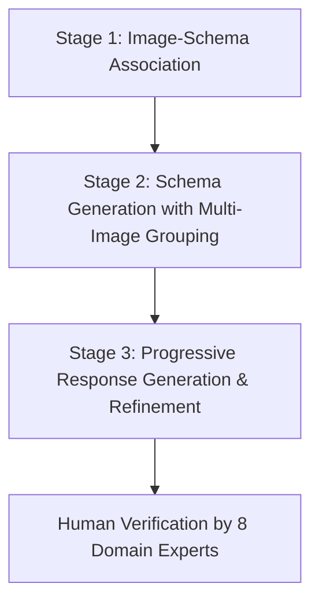
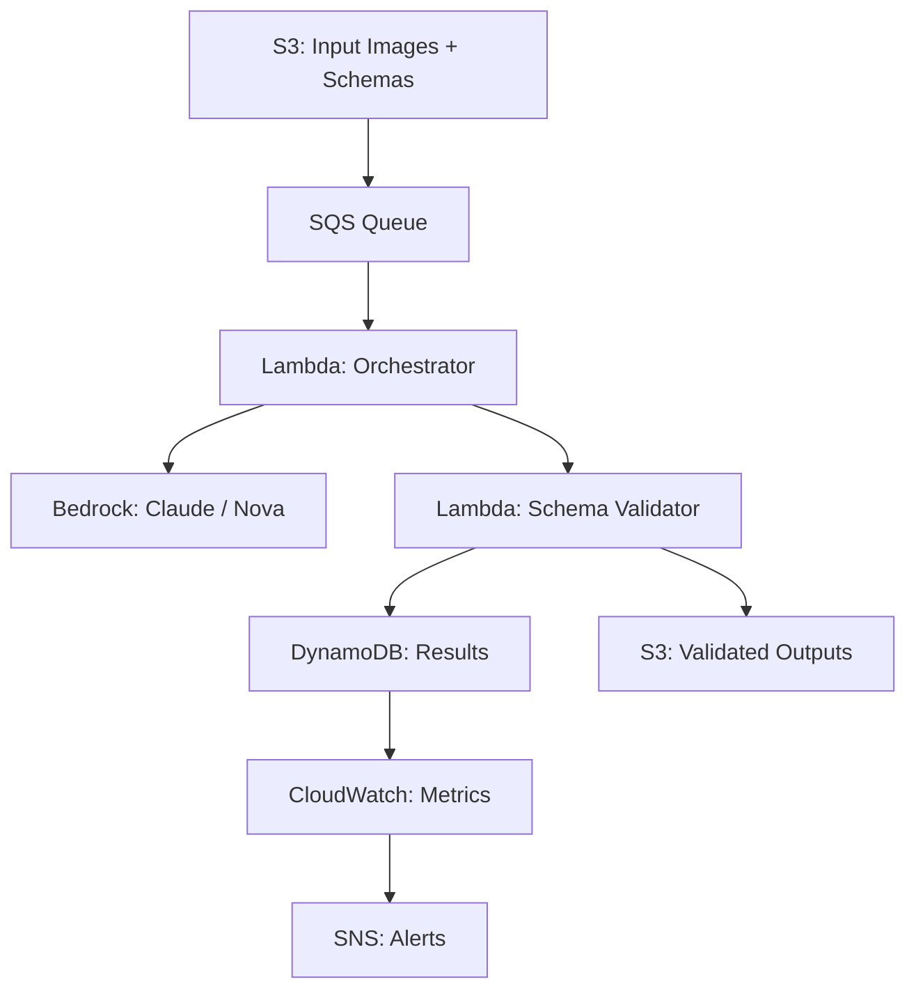

本記事は [SO-Bench: A Structural Output Evaluation of Multimodal LLMs](https://arxiv.org/abs/2511.21750) の解説記事です。

この記事は [Zenn記事: Gemini 2.5 Flash×Pydanticで画像・PDF・動画から構造化データを自動抽出する](https://zenn.dev/0h_n0/articles/c13718739ea17a) の深掘りです。Zenn記事ではGemini 2.5 FlashとPydanticを組み合わせた構造化データ抽出の実装手法を解説していますが、本記事ではそうした「マルチモーダルLLMによる構造化出力」の能力を体系的に評価するベンチマークSO-Benchについて、論文の内容を詳細に解説します。

---

## 論文概要（Abstract）

SO-Bench（Structural Output Benchmark）は、マルチモーダルLLM（MLLM）が事前定義されたJSONスキーマに適合する構造化出力を生成する能力を体系的に評価するベンチマークである。著者らは、UIスクリーン・自然画像・ドキュメント・チャートの4つの視覚ドメインをカバーする約1,800の人手検証済みサンプルと、6,500以上のJSONスキーマからベンチマークを構築している。

評価の結果、フロンティアモデルがスキーマ検証精度で最大約98%を達成する一方、フルマッチ精度ではfuzzyマッチングでも約19%にとどまることが報告されている。また、教師ありファインチューニング（SFT）と強化学習（RLVR）による訓練実験では、それぞれ20%・13%の改善が示されている。

## 情報源

| 項目 | 内容 |
|------|------|
| タイトル | SO-Bench: A Structural Output Evaluation of Multimodal LLMs |
| 著者 | Di Feng, Kaixin Ma, Feng Nan, Haofeng Chen, Bohan Zhai, David Griffiths, Mingfei Gao, Zhe Gan, Eshan Verma, Yinfei Yang, Zhifeng Chen, Afshin Dehghan |
| 所属 | Apple |
| arXiv ID | 2511.21750（v3: 2026年3月17日） |
| URL | [https://arxiv.org/abs/2511.21750](https://arxiv.org/abs/2511.21750) |
| コード | [https://github.com/apple/ml-sobench](https://github.com/apple/ml-sobench) |
| ライセンス | CC BY 4.0 |

## 背景と動機

マルチモーダルLLMの応用領域は急速に拡大しており、Webオートメーション、データ抽出、ツール呼び出しといったエージェンティックなアプリケーションでの活用が進んでいる。こうしたシナリオでは、モデルの出力は人間が読むものではなく、下流のシステム・コントローラー・APIが消費するものとなる。したがって、出力が事前定義されたデータスキーマに正確に適合することが求められる。

しかし、著者らは既存の評価体系に以下の課題があると指摘している。

1. **テキストのみの評価に偏重**: StructEvalやJSONSchemaBenchはテキスト入力に対する構造化出力を評価するが、視覚入力は扱わない
2. **限定的なドメインカバレッジ**: Pix2StructやImage2Structは特定の視覚ドメイン（スクリーンショット、数式等）に限定されている
3. **スキーマの多様性不足**: 既存ベンチマークは単純な定型テンプレートを使用しており、ネスト構造を持つ実世界のスキーマの多様性を反映していない

SO-Benchはこれらの課題を解決するため、多様な視覚ドメイン・複雑なスキーマ構造・厳密な評価指標を統合した初の体系的ベンチマークとして設計されている。

## 主要な貢献

著者らが主張する主要な貢献は以下の4点である。

1. **初の体系的ベンチマーク**: スキーマに基づく視覚的推論を厳密に評価するフレームワークを提供。約1,800の多様な高品質サンプルと6,500以上の実世界・合成スキーマを含む
2. **包括的な評価**: フロンティアモデルがスキーマ準拠では高い精度を示す一方、意味的正確性とフル構造マッチングには大きなギャップがあることを明らかにした
3. **訓練による改善の実証**: SFTとRLVRがそれぞれ20%・13%の能力向上をもたらすことを示し、ターゲットを絞った教師データの重要性を裏付けた
4. **公開**: ベンチマークと評価パイプラインをGitHubで公開し、再現性を確保している

## 技術的詳細

### 問題定式化

SO-Benchの基本的な定式化は以下の通りである。画像 $I$、JSONスキーマ $S$、ユーザー指示 $X$ が与えられたとき、モデルは構造化出力 $Y$ を生成する。$Y$ は以下の2条件を同時に満たす必要がある。

1. **構文的適合**: $Y$ がスキーマ $S$ に対して構文的に妥当である
2. **意味的反映**: $Y$ が画像 $I$ の内容とユーザー指示 $X$ を意味的に反映している

### データ構築パイプライン

著者らは3段階の自動ラベリングパイプラインを構築している。



**Stage 1: 画像-スキーマ関連付け**

CLIPエンベディングを用いた類似度スコアリングにより、画像と適切なスキーマを関連付ける。類似度は以下の式で計算される。

$$
\text{sim}(I, S) = w_1 \cdot \cos(E_I, E_S) + w_2 \cdot \cos(E_T, E_S)
$$

ここで、$E_I$ は画像 $I$ のCLIPエンベディング、$E_S$ はスキーマ $S$ のテキストエンベディング、$E_T$ は画像から抽出されたテキスト説明のエンベディングである。$w_1$, $w_2$ は重み係数を表す。上位20件の候補スキーマを取得し、フロンティアモデルが最適なマッチを選択する。

**Stage 2: マルチ画像グルーピングによるスキーマ生成**

クエリ画像に対して、$m=3$ の最近傍画像を特定し、共通構造を捉えた統一的なネストスキーマを生成する。画像間の類似度は以下の式で計算される。

$$
\text{sim}(I_i, I_j) = w_1 \cdot \cos(E_{I_i}, E_{I_j}) + w_2 \cdot \cos(E_{I_i}, E_{T_j}) + w_3 \cdot \cos(E_{T_i}, E_{I_j}) + w_4 \cdot \cos(E_{T_i}, E_{T_j})
$$

ここで、$E_{I_k}$ は画像 $k$ のCLIPエンベディング、$E_{T_k}$ は画像 $k$ のテキスト説明エンベディングである。$w_1$ から $w_4$ は各成分の重み係数を表す。

**Stage 3: 段階的応答生成と精製**

フロンティアモデル（論文ではGPT-5、Gemini-2.5-Proを使用）がOCR・レイアウト情報をガイダンスとして応答を生成する。出力はスキーマ制約に対して検証され、批評者-精製者ワークフローにより意味的一貫性が検査される。最大3回の再生成イテレーションが行われる。

最終的に、8名のドメインエキスパートが各段階で出力を検証している。

### 4つの視覚ドメイン

SO-Benchは以下の4ドメインから多様なデータを収集している。

| ドメイン | データソース | 特徴 |
|----------|-------------|------|
| UIスクリーン | RICO, WebUI, ScreenSpot Pro | モバイル・Web・デスクトップUI |
| ドキュメント | OmniDocBench, DocVQA, InfographicVQA | 文書解析・情報抽出 |
| チャート | ChartQA-Pro, ChartMuseum | グラフ・図表からのデータ抽出 |
| 自然画像 | HierText | シーン中のテキスト認識 |

スキーマリポジトリは、JsonSchemaBenchからの6,500件の実世界スキーマに加え、レシート読み取りや栄養成分表といった特定ユースケースを対象とした500件の合成スキーマを含む。

### 評価指標

著者らは3つの主要指標を定義している。

**1. Schema Validation Accuracy（スキーマ検証精度）**

生成された出力が構文的に妥当なJSONであり、かつ定義されたスキーマに適合する割合。

**2. Field Matching Accuracy（FMA: フィールドマッチング精度）**

$$
\text{FMA} = \frac{\sum_{k} |\{f \in F(G^{(k)}) : \text{Match}(f, f')\}|}{\sum_{k} |F(G^{(k)})|}
$$

ここで、$F(G^{(k)})$ はグラウンドトゥルース $G^{(k)}$ のフィールド集合、$f'$ は出力中の対応フィールド、$\text{Match}$ はマッチング関数である。マッチングには3種類がある。

- **Exact**: 完全一致
- **Fuzzy**: 文字列類似度0.8以上、数値誤差5%以内を許容
- **Ignore**: フィールド存在のみを確認

**3. Full Structure Matching Accuracy（FSMA: フル構造マッチング精度）**

$$
\text{FSMA} = \frac{1}{N} \sum_{k} \mathbf{1}\left[\forall f \in F(G^{(k)}),\ \exists f' \in F(O^{(k)}) : \text{Match}(f, f')\right]
$$

ここで、$N$ はサンプル数、$O^{(k)}$ はモデル出力、$\mathbf{1}[\cdot]$ は指示関数である。FSMAはすべてのフィールドが正しく一致して初めて1となる厳密な指標である。

### スキーマ複雑度

論文Figure 4より、スキーマの複雑度は以下の特徴を持つ。

- **深度範囲**: 単一レベルから最大22レベルまで
- **フィールド数**: 1から22,000以上
- **ドメイン別特性**: チャートドメインが最も高い中央値深度（約3.5）を示す
- **入力スキーマと出力の関係**: 入力スキーマは生成される出力よりも複雑な傾向がある

## 実装のポイント

SO-Benchの評価パイプラインを実装する際の重要な要素を示す。以下は、論文の評価指標に基づくFMAとFSMAの計算を行うコード例である。

```python
"""SO-Benchの評価指標を計算するユーティリティ。

論文で定義されたField Matching Accuracy (FMA)と
Full Structure Matching Accuracy (FSMA)を実装する。
"""

from __future__ import annotations

import json
from dataclasses import dataclass
from difflib import SequenceMatcher
from typing import Any


@dataclass(frozen=True)
class MatchConfig:
    """マッチング設定を保持するデータクラス。

    Attributes:
        string_threshold: 文字列fuzzyマッチの類似度閾値（論文では0.8）
        numeric_tolerance: 数値fuzzyマッチの許容誤差率（論文では0.05 = 5%）
    """

    string_threshold: float = 0.8
    numeric_tolerance: float = 0.05


def fuzzy_match(
    predicted: Any,
    ground_truth: Any,
    config: MatchConfig = MatchConfig(),
) -> bool:
    """論文のfuzzyマッチング基準に基づいてフィールド値を比較する。

    Args:
        predicted: モデルが生成した値
        ground_truth: グラウンドトゥルースの値
        config: マッチング設定

    Returns:
        マッチが成立すればTrue
    """
    if predicted == ground_truth:
        return True

    if isinstance(ground_truth, (int, float)) and isinstance(
        predicted, (int, float)
    ):
        if ground_truth == 0:
            return predicted == 0
        return abs(predicted - ground_truth) / abs(ground_truth) <= config.numeric_tolerance

    if isinstance(ground_truth, str) and isinstance(predicted, str):
        similarity = SequenceMatcher(None, predicted, ground_truth).ratio()
        return similarity >= config.string_threshold

    return False


def compute_fma(
    predictions: list[dict[str, Any]],
    ground_truths: list[dict[str, Any]],
    match_type: str = "fuzzy",
) -> float:
    """Field Matching Accuracy (FMA) を計算する。

    FMA = Σ|{f ∈ F(G^(k)): Match(f,f')}| / Σ|F(G^(k))|

    Args:
        predictions: モデル出力のリスト
        ground_truths: グラウンドトゥルースのリスト
        match_type: "exact", "fuzzy", "ignore" のいずれか

    Returns:
        FMAスコア（0.0 - 1.0）

    Raises:
        ValueError: match_typeが不正な場合
    """
    if match_type not in {"exact", "fuzzy", "ignore"}:
        raise ValueError(f"Unknown match_type: {match_type}")

    total_fields = 0
    matched_fields = 0

    config = MatchConfig()

    for pred, gt in zip(predictions, ground_truths):
        gt_fields = _flatten_fields(gt)
        pred_fields = _flatten_fields(pred)

        for key, gt_value in gt_fields.items():
            total_fields += 1
            if key not in pred_fields:
                continue

            pred_value = pred_fields[key]

            if match_type == "ignore":
                matched_fields += 1
            elif match_type == "exact":
                if pred_value == gt_value:
                    matched_fields += 1
            elif match_type == "fuzzy":
                if fuzzy_match(pred_value, gt_value, config):
                    matched_fields += 1

    if total_fields == 0:
        return 0.0
    return matched_fields / total_fields


def compute_fsma(
    predictions: list[dict[str, Any]],
    ground_truths: list[dict[str, Any]],
    match_type: str = "fuzzy",
) -> float:
    """Full Structure Matching Accuracy (FSMA) を計算する。

    FSMA = (1/N) Σ 1[∀f ∈ F(G^(k)), ∃f' ∈ F(O^(k)): Match(f,f')]

    Args:
        predictions: モデル出力のリスト
        ground_truths: グラウンドトゥルースのリスト
        match_type: "exact", "fuzzy", "ignore" のいずれか

    Returns:
        FSMAスコア（0.0 - 1.0）
    """
    if not ground_truths:
        return 0.0

    full_matches = 0
    config = MatchConfig()

    for pred, gt in zip(predictions, ground_truths):
        gt_fields = _flatten_fields(gt)
        pred_fields = _flatten_fields(pred)
        all_matched = True

        for key, gt_value in gt_fields.items():
            if key not in pred_fields:
                all_matched = False
                break

            pred_value = pred_fields[key]
            if match_type == "exact" and pred_value != gt_value:
                all_matched = False
                break
            elif match_type == "fuzzy" and not fuzzy_match(
                pred_value, gt_value, config
            ):
                all_matched = False
                break

        if all_matched:
            full_matches += 1

    return full_matches / len(ground_truths)


def _flatten_fields(
    obj: dict[str, Any], prefix: str = ""
) -> dict[str, Any]:
    """ネストされた辞書をフラットなキー-値ペアに展開する。

    Args:
        obj: 展開対象の辞書
        prefix: キーの接頭辞（再帰呼び出し用）

    Returns:
        フラット化されたフィールド辞書
    """
    fields: dict[str, Any] = {}
    for key, value in obj.items():
        full_key = f"{prefix}.{key}" if prefix else key
        if isinstance(value, dict):
            fields.update(_flatten_fields(value, full_key))
        elif isinstance(value, list):
            for i, item in enumerate(value):
                if isinstance(item, dict):
                    fields.update(_flatten_fields(item, f"{full_key}[{i}]"))
                else:
                    fields[f"{full_key}[{i}]"] = item
        else:
            fields[full_key] = value
    return fields
```

### スキーマ検証の実装

JSONスキーマに対する出力検証は、`jsonschema`ライブラリを用いて実装できる。

```python
"""JSONスキーマに対する構造化出力の検証ユーティリティ。"""

from __future__ import annotations

import json

import jsonschema
from pydantic import BaseModel, Field


class ValidationResult(BaseModel):
    """スキーマ検証の結果を保持するモデル。

    Attributes:
        is_valid_json: 有効なJSONとしてパースできたか
        is_schema_compliant: スキーマに適合しているか
        errors: 検証エラーのリスト
    """

    is_valid_json: bool
    is_schema_compliant: bool
    errors: list[str] = Field(default_factory=list)


def validate_output(
    raw_output: str,
    schema: dict,
) -> ValidationResult:
    """モデル出力をJSONスキーマに対して検証する。

    Args:
        raw_output: モデルが生成した生の文字列出力
        schema: 検証に使用するJSONスキーマ

    Returns:
        検証結果を含むValidationResult
    """
    try:
        parsed = json.loads(raw_output)
    except json.JSONDecodeError as e:
        return ValidationResult(
            is_valid_json=False,
            is_schema_compliant=False,
            errors=[f"JSON parse error: {e}"],
        )

    errors: list[str] = []
    validator = jsonschema.Draft7Validator(schema)
    for error in validator.iter_errors(parsed):
        errors.append(f"{error.json_path}: {error.message}")

    return ValidationResult(
        is_valid_json=True,
        is_schema_compliant=len(errors) == 0,
        errors=errors,
    )
```

## Production Deployment Guide

マルチモーダル構造化出力の評価パイプラインをAWSにデプロイする際のアーキテクチャと実装パターンを解説する。SO-Benchの知見を活かし、本番環境でのスキーマ検証・品質モニタリングを組み込んだシステムを構築する。

### アーキテクチャ概要



このパイプラインは以下の流れで動作する。

1. 画像とJSONスキーマがS3にアップロードされる
2. SQSキューがLambdaオーケストレーターをトリガーする
3. Bedrockを通じてマルチモーダルLLMが構造化出力を生成する
4. 検証Lambdaがスキーマ適合性とフィールド精度を計算する
5. 結果がDynamoDBに記録され、CloudWatchメトリクスとして公開される

### Terraformによるインフラ定義

```hcl
# --- S3: 画像・スキーマ入力とバリデーション済み出力 ---
resource "aws_s3_bucket" "so_bench_input" {
  bucket = "${var.project}-input-${var.env}"

  tags = {
    Project     = var.project
    Environment = var.env
  }
}

resource "aws_s3_bucket" "so_bench_output" {
  bucket = "${var.project}-output-${var.env}"
}

# --- SQS: 評価ジョブキュー（DLQ付き） ---
resource "aws_sqs_queue" "eval_queue" {
  name                       = "${var.project}-eval-${var.env}"
  visibility_timeout_seconds = 900  # Lambda timeout x 6
  message_retention_seconds  = 86400

  redrive_policy = jsonencode({
    deadLetterTargetArn = aws_sqs_queue.eval_dlq.arn
    maxReceiveCount     = 3
  })
}

resource "aws_sqs_queue" "eval_dlq" {
  name = "${var.project}-eval-dlq-${var.env}"
}

# --- DynamoDB: 評価結果テーブル ---
resource "aws_dynamodb_table" "eval_results" {
  name         = "${var.project}-results-${var.env}"
  billing_mode = "PAY_PER_REQUEST"
  hash_key     = "eval_id"
  range_key    = "schema_id"

  attribute {
    name = "eval_id"
    type = "S"
  }

  attribute {
    name = "schema_id"
    type = "S"
  }

  attribute {
    name = "model_id"
    type = "S"
  }

  global_secondary_index {
    name            = "model-index"
    hash_key        = "model_id"
    range_key       = "eval_id"
    projection_type = "ALL"
  }

}

# --- Lambda: オーケストレーター ---
resource "aws_lambda_function" "orchestrator" {
  function_name = "${var.project}-orchestrator-${var.env}"
  runtime       = "python3.12"
  handler       = "handler.lambda_handler"
  timeout       = 150
  memory_size   = 512

  filename         = data.archive_file.orchestrator.output_path
  source_code_hash = data.archive_file.orchestrator.output_base64sha256

  role = aws_iam_role.lambda_role.arn

  environment {
    variables = {
      RESULT_TABLE   = aws_dynamodb_table.eval_results.name
      OUTPUT_BUCKET  = aws_s3_bucket.so_bench_output.id
      BEDROCK_REGION = var.aws_region
    }
  }

}

# --- CloudWatch: FMA/FSMAメトリクスとアラーム ---
resource "aws_cloudwatch_metric_alarm" "low_schema_validation" {
  alarm_name          = "${var.project}-low-schema-validation-${var.env}"
  comparison_operator = "LessThanThreshold"
  evaluation_periods  = 3
  metric_name         = "SchemaValidationRate"
  namespace           = "SOBench/${var.env}"
  period              = 300
  statistic           = "Average"
  threshold           = 90  # 90%を下回ったらアラート
  alarm_description   = "Schema validation rate dropped below 90%"

  alarm_actions = [aws_sns_topic.alerts.arn]
}

resource "aws_sns_topic" "alerts" {
  name = "${var.project}-alerts-${var.env}"
}
```

### 運用・監視

本番運用で監視すべきメトリクスは、SO-Benchの評価指標に直接対応させる。

**カスタムメトリクス（CloudWatch）**:

| メトリクス名 | 意味 | 閾値 | アクション |
|-------------|------|------|-----------|
| `SchemaValidationRate` | 出力がスキーマに適合する割合 | < 90% | P2アラート |
| `FieldMatchAccuracy` | フィールド単位のfuzzyマッチ精度 | < 50% | P2アラート |
| `FullStructureMatchRate` | 全フィールドが正しい割合 | < 10% | P3（ログ確認） |
| `JSONParseFailRate` | JSONパース失敗率 | > 5% | P1アラート（即時対応） |
| `BedrockLatencyP99` | Bedrock推論のP99レイテンシ | > 30s | スケーリング検討 |
| `DLQMessageCount` | DLQのメッセージ数 | > 0 | 調査開始 |

**構造化ログ出力例**:

```json
{
  "event": "schema_validation_complete",
  "level": "INFO",
  "ts": "2026-08-17T09:00:00.000Z",
  "request_id": "req-abc123",
  "duration_ms": 2340,
  "model_id": "anthropic.claude-sonnet-4-20250514",
  "schema_id": "receipt-v2",
  "schema_depth": 4,
  "schema_validation": true,
  "fma_exact": 0.72,
  "fma_fuzzy": 0.85,
  "fsma_fuzzy": false,
  "field_count": 18,
  "matched_fields": 15
}
```

**リトライ戦略**: Bedrockのスロットリングやタイムアウトに対しては、指数バックオフ（初期1秒、最大32秒）にジッタを加えたリトライを実装する。SQSの可視性タイムアウト（900秒）はLambdaタイムアウト（150秒）の6倍に設定し、リトライ時のメッセージ重複を防止する。

### コスト最適化チェックリスト

- [ ] **Bedrock**: Provisioned Throughputの利用を検討（大量バッチ処理時はオンデマンドより安価）
- [ ] **S3**: 90日経過した結果をGlacier Instant Retrievalに移行（上記Terraformに設定済み）
- [ ] **DynamoDB**: PAY_PER_REQUESTモードで開始し、安定したらProvisioned Capacityへ移行検討
- [ ] **Lambda**: メモリサイズを512MBで開始し、AWS Lambda Power Tuningで最適値を特定
- [ ] **SQS**: バッチサイズ最適化（1メッセージ=1画像ではなく、最大10画像をバッチ処理）
- [ ] **CloudWatch Logs**: ログ保持期間を30日に制限（長期保存はS3 + Athenaへ）
- [ ] **スキーマキャッシュ**: 頻出スキーマをLambdaのレイヤーまたはElastiCacheにキャッシュし、S3アクセスを削減
- [ ] **ドメイン別処理分離**: SO-Benchの知見より、チャートドメインは深いスキーマが多くLLMコストが高いため、ドメイン別のコスト配分を監視

## 実験結果

### 主要ベンチマーク結果

論文Table 1より、主要モデルのパフォーマンスを以下に示す。

| モデル | スキーマ検証(%) | FMA Exact(%) | FSMA Exact(%) | FMA Fuzzy(%) | FSMA Fuzzy(%) |
|--------|:-:|:-:|:-:|:-:|:-:|
| **Gemini-2.5-Pro** | 97.74 | 71.46 | 11.38 | 73.14 | 18.91 |
| **GPT-5** | 96.38 | 61.17 | 5.22 | 62.74 | 11.60 |
| **GPT-5-mini** | 98.70 | 58.59 | - | - | - |
| Qwen2.5-VL (72B) | 87.39 | 57.86 | 4.22 | - | - |
| Qwen3-VL (32B) | 47.71 | 58.38 | - | - | - |
| Qwen3-VL (2B) | 16.28 | - | - | - | - |

著者らは、フロンティアモデルであるGemini-2.5-ProがFMA Fuzzyで73.14%を達成する一方、FSMA Fuzzyでは18.91%にとどまると報告している。このフィールド単位精度とフル構造精度の大きな乖離は、個々のフィールドは概ね正しく抽出できても、すべてのフィールドを同時に正しく出力することの難しさを示唆している。

また、スキーマ検証精度では、GPT-5-miniが98.70%と最高値を記録しているが、FMAではGemini-2.5-Proに大きく劣る。著者らはこの結果について、スキーマへの構文的適合と意味的正確性は異なる能力であると指摘している。

オープンソースモデルでは、Qwen2.5-VL（72B）がスキーマ検証87.39%・FMA Exact 57.86%を達成しているが、Qwen3-VL（2B）ではスキーマ検証が16.28%まで低下している。小規模モデルでは構造化出力の維持が困難であることが確認されている。

### スキーマ複雑度と性能の関係

論文Figure 6より、スキーマの深度が増加するにつれて性能が一貫して低下することが報告されている。

- **深度6以下**: GPT-5、GPT-5-mini、Gemini-2.5-Proは95%以上のスキーマ検証精度を維持
- **深度6超**: 小規模モデル（InternVL3.5 4B等）では約40%の性能低下が観測される
- **ドメイン別影響**: チャートドメインは中央値深度が約3.5と最も深く、全モデルで性能低下が顕著

著者らは「小規模モデルはより深いネスト構造を持つスキーマにおいて、スキーマ準拠な出力を維持することに苦戦する」と述べている。

### Structured Output API vs. 指示追従

論文Table 3では、APIベースの構造化出力強制と指示追従（プロンプトベース）の比較が行われている。

| モデル | 方式 | スキーマ検証(%) | FMA(%) |
|--------|------|:-:|:-:|
| GPT-4o | API | 99.67 | 60.51 |
| GPT-4o | 指示追従 | 92.36 | 63.01 |
| Gemini-2.5-Pro | API | 96.93 | 71.83 |
| Gemini-2.5-Pro | 指示追従 | 98.92 | 76.17 |

著者らは、APIベースの構造化出力強制がスキーマ検証精度を向上させる一方、内容生成を制約する場合があると指摘している。Gemini-2.5-Proでは、指示追従の方がAPIよりもFMAが4.34ポイント高い。これは、スキーマ強制がモデルの推論自由度を制限し、意味的な正確性に影響を与える可能性を示唆している。

### 訓練実験

**教師ありファインチューニング（SFT）**

論文Figure 7より、3Bモデルに対するSFTの効果が報告されている。

| データ量 | スキーマ検証(%) | FMA(%) | FSMA(%) |
|---------|:-:|:-:|:-:|
| ベースライン | 58.7 | 45.6 | - |
| 50Kサンプル | 85.8 | 56.5 | 7.1 |

50Kサンプルでの訓練により、3Bモデルが30B以上のオープンソースモデルに匹敵する性能を達成したと報告されている。性能向上はプラトーに達していないとされ、さらなるデータ拡充による改善の余地が示唆されている。

**強化学習（RLVR: Reinforcement Learning with Verifiable Rewards）**

著者らは以下の報酬関数を設計している。

$$
R(O, G) = \begin{cases} -0.1 & \text{if } O \text{ is invalid JSON} \\ \alpha \cdot \text{FMA}(O, G)^2 & \text{otherwise} \end{cases}
$$

ここで、$\alpha$ は以下のように定義される。

$$
\alpha = \begin{cases} 1.0 & \text{if schema-valid} \\ 0.8 & \text{otherwise} \end{cases}
$$

$O$ はモデル出力、$G$ はグラウンドトゥルースである。FMAの2乗を報酬に用いることで、高精度な出力に対してより大きな報酬を与える設計となっている。無効なJSONに対しては$-0.1$のペナルティが課される。

論文Table 4より、MDPO法による結果は以下の通りである。

| 手法 | スキーマ検証(%) | FMA(%) |
|------|:-:|:-:|
| ベースライン | - | - |
| RLVR単体 | +13.3 | +1.5 |
| SFT（14K） | +22.6 | +9.3 |
| SFT（50K）+ RLVR | 86.6 | 56.9 |

RLVRは正の効果を示すが、限られたデータではSFTに劣る結果となっている。著者らはこの原因について、モデルの能力上限とフロンティアモデルの出力がセルフ生成サンプルよりも価値が高いことを挙げている。

### 他ベンチマークとの相関分析

論文Table 2より、SO-Benchのスコアと他ベンチマークの相関が分析されている。

| ベンチマーク | 相関係数 r | p値 | 解釈 |
|-------------|:-:|:-:|------|
| MIABench（視覚指示追従） | 0.878 | 0.009 | 強い正の相関 |
| MMMU（汎用知識） | 0.791 | < 0.001 | 強い正の相関 |
| BFCL（エージェントツール使用） | 0.789 | < 0.001 | 強い正の相関 |
| LiveBench Coding | 0.754 | 0.050 | 中程度の正の相関 |
| OCRBench | ~0.47 | > 0.05 | 弱い相関（統計的に有意でない） |

著者らは、構造化出力の性能がOCR能力よりもエージェンティックな推論能力や視覚的指示追従能力と強く相関すると報告している。つまり、画像中の文字を正しく読み取れるだけでは不十分であり、読み取った情報を適切な構造に変換する推論能力が重要であることを示唆している。

## 実運用への応用

SO-Benchの知見は、マルチモーダルLLMを用いた構造化データ抽出システムの設計・運用に以下の示唆を与える。

### モデル選定の指針

1. **スキーマ検証精度とFMAの乖離に注意**: GPT-5-miniはスキーマ検証で98.70%と最高だが、FMAではGemini-2.5-Proが約13ポイント上回る。用途に応じて重視する指標を明確にすべきである
2. **小規模モデルの限界**: 2B-4Bクラスのモデルではスキーマ検証精度が著しく低下するため、エッジデバイスでの構造化出力には追加の訓練が必要となる
3. **APIベースの構造化出力のトレードオフ**: スキーマ強制APIはスキーマ検証精度を向上させるが、FMAが低下する場合がある。特にGemini系モデルでは指示追従の方が高いFMAを達成している

### スキーマ設計のベストプラクティス

- **深度を6以下に抑える**: 論文の結果より、深度6を超えるとフロンティアモデルでも性能低下が始まる
- **フラット化とネスト化のバランス**: 過度なネストは避けつつ、意味的なグルーピングは維持する
- **ドメイン別の最適化**: チャートデータは特に深いスキーマとなりやすいため、抽出結果の後処理パイプラインを設けることを推奨する

### 品質保証パイプライン

SO-Benchの評価指標を品質ゲートとして組み込むことで、本番環境での出力品質を継続的に監視できる。

1. **スキーマ検証ゲート**: JSONスキーマ検証を全出力に適用し、不適合な出力をリジェクト
2. **FMAモニタリング**: フィールド単位の精度をサンプリング検査し、精度低下を早期検知
3. **ドメイン別ダッシュボード**: UI・ドキュメント・チャート・自然画像の各ドメインで精度を分離して監視

## 関連研究

### StructEval（Yang et al., 2025）

テキスト入力に対するLLMの構造化出力能力を評価するベンチマーク。JSON、YAML、XMLなど複数のフォーマットにおける形式忠実度と制約付き生成を評価する。SO-Benchとの違いは、視覚入力を扱わない点にある。

### JSONSchemaBench（Geng et al., 2025）

テキストベースのJSONスキーマ準拠を評価するベンチマーク。制約付きデコーディングの有効性を検証している。SO-Benchはこのベンチマークから6,500件のスキーマを借用しており、テキストのみの評価をマルチモーダル領域に拡張したものと位置付けられる。

### BFCL（Patil et al., 2025）

LLMの関数呼び出し能力を評価するBerkeley Function Calling Leaderboard。実行可能な構造化呼び出しとマルチステップ対話を評価する。SO-Benchとの相関分析では $r = 0.789$（$p < 0.001$）と強い正の相関が確認されており、構造化出力能力とエージェンティックなツール使用能力が密接に関連していることが示されている。

### Pix2Struct（Lee et al., 2023）

スクリーンショットからHTMLなどの構造化表現を生成する事前訓練手法。特定のドメイン（Webページ）に特化しており、SO-Benchのような多様なドメイン・スキーマに対する汎用的評価とは異なるアプローチをとっている。

## まとめと今後の展望

### まとめ

SO-Benchは、マルチモーダルLLMの構造化出力能力を体系的に評価する初のベンチマークとして、以下の重要な知見を提供している。

1. **フロンティアモデルの限界**: Gemini-2.5-Proでもフル構造マッチング精度（FSMA Fuzzy）は18.91%にとどまり、すべてのフィールドを同時に正しく出力することは依然として困難である
2. **スキーマ複雑度の影響**: 深度6を超えるスキーマでは全モデルで顕著な性能低下が発生し、特に小規模モデルへの影響が大きい
3. **API強制のトレードオフ**: 構造化出力APIはスキーマ検証精度を向上させるが、内容の正確性を犠牲にする場合がある
4. **訓練による改善余地**: SFTにより3Bモデルが30B以上のモデルに匹敵する性能を達成可能であり、データスケーリングの効果がプラトーに達していない

### 今後の展望

著者らは以下を今後の課題として挙げている。

- **意味的マッチング手法の改善**: 文字列フィールドに対する、より柔軟な意味的一致判定の導入
- **推論強化型RL訓練**: 推論過程を明示的に組み込んだ強化学習手法の開発
- **報酬関数の改善**: 検証ベースの学習に適した、より精緻な報酬関数の設計
- **複数正解への対応**: 現在の単一グラウンドトゥルースから、複数の妥当な回答を許容する評価への拡張

構造化出力はLLMのエージェンティック応用における基盤能力であり、SO-Benchはその体系的な改善に向けた重要な評価基盤を提供している。Pydantic等のスキーマ定義ツールとマルチモーダルLLMの組み合わせが実用化される中、本ベンチマークの知見は実装・運用の両面で参考となる。

## 参考文献

1. Feng, D., Ma, K., Nan, F., Chen, H., Zhai, B., Griffiths, D., Gao, M., Gan, Z., Verma, E., Yang, Y., Chen, Z., & Dehghan, A. (2025). SO-Bench: A Structural Output Evaluation of Multimodal LLMs. arXiv:2511.21750v3.
2. Yang, Z., et al. (2025). StructEval: Benchmarking LLMs' Structured Output Generation. arXiv.
3. Geng, S., et al. (2025). JSONSchemaBench: A Benchmark for Evaluating JSON Schema Compliance. arXiv.
4. Lee, K., et al. (2023). Pix2Struct: Screenshot Parsing as Pretraining for Visual Language Understanding. ICML 2023.
5. Patil, S., et al. (2025). Berkeley Function Calling Leaderboard (BFCL). arXiv.
6. Yue, X., et al. (2024). MMMU: A Massive Multi-discipline Multimodal Understanding Benchmark. CVPR 2024.
7. Qian, Y., et al. (2024). MIABench: Multimodal Instruction-following and Alignment Benchmark. arXiv.
8. Fu, Z., et al. (2024). OCRBenchV2: An Improved Benchmark for Evaluating Text Recognition. arXiv.
