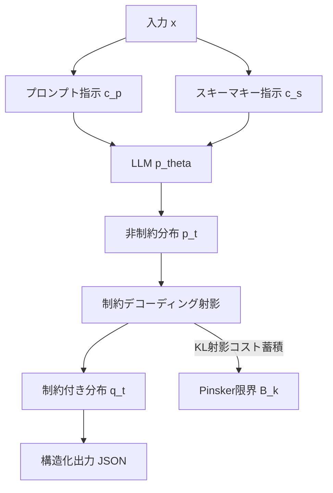

本記事は [Schema Key Wording as an Instruction Channel in Structured Generation under Constrained Decoding](https://arxiv.org/abs/2604.14862) の解説記事です。

## 論文概要

制約デコーディング（constrained decoding）を用いた構造化生成では、JSONスキーマのフィールド名や説明文は単なる出力フォーマットの指定と考えられがちである。著者Yifan Leは、スキーマキー（フィールド名・description等）が暗黙の「指示チャネル」として機能し、生成品質に大きな影響を与えることを体系的に調査した。プロンプト・スキーマキー・両方を指示チャネルとして扱うマルチチャネル指示フレームワークを提案し、GSM8KおよびMath500ベンチマークで検証した結果、Qwen系モデルはスキーマレベル指示で精度が向上する一方、LLaMA系モデルはプロンプトレベル指示を選好するモデル依存の効果を報告している。

## この記事について

この記事は [Zenn記事: Gemini 2.5 Flash×Pydanticで画像・PDF・動画から構造化データを自動抽出する](https://zenn.dev/0h_n0/articles/c13718739ea17a) の深掘りです。Zenn記事ではPydanticの`Field(description=...)`がモデルへの指示として機能すると述べています。本論文はこの現象を学術的に検証し、「スキーマキーは指示チャネルである」と実験的・理論的に裏付けた研究です。

## 情報源

| 項目 | 内容 |
|------|------|
| タイトル | Schema Key Wording as an Instruction Channel in Structured Generation under Constrained Decoding |
| 著者 | Yifan Le |
| arXiv ID | 2604.14862 |
| 発表年 | 2026年4月（v2: 2026年4月28日） |
| 分野 | cs.CL |

## 背景と動機

LLMに構造化出力（JSONなど）を生成させる手法として、制約デコーディングが広く採用されている。制約デコーディングでは、各生成ステップで文法的に有効なトークンのみを許可することで、スキーマに適合した出力を保証する。XGrammarやOutlines等のライブラリがこのアプローチを実装している。

従来の研究は、制約デコーディングの効率化や構造的正当性の保証に焦点を当ててきた。しかし、フィールド名や説明文（スキーマキー）の記述がLLMの生成品質にどう影響するかは体系的に調査されてこなかった。

著者は、この見落としが実務上の問題を引き起こすと指摘している。PydanticやJSON Schemaにおいて、開発者はフィールド名や`description`を単なるドキュメンテーションとして扱いがちだが、制約デコーディング下ではこれらがモデルへの暗黙の指示として機能する。つまり「スキーマ設計は出力フォーマットの指定ではなく、指示仕様の一部である」というのが著者の主張である。

## 主要な貢献

著者が主張する本論文の貢献は以下の通りである。

1. **スキーマキーの指示チャネルとしての体系的調査**: 制約デコーディング下でスキーマのフィールド名が生成品質に与える影響を初めて体系的に実証
2. **マルチチャネル指示フレームワーク**: プロンプトレベル指示（$c_p$）とスキーマレベル指示（$c_s$）を独立に操作可能な4条件の実験フレームワークを設計
3. **Projection-aware理論分析**: 制約デコーディングをKLダイバージェンス射影として捉え、スキーマキーの効果がモデル依存になる理論的説明を提供

## 技術的詳細

### マルチチャネル指示フレームワーク

著者は、構造化生成を以下のように定式化している。

$$
y \sim p_\theta(\cdot \mid x, c_p, c_s; s)
$$

ここで、$x$は入力、$c_p$はプロンプトレベルの指示、$c_s$はスキーマレベルの指示（フィールド名・description）、$s$は構造的スキーマ（フィールドの順序・型・制約）、$\theta$はモデルパラメータである。

$c_p$ と $c_s$ を独立に制御し、以下の4条件で実験を行っている。

| 条件 | プロンプト指示 $c_p$ | スキーマキー指示 $c_s$ |
|------|-------------------|---------------------|
| None ($R_{00}$) | 中立的 | 中立的 |
| Key-only ($R_{01}$) | 中立的 | 指示的 |
| Prompt-only ($R_{10}$) | 指示的 | 中立的 |
| Both ($R_{11}$) | 指示的 | 指示的 |

「中立的」とは`field_1`のように情報を持たない状態、「指示的」とは`step_by_step_reasoning`のように意味的な指示を含む状態を指す。

各チャネルの効果とチャネル間の交互作用は以下の指標で測定される。

$$
\Delta_{\text{key}} = R_{01} - R_{00}, \quad \Delta_{\text{prompt}} = R_{10} - R_{00}
$$

$$
\Delta_{\text{int}} = R_{11} - R_{10} - R_{01} + R_{00}
$$

$\Delta_{\text{int}} = 0$ であれば加算的に独立、$\Delta_{\text{int}} < 0$ であれば冗長性や干渉、$\Delta_{\text{int}} > 0$ であれば相乗効果が生じている。

### Projection-aware理論分析

著者は、制約デコーディングをKLダイバージェンス射影として理論的に分析している。生成ステップ $t$ での制約デコーディングは以下の操作を行う。

$$
q_t(v) = \frac{p_t(v) \cdot \mathbf{1}[v \in V_t]}{Z_t(s, y_{<t})}
$$

ここで、$p_t(v)$は非制約時の次トークン確率、$V_t$はステップ$t$で文法的に有効なトークン集合、$Z_t$は正規化定数である。無効なトークンの確率をゼロにし再正規化する「射影」により、KLダイバージェンスが蓄積する。

著者はPinskerの不等式を用いて射影による性能限界を定式化している。

$$
B_k(x) = \sqrt{\frac{T_{\text{val}}(k, x)}{2}}
$$

$T_{\text{val}}(k, x)$はスキーマキー$k$を使用した場合の値レベルKLダイバージェンスである。スキーマキー$k_1$（指示的）が$k_0$（中立的）よりも高い性能を達成するには、$k_1$の意味的利得が双方の射影限界の合計を上回る必要がある。これにより、モデルがスキーマキーの意味を活用できるかと射影コストのバランスがモデル依存の効果を生み出すことが説明される。



## 実装のポイント

本論文の知見はPydanticの`Field(description=...)`を使用する際に直接的に適用できる。以下に中立的なスキーマと指示的なスキーマの対比を示す。

```python
from pydantic import BaseModel, Field


class NeutralOutput(BaseModel):
    """中立的なスキーマ: 論文のNone条件に相当"""

    field_1: str = Field(description="output")
    field_2: str = Field(description="value")


class InstructiveOutput(BaseModel):
    """指示的なスキーマ: 論文のKey-only条件に相当

    フィールド名とdescriptionがCoT推論を誘導する。
    """

    step_by_step_reasoning: str = Field(
        description="Show your detailed reasoning process, "
        "breaking down the problem into intermediate steps"
    )
    final_answer: str = Field(
        description="The final numerical answer derived from the reasoning"
    )
```

著者の実験結果はスキーマキー指示の効果がモデルファミリーに依存することを示しているため、使用するLLMに応じた戦略の切り替えが必要である。

```python
from pydantic import BaseModel, Field


def build_schema_for_model(model_family: str) -> type[BaseModel]:
    """モデルファミリーに応じたスキーマ設計の切り替え

    Args:
        model_family: "qwen", "llama", "deepseek_r1"のいずれか

    Returns:
        最適化されたPydanticスキーマクラス
    """
    if model_family == "qwen":
        # Qwen: スキーマキー指示が効果的（論文Table 1より）
        class Schema(BaseModel):
            """Qwen向け: description に詳細な指示を配置"""

            detailed_reasoning: str = Field(
                description="Break down the problem into clear steps"
            )
            verified_answer: str = Field(
                description="Verified final answer after checking steps"
            )
        return Schema

    # LLaMA: プロンプトに詳細指示を配置し、スキーマは簡潔に
    class Schema(BaseModel):
        """LLaMA向け: スキーマは最小限に"""

        reasoning: str = Field(description="reasoning")
        answer: str = Field(description="answer")
    return Schema
```

## Production Deployment Guide

スキーマ駆動の構造化出力パイプラインをAWSにデプロイする際の実装パターンを示す。

### AWS実装パターン（コスト最適化重視）

| 構成 | トラフィック | 主要サービス | 月額概算 |
|------|------------|-------------|---------|
| Small | ~100 req/日 | Lambda + Bedrock + DynamoDB | $50-150 |
| Medium | ~1,000 req/日 | ECS Fargate + Bedrock + ElastiCache | $300-800 |
| Large | 10,000+ req/日 | EKS + Karpenter + Spot + vLLM | $2,000-5,000 |

**Small構成の内訳**（2026年8月時点ap-northeast-1概算）: Lambda $5-15/月、Bedrock(Claude Sonnet 4) $30-100/月、DynamoDB On-Demand $5-10/月、CloudWatch $5-10/月。

**コスト削減テクニック**: Bedrock Batch APIで50%削減。Prompt Cachingでスキーマ部分の入力トークンを30-90%削減。Spot Instances（Large構成）で最大90%削減。Reserved Instances 1年コミットで72%削減。

注: 2026年8月時点ap-northeast-1リージョン概算。実際のコストはトラフィックパターン等により変動する。

### Terraformインフラコード

#### Small構成（Serverless）

```hcl
terraform {
  required_version = ">= 1.9"
  required_providers {
    aws = { source = "hashicorp/aws", version = "~> 5.60" }
  }
}

provider "aws" { region = "ap-northeast-1" }

resource "aws_dynamodb_table" "schema_cache" {
  name         = "structured-output-schema-cache"
  billing_mode = "PAY_PER_REQUEST"
  hash_key     = "schema_id"
  range_key    = "model_family"
  attribute { name = "schema_id";    type = "S" }
  attribute { name = "model_family"; type = "S" }
  server_side_encryption { enabled = true }
}

resource "aws_iam_role" "lambda_role" {
  name = "schema-output-lambda-role"
  assume_role_policy = jsonencode({
    Version = "2012-10-17"
    Statement = [{ Action = "sts:AssumeRole", Effect = "Allow",
      Principal = { Service = "lambda.amazonaws.com" } }]
  })
}

resource "aws_iam_role_policy" "lambda_policy" {
  name = "schema-output-policy"
  role = aws_iam_role.lambda_role.id
  policy = jsonencode({
    Version = "2012-10-17"
    Statement = [
      { Effect = "Allow", Action = ["bedrock:InvokeModel"],
        Resource = "arn:aws:bedrock:ap-northeast-1::foundation-model/anthropic.*" },
      { Effect = "Allow",
        Action = ["dynamodb:GetItem", "dynamodb:PutItem", "dynamodb:Query"],
        Resource = aws_dynamodb_table.schema_cache.arn },
      { Effect = "Allow",
        Action = ["logs:CreateLogGroup", "logs:CreateLogStream", "logs:PutLogEvents"],
        Resource = "arn:aws:logs:*:*:*" },
      { Effect = "Allow",
        Action = ["xray:PutTraceSegments", "xray:PutTelemetryRecords"],
        Resource = "*" },
    ]
  })
}

resource "aws_lambda_function" "schema_output" {
  function_name    = "schema-driven-structured-output"
  role             = aws_iam_role.lambda_role.arn
  handler          = "handler.lambda_handler"
  runtime          = "python3.12"
  timeout          = 30
  memory_size      = 256
  filename         = "lambda.zip"
  source_code_hash = filebase64sha256("lambda.zip")
  tracing_config { mode = "Active" }
  environment {
    variables = {
      SCHEMA_TABLE  = aws_dynamodb_table.schema_cache.name
      DEFAULT_MODEL = "anthropic.claude-sonnet-4-20250514-v1:0"
    }
  }
}
```

#### Large構成（EKS + Karpenter + Spot）

```hcl
module "eks" {
  source          = "terraform-aws-modules/eks/aws"
  version         = "~> 20.24"
  cluster_name    = "schema-output-cluster"
  cluster_version = "1.31"
  vpc_id          = module.vpc.vpc_id
  subnet_ids      = module.vpc.private_subnets
  cluster_endpoint_private_access = true
  eks_managed_node_groups = {
    system = {
      instance_types = ["m7i.large"]
      min_size = 2; max_size = 3; desired_size = 2
      capacity_type = "ON_DEMAND"
    }
  }
  tags = { "karpenter.sh/discovery" = "schema-output-cluster" }
}

resource "kubectl_manifest" "karpenter_nodepool" {
  yaml_body = yamlencode({
    apiVersion = "karpenter.sh/v1"
    kind       = "NodePool"
    metadata   = { name = "schema-output-pool" }
    spec = {
      template = { spec = {
        requirements = [
          { key = "karpenter.sh/capacity-type", operator = "In",
            values = ["spot", "on-demand"] },
          { key = "node.kubernetes.io/instance-type", operator = "In",
            values = ["m7i.xlarge", "m7a.xlarge", "m6i.xlarge"] },
        ]
        nodeClassRef = { group = "karpenter.k8s.aws", kind = "EC2NodeClass", name = "default" }
      } }
      limits     = { cpu = "64", memory = "256Gi" }
      disruption = { consolidationPolicy = "WhenEmptyOrUnderutilized" }
    }
  })
}

resource "aws_budgets_budget" "monthly" {
  name = "schema-output-monthly"
  budget_type  = "COST"
  limit_amount = "5000"
  limit_unit   = "USD"
  time_unit    = "MONTHLY"
  notification {
    comparison_operator = "GREATER_THAN"
    threshold           = 80
    threshold_type      = "PERCENTAGE"
    notification_type   = "ACTUAL"
    subscriber_email_addresses = ["alerts@example.com"]
  }
}
```

### 運用・監視設定

```
# CloudWatch Logs Insights: スキーマチャネル別品質モニタリング
fields @timestamp, model_family, schema_type, accuracy, latency_ms
| filter event = "structured_output_generated"
| stats avg(accuracy) as avg_accuracy, percentile(latency_ms, 95) as p95
  by model_family, schema_type
| sort avg_accuracy desc
```

```python
import datetime
import json

import boto3
from aws_xray_sdk.core import patch_all, xray_recorder

patch_all()  # boto3自動計装


def setup_token_alarm(function_name: str, sns_arn: str) -> None:
    """Bedrockトークン使用量スパイク検知アラーム設定"""
    cw = boto3.client("cloudwatch", region_name="ap-northeast-1")
    cw.put_metric_alarm(
        AlarmName=f"{function_name}-token-spike",
        ComparisonOperator="GreaterThanThreshold",
        EvaluationPeriods=2,
        MetricName="InputTokenCount", Namespace="AWS/Bedrock",
        Period=300, Statistic="Sum", Threshold=50000,
        AlarmActions=[sns_arn],
    )


def get_daily_cost_report(sns_arn: str) -> dict[str, float]:
    """日次コストレポート取得、$100/日超過でSNS通知"""
    ce = boto3.client("ce", region_name="us-east-1")
    today = datetime.date.today()
    resp = ce.get_cost_and_usage(
        TimePeriod={"Start": (today - datetime.timedelta(days=1)).isoformat(),
                    "End": today.isoformat()},
        Granularity="DAILY", Metrics=["UnblendedCost"],
        Filter={"Tags": {"Key": "Project", "Values": ["schema-driven-output"]}},
        GroupBy=[{"Type": "DIMENSION", "Key": "SERVICE"}],
    )
    costs = {g["Keys"][0]: float(g["Metrics"]["UnblendedCost"]["Amount"])
             for g in resp["ResultsByTime"][0]["Groups"]}
    if sum(costs.values()) > 100:
        boto3.client("sns", region_name="ap-northeast-1").publish(
            TopicArn=sns_arn, Subject="Daily Cost Alert",
            Message=json.dumps(costs, indent=2))
    return costs
```

### コスト最適化チェックリスト

**アーキテクチャ選択**: トラフィック量で判断（~100: Serverless、~1,000: Hybrid、10,000+: Container）。

**リソース最適化**: Spot Instances優先（Karpenter consolidation有効化）。Reserved Instances 1年72%削減。Savings Plans検討。Lambda Power Tuning検証。ECS/EKS夜間縮退。

**LLMコスト削減**: Bedrock Batch APIで50%削減。Prompt Caching有効化（スキーマ固定部分で30-90%削減）。モデル選択ロジック（簡易タスクはHaiku、複雑タスクはSonnet）。max_tokens設定。DynamoDBにモデル別最適スキーマをキャッシュ。

**監視・アラート**: AWS Budgets月次予算80%通知。CloudWatchトークン使用量アラーム。Cost Anomaly Detection有効化。日次コストレポート自動取得。

**リソース管理**: 未使用リソース月次棚卸し。`Project=schema-driven-output`タグ戦略。DynamoDB TTL設定。EventBridgeで開発環境夜間停止。

## 実験結果

### GSM8K・Math500での性能比較

著者はGSM8K（1319問）とMath500（500問）で検証している。制約デコーディングエンジンにXGrammarを使用し、スキーマキーの記述のみを変化させている（論文Table 1より）。

| モデル | None ($R_{00}$) | Key-only ($R_{01}$) | Prompt-only ($R_{10}$) | Both ($R_{11}$) |
|--------|----------------|---------------------|----------------------|-----------------|
| Qwen2.5-7B | 79.61 | 86.50 | 85.60 | 86.13 |
| Qwen2.5-Coder-14B | 84.23 | 87.87 | 87.57 | 89.16 |
| Llama-3.2-3B | 53.15 | 37.38 | 56.33 | 57.70 |

**Qwen2.5-7B**: $\Delta_{\text{key}} = +6.89$ポイント（79.61%→86.50%）。スキーマキー指示のみで大幅な改善を達成。$\Delta_{\text{prompt}} = +5.99$ポイント。Qwen系はスキーマレベル指示をより効果的に活用する。

**Llama-3.2-3B**: $\Delta_{\text{key}} = -15.77$ポイント（53.15%→37.38%）。スキーマキー指示が精度を大幅に低下させる。$\Delta_{\text{prompt}} = +3.18$ポイント。LLaMA系ではスキーマキー指示が「害」になる。

### チャネル間交互作用

著者は$\Delta_{\text{int}}$が非加算的であることを報告している。Qwen2.5-7B（Math500）で$\Delta_{\text{int}} = -6.36$（冗長性・干渉）、DeepSeek-R1-Distill-Qwen-7B（GSM8K）で$\Delta_{\text{int}} = +14.85$（相乗効果）、Llama-3.2-3B（GSM8K）で$\Delta_{\text{int}} = +17.14$（相乗効果）。モデルとタスクの組み合わせにより冗長性、干渉、相乗効果のいずれかが生じる。

著者のprojection-aware分析によれば、Qwen系モデルは事前学習データにJSON/コード生成タスクが多く含まれているため、スキーマキーの意味的情報を効果的に活用でき射影コストを上回る意味的利得を得られる。一方LLaMA系モデルはスキーマキーの意味を自然言語プロンプトほど効率的に解釈できず、射影コストが意味的利得を上回り性能が低下する。

## 実運用への応用

Zenn記事で紹介されているGemini + Pydanticによる構造化出力パイプラインでは、`Field(description=...)`の記述がモデルの生成品質を直接左右する。本論文の知見に基づく設計指針は以下の通りである。

**1. フィールド名は指示である**: `field_1`のような汎用名を避け、`step_by_step_reasoning`のように期待する出力の内容を名前で伝える。Zenn記事でも実践されているパターンであり、本論文がその有効性を学術的に裏付けている。

**2. モデルに応じたチャネル配分**: Gemini（Google製モデル）は本論文の直接的な検証対象外だが、モデルごとにスキーマ指示への感度が異なるという知見は適用できる。本番環境ではA/Bテストで最適な配分を検証すべきである。

**3. スキーマをプロンプトと同格に扱う**: 著者が強調するように「スキーマ設計は指示仕様の一部」である。スキーマ定義もバージョン管理し、変更時には性能評価プロセスを組み込むべきである。

**4. 過度な両チャネル利用の回避**: プロンプトとスキーマの両方に同じ指示を入れることが常に最善ではない。冗長な指示はかえって性能を低下させる場合がある（Qwen2.5-7BのMath500で$\Delta_{\text{int}} = -6.36$）。

## 関連研究

- **Willard & Louf (2023)**: 有限状態マシンに基づく効率的なLLM構造化テキスト生成。制約デコーディングの計算効率を改善した研究であり、本論文はその上に「スキーマキーの意味的効果」という新しい分析軸を加えている。
- **Tam et al. (2024)**: 構造化出力生成が推論性能に与える影響の調査。JSON出力制約がLLMの推論精度を低下させうることを報告しており、本論文の射影コスト分析と関連する。
- **Geng et al. (2024) - Grammar-Aligned Decoding**: 文法制約と言語モデル分布の整合性を高めるデコーディング手法。本論文の射影分析がこの理論的基盤を拡張している。

## まとめと今後の展望

本論文は、制約デコーディング下でのスキーマキー記述が暗黙の指示チャネルとして機能することを実証した。Qwen系モデルではスキーマキー指示が精度を最大+6.89ポイント改善する一方、LLaMA系モデルでは最大-15.77ポイントの低下を引き起こすモデル依存の効果が報告されている。

実務上の示唆として、PydanticやJSON Schemaのフィールド名・descriptionは「ドキュメント」ではなく「指示」として扱うべきであり、モデル変更時にはスキーマの再評価が必須である。

著者は限界として、評価が数学推論タスクに限定されていること、モデルカバレッジがQwenとLLaMAに限られていることを挙げている。情報抽出やコード生成など他タスクへの一般化は今後の課題である。

## 参考文献

- **arXiv**: [https://arxiv.org/abs/2604.14862](https://arxiv.org/abs/2604.14862)
- **Related Zenn article**: [https://zenn.dev/0h_n0/articles/c13718739ea17a](https://zenn.dev/0h_n0/articles/c13718739ea17a)
