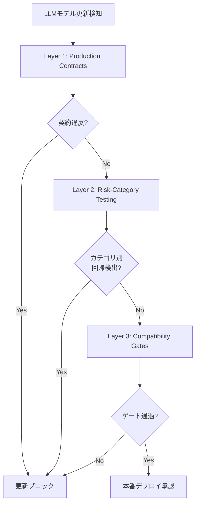
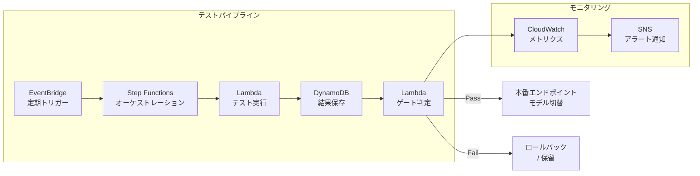

本記事は [arXiv:2604.27789 "Test Before You Deploy: Governing Updates in the LLM Supply Chain"](https://arxiv.org/abs/2604.27789) の解説記事です。

## 論文概要

著者らは、LLMプロバイダによるサイレント更新（明示的なバージョン変更を伴わないモデル更新）が本番システムに品質回帰をもたらす問題を「behavioral drift（行動ドリフト）」と定義し、これを検出・防止するための3層ガバナンスフレームワークを提案している。フレームワークはProduction Contracts（本番契約）、Risk-Category-Based Testing Suite（リスクカテゴリ別テストスイート）、Compatibility Gates（互換性ゲート）の3要素で構成される。7つのAnthropic Claudeモデルに対し、3つのタスクドメインにまたがる25のプロンプトで探索的検証を行い、モデル遷移時のJSON整形失敗やSQL安定性など、カテゴリ固有の回帰パターンを報告している。

## この記事について

この記事は [Zenn記事: OllamaオンプレLLMのモデルCI/CD構築 GitHub Actions×自動評価で安全にモデル更新](https://zenn.dev/0h_n0/articles/8318f1309a4f18) の深掘りです。Zenn記事ではOllamaを用いたオンプレミスLLMのCI/CDパイプラインを実装していますが、本論文はそのパイプラインが解決すべき根本課題、すなわち「モデル更新時の品質回帰をどう体系的に検出するか」について理論的基盤を提供しています。

## 情報源

| 項目 | 内容 |
|------|------|
| タイトル | Test Before You Deploy: Governing Updates in the LLM Supply Chain |
| 著者 | Mohd Sameen Chishti, Damilare Peter Oyinloye, Jingyue Li |
| arXiv ID | 2604.27789 |
| 発表年 | 2026年4月 |
| 分野 | cs.SE, cs.AI |
| 発表場所 | 2nd International Workshop on Large Language Model Supply Chain Analysis (LLMSC2026), FSE 2026併設 |

## 背景と動機

従来のソフトウェアサプライチェーンでは、依存ライブラリの更新はセマンティックバージョニングで管理され、破壊的変更はメジャーバージョンの更新として明示される。しかし、LLMのサプライチェーンではこの前提が成り立たない。著者らは、LLMプロバイダがモデルを「サイレントに」更新する実態を具体的な事例で示している。

著者らが報告している代表的な事例として、Claude Sonnet 4のリリース直後にリクエストの最大16%に影響するバグが発生したケース、およびGPT-4のコード実行成功率がバージョン表記の変更なしに3ヶ月間で52%から10%に低下したケースがある。これらの数値は論文Section 1より引用している。

この問題の本質は、LLMが確率的な出力を生成するシステムであるにもかかわらず、従来のソフトウェアテストの枠組み（決定的な入出力の検証）では品質回帰を捉えきれない点にある。著者らは、この課題に対して構造化されたガバナンスアプローチが必要だと主張している。

## 主要な貢献

著者らが主張する本論文の貢献は以下の通りである。

1. **Behavioral Driftの体系的定義**: LLMプロバイダのサイレント更新による意図しない振る舞いの変化を「behavioral drift」として形式化し、従来のソフトウェア回帰テストとの違いを明確化
2. **3層ガバナンスフレームワークの提案**: Production Contracts、Risk-Category-Based Testing Suite、Compatibility Gatesの3層で構成されるフレームワークを提示
3. **探索的検証による実証**: 7つのCloudeモデル、25プロンプト、3タスクドメインでフレームワークの有用性を検証
4. **オープンチャレンジの整理**: テストスイート設計、閾値キャリブレーション、非決定性の取り扱い、計算コスト、プロバイダ透明性に関する未解決課題の体系的整理

## 技術的詳細

### 3層ガバナンスフレームワーク

著者らが提案するフレームワークの全体構成を以下に示す。



#### Layer 1: Production Contracts

Production Contractsは、LLMの出力に対する明示的な行動規約である。著者らは、各契約を測定可能な閾値を持つルールとして定義することを提案している。契約の構成要素は以下の通りである。

- **出力形式制約**: JSON、XML等の構造化出力がスキーマに適合するか
- **指示遵守率**: 「コードのみ出力」といった指示に対する遵守の割合
- **応答長制約**: トークン数の上限・下限
- **安全性制約**: 有害出力の発生率の上限

契約違反の判定において、著者らは単一の実行結果ではなく、複数回の実行（論文では各プロンプト3-5回）にわたる統計的な評価を推奨している。LLMの出力が非決定的である以上、単一の失敗が即座に契約違反とはならない。ここで、違反率 $V$ は以下のように定義できる。

$$V = \frac{\text{契約違反の実行回数}}{\text{総実行回数}}$$

閾値 $\theta$ を事前に設定し、$V > \theta$ の場合に契約違反と判定する。著者らは具体的な $\theta$ の値を規定していないが、タスクの重要度に応じた設定を推奨している。

#### Layer 2: Risk-Category-Based Testing Suite

著者らは、テストスイートをデプロイメントリスクの領域別に構成することを提案している。論文の検証では以下の3カテゴリが使用されている。

1. **コード生成タスク**: Python/SQLコードの正確性、実行可能性
2. **構造化出力タスク**: JSON/XML出力のスキーマ適合性
3. **指示遵守タスク**: 制約付きプロンプトへの準拠度

各カテゴリについて、モデルバージョン $m_i$ から $m_{i+1}$ への遷移時の回帰スコア $R$ を算出する。

$$R_{category} = \frac{S_{m_i} - S_{m_{i+1}}}{S_{m_i}}$$

ここで $S$ はカテゴリ内のテストケース通過率を示す。$R > 0$ は回帰（性能低下）、$R < 0$ は改善を意味する。

#### Layer 3: Compatibility Gates

Compatibility Gatesは、Layer 1とLayer 2の結果を統合し、最終的なデプロイ可否を決定するチェックポイントである。著者らは、全カテゴリでの回帰スコアが許容範囲内であること、かつProduction Contractsの違反率が閾値以下であることを、デプロイ承認の条件として定めている。

## 実装のポイント

著者らのフレームワークを実装に落とし込む際の要点を整理する。

**テストケース設計**: 著者らは25のプロンプトを手動構築し、各プロンプトを3-5回実行している。本番環境では、カテゴリごとに最低10-20のテストケースを用意し、各ケースの期待動作を明確に記述することが求められる。特に構造化出力タスクでは、JSONスキーマを厳密に定義し、スキーマバリデーションを自動化することが重要である。

**非決定性への対処**: LLMの出力は同一プロンプトでも実行ごとに異なる。著者らは各プロンプトを複数回実行することでこの問題に対処しているが、temperature=0に設定した場合でも完全な再現性は保証されない。実装では、統計的検定（例: 二項検定やbootstrap信頼区間）を用いて、観測された差異が有意な回帰なのか、それとも確率的なゆらぎなのかを判別する仕組みが必要である。

**段階的ロールアウト**: Compatibility Gatesを通過した場合でも、カナリアデプロイ（トラフィックの一部のみを新モデルに振り分ける）を組み合わせることで、テストスイートでは捕捉できない回帰を早期に検出できる。

## Production Deployment Guide

本論文のガバナンスフレームワークをAWSインフラ上に実装する場合のアーキテクチャパターンを示す。以下はあくまで論文の概念を実装に落とし込んだ一例であり、論文著者らが検証したものではない点に留意されたい。

### アーキテクチャ全体像



### Terraformによるインフラ定義

テスト結果を格納するDynamoDBテーブルと、ゲート判定結果を通知するSNSトピックの定義例を示す。

```hcl
# DynamoDB: テスト結果の保存
resource "aws_dynamodb_table" "llm_test_results" {
  name         = "llm-compatibility-test-results"
  billing_mode = "PAY_PER_REQUEST"
  hash_key     = "model_version"
  range_key    = "test_run_id"

  attribute {
    name = "model_version"
    type = "S"
  }

  attribute {
    name = "test_run_id"
    type = "S"
  }

  attribute {
    name = "category"
    type = "S"
  }

  global_secondary_index {
    name            = "category-index"
    hash_key        = "category"
    range_key       = "test_run_id"
    projection_type = "ALL"
  }

  tags = {
    Purpose = "LLM behavioral drift detection"
  }
}

# SNS: ゲート判定結果の通知
resource "aws_sns_topic" "compatibility_gate_alerts" {
  name = "llm-compatibility-gate-alerts"
}

resource "aws_sns_topic_subscription" "email_alert" {
  topic_arn = aws_sns_topic.compatibility_gate_alerts.arn
  protocol  = "email"
  endpoint  = "ml-ops-team@example.com"
}

# EventBridge: 定期テスト実行のスケジュール
resource "aws_cloudwatch_event_rule" "daily_compatibility_test" {
  name                = "llm-daily-compatibility-test"
  description         = "Daily LLM behavioral drift check"
  schedule_expression = "cron(0 0 * * ? *)"
}
```

### Compatibility Gate判定ロジック

Lambda関数としてゲート判定を実装する例を示す。論文のフレームワークに基づき、カテゴリ別の回帰スコアと契約違反率を総合的に評価する。

```python
"""Compatibility Gate判定ロジック."""

from dataclasses import dataclass


@dataclass(frozen=True)
class GateThresholds:
    """ゲート判定の閾値設定."""

    max_regression_score: float = 0.10  # カテゴリ別回帰スコアの上限
    max_violation_rate: float = 0.05    # 契約違反率の上限
    min_test_runs: int = 3             # 最低実行回数


@dataclass(frozen=True)
class CategoryResult:
    """カテゴリ別テスト結果."""

    category: str
    pass_count: int
    total_count: int
    baseline_pass_rate: float

    @property
    def pass_rate(self) -> float:
        """テスト通過率."""
        if self.total_count == 0:
            return 0.0
        return self.pass_count / self.total_count

    @property
    def regression_score(self) -> float:
        """回帰スコア: 正の値は性能低下を示す."""
        if self.baseline_pass_rate == 0.0:
            return 0.0
        return (self.baseline_pass_rate - self.pass_rate) / self.baseline_pass_rate


def evaluate_gate(
    results: list[CategoryResult],
    thresholds: GateThresholds,
) -> dict:
    """Compatibility Gate判定を実行する.

    Args:
        results: カテゴリ別テスト結果のリスト
        thresholds: 判定閾値

    Returns:
        判定結果の辞書
    """
    failures: list[dict] = []

    for result in results:
        if result.total_count < thresholds.min_test_runs:
            failures.append({
                "category": result.category,
                "reason": "insufficient_runs",
                "detail": f"{result.total_count} < {thresholds.min_test_runs}",
            })
            continue

        if result.regression_score > thresholds.max_regression_score:
            failures.append({
                "category": result.category,
                "reason": "regression_detected",
                "detail": (
                    f"regression={result.regression_score:.3f} "
                    f"> threshold={thresholds.max_regression_score}"
                ),
            })

    return {
        "passed": len(failures) == 0,
        "failures": failures,
        "summary": {
            cat.category: {
                "pass_rate": round(cat.pass_rate, 4),
                "baseline": round(cat.baseline_pass_rate, 4),
                "regression": round(cat.regression_score, 4),
            }
            for cat in results
        },
    }
```

### モニタリング設計

CloudWatch Metricsを用いて、以下のカスタムメトリクスを継続的に記録することを推奨する。

| メトリクス名 | 次元 | 意味 |
|-------------|------|------|
| `llm/PassRate` | model_version, category | カテゴリ別テスト通過率 |
| `llm/RegressionScore` | model_version, category | 前バージョンとの回帰スコア |
| `llm/ContractViolationRate` | model_version, contract_type | 契約違反率 |
| `llm/ResponseLatencyP99` | model_version | 応答レイテンシのP99 |

アラート条件の設定例として、回帰スコアが閾値を超えた場合にSNS通知を発火するCloudWatchアラームを定義する。

```hcl
resource "aws_cloudwatch_metric_alarm" "regression_alert" {
  alarm_name          = "llm-regression-detected"
  comparison_operator = "GreaterThanThreshold"
  evaluation_periods  = 1
  metric_name         = "llm/RegressionScore"
  namespace           = "LLMGovernance"
  period              = 3600
  statistic           = "Maximum"
  threshold           = 0.10
  alarm_description   = "LLM behavioral regression detected"
  alarm_actions       = [aws_sns_topic.compatibility_gate_alerts.arn]

  dimensions = {
    category = "structured_output"
  }
}
```

### コスト最適化チェックリスト

本フレームワークの運用ではLLM API呼び出しコストが主要な課題となる。以下のチェックリストで最適化を図る。

- [ ] テスト実行頻度の最適化: 日次で全テスト実行するのではなく、プロバイダのリリースノート監視と組み合わせて更新検知時のみ全テストを実行する
- [ ] テストケースの優先度付け: 過去に回帰が検出されたカテゴリのテストを優先実行し、安定カテゴリはサンプリング実行に切り替える
- [ ] キャッシュ活用: 同一プロンプトのベースライン結果をDynamoDBにキャッシュし、比較対象の再実行を省略する
- [ ] 段階的テスト: まず低コストのフォーマット検証（正規表現マッチング等）を実行し、通過した場合のみ高コストのセマンティック評価を実行する
- [ ] スポットインスタンス活用: テスト実行のLambdaやECSタスクにはスポット/Fargate Spotを利用してコンピュート費用を削減する

## 実験結果

著者らは、7つのAnthropic Claudeモデルに対して25の手動構築プロンプトを用いた探索的検証を実施している。各プロンプトは3-5回実行されている。以下に主要な発見を整理する（論文Section 4より）。

**構造化出力（JSON/XML）の回帰**: モデル遷移時にJSON整形の失敗が観察されている。具体的には、正しいJSONスキーマに準拠した出力が、モデル更新後にスキーマ違反を含む出力に変化するケースが報告されている。これはProduction Contractsの「出力形式制約」で検出可能な典型的な回帰パターンである。

**指示遵守の低下**: 「コードのみを出力せよ」という指示に対して、モデル更新後に説明テキストが付加されるケースが報告されている。このような指示遵守率の低下は、自動パーサーを後段に持つパイプラインで破壊的変更となりうる。

**SQLタスクの安定性**: 3つのタスクドメインの中で、SQLクエリ生成タスクはモデル遷移を通じて比較的安定していたと著者らは報告している。一方で構造化出力生成タスクはドリフトの影響を受けやすい傾向が確認されている。

**セキュリティ懸念による空出力**: 一部のモデルバージョンでは、セキュリティ上の懸念から空の出力が返されるケースが観察されている。これは過剰な安全フィルタによる偽陽性の問題であり、Compatibility Gatesで捕捉すべき回帰パターンである。

## 実運用への応用

本論文のフレームワークは、以下のような実運用シナリオに適用可能である。

**APIベースLLMの品質監視**: OpenAI、Anthropic、Google等のAPIプロバイダを利用するシステムにおいて、プロバイダ側のサイレント更新を検出する定期テストパイプラインとして活用できる。Zenn記事で取り上げたOllamaのCI/CDパイプラインと組み合わせることで、オンプレミスとクラウドの双方をカバーする統合的な品質ゲートを構築できる。

**マルチモデルフォールバック戦略**: 複数のLLMプロバイダをフォールバック構成で利用するシステムでは、各プロバイダのCompatibility Gate結果に基づいてルーティング優先度を動的に調整する仕組みが考えられる。回帰が検出されたモデルへのトラフィックを自動的に減少させるアプローチである。

**規制対応**: 金融や医療など規制の厳しい分野では、LLMの出力品質がコンプライアンス要件を満たしていることを継続的に証明する必要がある。本フレームワークのProduction Contractsは、規制要件をテスト可能な形式に変換する手段として機能する。

## 関連研究

著者らは、LLMの評価に関する既存研究との位置づけを論じている。従来のLLM評価ベンチマーク（MMLU、HumanEval等）はモデルの絶対的な能力を測定するものであり、同一モデルファミリ内のバージョン間回帰を検出する目的には設計されていない。また、MLOpsにおけるモデルモニタリングの研究はデータドリフトやコンセプトドリフトに焦点を当てているが、LLMプロバイダのサイレント更新という「サプライチェーン起因のドリフト」は異なる課題として扱う必要がある。

本論文は、ソフトウェアエンジニアリングの観点からLLMサプライチェーンのガバナンスに取り組む点で、従来のML評価研究とは異なるアプローチを取っている。

## まとめと今後の展望

本論文は、LLMプロバイダのサイレント更新がもたらすbehavioral driftの問題に対し、Production Contracts、Risk-Category-Based Testing Suite、Compatibility Gatesの3層からなるガバナンスフレームワークを提案している。7つのClaudeモデルでの探索的検証により、構造化出力や指示遵守においてカテゴリ固有の回帰パターンが確認されている。

著者らが挙げるオープンチャレンジとして、テストスイートの網羅性をどう担保するか、閾値のキャリブレーション方法、LLMの非決定性の統計的取り扱い、テスト実行の計算コスト、およびプロバイダ側の透明性向上がある。これらの課題は、LLMを組み込んだシステムの信頼性工学として今後さらに研究が進むことが期待される。

## 参考文献

1. Chishti, M.S., Oyinloye, D.P., Li, J. (2026). "Test Before You Deploy: Governing Updates in the LLM Supply Chain." arXiv:2604.27789. [https://arxiv.org/abs/2604.27789](https://arxiv.org/abs/2604.27789)
2. Zenn記事: "OllamaオンプレLLMのモデルCI/CD構築 GitHub Actions×自動評価で安全にモデル更新" [https://zenn.dev/0h_n0/articles/8318f1309a4f18](https://zenn.dev/0h_n0/articles/8318f1309a4f18)
3. LLMSC2026 (2nd International Workshop on Large Language Model Supply Chain Analysis), co-located with FSE 2026
