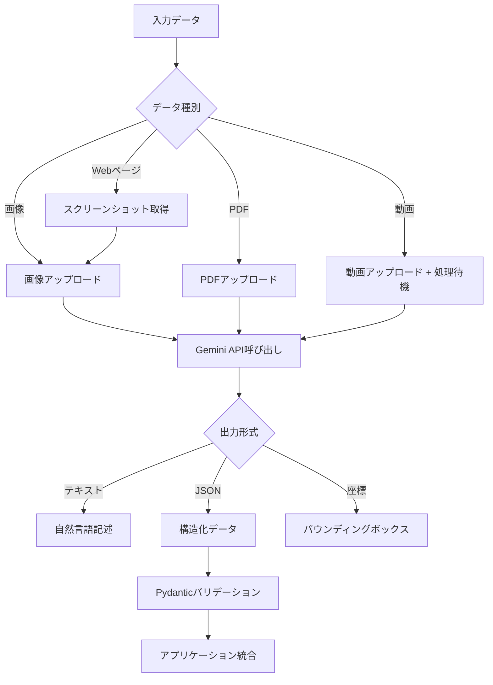

本記事は [7 examples of Gemini's multimodal capabilities in action](https://developers.googleblog.com/en/7-examples-of-geminis-multimodal-capabilities-in-action/) の解説記事です。

## ブログ概要（Summary）

Google Developersブログでは、GeminiのネイティブマルチモーダルAPIを活用した7つの実用例を紹介している。画像の詳細記述、長文PDFの処理（152ページの決算報告書から収益データ抽出）、実世界ドキュメントからの構造化データ抽出、Webページデータ抽出、物体検出、動画要約・文字起こし（最大90分）、動画からの構造化データ抽出の7カテゴリにわたり、Gemini APIの視覚理解能力を実証している。ブログでは特にGemini 1.5 Proが画像・動画理解において高い性能を示すとされ、Gemini 1.5 FlashおよびFlash-8Bは複雑度の低いタスクに推奨されている。

この記事は [Zenn記事: Gemini 2.5 Flash×Pydanticで画像・PDF・動画から構造化データを自動抽出する](https://zenn.dev/0h_n0/articles/c13718739ea17a) の深掘りです。

## 情報源

- **種別**: 企業テックブログ（Google Developers Blog）
- **URL**: [7 examples of Gemini's multimodal capabilities in action](https://developers.googleblog.com/en/7-examples-of-geminis-multimodal-capabilities-in-action/)
- **著者**: Anirudh Baddepudi (Product Manager), Logan Kilpatrick (Group Product Manager)
- **組織**: Google Developers
- **発表日**: 2024年11月25日

## 技術的背景（Technical Background）

### マルチモーダルAIの位置づけ

マルチモーダルAIとは、テキスト・画像・音声・動画など複数の情報形式を統合的に処理するモデルを指す。従来のLLMがテキストのみを扱うのに対し、Geminiはモデルのアーキテクチャレベルで複数モダリティを統合している点が特徴である。

従来の画像処理パイプラインでは、OCRエンジン（Tesseract等）でテキスト抽出し、後段のNLPモデルで意味理解を行う二段階構成が一般的だった。この方式にはいくつかの課題がある。

- **パイプラインの複雑化**: OCR + NLPの二段構成で障害点が増加
- **レイアウト情報の損失**: OCRがテキストを線形化する際に表構造やレイアウト情報が失われる
- **チャート・図表の非対応**: OCRはテキスト抽出に特化しており、グラフや図の意味理解は困難

Geminiはこれらの課題に対し、画像・PDF・動画をネイティブに入力として受け取り、視覚情報とテキスト情報を統合的に処理する。Google Developersブログでは、この統合アプローチにより「テーブルの正確な転写、複雑な多段組レイアウトの解釈、チャート・スケッチ・ダイアグラム・手書き文字の理解」が可能になると紹介している。

### Geminiモデルの使い分け

ブログの公開時点（2024年11月）では以下のモデルが紹介されている。

| モデル | 推奨用途 | 特徴 |
|--------|----------|------|
| Gemini 1.5 Pro | 画像・動画理解の高精度タスク | マルチモーダル性能が最も高い |
| Gemini 1.5 Flash | 中程度の複雑度のタスク | 低レイテンシ・低コスト |
| Gemini 1.5 Flash-8B | 単純なタスク | 最小コスト |

なお、関連Zenn記事ではGemini 2.5 Flashを使用しており、2025年以降のモデルではコスト・性能バランスがさらに改善されている。

## 実装アーキテクチャ（Architecture）

ブログで紹介されている7つの活用例を、Pythonコード（google-genai SDK）を交えて技術的に解説する。以下のコード例はブログの内容を基に、google-genai SDKの公式ドキュメントに準拠して構成している。

### 共通セットアップ

```python
"""Gemini API共通セットアップ

google-genai SDKを使用したクライアント初期化。
APIキーは環境変数GOOGLE_API_KEYから取得する。
"""
from google import genai
from google.genai import types
import os

client = genai.Client(api_key=os.environ["GOOGLE_API_KEY"])

# モデル選択（タスク複雑度に応じて切り替え）
MODEL_HIGH = "gemini-2.5-flash"  # 高精度タスク用
MODEL_FAST = "gemini-2.0-flash"  # 低レイテンシタスク用
```

### 活用例1: 画像の詳細記述

ブログでは、Geminiが画像を入力として受け取り、プロンプトに応じてトーン・長さ・形式を調整した記述を生成できると紹介している。アクセシビリティ対応（alt属性の自動生成）やコンテンツ分析に活用できる。

```python
def describe_image(
    image_path: str,
    tone: str = "technical",
    max_length: int = 500,
) -> str:
    """画像の詳細記述を生成する

    Args:
        image_path: 画像ファイルのパス
        tone: 記述のトーン（"technical", "casual", "formal"）
        max_length: 最大文字数

    Returns:
        画像の詳細記述テキスト
    """
    image_file = client.files.upload(file=image_path)

    response = client.models.generate_content(
        model=MODEL_HIGH,
        contents=[
            types.Content(
                role="user",
                parts=[
                    types.Part.from_uri(
                        file_uri=image_file.uri,
                        mime_type=image_file.mime_type,
                    ),
                    types.Part.from_text(
                        f"Describe this image in {tone} tone. "
                        f"Keep the description under {max_length} characters. "
                        f"Include details about objects, colors, spatial "
                        f"relationships, and any text visible in the image."
                    ),
                ],
            )
        ],
    )
    return response.text
```

ブログでは、プロンプトの指示に応じてモデルが記述の長さ・トーン・形式を柔軟に調整すると述べられている。

### 活用例2: 長文PDFの処理

ブログでは、Alphabet社の決算報告書15件（計152ページ、2021年Q1〜2024年Q3）をGeminiに入力し、Google収益データの抽出・集計・可視化コード生成までを一貫して実行した事例が紹介されている。1000ページ超のPDFも処理可能であり、テーブル転写・多段組レイアウト解釈・チャート理解に対応するとされている。

```python
from pydantic import BaseModel


class QuarterlyRevenue(BaseModel):
    """四半期収益データの構造化モデル"""

    quarter: str        # "Q1 2021" 形式
    revenue_usd_b: float  # 10億ドル単位
    yoy_growth_pct: float | None  # 前年同期比成長率


class RevenueReport(BaseModel):
    """収益レポート全体の構造化モデル"""

    company: str
    data: list[QuarterlyRevenue]
    source_pages: int   # 処理したページ数


def extract_revenue_from_pdfs(
    pdf_paths: list[str],
) -> RevenueReport:
    """複数PDFから収益データを構造化抽出する

    Args:
        pdf_paths: PDFファイルパスのリスト

    Returns:
        構造化された収益レポート
    """
    uploaded_files = []
    for path in pdf_paths:
        uploaded = client.files.upload(file=path)
        uploaded_files.append(uploaded)

    file_parts = [
        types.Part.from_uri(
            file_uri=f.uri,
            mime_type=f.mime_type,
        )
        for f in uploaded_files
    ]

    response = client.models.generate_content(
        model=MODEL_HIGH,
        contents=[
            types.Content(
                role="user",
                parts=[
                    *file_parts,
                    types.Part.from_text(
                        "Extract all quarterly Google revenue data "
                        "from these earnings releases. "
                        "Include year-over-year growth rates. "
                        "Return as structured JSON."
                    ),
                ],
            )
        ],
        config=types.GenerateContentConfig(
            response_mime_type="application/json",
            response_schema=RevenueReport,
        ),
    )
    return RevenueReport.model_validate_json(response.text)
```

ブログでは、Geminiがmarkdownテーブルの生成だけでなく、matplotlibによる可視化コードの自動生成も行ったと報告されている。PDFのネイティブ処理により、従来のOCR→テキスト解析パイプラインと比較して、レイアウト情報の保持とテーブル構造の理解精度が向上している。

### 活用例3: 実世界ドキュメント推論

ブログでは、レシート・ラベル・看板・メモ・ホワイトボードのスケッチなどの実世界ドキュメントからJSON形式で構造化データを抽出する事例が紹介されている。ユーザーが抽出フィールドを指定し、Geminiがドキュメント画像から該当データを推論・抽出する。

```python
class ReceiptItem(BaseModel):
    """レシート内の個別商品"""

    name: str
    quantity: int
    unit_price: float
    total_price: float


class Receipt(BaseModel):
    """レシート全体の構造化データ"""

    store_name: str
    date: str
    items: list[ReceiptItem]
    subtotal: float
    tax: float
    total: float
    payment_method: str | None


def extract_receipt_data(image_path: str) -> Receipt:
    """レシート画像から構造化データを抽出する

    Args:
        image_path: レシート画像のパス

    Returns:
        構造化されたレシートデータ
    """
    image_file = client.files.upload(file=image_path)

    response = client.models.generate_content(
        model=MODEL_HIGH,
        contents=[
            types.Content(
                role="user",
                parts=[
                    types.Part.from_uri(
                        file_uri=image_file.uri,
                        mime_type=image_file.mime_type,
                    ),
                    types.Part.from_text(
                        "Extract all data from this receipt image. "
                        "Include store name, date, individual items "
                        "with quantities and prices, subtotal, tax, "
                        "total, and payment method if visible."
                    ),
                ],
            )
        ],
        config=types.GenerateContentConfig(
            response_mime_type="application/json",
            response_schema=Receipt,
        ),
    )
    return Receipt.model_validate_json(response.text)
```

この活用例は、経費精算の自動化や在庫管理システムとの連携に直結する実践的なユースケースである。

### 活用例4: Webページデータ抽出

ブログでは、Webページのスクリーンショットから構造化データを抽出する事例が紹介されている。Google Play Booksのページから書籍名・著者・星評価・価格を含むJSON配列を40件以上抽出した例が示されている。ブラウジングエージェントやWebデータAPIの構築に応用可能とされている。

```python
class BookEntry(BaseModel):
    """書籍情報の構造化モデル"""

    title: str
    author: str
    star_rating: float | None
    price: str | None  # "$9.99" 形式。無料の場合は "Free"


def extract_webpage_data(
    screenshot_path: str,
    extraction_schema: str = "books",
) -> list[BookEntry]:
    """Webページスクリーンショットから構造化データを抽出する

    Args:
        screenshot_path: スクリーンショット画像のパス
        extraction_schema: 抽出対象のスキーマ種別

    Returns:
        構造化されたデータのリスト
    """
    image_file = client.files.upload(file=screenshot_path)

    response = client.models.generate_content(
        model=MODEL_FAST,
        contents=[
            types.Content(
                role="user",
                parts=[
                    types.Part.from_uri(
                        file_uri=image_file.uri,
                        mime_type=image_file.mime_type,
                    ),
                    types.Part.from_text(
                        "Extract all book entries from this webpage "
                        "screenshot. For each book, extract the title, "
                        "author, star rating, and price. "
                        "Return as a JSON array."
                    ),
                ],
            )
        ],
        config=types.GenerateContentConfig(
            response_mime_type="application/json",
            response_schema=list[BookEntry],
        ),
    )
    import json
    raw = json.loads(response.text)
    return [BookEntry.model_validate(item) for item in raw]
```

DOM解析やWeb APIが利用できない場面（動的レンダリングされたページ、画像ベースのUI等）において、スクリーンショットベースの抽出は代替手段として有効である。

### 活用例5: 物体検出

ブログでは、Geminiが画像内のオブジェクトを検出し、バウンディングボックス座標を生成する機能が紹介されている。専門の物体検出モデル（YOLO等）と比較した場合、Geminiの優位性はユーザー定義の推論基準に基づく検出が可能な点にあるとされている。たとえば「赤い車のみ検出」といった自然言語による条件指定ができる。

```python
class DetectedObject(BaseModel):
    """検出されたオブジェクト"""

    label: str
    confidence: float  # 0.0-1.0
    bounding_box: dict  # {"x_min", "y_min", "x_max", "y_max"}（正規化座標）
    reasoning: str  # 検出根拠の説明


def detect_objects(
    image_path: str,
    detection_criteria: str = "all visible objects",
) -> list[DetectedObject]:
    """画像内のオブジェクトを検出しバウンディングボックスを返す

    Args:
        image_path: 画像ファイルのパス
        detection_criteria: 自然言語による検出条件

    Returns:
        検出されたオブジェクトのリスト
    """
    image_file = client.files.upload(file=image_path)

    response = client.models.generate_content(
        model=MODEL_HIGH,
        contents=[
            types.Content(
                role="user",
                parts=[
                    types.Part.from_uri(
                        file_uri=image_file.uri,
                        mime_type=image_file.mime_type,
                    ),
                    types.Part.from_text(
                        f"Detect {detection_criteria} in this image. "
                        f"For each detected object, provide: "
                        f"1. Label "
                        f"2. Confidence score (0-1) "
                        f"3. Bounding box as normalized coordinates "
                        f"   (x_min, y_min, x_max, y_max in 0-1 range) "
                        f"4. Brief reasoning for the detection. "
                        f"Return as JSON array."
                    ),
                ],
            )
        ],
        config=types.GenerateContentConfig(
            response_mime_type="application/json",
            response_schema=list[DetectedObject],
        ),
    )
    import json
    raw = json.loads(response.text)
    return [DetectedObject.model_validate(item) for item in raw]
```

ブログではGoogle AI Studio上でのバウンディングボックス可視化例が示されており、GitHub上のObject_detection.ipynbノートブックも公開されている。

### 活用例6: 動画要約・文字起こし

ブログでは、最大90分の動画を入力として処理し、視覚フレームと音声の両方を分析する機能が紹介されている。技術講義の講義ノート生成例では、タイムスタンプ付きの章立て構成、テーブル形式のデータ整理、技術的な説明の要約が示されている。

```python
class VideoChapter(BaseModel):
    """動画の章情報"""

    timestamp_start: str  # "MM:SS" 形式
    timestamp_end: str
    title: str
    summary: str
    key_points: list[str]


class VideoSummary(BaseModel):
    """動画要約の構造化モデル"""

    title: str
    duration_minutes: int
    chapters: list[VideoChapter]
    overall_summary: str
    topics_covered: list[str]


def summarize_video(
    video_path: str,
    detail_level: str = "detailed",
    target_audience: str = "high school",
) -> VideoSummary:
    """動画を分析し構造化された要約を生成する

    Args:
        video_path: 動画ファイルのパス
        detail_level: 要約の詳細度（"brief", "detailed", "comprehensive"）
        target_audience: 対象読者レベル

    Returns:
        構造化された動画要約

    Note:
        動画は1 FPSでサンプリングされるため、
        高速に変化するフレームの情報は欠落する可能性がある。
    """
    video_file = client.files.upload(file=video_path)

    # アップロード完了を待機
    import time
    while video_file.state.name == "PROCESSING":
        time.sleep(5)
        video_file = client.files.get(name=video_file.name)

    if video_file.state.name == "FAILED":
        raise RuntimeError(f"Video processing failed: {video_file.name}")

    response = client.models.generate_content(
        model=MODEL_HIGH,
        contents=[
            types.Content(
                role="user",
                parts=[
                    types.Part.from_uri(
                        file_uri=video_file.uri,
                        mime_type=video_file.mime_type,
                    ),
                    types.Part.from_text(
                        f"Analyze this video using both visual frames "
                        f"and audio. Create {detail_level} lecture notes "
                        f"suitable for {target_audience} comprehension. "
                        f"Include: clear chapter divisions with timestamps, "
                        f"key points per chapter, tables where appropriate, "
                        f"and cover content uniformly from start to finish."
                    ),
                ],
            )
        ],
        config=types.GenerateContentConfig(
            response_mime_type="application/json",
            response_schema=VideoSummary,
        ),
    )
    return VideoSummary.model_validate_json(response.text)
```

ブログでは「スライド画像と音声の両方の情報を使用する」よう指示することで、より完全な講義ノートが生成されると述べられている。

### 活用例7: 動画からの構造化データ抽出

ブログでは、動画からリスト・テーブル・JSONオブジェクト形式で構造化データを抽出する事例が紹介されている。カタログ作成、小売エンティティ検出、交通分析、ホームセキュリティ、画面録画データ抽出など幅広い応用が示されている。

```python
class VideoEntity(BaseModel):
    """動画から抽出されたエンティティ"""

    entity_type: str     # "product", "vehicle", "person", etc.
    description: str
    first_appearance: str  # タイムスタンプ
    last_appearance: str
    attributes: dict       # エンティティ固有の属性


class VideoExtraction(BaseModel):
    """動画データ抽出結果"""

    video_duration: str
    total_entities: int
    entities: list[VideoEntity]
    extraction_notes: str  # 1 FPS制約に関する注記


def extract_from_video(
    video_path: str,
    entity_types: list[str],
) -> VideoExtraction:
    """動画から指定タイプのエンティティを構造化抽出する

    Args:
        video_path: 動画ファイルのパス
        entity_types: 抽出対象のエンティティタイプリスト
            例: ["product", "price_tag", "brand_logo"]

    Returns:
        構造化された抽出結果

    Warning:
        1 FPSサンプリングにより、高速に通過するオブジェクトは
        検出漏れの可能性がある。出力の検証を推奨する。
    """
    video_file = client.files.upload(file=video_path)

    import time
    while video_file.state.name == "PROCESSING":
        time.sleep(5)
        video_file = client.files.get(name=video_file.name)

    entity_types_str = ", ".join(entity_types)

    response = client.models.generate_content(
        model=MODEL_HIGH,
        contents=[
            types.Content(
                role="user",
                parts=[
                    types.Part.from_uri(
                        file_uri=video_file.uri,
                        mime_type=video_file.mime_type,
                    ),
                    types.Part.from_text(
                        f"Extract all instances of the following entity "
                        f"types from this video: {entity_types_str}. "
                        f"For each entity, provide: type, description, "
                        f"first and last appearance timestamps, "
                        f"and relevant attributes. "
                        f"Note any items that might have been missed "
                        f"due to 1 FPS sampling limitations."
                    ),
                ],
            )
        ],
        config=types.GenerateContentConfig(
            response_mime_type="application/json",
            response_schema=VideoExtraction,
        ),
    )
    return VideoExtraction.model_validate_json(response.text)
```

ブログでは「1 FPSサンプリングにより、動画内のアイテムを見逃す可能性がある」と明記されており、現時点では出力の検証を推奨している。より高いFPSサンプリングへの対応を開発中であるとも述べられている。

### 処理フロー全体像

7つの活用例を通じたGeminiマルチモーダル処理の全体フローを以下に示す。



## Production Deployment Guide

GeminiマルチモーダルAPIを本番環境で運用する場合のAWSデプロイメントパターンを解説する。GeminiはGoogle CloudのAPIであるため、AWSからはHTTPSエンドポイント経由でのAPI呼び出しとなる。ファイルアップロード・API呼び出し・結果格納の一連のパイプラインをAWS上に構築する。

### AWS実装パターン（コスト最適化重視）

**トラフィック量別の推奨構成**:

| 構成 | 想定リクエスト | 月額概算 | 主要サービス |
|------|--------------|---------|-------------|
| Small | ~100 req/日 | $80-200 | Lambda + S3 + DynamoDB |
| Medium | ~1000 req/日 | $400-1,000 | ECS Fargate + S3 + ElastiCache |
| Large | 10000+ req/日 | $2,500-6,000 | EKS + Spot + S3 + ElastiCache |

**Small構成（~100 req/日）**:
- **Lambda** (512MB, 300秒タイムアウト): Gemini API呼び出し。動画処理は処理時間が長いためStep Functions連携
- **S3**: 入力ファイル（画像・PDF・動画）の一時保存。ライフサイクルポリシーで7日後に自動削除
- **DynamoDB** (On-Demand): 抽出結果のJSON保存、処理状態管理
- **Secrets Manager**: Gemini APIキーの安全な管理
- **CloudWatch**: ログ集約・アラーム
- 月額内訳概算: Lambda $5 + S3 $10 + DynamoDB $15 + Secrets Manager $1 + Gemini API利用料 $50-170

**Medium構成（~1000 req/日）**:
- **ECS Fargate** (0.5 vCPU, 1GB): 常駐ワーカーによる安定した処理
- **SQS**: リクエストキューイング、バースト対応
- **ElastiCache (Redis)**: API応答キャッシュ、重複リクエスト排除
- **S3 + DynamoDB**: Small構成と同様

**Large構成（10000+ req/日）**:
- **EKS** + **Karpenter**: Spot Instances優先の自動スケーリング
- **SQS FIFO**: 順序保証付きキューイング
- **ElastiCache (Redis Cluster)**: 大規模キャッシュ
- **S3 Intelligent-Tiering**: アクセスパターンに応じた自動階層化

**コスト削減テクニック**:
- **Spot Instances**活用でEKSワーカーノードのコストを最大90%削減
- **S3ライフサイクル**ポリシーで一時ファイルを自動削除し保存コスト削減
- **ElastiCache**による同一ファイルの重複API呼び出し排除（キャッシュヒット率に応じてGemini API費用30-50%削減）
- **Step Functions Express Workflows**でLambda実行を最適化

**コスト試算の注意事項**: 上記はAWS ap-northeast-1（東京）リージョンの2026年8月時点の概算値である。Gemini API利用料は処理するファイルのサイズ・種別・モデル選択により大きく変動する。最新料金は[AWS料金計算ツール](https://calculator.aws/)および[Google AI Studio料金ページ](https://ai.google.dev/pricing)で確認を推奨する。

### Terraformインフラコード

**Small構成（Serverless）**:

```hcl
# Geminiマルチモーダル処理パイプライン - Small構成
# Lambda + S3 + DynamoDB + Secrets Manager

terraform {
  required_version = ">= 1.9"
  required_providers {
    aws = {
      source  = "hashicorp/aws"
      version = "~> 5.60"
    }
  }
}

provider "aws" {
  region = "ap-northeast-1"
}

# --- S3: 入力ファイル一時保存 ---
resource "aws_s3_bucket" "input_files" {
  bucket = "gemini-multimodal-input-${data.aws_caller_identity.current.account_id}"
}

resource "aws_s3_bucket_lifecycle_configuration" "input_cleanup" {
  bucket = aws_s3_bucket.input_files.id

  rule {
    id     = "delete-after-7-days"
    status = "Enabled"
    expiration {
      days = 7  # コスト最適化: 処理済みファイルを7日で自動削除
    }
  }
}

resource "aws_s3_bucket_server_side_encryption_configuration" "input_enc" {
  bucket = aws_s3_bucket.input_files.id
  rule {
    apply_server_side_encryption_by_default {
      sse_algorithm = "aws:kms"
    }
  }
}

# --- DynamoDB: 抽出結果保存 ---
resource "aws_dynamodb_table" "extraction_results" {
  name         = "gemini-extraction-results"
  billing_mode = "PAY_PER_REQUEST"  # On-Demand: 低トラフィックでコスト最適
  hash_key     = "request_id"
  range_key    = "created_at"

  attribute {
    name = "request_id"
    type = "S"
  }
  attribute {
    name = "created_at"
    type = "S"
  }

  server_side_encryption {
    enabled = true
  }

  ttl {
    attribute_name = "ttl"
    enabled        = true
  }
}

# --- Secrets Manager: Gemini APIキー ---
resource "aws_secretsmanager_secret" "gemini_api_key" {
  name = "gemini-multimodal/api-key"
}

# --- IAMロール: Lambda用（最小権限） ---
resource "aws_iam_role" "lambda_role" {
  name = "gemini-multimodal-lambda-role"

  assume_role_policy = jsonencode({
    Version = "2012-10-17"
    Statement = [{
      Action = "sts:AssumeRole"
      Effect = "Allow"
      Principal = { Service = "lambda.amazonaws.com" }
    }]
  })
}

resource "aws_iam_role_policy" "lambda_policy" {
  name = "gemini-multimodal-lambda-policy"
  role = aws_iam_role.lambda_role.id

  policy = jsonencode({
    Version = "2012-10-17"
    Statement = [
      {
        Effect   = "Allow"
        Action   = ["s3:GetObject", "s3:PutObject"]
        Resource = "${aws_s3_bucket.input_files.arn}/*"
      },
      {
        Effect   = "Allow"
        Action   = ["dynamodb:PutItem", "dynamodb:GetItem", "dynamodb:UpdateItem"]
        Resource = aws_dynamodb_table.extraction_results.arn
      },
      {
        Effect   = "Allow"
        Action   = ["secretsmanager:GetSecretValue"]
        Resource = aws_secretsmanager_secret.gemini_api_key.arn
      },
      {
        Effect   = "Allow"
        Action   = ["logs:CreateLogGroup", "logs:CreateLogStream", "logs:PutLogEvents"]
        Resource = "arn:aws:logs:*:*:*"
      }
    ]
  })
}

# --- Lambda関数 ---
resource "aws_lambda_function" "gemini_processor" {
  function_name = "gemini-multimodal-processor"
  role          = aws_iam_role.lambda_role.arn
  handler       = "handler.lambda_handler"
  runtime       = "python3.12"
  timeout       = 300  # 動画処理は最大5分
  memory_size   = 512  # PDF/動画処理にはメモリが必要

  filename = "lambda_package.zip"

  environment {
    variables = {
      RESULTS_TABLE   = aws_dynamodb_table.extraction_results.name
      INPUT_BUCKET    = aws_s3_bucket.input_files.id
      SECRET_ARN      = aws_secretsmanager_secret.gemini_api_key.arn
    }
  }
}

# --- CloudWatch アラーム ---
resource "aws_cloudwatch_metric_alarm" "lambda_errors" {
  alarm_name          = "gemini-processor-errors"
  comparison_operator = "GreaterThanThreshold"
  evaluation_periods  = 2
  metric_name         = "Errors"
  namespace           = "AWS/Lambda"
  period              = 300
  statistic           = "Sum"
  threshold           = 5
  alarm_description   = "Lambda error rate exceeded threshold"

  dimensions = {
    FunctionName = aws_lambda_function.gemini_processor.function_name
  }
}

data "aws_caller_identity" "current" {}
```

**Large構成（Container）**:

```hcl
# Geminiマルチモーダル処理パイプライン - Large構成
# EKS + Karpenter + Spot Instances

module "eks" {
  source  = "terraform-aws-modules/eks/aws"
  version = "~> 20.0"

  cluster_name    = "gemini-multimodal-cluster"
  cluster_version = "1.30"

  vpc_id     = module.vpc.vpc_id
  subnet_ids = module.vpc.private_subnets

  cluster_endpoint_public_access = false  # セキュリティ: プライベートのみ

  eks_managed_node_groups = {
    system = {
      instance_types = ["m7i.large"]
      min_size       = 2
      max_size       = 2
      desired_size   = 2
    }
  }
}

# Karpenter: Spot優先の自動スケーリング
resource "kubectl_manifest" "karpenter_nodepool" {
  yaml_body = yamlencode({
    apiVersion = "karpenter.sh/v1"
    kind       = "NodePool"
    metadata   = { name = "gemini-workers" }
    spec = {
      template = {
        spec = {
          requirements = [
            { key = "karpenter.sh/capacity-type", operator = "In", values = ["spot", "on-demand"] },
            { key = "node.kubernetes.io/instance-type", operator = "In",
              values = ["m7i.xlarge", "m6i.xlarge", "m5.xlarge", "c7i.xlarge"] },
          ]
          nodeClassRef = { name = "default" }
        }
      }
      limits   = { cpu = "100", memory = "400Gi" }
      disruption = {
        consolidationPolicy = "WhenEmptyOrUnderutilized"
        consolidateAfter    = "30s"
      }
    }
  })
}

# AWS Budgets: 月額予算アラート
resource "aws_budgets_budget" "monthly" {
  name         = "gemini-multimodal-monthly"
  budget_type  = "COST"
  limit_amount = "6000"
  limit_unit   = "USD"
  time_unit    = "MONTHLY"

  notification {
    comparison_operator       = "GREATER_THAN"
    threshold                 = 80
    threshold_type            = "PERCENTAGE"
    notification_type         = "ACTUAL"
    subscriber_email_addresses = ["ops-team@example.com"]
  }
}
```

### 運用・監視設定

**CloudWatch Logs Insights クエリ**（Gemini API呼び出し分析）:

```
# 1時間あたりのGemini API呼び出し回数とレイテンシ
fields @timestamp, @message
| filter @message like /gemini_api_call/
| stats count() as api_calls,
        avg(duration_ms) as avg_latency,
        pct(duration_ms, 95) as p95_latency,
        pct(duration_ms, 99) as p99_latency,
        sum(input_tokens) as total_input_tokens,
        sum(output_tokens) as total_output_tokens
  by bin(1h) as time_bucket
| sort time_bucket desc
```

**CloudWatch アラーム設定**（Python boto3）:

```python
import boto3


def create_gemini_alarms(function_name: str, sns_topic_arn: str) -> None:
    """Gemini処理パイプラインの監視アラームを作成する

    Args:
        function_name: Lambda関数名
        sns_topic_arn: 通知先SNSトピックARN
    """
    cw = boto3.client("cloudwatch")

    # Lambda実行時間の異常検知（P95が200秒超過）
    cw.put_metric_alarm(
        AlarmName=f"{function_name}-high-duration",
        MetricName="Duration",
        Namespace="AWS/Lambda",
        Statistic="p95",
        Period=300,
        EvaluationPeriods=2,
        Threshold=200000,  # 200秒（ミリ秒単位）
        ComparisonOperator="GreaterThanThreshold",
        Dimensions=[{"Name": "FunctionName", "Value": function_name}],
        AlarmActions=[sns_topic_arn],
    )

    # エラー率の異常検知（5分間で10件超過）
    cw.put_metric_alarm(
        AlarmName=f"{function_name}-error-spike",
        MetricName="Errors",
        Namespace="AWS/Lambda",
        Statistic="Sum",
        Period=300,
        EvaluationPeriods=1,
        Threshold=10,
        ComparisonOperator="GreaterThanThreshold",
        Dimensions=[{"Name": "FunctionName", "Value": function_name}],
        AlarmActions=[sns_topic_arn],
    )
```

**X-Ray トレーシング設定**:

```python
from aws_xray_sdk.core import xray_recorder, patch_all
import boto3


# boto3の自動計装
patch_all()


@xray_recorder.capture("gemini_api_call")
def traced_gemini_call(
    file_uri: str,
    model: str,
    prompt: str,
) -> dict:
    """X-Rayトレーシング付きGemini API呼び出し

    Args:
        file_uri: アップロード済みファイルのURI
        model: 使用するGeminiモデル名
        prompt: プロンプト文字列

    Returns:
        Gemini APIレスポンス
    """
    subsegment = xray_recorder.current_subsegment()
    subsegment.put_annotation("model", model)
    subsegment.put_metadata("file_uri", file_uri)

    # Gemini API呼び出し（実装は省略）
    result = call_gemini_api(file_uri, model, prompt)

    subsegment.put_metadata("token_count", {
        "input": result.get("input_tokens", 0),
        "output": result.get("output_tokens", 0),
    })
    return result
```

**Cost Explorer 日次レポート**:

```python
import boto3
from datetime import datetime, timedelta


def daily_cost_report(sns_topic_arn: str) -> None:
    """日次コストレポートを生成しSNS通知する

    Args:
        sns_topic_arn: 通知先SNSトピックARN
    """
    ce = boto3.client("ce")
    sns = boto3.client("sns")

    today = datetime.utcnow().strftime("%Y-%m-%d")
    yesterday = (datetime.utcnow() - timedelta(days=1)).strftime("%Y-%m-%d")

    response = ce.get_cost_and_usage(
        TimePeriod={"Start": yesterday, "End": today},
        Granularity="DAILY",
        Metrics=["UnblendedCost"],
        Filter={
            "Tags": {
                "Key": "Project",
                "Values": ["gemini-multimodal"],
            }
        },
        GroupBy=[{"Type": "SERVICE", "Key": "SERVICE"}],
    )

    total = sum(
        float(g["Metrics"]["UnblendedCost"]["Amount"])
        for r in response["ResultsByTime"]
        for g in r["Groups"]
    )

    if total > 100:  # $100/日を超過した場合に通知
        sns.publish(
            TopicArn=sns_topic_arn,
            Subject=f"[ALERT] Gemini Pipeline Cost: ${total:.2f}/day",
            Message=f"Daily cost exceeded $100 threshold: ${total:.2f}",
        )
```

### コスト最適化チェックリスト

**アーキテクチャ選択**:
- [ ] トラフィック ~100 req/日 → Serverless（Lambda + S3 + DynamoDB）
- [ ] トラフィック ~1000 req/日 → Hybrid（ECS Fargate + SQS + ElastiCache）
- [ ] トラフィック 10000+ req/日 → Container（EKS + Karpenter + Spot）

**リソース最適化**:
- [ ] EC2/EKS: Spot Instances優先（最大90%削減）
- [ ] Reserved Instances: 安定ワークロードに1年コミット（最大72%削減）
- [ ] Savings Plans: Compute Savings Plans検討
- [ ] Lambda: メモリサイズをPower Tuningで最適化（512MB推奨の検証）
- [ ] ECS/EKS: アイドル時のスケールダウン設定（Karpenter consolidation）
- [ ] S3: ライフサイクルポリシーで一時ファイル自動削除（7日）

**LLMコスト削減**:
- [ ] **モデル選択ロジック**: タスク複雑度に応じてgemini-2.5-flash / gemini-2.0-flashを使い分け
- [ ] **キャッシュ活用**: 同一ファイルの重複API呼び出しをElastiCacheで排除
- [ ] **バッチ処理**: 複数ファイルを1リクエストにまとめてオーバーヘッド削減
- [ ] **トークン数制限**: max_output_tokensの適切な設定でコスト抑制

**監視・アラート**:
- [ ] AWS Budgets: 月額予算アラート設定（80%/100%閾値）
- [ ] CloudWatch アラーム: Lambda実行時間・エラー率の異常検知
- [ ] Cost Anomaly Detection: 異常コスト自動検知の有効化
- [ ] 日次コストレポート: Cost Explorer + SNS通知
- [ ] Gemini APIトークン使用量のカスタムメトリクス記録

**リソース管理**:
- [ ] 未使用リソースの定期削除（S3一時ファイル、DynamoDB TTL）
- [ ] タグ戦略: 全リソースにProject/Environment/Ownerタグ
- [ ] S3ライフサイクルポリシー: 処理済みファイルの自動削除
- [ ] 開発環境の夜間停止（ECS desired_count=0）
- [ ] NAT Gatewayの不使用（Small構成ではVPCエンドポイントで代替）

## パフォーマンス最適化

### トークンコストの考慮

マルチモーダル入力はテキスト入力と比較してトークン消費量が大きい。ブログでは具体的なトークン数は明示されていないが、以下の傾向がある。

| 入力タイプ | トークン消費の特徴 | 最適化戦略 |
|-----------|-------------------|-----------|
| 画像（単一） | 解像度に依存 | 必要十分な解像度にリサイズ |
| PDF（複数ページ） | ページ数に比例 | 必要なページのみ抽出して入力 |
| 動画（長尺） | 1 FPS × 秒数のフレーム＋音声 | 必要な区間のみトリミング |

### レイテンシ最適化

```python
import asyncio
from typing import TypeVar
from pydantic import BaseModel

T = TypeVar("T", bound=BaseModel)


async def batch_process_images(
    image_paths: list[str],
    max_concurrent: int = 5,
) -> list[dict]:
    """複数画像を並列処理してレイテンシを削減する

    Args:
        image_paths: 画像ファイルパスのリスト
        max_concurrent: 最大並列数（API Rate Limit考慮）

    Returns:
        各画像の処理結果リスト
    """
    semaphore = asyncio.Semaphore(max_concurrent)

    async def process_one(path: str) -> dict:
        async with semaphore:
            # 同期APIをスレッドプール経由で呼び出し
            loop = asyncio.get_event_loop()
            result = await loop.run_in_executor(
                None,
                lambda: describe_image(path),
            )
            return {"path": path, "result": result}

    tasks = [process_one(path) for path in image_paths]
    return await asyncio.gather(*tasks)
```

**最適化ポイント**:
- **並列度の制御**: Gemini APIのRate Limitに応じてセマフォで並列数を制御
- **入力サイズの削減**: 画像のリサイズ、PDFのページ分割、動画のトリミング
- **キャッシュ**: 同一入力に対する結果をRedis等にキャッシュし、重複API呼び出しを排除
- **モデル選択**: 単純なタスクにはFlash系モデルを使用してレイテンシを短縮

## 運用での学び（Production Lessons）

### 1 FPSサンプリングの制約

ブログでは動画処理における重要な制約として「1 FPSサンプリングにより、モデルは動画内のアイテムを見逃す場合がある」と明記されている。これは以下のユースケースで影響が生じる。

- **高速移動物体の検出**: 1秒未満で通過するオブジェクトは検出漏れの可能性
- **瞬間的なテキスト表示**: フラッシュ的に表示されるテロップやテキスト
- **連続動作の分析**: 手話認識やジェスチャー認識には不十分

ブログではより高いFPSサンプリングの対応を開発中であると述べられている。

### 構造化出力の信頼性

Geminiの構造化出力は高い精度を示すが、以下の点に注意が必要である。

- **フィールドの欠落**: 画像内の情報が不鮮明な場合、JSONフィールドがnullになる可能性
- **数値の誤認識**: 手書き文字や低解像度画像での数値読み取り誤差
- **言語混在**: 日本語と英語が混在するドキュメントでの抽出精度への影響

関連Zenn記事ではPydanticによるバリデーション層を設けることでこれらの問題に対処しており、ブログの内容と組み合わせることで本番運用に耐える信頼性を確保できる。

### ファイルサイズと処理時間

大容量ファイルの処理では、以下の運用上の考慮が必要となる。

- **アップロード時間**: 大容量動画（数百MB）のアップロードにはネットワーク帯域に依存した時間を要する
- **処理待機**: 動画ファイルはアップロード後に`PROCESSING`状態を経てから処理可能になる
- **タイムアウト設計**: Lambda等のサーバーレス環境では実行時間制限（最大15分）に注意が必要

## 学術研究との関連（Academic Connection）

GeminiのマルチモーダルアーキテクチャはTransformerベースの統合モデルであり、以下の学術研究と関連が深い。

- **ViT (Vision Transformer)** (Dosovitskiy et al., 2020): 画像をパッチ分割してTransformerで処理する手法。Geminiの画像理解の基盤アーキテクチャに関連する
- **Flamingo** (Alayrac et al., 2022): DeepMindによるfew-shotマルチモーダルモデル。テキストと画像のインターリーブ入力を処理する能力はGeminiにも共通する
- **GPT-4V** (OpenAI, 2023): 競合するマルチモーダルモデル。Geminiとの比較においてPDF理解や長文コンテキスト処理での差異が研究対象となっている

ブログで紹介されている物体検出機能は、従来のCNN系検出器（YOLOシリーズ等）と異なり、推論能力を伴う検出が可能である。これはGrounding DINOなどのopen-vocabulary detection研究と方向性を同じくするが、Geminiは専用の検出ヘッドを持たず、言語モデルの汎用的な推論能力で検出を実現している点が特徴的である。

## まとめと実践への示唆

Google Developersブログで紹介されたGeminiの7つのマルチモーダル活用例は、従来のOCR + NLPパイプラインを単一のAPIコールに置き換えるアプローチを示している。画像記述、PDF処理、ドキュメント推論、Webデータ抽出、物体検出、動画要約、動画データ抽出という幅広いユースケースにおいて、統一的なAPIインターフェースで対応できる点は開発効率の観点から実用的である。

一方で、1 FPSサンプリングによる動画処理の制約や、構造化出力の検証必要性など、本番運用においては追加のバリデーション層が不可欠である。関連Zenn記事で紹介されているPydantic + Gemini 2.5 Flashの組み合わせは、ブログの活用例を本番レベルに引き上げるための実践的なアプローチとなる。

**実践への推奨アクション**:
1. まずは単一画像の構造化抽出から開始し、Pydanticモデルの設計を固める
2. PDF処理ではページ分割による段階的な処理を検討する
3. 動画処理は1 FPS制約を前提とした出力検証パイプラインを設計する

## 参考文献

- **Blog URL**: [7 examples of Gemini's multimodal capabilities in action](https://developers.googleblog.com/en/7-examples-of-geminis-multimodal-capabilities-in-action/)
- **Google AI Studio**: [https://aistudio.google.com/](https://aistudio.google.com/)
- **google-genai SDK**: [https://github.com/google-gemini/generative-ai-python](https://github.com/google-gemini/generative-ai-python)
- **Gemini API Developer Guide (Vision)**: [https://ai.google.dev/gemini-api/docs/vision](https://ai.google.dev/gemini-api/docs/vision)
- **Object Detection Cookbook**: [https://github.com/google-gemini/cookbook/blob/main/examples/Object_detection.ipynb](https://github.com/google-gemini/cookbook/blob/main/examples/Object_detection.ipynb)
- **Related Zenn article**: [Gemini 2.5 Flash×Pydanticで画像・PDF・動画から構造化データを自動抽出する](https://zenn.dev/0h_n0/articles/c13718739ea17a)
