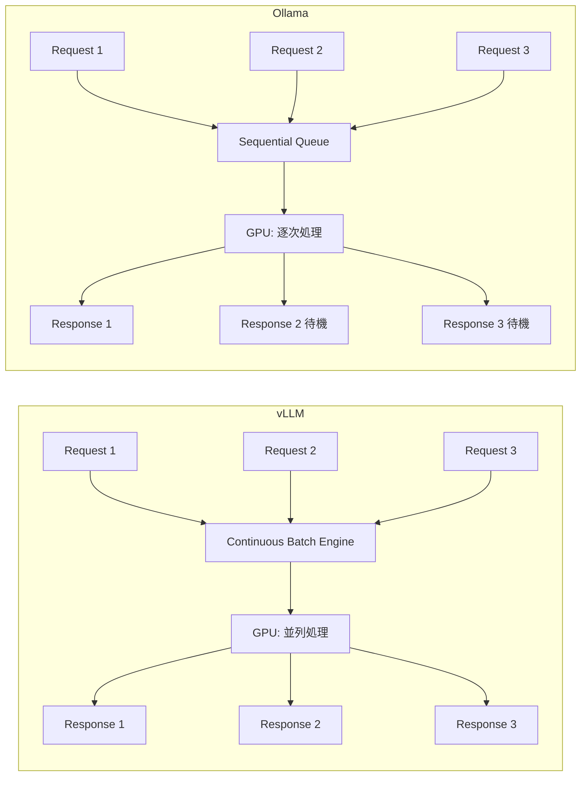

本記事は [Ollama vs. vLLM: A deep dive into performance benchmarking](https://developers.redhat.com/articles/2025/08/08/ollama-vs-vllm-deep-dive-performance-benchmarking) の解説記事です。

## ブログ概要（Summary）

Red Hat Developer Blogにおいて、Harshith Umesh氏がOllamaとvLLMの推論性能を同一ハードウェア（NVIDIA A100-PCIE-40GB）上で体系的に比較した検証レポートを公開している。同一モデル（Llama-3.1-8B-Instruct）・同一GPU・同一テストツール（GuideLLM v0.2.1）という統制された条件下で、スループット・レイテンシ・スケーラビリティの3軸で評価を実施している。著者は、単一リクエスト時には両者の性能差がほぼ無い一方、並行リクエスト数が増加するとvLLMがスループットで最大約19倍の差をつける結果を報告している。この差はvLLMのcontinuous batching機構とOllamaの逐次処理アーキテクチャの違いに起因すると著者は分析している。

この記事は [Zenn記事: OllamaオンプレLLMのモデルCI/CD構築 GitHub Actions×自動評価で安全にモデル更新](https://zenn.dev/0h_n0/articles/8318f1309a4f18) の深掘りです。

## 情報源

- **種別**: 企業テックブログ
- **URL**: [https://developers.redhat.com/articles/2025/08/08/ollama-vs-vllm-deep-dive-performance-benchmarking](https://developers.redhat.com/articles/2025/08/08/ollama-vs-vllm-deep-dive-performance-benchmarking)
- **組織**: Red Hat（Developer Blog）
- **著者**: Harshith Umesh
- **発表日**: 2025年8月8日

## 技術的背景（Technical Background）

LLM推論サーバの選択は、プロダクション環境のコスト効率と応答品質を大きく左右する。OllamaとvLLMはどちらもオープンソースのLLM推論エンジンだが、設計思想が根本的に異なる。

Ollamaは、ローカル環境でのLLM利用を簡単にすることを目的として設計されている。`ollama run llama3.1`のようなCLIでモデルのダウンロードから実行まで完結する。一方vLLMは、UC Berkeleyの研究チームが開発した推論エンジンで、PagedAttentionによる高効率なメモリ管理と、continuous batchingによる高スループット推論を主眼に設計されている。

このレポートの価値は、同一ハードウェア・同一モデル・同一測定ツールという厳密に統制された条件下で比較を行っている点にある。LLM推論の性能比較では、量子化の有無やGPUの種類によって結果が大きく変動するため、条件の統一は不可欠である。著者はOpenShift 4.17.15上でA100-PCIE-40GBを1基搭載した環境を使用し、GuideLLM v0.2.1で各テスト300秒間実行している。

## 実装アーキテクチャ（Architecture）

OllamaとvLLMの性能差を理解するには、リクエスト処理のアーキテクチャの違いを把握する必要がある。

### vLLM: Continuous Batching

vLLMは**continuous batching**（連続バッチ処理）を採用している。従来のstatic batchingでは、バッチ内の全リクエストの生成が完了するまで新規リクエストを受け付けないが、continuous batchingでは生成完了したリクエストのスロットに即座に新規リクエストを投入する。GPUの演算ユニットが常に高い稼働率を維持できる。

さらにvLLMはPagedAttentionによってKVキャッシュをページ単位で管理し、メモリ断片化を防ぐ。同時処理可能なリクエスト数が増加し、GPUメモリの利用効率が向上する。

### Ollama: Sequential Processing

著者の分析によると、Ollamaはリクエストを逐次的にキューイングして処理する。複数のリクエストが到着しても、GPUに投入されるのは1つずつである。結果として、並行リクエスト数が増加すると後続のリクエストはキュー内で待機することになり、レイテンシが線形に増加する。



このアーキテクチャ差が、並行処理時の性能に決定的な違いを生む。同一A100 GPUであっても、著者の報告によればvLLMでは約5倍多くの並行ユーザーにサービスを提供できるとしている。

### スループットの数理モデル

推論サーバのスループットは以下のように定式化できる。

$$
T_{\text{effective}} = \frac{B_{\text{active}} \times f_{\text{GPU}}}{L_{\text{seq}}}
$$

ここで、
- $T_{\text{effective}}$: 実効スループット（tokens/sec）
- $B_{\text{active}}$: 同時にGPU上で処理されているアクティブなバッチサイズ
- $f_{\text{GPU}}$: GPU演算速度（tokens/sec/batch）
- $L_{\text{seq}}$: 平均出力系列長

Ollamaの場合は$B_{\text{active}} = 1$で固定されるため、$T_{\text{effective}}$はリクエスト数に依存せず一定となる。vLLMの場合は$B_{\text{active}}$がGPUメモリの許す限り増加し、$T_{\text{effective}}$がスケールする。

## Production Deployment Guide

本ベンチマーク結果を踏まえ、LLM推論サーバをAWS上にデプロイする際の実装パターンを示す。Ollamaは開発・CI/CD用途、vLLMは本番推論用途として構成する。

### AWS実装パターン（コスト最適化重視）

| 構成 | トラフィック | AWS構成 | GPU | 月額概算 |
|------|-------------|---------|-----|---------|
| Small | ~100 req/日 | EC2 g5.xlarge + Ollama | A10G 1基 | $400-600 |
| Medium | ~1,000 req/日 | ECS Fargate + vLLM on g5.2xlarge | A10G 1基 | $1,200-2,000 |
| Large | 10,000+ req/日 | EKS + vLLM + Karpenter Spot | A10G/A100複数基 | $3,000-8,000 |

**注意**: 上記コストは2026年8月時点のAWS ap-northeast-1（東京）リージョンの料金に基づく概算値である。実際のコストはトラフィックパターン、リージョン、バースト使用量により変動する。最新料金はAWS料金計算ツールで確認を推奨する。

**Small構成（~100 req/日）**: 開発・CI/CD環境向け。EC2 g5.xlargeインスタンス上でOllamaを実行する。並行リクエストが少ないため、Ollamaの逐次処理でも十分な応答速度が得られる。Reserved Instancesの1年コミットで約40%のコスト削減が可能。

**Medium構成（~1,000 req/日）**: vLLMをECS Fargateで運用する。ALB（Application Load Balancer）経由でリクエストを分散し、CloudWatch Metricsに基づくオートスケーリングを設定する。GPUインスタンスの夜間停止により30-40%のコスト削減が見込める。

**Large構成（10,000+ req/日）**: EKS上でvLLMをデプロイし、KarpenterによるSpot Instancesの自動プロビジョニングで最大70%のコスト削減を実現する。複数GPUノードにvLLMワーカーを分散配置し、Istio/Envoyでトラフィック制御を行う。

**コスト削減テクニック**:
- Spot Instances活用でGPUインスタンスコストを最大70-90%削減
- Reserved Instances（1年）で最大40%、3年で最大60%削減
- 夜間・休日のスケールダウンで30-40%削減
- vLLMのcontinuous batchingにより同一GPUで5倍のリクエスト処理が可能（ベンチマーク結果に基づく）

### Terraformインフラコード

**Small構成（EC2 + Ollama: 開発/CI向け）**:

```hcl
# Small構成: EC2 g5.xlarge + Ollama（開発環境・CI/CD用）
resource "aws_instance" "ollama_dev" {
  ami           = data.aws_ami.deep_learning.id
  instance_type = "g5.xlarge"  # A10G 24GB VRAM
  subnet_id     = aws_subnet.private.id

  root_block_device {
    volume_size = 200
    volume_type = "gp3"
    encrypted   = true
    kms_key_id  = aws_kms_key.main.arn
  }

  iam_instance_profile = aws_iam_instance_profile.ollama.name
  user_data = <<-EOF
    #!/bin/bash
    curl -fsSL https://ollama.ai/install.sh | sh
    ollama pull llama3.1:8b-instruct-fp16
    systemctl enable ollama
  EOF

  tags = { Name = "ollama-dev", Environment = "development", CostCenter = "ml-inference" }
}

resource "aws_cloudwatch_metric_alarm" "gpu_utilization" {
  alarm_name          = "ollama-gpu-utilization-high"
  comparison_operator = "GreaterThanThreshold"
  evaluation_periods  = 3
  metric_name         = "GPUUtilization"
  namespace           = "Custom/GPU"
  period              = 300
  statistic           = "Average"
  threshold           = 90
  alarm_actions       = [aws_sns_topic.alerts.arn]
}
```

**Large構成（EKS + vLLM + Karpenter）**:

```hcl
# Large構成: EKS + vLLM + Karpenter Spot Instances
# 用途: 本番推論サービス（10,000+ req/日）

module "eks" {
  source          = "terraform-aws-modules/eks/aws"
  version         = "~> 20.0"
  cluster_name    = "vllm-inference"
  cluster_version = "1.30"
  vpc_id          = module.vpc.vpc_id
  subnet_ids      = module.vpc.private_subnets

  # パブリックアクセス最小化
  cluster_endpoint_public_access = false
}

# Karpenter Provisioner: Spot優先でGPUノードを自動プロビジョニング
resource "kubectl_manifest" "karpenter_nodepool" {
  yaml_body = yamlencode({
    apiVersion = "karpenter.sh/v1"
    kind       = "NodePool"
    metadata   = { name = "gpu-inference" }
    spec = {
      template = {
        spec = {
          requirements = [
            { key = "karpenter.sh/capacity-type", operator = "In", values = ["spot", "on-demand"] },
            { key = "node.kubernetes.io/instance-type", operator = "In",
              values = ["g5.2xlarge", "g5.4xlarge", "p4d.24xlarge"] },
          ]
          nodeClassRef = { name = "gpu-node" }
        }
      }
      limits   = { cpu = "128", memory = "512Gi" }
      disruption = {
        consolidationPolicy = "WhenEmptyOrUnderutilized"
        consolidateAfter    = "60s"
      }
    }
  })
}

# Secrets Manager: vLLM設定
resource "aws_secretsmanager_secret" "vllm_config" {
  name       = "vllm-inference-config"
  kms_key_id = aws_kms_key.main.arn
}

# AWS Budgets: 月次予算アラート
resource "aws_budgets_budget" "inference" {
  name         = "vllm-inference-monthly"
  budget_type  = "COST"
  limit_amount = "8000"
  limit_unit   = "USD"
  time_unit    = "MONTHLY"

  notification {
    comparison_operator       = "GREATER_THAN"
    threshold                 = 80
    threshold_type            = "PERCENTAGE"
    notification_type         = "ACTUAL"
    subscriber_sns_topic_arns = [aws_sns_topic.cost_alerts.arn]
  }
}
```

### 運用・監視設定

**CloudWatch Logs Insights クエリ**: 推論レイテンシの異常検知に使用する。

```
# vLLM推論レイテンシ分析（P95, P99）
fields @timestamp, latency_ms, tokens_generated, model
| filter service = "vllm-inference"
| stats percentile(latency_ms, 95) as p95,
        percentile(latency_ms, 99) as p99,
        avg(tokens_generated) as avg_tokens,
        count(*) as request_count
  by bin(1h) as time_bucket
| sort time_bucket desc
```

**CloudWatchアラーム設定**:

```python
import boto3

cloudwatch = boto3.client("cloudwatch", region_name="ap-northeast-1")

def create_latency_alarm(threshold_ms: float = 500.0) -> None:
    """推論レイテンシP99が閾値を超えた場合のアラーム"""
    cloudwatch.put_metric_alarm(
        AlarmName="vllm-p99-latency-high",
        MetricName="InferenceLatencyP99",
        Namespace="Custom/vLLM",
        Statistic="Maximum",
        Period=300,
        EvaluationPeriods=3,
        Threshold=threshold_ms,
        ComparisonOperator="GreaterThanThreshold",
        AlarmActions=["arn:aws:sns:ap-northeast-1:ACCOUNT:vllm-alerts"],
        TreatMissingData="breaching",
    )
```

**X-Rayトレーシング設定**:

```python
from aws_xray_sdk.core import xray_recorder, patch_all

patch_all()  # boto3自動計装

@xray_recorder.capture("vllm_inference")
def invoke_vllm(prompt: str, max_tokens: int = 512) -> dict:
    """vLLM推論呼び出しのトレーシング"""
    subsegment = xray_recorder.current_subsegment()
    subsegment.put_annotation("model", "llama-3.1-8b-instruct")
    subsegment.put_metadata("prompt_length", len(prompt))
    # ... 推論実行 ...
    subsegment.put_metadata("tokens_generated", result["usage"]["completion_tokens"])
    return result
```

**Cost Explorer日次レポート**:

```python
import boto3
from datetime import date, timedelta

def get_daily_inference_cost() -> dict:
    """日次推論コストを取得し、閾値超過時にSNS通知"""
    ce = boto3.client("ce", region_name="us-east-1")
    today = date.today()
    response = ce.get_cost_and_usage(
        TimePeriod={"Start": str(today - timedelta(days=1)), "End": str(today)},
        Granularity="DAILY",
        Metrics=["UnblendedCost"],
        Filter={"Tags": {"Key": "CostCenter", "Values": ["ml-inference"]}},
    )
    cost = float(response["ResultsByTime"][0]["Total"]["UnblendedCost"]["Amount"])
    if cost > 100.0:
        boto3.client("sns", region_name="ap-northeast-1").publish(
            TopicArn="arn:aws:sns:ap-northeast-1:ACCOUNT:cost-alerts",
            Subject=f"Inference cost alert: ${cost:.2f}/day",
            Message=f"日次推論コストが$100を超過: ${cost:.2f}",
        )
    return {"date": str(today - timedelta(days=1)), "cost_usd": cost}
```

### コスト最適化チェックリスト

**アーキテクチャ選択**:
- [ ] トラフィック量で判断: ~100 req/日ならOllama on EC2、1,000+ならvLLM on ECS/EKS
- [ ] 開発/CI環境とプロダクション環境でランタイムを分離

**リソース最適化**:
- [ ] GPUインスタンス: Spot Instances優先（g5系で最大70%削減）
- [ ] Reserved Instances: 安定負荷には1年コミット（40%削減）
- [ ] Savings Plans: コンピュートリソース全体で検討
- [ ] 夜間・休日スケールダウン自動化（EventBridge + Lambda）
- [ ] Karpenter consolidation設定でアイドルノード自動削除

**LLM推論コスト削減**:
- [ ] vLLMのcontinuous batchingで同一GPUの処理効率5倍向上
- [ ] KVキャッシュサイズの適切な設定（gpu-memory-utilization パラメータ）
- [ ] 量子化（AWQ/GPTQ）でVRAM使用量削減、小型GPU使用可能に
- [ ] 入出力トークン数の上限設定

**監視・アラート**:
- [ ] AWS Budgets: 月次予算の80%/100%でSNS通知
- [ ] CloudWatch: P99レイテンシ、GPU使用率、OOMエラー検知
- [ ] Cost Anomaly Detection有効化
- [ ] 日次コストレポート自動送信

**リソース管理**:
- [ ] 未使用GPUインスタンスの自動停止
- [ ] CostCenterタグ戦略（ml-inference / ml-dev / ml-ci）
- [ ] EBSスナップショットのライフサイクルポリシー（30日保持）
- [ ] 開発環境の夜間自動停止（cron: 20:00停止、08:00起動）
- [ ] モデルアーティファクトのS3ライフサイクル（Intelligent-Tiering）

## パフォーマンス最適化（Performance）

著者が報告しているベンチマーク結果を以下にまとめる。テスト条件は、NVIDIA A100-PCIE-40GB上でLlama-3.1-8B-Instruct（FP16、同一重み）を使用し、GuideLLM v0.2.1で各テスト300秒間実行している。

### スループット比較

| 並行リクエスト数 | Ollama (tokens/sec) | vLLM (tokens/sec) | vLLM/Ollama比 |
|:---:|:---:|:---:|:---:|
| 1 | ~35-40 | ~35-40 | ~1.0x |
| 50 | ~4 | ~18 | ~4.5x |
| 100 | OOM | ~12 | - |
| 256 (ピーク) | 41 | 793 | ~19.3x |

### レイテンシ比較

| 指標 | Ollama | vLLM |
|:---|:---:|:---:|
| P99レイテンシ（ピーク時） | 673 ms | 80 ms |
| レイテンシ安定性 | 並行数に比例して増加 | 高並行数でも安定 |

著者は、単一リクエスト時には両エンジンがほぼ同等の性能を示す一方、並行リクエスト数を1から256まで増加させると、vLLMが線形にスケールするのに対しOllamaが早期にプラトーに達すると報告している。100並行リクエスト時にOllamaがOOMに達する一方、vLLMは安定的に処理を継続できた点は注目に値する。

### スループットの効率指標

GPU1基あたりのスループット効率を以下の式で定義する。

$$
\eta_{\text{GPU}} = \frac{T_{\text{observed}}}{T_{\text{theoretical\_peak}}} \times 100\%
$$

ここで、$T_{\text{observed}}$は実測スループット、$T_{\text{theoretical\_peak}}$はGPUの理論的最大スループットである。ピーク時のvLLM（793 TPS）とOllama（41 TPS）の$\eta_{\text{GPU}}$の差は、continuous batchingによるGPU演算ユニット稼働率の違いを直接反映している。

## 運用での学び（Production Lessons）

著者のベンチマーク結果から抽出できる運用上の知見を以下に整理する。

**推論サーバ選定の判断基準**: 著者は、Ollamaをローカルプロトタイピング・開発環境向け、vLLMを本番デプロイメント向けと位置づけている。この使い分けは合理的であり、Zenn記事で扱うCI/CDパイプラインにおいても、CI環境でのモデル評価にはOllamaの手軽さが有利だが、ステージング・本番環境の推論負荷テストにはvLLMが適している。

**OOMリスクの管理**: Ollamaが100並行リクエストでOOMに達した事実は、本番環境での負荷急増時にサービスダウンのリスクがあることを示す。vLLMのPagedAttentionはKVキャッシュをページ単位で管理するため、メモリ使用量の予測可能性が高い。本番環境では`--gpu-memory-utilization`パラメータでメモリ上限を設定し、OOMを未然に防ぐことが推奨される。

**ベンチマーク手法の再現性**: 著者はGuideLLMという標準化されたツールを使用している。これはモデルのCI/CDパイプラインにおける性能回帰テストにも応用可能である。モデル更新時にGuideLLMで前後の性能を比較し、閾値以下であればデプロイをブロックする仕組みを構築できる。

**スケーリング戦略**: vLLMのスループットが並行リクエスト数に対して線形にスケールする特性は、キャパシティプランニングを簡素化する。必要なGPU数は以下で見積もれる。

$$
N_{\text{GPU}} = \left\lceil \frac{C_{\text{peak}} \times L_{\text{avg}}}{T_{\text{vllm\_per\_gpu}}} \right\rceil
$$

ここで、$C_{\text{peak}}$はピーク時並行リクエスト数、$L_{\text{avg}}$は平均出力トークン数、$T_{\text{vllm\_per\_gpu}}$はGPU1基あたりのvLLMスループットである。

## 学術研究との関連（Academic Connection）

vLLMの性能優位性の基盤となっているのは、Kwon et al. (2023) が提案したPagedAttentionである。この手法はOSのページングメカニズムに着想を得て、KVキャッシュを固定サイズのブロックに分割し、非連続メモリ空間に配置する。これにより、従来の推論エンジンでは50-60%に達していたKVキャッシュのメモリ断片化を大幅に削減している。

continuous batchingの概念は、Yu et al. (2022) のORCA論文で提案されたiteration-level schedulingに基づく。各イテレーション単位で完了したリクエストのスロットを再利用することで、GPUの稼働率を最大化するアプローチである。本ベンチマークで観測されたvLLMとOllamaの並行処理性能差は、これらの学術的成果が実務に与えるインパクトを定量的に示す好例である。

## まとめと実践への示唆

Red Hatのベンチマーク結果は、LLM推論サーバの選択がプロダクション環境の性能とコスト効率に直結することを定量的に示している。単一リクエスト性能が同等であっても、並行処理性能には最大19倍の差が生じうる。Zenn記事で解説されているOllamaベースのCI/CDパイプラインにおいては、CI環境でのモデル評価にOllamaを活用しつつ、本番推論環境ではvLLMに切り替える二段構成が合理的である。推論サーバの選定は「何を動かすか」だけでなく「どう使うか」で決まることを、本ベンチマークは改めて明確にしている。

## 参考文献

- **Blog URL**: [https://developers.redhat.com/articles/2025/08/08/ollama-vs-vllm-deep-dive-performance-benchmarking](https://developers.redhat.com/articles/2025/08/08/ollama-vs-vllm-deep-dive-performance-benchmarking)
- **GuideLLM**: [https://github.com/neuralmagic/guidellm](https://github.com/neuralmagic/guidellm)
- **vLLM (PagedAttention)**: Kwon, W., Li, Z., Zhuang, S., et al. "Efficient Memory Management for Large Language Model Serving with PagedAttention." SOSP 2023.
- **ORCA (Iteration-level Scheduling)**: Yu, G.-I., Jeong, J. S., Kim, G.-W., Kim, S., and Chun, B.-G. "ORCA: A Distributed Serving System for Transformer-Based Generative Models." OSDI 2022.
- **Related Zenn article**: [https://zenn.dev/0h_n0/articles/8318f1309a4f18](https://zenn.dev/0h_n0/articles/8318f1309a4f18)
