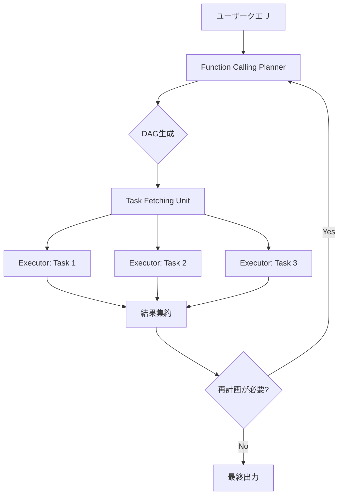

## 論文概要（Abstract）

本記事は [ICML 2024論文: An LLM Compiler for Parallel Function Calling](https://arxiv.org/abs/2312.04511) の解説記事です。

LLMによるツール呼び出し（Function Calling）は、外部情報の取得や計算の実行に不可欠な機能であるが、従来のReActなどの手法では関数を逐次的に実行するため、レイテンシの増大とLLM呼び出しコストの増加が課題であった。本論文では、コンパイラの設計思想を応用したLLMCompilerフレームワークを提案し、関数呼び出しの依存関係をDAG（有向非巡回グラフ）として解析し、独立なタスクを並列実行することで、最大3.7倍のレイテンシ削減と6.7倍のコスト削減を達成したと著者らは報告している。

この記事は [Zenn記事: FastMCPで社内SaaS横断検索MCPサーバーを構築する実装ガイド](https://zenn.dev/0h_n0/articles/a49d9afb1f3541) の深掘りです。

## 情報源

- **会議名**: ICML 2024（International Conference on Machine Learning）
- **年**: 2024
- **URL**: [https://arxiv.org/abs/2312.04511](https://arxiv.org/abs/2312.04511)
- **著者**: Sehoon Kim, Suhong Moon, Ryan Tabrizi, Nicholas Lee, Michael W. Mahoney, Kurt Keutzer, Amir Gholami
- **初版公開**: 2023年12月（arXiv v1）、2024年6月（arXiv v3）
- **コード**: [GitHub SqueezeAILab/LLMCompiler](https://github.com/SqueezeAILab/LLMCompiler)

## カンファレンス情報

**ICMLについて**: ICML（International Conference on Machine Learning）は、機械学習分野における最高峰の国際会議の一つであり、NeurIPS、ICLRと並ぶ三大会議として知られている。ICML 2024はウィーンで開催され、採択率は例年25-28%程度である。本論文はこの競争的な査読プロセスを経て採択されている。

## 技術的詳細（Technical Details）

### 問題設定：逐次実行のボトルネック

従来のReActフレームワークでは、LLMがツール呼び出しを1つずつ逐次的に処理する。具体的には、（1）LLMがどのツールを呼ぶか推論（Planning）、（2）ツールを実行（Execution）、（3）結果を観測して次のツールを決定、というサイクルを繰り返す。このアプローチの総レイテンシは以下のように定式化される（論文Section 3.1より）：

$$
T^{R} = \sum_{i=1}^{N} \left( T_{P}^{R}(P_i) + T_{E}(E_i) \right)
$$

ここで、
- $N$: 呼び出す関数の総数
- $T_{P}^{R}(P_i)$: $i$番目のタスクに対するLLMの推論時間（ReActの場合）
- $T_{E}(E_i)$: $i$番目のタスクの実行時間

各ステップでLLMを呼び出すため、$N$個のタスクに対して$N$回のLLM推論コストが発生する。

### LLMCompilerのアーキテクチャ

LLMCompilerは、コンパイラの命令レベル並列性（Instruction-Level Parallelism）からインスピレーションを得た3つのコンポーネントで構成される。



#### 1. Function Calling Planner

Plannerはユーザーのクエリを解析し、必要な関数呼び出しとその依存関係をDAGとして一括生成する。ReActが1ステップずつ推論するのに対し、LLMCompilerのPlannerは全タスクを一度のLLM呼び出しで計画する。

生成されるDAGの各ノードは以下の形式で表現される：

```
$idx = tool_name(arg1, arg2, ..., dep=$dep_idx)
```

ここで、`$idx`はタスクの識別子、`dep=$dep_idx`は依存先タスクのインデックスである。例えば、2つの独立した検索と、それらの結果に依存する比較タスクは以下のように表現される：

```
$1 = search("LLMCompiler performance")
$2 = search("ReAct performance")
$3 = compare($1, $2, dep=1,2)
```

この場合、`$1`と`$2`は互いに独立しているため並列実行でき、`$3`は両方の完了を待って実行される。

Plannerはストリーミング出力にも対応しており、DAG全体の生成完了を待たずに、依存関係が解決済みのタスクから順にTask Fetching Unitへ渡すことが可能である。

#### 2. Task Fetching Unit

Task Fetching Unitは、コンパイラにおけるアウトオブオーダー実行のスケジューラに相当する。具体的には以下の処理を行う：

1. **依存関係の監視**: 各タスクの前提条件（依存タスクの完了）を監視する
2. **プレースホルダの解決**: 依存タスクの出力結果で引数のプレースホルダ変数（`$1`, `$2`等）を実際の値に置換する
3. **タスクのディスパッチ**: 依存関係が解決されたタスクをExecutorキューに投入する

この貪欲（greedy）なディスパッチ戦略により、準備ができたタスクは即座に実行に移される。

#### 3. Executor

Executorは、Task Fetching Unitから受け取ったタスクを非同期的に並列実行する。各タスクは専用のメモリ空間を持ち、実行結果は依存先のタスクに転送される。

### レイテンシモデルの定式化

LLMCompilerの総レイテンシは以下のように定式化される（論文Section 3.2より）：

$$
T^{C} = \sum_{i=1}^{K} T_{P}^{C}(P_i) + \max_{k \in \text{parallel}} T_{E}(E_k)
$$

ここで、
- $K$: Plannerの呼び出し回数（通常$K \ll N$、再計画がなければ$K=1$）
- $T_{P}^{C}(P_i)$: $i$回目のPlanner呼び出しの推論時間
- $\max_{k \in \text{parallel}} T_{E}(E_k)$: 並列実行されるタスク群のうち最も遅いタスクの実行時間

さらに、ストリーミング版では：

$$
T^{SC} = \sum_{i=1}^{K} T_{P}^{C}(P_i) + T_{E}(E_N)
$$

Plannerがストリーミング出力する場合、DAG全体の生成完了を待たずにタスクの実行を開始できるため、パイプライン効果によりさらなるレイテンシ削減が見込める。

理論的な最大スピードアップは：

$$
\gamma_{\max} \approx N
$$

すなわち、$N$個のタスクが全て独立であれば、理論上$N$倍の高速化が可能である。ただし実際には、Plannerのオーバーヘッドやタスク間の依存関係、ストラグラー効果（最も遅いタスクがボトルネックになる現象）により、理論値よりも低いスピードアップとなる。

### 動的再計画（Dynamic Replanning）

一部のタスクでは、実行途中の結果に基づいて計画を修正する必要がある。LLMCompilerは、Executorからの中間結果をPlannerにフィードバックし、反復的に計画を更新する動的再計画機能を持つ。Game of 24ベンチマークでは、この機能により探索の各イテレーションで計画を更新し、効率的な解の探索を実現している。

## 実装のポイント

LLMCompilerの中核的なアイデアである「依存関係を解析して並列実行する」パターンは、PythonのasyncioやFastMCPによるMCPサーバー実装にも直接応用できる。以下に、LLMCompilerのTask Fetching Unit + Executorの概念を反映した並列ツール実行の実装パターンを示す。

```python
import asyncio
from dataclasses import dataclass, field
from typing import Any, Callable, Awaitable


@dataclass
class Task:
    """DAGの各ノードに相当するタスク定義

    Args:
        task_id: タスクの一意識別子
        func: 実行する非同期関数
        args: 関数への引数（$dep_idxプレースホルダ含む）
        dependencies: 依存するタスクIDのリスト
    """
    task_id: str
    func: Callable[..., Awaitable[Any]]
    args: dict[str, Any] = field(default_factory=dict)
    dependencies: list[str] = field(default_factory=list)


class TaskFetchingUnit:
    """LLMCompilerのTask Fetching Unitに相当する依存関係スケジューラ"""

    def __init__(self, tasks: list[Task]) -> None:
        self._tasks = {t.task_id: t for t in tasks}
        self._results: dict[str, Any] = {}
        self._completed: set[str] = set()

    def _resolve_args(self, task: Task) -> dict[str, Any]:
        """プレースホルダ変数を依存タスクの結果で置換する"""
        resolved = {}
        for key, value in task.args.items():
            if isinstance(value, str) and value.startswith("$"):
                dep_id = value[1:]
                resolved[key] = self._results[dep_id]
            else:
                resolved[key] = value
        return resolved

    async def execute_all(self) -> dict[str, Any]:
        """DAGに基づいてタスクを並列実行する

        Returns:
            各タスクIDと実行結果のマッピング
        """
        pending = set(self._tasks.keys())

        while pending:
            ready = [
                tid for tid in pending
                if all(
                    dep in self._completed
                    for dep in self._tasks[tid].dependencies
                )
            ]
            if not ready:
                raise RuntimeError("Circular dependency detected")

            # 依存関係が解決済みのタスクを並列実行
            coros = []
            for tid in ready:
                task = self._tasks[tid]
                resolved_args = self._resolve_args(task)
                coros.append(self._run_task(tid, task.func, resolved_args))

            await asyncio.gather(*coros)
            pending -= set(ready)

        return self._results

    async def _run_task(
        self,
        task_id: str,
        func: Callable[..., Awaitable[Any]],
        args: dict[str, Any],
    ) -> None:
        """個別タスクを実行し結果を記録する"""
        result = await func(**args)
        self._results[task_id] = result
        self._completed.add(task_id)
```

**実装上の注意点**:

- **依存関係の循環検出**: DAGの構築時に循環依存がないことを検証する必要がある。上記実装では、readyなタスクが見つからないのにpendingが残っている場合にエラーを発生させている
- **エラーハンドリング**: 1つのタスクが失敗した場合、そのタスクに依存する全ての下流タスクも実行不能になる。エラー伝播の戦略（即座に全体失敗/可能な範囲で続行）を設計段階で決定する
- **ストラグラー対策**: 論文では最も遅いタスクの実行時間が平均の2倍になるケースがあると報告されている。タイムアウトの設定やリトライ戦略が重要
- **メモリ管理**: 大量の並列タスクを実行する場合、asyncio.Semaphoreで同時実行数を制限することを推奨

## Production Deployment Guide

### AWS実装パターン（コスト最適化重視）

LLMCompilerの並列ツール呼び出しシステムをAWS上にデプロイする構成を、トラフィック規模別に示す。

**トラフィック量別の推奨構成**:

| 構成 | 規模 | 主要サービス | 月額概算 |
|------|------|-------------|---------|
| Small | ~100 req/日 | Lambda + Step Functions + Bedrock | $50-150 |
| Medium | ~1,000 req/日 | ECS Fargate + SQS + Bedrock | $300-800 |
| Large | 10,000+ req/日 | EKS + Karpenter + Spot + Bedrock | $2,000-5,000 |

**Small構成（~100 req/日）**: AWS Lambda で各ツール呼び出しを個別の関数として実装し、Step Functions の Map ステートで並列実行を制御する。Bedrock でLLM推論、DynamoDB でDAG状態管理。月額$50-150（Lambda: $5-10、Step Functions: $10-20、Bedrock: $30-100、DynamoDB: $5-20）。

**Medium構成（~1,000 req/日）**: ECS Fargate 上でPythonのasyncioベースの並列実行エンジンを稼働。SQS でタスクキューイング、ElastiCache (Redis) でDAG状態とタスク結果のキャッシュ。月額$300-800（Fargate: $100-200、Bedrock: $150-400、ElastiCache: $30-100、SQS: $20-100）。

**Large構成（10,000+ req/日）**: EKS + Karpenter でSpot Instances を活用した自動スケーリング。Celery + Redis で分散タスク実行、Bedrock のBatch API でコスト削減。月額$2,000-5,000（EKS: $300-500、EC2 Spot: $500-1,500、Bedrock: $800-2,000、Redis: $200-500、その他: $200-500）。

**コスト削減テクニック**: Spot Instances 活用で最大90%削減、Bedrock Batch API 使用で50%削減、Prompt Caching 有効化で30-90%削減、Reserved Instances 購入（1年コミット）で最大72%削減。

> **注意**: 上記コスト試算は2026年8月時点のAWS ap-northeast-1（東京）リージョン料金に基づく概算値であり、実際のコストはトラフィックパターン、リージョン、バースト使用量により変動する。最新料金はAWS料金計算ツールで確認を推奨。

### Terraformインフラコード

**Small構成（Serverless）**:

```hcl
# VPC基盤（NAT Gateway不使用でコスト削減）
resource "aws_vpc" "main" {
  cidr_block           = "10.0.0.0/16"
  enable_dns_support   = true
  enable_dns_hostnames = true
  tags = { Name = "llmcompiler-vpc", Project = "llmcompiler" }
}

resource "aws_subnet" "private" {
  count             = 2
  vpc_id            = aws_vpc.main.id
  cidr_block        = "10.0.${count.index + 1}.0/24"
  availability_zone = data.aws_availability_zones.available.names[count.index]
  tags = { Name = "llmcompiler-private-${count.index}" }
}

# IAMロール（最小権限）
resource "aws_iam_role" "lambda_exec" {
  name = "llmcompiler-lambda-role"
  assume_role_policy = jsonencode({
    Version = "2012-10-17"
    Statement = [{
      Action = "sts:AssumeRole"
      Effect = "Allow"
      Principal = { Service = "lambda.amazonaws.com" }
    }]
  })
}

resource "aws_iam_role_policy" "lambda_bedrock" {
  name = "bedrock-invoke"
  role = aws_iam_role.lambda_exec.id
  policy = jsonencode({
    Version = "2012-10-17"
    Statement = [
      {
        Effect   = "Allow"
        Action   = ["bedrock:InvokeModel"]
        Resource = "arn:aws:bedrock:ap-northeast-1::foundation-model/*"
      },
      {
        Effect   = "Allow"
        Action   = ["dynamodb:GetItem", "dynamodb:PutItem", "dynamodb:UpdateItem"]
        Resource = aws_dynamodb_table.dag_state.arn
      }
    ]
  })
}

# Lambda関数（Planner + Executor）
resource "aws_lambda_function" "planner" {
  function_name = "llmcompiler-planner"
  runtime       = "python3.12"
  handler       = "planner.handler"
  role          = aws_iam_role.lambda_exec.arn
  timeout       = 120
  memory_size   = 512
  filename      = "lambda/planner.zip"

  environment {
    variables = {
      DAG_TABLE    = aws_dynamodb_table.dag_state.name
      MODEL_ID     = "anthropic.claude-sonnet-4-20250514"
    }
  }
}

# DynamoDB（On-Demand、DAG状態管理）
resource "aws_dynamodb_table" "dag_state" {
  name         = "llmcompiler-dag-state"
  billing_mode = "PAY_PER_REQUEST"
  hash_key     = "request_id"
  range_key    = "task_id"

  attribute {
    name = "request_id"
    type = "S"
  }
  attribute {
    name = "task_id"
    type = "S"
  }

  server_side_encryption { enabled = true }
  point_in_time_recovery { enabled = true }
}

# CloudWatchアラーム（コスト監視）
resource "aws_cloudwatch_metric_alarm" "lambda_duration" {
  alarm_name          = "llmcompiler-lambda-high-duration"
  comparison_operator = "GreaterThanThreshold"
  evaluation_periods  = 3
  metric_name         = "Duration"
  namespace           = "AWS/Lambda"
  period              = 300
  statistic           = "p95"
  threshold           = 60000
  alarm_actions       = [aws_sns_topic.alerts.arn]
  dimensions = { FunctionName = aws_lambda_function.planner.function_name }
}
```

**Large構成（Container）**:

```hcl
# EKSクラスタ
module "eks" {
  source          = "terraform-aws-modules/eks/aws"
  version         = "~> 20.0"
  cluster_name    = "llmcompiler-cluster"
  cluster_version = "1.30"
  vpc_id          = aws_vpc.main.id
  subnet_ids      = aws_subnet.private[*].id

  cluster_endpoint_public_access = false

  eks_managed_node_groups = {
    system = {
      instance_types = ["m7i.large"]
      min_size       = 1
      max_size       = 3
      desired_size   = 2
    }
  }
}

# Karpenter Provisioner（Spot優先）
resource "kubectl_manifest" "karpenter_provisioner" {
  yaml_body = yamlencode({
    apiVersion = "karpenter.sh/v1"
    kind       = "NodePool"
    metadata   = { name = "llmcompiler-workers" }
    spec = {
      template = {
        spec = {
          requirements = [
            { key = "karpenter.sh/capacity-type", operator = "In", values = ["spot", "on-demand"] },
            { key = "node.kubernetes.io/instance-type", operator = "In",
              values = ["m7i.xlarge", "m6i.xlarge", "c7i.xlarge", "c6i.xlarge"] }
          ]
        }
      }
      disruption = {
        consolidationPolicy = "WhenEmptyOrUnderutilized"
        consolidateAfter    = "30s"
      }
      limits = { cpu = "100", memory = "400Gi" }
    }
  })
}

# AWS Budgets（予算アラート）
resource "aws_budgets_budget" "monthly" {
  name         = "llmcompiler-monthly"
  budget_type  = "COST"
  limit_amount = "5000"
  limit_unit   = "USD"
  time_unit    = "MONTHLY"

  notification {
    comparison_operator       = "GREATER_THAN"
    threshold                 = 80
    threshold_type            = "PERCENTAGE"
    notification_type         = "ACTUAL"
    subscriber_email_addresses = ["ops@example.com"]
  }
}
```

### 運用・監視設定

**CloudWatch Logs Insights クエリ**（並列実行のレイテンシ分析）:

```
# 並列タスク実行のレイテンシ分布
fields @timestamp, request_id, task_count, max_task_latency_ms, total_latency_ms
| filter event = "parallel_execution_complete"
| stats avg(max_task_latency_ms) as avg_straggler,
        pct(total_latency_ms, 95) as p95_total,
        pct(total_latency_ms, 99) as p99_total
        by bin(1h)
```

**CloudWatch アラーム設定**:

```python
import boto3

cloudwatch = boto3.client("cloudwatch", region_name="ap-northeast-1")

# Bedrockトークン使用量スパイク検知
cloudwatch.put_metric_alarm(
    AlarmName="llmcompiler-bedrock-token-spike",
    MetricName="InputTokenCount",
    Namespace="AWS/Bedrock",
    Statistic="Sum",
    Period=3600,
    EvaluationPeriods=1,
    Threshold=500000,
    ComparisonOperator="GreaterThanThreshold",
    AlarmActions=["arn:aws:sns:ap-northeast-1:123456789:llmcompiler-alerts"],
)
```

**X-Ray トレーシング設定**:

```python
from aws_xray_sdk.core import xray_recorder, patch_all

patch_all()  # boto3自動計装

@xray_recorder.capture("parallel_execute")
async def execute_parallel_tasks(dag: dict) -> dict:
    """並列タスク実行をX-Rayでトレースする"""
    subsegment = xray_recorder.current_subsegment()
    subsegment.put_annotation("task_count", len(dag["tasks"]))
    subsegment.put_metadata("dag_structure", dag, "llmcompiler")
    results = await task_fetching_unit.execute_all()
    subsegment.put_annotation("success", True)
    return results
```

**Cost Explorer自動レポート**:

```python
import boto3
from datetime import datetime, timedelta

ce = boto3.client("ce", region_name="ap-northeast-1")
sns = boto3.client("sns", region_name="ap-northeast-1")

def daily_cost_report() -> None:
    """日次コストレポートを取得しSNS通知する"""
    end = datetime.utcnow().strftime("%Y-%m-%d")
    start = (datetime.utcnow() - timedelta(days=1)).strftime("%Y-%m-%d")

    response = ce.get_cost_and_usage(
        TimePeriod={"Start": start, "End": end},
        Granularity="DAILY",
        Metrics=["BlendedCost"],
        Filter={"Tags": {"Key": "Project", "Values": ["llmcompiler"]}},
        GroupBy=[{"Type": "DIMENSION", "Key": "SERVICE"}],
    )

    total = sum(
        float(g["Metrics"]["BlendedCost"]["Amount"])
        for r in response["ResultsByTime"]
        for g in r["Groups"]
    )
    if total > 100:
        sns.publish(
            TopicArn="arn:aws:sns:ap-northeast-1:123456789:llmcompiler-alerts",
            Subject="LLMCompiler Daily Cost Alert",
            Message=f"Daily cost: ${total:.2f} (threshold: $100)",
        )
```

### コスト最適化チェックリスト

**アーキテクチャ選択**:
- [ ] トラフィック量に応じた構成を選択（~100 req/日: Serverless、~1,000: Hybrid、10,000+: Container）
- [ ] 並列実行パターンに応じてStep Functions / asyncio / Celery を使い分け

**リソース最適化**:
- [ ] EC2: Spot Instances優先（m7i/c7i系、最大90%削減）
- [ ] Reserved Instances: 安定負荷分は1年コミットで最大72%削減
- [ ] Savings Plans: Compute Savings Plansで柔軟な割引
- [ ] Lambda: メモリサイズ最適化（Power Tuningで測定）
- [ ] ECS/EKS: Karpenterでアイドル時自動スケールダウン

**LLMコスト削減**:
- [ ] Bedrock Batch API: 非同期可能な推論は50%削減
- [ ] Prompt Caching: ツール定義部分のキャッシュで30-90%削減
- [ ] モデル選択ロジック: Planner用に高性能モデル、単純タスクに軽量モデル
- [ ] トークン数制限: 出力トークン上限を設定
- [ ] DAGキャッシュ: 同一パターンのクエリはDAG再利用

**監視・アラート**:
- [ ] AWS Budgets: 月額予算アラート設定（80%/100%閾値）
- [ ] CloudWatch アラーム: Bedrockトークンスパイク、Lambda実行時間
- [ ] Cost Anomaly Detection: 自動異常検知有効化
- [ ] 日次コストレポート: SNS通知設定

**リソース管理**:
- [ ] 未使用リソース: 定期的なリソース棚卸し
- [ ] タグ戦略: Project/Environment/Ownerタグを全リソースに付与
- [ ] ライフサイクルポリシー: CloudWatch Logs保持期間設定（30日）
- [ ] 開発環境: 夜間・休日の自動停止スケジュール
- [ ] S3: 古いDAGログのGlacier移行

## 実験結果（Results）

著者らは5つのベンチマークでLLMCompilerを評価し、ReActおよびOpenAIのParallel Function Callingと比較している。

| ベンチマーク | 並列度 | レイテンシ改善（GPT） | レイテンシ改善（LLaMA） | コスト削減 | 精度変化 |
|-------------|--------|---------------------|----------------------|-----------|---------|
| HotpotQA | 2-way | 1.80x | 1.40x | 3.37x | +0-8% |
| Movie Rec. | 8-way | 3.74x | 2.82x | 6.73x | +4-7% |
| ParallelQA | 可変 | 2.15x | 2.27x | 4.65x | +9% |
| Game of 24 | 反復 | 2.89x | 2.09x | - | +1-2% |
| WebShop | 対話 | - | - | - | +20-28% |

（論文Table 1, Table 2, Table 3より）

**レイテンシ改善**: 並列度が高いタスク（Movie Recommendation: 8-way並列）で最大3.74倍のレイテンシ削減を達成したと著者らは報告している。HotpotQAのような2-way並列のタスクでも1.80倍の改善が見られる。

**コスト削減**: LLM呼び出し回数の削減により、Movie Recommendationで最大6.73倍のコスト削減が達成されている（論文Table 2より）。Plannerが1回のLLM呼び出しで全タスクを計画するため、ReActの$N$回呼び出しに対して大幅なコスト優位性がある。

**精度改善**: ReActで観測される2つの失敗モードの回避により精度が向上している。具体的には、（1）Movie Recommendationの約85%のサンプルで発生する「早期停止（premature early stopping）」と（2）HotpotQAでLLaMA使用時の約10%のサンプルで発生する「関数呼び出しの繰り返し（repetitive function calls）」を回避できる。

**OpenAI Parallel Function Callingとの比較**: OpenAIのネイティブな並列関数呼び出し機能と比較して、LLMCompilerは35%のレイテンシ改善を達成したと著者らは報告している。これは、OpenAIが段階的に計画を生成するのに対し、LLMCompilerが依存関係グラフ全体を一括で計画するためである。

### 制約と限界

- **Plannerのオーバーヘッド**: 計画フェーズのレイテンシは並列化できず、一部のワークロードでは総レイテンシの50%以上を占める
- **ストラグラー効果**: 並列実行されるタスクのうち最も遅いタスクの実行時間が平均の2倍になるケースがあり、理論的なスピードアップを制限する
- **Planner失敗率**: ParallelQAベンチマークでは8%のPlannerエラーが報告されている。主にDAG構築時の変数マッピングの誤りが原因
- **純粋な逐次タスク**: 全てのタスクが前のタスクの結果に依存するケースでは、並列化の恩恵はなく、Plannerのオーバーヘッド分だけ不利になる可能性がある

## 実運用への応用

LLMCompilerの並列関数呼び出しアーキテクチャは、関連Zenn記事で扱っているFastMCPによるMCPサーバー構築と直接的に関連する。

**asyncio.gatherによる並列実行**: Zenn記事では`asyncio.gather`を用いて複数のSaaSへの横断検索を並列実行している。LLMCompilerのTask Fetching Unit + Executorの設計パターンは、このasyncio.gatherの使い方を体系化したものといえる。具体的には、各SaaS APIへのリクエストをDAGのノードとして表現し、独立なリクエストを自動的に並列実行することで、逐次実行と比較して大幅なレイテンシ削減が期待できる。

**MCPサーバーへの適用**: MCPプロトコルにおけるツール呼び出しは、LLMCompilerのfunction callingと概念的に同じである。複数のMCPツールを呼び出す際に、ツール間の依存関係を解析して並列実行可能なものを自動特定するPlannerの導入により、エンドユーザーの体感レイテンシを大幅に改善できる。

**スケーリング戦略**: 論文の実験結果から、並列度が高いほど（8-way > 2-way）レイテンシ改善の効果が大きいことが示されている。社内SaaSの横断検索のように多数のデータソースに同時にアクセスするユースケースでは、LLMCompilerのアプローチが特に有効である。ただし、ストラグラー効果に対処するため、各SaaS APIへのリクエストにタイムアウトを設定し、一部のレスポンスが遅延しても全体の応答時間が過度に増加しない設計が重要である。

## まとめ

LLMCompilerは、コンパイラ設計の命令レベル並列性をLLMのツール呼び出しに応用し、Function Calling Planner、Task Fetching Unit、Executorの3コンポーネントにより関数の並列実行を実現するフレームワークである。著者らは最大3.7倍のレイテンシ削減、6.7倍のコスト削減、約9%の精度向上を報告している。特にMCPサーバーのような複数ツールを統合するシステムにおいて、依存関係の自動解析と並列実行は実用上のレイテンシ改善に直結する技術である。今後は、動的なDAG構築の精度向上やストラグラー対策の高度化が研究の方向性として考えられる。

## 参考文献

- **Conference URL**: [https://arxiv.org/abs/2312.04511](https://arxiv.org/abs/2312.04511)
- **arXiv**: [https://arxiv.org/abs/2312.04511](https://arxiv.org/abs/2312.04511)
- **Code**: [https://github.com/SqueezeAILab/LLMCompiler](https://github.com/SqueezeAILab/LLMCompiler)
- **Related Zenn article**: [https://zenn.dev/0h_n0/articles/a49d9afb1f3541](https://zenn.dev/0h_n0/articles/a49d9afb1f3541)
- **ReAct**: Yao et al., "ReAct: Synergizing Reasoning and Acting in Language Models," ICLR 2023
- **Tree of Thoughts**: Yao et al., "Tree of Thoughts: Deliberate Problem Solving with Large Language Models," NeurIPS 2023
