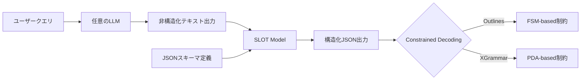
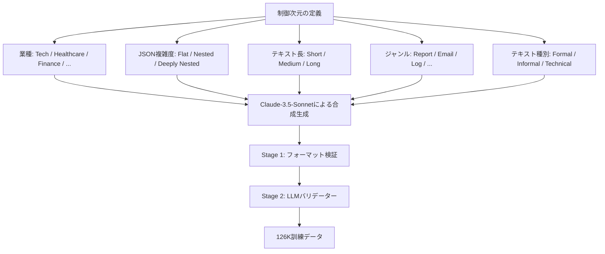

本記事は [SLOT: Structuring the Output of Large Language Models](https://arxiv.org/abs/2505.04016)（arXiv:2505.04016、EMNLP 2025 Industry Track）の解説記事です。

## 論文概要（Abstract）

大規模言語モデル（LLM）は自然言語タスクで高い性能を示す一方、事前に定義されたJSONスキーマに準拠した構造化出力の生成には依然として課題がある。SLOTは、モデル非依存のアプローチとして、非構造化LLM出力をファインチューニングされた軽量言語モデルによるポストプロセッシング層で正確な構造化フォーマットに変換するフレームワークである。著者らは、体系的なデータキュレーションパイプラインと、Schema Accuracy・Content Similarityの2つの評価指標を提案し、Mistral-7Bベースのモデルでconstrained decodingを併用した場合に99.5%のスキーマ精度と94.0%のコンテンツ類似度を達成したと報告している。

この記事は [Zenn記事: AIエージェントのツール設計原則：選択精度を高める7つの実践パターン](https://zenn.dev/0h_n0/articles/b2b62296cac899) の深掘りです。

## 情報源

- **会議名**: EMNLP 2025 Industry Track（The 2025 Conference on Empirical Methods in Natural Language Processing）
- **年**: 2025
- **URL**: [https://arxiv.org/abs/2505.04016](https://arxiv.org/abs/2505.04016)
- **著者**: Darren Yow-Bang Wang, Zhengyuan Shen, Soumya Smruti Mishra, Zhichao Xu, Yifei Teng, Haibo Ding
- **arXiv投稿日**: 2025年5月6日
- **カテゴリ**: cs.CL, cs.AI, cs.LG

## カンファレンス情報

**EMNLPについて**: EMNLP（Empirical Methods in Natural Language Processing）は、自然言語処理分野における主要な国際会議の1つであり、ACLと並ぶトップ会議として知られている。Industry Trackは、学術研究を実際のプロダクション環境に適用した成果を扱うトラックであり、本論文がIndustry Trackに採択されたことは、SLOTフレームワークの実用性が評価されたことを示している。

## 背景と動機

### 構造化出力の3つのアプローチとその課題

LLM出力の構造化は、Function Callingやツール連携、API応答生成など、プロダクション環境において不可欠な要件である。従来のアプローチは大きく3つに分類できる。

**直接プロンプティング**: プロンプトでJSON形式の出力を指示する方法。追加のインフラ不要で実装が容易だが、モデルがスキーマに完全に準拠する保証がなく、特に複雑なネスト構造やオプショナルフィールドでの失敗率が高い。著者らの実験では、Claude-3.5-Sonnetでも直接プロンプティングでのSchema Accuracyは74.7%にとどまっている。

**Constrained Decoding**: 生成時にトークンレベルでスキーマ制約を強制する方法。OutlinesやXGrammarといったライブラリが代表的である。スキーマ準拠は保証されるが、デコーディング空間の制約がモデルの表現力を損ない、生成品質（コンテンツの正確性）を犠牲にする場合がある。

**Post-Training**: 構造化出力生成に特化したファインチューニング。高い品質が期待できるが、モデル固有の訓練が必要となり、LLMのバージョンアップのたびに再訓練コストが発生する。

SLOTは、これらの課題を「元のLLMには手を加えず、軽量モデルをポストプロセッサとして挿入する」というアーキテクチャで解決する。Zenn記事で紹介されている「スキーマ制約で不正な入力を型レベルで防ぐ」原則を、モデル側のインフラとして実現するフレームワークと位置づけられる。

## 主要な貢献（Key Contributions）

- **モデル非依存のポストプロセッシングアーキテクチャ**: 任意のLLMの出力を入力として受け取り、指定されたJSONスキーマに準拠した構造化出力に変換する。元のLLMの変更やアクセスが不要
- **体系的データキュレーションパイプライン**: 5つの制御次元（業種、JSON複雑度、テキスト長、ジャンル、テキスト種別）にまたがる126Kの合成訓練データを、2段階の品質検証フィルタを通じて生成
- **Schema AccuracyとContent Similarityの評価指標**: 構造的正確性と意味的忠実性を独立に評価する2つの指標を定義し、構造化出力タスクの体系的な評価フレームワークを確立
- **Constrained Decodingとの相補的併用**: ファインチューニングとconstrained decodingの組み合わせにより、スキーマ準拠率と生成品質の両立を達成

## 技術的詳細（Technical Details）

### SLOTパイプラインの全体像

SLOTの処理フローは以下の通りである。



SLOTモデルへの入力は、タスク指示、ターゲットJSONスキーマ、およびLLMの非構造化テキスト出力を連結したプロンプトである。モデルはこのプロンプトから自己回帰的にJSONトークンを生成し、スキーマに準拠した構造化出力を得る。

### データキュレーションパイプライン

訓練データの生成は以下の手順で行われている。

**テストベンチマークのキュレーション**: 5つの公開データセット（WebNLG、E2E NLG、WikiBio、ToTTo、HF GitHub Issues）を再利用し、異なる複雑度とドメインをカバーするベンチマークを構築。HF GitHub Issuesは1,000件のGitHubリポジトリIssueを含み、実世界の複雑なネスト構造を反映している。

**合成訓練データの生成**: Claude-3.5-Sonnetを用いて126Kの訓練例を合成生成。5つの制御次元で多様性を確保している。



**2段階品質検証**: Stage 1ではJSON形式の妥当性を機械的に検証する。Stage 2ではLLMバリデーターが「出力内容がソーステキストから合理的に推論可能か」を確認し、ハルシネーションを含むサンプルをフィルタリングする。

### ファインチューニング設定

ファインチューニングにはLoRA（Low-Rank Adaptation）が採用されている。

| パラメータ | 値 |
|-----------|-----|
| LoRAランク | 32 |
| LoRA alpha | 64 |
| Dropout | 0.05 |
| 学習率 | 1e-5 |
| エポック数 | 2 |
| バッチサイズ | 2（勾配累積あり） |
| 損失関数 | 因果言語モデリング損失（出力トークンのみ） |

訓練時には、入力プロンプト部分のトークンにはマスクを適用し、出力トークン（構造化JSON）のみに対して標準的な因果言語モデリング損失を計算する。

$$
\mathcal{L} = -\sum_{t \in \text{output}} \log P(x_t \mid x_{<t}; \theta + \Delta\theta)
$$

ここで$\theta$は凍結されたベースモデルのパラメータ、$\Delta\theta$はLoRAによる低ランク更新パラメータである。

### Constrained Decodingとの併用

SLOTでは2つのconstrained decodingフレームワークが評価されている。

**Outlines**: 有限状態マシン（FSM）ベースのインデクシングにより、各デコーディングステップで許容されるトークンを制約する。比較的単純なスキーマでは効率的に動作する。

**XGrammar**: 適応型トークンキャッシングとバイトレベルプッシュダウンオートマトン（PDA）を用いた手法。複雑なネスト構造を持つスキーマにおいてOutlinesより優れた性能を示す。

ファインチューニングのみ（SFT）、constrained decodingのみ、およびSFT+constrained decodingの組み合わせを比較した結果、SFT+XGrammarの組み合わせが最高性能を達成している。

### 評価指標の定義

**Schema Accuracy ($A_s$)**: 生成されたJSON文字列が、要求されたスキーマとキー文字列および値の型において完全に一致するかを判定するバイナリ指標。

**Content Similarity ($\text{sim}_C$)**: SBERT（Sentence-BERT）埋め込みを用いたソフトマッチングにより、生成内容と正解内容の意味的類似度を測定する。soft-precisionとsoft-recallの調和平均として定義される。

$$
\text{sim}_C(y, y') = \frac{2 \times \text{sim}_P(y, y') \times \text{sim}_R(y, y')}{\text{sim}_P(y, y') + \text{sim}_R(y, y')}
$$

- $\text{sim}_P(y, y')$: 予測された各フィールド値について、対応する正解フィールド値とのSBERT類似度の平均
- $\text{sim}_R(y, y')$: 正解の各フィールド値について、対応する予測フィールド値とのSBERT類似度の平均
- 欠損キーにはゼロスコアが付与される

この2指標の分離により、「スキーマには準拠しているが内容が不正確」なケースと「内容は正確だがスキーマ違反がある」ケースを区別して評価できる。

## 実装のポイント

### ポストプロセッサとしての統合パターン

SLOTの最大の利点は、既存のLLMパイプラインに非侵襲的に統合できる点である。以下は統合パターンの擬似実装である。

```python
from dataclasses import dataclass
from typing import Any


@dataclass(frozen=True)
class SlotConfig:
    """SLOT推論の設定"""
    model_name: str = "mistral-7b-slot-sft"
    use_constrained_decoding: bool = True
    decoding_backend: str = "xgrammar"  # "outlines" or "xgrammar"
    max_new_tokens: int = 2048


def slot_structurize(
    llm_output: str,
    target_schema: dict[str, Any],
    config: SlotConfig = SlotConfig(),
) -> dict[str, Any]:
    """非構造化LLM出力をSLOTでJSON構造化する

    Args:
        llm_output: 任意のLLMからの非構造化テキスト出力
        target_schema: 出力が準拠すべきJSONスキーマ
        config: SLOT推論設定

    Returns:
        スキーマ準拠の構造化JSON辞書

    Raises:
        SchemaValidationError: constrained decodingでも
            スキーマ準拠を達成できなかった場合
    """
    prompt = build_slot_prompt(
        instruction="Convert the following text into JSON "
                    "matching the provided schema.",
        schema=target_schema,
        text=llm_output,
    )

    if config.use_constrained_decoding:
        # XGrammar: PDAベースの制約付きデコーディング
        result = generate_with_grammar(
            model=config.model_name,
            prompt=prompt,
            schema=target_schema,
            backend=config.decoding_backend,
            max_new_tokens=config.max_new_tokens,
        )
    else:
        result = generate(
            model=config.model_name,
            prompt=prompt,
            max_new_tokens=config.max_new_tokens,
        )

    return parse_and_validate(result, target_schema)
```

### 複雑度によるスキーマ分類

著者らは、JSONスキーマの複雑度を7つの次元で特徴づけている。

| 次元 | 説明 |
|------|------|
| depth | ネストの最大深さ |
| key count | スキーマ内のキー総数 |
| bytes | スキーマ定義のバイト数 |
| element count | 配列要素数 |
| cyclomatic complexity | 条件分岐（anyOf, oneOf等）の数 |
| schema complexity | スキーマ定義自体の構造的複雑度 |
| content complexity | 生成すべきコンテンツの意味的複雑度 |

HF GitHub Issuesデータセットが最も困難であった理由は、実世界のIssue構造が深いネスト、可変長配列、オプショナルフィールドを多く含み、上記の複雑度指標がすべて高いためである。

## Production Deployment Guide

本論文の手法をプロダクション環境で活用する場合、SLOTモデルをLLMのポストプロセッサとして配置し、構造化出力の品質を保証するアーキテクチャを構築する。以下に具体的な実装パターンを示す。

### アーキテクチャ設計

SLOTをプロダクション環境に導入する場合、2つの戦略がある。

**戦略1: APIゲートウェイ型**: 既存のLLM API呼び出しの後段にSLOTモデルをプロキシとして配置する。Function CallingやTool UseのレスポンスをSLOTで正規化し、下流のアプリケーションに渡す。

**戦略2: サイドカー型**: 各マイクロサービスにSLOTモデルのサイドカーコンテナを配置する。ネットワークレイテンシを最小化し、サービスごとに異なるスキーマセットを管理できる。

**注意**: 以下のコスト試算は2026年8月時点のAWS ap-northeast-1（東京）リージョン料金に基づく概算値である。実際のコストはトラフィックパターン、リージョン、モデルサイズにより変動する。最新料金はAWS料金計算ツールで確認を推奨する。

| 構成 | SLOTモデル | トラフィック | 推奨アーキテクチャ | 月額概算 |
|------|-----------|------------|------------------|---------|
| Small | Llama-3.2-1B | ~500 req/日 | Lambda + SageMaker Serverless | $100-300 |
| Medium | Mistral-7B | ~5,000 req/日 | ECS Fargate + SageMaker Endpoint | $500-1,500 |
| Large | Mistral-7B | 50,000+ req/日 | EKS + Spot GPU + TensorRT-LLM | $2,000-5,000 |

### AWS実装パターン

**Small構成（Llama-3.2-1B、~500 req/日）**: 1Bパラメータモデルであれば、SageMaker Serverless Inference Endpointで運用可能。コールドスタートは約30秒だが、低トラフィックではアイドルコストを削減できる。論文の結果によると、Llama-3.2-1B+SFT+XGrammarでもSchema Accuracy 96.2%を達成しており、多くのユースケースで十分な精度である。

**Medium構成（Mistral-7B、~5,000 req/日）**: SageMaker Real-time Endpointでml.g5.xlargeインスタンス（NVIDIA A10G 24GB）を使用。Mistral-7BはA10G 1枚で推論可能。ECS Fargateでオーケストレーターを稼働し、SageMaker Endpointを呼び出す構成。

**Large構成（Mistral-7B、50,000+ req/日）**: EKSクラスタ上でTensorRT-LLMによる推論最適化を適用し、vLLMまたはTGIでサービング。Karpenter+Spot GPU Instancesでコスト最適化。

### Terraformインフラコード

**Medium構成（SageMaker Endpoint）**:

```hcl
# slot_medium_infra.tf
# SLOT Model - SageMaker Endpoint構成

provider "aws" {
  region = "ap-northeast-1"
}

# --- SageMaker Model ---
resource "aws_sagemaker_model" "slot_model" {
  name               = "slot-mistral-7b-sft"
  execution_role_arn = aws_iam_role.sagemaker_role.arn

  primary_container {
    image          = "763104351884.dkr.ecr.ap-northeast-1.amazonaws.com/huggingface-pytorch-tgi-inference:2.4.0-tgi2.4.1-gpu-py311-cu124-ubuntu22.04"
    model_data_url = "s3://${aws_s3_bucket.model_artifacts.bucket}/slot-mistral-7b/model.tar.gz"

    environment = {
      HF_MODEL_ID             = "/opt/ml/model"
      SM_NUM_GPUS             = "1"
      MAX_INPUT_TOKENS        = "4096"
      MAX_TOTAL_TOKENS        = "6144"
      MAX_BATCH_PREFILL_TOKENS = "8192"
    }
  }
}

# --- SageMaker Endpoint Configuration ---
resource "aws_sagemaker_endpoint_configuration" "slot_config" {
  name = "slot-mistral-7b-config"

  production_variants {
    variant_name           = "primary"
    model_name             = aws_sagemaker_model.slot_model.name
    instance_type          = "ml.g5.xlarge"
    initial_instance_count = 1

    model_data_download_timeout_in_seconds = 600
    container_startup_health_check_timeout_in_seconds = 300
  }
}

# --- SageMaker Endpoint ---
resource "aws_sagemaker_endpoint" "slot_endpoint" {
  name                 = "slot-mistral-7b-endpoint"
  endpoint_config_name = aws_sagemaker_endpoint_configuration.slot_config.name
}

# --- Auto Scaling ---
resource "aws_appautoscaling_target" "slot_scaling" {
  max_capacity       = 4
  min_capacity       = 1
  resource_id        = "endpoint/${aws_sagemaker_endpoint.slot_endpoint.name}/variant/primary"
  scalable_dimension = "sagemaker:variant:DesiredInstanceCount"
  service_namespace  = "sagemaker"
}

resource "aws_appautoscaling_policy" "slot_scaling_policy" {
  name               = "slot-invocations-scaling"
  policy_type        = "TargetTrackingScaling"
  resource_id        = aws_appautoscaling_target.slot_scaling.resource_id
  scalable_dimension = aws_appautoscaling_target.slot_scaling.scalable_dimension
  service_namespace  = aws_appautoscaling_target.slot_scaling.service_namespace

  target_tracking_scaling_policy_configuration {
    predefined_metric_specification {
      predefined_metric_type = "SageMakerVariantInvocationsPerInstance"
    }
    target_value       = 100
    scale_in_cooldown  = 300
    scale_out_cooldown = 60
  }
}

# --- IAM Role ---
resource "aws_iam_role" "sagemaker_role" {
  name = "slot-sagemaker-execution-role"
  assume_role_policy = jsonencode({
    Version = "2012-10-17"
    Statement = [{
      Action = "sts:AssumeRole"
      Effect = "Allow"
      Principal = { Service = "sagemaker.amazonaws.com" }
    }]
  })
}

resource "aws_iam_role_policy" "sagemaker_policy" {
  name = "slot-sagemaker-policy"
  role = aws_iam_role.sagemaker_role.id
  policy = jsonencode({
    Version = "2012-10-17"
    Statement = [
      {
        Effect = "Allow"
        Action = [
          "s3:GetObject", "s3:ListBucket"
        ]
        Resource = [
          aws_s3_bucket.model_artifacts.arn,
          "${aws_s3_bucket.model_artifacts.arn}/*"
        ]
      },
      {
        Effect = "Allow"
        Action = [
          "logs:CreateLogGroup", "logs:CreateLogStream", "logs:PutLogEvents"
        ]
        Resource = "arn:aws:logs:ap-northeast-1:*:*"
      },
      {
        Effect = "Allow"
        Action = ["ecr:GetDownloadUrlForLayer", "ecr:BatchGetImage", "ecr:GetAuthorizationToken"]
        Resource = "*"
      }
    ]
  })
}

# --- S3 Bucket for Model Artifacts ---
resource "aws_s3_bucket" "model_artifacts" {
  bucket = "slot-model-artifacts-${data.aws_caller_identity.current.account_id}"
}

resource "aws_s3_bucket_server_side_encryption_configuration" "model_encryption" {
  bucket = aws_s3_bucket.model_artifacts.id
  rule {
    apply_server_side_encryption_by_default {
      sse_algorithm = "aws:kms"
    }
  }
}

data "aws_caller_identity" "current" {}
```

### SLOTポストプロセッサ統合コード

```python
import json
import logging
from typing import Any

import boto3
from pydantic import BaseModel, Field

logger = logging.getLogger(__name__)

sagemaker_runtime = boto3.client(
    "sagemaker-runtime", region_name="ap-northeast-1"
)

SLOT_ENDPOINT = "slot-mistral-7b-endpoint"


class SlotRequest(BaseModel):
    """SLOTモデルへのリクエスト"""
    instruction: str = "Convert the following text into JSON matching the provided schema."
    schema_def: dict[str, Any] = Field(..., alias="schema")
    text: str
    max_new_tokens: int = 2048
    use_grammar: bool = True


class SlotResponse(BaseModel):
    """SLOTモデルからのレスポンス"""
    structured_output: dict[str, Any]
    schema_valid: bool
    latency_ms: float


def invoke_slot(
    llm_output: str,
    target_schema: dict[str, Any],
    max_new_tokens: int = 2048,
) -> dict[str, Any]:
    """SageMaker Endpoint経由でSLOTモデルを呼び出す

    Args:
        llm_output: 任意のLLMからの非構造化テキスト出力
        target_schema: 出力が準拠すべきJSONスキーマ
        max_new_tokens: 最大生成トークン数

    Returns:
        スキーマ準拠の構造化JSON辞書
    """
    payload = {
        "inputs": _build_prompt(llm_output, target_schema),
        "parameters": {
            "max_new_tokens": max_new_tokens,
            "temperature": 0.1,
            "do_sample": False,
            "grammar": {"type": "json", "value": target_schema},
        },
    }

    response = sagemaker_runtime.invoke_endpoint(
        EndpointName=SLOT_ENDPOINT,
        ContentType="application/json",
        Body=json.dumps(payload),
    )

    result = json.loads(response["Body"].read().decode("utf-8"))
    generated_text = result[0]["generated_text"]
    return json.loads(generated_text)


def _build_prompt(text: str, schema: dict[str, Any]) -> str:
    """SLOTモデル用プロンプトを構築する"""
    schema_str = json.dumps(schema, indent=2)
    return (
        f"### Instruction\n"
        f"Convert the following text into JSON matching the provided schema.\n\n"
        f"### Schema\n```json\n{schema_str}\n```\n\n"
        f"### Input Text\n{text}\n\n"
        f"### Output\n"
    )
```

### 運用・監視設定

**SageMaker Endpoint監視**:

```python
import boto3

cloudwatch = boto3.client("cloudwatch", region_name="ap-northeast-1")


def create_slot_alarms(endpoint_name: str) -> None:
    """SLOTエンドポイントの監視アラームを設定する"""
    # レイテンシアラーム（p99が3秒超過）
    cloudwatch.put_metric_alarm(
        AlarmName=f"slot-{endpoint_name}-latency-p99",
        MetricName="ModelLatency",
        Namespace="AWS/SageMaker",
        Statistic="p99",
        Period=300,
        EvaluationPeriods=2,
        Threshold=3_000_000,  # マイクロ秒単位
        ComparisonOperator="GreaterThanThreshold",
        Dimensions=[
            {"Name": "EndpointName", "Value": endpoint_name},
            {"Name": "VariantName", "Value": "primary"},
        ],
        AlarmActions=["arn:aws:sns:ap-northeast-1:123456789:ops-alerts"],
    )

    # エラー率アラーム（5xx > 1%）
    cloudwatch.put_metric_alarm(
        AlarmName=f"slot-{endpoint_name}-error-rate",
        MetricName="Invocation5XXErrors",
        Namespace="AWS/SageMaker",
        Statistic="Average",
        Period=300,
        EvaluationPeriods=2,
        Threshold=0.01,
        ComparisonOperator="GreaterThanThreshold",
        Dimensions=[
            {"Name": "EndpointName", "Value": endpoint_name},
            {"Name": "VariantName", "Value": "primary"},
        ],
        AlarmActions=["arn:aws:sns:ap-northeast-1:123456789:ops-alerts"],
    )
```

### コスト最適化チェックリスト

**モデル選択**:
- [ ] トラフィック量に応じたモデルサイズ選択（~500 req/日: 1B、~5,000 req/日: 7B）
- [ ] Schema Accuracy要件の確認（96%で十分なら1Bモデル、99%以上が必要なら7B）
- [ ] バッチ処理可能なワークロードの特定（Batch Transformで50%削減）

**リソース最適化**:
- [ ] SageMaker Endpoint: Auto Scalingの設定（InvocationsPerInstance基準）
- [ ] Spot Instance（SageMaker Managed Spot Training）で訓練コスト最大90%削減
- [ ] SageMaker Serverless Inference: 低トラフィック時のアイドルコスト削減
- [ ] TensorRT-LLMによる推論最適化: 2-4xのスループット向上

**監視・アラート**:
- [ ] ModelLatency p99のアラーム設定
- [ ] Invocation5XXErrorsのアラーム設定
- [ ] AWS Budgets: 月額予算設定と80%/100%閾値アラート
- [ ] Schema Accuracy監視: カスタムメトリクスでスキーマ準拠率を継続追跡

## 実験結果

### 主要な結果

著者らが報告している主要な実験結果を以下に示す。5つのベンチマーク（WebNLG, E2E NLG, WikiBio, ToTTo, HF GitHub Issues）の平均値である。

| モデル | 手法 | Schema Accuracy | Content Similarity |
|--------|------|----------------|--------------------|
| Claude-3.5-Sonnet | Prompting | 74.7% | 73.9% |
| Claude-3.5-Haiku | Prompting | 89.0% | 80.7% |
| Llama-3.2-1B | SFT + XGrammar | 96.2% | 89.6% |
| Mistral-7B | SFT only | 98.2% | 92.9% |
| **Mistral-7B** | **SFT + XGrammar** | **99.5%** | **94.0%** |

Mistral-7B+SFT+XGrammarの組み合わせが最高性能を達成し、Schema AccuracyでClaude-3.5-Sonnetを+24.8ポイント、Content SimilarityでClaude-3.5-Sonnetを+20.1ポイント上回っている。注目すべきは、1Bパラメータのllama-3.2-1Bでさえ、SFT+XGrammarの適用によりClaude-3.5-Sonnetを大幅に上回るSchema Accuracy（96.2% vs 74.7%）を達成している点である。

### データセット別の傾向

HF GitHub Issuesデータセットが最も困難なベンチマークであり、複雑なネスト構造、可変長配列、オプショナルフィールドを含む実世界のデータ構造が反映されている。一方、WebNLGやE2E NLGのような比較的フラットなスキーマでは、すべてのモデルが高い性能を示している。

### Constrained Decodingの効果

SFTのみの場合（Mistral-7B: SA 98.2%）に対して、XGrammarを追加することで99.5%に改善されている。constrained decodingがContent Similarityを損なうことなくSchema Accuracyを向上させている点は、SFTで学習した生成パターンがスキーマ制約と整合的であることを示唆している。

## 実運用への応用

### Zenn記事との接続

本論文は、Zenn記事「AIエージェントのツール設計原則」における2つの原則と直接的に関連している。

**原則3「スキーマ制約で不正な入力を型レベルで防ぐ」との関連**: SLOTは、LLMの出力段階でスキーマ準拠を保証するインフラ層を提供する。Zenn記事がアプリケーション層でのスキーマ検証（Pydanticモデルによる型チェック等）を論じているのに対し、SLOTはモデル層での構造的保証を実現する。両者を組み合わせることで、多層防御による堅牢な構造化出力パイプラインを構築できる。

**原則5「レスポンスを次のアクションに必要な情報のみに絞る」との関連**: SLOTのポストプロセッシングアプローチは、LLMの冗長な出力からターゲットスキーマに必要な情報のみを抽出・構造化する処理とみなせる。これにより、下流のツール連携やFunction Callingにおいて、不要な情報を排除した精密なレスポンスを生成できる。

### プロダクション適用時の考慮事項

**レイテンシのトレードオフ**: SLOTは追加の推論ステップを挿入するため、エンドツーエンドのレイテンシが増加する。1Bモデルであれば追加レイテンシは100ms以下に抑えられるが、7Bモデルでは300-500ms程度が見込まれる。リアルタイム性が求められるユースケースでは、モデルサイズとレイテンシのトレードオフを検討する必要がある。

**スキーマの事前登録**: プロダクション環境では、使用するJSONスキーマを事前に登録し、constrained decodingの文法コンパイルをキャッシュすることで、リクエストごとのオーバーヘッドを削減できる。

**フォールバック戦略**: SLOTモデルの出力がスキーマに準拠しない場合（SFT+constrained decodingでも0.5%の失敗率がある）、リトライまたはデフォルト値によるフォールバックを設計しておく必要がある。

## 関連研究

- **Outlines（Willard & Louf, 2023）**: 有限状態マシンベースのconstrained decodingフレームワーク。SLOTのconstrained decodingバックエンドの1つとして評価されている
- **XGrammar（2024）**: プッシュダウンオートマトンベースの適応型constrained decodingフレームワーク。SLOTとの併用で最高性能を達成
- **SBERT（Reimers & Gurevych, 2019）**: 文埋め込みモデル。SLOTのContent Similarity指標の基盤として使用されている
- **JSONformer, LMQL**: LLM出力の構造化に取り組む関連ツール。SLOTはこれらと異なり、ポストプロセッシングアプローチによりモデル非依存性を実現している

## まとめ

SLOTは、LLM出力の構造化という実用上重要な課題に対して、モデル非依存のポストプロセッシングアプローチを提案した。ファインチューニングされた軽量モデル（Mistral-7B）とconstrained decoding（XGrammar）の組み合わせにより、99.5%のSchema Accuracyと94.0%のContent Similarityを達成し、大規模プロプライエタリモデルを大幅に上回る性能を示している。1Bパラメータモデルでも96.2%のSchema Accuracyを達成しており、コスト効率の高いデプロイメントが可能である。エージェントシステムにおけるFunction CallingやTool Useのレスポンス正規化において、SLOTのアプローチは実用的な選択肢となり得る。

## 参考文献

- **arXiv**: [https://arxiv.org/abs/2505.04016](https://arxiv.org/abs/2505.04016)
- **Conference**: EMNLP 2025 Industry Track
- **Related Zenn article**: [https://zenn.dev/0h_n0/articles/b2b62296cac899](https://zenn.dev/0h_n0/articles/b2b62296cac899)
