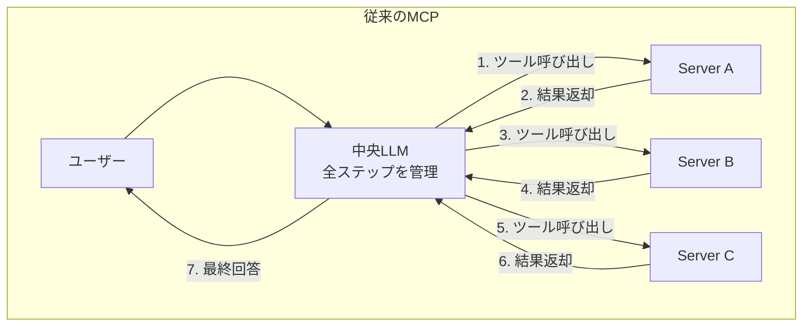
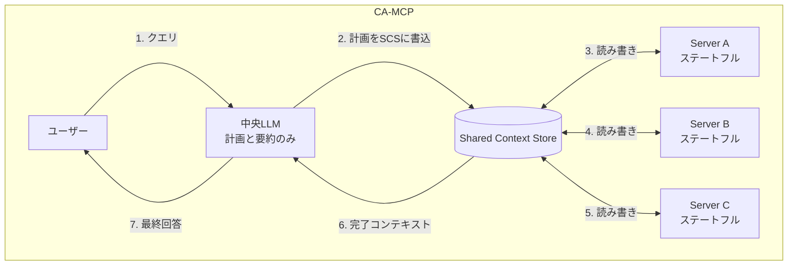

本記事は [論文: Enhancing Model Context Protocol (MCP) with Context-Aware Server Collaboration](https://arxiv.org/abs/2601.11595) の解説記事です。

## 論文概要（Abstract）

Model Context Protocol（MCP）は、LLMと外部ツール・サービスを接続する標準プロトコルとして広く採用されている。しかし従来のMCPでは、中央のLLMがすべてのサーバー呼び出しを逐次オーケストレーションする必要があり、冗長なLLM呼び出しやコンテキスト消失が課題となっていた。本論文では、共有コンテキストストア（Shared Context Store, SCS）を導入し、MCPサーバー間の自律的な協調を可能にするContext-Aware MCP（CA-MCP）アーキテクチャを提案している。著者らはTravelPlannerベンチマーク（1,200以上のマルチターンタスク）およびREALM-Bench Wedding Logisticsベンチマークで評価を行い、LLM呼び出し数の60%削減、実行時間の67.8%短縮を報告している。

この記事は [Zenn記事: FastMCPで社内SaaS横断検索MCPサーバーを構築する実装ガイド](https://zenn.dev/0h_n0/articles/a49d9afb1f3541) の深掘りです。

## 情報源

- **arXiv ID**: 2601.11595
- **URL**: [https://arxiv.org/abs/2601.11595](https://arxiv.org/abs/2601.11595)
- **著者**: Meenakshi Amulya Jayanti, X.Y. Han（University of Chicago）
- **発表年**: 2026年（v2: 2026年1月22日）
- **分野**: cs.DC（分散コンピューティング）, cs.LG, cs.SE
- **ライセンス**: CC BY-NC-SA 4.0

## 背景と動機（Background & Motivation）

従来のMCPアーキテクチャでは、中央のLLMがすべてのタスク分解・ツール呼び出し・結果統合を一元的に管理する。この設計には以下の構造的問題がある。

**冗長なLLM呼び出し**: サブタスクごとにLLMの推論が必要となり、1つのワークフローで5回以上のLLM呼び出しが発生する。各呼び出しにはレイテンシとトークンコストが伴う。

**コンテキスト消失**: LLMの固定長コンテキストウィンドウ内で、長いワークフローの制約条件や中間結果が失われる。著者らは「LLMが長いコンテキスト上で制約や詳細を忘却し、連鎖的なエラーを引き起こす」と指摘している（論文Section 1）。

**ステートレスサーバーの限界**: 従来のMCPサーバーは状態を持たず、LLMからの明示的な呼び出しにのみ応答する。サーバー間で直接情報を共有する手段がないため、すべての調整がLLMを経由する必要がある。

これらの課題に対して、著者らはLLMの役割を「計画と要約」に限定し、実行ロジックをサーバー側に委譲するCA-MCPアーキテクチャを提案した。

## 主要な貢献（Key Contributions）

- **CA-MCPアーキテクチャの設計**: 共有コンテキストストア（SCS）を中心に、MCPサーバーが自律的に協調するハイブリッドアーキテクチャを提案。中央LLMは初期計画と最終要約のみを担当する
- **LLMオーバーヘッドの大幅削減**: ワークフローあたりのLLM呼び出しを5回から2回に削減（60%減）。これにより実行時間を67.8%短縮（論文Table 2）
- **タスク完遂率の向上**: TravelPlannerベンチマークにおいて、Completeness（完遂度）を0.764から1.000に改善（30.9%向上、論文Table 2）
- **2つのベンチマークでの実証評価**: TravelPlanner（500クエリ）とREALM-Bench Wedding Logistics（P5）を用いた定量的評価

## 技術的詳細（Technical Details）

### 従来MCP vs CA-MCPのアーキテクチャ比較

以下の図は、従来のMCPアーキテクチャとCA-MCPアーキテクチャの違いを示している。





### CA-MCPの3つのコンポーネント

#### 1. 中央LLM（Long-Term Planner）

CA-MCPにおけるLLMの役割は、従来の逐次オーケストレーションから「長期計画者」に変化する。

- **初期フェーズ**: ユーザーの目標を解釈し、タスクを管理可能な単位に分解する。関連するMCPサーバーを選択し、SCSにコンテキストの青写真（ゴール、制約、実行概要）を書き込む
- **最終フェーズ**: サーバー群の実行完了後、SCSから完了コンテキストを読み取り、ユーザーへの最終回答を合成する

著者らは、この設計によりLLMの関与が「計画1回 + 要約1回 = 2回」に限定されると報告している（論文Section 2.1）。

#### 2. MCPサーバー（Short-Term Reactors）

従来のステートレスサーバーとは異なり、CA-MCPのサーバーは**ステートフルなリアクター**として機能する。

- SCSを継続的に監視し、関連するトリガー条件を検出する
- トリガー検出時に、現在のコンテキストを読み取り、計算・検索を実行し、結果をSCSに書き戻す
- サーバー間の直接通信は行わず、SCSを介した間接的な協調（blackboard方式）で自律的に連携する

#### 3. 共有コンテキストストア（Shared Context Store, SCS）

SCSはCA-MCPの中核をなすコンポーネントであり、全サーバーが共有する**単一の真実の源泉（single source of truth）**として機能する。

SCSの動作を形式的に定義すると、コンテキスト状態 $C$ は時刻 $t$ における全サーバーの書き込みの集合として表現できる:

$$
C_t = C_0 \cup \bigcup_{i=1}^{n} \Delta C_i^{(t)}
$$

ここで、
- $C_0$: 中央LLMが初期化時にSCSに書き込む初期コンテキスト（ゴール、制約、実行計画）
- $n$: MCPサーバーの数
- $\Delta C_i^{(t)}$: 時刻 $t$ までにサーバー $i$ がSCSに書き込んだ差分コンテキスト

各サーバー $i$ の実行は、SCS上のトリガー条件 $\phi_i$ に基づく:

$$
\text{execute}_i \iff \phi_i(C_t) = \text{true}
$$

従来MCPでのLLM呼び出し回数を $K_{\text{trad}}$、CA-MCPでの呼び出し回数を $K_{\text{CA}}$ とすると、冗長性削減率 $R$ は以下で定義される:

$$
R = 1 - \frac{K_{\text{CA}}}{K_{\text{trad}}} = 1 - \frac{2}{K_{\text{trad}}}
$$

$K_{\text{CA}} = 2$（計画 + 要約）であるため、従来のLLM呼び出し数 $K_{\text{trad}}$ が大きいほど削減効果が高い。論文のTravelPlanner実験では $K_{\text{trad}} = 5$ であり、$R = 0.6$（60%削減）と報告されている（論文Table 2）。

### サーバー協調プロトコル

CA-MCPのサーバー協調は、古典AIの**Blackboardアーキテクチャ**を拡張したものである。ただし従来のBlackboardパターンと異なり、LLMがSCSを初期化した後はサーバーの実行に関与しない点が特徴的である。

協調の流れは以下の通りである:

1. **LLMがSCSを初期化**: ユーザークエリを解釈し、ゴール・制約・タスク分割をSCSに書き込む
2. **サーバー選択**: LLMが関連サーバーを選択し、起動する
3. **イベント駆動実行**: 各サーバーがSCSを監視し、自身のトリガー条件が満たされた時点で処理を実行
4. **結果伝播**: サーバーの出力がSCSに書き戻され、他のサーバーのトリガー条件を発火させる
5. **完了検出**: 全タスクの完了がSCS上で確認された時点で、LLMが最終要約を生成する

### 障害耐性

著者らはCA-MCPの利点として「分散協調により単一障害点を回避し、部分的なエラーを graceful にハンドリングできる」と述べている（論文Section 2.2）。ただし、具体的な障害回復プロトコル（補償トランザクションやリトライ戦略）については本論文では詳細に記述されておらず、関連研究のSagaLLMが「永続的な履歴メモリと補償計画による障害回復」を扱っていると言及するにとどまっている。

## 実装のポイント（Implementation）

CA-MCPのSCSを実装する際の設計パターンをPythonで示す。以下はRedisをバックエンドとしたSCSの概念実装である。

```python
from dataclasses import dataclass, field
from typing import Any, Callable
import json
import redis
import time


@dataclass
class ContextEntry:
    """SCSに格納する1エントリ

    Args:
        key: エントリの識別キー
        value: 格納する値
        server_id: 書き込んだサーバーのID
        timestamp: 書き込み時刻（Unix epoch）
    """
    key: str
    value: Any
    server_id: str
    timestamp: float = field(default_factory=time.time)


class SharedContextStore:
    """Redis-backed Shared Context Store

    Blackboardパターンに基づき、サーバー間の協調を
    Pub/Sub + 共有ストアで実現する。

    Args:
        redis_url: Redis接続URL
        workflow_id: ワークフローの一意識別子
    """

    def __init__(self, redis_url: str, workflow_id: str) -> None:
        self._redis = redis.from_url(redis_url)
        self._workflow_id = workflow_id
        self._prefix = f"scs:{workflow_id}"

    def seed(self, goals: list[str], constraints: dict[str, Any]) -> None:
        """LLMが初期コンテキストをSCSに書き込む"""
        initial = {
            "goals": goals,
            "constraints": constraints,
            "status": "initialized",
            "completed_tasks": [],
        }
        self._redis.hset(self._prefix, mapping={
            k: json.dumps(v) for k, v in initial.items()
        })

    def read(self, key: str) -> Any:
        """SCSから指定キーのコンテキストを読み取る"""
        raw = self._redis.hget(self._prefix, key)
        return json.loads(raw) if raw else None

    def write(self, key: str, value: Any, server_id: str) -> None:
        """SCSにコンテキストを書き込み、変更をPub/Subで通知する"""
        entry = ContextEntry(key=key, value=value, server_id=server_id)
        self._redis.hset(self._prefix, key, json.dumps(value))
        self._redis.publish(
            f"{self._prefix}:updates",
            json.dumps({"key": key, "server_id": server_id}),
        )

    def is_complete(self) -> bool:
        """全タスクの完了状態を確認する"""
        status = self.read("status")
        return status == "completed"
```

**実装上の注意点**:

- **同時書き込みの競合**: 複数サーバーが同一キーに書き込む場合、RedisのWATCH/MULTI/EXECトランザクションやLuaスクリプトで原子性を確保する必要がある
- **トリガー条件の設計**: Pub/Subによるイベント通知が基本だが、ポーリング方式との併用で信頼性を高められる
- **TTLの設定**: ワークフロー完了後のリソース解放のため、SCSエントリにTTLを設定すべきである
- **シリアライゼーション**: 複雑なオブジェクトの格納にはJSON以外にMessagePackやProtobufも検討する

## Production Deployment Guide

### AWS実装パターン（コスト最適化重視）

CA-MCPの本番デプロイでは、SCSのバックエンドとしてAmazon ElastiCache（Redis）、MCPサーバーの実行基盤としてLambdaまたはECSを利用する構成が適している。

**トラフィック量別の推奨構成**:

| 構成 | トラフィック | アーキテクチャ | 月額概算 |
|------|------------|--------------|---------|
| Small | ~100 req/日 | Lambda + ElastiCache Serverless + DynamoDB | $80-200 |
| Medium | ~1,000 req/日 | ECS Fargate + ElastiCache (cache.t4g.micro) + DynamoDB | $350-900 |
| Large | 10,000+ req/日 | EKS + ElastiCache Cluster (cache.r7g.large) + Aurora | $2,500-6,000 |

**Small構成の内訳**（記事執筆時点のap-northeast-1概算値）:
- Lambda（MCPサーバー x 3）: $10-30/月（128MB、平均200ms実行、100回/日）
- ElastiCache Serverless: $15-50/月（SCS用、低トラフィック時はECPU課金）
- DynamoDB On-Demand: $5-15/月（ワークフロー履歴保存）
- Bedrock（計画 + 要約、2回/ワークフロー）: $30-80/月
- CloudWatch: $5-10/月

**コスト削減テクニック**:
- Bedrock Batch APIで非リアルタイム処理は50%削減
- ElastiCache ServerlessはECPU課金で低トラフィック時のコストを抑制
- Lambda Provisioned Concurrencyは不要（コールドスタートは計画フェーズで吸収可能）
- Prompt Cachingを有効化し、同一構造のワークフロー計画で30-90%のトークンコスト削減

**注意**: 上記コストはap-northeast-1（東京）リージョンの2026年8月時点の概算値。実際のコストはトラフィックパターン、バースト使用量により変動する。最新料金はAWS料金計算ツールで確認を推奨する。

### Terraformインフラコード

**Small構成（Serverless）**: Lambda + ElastiCache Serverless + DynamoDB

```hcl
# CA-MCP Small構成: Serverless
# ElastiCache ServerlessをSCSバックエンドとして利用

terraform {
  required_version = ">= 1.9"
  required_providers {
    aws = { source = "hashicorp/aws", version = "~> 5.60" }
  }
}

provider "aws" {
  region = "ap-northeast-1"
}

# --- VPC（ElastiCache用、NAT Gateway不使用でコスト削減） ---
resource "aws_vpc" "main" {
  cidr_block           = "10.0.0.0/16"
  enable_dns_support   = true
  enable_dns_hostnames = true
  tags = { Name = "ca-mcp-vpc" }
}

resource "aws_subnet" "private" {
  count             = 2
  vpc_id            = aws_vpc.main.id
  cidr_block        = "10.0.${count.index + 1}.0/24"
  availability_zone = data.aws_availability_zones.available.names[count.index]
  tags = { Name = "ca-mcp-private-${count.index}" }
}

data "aws_availability_zones" "available" {
  state = "available"
}

# --- ElastiCache Serverless（SCS） ---
resource "aws_elasticache_serverless_cache" "scs" {
  engine = "redis"
  name   = "ca-mcp-scs"
  subnet_ids         = aws_subnet.private[*].id
  security_group_ids = [aws_security_group.elasticache.id]
  # コスト最適化: Serverless課金で低トラフィック時は最小コスト
}

resource "aws_security_group" "elasticache" {
  vpc_id = aws_vpc.main.id
  ingress {
    from_port       = 6379
    to_port         = 6379
    protocol        = "tcp"
    security_groups = [aws_security_group.lambda.id]
  }
  tags = { Name = "ca-mcp-elasticache-sg" }
}

# --- Lambda（MCPサーバー） ---
resource "aws_security_group" "lambda" {
  vpc_id = aws_vpc.main.id
  egress {
    from_port   = 0
    to_port     = 0
    protocol    = "-1"
    cidr_blocks = ["0.0.0.0/0"]
  }
  tags = { Name = "ca-mcp-lambda-sg" }
}

resource "aws_iam_role" "mcp_server" {
  name = "ca-mcp-server-role"
  assume_role_policy = jsonencode({
    Version = "2012-10-17"
    Statement = [{
      Action = "sts:AssumeRole"
      Effect = "Allow"
      Principal = { Service = "lambda.amazonaws.com" }
    }]
  })
}

resource "aws_iam_role_policy_attachment" "lambda_vpc" {
  role       = aws_iam_role.mcp_server.name
  policy_arn = "arn:aws:iam::aws:policy/service-role/AWSLambdaVPCAccessExecutionRole"
}

resource "aws_iam_role_policy" "bedrock" {
  name = "bedrock-invoke"
  role = aws_iam_role.mcp_server.id
  policy = jsonencode({
    Version = "2012-10-17"
    Statement = [{
      Effect   = "Allow"
      Action   = ["bedrock:InvokeModel"]
      Resource = "arn:aws:bedrock:ap-northeast-1::foundation-model/*"
    }]
  })
}

resource "aws_lambda_function" "mcp_server" {
  for_each = toset(["planner", "executor_a", "executor_b"])

  function_name = "ca-mcp-${each.key}"
  runtime       = "python3.12"
  handler       = "handler.lambda_handler"
  role          = aws_iam_role.mcp_server.arn
  memory_size   = 256
  timeout       = 30
  filename      = "lambda_package.zip"

  vpc_config {
    subnet_ids         = aws_subnet.private[*].id
    security_group_ids = [aws_security_group.lambda.id]
  }

  environment {
    variables = {
      SCS_ENDPOINT = aws_elasticache_serverless_cache.scs.endpoint[0].address
      SCS_PORT     = "6379"
    }
  }
}

# --- DynamoDB（ワークフロー履歴） ---
resource "aws_dynamodb_table" "workflow_history" {
  name         = "ca-mcp-workflows"
  billing_mode = "PAY_PER_REQUEST"  # On-Demand: 低トラフィックに最適
  hash_key     = "workflow_id"

  attribute {
    name = "workflow_id"
    type = "S"
  }

  ttl {
    attribute_name = "expires_at"
    enabled        = true
  }

  server_side_encryption { enabled = true }
  tags = { Name = "ca-mcp-workflows" }
}

# --- CloudWatch アラーム ---
resource "aws_cloudwatch_metric_alarm" "lambda_errors" {
  alarm_name          = "ca-mcp-lambda-errors"
  comparison_operator = "GreaterThanThreshold"
  evaluation_periods  = 2
  metric_name         = "Errors"
  namespace           = "AWS/Lambda"
  period              = 300
  statistic           = "Sum"
  threshold           = 5
  alarm_description   = "MCPサーバーのエラー率監視"
}
```

**Large構成（Container）**: EKS + ElastiCache Cluster

```hcl
# CA-MCP Large構成: EKS + Karpenter + Spot
module "eks" {
  source  = "terraform-aws-modules/eks/aws"
  version = "~> 20.24"

  cluster_name    = "ca-mcp-cluster"
  cluster_version = "1.31"
  vpc_id          = aws_vpc.main.id
  subnet_ids      = aws_subnet.private[*].id

  cluster_endpoint_public_access = false  # プライベートアクセスのみ
}

# Karpenter Provisioner: Spot優先でコスト削減
resource "kubectl_manifest" "karpenter_nodepool" {
  yaml_body = yamlencode({
    apiVersion = "karpenter.sh/v1"
    kind       = "NodePool"
    metadata   = { name = "ca-mcp-pool" }
    spec = {
      template = {
        spec = {
          requirements = [
            { key = "karpenter.sh/capacity-type", operator = "In", values = ["spot", "on-demand"] },
            { key = "node.kubernetes.io/instance-type", operator = "In",
              values = ["m7g.medium", "m7g.large", "m6g.medium", "m6g.large"] },
          ]
        }
      }
      limits   = { cpu = "100", memory = "200Gi" }
      disruption = { consolidationPolicy = "WhenEmptyOrUnderutilized" }
    }
  })
}

# ElastiCache Cluster（SCS、高トラフィック向け）
resource "aws_elasticache_replication_group" "scs" {
  replication_group_id = "ca-mcp-scs"
  description          = "CA-MCP Shared Context Store"
  engine               = "redis"
  node_type            = "cache.r7g.large"
  num_cache_clusters   = 2  # Multi-AZ
  at_rest_encryption_enabled = true
  transit_encryption_enabled = true
}

# AWS Budgets: 月額コストアラート
resource "aws_budgets_budget" "monthly" {
  name         = "ca-mcp-monthly"
  budget_type  = "COST"
  limit_amount = "6000"
  limit_unit   = "USD"
  time_unit    = "MONTHLY"

  notification {
    comparison_operator       = "GREATER_THAN"
    threshold                 = 80
    threshold_type            = "PERCENTAGE"
    notification_type         = "ACTUAL"
    subscriber_email_addresses = ["ops-team@example.com"]
  }
}
```

### 運用・監視設定

**CloudWatch Logs Insights クエリ**: SCSの読み書きレイテンシ異常を検知する。

```
# SCS操作のP95レイテンシ（1時間）
fields @timestamp, server_id, operation, duration_ms
| filter operation in ["scs_read", "scs_write"]
| stats percentile(duration_ms, 95) as p95,
        percentile(duration_ms, 99) as p99,
        avg(duration_ms) as avg_ms
  by bin(1h) as time_bin
| sort time_bin desc
```

**CloudWatch アラーム設定**:

```python
import boto3

cloudwatch = boto3.client("cloudwatch", region_name="ap-northeast-1")

# ElastiCache CPU使用率アラーム（SCS過負荷検知）
cloudwatch.put_metric_alarm(
    AlarmName="ca-mcp-scs-cpu-high",
    Namespace="AWS/ElastiCache",
    MetricName="EngineCPUUtilization",
    Statistic="Average",
    Period=300,
    EvaluationPeriods=2,
    Threshold=70.0,
    ComparisonOperator="GreaterThanThreshold",
    AlarmActions=["arn:aws:sns:ap-northeast-1:123456789012:ca-mcp-alerts"],
)
```

**X-Ray トレーシング設定**: ワークフロー全体のトレースをSCSの読み書き単位で記録する。

```python
from aws_xray_sdk.core import xray_recorder, patch_all

patch_all()  # boto3自動計装

@xray_recorder.capture("scs_operation")
def scs_write(store: SharedContextStore, key: str, value: dict, server_id: str) -> None:
    """SCS書き込みをX-Rayでトレースする"""
    subsegment = xray_recorder.current_subsegment()
    subsegment.put_annotation("server_id", server_id)
    subsegment.put_annotation("context_key", key)
    subsegment.put_metadata("value_size", len(str(value)))
    store.write(key, value, server_id)
```

**Cost Explorer 日次レポート**:

```python
import boto3
from datetime import date, timedelta

ce = boto3.client("ce", region_name="us-east-1")

def get_daily_cost() -> dict:
    """CA-MCP関連コストの日次レポートを取得する"""
    end = date.today().isoformat()
    start = (date.today() - timedelta(days=1)).isoformat()
    resp = ce.get_cost_and_usage(
        TimePeriod={"Start": start, "End": end},
        Granularity="DAILY",
        Metrics=["UnblendedCost"],
        Filter={"Tags": {"Key": "Project", "Values": ["ca-mcp"]}},
        GroupBy=[{"Type": "DIMENSION", "Key": "SERVICE"}],
    )
    return resp["ResultsByTime"][0]["Groups"]
```

### コスト最適化チェックリスト

**アーキテクチャ選択**:
- [ ] トラフィック~100 req/日 → Serverless（Lambda + ElastiCache Serverless）
- [ ] トラフィック~1,000 req/日 → Hybrid（ECS Fargate + ElastiCache）
- [ ] トラフィック10,000+ req/日 → Container（EKS + ElastiCache Cluster）

**リソース最適化**:
- [ ] EKS: Karpenter + Spot Instances優先（最大90%削減）
- [ ] Reserved Instances: ElastiCache 1年コミット（最大55%削減）
- [ ] Savings Plans: Fargate/Lambda用Compute Savings Plans検討
- [ ] Lambda: メモリサイズを128-256MBで最適化（Power Tuning実施）
- [ ] ElastiCache: 低トラフィック環境ではServerlessモードでECPU課金

**LLMコスト削減**:
- [ ] Bedrock Batch API: 非同期ワークフローで50%削減
- [ ] Prompt Caching: 計画フェーズのシステムプロンプトをキャッシュ（30-90%削減）
- [ ] モデル選択: 計画にはClaude Sonnet、要約にはHaikuで分離
- [ ] トークン制限: SCSの最終コンテキスト要約時にmax_tokensを制限

**監視・アラート**:
- [ ] AWS Budgets: 月額上限設定（閾値80%で通知）
- [ ] CloudWatch アラーム: Lambda Errors、ElastiCache CPU
- [ ] Cost Anomaly Detection: 有効化（日次異常検知）
- [ ] 日次コストレポート: Cost Explorer APIで自動取得

**リソース管理**:
- [ ] 未使用ワークフローのSCSエントリ: TTLで自動削除
- [ ] タグ戦略: `Project=ca-mcp` タグを全リソースに付与
- [ ] DynamoDB TTL: ワークフロー履歴を90日で自動削除
- [ ] 開発環境: ElastiCache/EKSを夜間停止（スケジュール設定）
- [ ] CloudTrail: 監査ログ有効化（S3ライフサイクルで90日保持）

## 実験結果（Results）

### TravelPlannerベンチマーク

著者らは1,200以上のマルチターンタスクから500クエリを抽出し、従来MCPとCA-MCPを比較している（論文Table 2）。各クエリは予算・時間・選好に関する制約条件を持つ旅行計画タスクである。

| 評価指標 | 従来MCP | CA-MCP | 改善 |
|---------|--------|--------|------|
| 実行時間（秒） | 41.99 | 13.52 | 67.8%短縮 |
| Completeness（0-1） | 0.764 | 1.000 | +30.9% |
| BERTScore F1 | 0.745 | 0.757 | +0.012 |
| ROUGE-L | 0.031 | 0.027 | 同等 |
| LLM呼び出し回数 | 5 | 2 | 60%削減 |

統計的検定として、著者らは対応のあるt検定（paired t-test）を実施している（$n = 500$）。実行時間については平均差 $28.465$ 秒、$p = 1.60 \times 10^{-137}$ と報告されており、統計的に有意な差があると結論している（論文Figure 2）。Completenessについても平均差 $0.236$、$p = 4.39 \times 10^{-75}$ と報告されている（論文Figure 3）。

BERTScore F1は微小な改善（$+0.012$, $p = 2.35 \times 10^{-8}$）であり、ROUGE-Lは従来MCPがわずかに優位（差 $-0.004$, $p = 1.24 \times 10^{-13}$）であった。著者らはROUGE-Lの差について「実質的には同等」と評価している。

### REALM-Bench Wedding Logistics（P5）

REALM-BenchのProblem 5は、結婚式のゲスト到着・用事・共有車両を締切・容量制約の下で調整するタスクである（論文Table 3）。

| 評価指標 | 従来MCP | CA-MCP | 改善 |
|---------|--------|--------|------|
| Goal Satisfaction | 1.0 | 1.0 | -- |
| Constraint Satisfaction | 1.0 | 1.0 | -- |
| Makespan（分） | 330 | 180 | 45.5%短縮 |
| Coordination Score | 0 | 1 | 改善 |
| LLM呼び出し回数 | 2 | 1 | 50%削減 |
| 実行時間（秒） | 8.52 | 2.26 | 73.5%短縮 |

著者らは3つのMCPサーバー（arrival\_tracker、errand\_tracker、transport）がSCSを介して動的に協調する構成で実験を行ったと報告している。Coordination Scoreが0から1に改善した点について、SCSによるサーバー間のリアルタイム情報共有がスケジュールの整合性向上に寄与したと分析している。

### 実験の限界

著者らは以下の限界を明示している（論文Section 6）:

- 並列マルチスレッディング等のハードウェア・ソフトウェア最適化を適用していない「素朴な実装」での比較である
- これらの最適化を適用した場合、両アーキテクチャの相対的な性能差は変化する可能性がある
- 実験の目的は、エンジニアリング最適化を排除した上でSCSの効果を分離して検証することにある

## 実運用への応用（Practical Applications）

CA-MCPの設計思想は、Zenn記事「FastMCPで社内SaaS横断検索MCPサーバーを構築する実装ガイド」で紹介されているゲートウェイサーバーパターンと親和性が高い。

**ゲートウェイサーバーとSCSの統合**: Zenn記事のゲートウェイサーバーがリクエストルーティングを担当する構成に、SCSを追加することで以下の効果が期待できる。

- **キャッシュ層との統合**: Zenn記事で言及されているキャッシュ層をSCSとして拡張し、検索結果だけでなくワークフロー全体のコンテキストを保持する。これにより複数のSaaS検索サーバーが中間結果を共有でき、重複検索を排除できる
- **LLM呼び出しの削減**: 社内SaaS横断検索で複数サーバーに問い合わせる際、従来は各サーバーの結果をLLMが逐次統合していた。CA-MCPパターンを適用すれば、LLMは初期のクエリ分解と最終的な回答合成のみを担当し、中間の結果マージはサーバー間でSCSを介して行える
- **障害時の部分結果返却**: 一部のSaaSサーバーがタイムアウトした場合でも、SCSに書き込まれた他サーバーの結果を使って部分的な回答を生成できる

**注意点**: CA-MCPの現時点での評価はTravelPlannerとREALM-Benchに限定されており、社内SaaS横断検索のような実運用シナリオでの検証は行われていない。上記の応用案は筆者の解釈に基づく。

## 関連研究（Related Work）

著者らは論文Table 1で、CA-MCPと既存手法の体系的な比較を行っている。

- **SagaLLM**: 永続的な履歴メモリと補償計画により、長期ワークフローでのトランザクション整合性と障害回復を実現する。CA-MCPのSCSが一時的なワークスペースであるのに対し、SagaLLMは永続的メモリに焦点を当てている
- **Blackboard MAS（マルチエージェントシステム）**: 古典AIのBlackboardアーキテクチャに基づき、エージェントが共有メモリプールを介して協調する。CA-MCPはこれを拡張し、LLMがSCS初期化後にサーバー実行から離脱する点が異なる
- **Marvin's Memory**: 個々のエージェントに永続的なベクトルベースメモリを付与する。CA-MCPが集団的知性（共有ストア）に焦点を当てるのに対し、Marvinは個別エージェントの強化を目的とする
- **G-Memory**: 階層的なエージェントメモリでトライアル間学習を実現する。CA-MCPが単一ワークフロー内の協調効率を扱うのに対し、G-Memoryはワークフロー横断的な学習を扱う

## まとめと今後の展望

CA-MCPは、共有コンテキストストアの導入により従来MCPの中央集権的なLLMオーケストレーションを分散協調モデルに転換するアーキテクチャである。TravelPlannerベンチマークでLLM呼び出し60%削減・実行時間67.8%短縮を達成したことは、MCPベースのマルチサーバーシステムにおけるSCS導入の有効性を示唆している。

ただし、本論文はハードウェア/ソフトウェア最適化を適用しない素朴な実装での比較であり、本番環境での性能差については追加検証が必要である。また、障害回復の具体的なプロトコル、マルチモーダルサーバーの統合、SCSへの並行アクセス制御のセキュリティ分析など、未解決の課題も多い。

著者らは今後の研究方向として、SCSの非同期実行サポート、サーバーレベルの学習（履歴に基づく戦略適応）、RL訓練済みポリシーによるサーバー選択の最適化を挙げている。

## 参考文献

- **arXiv**: [https://arxiv.org/abs/2601.11595](https://arxiv.org/abs/2601.11595)
- **Related Zenn article**: [https://zenn.dev/0h_n0/articles/a49d9afb1f3541](https://zenn.dev/0h_n0/articles/a49d9afb1f3541)
