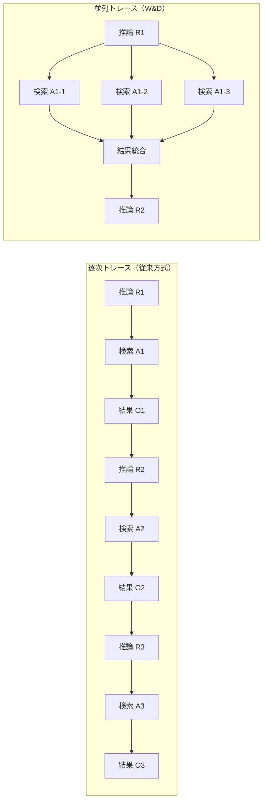
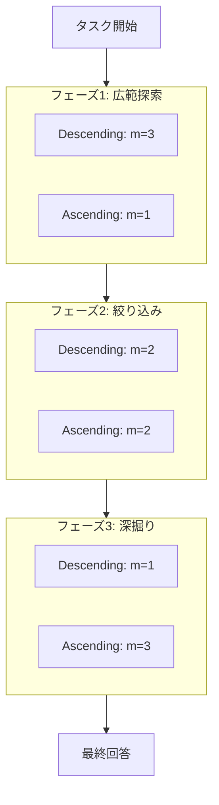

本記事は [論文: W&D: Scaling Parallel Tool Calling for Efficient Deep Research Agents](https://arxiv.org/abs/2602.07359) の解説記事です。

## 論文概要（Abstract）

深層リサーチエージェントは、多段推論と情報検索を組み合わせて複雑な問題を解決する。従来の研究はシーケンシャルな操作の深さ（Depth）をスケーリングすることに注力してきたが、本論文は並列ツール呼び出しによる幅（Width）のスケーリングを探求している。著者らは、並列化がリサーチベンチマークにおいて性能を大幅に向上させつつ、インタラクションターン数を削減することを示している。BrowseCompベンチマークにおいて、GPT-5-Mediumで62.2%の精度を達成し、GPT-5-Highのベースライン54.9%を上回ったと報告している。

この記事は [Zenn記事: FastMCPで社内SaaS横断検索MCPサーバーを構築する実装ガイド](https://zenn.dev/0h_n0/articles/a49d9afb1f3541) の深掘りです。

## 情報源

- **arXiv ID**: 2602.07359
- **URL**: [https://arxiv.org/abs/2602.07359](https://arxiv.org/abs/2602.07359)
- **著者**: Xiaoqiang Lin, Jun Hao Liew, Silvio Savarese, Junnan Li
- **発表年**: 2026
- **分野**: cs.AI

## 背景と動機（Background & Motivation）

LLMを基盤とする深層リサーチエージェントは、複雑な質問に対してWeb検索やコード実行などのツールを繰り返し呼び出しながら段階的に回答を構築する。従来のエージェント設計では、1ターンにつき1つのツール呼び出しを逐次的に実行する「深さ方向のスケーリング」が主流であった。ReActやChain-of-Thoughtに代表されるこの方式は、推論ステップを積み重ねることで精度を高めるが、ターン数の増加に伴いレイテンシとコストが線形に増大する。

著者らは、この深さ方向のスケーリングに対して「幅方向のスケーリング」、すなわち1ターン内で複数のツールを並列に呼び出すアプローチを体系的に分析した。並列実行には、多様な情報源へのアクセス、冗害検索による結果検証、クエリ分解による網羅的探索という3つのメカニズムが存在すると著者らは報告している。これにより、同一の計算予算内でより高い精度を少ないターン数で達成できる可能性がある。

## 主要な貢献（Key Contributions）

- **並列ツール呼び出しフレームワーク（W&D）**: 逐次的なツール呼び出しトレース $\tau_{\text{seq}}$ を並列トレース $\tau_{\text{par}}$ に拡張する形式的定義を提供。1ターン内の複数ツール呼び出しを制御する「ユーザ指示」メカニズムを導入している。
- **Width-Depthトレードオフ分析**: 並列ツール呼び出し数（Width）と最大ターン数（Depth）の最適なバランスを実験的に調査。低いターン数制限では並列数が多いほど有利であるが、高いターン数制限では中程度の並列数が最適であることを示している。
- **ツール呼び出しスケジューラ**: 実行フェーズに応じて並列数を動的に調整する戦略を提案。Descending（探索優先）スケジューラがConstant（固定数）を上回る74%の精度を達成したと報告している（論文Table 1より）。

## 技術的詳細（Technical Details）

### 逐次 vs 並列トレースの形式化

著者らは深層リサーチエージェントの動作をトレースとして形式的に定義している。

**逐次トレース**（従来方式）:

$$
\tau_{\text{seq}} = \langle X, (R_1, A_1, O_1), \ldots, (R_T, \hat{Y}) \rangle
$$

ここで、
- $X$: 入力クエリ
- $R_t$: ステップ$t$での推論（Reasoning）
- $A_t$: 単一のツール呼び出しアクション
- $O_t$: ツールからの観測結果
- $\hat{Y}$: 最終回答
- $T$: 最大ターン数

各ステップで、モデル $f_\theta$ がこれまでのコンテキストを受け取り、推論 $R_t$ と単一アクション $A_t$ を生成する。

**並列トレース**（提案手法）:

$$
\tau_{\text{par}} = \langle X, (R_1, \mathcal{A}_1^{\text{par}}, \mathcal{O}_1^{\text{par}}), \ldots, (R_T, \hat{Y}) \rangle
$$

ここで、
- $\mathcal{A}_t^{\text{par}} = \{A_t^{(1)}, A_t^{(2)}, \ldots, A_t^{(m)}\}$: $m$個の並列ツール呼び出し
- $\mathcal{O}_t^{\text{par}} = \{O_t^{(1)}, O_t^{(2)}, \ldots, O_t^{(m)}\}$: 対応する観測結果

単一の推論ステップ $R_t$ から複数のアクションが同時に生成され、並列に実行される点が本質的な違いである。

### 並列実行の制御メカニズム

著者らは、LLMが生成する並列ツール呼び出し数を制御するために、各ターンの前にユーザ指示 $U_t$ を挿入する手法を採用している。具体的には以下のような指示である:

> "You MUST make at least $m$ but not more than $m+1$ function calls in a single response"

この指示はシステムプロンプトではなく、各LLM呼び出しの直前に「ユーザメッセージ」として挿入される。著者らは、この第2種ユーザメッセージ方式がシステムプロンプトによる指示よりも、正確なツール呼び出し数の制御に有効であると報告している。

以下のMermaidダイアグラムで逐次実行と並列実行の違いを示す。



### Width-Depthトレードオフ

Width（1ターンあたりの並列ツール数 $m$）とDepth（最大ターン数 $T$）の関係は、ベンチマークの性質と計算予算によって最適点が変化する。

著者らの実験結果（論文Figure 3より）は以下の傾向を示している:

- **低ターン制限（$T = 10$）**: ツール数が多いほど一貫して精度が向上
- **中ターン制限（$T = 50$）**: 3ツール並列が最適なバランスを提供
- **高ターン制限（$T = 100$以上）**: 過度な並列は収穫逓減を示し、中程度（2-3ツール）が最適

この現象は、並列ツール呼び出しによる情報獲得の限界利益が、コンテキスト長の増大によるLLMの推論品質低下と相殺されるためと解釈できる。

### ツール呼び出しスケジューラ

著者らは4つの決定的スケジューラと1つの適応的スケジューラを評価している。

**Constant（固定）スケジューラ**:

全ターンで同一の並列数 $m_t = c$（$c = 1$ または $c = 3$）を使用する。

**Ascending（昇順）スケジューラ**: 探索を後半に集中する戦略。

$$
m_t = \begin{cases} 1 & \text{if } t \leq 25 \\ 2 & \text{if } 25 < t \leq 50 \\ 3 & \text{if } t > 50 \end{cases}
$$

**Descending（降順）スケジューラ**: 探索を序盤に集中する戦略。

$$
m_t = \begin{cases} 3 & \text{if } t \leq 25 \\ 2 & \text{if } 25 < t \leq 50 \\ 1 & \text{if } t > 50 \end{cases}
$$

**Automatic（自動）スケジューラ**: LLM自身が進捗に応じて1-4個のツール呼び出し数を決定する。



著者らの実験では、Descendingスケジューラが74%の精度を達成し、Ascendingの63%を11ポイント上回ったと報告している（論文Table 1より）。この結果は「explore-then-exploit（探索してから活用する）」原則の有効性を示唆している。序盤に広範な並列検索で情報を収集し、後半は絞り込んだ検索で精度を高める戦略が最も効果的であった。

なお、Automaticスケジューラは期待されたほどの性能を発揮しなかった。著者らは、LLMが自律的にWidth-Depthのトレードオフを最適化する能力には限界があると指摘している。

### 並列化が有効な3つのメカニズム

著者らは、並列ツール呼び出しが性能を向上させる3つの具体的メカニズムを同定している（論文Figures 5-6のケーススタディより）:

1. **多様な情報源へのアクセス**: 並列検索により、単一検索では到達しない信頼性の高い情報源（例: 国連統計年鑑 vs APIデータベース）にアクセスできる
2. **冗長検索による結果検証**: 同一の質問に対する複数の検索結果を照合することで、ハルシネーションや不正確な情報を検出できる
3. **クエリ分解**: 複合的なクエリ（例: 「1990-1994年のブラジル人審判のイエローカード数」）を構成要素に分解し、それぞれを並列に検索できる

### アルゴリズム

論文には明示的な擬似コードは提示されていないが、フレームワークの動作を以下のPythonコードで表現できる:

```python
import asyncio
from typing import Any


async def parallel_tool_call(
    llm: Any,
    query: str,
    max_turns: int,
    scheduler: str = "descending",
) -> str:
    """W&D並列ツール呼び出しフレームワーク

    Args:
        llm: LLMインスタンス
        query: 入力クエリ
        max_turns: 最大ターン数 T
        scheduler: スケジューラ戦略

    Returns:
        最終回答文字列
    """
    context: list[dict[str, str]] = [{"role": "user", "content": query}]

    for t in range(1, max_turns + 1):
        # スケジューラで並列数を決定
        m = _get_tool_count(t, max_turns, scheduler)

        # ユーザ指示を挿入（第2種ユーザメッセージ）
        control_msg = (
            f"You MUST make at least {m} but not more than "
            f"{m + 1} function calls in a single response."
        )
        context.append({"role": "user", "content": control_msg})

        # LLM推論: 1つの推論 R_t から m 個のアクションを生成
        response = await llm.generate(context, parallel_tool_calls=True)

        if response.is_final_answer:
            return response.answer

        # 並列ツール実行
        tool_calls = response.tool_calls  # List[ToolCall]
        results = await asyncio.gather(
            *[execute_tool(tc) for tc in tool_calls]
        )

        # コンテキストに追加
        context.append({"role": "assistant", "content": response.reasoning})
        for tc, result in zip(tool_calls, results):
            context.append({
                "role": "tool",
                "tool_call_id": tc.id,
                "content": result,
            })

    return "No answer found within budget."


def _get_tool_count(t: int, max_turns: int, scheduler: str) -> int:
    """スケジューラに基づく並列ツール呼び出し数の決定

    Args:
        t: 現在のターン番号
        max_turns: 最大ターン数
        scheduler: スケジューラ戦略名

    Returns:
        並列ツール呼び出し数 m
    """
    if scheduler == "constant_1":
        return 1
    elif scheduler == "constant_3":
        return 3
    elif scheduler == "ascending":
        if t <= max_turns * 0.25:
            return 1
        elif t <= max_turns * 0.5:
            return 2
        else:
            return 3
    elif scheduler == "descending":
        if t <= max_turns * 0.25:
            return 3
        elif t <= max_turns * 0.5:
            return 2
        else:
            return 1
    else:
        raise ValueError(f"Unknown scheduler: {scheduler}")


async def execute_tool(tool_call: Any) -> str:
    """ツール呼び出しの実行（Web検索、スクレイピング等）

    Args:
        tool_call: ツール呼び出しオブジェクト

    Returns:
        ツール実行結果の文字列
    """
    # Google検索（Serper API）またはWebスクレイパー（JINA API）
    raise NotImplementedError
```

## 実装のポイント（Implementation）

本論文の並列ツール呼び出しを実装する際の重要なポイントを整理する。

**ツール環境の構成**: 著者らの実験では、Google検索（Serper API）、Webスクレイパー（JINA API + LLM要約）、Pythonコードインタプリタ（HLEベンチマークのみ）の3種類のツールが使用されている。Webスクレイパーの要約にはGemini-2.5-Flash（thinkingモード無効）が使用されていると報告されている。

**並列数の制御**: システムプロンプトではなく、各ターンの直前に「ユーザメッセージ」として並列数指示を挿入する。これは現行のLLM APIにおいて、ツール呼び出し数を正確に制御する実践的な手法である。

**コンテキスト管理**: 並列ツール呼び出しはコンテキスト長を急速に消費する。$m$ 個の並列呼び出しを $T$ ターン繰り返すと、最大 $m \times T$ 個の観測結果がコンテキストに蓄積される。著者らは本論文ではコンテキスト管理の最適化を行っていないが、これは今後の研究課題として言及している。

**asyncio.gatherパターン**: Pythonでの並列実行は `asyncio.gather` で自然に実装できる。Zenn記事で解説されているFastMCPの `asyncio.gather` による複数SaaS横断検索と同一のパターンであり、MCPサーバーのツール呼び出しに直接適用可能である。

## Production Deployment Guide

### AWS実装パターン（コスト最適化重視）

並列ツール呼び出しリサーチエージェントをAWS上で構築する場合の推奨構成を以下に示す。

**注意**: 以下のコスト試算は2026年8月時点のAWS ap-northeast-1（東京）リージョン料金に基づく概算値である。実際のコストはトラフィックパターン、リージョン、バースト使用量により変動する。最新料金はAWS料金計算ツールで確認を推奨する。

| 規模 | 構成 | 月額概算 | 主要サービス |
|------|------|----------|-------------|
| Small (~100 req/日) | Serverless | $50-150 | Lambda + Bedrock + DynamoDB + SQS |
| Medium (~1000 req/日) | Hybrid | $300-800 | ECS Fargate + Bedrock + ElastiCache + SQS |
| Large (10000+ req/日) | Container | $2,000-5,000 | EKS + Spot + Bedrock Batch + Redis Cluster |

**Small構成の内訳**:
- Lambda（並列ツール呼び出しオーケストレータ）: ~$5/月（100 req/日 x 30秒/req）
- Bedrock Claude/GPT呼び出し: ~$80-120/月（入出力トークン従量課金）
- DynamoDB（セッション・コンテキスト保存）: ~$5/月（On-Demand）
- SQS（ツール呼び出しキュー）: ~$1/月
- CloudWatch Logs: ~$5/月

**コスト削減テクニック**:
- Bedrock Batch API使用で50%削減（非リアルタイム処理向け）
- Prompt Caching有効化で30-90%削減（同一プレフィックスのプロンプト）
- Spot Instances活用（EKS構成時）で最大90%削減
- Reserved Instances 1年コミットで最大72%削減

### Terraformインフラコード

**Small構成（Serverless）**:

```hcl
# --- VPC基盤（NAT Gateway不使用でコスト削減） ---
resource "aws_vpc" "research_agent" {
  cidr_block           = "10.0.0.0/16"
  enable_dns_hostnames = true
  tags = { Name = "research-agent-vpc" }
}

resource "aws_subnet" "private" {
  count             = 2
  vpc_id            = aws_vpc.research_agent.id
  cidr_block        = "10.0.${count.index + 1}.0/24"
  availability_zone = data.aws_availability_zones.available.names[count.index]
  tags = { Name = "research-agent-private-${count.index}" }
}

# --- IAMロール（最小権限） ---
resource "aws_iam_role" "lambda_role" {
  name = "research-agent-lambda-role"
  assume_role_policy = jsonencode({
    Version = "2012-10-17"
    Statement = [{
      Action    = "sts:AssumeRole"
      Effect    = "Allow"
      Principal = { Service = "lambda.amazonaws.com" }
    }]
  })
}

resource "aws_iam_role_policy" "lambda_policy" {
  name = "research-agent-lambda-policy"
  role = aws_iam_role.lambda_role.id
  policy = jsonencode({
    Version = "2012-10-17"
    Statement = [
      {
        Effect   = "Allow"
        Action   = ["bedrock:InvokeModel", "bedrock:InvokeModelWithResponseStream"]
        Resource = "arn:aws:bedrock:ap-northeast-1::foundation-model/*"
      },
      {
        Effect   = "Allow"
        Action   = ["dynamodb:PutItem", "dynamodb:GetItem", "dynamodb:Query"]
        Resource = aws_dynamodb_table.sessions.arn
      },
      {
        Effect   = "Allow"
        Action   = ["logs:CreateLogGroup", "logs:CreateLogStream", "logs:PutLogEvents"]
        Resource = "arn:aws:logs:*:*:*"
      }
    ]
  })
}

# --- Lambda関数（並列ツール呼び出しオーケストレータ） ---
resource "aws_lambda_function" "orchestrator" {
  function_name = "research-agent-orchestrator"
  runtime       = "python3.12"
  handler       = "handler.lambda_handler"
  role          = aws_iam_role.lambda_role.arn
  timeout       = 900  # 並列ツール呼び出しのため最大15分
  memory_size   = 512  # コスト最適化: 512MBで十分

  environment {
    variables = {
      DYNAMODB_TABLE   = aws_dynamodb_table.sessions.name
      MAX_PARALLEL     = "3"
      SCHEDULER        = "descending"
      BEDROCK_MODEL_ID = "anthropic.claude-sonnet-4-20250514"
    }
  }

  filename         = "lambda.zip"
  source_code_hash = filebase64sha256("lambda.zip")
}

# --- DynamoDB（セッション管理、On-Demandでコスト最適化） ---
resource "aws_dynamodb_table" "sessions" {
  name         = "research-agent-sessions"
  billing_mode = "PAY_PER_REQUEST"
  hash_key     = "session_id"
  range_key    = "turn_number"

  attribute {
    name = "session_id"
    type = "S"
  }
  attribute {
    name = "turn_number"
    type = "N"
  }

  server_side_encryption { enabled = true }  # KMS暗号化
  point_in_time_recovery { enabled = true }

  ttl {
    attribute_name = "expires_at"
    enabled        = true
  }
}

# --- CloudWatchアラーム（コスト監視） ---
resource "aws_cloudwatch_metric_alarm" "lambda_duration" {
  alarm_name          = "research-agent-high-duration"
  comparison_operator = "GreaterThanThreshold"
  evaluation_periods  = 3
  metric_name         = "Duration"
  namespace           = "AWS/Lambda"
  period              = 300
  statistic           = "Average"
  threshold           = 300000  # 5分超で警告
  alarm_actions       = [aws_sns_topic.alerts.arn]

  dimensions = {
    FunctionName = aws_lambda_function.orchestrator.function_name
  }
}
```

**Large構成（Container）**:

```hcl
# --- EKSクラスタ ---
module "eks" {
  source          = "terraform-aws-modules/eks/aws"
  version         = "~> 20.0"
  cluster_name    = "research-agent-cluster"
  cluster_version = "1.31"
  vpc_id          = aws_vpc.research_agent.id
  subnet_ids      = aws_subnet.private[*].id

  cluster_endpoint_public_access = false  # セキュリティ: プライベートのみ
}

# --- Karpenter Provisioner（Spot優先で90%コスト削減） ---
resource "kubectl_manifest" "karpenter_provisioner" {
  yaml_body = yamlencode({
    apiVersion = "karpenter.sh/v1"
    kind       = "NodePool"
    metadata   = { name = "research-agent-pool" }
    spec = {
      template = {
        spec = {
          requirements = [
            { key = "karpenter.sh/capacity-type", operator = "In", values = ["spot", "on-demand"] },
            { key = "node.kubernetes.io/instance-type", operator = "In",
              values = ["m6i.xlarge", "m6i.2xlarge", "m7i.xlarge", "m7i.2xlarge"] }
          ]
        }
      }
      limits   = { cpu = "100", memory = "400Gi" }
      disruption = {
        consolidationPolicy = "WhenEmptyOrUnderutilized"
        consolidateAfter    = "30s"
      }
    }
  })
}

# --- AWS Budgets（予算アラート） ---
resource "aws_budgets_budget" "monthly" {
  name         = "research-agent-monthly"
  budget_type  = "COST"
  limit_amount = "5000"
  limit_unit   = "USD"
  time_unit    = "MONTHLY"

  notification {
    comparison_operator       = "GREATER_THAN"
    threshold                 = 80
    threshold_type            = "PERCENTAGE"
    notification_type         = "ACTUAL"
    subscriber_email_addresses = ["alerts@example.com"]
  }
}
```

### 運用・監視設定

**CloudWatch Logs Insights クエリ**（コスト異常検知）:

```
fields @timestamp, @message
| filter @message like /bedrock/
| stats sum(input_tokens) as total_input, sum(output_tokens) as total_output by bin(1h)
| sort @timestamp desc
| limit 24
```

**CloudWatch アラーム設定（Python）**:

```python
import boto3

cloudwatch = boto3.client("cloudwatch", region_name="ap-northeast-1")

# Bedrockトークン使用量スパイク検知
cloudwatch.put_metric_alarm(
    AlarmName="bedrock-token-spike",
    MetricName="InputTokenCount",
    Namespace="AWS/Bedrock",
    Statistic="Sum",
    Period=3600,
    EvaluationPeriods=1,
    Threshold=500000,
    ComparisonOperator="GreaterThanThreshold",
    AlarmActions=["arn:aws:sns:ap-northeast-1:123456789012:alerts"],
)
```

**X-Ray トレーシング設定（Python）**:

```python
from aws_xray_sdk.core import xray_recorder, patch_all

xray_recorder.configure(service="research-agent")
patch_all()  # boto3自動計装

# 並列ツール呼び出しのトレース
with xray_recorder.in_subsegment("parallel_tool_calls") as subseg:
    subseg.put_annotation("scheduler", "descending")
    subseg.put_annotation("parallel_count", 3)
    subseg.put_metadata("tool_calls", tool_call_details)
    results = await asyncio.gather(*tasks)
```

**Cost Explorer自動レポート（Python）**:

```python
import boto3
from datetime import datetime, timedelta

ce = boto3.client("ce", region_name="us-east-1")

def get_daily_cost_report() -> dict:
    """日次コストレポート取得"""
    end = datetime.utcnow().strftime("%Y-%m-%d")
    start = (datetime.utcnow() - timedelta(days=1)).strftime("%Y-%m-%d")

    response = ce.get_cost_and_usage(
        TimePeriod={"Start": start, "End": end},
        Granularity="DAILY",
        Metrics=["UnblendedCost"],
        Filter={
            "Tags": {
                "Key": "Project",
                "Values": ["research-agent"],
            }
        },
        GroupBy=[{"Type": "DIMENSION", "Key": "SERVICE"}],
    )

    total = sum(
        float(g["Metrics"]["UnblendedCost"]["Amount"])
        for r in response["ResultsByTime"]
        for g in r["Groups"]
    )

    # $100/日超過でSNS通知
    if total > 100:
        sns = boto3.client("sns", region_name="ap-northeast-1")
        sns.publish(
            TopicArn="arn:aws:sns:ap-northeast-1:123456789012:cost-alerts",
            Message=f"Daily cost alert: ${total:.2f}",
        )

    return response
```

### コスト最適化チェックリスト

**アーキテクチャ選択**:
- [ ] トラフィック量に応じたServerless/Hybrid/Container構成の選択
- [ ] 並列数に応じたLambda同時実行制限の設定

**リソース最適化**:
- [ ] EC2/EKS: Spot Instances優先（最大90%削減）
- [ ] Reserved Instances: 1年コミット（最大72%削減）
- [ ] Savings Plans: Compute Savings Plans検討
- [ ] Lambda: メモリサイズ最適化（512MB推奨、Power Tuning実施）
- [ ] ECS/EKS: アイドル時スケールダウン（Karpenter consolidation）

**LLMコスト削減**:
- [ ] Bedrock Batch API使用（非リアルタイム処理で50%削減）
- [ ] Prompt Caching有効化（同一プレフィックスで30-90%削減）
- [ ] モデル選択ロジック（簡単なクエリは軽量モデル、複雑なクエリのみ大型モデル）
- [ ] トークン数制限（Web要約の最大トークン数を制御）
- [ ] Descendingスケジューラ適用（後半の並列数を減らしコスト削減）

**監視・アラート**:
- [ ] AWS Budgets設定（月額上限の80%で通知）
- [ ] CloudWatch アラーム（Lambda実行時間、Bedrockトークン数）
- [ ] Cost Anomaly Detection有効化
- [ ] 日次コストレポート自動送信

**リソース管理**:
- [ ] 未使用Lambda関数・ECSタスク定義の削除
- [ ] タグ戦略（Project, Environment, CostCenterタグ必須）
- [ ] DynamoDB TTLによるセッションデータ自動削除
- [ ] CloudWatch Logsの保持期間設定（30日推奨）
- [ ] 開発環境の夜間自動停止（EventBridge Scheduler）

## 実験結果（Results）

### BrowseCompベンチマーク

著者らはBrowseCompベンチマーク（情報検索に特化した評価セット）を中心に実験を行っている。以下の結果が報告されている（論文Table 1、Figure 3より）:

| 設定 | ツール数/ターン | 最大ターン数 | 精度 | 平均ターン数 |
|------|----------------|-------------|------|-------------|
| Constant 1 Tool | 1 | 150 | 67% | 54.7 |
| Constant 3 Tools | 3 | 100 | 68% | 23.8 |
| Constant 3 Tools | 3 | 50 | 66% | 21.0 |
| Descending | 3→2→1 | 100 | 74% | 23.5 |
| Ascending | 1→2→3 | 100 | 63% | - |

上記は最初の100サンプルでの結果である。全サンプル評価では、GPT-5-Mediumが62.2%の精度を達成し、GPT-5-Highのベースライン54.9%を上回ったと報告している。

### 効率性の改善

Constant 3 ToolsをConstant 1 Tool（150ターン）と比較した場合（論文より）:
- **コスト**: $102.50 → $65.70（35.9%削減）
- **実行時間**: 1522.6秒 → 904.2秒（40.6%短縮）

並列化により、精度を維持しつつコストと時間を大幅に削減できることが示されている。

### クロスベンチマーク評価

GPT-5-Mediumを用いた複数ベンチマークでの評価（論文Figure 4より）:
- **BrowseComp**: 情報検索タスクで並列化の恩恵が顕著
- **HLE（Humanity's Last Exam）**: 情報+計算タスクでも一貫した改善
- **GAIA**: 多段推論タスクでも並列呼び出しの効果を確認

### オープンソースモデルの結果

オープンソースモデルでは並列化の効果が限定的であった（論文Figure 4下段より）:
- **DeepSeek-V3.2**: 38% → 39%（最小限の改善）
- **Qwen-3-235B**: 8% → 11%（限定的な改善）

著者らは、オープンソースモデルが並列ツール呼び出し能力において商用モデルに比べ大きな差があることを指摘している。

## 実運用への応用（Practical Applications）

### Zenn記事との関連

Zenn記事「FastMCPで社内SaaS横断検索MCPサーバーを構築する実装ガイド」で解説されている `asyncio.gather` を用いた複数SaaS横断検索は、本論文のWidth方向スケーリングと本質的に同じパターンである。具体的には:

- **Zenn記事**: 複数のSaaS API（Slack、Notion、Jira等）を `asyncio.gather` で並列呼び出し
- **本論文**: 複数のWeb検索・スクレイピングを並列ツール呼び出しで同時実行

本論文のDescendingスケジューラの知見は、MCPサーバー実装に直接応用できる。初回リクエスト時は全SaaSを並列検索し、リファイン段階では最も関連性の高いSaaSのみに絞り込むという戦略が有効と考えられる。

### プロダクション適用時の考慮事項

- **コンテキスト長の管理**: 並列数を増やすとコンテキストが急速に肥大化するため、要約や刈り込みが必要
- **レート制限**: 外部APIの並列呼び出し数はレート制限を考慮して調整する必要がある
- **コスト予測可能性**: Descendingスケジューラにより、後半のターンでのAPI呼び出しコストを抑制できる

## 関連研究（Related Work）

- **ReAct** (Yao et al.): 推論とアクションを交互に実行するフレームワーク。本論文のベースラインとなる逐次的ツール呼び出し方式の代表例
- **LongCat**: 複数の推論パスを生成し、要約で集約するアプローチ。本論文は推論パスではなくツール呼び出しを並列化する点で異なる
- **Pan et al.**: 適応的な並列推論の学習（COLM 2025）。本論文と並列化の方向性は共通するが、ツール呼び出しに特化している点が差別化要素
- **Miroflow**: メインエージェントがサブエージェントに委任するマルチエージェント方式。本論文は単一エージェント内での並列化であり、オーケストレーションの複雑さを回避している
- **Kimi-K2.5**: エージェントスウォーム+並列エージェント強化学習（PARL）による訓練。本論文はファインチューニング不要で既存のLLM APIの並列ツール呼び出し機能を活用する点が異なる

## まとめと今後の展望

本論文は、深層リサーチエージェントにおける並列ツール呼び出し（Width方向のスケーリング）の有効性を体系的に示した。Descendingスケジューラによる「explore-then-exploit」戦略が、精度74%を達成しつつターン数とコストを削減することが報告されている。GPT-5-Mediumで62.2%（BrowseComp全体）を達成し、GPT-5-Highのベースライン54.9%を超える結果は、並列化がモデルサイズの増大に代わるスケーリング軸となり得ることを示唆している。

今後の研究方向として、著者らはコンテキスト管理の最適化（圧縮・要約による長コンテキスト対策）、オープンソースモデルでの並列ツール呼び出し能力の向上、および適応的スケジューラの改善を挙げている。FastMCPなどのMCPフレームワークと組み合わせることで、社内ツール横断検索エージェントの実用的な性能向上が期待される。

## 参考文献

- **arXiv**: [https://arxiv.org/abs/2602.07359](https://arxiv.org/abs/2602.07359)
- **Related Zenn article**: [https://zenn.dev/0h_n0/articles/a49d9afb1f3541](https://zenn.dev/0h_n0/articles/a49d9afb1f3541)
