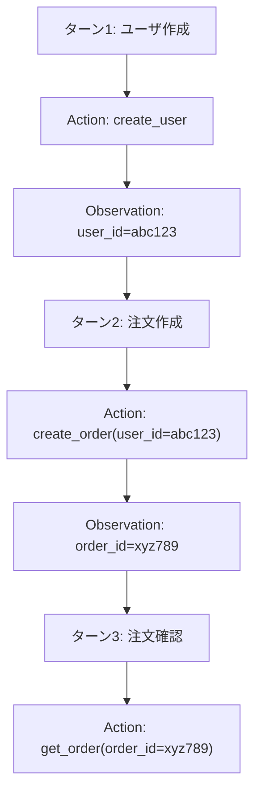

本記事は [UniToolCall: Unifying Tool-Use Representation, Data, and Evaluation for LLM Agents](https://arxiv.org/abs/2604.11557)（arXiv:2604.11557）の解説記事です。

## 論文概要

LLMエージェントのツール利用において、既存研究はインタラクション表現の不統一、トラジェクトリの構造的多様性の見落とし、互換性のない評価ベンチマークという3つの課題を抱えている。著者らはこれらを統一的に解決するフレームワークUniToolCallを提案している。22,000以上のツールプールと390,000以上の訓練インスタンスを構築し、Query--Action--Observation--Answer（QAOA）表現で標準化した結果、Qwen3-8Bのファインチューニングモデルがdistractor条件下でsingle-turn Strict Precision 93.0%を達成し、GPT、Gemini、Claudeを含む商用モデルを上回る性能を報告している。

この記事は [Zenn記事: AIエージェントのツール設計原則：選択精度を高める7つの実践パターン](https://zenn.dev/0h_n0/articles/b2b62296cac899) の深掘りです。Zenn記事の「原則1」「原則6」に直結し、ツール数20以上での選択精度と表現標準化を実験的に検証した論文である。

## 情報源

| 項目 | 内容 |
|------|------|
| タイトル | UniToolCall: Unifying Tool-Use Representation, Data, and Evaluation for LLM Agents |
| 著者 | Yijuan Liang, Xinghao Chen, Yifan Ge, et al. |
| arXiv ID | 2604.11557 |
| 発表年 | 2026年4月（v2: 2026年5月25日） |
| 分野 | cs.AI |
| コード | [https://github.com/EIT-NLP/UniToolCall](https://github.com/EIT-NLP/UniToolCall)（Apache License 2.0） |

## 背景と動機

LLMエージェントにおけるツール利用（function calling）は、外部システムとの連携を可能にする基盤技術である。しかし、既存研究には以下の構造的問題が存在すると著者らは指摘している。

**表現の不統一**: 各データセットが独自のインタラクション形式を採用しており、データの相互運用性が低い。**構造的多様性の見落とし**: 既存データセットはsingle-hopに偏り、multi-hop・multi-turnのカバレッジが不十分である。**評価の非互換性**: ベンチマーク間で指標の定義が異なり、公正な比較が困難である。

UniToolCallはこの断片化を統一フレームワークで解決することを目指している。

## 主要な貢献

著者らが主張する貢献は以下の通りである。

- **QAOA統一表現**: 異種データセットをQuery--Action--Observation--Answer形式に標準化し、表現の相互運用性を確保
- **大規模ハイブリッドデータセット**: 10の公開データセット（387,123インスタンス）と構造制御された合成トラジェクトリ（2,937インスタンス）を組み合わせた390,060インスタンスの訓練コーパス
- **22,606ツールの統一プール**: 学術ベンチマーク、MCPサーバー、構築データセットから収集し、意味的重複除去を経たツールセット
- **Anchor Linkage機構**: multi-turnインタラクションにおけるクロスターン依存性を強制する仕組み
- **3レベル階層評価**: function-call、turn、conversationの3階層で評価する統一ベンチマーク（7公開ベンチマークを変換）

## 技術的詳細

### QAOA表現形式

著者らが提案するQAOA（Query--Action--Observation--Answer）表現は、ツール利用インタラクションを4つの構成要素で標準化する。

$$
\text{Instance} = (q, \{a_i\}_{i=1}^{K}, \{o_i\}_{i=1}^{K}, r)
$$

ここで、$q$はユーザクエリ、$a_i$は$i$番目のfunction call（ツール名とパラメータの組）、$o_i$は対応するツール実行結果（observation）、$r$はユーザへの最終回答、$K$はfunction callの総数である。

multi-turnの場合、会話全体は$T$ターンの系列として表現される。

$$
\text{Conversation} = \{(q_t, \{a_{t,i}\}, \{o_{t,i}\}, r_t)\}_{t=1}^{T}
$$

この統一表現により、7つの公開ベンチマークを共通フォーマットに変換し、異なるデータセット間の比較を可能にしている。

### Anchor Linkage機構

multi-turnインタラクションでは、ターン間で状態変数（例: 前のターンで取得したリソースID）を引き継ぐ必要がある。著者らはこの依存性を明示的に管理するAnchor Linkage機構を導入している。



この機構は3つの要素で構成される: (1) 動的プロンプティング（ターン$t-1$の状態変数引き継ぎ指示）、(2) プログラム的文字列マッチング検証（ID等の変数が正しく引き継がれているか検証）、(3) LLMベース評価指標$s_{\text{anchor}}$（機能的整合性のLLMジャッジ）。

著者らのアブレーションでは、Anchor Linkage除去でanchor指標が$\Delta$-0.85と壊滅的に低下する一方、汎用メトリクスの変化は-0.25~+0.21と小さいことが報告されている（論文Section 5.3）。

### データ構築パイプライン

#### ツールプール構築（22,606ツール）

ツールは学術ベンチマーク（FC-RewardBench、ToolRet-train）、MCPサーバー（mcp.soのTop 40 + MCP-Universeの11サーバー）、構築データセットから収集される。4段階フィルタリング（完全一致重複除去、スキーマ検証、Qwen3-Embedding-8B + FAISSによる意味的重複除去（コサイン類似度 > 0.9）、時間表現フィルタリング）を適用する。

#### 訓練データ構築（390,060インスタンス）

公開データ（$D_{\text{pub}}$: 387,123インスタンス）は10データセットから収集され、Toucan（319,669）が最大の構成比を占める。合成データ（$D_{\text{syn}}$: 2,937インスタンス）はQwen3-32Bで生成し、Single-Hop / Multi-Hop / Multi-Turnの3カテゴリに各979インスタンスずつ均等配分される。品質ゲート$\Phi_{\text{eval}}$（6コアメトリクス全て7/10以上）を通過したトラジェクトリのみを採用している。

### 3レベル階層評価

著者らは4つの評価指標を3つの階層で測定する体系を構築している。

**Strict Precision（SP）**: 完全一致評価。予測と正解のfunction call数が一致し、全ツール名が正しい場合のみスコア1となる。

$$
\text{SP} = \frac{1}{N} \sum_{i=1}^{N} \mathbb{1}\left(|P_i| = |G_i| \wedge \forall p \in P_i,\, m_n(p) = 1\right)
$$

ここで$P_i$は予測function call集合、$G_i$は正解集合、$m_n(p)$はツール名マッチング関数である。**Flexible Precision（FP）**はツール名正解率、**SPA/FPA**はパラメータ一致度（厳密/意味的）をそれぞれ測定する。

評価は3階層で実施される: (1) Function-call level（個別呼び出し）、(2) Turn level（ターン内集約）、(3) Conversation level（会話全体集約）。

### Hybrid-20評価設定

Hybrid-20は、distractor（妨害ツール）を含む評価設定である。各インスタンスに対して以下の候補リストを構成する。

- 正解ツール（ground truth）
- 埋め込み類似度による上位hard negatives
- 5つのランダムeasy negatives
- 合計20候補

Zenn記事「原則6: ツール数と粒度を管理する」の学術的検証に相当する。

## 実装のポイント

UniToolCallのコードは[GitHub](https://github.com/EIT-NLP/UniToolCall)（Apache License 2.0、Python 3.9以上）で公開されている。

実装上の注意点として、以下が挙げられる。

**ツール候補リスト構成**: Hybrid-20設定の再現にはQwen3-Embedding-8B + FAISSが必要であり、埋め込みモデルの選択がモデル性能に直接影響する。

**合成データ品質ゲート**: $\Phi_{\text{eval}}$の閾値（6メトリクス7/10以上）は経験的設定であり、閾値を下げるとデータ量は増えるが品質が低下するトレードオフがある。

**QAOA変換**: 各データセット固有のフォーマットに対応したパーサーが必要であり、リポジトリに10データセット分の変換スクリプトが含まれている。

## Production Deployment Guide

ツール選択ルーティングシステムをAWSにデプロイする際の実装パターンを示す。

### AWS実装パターン（コスト最適化重視）

| 構成 | トラフィック | 主要サービス | 月額概算 |
|------|------------|-------------|---------|
| Small | ~100 req/日 | Lambda + Bedrock + DynamoDB | $50-150 |
| Medium | ~1,000 req/日 | ECS Fargate + Bedrock + ElastiCache | $300-800 |
| Large | 10,000+ req/日 | EKS + Karpenter + Spot + vLLM（Qwen3-8B） | $2,000-5,000 |

**Small構成の内訳**（2026年8月時点ap-northeast-1概算）: Lambda $5-15、Bedrock $30-100、DynamoDB $5-10、CloudWatch $5-10。

**Large構成の内訳**: EKS Control Plane $75、EC2 Spot（g5.xlarge x2）$400-600（Qwen3-8B vLLMホスト）、FAISS検索用m7i.xlarge $150、DynamoDB $50-100。Large構成ではBedrock APIコストを排除し自前モデルでコスト最適化する。

**コスト削減テクニック**: Bedrock Batch APIで50%削減。Prompt Cachingでツール定義部分の入力トークンを30-90%削減。Spot Instances（Large構成）で最大90%削減。Reserved Instances 1年コミットで72%削減。注: 2026年8月時点ap-northeast-1概算。

### Terraformインフラコード

#### Small構成（Serverless: ツール選択ルーティング）

```hcl
terraform {
  required_version = ">= 1.9"
  required_providers {
    aws = { source = "hashicorp/aws", version = "~> 5.60" }
  }
}

provider "aws" { region = "ap-northeast-1" }

resource "aws_dynamodb_table" "tool_registry" {
  name         = "unitoolcall-tool-registry"
  billing_mode = "PAY_PER_REQUEST"
  hash_key     = "tool_id"
  range_key    = "category"
  attribute { name = "tool_id";  type = "S" }
  attribute { name = "category"; type = "S" }
  server_side_encryption { enabled = true }
  ttl { attribute_name = "expires_at"; enabled = true }
}

resource "aws_iam_role" "lambda_role" {
  name = "unitoolcall-router-lambda-role"
  assume_role_policy = jsonencode({
    Version = "2012-10-17"
    Statement = [{ Action = "sts:AssumeRole", Effect = "Allow",
      Principal = { Service = "lambda.amazonaws.com" } }]
  })
}

resource "aws_iam_role_policy" "lambda_policy" {
  name = "unitoolcall-router-policy"
  role = aws_iam_role.lambda_role.id
  policy = jsonencode({
    Version = "2012-10-17"
    Statement = [
      { Effect = "Allow", Action = ["bedrock:InvokeModel"],
        Resource = "arn:aws:bedrock:ap-northeast-1::foundation-model/anthropic.*" },
      { Effect = "Allow",
        Action = ["dynamodb:GetItem", "dynamodb:PutItem", "dynamodb:Query"],
        Resource = aws_dynamodb_table.tool_registry.arn },
      { Effect = "Allow",
        Action = ["logs:CreateLogGroup", "logs:CreateLogStream", "logs:PutLogEvents"],
        Resource = "arn:aws:logs:*:*:*" },
      { Effect = "Allow",
        Action = ["xray:PutTraceSegments", "xray:PutTelemetryRecords"],
        Resource = "*" },
    ]
  })
}

resource "aws_lambda_function" "tool_router" {
  function_name    = "unitoolcall-tool-router"
  role             = aws_iam_role.lambda_role.arn
  handler          = "handler.lambda_handler"
  runtime          = "python3.12"
  timeout          = 60
  memory_size      = 512
  filename         = "lambda.zip"
  source_code_hash = filebase64sha256("lambda.zip")
  tracing_config { mode = "Active" }
  environment {
    variables = {
      TOOL_TABLE      = aws_dynamodb_table.tool_registry.name
      DEFAULT_MODEL   = "anthropic.claude-sonnet-4-20250514-v1:0"
      CANDIDATE_COUNT = "20"
    }
  }
}
```

#### Large構成（EKS + Karpenter + Spot: 自前モデルホスティング）

```hcl
module "eks" {
  source          = "terraform-aws-modules/eks/aws"
  version         = "~> 20.24"
  cluster_name    = "unitoolcall-cluster"
  cluster_version = "1.31"
  vpc_id          = module.vpc.vpc_id
  subnet_ids      = module.vpc.private_subnets
  cluster_endpoint_private_access = true
  eks_managed_node_groups = {
    system = {
      instance_types = ["m7i.large"]
      min_size = 2; max_size = 3; desired_size = 2
      capacity_type = "ON_DEMAND"
    }
  }
  tags = { "karpenter.sh/discovery" = "unitoolcall-cluster" }
}

resource "kubectl_manifest" "karpenter_gpu_nodepool" {
  yaml_body = yamlencode({
    apiVersion = "karpenter.sh/v1"
    kind       = "NodePool"
    metadata   = { name = "unitoolcall-gpu-pool" }
    spec = {
      template = { spec = {
        requirements = [
          { key = "karpenter.sh/capacity-type", operator = "In",
            values = ["spot", "on-demand"] },
          { key = "node.kubernetes.io/instance-type", operator = "In",
            values = ["g5.xlarge", "g5.2xlarge", "g6.xlarge"] },
        ]
        nodeClassRef = { group = "karpenter.k8s.aws", kind = "EC2NodeClass", name = "gpu-default" }
      } }
      limits     = { "nvidia.com/gpu" = "4" }
      disruption = { consolidationPolicy = "WhenEmptyOrUnderutilized" }
    }
  })
}

resource "aws_budgets_budget" "monthly" {
  name         = "unitoolcall-monthly"
  budget_type  = "COST"
  limit_amount = "5000"
  limit_unit   = "USD"
  time_unit    = "MONTHLY"
  notification {
    comparison_operator = "GREATER_THAN"
    threshold           = 80
    threshold_type      = "PERCENTAGE"
    notification_type   = "ACTUAL"
    subscriber_email_addresses = ["alerts@example.com"]
  }
}
```

### 運用・監視設定

```
# CloudWatch Logs Insights: ツール選択精度モニタリング
fields @timestamp, query_type, candidate_count, selected_tool, is_correct, latency_ms
| filter event = "tool_selection_completed"
| stats count(*) as total, sum(is_correct) as correct,
  avg(latency_ms) as avg_latency, percentile(latency_ms, 95) as p95
  by query_type
| sort correct/total asc
```

```python
import datetime
import json

import boto3
from aws_xray_sdk.core import patch_all, xray_recorder

patch_all()  # boto3自動計装


def setup_tool_selection_alarm(function_name: str, sns_arn: str) -> None:
    """Bedrockトークン使用量スパイク・Lambda実行時間異常検知アラーム"""
    cw = boto3.client("cloudwatch", region_name="ap-northeast-1")
    cw.put_metric_alarm(
        AlarmName=f"{function_name}-token-spike",
        ComparisonOperator="GreaterThanThreshold",
        EvaluationPeriods=2,
        MetricName="InputTokenCount", Namespace="AWS/Bedrock",
        Period=300, Statistic="Sum",
        Threshold=100000, AlarmActions=[sns_arn],
    )


def get_daily_cost_report(sns_arn: str) -> dict[str, float]:
    """日次コストレポート取得、$100/日超過でSNS通知"""
    ce = boto3.client("ce", region_name="us-east-1")
    today = datetime.date.today()
    resp = ce.get_cost_and_usage(
        TimePeriod={"Start": (today - datetime.timedelta(days=1)).isoformat(),
                    "End": today.isoformat()},
        Granularity="DAILY", Metrics=["UnblendedCost"],
        Filter={"Tags": {"Key": "Project", "Values": ["unitoolcall-router"]}},
        GroupBy=[{"Type": "DIMENSION", "Key": "SERVICE"}],
    )
    costs = {g["Keys"][0]: float(g["Metrics"]["UnblendedCost"]["Amount"])
             for g in resp["ResultsByTime"][0]["Groups"]}
    if sum(costs.values()) > 100:
        boto3.client("sns", region_name="ap-northeast-1").publish(
            TopicArn=sns_arn, Subject="UniToolCall Daily Cost Alert",
            Message=json.dumps(costs, indent=2))
    return costs
```

### コスト最適化チェックリスト

**アーキテクチャ選択**: トラフィック量で判断（~100: Serverless + Bedrock、~1,000: Hybrid、10,000+: Container + 自前Qwen3-8B）。ツール候補数が20以下ならBedrock直接呼び出し、20以上ならFAISS事前フィルタリング + Bedrock。

**リソース最適化**: GPU Spot Instances優先（g5.xlarge Spot $0.34/h vs On-Demand $1.01/h）。Reserved Instances 1年72%削減。Savings Plans検討。Lambda Power Tuning検証。EKS夜間GPU縮退。

**LLMコスト削減**: Bedrock Batch APIで50%削減。Prompt Caching有効化（ツール定義固定部分30-90%削減）。モデル選択ロジック（single-hopはHaiku、multi-hopはSonnet）。max_tokens制限。FAISS pre-filterで候補数制御しトークン数削減。

**監視・アラート**: AWS Budgets月次予算80%通知。CloudWatchトークン使用量アラーム。Cost Anomaly Detection有効化。日次コストレポート自動取得。

**リソース管理**: 未使用ツール定義の月次棚卸し（DynamoDB TTL）。`Project=unitoolcall-router`タグ戦略。FAISSインデックス定期再構築。開発環境夜間GPU停止。トラジェクトリログS3 Glacier移行（90日後）。

## 実験結果

### Hybrid-20設定での性能比較

著者らは、distractor（妨害ツール）を含むHybrid-20設定での評価結果を報告している（論文Table 1より）。

**Single-Turn Strict Precision（ST SP）**:

| モデル | SH SP | MH SP | ST SP | ST FP |
|--------|-------|-------|-------|-------|
| UniToolCall（Qwen3-8B FT） | 92.9% | 80.7% | **93.0%** | 93.8% |
| Qwen3-32B | 72.6% | - | 72.7% | - |
| Qwen3-8B（vanilla） | 66.9% | - | - | - |
| GPT-5.2 Instant | 50.9% | - | - | - |
| Gemini 3 Flash | 68.3% | - | - | - |
| Claude 4.6 Sonnet | - | 83.3% | - | - |

UniToolCall（Qwen3-8Bファインチューニング）は、single-turn Strict Precisionで93.0%を達成し、vanilla Qwen3-8Bの66.9%から+26.1ポイントの改善を報告している。これはQwen3-32B（72.7%）やGPT-5.2 Instant（50.9%）を大幅に上回る。

multi-hop SPでは80.7%を達成し、Claude 4.6 Sonnet（83.3%）に次ぐ2位となっている。8Bパラメータのオープンモデルが商用モデルに迫る性能を示した点は注目に値する。

multi-turnではSP=0.0%（全モデル共通）だが、FPでは39.4%と最高性能を記録している。conversation-levelの厳密評価がきわめて困難であることを示す結果である。

### アブレーション分析

著者らのアブレーション（論文Section 5.2）では、Single-Hopのみ（SP=51.9%）、Multi-Hopのみ（SP=53.4%）に対し、混合カリキュラム（SP=57.1%）が最良の汎化性能を示している。公開データと合成データのserial/parallel比率の違い（公開1:5.69、合成1:1.91）が相補的に作用し、均衡のとれた性能が得られている。

## 実運用への応用

UniToolCallの知見はツール選択システム構築に直接適用できる。ツール数20以上のdistractor環境下でも93%の選択精度を達成できることが実証されている。

**QAOA形式によるログ標準化**: 本番環境でのツール利用ログをQAOA形式で統一記録することで、選択精度の継続的な評価と改善が可能になる。

**候補フィルタリング戦略**: 全ツールをLLMに渡すのではなく、FAISSで候補を20程度に絞り込む2段階アーキテクチャが精度とコストの両面で効果的である。

**小規模モデルの活用**: 8Bモデルのファインチューニングが商用モデルを上回る結果は、ツール選択に特化したモデルをvLLMでセルフホストすることでAPIコストを削減できる可能性を示している。

## 関連研究

- **ToolLLM（Qin et al., 2023）**: 16,000以上のAPI関数を対象としたデータセット。UniToolCallは表現統一と評価標準化を加えて拡張
- **Gorilla（Patil et al., 2023）**: 単一API呼び出しに特化。UniToolCallはmulti-hop/multi-turnの複合シナリオをカバー
- **BFCL**: function calling評価ベンチマーク。UniToolCallはdistractor-heavyなHybrid-20という異なる評価パラダイムを提案

## まとめと今後の展望

UniToolCallは、ツール利用の表現・データ・評価の断片化を統一フレームワークで解決した研究である。QAOA表現と3レベル階層評価により、Qwen3-8BがST SP 93.0%を達成している。実務上、FAISS事前フィルタリング + 特化モデルの2段階アーキテクチャとQAOA形式のログ標準化が有効であることが示唆される。multi-turn SP=0%（全モデル共通）という結果は、複数ターンのツール利用の厳密な正確性が今後の課題であることを示している。

## 参考文献

- **arXiv**: [https://arxiv.org/abs/2604.11557](https://arxiv.org/abs/2604.11557)
- **Code**: [https://github.com/EIT-NLP/UniToolCall](https://github.com/EIT-NLP/UniToolCall)
- **Related Zenn article**: [https://zenn.dev/0h_n0/articles/b2b62296cac899](https://zenn.dev/0h_n0/articles/b2b62296cac899)
