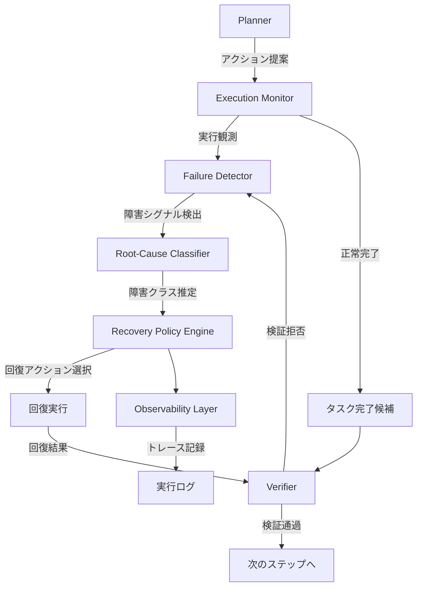
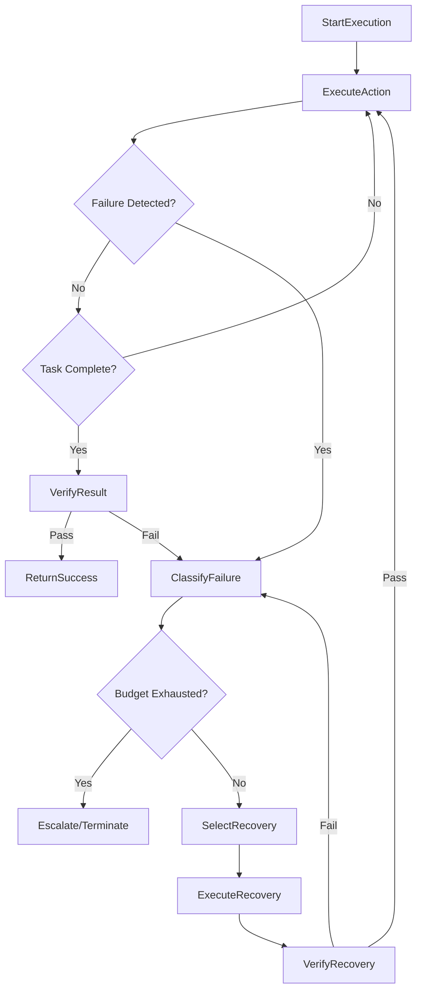

本記事は [Self-Healing Agentic Orchestrators for Reliable Tool-Augmented Large Language Model Systems](https://arxiv.org/abs/2606.01416)（arXiv:2606.01416）の解説記事です。

この記事は [Zenn記事: AIエージェントのツール設計原則：選択精度を高める7つの実践パターン](https://zenn.dev/0h_n0/articles/b2b62296cac899) の深掘りです。Zenn記事では「原則4: 構造化エラーレスポンスでエージェントの自律回復を支援する」としてエラーレスポンスの`recoverable`フラグや`suggested_action`による回復戦略を解説していますが、本論文はそうした自律回復メカニズムをオーケストレーションレイヤー全体に拡張し、障害分類・バジェット制約・検証ループを統合したフレームワークの学術的基盤を提供しています。

---

## 論文概要

著者らは、ツール拡張型LLMエージェントの信頼性をランタイム制御問題として扱う自己修復型オーケストレータを提案している。このオーケストレータはmonitor-detect-diagnose-recover-verifyの5段階ループを実装し、観測可能な障害シグナルから障害クラスを推定、バジェット制約下で回復アクションを選択し、回復後の軌道を検証する。100タスクの制御障害注入ベンチマークでの評価では、タスク成功率98.8%を達成し、リトライのみの94.5%および完全リプランニングの93.8%を上回る結果が報告されている。

## 情報源

| 項目 | 内容 |
|------|------|
| タイトル | Self-Healing Agentic Orchestrators for Reliable Tool-Augmented Large Language Model Systems |
| 著者 | Rahul Suresh Babu, Adarsh Agrawal |
| arXiv ID | 2606.01416 |
| 投稿日 | 2026年5月31日 |
| 分野 | cs.AI |
| URL | [https://arxiv.org/abs/2606.01416](https://arxiv.org/abs/2606.01416) |

## 背景と動機

ツール拡張型LLMエージェントは、プランニング・検索・ツール呼び出し・検証・メモリ管理・リカバリを調整するオーケストレーションレイヤーに依存している。こうしたシステムでは、モデル自体のエラーだけでなく、オーケストレーションレベルの障害が信頼性を損なう。

著者らは、既存のアプローチに以下の限界があると指摘している。

1. **静的ワークフロー**: 事前定義されたシーケンスに従うのみで、障害発生時に適応的な回復を行えない
2. **リトライのみ**: 障害の種類を区別せず一律にリトライするため、タイムアウト以外の障害（不正引数、古いコンテキストなど）に対して非効率
3. **ReActスタイル**: 推論-行動ループを繰り返すが、回復バジェットの管理や障害分類を行わない
4. **完全リプランニング**: 失敗したプランを破棄して再プランニングするが、正常に完了した中間結果まで無駄にする

特に著者らが問題視しているのが**サイレント障害**である。構文的には正しいが意味的に誤った出力（wrong-but-plausible output）がそのまま返される問題は、上記のいずれの手法でも検出できない。

## 主要な貢献

著者らが主張する主要な貢献は以下の4点である。

1. **5段階制御ループ**: monitor-detect-diagnose-recover-verifyの各段階を明示的に分離したオーケストレーションフレームワーク
2. **障害分類体系**: ツールタイムアウト、スキーマ障害、不正出力、誤ったツール選択、古いコンテキスト、矛盾するエビデンス、検証障害、制御ループ障害の8クラスを定義
3. **バジェット制約付き回復ポリシー**: リトライ・リプランニング・ツール代替・モデルエスカレーションの各バジェットを個別に管理し、コスト制約下で最適な回復アクションを選択
4. **Verifier誘導によるサイレント障害排除**: セマンティック検証により、非検証手法で13-18%発生するサイレント障害を0.0%に削減

## 技術的詳細

### 5段階制御ループ

オーケストレータの制御ループは、自律コンピューティングのMAPE-Kパターンを拡張した設計である。



各コンポーネントの役割は以下の通りである。

- **Execution Monitor**: アクション、観測値、ツールメタデータ、レイテンシ、検証結果を記録
- **Failure Detector**: 実行エビデンスから候補となる障害シグナルを生成
- **Root-Cause Classifier**: 検出されたシグナルと実行状態から障害クラスを推定
- **Recovery Policy Engine**: 回復ポリシー $R_t = \pi(S_t, x_t, C_t, B_t)$ に基づき回復アクションを選択
- **Verifier**: 回復後の軌道または最終レスポンスの妥当性を評価

### 障害分類体系

著者らは、ツール拡張型LLMシステムで発生する障害を以下の8クラスに分類している。

| 障害クラス | 代表的シグナル | 主要な回復戦略 |
|:--|:--|:--|
| ツールタイムアウト/利用不可 | タイムアウト、レート制限 | バックオフ付きリトライ、ツール代替 |
| スキーマ/引数障害 | 不正JSON、型不一致 | 引数修復、制約付きプロンプト |
| 不正出力 | 空出力、パース失敗 | 出力検証、代替ツール使用 |
| 誤ったツール選択 | Verifier拒否、無関係な出力 | ステップリプランニング |
| 古い/不十分なコンテキスト | 低エビデンススコア | 検索リフレッシュ、メモリ更新 |
| 矛盾するエビデンス | ツール出力間の矛盾 | クロスチェック、Verifier呼び出し |
| 検証/セマンティック障害 | 未裏付けの主張 | エビデンス再取得、制約付き再生成 |
| 制御ループ障害 | リトライストーム、進捗なし | ループ終了、チェックポイントからリプラン |

重要な区別として、障害**シグナル**（$x_t$: 例外やタイムアウトなどの観測可能な指標）、障害**イベント**（$F_t$: 期待される条件に違反した状態）、障害**クラス**（$C_t$: 診断によって推定される原因）の3層構造が定義されている。

### 回復ポリシーとバジェット制約

回復アクション集合は以下の通りである。

$$
\mathcal{R} = \{\text{retry}, \text{repair}, \text{substitute}, \text{replan}, \text{refresh}, \text{escalate}, \text{degrade}, \text{terminate}\}
$$

回復バジェットは多次元ベクトルとして定義される。

$$
B_t = (b_t^r, b_t^p, b_t^s, b_t^m, b_t^L, b_t^K)
$$

各成分は、リトライ回数 ($b_t^r$)、リプランニング回数 ($b_t^p$)、ツール代替回数 ($b_t^s$)、モデルエスカレーション回数 ($b_t^m$)、レイテンシ ($b_t^L$)、コスト ($b_t^K$) の残バジェットを表す。回復アクション $R_t$ の実行後、バジェットは以下のように更新される。

$$
B_{t+1} = B_t - \Delta B(R_t)
$$

著者らは、**失敗した回復試行もバジェットを消費する**と明記している。これにより、無駄なリトライの繰り返しが自然にバジェット枯渇で抑制される。

### アルゴリズム

著者らが提示する自己修復オーケストレーションポリシーの核心は以下のアルゴリズムである。

```
入力: タスク T, 初期プラン P, 初期状態 S1, 初期バジェット B1
出力: 最終レスポンス + 実行トレース G

t <- 1
while タスク未完了 かつ Bt が未枯渇:
    1. プラン P と状態 St からアクション at を選択
    2. アクション at を実行し、観測 ot を得る
    3. (at, ot) をトレース G に記録
    4. 状態更新: St <- Update(St, at, ot)
    5. 障害シグナル xt を検出

    if 障害なし:
        if タスク完了条件を満たす:
            候補状態を検証 -> vt
            if vt 受理: レスポンスと G を返却
            else: xt <- verifier拒否として障害処理へ
        else: t <- t + 1, continue

    if 障害シグナルあり:
        1. 障害クラス Ct を分類
        2. 回復選択: Rt = pi(St, xt, Ct, Bt)
        3. if Rt = terminate: break
        4. 回復を実行し、結果を観測
        5. 回復後状態を検証 -> vt
        6. バジェット更新: Bt+1 = Bt - delta_B(Rt)
        7. (xt, Ct, Rt, vt, Bt+1) をトレース G に記録
        8. t <- t + 1

return 最終レスポンス + G、またはエスカレート/終了
```

状態更新関数は以下のように定義される。

$$
S_{t+1} = \Phi(S_t, a_t, o_t, R_t, v_t)
$$

これは先行状態、実行アクション、観測値、回復判断、検証結果を統合した更新であり、障害からの回復コンテキストが次の意思決定に反映される設計となっている。

### コストモデル

オーケストレータの総コストは以下のように定式化されている。

$$
K = \alpha M + \beta U + \gamma V + \delta R
$$

ここで $M$ はモデル呼び出し数、$U$ はツール呼び出し数、$V$ はVerifier呼び出し数、$R$ は回復アクション数、$\alpha, \beta, \gamma, \delta$ は各操作の単位コストである。制御実験ではコストプロキシとして $\text{CostProxy} = N_{\text{tool}} + N_{\text{model}} + N_{\text{verify}}$ が使用されている。

## 実装のポイント

本論文の障害分類と回復ポリシーの概念を実装する際のポイントを示す。以下は、障害シグナルの検出から回復アクション選択までの実装例である。

```python
from dataclasses import dataclass, field
from enum import Enum
from typing import Any


class FailureClass(Enum):
    """論文の障害分類体系に基づく障害クラス定義。"""

    TOOL_TIMEOUT = "tool_timeout"
    SCHEMA_FAILURE = "schema_failure"
    MALFORMED_OUTPUT = "malformed_output"
    INCORRECT_TOOL = "incorrect_tool"
    STALE_CONTEXT = "stale_context"
    CONTRADICTORY_EVIDENCE = "contradictory_evidence"
    VERIFICATION_FAILURE = "verification_failure"
    CONTROL_LOOP_FAILURE = "control_loop_failure"


class RecoveryAction(Enum):
    """回復アクション集合 R = {retry, repair, substitute, ...}。"""

    RETRY = "retry"
    REPAIR = "repair"
    SUBSTITUTE = "substitute"
    REPLAN = "replan"
    REFRESH = "refresh"
    ESCALATE = "escalate"
    DEGRADE = "degrade"
    TERMINATE = "terminate"


@dataclass
class RecoveryBudget:
    """多次元回復バジェット Bt = (b_r, b_p, b_s, b_m, b_L, b_K)。

    Attributes:
        retry: リトライ残回数
        replan: リプランニング残回数
        substitute: ツール代替残回数
        escalate: モデルエスカレーション残回数
        latency_ms: レイテンシ残バジェット（ミリ秒）
        cost: コスト残バジェット（任意単位）
    """

    retry: int = 3
    replan: int = 2
    substitute: int = 2
    escalate: int = 1
    latency_ms: float = 30000.0
    cost: float = 10.0

    def is_exhausted(self) -> bool:
        """全バジェットが枯渇しているか判定する。"""
        return (
            self.retry <= 0
            and self.replan <= 0
            and self.substitute <= 0
            and self.escalate <= 0
        )

    def consume(self, action: RecoveryAction, latency: float, cost: float) -> None:
        """回復アクション実行後にバジェットを消費する。

        失敗した回復もバジェットを消費する（論文の設計方針）。
        """
        budget_map = {
            RecoveryAction.RETRY: "retry",
            RecoveryAction.REPLAN: "replan",
            RecoveryAction.SUBSTITUTE: "substitute",
            RecoveryAction.ESCALATE: "escalate",
        }
        if action in budget_map:
            current = getattr(self, budget_map[action])
            setattr(self, budget_map[action], current - 1)
        self.latency_ms -= latency
        self.cost -= cost


# 障害クラスから回復アクションへのマッピング（論文Table参照）
RECOVERY_POLICY: dict[FailureClass, list[RecoveryAction]] = {
    FailureClass.TOOL_TIMEOUT: [
        RecoveryAction.RETRY,
        RecoveryAction.SUBSTITUTE,
        RecoveryAction.REPLAN,
    ],
    FailureClass.SCHEMA_FAILURE: [
        RecoveryAction.REPAIR,
        RecoveryAction.RETRY,
    ],
    FailureClass.MALFORMED_OUTPUT: [
        RecoveryAction.RETRY,
        RecoveryAction.SUBSTITUTE,
    ],
    FailureClass.INCORRECT_TOOL: [
        RecoveryAction.REPLAN,
        RecoveryAction.SUBSTITUTE,
    ],
    FailureClass.STALE_CONTEXT: [
        RecoveryAction.REFRESH,
        RecoveryAction.SUBSTITUTE,
    ],
    FailureClass.CONTRADICTORY_EVIDENCE: [
        RecoveryAction.REFRESH,
        RecoveryAction.REPLAN,
    ],
    FailureClass.VERIFICATION_FAILURE: [
        RecoveryAction.REFRESH,
        RecoveryAction.REPLAN,
    ],
    FailureClass.CONTROL_LOOP_FAILURE: [
        RecoveryAction.TERMINATE,
        RecoveryAction.REPLAN,
        RecoveryAction.DEGRADE,
    ],
}


def select_recovery_action(
    failure_class: FailureClass,
    budget: RecoveryBudget,
) -> RecoveryAction:
    """回復ポリシー pi(St, xt, Ct, Bt) の簡易実装。

    障害クラスに対応する回復アクション候補を優先度順に走査し、
    バジェットが残っている最初のアクションを選択する。

    Args:
        failure_class: 推定された障害クラス
        budget: 現在の回復バジェット

    Returns:
        選択された回復アクション
    """
    candidates = RECOVERY_POLICY.get(failure_class, [RecoveryAction.TERMINATE])

    budget_check = {
        RecoveryAction.RETRY: budget.retry > 0,
        RecoveryAction.REPAIR: budget.retry > 0,
        RecoveryAction.SUBSTITUTE: budget.substitute > 0,
        RecoveryAction.REPLAN: budget.replan > 0,
        RecoveryAction.REFRESH: budget.retry > 0,
        RecoveryAction.ESCALATE: budget.escalate > 0,
        RecoveryAction.DEGRADE: True,
        RecoveryAction.TERMINATE: True,
    }

    for action in candidates:
        if budget_check.get(action, False):
            return action

    return RecoveryAction.TERMINATE
```

Zenn記事で解説されている構造化エラーレスポンスの`recoverable`フラグは、上記の`FailureClass`による分類と`RecoveryBudget`によるバジェット管理の組み合わせに対応する。単純なフラグではなく、障害の種類に応じた回復戦略の選択と、リソース制約下での最適化が本論文の核心である。

## Production Deployment Guide

### AWS実装パターン（コスト最適化重視）

自己修復型オーケストレータをAWSにデプロイする際の構成パターンを、エージェントの規模別に示す。

**規模別の推奨構成**:

| 構成 | エージェント規模 | 主要サービス | 月額概算 |
|:--|:--|:--|:--|
| Small | ~50タスク/日 | Lambda + Step Functions + DynamoDB | $60-150 |
| Medium | ~500タスク/日 | ECS Fargate + SQS + ElastiCache + DynamoDB | $350-800 |
| Large | 5,000+タスク/日 | EKS + SQS + ElastiCache + DynamoDB + OpenSearch | $2,000-5,000 |

**Small構成（Serverless）の詳細**:
- Lambda: オーケストレータ制御ループ（メモリ1024MB、タイムアウト300秒）
- Step Functions: 5段階ループのステートマシン実装（Standard Workflows）
- DynamoDB: 実行トレース・バジェット状態の永続化（On-Demandモード）
- EventBridge: タスクスケジューリング
- CloudWatch: Observabilityレイヤーのメトリクス・ログ

**Large構成（Container）の詳細**:
- EKS: オーケストレータサービス（Spot Instance優先、c6i.xlarge x 3）
- SQS: タスクキュー（FIFO、デッドレターキュー付き）
- ElastiCache Redis: バジェット状態・実行コンテキストのキャッシュ（cache.r6g.large）
- DynamoDB: 実行トレースの永続化（On-Demandモード）
- OpenSearch: トレースログの検索・分析（t3.medium.search x 2）
- Karpenter: Spot Instance自動プロビジョニング

**コスト削減テクニック**:
- Step Functionsの状態遷移を最小化（バジェット枯渇時の早期終了）
- ElastiCache導入でLLM API呼び出しのキャッシュヒット率を向上（同一ツール呼び出しの再利用）
- Spot Instancesの活用でEKSワーカーノードコストを最大90%削減
- DynamoDB TTLを活用し、古いトレースログの自動削除でストレージコストを抑制

**コスト試算の注意事項**: 上記はAWS ap-northeast-1（東京）リージョンの2026年8月時点の概算値である。LLM API呼び出しコスト（モデルプロバイダ課金）は含まれていない。実際のコストはタスク複雑度、障害発生率、使用LLMモデルにより変動する。最新料金はAWS料金計算ツールで確認を推奨する。

### Step Functionsによる5段階ループ実装

論文の5段階制御ループは、AWS Step Functionsのステートマシンとして自然にマッピングできる。



### Terraformインフラコード

**Small構成（Serverless）**:

```hcl
# Self-Healing Orchestrator - Small構成（Serverless）
# Lambda + Step Functions + DynamoDB

terraform {
  required_version = ">= 1.9"
  required_providers {
    aws = {
      source  = "hashicorp/aws"
      version = "~> 5.60"
    }
  }
}

provider "aws" {
  region = "ap-northeast-1"
}

# DynamoDB: 実行トレース・バジェット状態の永続化
resource "aws_dynamodb_table" "execution_traces" {
  name         = "selfhealing-execution-traces"
  billing_mode = "PAY_PER_REQUEST"
  hash_key     = "task_id"
  range_key    = "step_id"

  attribute {
    name = "task_id"
    type = "S"
  }

  attribute {
    name = "step_id"
    type = "N"
  }

  ttl {
    attribute_name = "expires_at"
    enabled        = true
  }

  server_side_encryption {
    enabled = true
  }

  tags = {
    Project = "selfhealing-orchestrator"
    Env     = "production"
  }
}

# DynamoDB: 回復バジェット状態管理
resource "aws_dynamodb_table" "recovery_budgets" {
  name         = "selfhealing-recovery-budgets"
  billing_mode = "PAY_PER_REQUEST"
  hash_key     = "task_id"

  attribute {
    name = "task_id"
    type = "S"
  }

  server_side_encryption {
    enabled = true
  }

  tags = {
    Project = "selfhealing-orchestrator"
    Env     = "production"
  }
}

# IAMロール: Lambda実行用（最小権限）
resource "aws_iam_role" "lambda_exec" {
  name = "selfhealing-lambda-exec"
  assume_role_policy = jsonencode({
    Version = "2012-10-17"
    Statement = [{
      Action = "sts:AssumeRole"
      Effect = "Allow"
      Principal = { Service = "lambda.amazonaws.com" }
    }]
  })
}

resource "aws_iam_role_policy" "lambda_policy" {
  name = "selfhealing-lambda-policy"
  role = aws_iam_role.lambda_exec.id
  policy = jsonencode({
    Version = "2012-10-17"
    Statement = [
      {
        Effect = "Allow"
        Action = [
          "dynamodb:GetItem",
          "dynamodb:PutItem",
          "dynamodb:UpdateItem",
          "dynamodb:Query",
        ]
        Resource = [
          aws_dynamodb_table.execution_traces.arn,
          aws_dynamodb_table.recovery_budgets.arn,
        ]
      },
      {
        Effect = "Allow"
        Action = [
          "logs:CreateLogGroup",
          "logs:CreateLogStream",
          "logs:PutLogEvents",
        ]
        Resource = "arn:aws:logs:*:*:*"
      },
    ]
  })
}

# Lambda: オーケストレータ制御ループ
resource "aws_lambda_function" "orchestrator" {
  function_name = "selfhealing-orchestrator"
  role          = aws_iam_role.lambda_exec.arn
  handler       = "orchestrator.handler"
  runtime       = "python3.12"
  timeout       = 300
  memory_size   = 1024

  filename         = "lambda/orchestrator.zip"
  source_code_hash = filebase64sha256("lambda/orchestrator.zip")

  environment {
    variables = {
      TRACES_TABLE = aws_dynamodb_table.execution_traces.name
      BUDGETS_TABLE = aws_dynamodb_table.recovery_budgets.name
      MAX_RETRY_BUDGET    = "3"
      MAX_REPLAN_BUDGET   = "2"
      MAX_LATENCY_MS      = "30000"
    }
  }

  tags = {
    Project = "selfhealing-orchestrator"
    Env     = "production"
  }
}

# Lambda: 障害分類器
resource "aws_lambda_function" "failure_classifier" {
  function_name = "selfhealing-failure-classifier"
  role          = aws_iam_role.lambda_exec.arn
  handler       = "classifier.handler"
  runtime       = "python3.12"
  timeout       = 30
  memory_size   = 512

  filename         = "lambda/classifier.zip"
  source_code_hash = filebase64sha256("lambda/classifier.zip")

  tags = {
    Project = "selfhealing-orchestrator"
    Env     = "production"
  }
}

# Lambda: Verifier
resource "aws_lambda_function" "verifier" {
  function_name = "selfhealing-verifier"
  role          = aws_iam_role.lambda_exec.arn
  handler       = "verifier.handler"
  runtime       = "python3.12"
  timeout       = 60
  memory_size   = 512

  filename         = "lambda/verifier.zip"
  source_code_hash = filebase64sha256("lambda/verifier.zip")

  tags = {
    Project = "selfhealing-orchestrator"
    Env     = "production"
  }
}
```

**Step Functions ステートマシン定義**:

```hcl
# Step Functions: 5段階制御ループ
resource "aws_iam_role" "sfn_exec" {
  name = "selfhealing-sfn-exec"
  assume_role_policy = jsonencode({
    Version = "2012-10-17"
    Statement = [{
      Action = "sts:AssumeRole"
      Effect = "Allow"
      Principal = { Service = "states.amazonaws.com" }
    }]
  })
}

resource "aws_iam_role_policy" "sfn_policy" {
  name = "selfhealing-sfn-policy"
  role = aws_iam_role.sfn_exec.id
  policy = jsonencode({
    Version = "2012-10-17"
    Statement = [{
      Effect = "Allow"
      Action = "lambda:InvokeFunction"
      Resource = [
        aws_lambda_function.orchestrator.arn,
        aws_lambda_function.failure_classifier.arn,
        aws_lambda_function.verifier.arn,
      ]
    }]
  })
}

resource "aws_sfn_state_machine" "selfhealing_loop" {
  name     = "selfhealing-orchestration-loop"
  role_arn = aws_iam_role.sfn_exec.arn

  definition = jsonencode({
    Comment = "Self-Healing Orchestrator: monitor-detect-diagnose-recover-verify loop"
    StartAt = "ExecuteAction"
    States = {
      ExecuteAction = {
        Type     = "Task"
        Resource = aws_lambda_function.orchestrator.arn
        Next     = "CheckFailure"
        Catch = [{
          ErrorEquals = ["States.ALL"]
          Next        = "ClassifyFailure"
          ResultPath  = "$.error"
        }]
      }
      CheckFailure = {
        Type = "Choice"
        Choices = [
          {
            Variable     = "$.failure_detected"
            BooleanEquals = true
            Next         = "ClassifyFailure"
          },
          {
            Variable     = "$.task_complete"
            BooleanEquals = true
            Next         = "VerifyResult"
          }
        ]
        Default = "ExecuteAction"
      }
      ClassifyFailure = {
        Type     = "Task"
        Resource = aws_lambda_function.failure_classifier.arn
        Next     = "CheckBudget"
      }
      CheckBudget = {
        Type = "Choice"
        Choices = [{
          Variable     = "$.budget_exhausted"
          BooleanEquals = true
          Next         = "Escalate"
        }]
        Default = "SelectRecovery"
      }
      SelectRecovery = {
        Type     = "Task"
        Resource = aws_lambda_function.orchestrator.arn
        Parameters = {
          "action" = "select_recovery"
          "state.$" = "$"
        }
        Next = "VerifyRecovery"
      }
      VerifyRecovery = {
        Type     = "Task"
        Resource = aws_lambda_function.verifier.arn
        Next     = "CheckRecoveryResult"
      }
      CheckRecoveryResult = {
        Type = "Choice"
        Choices = [{
          Variable     = "$.verification_passed"
          BooleanEquals = true
          Next         = "ExecuteAction"
        }]
        Default = "ClassifyFailure"
      }
      VerifyResult = {
        Type     = "Task"
        Resource = aws_lambda_function.verifier.arn
        Next     = "CheckVerification"
      }
      CheckVerification = {
        Type = "Choice"
        Choices = [{
          Variable     = "$.verification_passed"
          BooleanEquals = true
          Next         = "Success"
        }]
        Default = "ClassifyFailure"
      }
      Success = {
        Type = "Succeed"
      }
      Escalate = {
        Type = "Fail"
        Error = "BudgetExhausted"
        Cause = "Recovery budget exhausted, escalating to human operator"
      }
    }
  })

  tags = {
    Project = "selfhealing-orchestrator"
    Env     = "production"
  }
}
```

### Observabilityの実装

論文のObservabilityレイヤーは、CloudWatch Metricsと構造化ログで実装できる。

```python
import json
import time
from dataclasses import asdict, dataclass
from typing import Any


@dataclass
class RecoveryTraceEvent:
    """論文のObservabilityレイヤーが記録するトレースイベント。

    Attributes:
        task_id: タスク識別子
        step: ステップ番号
        event: イベント種別
        failure_signal: 検出された障害シグナル
        failure_class: 推定された障害クラス
        recovery_action: 選択された回復アクション
        verification_result: 検証結果
        budget_remaining: 残りバジェット
        latency_ms: 処理時間（ミリ秒）
        ts: タイムスタンプ（ISO 8601）
    """

    task_id: str
    step: int
    event: str
    failure_signal: str | None = None
    failure_class: str | None = None
    recovery_action: str | None = None
    verification_result: str | None = None
    budget_remaining: dict[str, Any] | None = None
    latency_ms: float = 0.0
    ts: str = ""

    def __post_init__(self) -> None:
        if not self.ts:
            self.ts = time.strftime("%Y-%m-%dT%H:%M:%S%z")

    def to_json(self) -> str:
        """構造化JSONログとして出力する。"""
        return json.dumps(asdict(self), ensure_ascii=False)
```

### 監視ダッシュボードの主要メトリクス

プロダクション環境では以下のメトリクスを監視する。

| メトリクス | 説明 | アラート閾値 |
|:--|:--|:--|
| `task_success_rate` | タスク成功率 | < 95% で Warning、< 90% で Critical |
| `silent_failure_rate` | サイレント障害率 | > 0% で Critical（Verifier有効時） |
| `recovery_success_rate` | 回復成功率 | < 80% で Warning |
| `budget_exhaustion_rate` | バジェット枯渇率 | > 10% で Warning |
| `avg_recovery_steps` | 平均回復ステップ数 | > 2.0 で Warning |
| `p99_latency_ms` | P99レイテンシ | > 30000ms で Warning |
| `cost_per_task` | タスクあたりコスト | ベースラインの2倍超で Warning |

## 実験結果

### 全体的な信頼性

著者らは100タスクの制御障害注入ベンチマークで5つの手法を比較している。合計33,600回の実行から得られた結果は以下の通りである。

| 手法 | 成功率(%) | 回復率(%) | サイレント障害(%) | コストプロキシ |
|:--|:--|:--|:--|:--|
| 静的ワークフロー | 70.1 | 0.0 | 0.0 | 1.61 |
| リトライのみ | 94.5 | 24.0 | 0.0 | 2.24 |
| ReActスタイル | 94.1 | 22.6 | 0.0 | 3.63 |
| 完全リプランニング | 93.8 | 21.0 | 0.0 | 3.63 |
| **自己修復** | **98.8** | **27.6** | **0.0** | **3.25** |

自己修復は最強の非自己修復ベースライン（リトライのみ）に対して4.3ポイント、完全リプランニングに対して5.0ポイントの改善を達成している。注目すべきは、コストプロキシが完全リプランニング（3.63）やReActスタイル（3.63）より低い3.25に抑えられている点である。

### 高ストレス環境での性能

障害注入強度 $\lambda \in \{0.4, 0.5\}$ の高ストレス環境では、手法間の差がさらに拡大すると報告されている。

| 手法 | 通常時成功率(%) | 高ストレス成功率(%) |
|:--|:--|:--|
| リトライのみ | 98.4 | 86.7 |
| 完全リプランニング | 98.2 | 85.2 |
| **自己修復** | **99.6** | **97.3** |

高ストレス環境で自己修復はリトライのみに対して10.6ポイントの改善を示している。

### 回復バジェット感度分析

回復バジェットを統一した条件での比較では、自己修復がすべてのバジェットレベルでベースラインを上回ると報告されている。

| 回復バジェット | リトライのみ(%) | 完全リプランニング(%) | 自己修復(%) |
|:--|:--|:--|:--|
| 1 | 85.3 | 88.2 | **94.0** |
| 2 | 93.8 | 94.3 | **97.8** |
| 3 | 96.7 | 97.8 | **99.2** |
| 5 | 99.2 | 99.3 | **100.0** |

単一回復での差が最大（8.7ポイント）であることは、自己修復の改善が「より多くリトライする」ことによるものではなく、障害に応じた適切な回復アクションの選択によるものであることを示している。

### サイレント障害の排除

セマンティック障害注入実験では、構文的に正しいが意味的に誤った出力に対する各手法の振る舞いが検証されている。

| 手法 | 成功率(%) | サイレント障害率(%) |
|:--|:--|:--|
| 静的ワークフロー | 84.8 | 15.2 |
| リトライのみ | 85.4 | 14.6 |
| ReActスタイル | 86.8 | 13.2 |
| 自己修復（Verifierなし） | 82.4 | 17.6 |
| **自己修復（Verifierあり）** | **100.0** | **0.0** |

Verifier誘導の自己修復のみがサイレント障害率0.0%を達成しており、非検証手法では13.2-17.6%のサイレント障害が発生すると報告されている。

### アブレーション分析

著者らは各コンポーネントの寄与を以下のアブレーション実験で検証している。

| バリアント | 成功率(%) | 回復率(%) |
|:--|:--|:--|
| フル自己修復 | 99.3 | 32.3 |
| Verifierなし | 99.3 | 32.3 |
| **Classifierなし** | **95.7** | **28.7** |
| **Targeted Recoveryなし** | **95.7** | **28.7** |
| Observabilityなし | 99.3 | 32.3 |

Classifierまたは障害別回復の除去で成功率が99.3%から95.7%に低下しており、障害の種類に応じた回復アクション選択が性能改善の核心であることが示されている。

## 実運用への応用

### Zenn記事との接続

Zenn記事「AIエージェントのツール設計原則」の「原則4: 構造化エラーレスポンスでエージェントの自律回復を支援する」では、ツール側が`recoverable`フラグと`suggested_action`を返すことでエージェントの自律回復を支援する設計を提案している。本論文はこのアプローチをオーケストレーションレイヤー全体に拡張し、ツール側の情報を障害分類器への入力シグナルとして活用する体系を提供している。

具体的には、Zenn記事の構造化エラーレスポンスは本論文の障害シグナル $x_t$ に対応し、`recoverable`フラグは障害クラス $C_t$ の推定に、`suggested_action`は回復ポリシー $\pi$ の入力に組み込める。

### プロダクション適用の考慮点

1. **Verifierのコスト**: Verifier呼び出しはLLM API呼び出しを追加するため、コストが増加する。著者らの実験ではコストプロキシが3.25（非Verifier手法の1.61-2.24より高い）であるが、サイレント障害の排除による品質改善と天秤にかける必要がある
2. **バジェット設計**: 回復バジェット5でタスク成功率100.0%が達成されているが、コストとレイテンシの制約に応じてバジェット1-3の範囲で設定を調整する必要がある
3. **障害分類器の実装**: 著者らの実験は制御された障害注入を使用しており、実世界の障害はより多様で曖昧である。分類器の精度がシステム全体の性能を左右する

### 制約と限界

著者らは以下の制約を明示している。

- **制御実験の限界**: ベンチマークは合成タスクと制御された障害注入に基づいており、本番環境の障害パターンとは異なる可能性がある
- **Model-in-the-Loop実験の規模**: ライブモデルを使用した実験は90-180回の実行にとどまっており、制御実験（33,600回）と比較して規模が小さい
- **ツールの局所性**: 実験で使用されたツールはローカルかつ決定的であり、外部APIの不確実性は考慮されていない
- **自然発生障害の未検証**: 障害は注入されたものであり、本番環境で自然に発生するインシデントでの評価は行われていない

## 関連研究

- **ReAct** (Yao et al., 2023): 推論-行動ループによるLLMエージェントフレームワーク。本論文はReActスタイルの手法を回復バジェットなしのベースラインとして比較し、障害分類と検証なしでは信頼性が限定的であることを示している
- **Reflexion** (Shinn et al., 2023): 反省に基づく回復メカニズム。本論文の回復ポリシーは、反省よりも構造化された障害分類に基づく点で異なる
- **MAPE-K**: 自律コンピューティングの制御ループパターン。本論文のmonitor-detect-diagnose-recover-verifyループはMAPE-Kを拡張した設計として位置付けられている
- **AgentBench** (Liu et al., 2023): マルチ環境でのLLMエージェント評価ベンチマーク。本論文は信頼性に特化した制御障害注入ベンチマークを構築している

## まとめ

本論文は、ツール拡張型LLMエージェントの信頼性をランタイム制御問題として定式化し、monitor-detect-diagnose-recover-verifyの5段階ループによる自己修復オーケストレータを提案している。100タスクのベンチマークで自己修復が98.8%のタスク成功率を達成し、リトライのみ（94.5%）や完全リプランニング（93.8%）を上回る結果が報告されている。特に、単一回復での8.7ポイントの差（94.0% vs 85.3%）は、障害に応じた回復戦略の選択が重要であることを実証している。Verifier誘導によるサイレント障害の排除（0.0% vs 13-18%）も、プロダクション環境での品質保証に直結する知見である。

## 参考文献

- **arXiv**: [https://arxiv.org/abs/2606.01416](https://arxiv.org/abs/2606.01416)
- **Related Zenn article**: [https://zenn.dev/0h_n0/articles/b2b62296cac899](https://zenn.dev/0h_n0/articles/b2b62296cac899)
