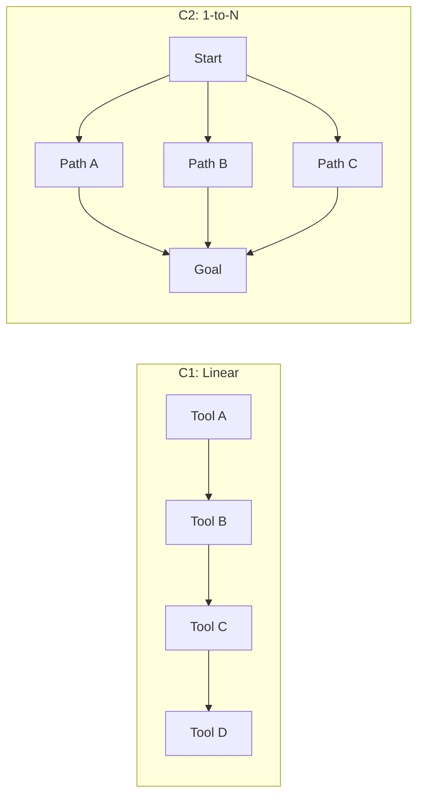

本記事は [When Tools Fail: Benchmarking Dynamic Replanning and Anomaly Recovery in LLM Agents](https://arxiv.org/abs/2606.05806)（arXiv:2606.05806）の解説記事です。

## 論文概要

既存のツール統合推論（Tool-Integrated Reasoning, TIR）ベンチマークは、ツールが正常に動作する「ハッピーパス」のみを評価対象としており、現実世界で頻発するツール障害への対応能力を見落としていた。著者らは**ToolMaze**ベンチマークを提案し、DAGベースのトポロジカル複雑度と2x2の摂動分類法（explicit/implicit x transient/permanent）という2次元設計でエージェントの障害回復能力を体系的に評価した。評価の結果、暗黙的セマンティック障害でPerturbation Recovery Rate（PRR）が約37%低下すること、エージェントの耐障害性がモデルスケーリングに対して基本タスク実行の3.66倍遅い速度でしか改善しないことが明らかになった。

## この記事について

この記事は [Zenn記事: AIエージェントのツール設計原則：選択精度を高める7つの実践パターン](https://zenn.dev/0h_n0/articles/b2b62296cac899) の深掘りです。Zenn記事の「原則4: 構造化エラーレスポンスでエージェントの自律回復を支援する」で述べられているエラー回復パターンについて、本論文はベンチマークを通じた学術的検証を提供している。

## 情報源

| 項目 | 内容 |
|------|------|
| タイトル | When Tools Fail: Benchmarking Dynamic Replanning and Anomaly Recovery in LLM Agents |
| 著者 | Dongsheng Zhu, Xuchen Ma, Yucheng Shen, Xiang Li, Yukun Zhao et al. |
| arXiv ID | 2606.05806 |
| 発表年 | 2026年6月 |
| 分野 | cs.AI |
| コード | [GitHub: Zhudongsheng75/ToolMaze](https://github.com/Zhudongsheng75/ToolMaze) |

## 背景と動機

LLMエージェントのツール呼び出し能力は急速に向上しているが、既存のベンチマーク（API-Bank、ToolBench、BFCL等）はツールが常に正常動作する前提で設計されている。しかし現実の運用環境では、API応答のタイムアウト、レート制限（HTTP 429）、サービス停止、さらにはデータの意味的破損（古いキャッシュからの返却、計算誤差を含む応答等）が日常的に発生する。

著者らは、この「ツール障害時の動的リプランニング」能力がLLMエージェントの実用化における主要ボトルネックであると主張している。特に問題なのは、ツールが構造的には正しいレスポンスを返しつつも意味的に破損しているケース（implicit failure）であり、エージェントがこの種の障害を検知・回復する能力は体系的に評価されてこなかった。

ToolMazeは「系統的なリプランニング」と「盲目的な試行錯誤」を明確に区別する設計を採用しており、ランダムなリトライでの偶然の成功と、障害を正しく診断して代替パスを発見したケースを区別できる。

## 主要な貢献

著者らが報告している本論文の貢献は以下の通りである。

1. **ToolMazeベンチマーク**: 270のツール群、400の基本タスク、計2,000のインスタンスからなるベンチマーク。ツール間の平均Jaccard類似度は0.06以下に抑えられ、ツールの多様性が確保されている
2. **2次元摂動分類法**: ツール障害を「検知容易性」（explicit/implicit）と「持続性」（transient/permanent）の2軸で分類する体系的な分類法
3. **DAGベースのタスク複雑度**: 4段階のトポロジカル複雑度（C1-C4）で、リプランニングの難易度を制御可能にした
4. **スケーリング分析**: 耐障害性がモデルスケールに対して線形に改善しないことの定量的証明

## 技術的詳細

### 摂動分類法（2x2 Perturbation Taxonomy）

著者らは、ツール障害を以下の4タイプに分類している。

| | Transient（一時的） | Permanent（恒久的） |
|---|---|---|
| **Explicit（明示的）** | P1: HTTP 404/429等、リトライで回復可能 | P2: HTTP エラー、代替パスへの切替が必要 |
| **Implicit（暗黙的）** | P3: 構造的に正常だが意味的に不正なデータ、リトライで回復可能 | P4: 意味的に破損したデータが持続、パス切替が必要 |

P1（Explicit-Transient）は最も単純な障害であり、HTTP 429（レート制限）のように同じツールへのリトライで回復できる。P4（Implicit-Permanent）は最も困難な障害であり、ツールが正しい形式のレスポンスを返しつつもデータが破損しており、かつリトライしても改善しないため、エージェントは異常を意味的に検知し、別のツールチェーンを発見しなければならない。

### DAGトポロジカル複雑度

タスクの依存関係をDAG（有向非巡回グラフ）で表現し、4段階の複雑度を設定している。

| レベル | パターン | 解法パス数 | 平均パス長 |
|--------|----------|-----------|-----------|
| C1 | 線形チェーン | 1 | 5.30 |
| C2 | 1対Nの代替パス | 200 | 5.75 |
| C3 | 多対多のマルチパス | 200 | 6.66 |
| C4 | 統合マルチブランチ | 600 | 11.00 |

C1（線形）では代替パスが存在しないため、Permanent障害からの回復は原理的に不可能である。C4（統合マルチブランチ）では600の解法パスが存在するが、平均パス長は11ステップに及ぶため、途中での障害発生確率が高く、複数回のリプランニングが要求される。



### 評価指標

著者らは3つの指標を定義している。

**Task Success Rate（TSR）**: タスク完了の二値確率

$$
\text{TSR}_m = \frac{1}{|\mathcal{T}_m|} \sum_{\tau \in \mathcal{T}_m} \mathbb{I}_{\text{succ}}(\tau)
$$

ここで、$\mathcal{T}_m$はモデル$m$に割り当てられたタスク集合、$\mathbb{I}_{\text{succ}}(\tau)$はタスク$\tau$の成功を示す指示関数である。

**Perturbation Recovery Rate（PRR）**: 摂動に遭遇した場合の回復確率

$$
\text{PRR}_m = P(\text{Recovered} \mid \text{Perturbation})
$$

PRRはTSRとは独立にエージェントの障害回復能力を測定する。TSRが高くてもPRRが低い場合、そのエージェントは障害を回避するパスを選択できているだけで、障害に遭遇した際の回復能力は低いことを意味する。

**Recovery Cost（RC）**: 回復の非効率性を表すペナルティ指標（0が最適、1が失敗）

$$
C_{\text{rec}}(\tau) = 1 - \frac{c^*(\tau)}{\max\{c(\tau), c^*(\tau)\}} \cdot \mathbb{I}_{\text{succ}}(\tau)
$$

ここで、$c(\tau)$は実際のステップ数、$c^*(\tau)$は最短パスのステップ数である。

## 実装のポイント

ToolMazeのベンチマーク実装における設計上の工夫を整理する。

**摂動注入メカニズム**: DAGの特定エッジに摂動を注入する。Transient摂動は一定回数のリトライ後に自動解消し、Permanent摂動は持続する。Implicit摂動ではHTTPステータスは200のまま、ペイロードを意味的に破損させる（例: 在庫数を負値に、日付を未来に設定）。

**系統的リプランニングと盲目的リトライの区別**: Recovery Cost指標で最短パスに対する実際のステップ数の比率を測定する。盲目的リトライはRCが高くなり、系統的リプランニングではRCが低くなる。

**ツールコーパス**: 270ツール（Source 78、Action 123、Processor 69）で構成。平均Jaccard類似度0.06以下でツール多様性を確保している。

```python
from dataclasses import dataclass
from enum import Enum


class PerturbationType(Enum):
    """ToolMazeの摂動分類（2軸 x 2軸 = 4タイプ）"""
    EXPLICIT_TRANSIENT = "P1"  # HTTP error, retryable
    EXPLICIT_PERMANENT = "P2"  # HTTP error, needs path switch
    IMPLICIT_TRANSIENT = "P3"  # Semantic corruption, retryable
    IMPLICIT_PERMANENT = "P4"  # Semantic corruption, needs path switch


@dataclass
class RecoveryCost:
    """回復コストの計算（0=最適、1=失敗）

    Args:
        actual_steps: 実際に要したステップ数
        optimal_steps: 最短パスのステップ数
        succeeded: タスク成功フラグ
    """
    actual_steps: int
    optimal_steps: int
    succeeded: bool

    def compute(self) -> float:
        """RC = 1 - c*(tau) / max{c(tau), c*(tau)} * I_succ(tau)"""
        if not self.succeeded:
            return 1.0
        return 1.0 - (self.optimal_steps / max(self.actual_steps, self.optimal_steps))
```

## Production Deployment Guide

本論文はベンチマーク論文であるが、ToolMazeが評価対象とする「ツール障害時の自動回復」は、LLMエージェントを本番環境で運用する際に直接的に関係する。以下では、ツール障害検知とリプランニングをAWS上で実装するパターンを示す。

### AWS実装パターン（コスト最適化重視）

ToolMazeの知見を踏まえ、特にImplicit障害（P3/P4）の検知とリプランニングに焦点を当てた構成を示す。

**トラフィック量別の推奨構成**

| 構成 | トラフィック | アーキテクチャ | 月額概算 |
|------|-------------|--------------|---------|
| Small | ~100 req/日 | Lambda + Step Functions + Bedrock | $50-150 |
| Medium | ~1,000 req/日 | ECS Fargate + Step Functions + Bedrock | $300-800 |
| Large | 10,000+ req/日 | EKS + Karpenter (Spot) + Bedrock Batch | $2,000-5,000 |

**Small構成の詳細（~100 req/日）**: Lambda（1024MB、300秒タイムアウト、~$5/月）、Step Functions（DAG管理・リトライ制御、~$5/月）、Bedrock Claude Sonnet（~$30-100/月）、DynamoDB On-Demand（~$5/月）、CloudWatch+X-Ray（~$5-15/月）。Step Functionsの`Retry`/`Catch`で明示的障害（P1/P2）を処理し、Lambda内バリデーションで暗黙的障害（P3/P4）を検知して`Choice`ステートで分岐する。

**コスト削減テクニック**: Bedrock Batch APIで50%削減、Prompt Cachingで30-90%削減、Lambda Provisioned Concurrency不使用でコールドスタート許容、DynamoDB On-Demandで最小課金。

**注意**: コスト試算は2026年8月時点のAWS ap-northeast-1料金に基づく概算値。最新料金は[AWS料金計算ツール](https://calculator.aws/)で確認を推奨する。

### Terraformインフラコード

**Small構成（Serverless）: Lambda + Step Functions + DynamoDB**

```hcl
# ToolMaze知見に基づくエージェント障害回復インフラ（Small構成）
# Step Functionsで明示的障害のRetry/Catch、Lambdaで暗黙的障害のバリデーション

terraform {
  required_version = ">= 1.9"
  required_providers {
    aws = { source = "hashicorp/aws", version = "~> 5.60" }
  }
}

# --- IAMロール（最小権限: Bedrock + DynamoDB + CloudWatch + X-Ray） ---
resource "aws_iam_role" "agent_lambda" {
  name               = "toolmaze-agent-lambda-role"
  assume_role_policy  = jsonencode({
    Version = "2012-10-17"
    Statement = [{ Action = "sts:AssumeRole", Effect = "Allow",
                    Principal = { Service = "lambda.amazonaws.com" } }]
  })
}

# --- Lambda関数（エージェントオーケストレーション） ---
resource "aws_lambda_function" "agent_orchestrator" {
  function_name = "toolmaze-agent-orchestrator"
  runtime       = "python3.12"
  handler       = "handler.lambda_handler"
  role          = aws_iam_role.agent_lambda.arn
  timeout       = 300       # ツールチェーン全体の実行時間
  memory_size   = 1024
  filename      = "lambda.zip"
  tracing_config { mode = "Active" }  # X-Ray有効化
  environment {
    variables = {
      SESSION_TABLE   = aws_dynamodb_table.session_state.name
      MAX_RETRY_COUNT = "3"       # P1/P3向けリトライ上限
      VALIDATION_MODE = "strict"  # 暗黙的障害検知を有効化
    }
  }
}

# --- DynamoDB（セッション状態管理、On-Demandでコスト最小化） ---
resource "aws_dynamodb_table" "session_state" {
  name         = "toolmaze-session-state"
  billing_mode = "PAY_PER_REQUEST"
  hash_key     = "session_id"
  range_key    = "step_id"
  attribute { name = "session_id", type = "S" }
  attribute { name = "step_id",    type = "N" }
  server_side_encryption { enabled = true }
  point_in_time_recovery { enabled = true }
}

# --- CloudWatchアラーム ---
resource "aws_cloudwatch_metric_alarm" "lambda_error_rate" {
  alarm_name          = "toolmaze-agent-error-rate"
  comparison_operator = "GreaterThanThreshold"
  evaluation_periods  = 2
  metric_name         = "Errors"
  namespace           = "AWS/Lambda"
  period              = 300
  statistic           = "Sum"
  threshold           = 10
  dimensions          = { FunctionName = aws_lambda_function.agent_orchestrator.function_name }
}
```

**Large構成（Container）: EKS + Karpenter + Spot Instances**

```hcl
# Large構成: EKS + Karpenter（Spot優先で最大90%コスト削減）

module "eks" {
  source          = "terraform-aws-modules/eks/aws"
  version         = "~> 20.24"
  cluster_name    = "toolmaze-agent-cluster"
  cluster_version = "1.31"
  vpc_id          = module.vpc.vpc_id
  subnet_ids      = module.vpc.private_subnets
  cluster_endpoint_public_access = false
}

resource "kubectl_manifest" "karpenter_nodepool" {
  yaml_body = yamlencode({
    apiVersion = "karpenter.sh/v1"
    kind       = "NodePool"
    metadata   = { name = "agent-pool" }
    spec = {
      template.spec = {
        requirements = [
          { key = "karpenter.sh/capacity-type", operator = "In",
            values = ["spot", "on-demand"] },
          { key = "node.kubernetes.io/instance-type", operator = "In",
            values = ["m7i.xlarge", "m7a.xlarge", "m6i.xlarge"] },
        ]
      }
      limits     = { cpu = "64", memory = "256Gi" }
      disruption = { consolidationPolicy = "WhenEmptyOrUnderutilized",
                     consolidateAfter = "30s" }
    }
  })
}

resource "aws_budgets_budget" "monthly" {
  name         = "toolmaze-monthly-budget"
  budget_type  = "COST"
  limit_amount = "5000"
  limit_unit   = "USD"
  time_unit    = "MONTHLY"
  notification {
    comparison_operator        = "GREATER_THAN"
    threshold                  = 80
    threshold_type             = "PERCENTAGE"
    notification_type          = "ACTUAL"
    subscriber_email_addresses = ["ops-team@example.com"]
  }
}
```

### 運用・監視設定

**CloudWatch Logs Insights クエリ**: ToolMazeの知見に基づき、暗黙的障害（P3/P4相当）の検知に重点を置く。

```
# 暗黙的障害（レスポンスは200だがバリデーション失敗）の検知
fields @timestamp, @message, tool_name, validation_result
| filter status_code = 200 and validation_result = "FAILED"
| stats count(*) as implicit_failures by tool_name, bin(1h)
| sort implicit_failures desc

# リプランニング効率の監視（Recovery Cost相当）
fields @timestamp, session_id, actual_steps, optimal_steps
| filter ispresent(actual_steps)
| stats avg(actual_steps / optimal_steps) as avg_rc by bin(1h)
| sort @timestamp desc
```

**X-Rayトレーシング設定（Python）**

```python
from aws_xray_sdk.core import xray_recorder, patch_all


def configure_xray_tracing(service_name: str = "toolmaze-agent") -> None:
    """X-Rayトレーシングを設定しboto3を自動計装する

    Args:
        service_name: X-Rayサービス名
    """
    xray_recorder.configure(service=service_name)
    patch_all()


def trace_tool_call(
    tool_name: str,
    perturbation_type: str | None,
    recovery_cost: float,
) -> None:
    """ツール呼び出しトレースにアノテーションを追加する

    Args:
        tool_name: 呼び出したツール名
        perturbation_type: 検知した摂動タイプ（P1-P4、なければNone）
        recovery_cost: 回復コスト（0.0-1.0）
    """
    segment = xray_recorder.current_subsegment()
    if segment:
        segment.put_annotation("tool_name", tool_name)
        segment.put_annotation("had_perturbation", perturbation_type is not None)
        if perturbation_type:
            segment.put_annotation("perturbation_type", perturbation_type)
        segment.put_metadata("recovery_cost", recovery_cost)
```

**Cost Explorer自動レポート**: Cost Explorer APIでBedrock・Lambda・Step Functionsの日次コストを取得し、$100/日超過時にSNS通知する構成を推奨する。AWS Budgetsの月次アラート（80%/100%通知）と併用することで、コスト異常の早期検知が可能となる。

### コスト最適化チェックリスト

**アーキテクチャ選択**: トラフィック100 req/日以下はServerless、1,000以下はHybrid（ECS Fargate）、10,000超はContainer（EKS + Karpenter）

**リソース最適化**

- [ ] EC2/EKS: Spot Instances優先（最大90%削減）
- [ ] Reserved Instances: 1年コミットで最大72%削減
- [ ] Savings Plans: Compute Savings Plans検討
- [ ] Lambda: Power Tuningでメモリサイズ最適化
- [ ] Karpenter: `consolidationPolicy: WhenEmptyOrUnderutilized`でアイドルノード自動削除
- [ ] VPCエンドポイント使用でNAT Gateway通信コスト削減

**LLMコスト削減**

- [ ] Bedrock Batch API（非リアルタイムで50%削減）
- [ ] Prompt Caching有効化（30-90%削減）
- [ ] モデル動的選択: 単純タスクはHaiku、複雑タスクはSonnet
- [ ] max_tokens制限とリトライ時のコンテキスト圧縮

**監視・アラート**: AWS Budgets（80%/100%通知）、CloudWatchアラーム（エラー率・暗黙的障害数）、Cost Anomaly Detection、日次Cost Explorerレポート

**リソース管理**: 未使用リソース定期削除（Trusted Advisor）、タグ戦略（`Project`/`Environment`）、CloudWatch Logs保持30日、開発環境夜間停止、ECRライフサイクルポリシー

## 実験結果

著者らは9つのLLM（GPT-5.5、Claude Sonnet 4、Gemini 3.1 Pro Preview、DeepSeek-V4-Pro、GLM-5.1、Qwen3.6-27B、Qwen3.5-35B/397B、MiniMax-M2.7）を評価している。

**主要な定量的結果**（論文Table 2およびFigure 4より）

| モデル | TSR(NP) | PRR(P1-P4平均) | RC平均 |
|--------|---------|----------------|--------|
| GPT-5.5 | 71.50% | 53.46% | 52.72% |
| Gemini 3.1 Pro | 68.75% | 56.91% | 48.81% |
| Claude Sonnet 4 | 76.25% | 46.54% | 56.99% |

- **明示的 vs 暗黙的障害の信頼ギャップ**: 明示的障害のPRRは81.44%に達するのに対し、暗黙的障害では大幅に低下し、全体で平均37.15%のPRR低下が報告されている（一時的障害で53.75%、恒久的障害で20.54%の低下）
- **スケーリングの非対称性**: 6つのオープンウェイトモデルに対する対数線形回帰の結果、TSR(NP)はパラメータ数の桁あたり17.85ポイント改善するのに対し、PRRは4.88ポイントの改善にとどまる（17.85 / 4.88 = 3.66倍の差、論文Figure 5より）
- **無限リトライループ**: C3-C4の複雑なトポロジーにおいてPermanent障害（P2/P4）が発生すると、エージェントは無効なパスを繰り返し試行する「試行錯誤ループ」に陥る。P4シナリオでのRC値は70%を超えており、大量の無駄なステップが発生していることが示されている

## 実運用への応用

ToolMazeの知見は、Zenn記事「[AIエージェントのツール設計原則：選択精度を高める7つの実践パターン](https://zenn.dev/0h_n0/articles/b2b62296cac899)」の「原則4: 構造化エラーレスポンスでエージェントの自律回復を支援する」に直接的に関連する。

**暗黙的障害への対策が最重要**: 論文の結果は、HTTPエラーコードのような明示的障害にはLLMエージェントがある程度対応できることを示している。一方で、構造的には正しいが意味的に不正なレスポンス（P3/P4）への対応は著しく困難である。Zenn記事で述べられている構造化エラーレスポンスの設計は、まさにこの暗黙的障害を明示的障害に変換するアプローチであり、ToolMazeの知見はその重要性を定量的に裏付けている。

**リプランニングはスケーリングでは解決しない**: 著者らの分析は、モデルサイズを大きくしても耐障害性の改善速度は基本タスク実行の3.66倍遅いことを示している。これは、ツール設計側（エラーレスポンスの明示化、フォールバックパスの提供）でエージェントを支援する必要があることを意味し、Zenn記事の設計原則の妥当性を補強する結果である。

**段階的リトライ戦略の設計**: ToolMazeのC1-C4の複雑度分析から、リトライ回数の上限設定と代替パスへの切替タイミングの設計が実運用上重要であることが分かる。特にPermanent障害ではリトライが無意味であるため、障害の持続性を早期に判定するメカニズムが求められる。

## 関連研究

- **API-Bank (Li et al., 2023)**: ツール呼び出しの正確性を評価。ツール障害は評価対象外
- **ToolBench (Qin et al., 2023)**: リアルAPI使用の大規模ベンチマーク。障害は非制御的に発生するため体系的評価が困難
- **BFCL (Patil et al., 2024)**: 関数呼び出しの正確性に特化。マルチステップのリプランニングは評価範囲外
- **TaskBench (Shen et al., 2023)**: DAGベースのタスク構造はToolMazeと共通するが、障害回復の次元を持たない

ToolMazeはこれらが共通して見落としていた「ツール障害からの回復」を評価する初のベンチマークである。

## まとめと今後の展望

ToolMazeは、LLMエージェントのツール障害回復能力を体系的に評価する初のベンチマークである。特に暗黙的セマンティック障害でのPRR低下（37%）と、耐障害性のスケーリング遅延（3.66倍）という2つの知見は、エージェント実用化の課題を定量的に明らかにした。

今後の研究方向として、著者らは（1）暗黙的障害検知に特化したトレーニングデータの構築、（2）DAGトポロジーを動的に再構築するリプランニングアルゴリズムの開発、（3）障害耐性をモデルの学習目的に直接組み込むアプローチを示唆している。実務面では、ToolMazeを自社エージェントの品質評価パイプラインに組み込み、リリース前に障害回復能力を定量検証できる点が有用である。

## 参考文献

- **arXiv**: [https://arxiv.org/abs/2606.05806](https://arxiv.org/abs/2606.05806)
- **Code**: [https://github.com/Zhudongsheng75/ToolMaze](https://github.com/Zhudongsheng75/ToolMaze)
- **Related Zenn article**: [https://zenn.dev/0h_n0/articles/b2b62296cac899](https://zenn.dev/0h_n0/articles/b2b62296cac899)
