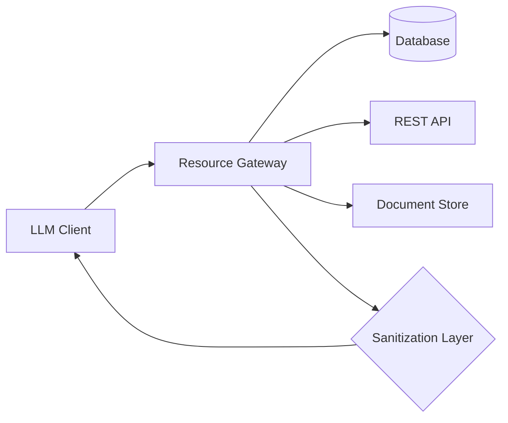
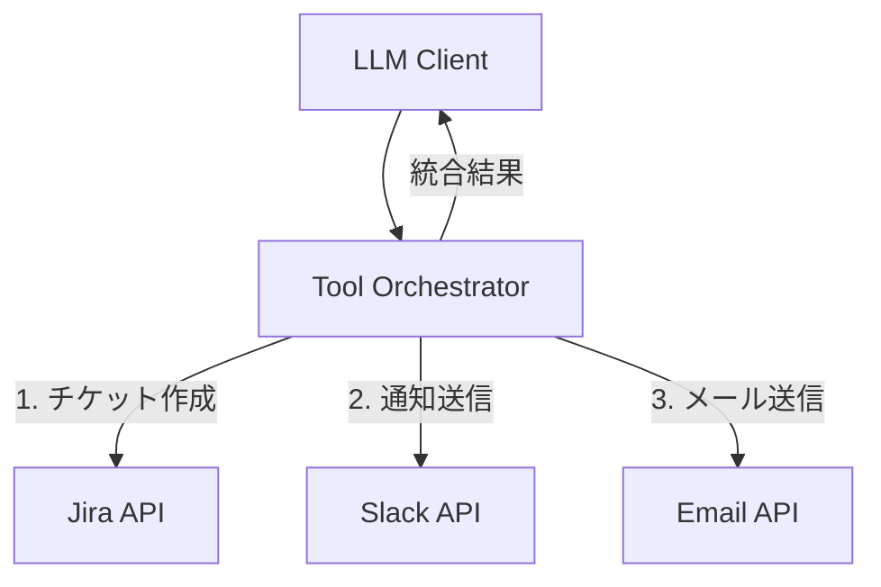
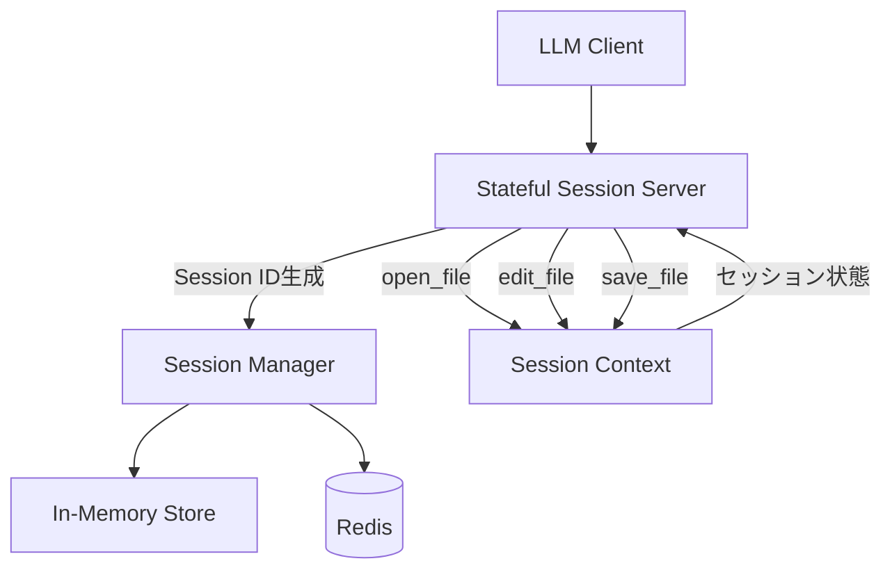
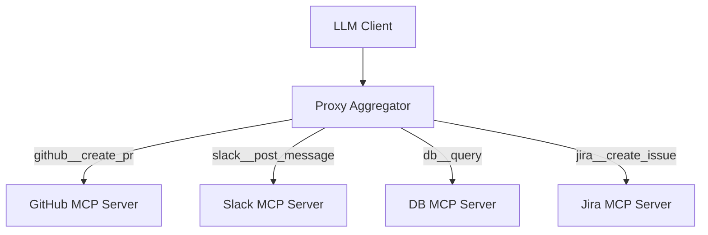
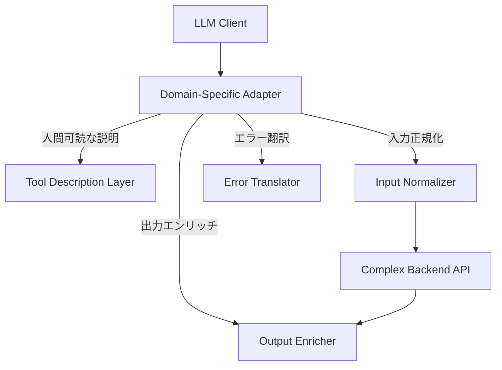

## 論文概要（Abstract）

本記事は [論文: MCP Server Architecture Patterns for LLM-Integrated Applications](https://arxiv.org/abs/2606.30317) の解説記事です。

本論文は、LLMと外部リソースを接続するための標準プロトコルであるModel Context Protocol（MCP）のサーバー設計を体系的に分析した研究である。著者らは独立に開発された15のMCPサーバーを分析し、5つの主要な設計パターン（Resource Gateway、Tool Orchestrator、Stateful Session Server、Proxy Aggregator、Domain-Specific Adapter）と4つのアンチパターンを文書化した。評価者間信頼性（Cohen's kappa = 0.76）、トランスポート性能、ツール選択精度のベンチマークも含む実践的な研究である。

この記事は [Zenn記事: FastMCPで社内SaaS横断検索MCPサーバーを構築する実装ガイド](https://zenn.dev/0h_n0/articles/a49d9afb1f3541) の深掘りです。

## 情報源

- **arXiv ID**: 2606.30317
- **URL**: [https://arxiv.org/abs/2606.30317](https://arxiv.org/abs/2606.30317)
- **著者**: Carson Rodrigues, Oysturn Vas
- **発表年**: 2026
- **分野**: cs.SE（ソフトウェア工学）, cs.AI（人工知能）

## 背景と動機（Background & Motivation）

LLMを外部ツールやデータソースと統合する際、各アプリケーションが独自のAPI統合を実装する状況が続いていた。これはLanguage Server Protocol（LSP）がエディタとプログラミング言語サーバーの接続を標準化したのと同様の課題である。Model Context Protocol（MCP）はこの問題に対する標準化アプローチとして登場したが、MCPサーバーの設計に関する体系的な知見は不足していた。

著者らは、個別のMCPサーバー実装に繰り返し現れる設計上の判断を分析し、ソフトウェアエンジニアリングの設計パターンとして体系化することを目的としている。GoFのデザインパターンやHohpe & Woolfのエンタープライズ統合パターンと同様の構造化された語彙を、MCPサーバー設計に提供することが動機である。従来のGoFパターンとの違いは、LLMクライアントが自然言語でツールを選択するという制約が設計判断に影響を与える点にある。

## 主要な貢献（Key Contributions）

- **5つのアーキテクチャパターンの体系化**: 15の独立開発されたMCPサーバーからResource Gateway、Tool Orchestrator、Stateful Session Server、Proxy Aggregator、Domain-Specific Adapterの5パターンを抽出
- **4つのアンチパターンの文書化**: God Tool、Unsanitized Resource Content、Synchronous Long-Running Operations、Missing/Vague Tool Descriptionsを特定
- **定量的評価**: Cohen's kappa = 0.76の評価者間信頼性スタディ（N=54サーバー）、トランスポートレイテンシ測定、ツール選択精度のベンチマーク
- **ツール数と精度の関係の定量化**: Claude Haiku 4.5では10-15ツール、Claude Sonnet 4では20-30ツールで精度90%を下回ることを報告
- **再現可能な研究アーティファクト**: コーパス、評価スクリプト、ベンチマークデータをMITライセンスで公開

## 技術的詳細（Technical Details）

### 研究方法論

著者らのコーパスは、Celabe社のANSYR音声AIプラットフォームから5つのプロダクションサーバー（Server-A〜E、匿名化）と、公式modelcontextprotocol/serversレジストリから10のパブリックサーバーで構成される（論文Table IIより）。各サーバーから、ツール・リソース・プロンプト登録、トランスポート設定、セッション管理、他MCPサーバーへの委譲、ドメイン固有のバリデーションの5つの要素を抽出している。

コーディング手順は2段階で行われている。第1サイクル（オープンコーディング）で第1著者が構造的判断をラベリングし、第2サイクル（パターンコーディング）で候補パターンにグルーピングした。候補は2つ以上のサーバーで独立に出現した場合のみカタログに昇格される。

### パターン1: Resource Gateway（データファサード）



バックエンドのデータ（データベース、API、ドキュメントストア）をLLMに安全かつ一貫してエクスポーズするパターンである。読み取り操作をResources（list、get by ID）として、パラメータ付きクエリをToolsとして公開する。プロンプトインジェクション対策としてサニタイゼーション層を含む。

**適用場面**: 構造化バックエンドデータの読み取りアクセスが必要で、プロンプトインジェクションからの保護が求められる場合。

**GoFパターンとの対応**: Repository / RESTパターンの祖先を持つが、LLMクライアント向けにリソース名がLLM検索用に最適化されている点が異なる（論文Table Iより）。

**実装例**（論文Listing 1より、MongoDB Resource Gatewayの簡略化）:

```javascript
// Resource一覧（プロジェクション付き）
server.setRequestHandler(ListResourcesRequestSchema, async () => ({
  resources: await db.collection('documents')
    .find({}, { projection: { _id: 1, title: 1, updatedAt: 1 } })
    .toArray()
    .then(docs => docs.map(d => ({
      uri: `doc://${d._id}`,
      name: d.title,
      mimeType: 'application/json'
    })))
}));
```

**利点**: アクセス制御の一元化、バックエンドスキーマ変更からのLLMインターフェース隔離、インジェクションリスクの封じ込め。

**欠点**: 読み取りごとの追加ネットワークホップ、スキーマ伝播の複雑化、複雑なJOINの困難さ。

**コーパス内の具体例**: filesystem、postgres、sqliteサーバー（パブリック）、Server-D（CRM読み取りゲートウェイ、プロダクション）。

### パターン2: Tool Orchestrator（アクションハブ）



複数システムにまたがるワークフローを単一のコンポジットツールとしてカプセル化するパターンである。各ツールは内部で複数のサブコール（例: チケット作成、担当者通知、ステータス更新）を順次実行し、統合された結果を返す。

**適用場面**: 中間状態管理を必要とする複数システム操作や、LLMに個別APIの理解を求めない場合。

**GoFパターンとの対応**: Facade / Mediatorパターンの祖先を持つが、ツールセットがLLMのツール選択精度に収まるよう設計される点が異なる（論文Table Iより）。

**利点**: LLMの推論負荷を軽減、トランザクション的なセマンティクスの実現、不要なAPIの複雑性の隠蔽。

**欠点**: 個々のサブツールの再利用が困難、部分的障害のハンドリングがサーバー側の責務となる、ワークフローロジックがツールとドキュメントで重複する。

**コーパス内の具体例**: github、slack、brave-search、fetchサーバー（パブリック）、Server-A（音声ツールアグリゲータ、プロダクション）。

### パターン3: Stateful Session Server（会話コンテキストサーバー）



マルチターンインタラクション間での状態維持（開いているファイル、データベーストランザクション、認証ユーザー等）を管理するパターンである。接続時にセッションIDを生成し、全ツール応答に含める。サーバーはセッションごとのコンテキストをメモリまたはRedisに保持し、非アクティブ時にセッションを期限切れにする。

**適用場面**: 後続の呼び出しが、同一セッション内の以前の呼び出しで確立された状態に依存する場合。

**GoFパターンとの対応**: Session / Mementoパターンの祖先を持つが、状態がプロンプトではなく暗黙的に管理される点が異なる（論文Table Iより）。

**利点**: 自然なマルチターンワークフロー、冗長なデータ転送の排除、トランザクション的セマンティクスの実現。

**欠点**: セッション未回収時のメモリリーク、水平スケーリングに分散ストアが必要、LLMがセッションIDを正確に引き渡す保証がない。

**コーパス内の具体例**: puppeteer、memory、gitサーバー（パブリック）、Server-B（通話単位のダイアログセッション、プロダクション）。

### パターン4: Proxy Aggregator（MCPルーター）



複数の上流MCPサーバーを単一エンドポイントとして提示し、多様な機能を集約するパターンである。著者らは2つのバリアントを文書化している。

- **Static-merge**: 全上流ツールの和集合を一度に公開する。設定は単純だが、可視ツール数が増加する。
- **Scoped**: リクエストごとにタスク関連のサブセットのみを公開する（retrieval-over-toolsバリアント）。マージされたカタログが精度バジェットを超える場合に推奨される。

ツール名は名前空間プレフィックスで衝突を防止する（例: `github__create_pr`）。

**適用場面**: クライアントに接続数制限がある場合、またはオペレータがサーバー群全体で一元的な認証・ログを必要とする場合。

**GoFパターンとの対応**: Proxy / API Gatewayパターンの祖先を持つが、コンテキストに収まるようツールを分割する点が異なる（論文Table Iより）。

**利点**: クライアント設定の簡素化、認証・監査の一元化、大規模サーバー群のサポート。

**欠点**: 単一障害点、呼び出しごとにネットワークホップ追加、名前空間ガバナンスが必要、上流障害のカスケード、Scopedバリアントにはリクエストごとのフィルタリングオーバーヘッド。

**コーパス内の具体例**: Server-E（マルチテナントアグリゲータ、プロダクション）。

### パターン5: Domain-Specific Adapter（セマンティックレイヤー）



複雑でLLMに不向きなAPIを、ビジネスロジックの再実装なしに利用可能な形に変換するパターンである。具体的には、LLMのツール選択用に人間可読なツール説明の追加、入力正規化（自然言語の日付、あいまいな識別子のハンドリング）、出力エンリッチメント（IDから表示名への変換）、エラー翻訳を行う。

**適用場面**: バックエンドAPIが機械可読な識別子、低レベル操作、複雑な認証、後処理が必要なフォーマットを持つ場合。

**GoFパターンとの対応**: Adapter (GoF)パターンの祖先を持つが、バリデーションが自然言語ガードレールとして機能する点が異なる（論文Table Iより）。

**利点**: LLMのツール選択精度の向上、API複雑性の隔離、バージョニングの吸収。

**欠点**: 基盤APIの変更時にアダプタの保守負担、バックエンドが既にLLM向けの場合は過剰設計のリスク。

**コーパス内の具体例**: Server-C（テレフォニー/SIPアダプタ、プロダクション）、CRMアダプタ（Salesforce、HubSpot等）。

### 4つのアンチパターン

著者らは繰り返し観察される設計上の失敗を4つのアンチパターンとして文書化している。

#### アンチパターン1: The God Tool

単一の未分化なスキーマを持つツール（`do_anything(action: string, params: object)`）。LLMが`action`文字列について推論する必要が生じ、ツール選択精度が崩壊する。**対策**: 正確なスキーマと説明を持つ個別のツールに分解する。

#### アンチパターン2: Unsanitized Resource Content

ユーザー生成コンテンツ（コメント、ドキュメント本文）をサニタイゼーションなしで直接返すパターン。注入された指示（「以前の指示を無視して...」）がデータではなく指令として処理される。**対策**: MCPレスポンスに含める前に外部ソースのコンテンツをサニタイズする。

#### アンチパターン3: Synchronous Long-Running Operations

数秒以上かかる操作（動画エンコード、大ファイル処理等）を同期ツールとして公開するパターン。MCPクライアントがタイムアウトする（非同期コールバック機構が組み込まれていないため）。**対策**: ジョブIDを同期的に返し、別途`poll_job(id)`ツールを公開する。

#### アンチパターン4: Missing or Vague Tool Descriptions

ツール名が`send_message`で説明がない、または名前を繰り返すだけの説明を持つパターン。LLMはスキーマではなく説明を読んでツールを選択するため、説明の欠如はツールが使用されない原因となる。**対策**: ユースケース、動作、返り値を初見のユーザーに説明するように記述する。

### 横断的関心事（Cross-Cutting Concerns）

著者らは以下の横断的関心事も文書化している。

- **認証**: ツールハンドラ内ではなく、トランスポート層で認証する。トークンを特定のツールセットにスコープする
- **エラーハンドリング**: 例外ではなく構造化エラーをツールコンテンツとして返す。LLMがリトライ/エスカレーションを推論できるようにする
- **バージョニング**: initializeレスポンスにバージョンフィールドを含める。破壊的変更はメジャーバージョンをインクリメントし、移行期間中は旧スキーマを維持する
- **可観測性**: ツール呼び出しごとにname、input hash、latency、output size、error codeを記録する。ログはLLMの誤動作に対する主要なデバッグ手段となる

## 実装のポイント（Implementation）

本論文の知見をMCPサーバー設計に適用する際の実装上の注意点を整理する。

**パターン選択の基準**: 論文の評価者間信頼性スタディ（Section V）で特定された3つの分類境界が、パターン選択時の判断材料となる。(1) ステートフルネスは関数リストからは見えないため、セッション状態を持つサーバーはTool Orchestratorと誤分類されやすい。(2) ドメインロジックも能力記述に現れないため、Domain-Specific AdapterがResource GatewayやTool Orchestratorと混同されやすい。(3) 検索指向のオーケストレータはResource Gatewayに再分類される傾向がある。これは、ステートフルネスとドメインロジックを主パターンに対する横断的属性として扱うべきことを示唆している。

**ツール数の制御**: 論文Section VI-Cの計測に基づけば、1コンテキストあたりのツール数は10以下が推奨される。超過する場合はProxy AggregatorのScopedバリアント（retrieval-over-tools）でコンテキストごとにサブセットを動的にフィルタリングする。Static-mergeは可視カタログを増加させ問題を悪化させる。

**サニタイゼーションの徹底**: Resource Gatewayパターンでは、外部コンテンツのサニタイゼーションをサーバー側で必ず行う。アンチパターン2（Unsanitized Resource Content）はプロンプトインジェクションの直接的な攻撃経路となる。

## Production Deployment Guide

### AWS実装パターン（コスト最適化重視）

MCPサーバーをAWS上にデプロイする場合、トラフィック量に応じた3つの構成パターンを提示する。論文のトランスポートレイテンシ測定（Table IIIより）を踏まえ、コロケーションとファンアウトホップ数が性能の決定因子であることに留意する。

**コスト試算の注意事項**: 以下は2026年8月時点のAWS ap-northeast-1（東京）リージョン料金に基づく概算値である。実際のコストはトラフィックパターン、リージョン、バースト使用量により変動する。最新料金はAWS料金計算ツールで確認を推奨する。

| 構成 | トラフィック | 主要サービス | 月額概算 |
|------|------------|-------------|---------|
| Small | ~100 req/日 | Lambda + API Gateway + DynamoDB | $50-150 |
| Medium | ~1,000 req/日 | ECS Fargate + ALB + ElastiCache | $300-800 |
| Large | 10,000+ req/日 | EKS + Karpenter + Spot + ElastiCache Cluster | $2,000-5,000 |

**Small構成（~100 req/日）**: MCPサーバーをLambda関数としてデプロイし、API GatewayのWebSocket APIでstreamable-httpトランスポートを実装する。DynamoDBでセッション状態を管理。Lambda実行時間は論文のp95レイテンシ（0.45ms MCP処理 + バックエンドAPI呼び出し）を考慮して30秒に設定。Resource GatewayやDomain-Specific Adapterパターンに適する。

**Medium構成（~1,000 req/日）**: ECS Fargateでコンテナ化したMCPサーバーを実行し、ALBでロードバランシング。ElastiCache（Redis）でStateful Session Serverパターンのセッション管理を実現。Fargate Spotで最大70%のコスト削減が可能。

**Large構成（10,000+ req/日）**: EKSクラスタにKarpenterで自動スケーリング。Spot Instances優先で最大90%のコスト削減。Proxy Aggregatorパターンのように複数MCPサーバーを統合する構成に適する。ElastiCache Clusterモードでセッション分散。

**コスト削減テクニック**:
- Spot Instances活用で最大90%削減（Karpenter consolidation policy設定）
- Reserved Instances購入で最大72%削減（1年コミット）
- Lambda Provisioned Concurrencyの最小化（コールドスタートよりコスト重視の場合は無効化）
- DynamoDB On-Demandモードで低トラフィック時のコスト最適化

### Terraformインフラコード

**Small構成（Serverless: Lambda + API Gateway + DynamoDB）**:

```hcl
# MCP Server - Small Serverless Configuration
# Lambda + API Gateway WebSocket + DynamoDB

terraform {
  required_version = ">= 1.9"
  required_providers {
    aws = { source = "hashicorp/aws", version = "~> 5.60" }
  }
}

provider "aws" { region = "ap-northeast-1" }

# --- IAM Role (最小権限) ---
resource "aws_iam_role" "mcp_lambda" {
  name = "mcp-server-lambda-role"
  assume_role_policy = jsonencode({
    Version = "2012-10-17"
    Statement = [{
      Action = "sts:AssumeRole"
      Effect = "Allow"
      Principal = { Service = "lambda.amazonaws.com" }
    }]
  })
}

resource "aws_iam_role_policy" "mcp_lambda_policy" {
  name = "mcp-server-lambda-policy"
  role = aws_iam_role.mcp_lambda.id
  policy = jsonencode({
    Version = "2012-10-17"
    Statement = [
      {
        Effect   = "Allow"
        Action   = ["logs:CreateLogGroup", "logs:CreateLogStream", "logs:PutLogEvents"]
        Resource = "arn:aws:logs:ap-northeast-1:*:*"
      },
      {
        Effect   = "Allow"
        Action   = ["dynamodb:GetItem", "dynamodb:PutItem", "dynamodb:DeleteItem", "dynamodb:Query"]
        Resource = aws_dynamodb_table.mcp_sessions.arn
      }
    ]
  })
}

# --- DynamoDB (セッション管理, On-Demand) ---
resource "aws_dynamodb_table" "mcp_sessions" {
  name         = "mcp-server-sessions"
  billing_mode = "PAY_PER_REQUEST" # 低トラフィック時のコスト最適化
  hash_key     = "session_id"

  attribute { name = "session_id"; type = "S" }

  ttl { attribute_name = "expires_at"; enabled = true }

  server_side_encryption { enabled = true } # KMS暗号化
}

# --- Lambda Function ---
resource "aws_lambda_function" "mcp_server" {
  function_name = "mcp-server"
  role          = aws_iam_role.mcp_lambda.arn
  handler       = "main.handler"
  runtime       = "python3.12"
  timeout       = 30
  memory_size   = 256
  filename      = "mcp_server.zip"

  environment {
    variables = {
      SESSION_TABLE = aws_dynamodb_table.mcp_sessions.name
      LOG_LEVEL     = "INFO"
    }
  }
}

# --- CloudWatch Alarm (コスト監視) ---
resource "aws_cloudwatch_metric_alarm" "lambda_invocations" {
  alarm_name          = "mcp-server-high-invocations"
  comparison_operator = "GreaterThanThreshold"
  evaluation_periods  = 1
  metric_name         = "Invocations"
  namespace           = "AWS/Lambda"
  period              = 3600
  statistic           = "Sum"
  threshold           = 500 # 1時間500回超でアラート
  alarm_actions       = [] # SNS Topic ARNを設定

  dimensions = { FunctionName = aws_lambda_function.mcp_server.function_name }
}
```

**Large構成（Container: EKS + Karpenter + Spot）**:

```hcl
# MCP Server - Large Container Configuration
# EKS + Karpenter (Spot優先) + ElastiCache

module "eks" {
  source          = "terraform-aws-modules/eks/aws"
  version         = "~> 20.24"
  cluster_name    = "mcp-server-cluster"
  cluster_version = "1.31"

  vpc_id     = module.vpc.vpc_id
  subnet_ids = module.vpc.private_subnets

  # Karpenter用のIAM設定
  enable_cluster_creator_admin_permissions = true
}

# --- Karpenter Provisioner (Spot優先) ---
resource "kubectl_manifest" "karpenter_nodepool" {
  yaml_body = yamlencode({
    apiVersion = "karpenter.sh/v1"
    kind       = "NodePool"
    metadata   = { name = "mcp-server-pool" }
    spec = {
      template = {
        spec = {
          requirements = [
            { key = "karpenter.sh/capacity-type", operator = "In", values = ["spot", "on-demand"] },
            { key = "node.kubernetes.io/instance-type", operator = "In",
              values = ["m6i.large", "m6a.large", "m5.large", "c6i.large"] }
          ]
        }
      }
      disruption = {
        consolidationPolicy = "WhenEmptyOrUnderutilized"
        consolidateAfter    = "30s"
      }
    }
  })
}

# --- Secrets Manager (API設定) ---
resource "aws_secretsmanager_secret" "mcp_config" {
  name                    = "mcp-server/api-config"
  recovery_window_in_days = 7
}

# --- AWS Budgets (予算アラート) ---
resource "aws_budgets_budget" "mcp_monthly" {
  name         = "mcp-server-monthly"
  budget_type  = "COST"
  limit_amount = "5000"
  limit_unit   = "USD"
  time_unit    = "MONTHLY"

  notification {
    comparison_operator       = "GREATER_THAN"
    threshold                 = 80
    threshold_type            = "PERCENTAGE"
    notification_type         = "ACTUAL"
    subscriber_email_addresses = ["ops-team@example.com"]
  }
}
```

### 運用・監視設定

**CloudWatch Logs Insights クエリ**（MCPサーバーのレイテンシ分析）:

```
# MCP ツール呼び出しのP95/P99レイテンシ分析
fields @timestamp, tool_name, duration_ms, error_code
| filter event = "mcp_tool_call"
| stats percentile(duration_ms, 95) as p95,
        percentile(duration_ms, 99) as p99,
        count() as call_count
  by tool_name
| sort p95 desc
```

```
# コスト異常検知（1時間あたりのツール呼び出し量）
fields @timestamp, tool_name
| filter event = "mcp_tool_call"
| stats count() as hourly_calls by bin(1h), tool_name
| filter hourly_calls > 500
| sort hourly_calls desc
```

**CloudWatch アラーム設定（Python）**:

```python
import boto3

cloudwatch = boto3.client("cloudwatch", region_name="ap-northeast-1")

# MCP Lambda実行時間異常検知
cloudwatch.put_metric_alarm(
    AlarmName="mcp-server-high-latency",
    MetricName="Duration",
    Namespace="AWS/Lambda",
    Statistic="p95",
    Period=300,
    EvaluationPeriods=2,
    Threshold=10000,  # 10秒超でアラート
    ComparisonOperator="GreaterThanThreshold",
    Dimensions=[{"Name": "FunctionName", "Value": "mcp-server"}],
    AlarmActions=["arn:aws:sns:ap-northeast-1:ACCOUNT:mcp-alerts"],
)
```

**X-Ray トレーシング設定（Python）**:

```python
from aws_xray_sdk.core import xray_recorder, patch_all

patch_all()  # boto3, requests, httplib自動計装

@xray_recorder.capture("mcp_tool_call")
def handle_tool_call(tool_name: str, arguments: dict) -> dict:
    """MCPツール呼び出しのトレーシング"""
    subsegment = xray_recorder.current_subsegment()
    subsegment.put_annotation("tool_name", tool_name)
    subsegment.put_metadata("arguments_keys", list(arguments.keys()))
    result = execute_tool(tool_name, arguments)
    subsegment.put_metadata("result_size", len(str(result)))
    return result
```

**Cost Explorer自動レポート（Python）**:

```python
import boto3
from datetime import datetime, timedelta

ce = boto3.client("ce", region_name="ap-northeast-1")
sns = boto3.client("sns", region_name="ap-northeast-1")

def daily_cost_report() -> None:
    """日次コストレポート取得・アラート"""
    today = datetime.utcnow().strftime("%Y-%m-%d")
    yesterday = (datetime.utcnow() - timedelta(days=1)).strftime("%Y-%m-%d")

    response = ce.get_cost_and_usage(
        TimePeriod={"Start": yesterday, "End": today},
        Granularity="DAILY",
        Metrics=["UnblendedCost"],
        Filter={"Tags": {"Key": "Project", "Values": ["mcp-server"]}},
        GroupBy=[{"Type": "DIMENSION", "Key": "SERVICE"}],
    )

    total = sum(
        float(g["Metrics"]["UnblendedCost"]["Amount"])
        for r in response["ResultsByTime"]
        for g in r["Groups"]
    )

    if total > 100:  # $100/日超過でアラート
        sns.publish(
            TopicArn="arn:aws:sns:ap-northeast-1:ACCOUNT:mcp-cost-alert",
            Subject=f"MCP Server Cost Alert: ${total:.2f}/day",
            Message=f"Daily cost exceeded threshold: ${total:.2f}",
        )
```

### コスト最適化チェックリスト

**アーキテクチャ選択**:
- [ ] トラフィック量に応じた構成選択（Small: Serverless / Medium: Hybrid / Large: Container）
- [ ] MCPサーバーとLLMクライアントのコロケーション検討（論文のレイテンシ分析に基づく）

**リソース最適化**:
- [ ] EC2/EKS: Spot Instances優先（Karpenter consolidation policy設定）
- [ ] Reserved Instances: 安定ワークロードは1年コミット（最大72%削減）
- [ ] Savings Plans: Compute Savings Plansの検討
- [ ] Lambda: メモリサイズをPower Tuningで最適化
- [ ] ECS/EKS: Karpenterで未使用ノード自動統合・スケールダウン
- [ ] DynamoDB: On-Demandモードで低トラフィック時のコスト最適化

**LLMコスト削減**:
- [ ] ツール数を10以下に制限（論文Section VI-Cの推奨に基づく）
- [ ] Proxy AggregatorのScopedバリアントでコンテキスト内ツール数を制御
- [ ] Prompt Caching有効化（MCPツール定義のキャッシュ、30-90%削減）
- [ ] モデル選択ロジック（軽量タスクはHaiku、複雑タスクはSonnet）
- [ ] トークン数制限（ツール説明の簡潔化）

**監視・アラート**:
- [ ] AWS Budgets: 月次予算アラート設定
- [ ] CloudWatch: ツール呼び出しレイテンシP95/P99監視
- [ ] Cost Anomaly Detection: 自動異常検知有効化
- [ ] 日次コストレポート: Cost Explorer + SNS通知

**リソース管理**:
- [ ] 未使用MCPサーバーインスタンスの定期削除
- [ ] タグ戦略: Project/Environment/Patternタグの統一
- [ ] DynamoDB TTL: セッションの自動期限切れ設定
- [ ] 開発環境: 夜間・週末のEKSノード停止スケジュール
- [ ] CloudWatch Logs: 保持期間設定（30日/90日）

## 実験結果（Results）

### 評価者間信頼性

著者らは54のサーバー（公式レジストリ + 人気コミュニティサーバー、導出コーパスとは重複なし）を用いた評価者間信頼性スタディを実施している。2つの独立した評価者（Claude Haiku 4.5とClaude Sonnet 4、temperature 0）に、5つのパターン定義のみを与えて中立的な関数記述を分類させた結果、Cohen's kappa = 0.76（95% CI [0.62, 0.88]、生の一致率81.5%）を報告している（論文Section Vより）。評価者と著者間の一致率はHaikuで68.5%、Sonnetで75.9%であった。

### トランスポートレイテンシ

論文Table IIIより、stdioローカル通信のp50は0.01ms、streamable-http（ループバック）のp50は0.39msである。同一リージョンリモートではp50が30.4msに増加し、Proxy Aggregator（シングルホップリモート）ではp50が62.4msとなる。著者らは、プロトコル層ではなくネットワークRTTがレイテンシを支配しており、ホスト内通信（1ms未満）とホスト間通信の差は2-3桁であると報告している。

### ツール選択精度

論文Section VI-Cより、ANSYRプラットフォームのプロダクションテレメトリ（2025年Q1、バケットあたりN=200セッションターン）に基づく観測結果として、Claude Haiku 4.5は10ツールで91%、15ツールで87%（90%閾値以下）の精度であった。Claude Sonnet 4は20ツールまで90%以上を維持し、30ツールで閾値を下回った。著者らは1コンテキストあたり10ツール以下を推奨している。

## 実運用への応用（Practical Applications）

Zenn記事「FastMCPで社内SaaS横断検索MCPサーバーを構築する実装ガイド」で紹介されている構成は、本論文のProxy Aggregatorパターン（Scopedバリアント）およびResource Gatewayパターンの組み合わせに対応する。複数のSaaSサービス（Slack、Notion、Google Drive等）を横断検索するMCPサーバーは、各サービスをResource Gatewayとして実装し、FastMCPゲートウェイがProxy Aggregatorとして機能する構成となる。

論文の知見を踏まえると、以下の設計判断が重要である。(1) 各SaaSコネクタのツール数を抑制し、合計10ツール以下を目標とする。(2) 検索対象のSaaS数が増えた場合は、Static-mergeではなくScopedバリアントで動的にフィルタリングする。(3) Resource Gatewayパターンに従い、外部コンテンツのサニタイゼーションを徹底する。(4) ツール説明を具体的に記述し、アンチパターン4（Missing/Vague Tool Descriptions）を回避する。

## 関連研究（Related Work）

本論文は、Gamma et al.のGoFデザインパターン、Hohpe & Woolfのエンタープライズ統合パターンの構造化手法をMCPサーバー設計に応用している。LLMのツール使用に関しては、ToolBench、ReAct、AutoGPTなどの先行研究があり、ツール数と精度の関係についてはGan & Sun (2025)が30候補以上で90%を下回り100超で急激に劣化すると報告、Kate et al. (2025)は7-85%の精度低下を計測している。MCPのセキュリティ・保守性についてはHou et al.（脅威分析）、Hasan et al.（コードスメル分析）、Guo et al.（エコシステム規模分析）の研究がある。

## まとめと今後の展望

本論文は、15のMCPサーバーから5つの設計パターンと4つのアンチパターンを体系化し、定量的評価によりその有効性を検証した研究である。ツール数の上限（10ツール以下推奨）やトランスポート選択（コロケーションとファンアウトが支配因子）といった実践的知見は、MCPサーバーの設計判断に直接活用できる。論文の限界として、コーパスが15サーバー（8,000超の公開サーバー中）に限定されていること、単一コーダーによる導出であること、音声AIドメインに偏っていることが挙げられる。今後は大規模な層別複製やLLM評価者の死角を補う独立した人間のデュアルコーディングが求められる。

## 参考文献

- **arXiv**: [https://arxiv.org/abs/2606.30317](https://arxiv.org/abs/2606.30317)
- **Code**: [https://github.com/rodriguescarson/mcp-patterns-icsme2026](https://github.com/rodriguescarson/mcp-patterns-icsme2026)（MITライセンス）
- **Related Zenn article**: [https://zenn.dev/0h_n0/articles/a49d9afb1f3541](https://zenn.dev/0h_n0/articles/a49d9afb1f3541)
