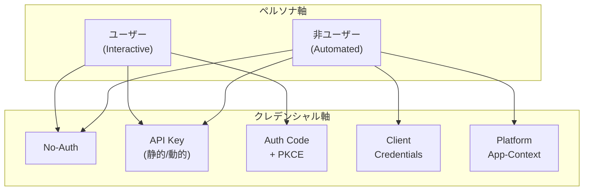
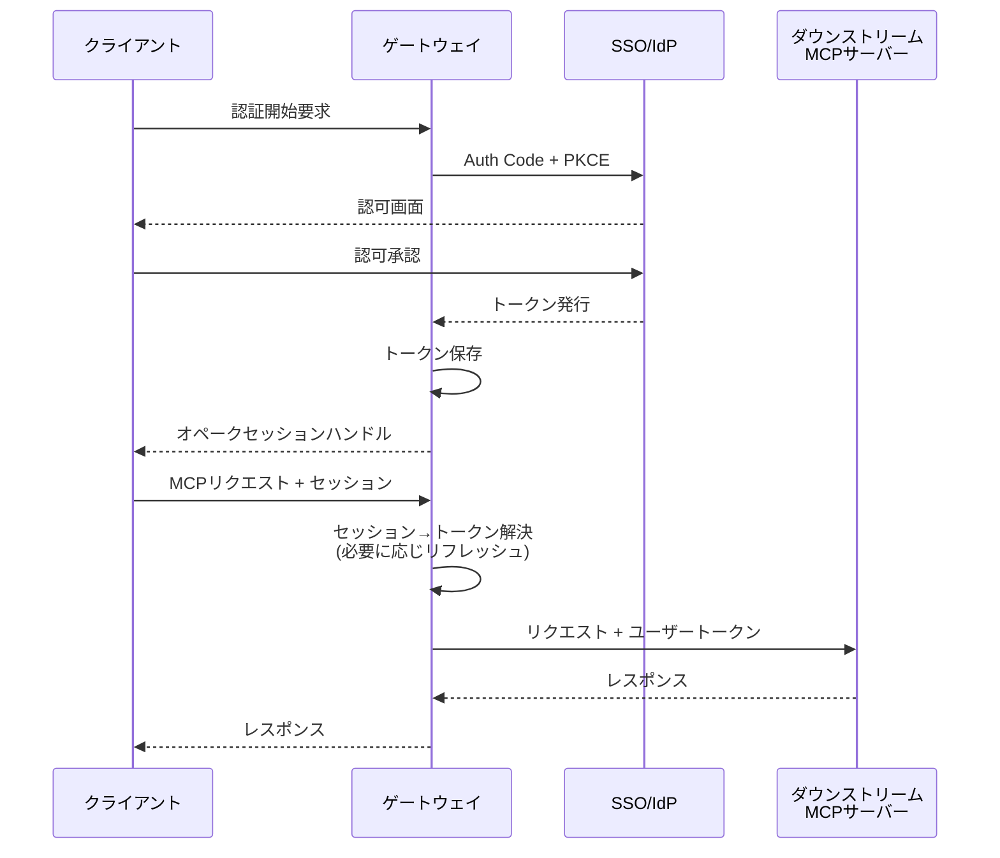
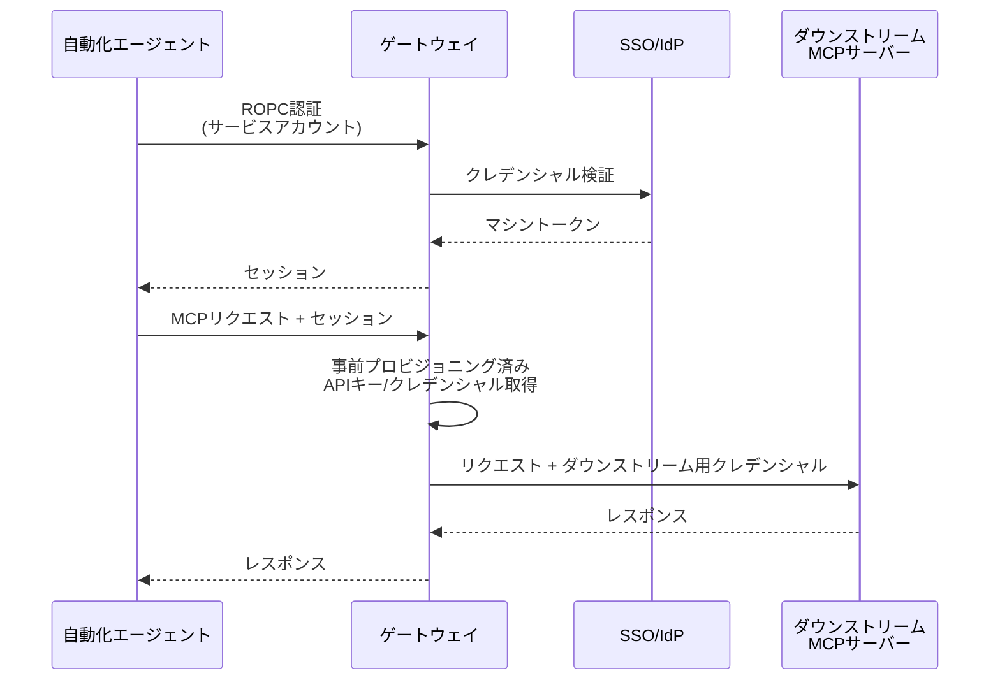
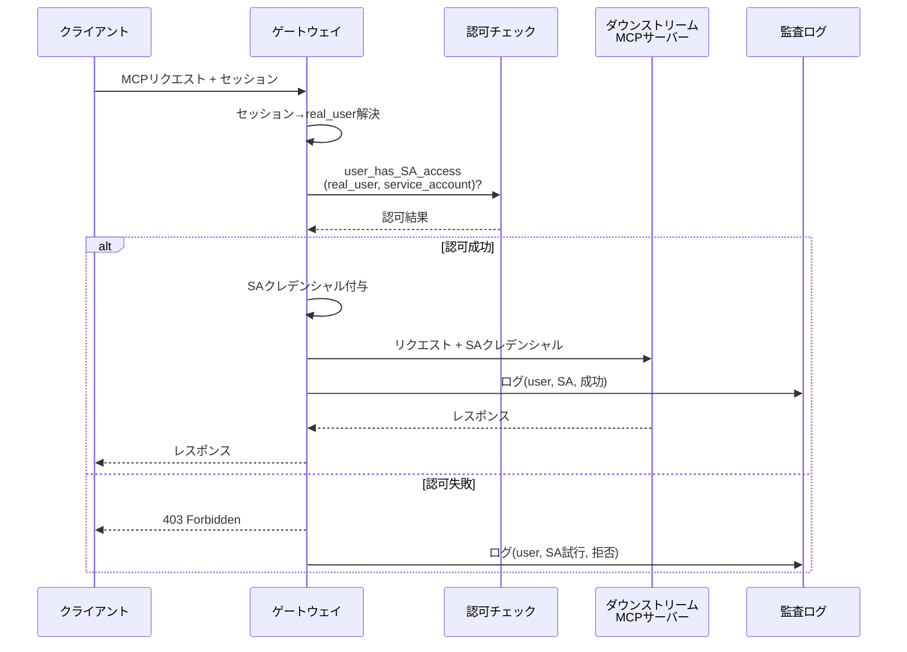
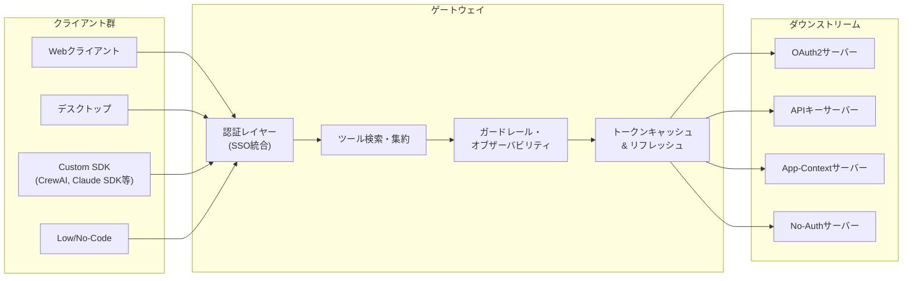

本記事は [論文: A Gateway Architecture for Enterprise MCP Authentication](https://arxiv.org/abs/2608.10760) の解説記事です。

## 論文概要

Model Context Protocol（MCP）の企業導入が急速に進む中、認証・認可の断片化がガバナンス上の課題となっている。著者らは、全てのダウンストリームMCPサーバーの前段に配置する集中型ゲートウェイアーキテクチャを提案している。このゲートウェイは「ペルソナ（対話的ユーザー vs 自動化エージェント）」と「クレデンシャル種別」の2軸認証モデルを基盤とし、3つのエンタープライズSSOグラント、3つのトークン供給モデル（BYOT/GYOT/RFC 8693委任OAuth）、そして3つのEnd-to-Endアイデンティティフロー（User-to-OAuth2、Non-user-to-Service-Account、User-to-Service-Account）を統一的に扱う。本番環境において数十のMCPサーバーを単一ゲートウェイで保護した運用実績に基づく設計知見が報告されている。

## この記事について

この記事は [Zenn記事: FastMCPで社内SaaS横断検索MCPサーバーを構築する実装ガイド](https://zenn.dev/0h_n0/articles/a49d9afb1f3541) の深掘りです。Zenn記事ではFastMCPの`mount`や`create_proxy`を用いた複数SaaS統合パターンを解説しているが、本論文はその統合レイヤーにおける認証・認可の標準化アーキテクチャを提供している。

## 情報源

| 項目 | 内容 |
|------|------|
| タイトル | A Gateway Architecture for Enterprise MCP Authentication: Unifying Heterogeneous Auth, Identity Delegation, and the User / Non-User Persona Problem |
| 著者 | Suraj Kumar, Amy Wang, Srinivasan Manoharan |
| arXiv ID | 2608.10760 |
| 投稿日 | 2026年8月11日 |
| 分野 | cs.CR（暗号とセキュリティ）, cs.AI（人工知能） |

## 背景と動機

MCPの企業導入は急速に進んでいるが、認証に関する統一的な標準が欠如している。著者らは、この状況を「fragmented authentication landscape with no consistent way to authorize callers, track actions, or offboard employees（断片化された認証環境で、呼び出し元の認可、行動の追跡、従業員のオフボーディングに一貫した方法がない）」と表現している。

具体的には以下の4つの課題が指摘されている。

1. **認可の断片化**: MCPサーバーごとに異なる認証方式（OAuth2、APIキー、独自トークン等）が混在し、統一的なポリシー適用ができない
2. **統一監査の欠如**: サーバーごとにログ形式・粒度が異なり、横断的な監査証跡を構築できない
3. **オフボーディングの煩雑さ**: 従業員の退職時に、各MCPサーバーチームに個別に連絡してアクセス権を剥奪する必要がある
4. **Confused Deputy問題**: ヘッドレスエージェントが人間のユーザーになりすまして権限昇格を行うリスクがある

著者らは、技術的な困難さよりも組織的な課題が大きいと述べている。OAuthの標準は成熟しており実装も安定しているが、チーム間でゲートウェイへの集約を合意し、SSO上でトークン交換を有効化し、ユーザーと非ユーザーの境界を定義することが真の難題であったと報告している。

## 主要な貢献

著者らが報告している本論文の貢献は以下の4点である。

1. **2軸認証モデル（Two-Axis Authentication Model）**: ペルソナ（ユーザー/非ユーザー）とクレデンシャル種別を直交する2軸として定式化し、各MCPサーバーが要求する認証方式を体系的に分類する枠組みを提示
2. **ゲートウェイ認証レイヤー**: 3つのSSOグラントと3つのトークン供給モデルを単一のゲートウェイで統合し、ダウンストリームサーバーをトークン検証のみに単純化するアーキテクチャを設計
3. **3つのEnd-to-Endアイデンティティフロー**: User-to-OAuth2、Non-user-to-Service-Account、User-to-Service-Accountの3パターンを定義し、特にUser-to-Service-Accountにおける権限昇格防止メカニズムを明確化
4. **本番環境での運用知見**: 数十のMCPサーバーを保護するゲートウェイの設計進化（CDN/WAF/エッジからプライベートトンネルへの移行）に基づく実践的な設計指針の提示

## 技術的詳細

### 2軸認証モデル

著者らは、MCPにおける認証を「ペルソナ」と「クレデンシャル種別」の2軸で分類するモデルを提案している。

**ペルソナ軸**:
- **ユーザーペルソナ（Interactive/Human-driven）**: 対話的にブラウザや端末を操作する人間。利用可能なクレデンシャルは、No-auth、静的/動的APIキー、Authorization Code + PKCE（静的/動的クライアント）
- **非ユーザーペルソナ（Automated/Headless）**: 夜間バッチ処理、定期データ収集、無人ワークフローなど自動化されたエージェント。利用可能なクレデンシャルは、No-auth、静的/動的APIキー、Client Credentials、プラットフォームApp-Context

この分類における重要なセキュリティ境界として、著者らは「Authorization Code + PKCEはユーザーにのみ利用可能で非ユーザーには利用不可、Client Credentialsとプラットフォームapp-contextは非ユーザーにのみ利用可能でユーザーのアイデンティティを持たない」と規定している。単一のMCPエンドポイントが両ペルソナを同時に提供し、トークンの内容によってどちらのペルソナが適用されるかが決定される。



### 3つのエンタープライズSSOグラント

ゲートウェイが対応するSSOグラントは以下の3種類である。

1. **Authorization Code + PKCE**: ブラウザを持つ対話的ユーザー向け。Web/デスクトップクライアントからの標準的なOAuthフロー。PKCE（RFC 7636）による保護が必須
2. **Device Code**: 入力が制限された環境（ヘッドレス開発マシン等）の対話的ユーザー向け。ユーザーは別デバイスで認可を行い、元のマシンがトークンをポーリングする
3. **Resource Owner Password Credentials（ROPC）**: 非ユーザーペルソナがサービスアカウントのクレデンシャルを直接提示する方式。マシンアイデンティティに限定され、対話的な人間には使用されない

### 3つのトークン供給モデル

著者らは、クライアントがダウンストリームサーバーへのアクセストークンを取得する方法として、以下の3モデルを定義している。

**BYOT（Bring Your Own Token）**: クライアントが既に有効なSSOトークンを保持しており、それをそのまま提示する方式。ゲートウェイはイントロスペクション（RFC 7662）でトークンを検証して使用する。SSO統合済みクライアントにとって最も低摩擦なモデルである。

**GYOT（Generate Your Own Token）**: クライアントがゲートウェイにグラント開始（例: Device Codeフロー）を要求し、ゲートウェイが結果のトークンを返す方式。OAuthの実装を避けたいがフローの駆動は可能なクライアントに適している。

**Full Delegated OAuth（RFC 8693）**: エージェントがユーザーの代理で動作するシナリオ向け。エージェントがユーザースコープのトークン（AT1）をゲートウェイスコープのトークン（AT2）に交換し、SSOが`act`（アクター）クレイムを注入する。これにより、ユーザーとエージェント両方のアイデンティティが単一の署名付きトークンに含まれる。

著者らは静的クライアントの特殊ケースとして、ダウンストリームトークンを取得する2つのパスを示している。パス1はブラウザを介した直接交換、パス2はRFC 8693トークン交換による既存SSOトークンの再利用であり、後者は冗長な同意画面を排除できると報告している。

### 3つのEnd-to-Endアイデンティティフロー

#### フロー1: User-to-OAuth2

対話的ユーザーがOAuth2で認証するフローである。



ゲートウェイはトークンを内部に保存し、クライアントにはオペークなセッションハンドルのみを返す。以降のリクエストではセッションハンドルを提示し、ゲートウェイが内部でトークンへのマッピングとリフレッシュを行う。トークン構造は`"sub": "user@corp.com"`, `"act": null`（委任なし）である。

#### フロー2: Non-user-to-Service-Account

自動化エージェントがサービスアカウントで認証するフローである。



ダウンストリームのAPIキーはサーバーオンボーディング時にゲートウェイへ帯域外（out-of-band）でプロビジョニングされる。クライアントにはダウンストリームのシークレットが一切渡らないため、シークレットの漏洩リスクが軽減される。

#### フロー3: User-to-Service-Account（最重要フロー）

著者らがこの論文で最もセキュリティ上重要と位置づけているフローである。人間のユーザーが対話的に認証した後、ダウンストリームへはサービスアカウントのクレデンシャルでアクセスするパターンである。



著者らは、このフローが「most naive designs fail（素朴な設計が最も失敗しやすい箇所）」であると指摘している。重要なのは、セッションからユーザーを解決した**後**、サービスアカウントのクレデンシャルを付与する**前**に、明示的なエンタイトルメントチェック（`user_has_SA_access`）を実行する点である。この認可チェックがなければ、任意のユーザーがサービスアカウントの権限を不正に利用するConfused Deputy攻撃が成立する。

認可ゲートのロジックは以下の通りである。

```python
def authorize_user_to_sa(session: str, target_sa: str) -> bool:
    """User-to-SA フローの認可ゲート

    Args:
        session: ユーザーのセッションハンドル
        target_sa: 使用を要求するサービスアカウント

    Returns:
        認可結果
    """
    # Step 1: セッションからユーザーを解決
    real_user = resolve_session(session)

    # Step 2: 明示的な権限チェック
    if not user_has_sa_access(real_user, target_sa):
        audit_log(user=real_user, sa=target_sa, action="denied")
        raise PermissionError("403: User not entitled to SA")

    # Step 3: クレデンシャル付与と監査
    credential = attach_sa_credential(target_sa)
    audit_log(user=real_user, sa=target_sa, action="granted")
    return credential
```

#### RFC 8693によるアイデンティティ委任拡張

エージェントがユーザーの代理で動作するシナリオでは、RFC 8693トークン交換が用いられる。エージェントがユーザースコープのトークン（AT1）を取得し、ゲートウェイスコープのトークン（AT2）に交換する。SSOは`act`クレイムを注入し、結果として以下のようなJWTが生成される。

```json
{
  "sub": "user@corp.com",
  "act": {
    "sub": "agent-prod"
  },
  "aud": "mcp-gateway",
  "exp": 1723968000
}
```

著者らは、subject-tokenの検証時にAT1のaudience（エージェントのclient ID）をチェックする必要があり、ゲートウェイのaudienceと混同してはならないと注意を促している。

### ゲートウェイアーキテクチャの構成

ゲートウェイは以下のコンポーネントで構成される。



設計上の重要な責務分離として、「ゲートウェイが認証し、ダウンストリームサーバーが検証する」という原則が採用されている。ダウンストリームサーバーはOAuthを実装せず、共有SDKを通じてゲートウェイ発行トークンの署名・audience・有効期限・イントロスペクションを検証するのみである。

4種類のクライアントカテゴリが定義されている。

| クライアント種別 | ペルソナ | 主な認証方式 | 例 |
|:---|:---|:---|:---|
| Webクライアント | ユーザーのみ | Auth Code + PKCE | ブラウザAIチャット |
| デスクトップ | ユーザーのみ | Auth Code + PKCE | ネイティブアプリ |
| Custom SDK | 両方 | PKCE / Client Creds | CrewAI, Claude SDK, LangChain |
| Low/No-Code | 両方 | PKCE / Client Creds | ワークフロービルダー |

### セキュリティ分析

著者らは、以下のセキュリティ対策をゲートウェイアーキテクチャの利点として報告している。

- **非対称クレデンシャル利用制約**: Authorization Codeはユーザー限定、Client Credentialsは非ユーザー限定とすることで、認証メカニズムの混用を構造的に防止
- **Confused Deputy防止**: フロー3のエンタイトルメントチェックにより、人間ユーザーがサービスアカウント権限を不正利用するリスクを排除
- **統一監査**: 全リクエストがゲートウェイを通過するため、一貫したログ形式で監査証跡を構築可能
- **集中型失効・オフボーディング**: ゲートウェイ側でアクセスを一括無効化できるため、サーバーごとの個別対応が不要

### デプロイメント進化

著者らは、ゲートウェイのデプロイメントが以下の段階を経て進化したと報告している。

- **ステージ0**: ユーザーフローのみ（対話的OAuth）で初期デプロイ
- **ステージ1**: 夜間ダイジェスト、バッチエンリッチメント等の非ユーザー需要が発生し、2ペルソナモデルが必要に
- **ステージ2**: ダウンストリームシステム間のクレデンシャル異種性への対応。認証をゲートウェイに集約し、サーバーをトークン検証のみに単純化
- **ステージ3**: エージェンティッククライアントによるアイデンティティ委任要求への対応。RFC 8693を採用して両アイデンティティを単一トークンに格納

境界防御も進化しており、初期のCDN + WAF + ベンダーごとのIPアローリストから、プライベートMCPトンネルへ移行している。トンネルではクライアントがゲートウェイへのアウトバウンド接続を確立し、パブリックイングレスを排除する。トンネルがトランスポートを保護し、リクエストごとのトークン検証が認可を保護するという二層構造である。

## 実装のポイント

### ゲートウェイ実装パターン

ゲートウェイ実装における重要なポイントは以下の通りである。

**トークンキャッシュとリフレッシュ**: ゲートウェイはユーザーのOAuth2トークンを内部に保存し、セッションハンドルとのマッピングを管理する。トークンの有効期限が切れた場合はサイレントリフレッシュを行い、クライアントに再認証を求めない設計とする。

**ダウンストリームクレデンシャルの帯域外プロビジョニング**: フロー2において、ダウンストリームのAPIキーはサーバーオンボーディング時にゲートウェイへ事前登録される。このシークレットはクライアントに一切露出しない。

**RFC 8693トークン交換の設定**: subject-tokenの検証においてaudienceの設定を誤ると、正当なトークン交換が拒否される。AT1のaudienceはエージェントのclient IDであり、ゲートウェイのaudienceではない点に注意が必要である。

**共有SDK**: ダウンストリームサーバーが利用する共有SDKは、署名検証、audience検証、有効期限チェック、イントロスペクションの4つの検証を行う。サーバー側はOAuthの実装を一切持たず、このSDKのみに依存する。

```python
from dataclasses import dataclass
from typing import Optional


@dataclass
class GatewayToken:
    """ゲートウェイ発行トークンの構造"""

    sub: str           # 主体（ユーザーまたはサービスアカウント）
    act: Optional[str] # アクター（委任時のエージェントID）
    aud: str           # 対象audience
    exp: int           # 有効期限（Unix timestamp）
    scopes: list[str]  # 許可スコープ


def verify_gateway_token(
    token: str,
    expected_audience: str,
    jwks_uri: str,
) -> GatewayToken:
    """ダウンストリームサーバーでのトークン検証

    Args:
        token: ゲートウェイ発行JWT
        expected_audience: 期待するaudience値
        jwks_uri: JWKS公開鍵エンドポイント

    Returns:
        検証済みトークン情報

    Raises:
        TokenValidationError: 検証失敗時
    """
    # 1. 署名検証（JWKS公開鍵で検証）
    decoded = verify_signature(token, jwks_uri)

    # 2. Audience検証
    if decoded.aud != expected_audience:
        raise TokenValidationError("Audience mismatch")

    # 3. 有効期限チェック
    if decoded.exp < current_timestamp():
        raise TokenValidationError("Token expired")

    # 4. イントロスペクション（必要に応じ）
    if not introspect(token):
        raise TokenValidationError("Token revoked")

    return decoded
```

### エンタープライズコネクタ

著者らは、ゲートウェイの認証集約により「エンタープライズワイドコネクタ」が実現可能になったと報告している。単一のWebコネクタとデスクトップコネクタを組織全体に配布すれば、従業員は企業SSOでログインするだけで、ゲートウェイ配下の全MCPサーバーへのアクセスが可能になる。サーバーごとの個別セットアップが不要になるため、導入コストが大幅に低減される。

## Production Deployment Guide

本論文はゲートウェイアーキテクチャの実装パターンを詳細に記述しており、AWS上でのMCP認証ゲートウェイ構築に応用可能である。以下に、論文のアーキテクチャに基づくAWSデプロイメントパターンを示す。

### AWS実装パターン（コスト最適化重視）

論文のゲートウェイは認証レイヤー、トークンキャッシュ、ツール集約、ガードレールで構成される。これをAWSサービスにマッピングすると以下の構成となる。

| 構成 | トラフィック | AWSサービス | 月額概算 |
|:---|:---|:---|:---|
| Small (~100 req/日) | 少数のMCPサーバー | API Gateway + Lambda + Cognito + DynamoDB | $50-150 |
| Medium (~1000 req/日) | 数十のMCPサーバー | ALB + ECS Fargate + Cognito + ElastiCache | $300-800 |
| Large (10000+ req/日) | 大規模エンタープライズ | NLB + EKS + Cognito + ElastiCache + Secrets Manager | $2,000-5,000 |

**Small構成の内訳**:
- API Gateway: REST APIとしてMCPリクエストを受信（$3.50/100万リクエスト）
- Lambda: 認証ロジック、トークン検証、ダウンストリームルーティング（$0.20/100万リクエスト、128MB設定）
- Cognito: ユーザープール + OAuth2/PKCE対応（MAU 50,000まで無料）
- DynamoDB: セッション-トークンマッピング、ダウンストリームクレデンシャル保存（On-Demand、$1.25/WCU 100万）

**Large構成の内訳**:
- EKS: コントロールプレーン $72/月 + Karpenter による Spot ノード管理
- ElastiCache（Redis）: トークンキャッシュ・セッション管理（cache.t3.medium $50/月）
- Secrets Manager: ダウンストリームAPIキーの安全な保存（$0.40/シークレット/月）
- CloudWatch: 統一監査ログ・メトリクス

**コスト削減テクニック**:
- Spot Instancesを EKS ワーカーノードに活用し最大90%削減
- Cognito無料枠（MAU 50,000）の活用
- DynamoDB On-Demandモードでアイドル時コスト最小化
- Lambda ARM64（Graviton2）で20%コスト削減

注: 上記は2026年8月時点のAWS ap-northeast-1（東京）リージョン料金に基づく概算値である。実際のコストはトラフィックパターン、リージョン、バースト使用量により変動する。最新料金はAWS料金計算ツールでの確認を推奨する。

### Terraformインフラコード

**Small構成（Serverless: API Gateway + Lambda + Cognito + DynamoDB）**:

```hcl
# MCP認証ゲートウェイ - Small構成
# API Gateway + Lambda + Cognito + DynamoDB

terraform {
  required_version = ">= 1.9"
  required_providers {
    aws = { source = "hashicorp/aws", version = "~> 5.60" }
  }
}

provider "aws" {
  region = "ap-northeast-1"
}

# --- Cognito (OAuth2/PKCE対応) ---
resource "aws_cognito_user_pool" "mcp_gateway" {
  name = "mcp-gateway-users"
  password_policy {
    minimum_length    = 12
    require_uppercase = true
    require_numbers   = true
    require_symbols   = true
  }
  mfa_configuration = "ON"
  software_token_mfa_configuration {
    enabled = true
  }
}

resource "aws_cognito_user_pool_client" "mcp_client" {
  name                                 = "mcp-gateway-client"
  user_pool_id                         = aws_cognito_user_pool.mcp_gateway.id
  generate_secret                      = false # PKCE対応（パブリッククライアント）
  allowed_oauth_flows                  = ["code"]
  allowed_oauth_scopes                 = ["openid", "profile"]
  allowed_oauth_flows_user_pool_client = true
  supported_identity_providers         = ["COGNITO"]
  explicit_auth_flows                  = ["ALLOW_USER_SRP_AUTH", "ALLOW_REFRESH_TOKEN_AUTH"]
}

# --- DynamoDB (セッション・クレデンシャル管理) ---
resource "aws_dynamodb_table" "sessions" {
  name         = "mcp-gateway-sessions"
  billing_mode = "PAY_PER_REQUEST" # On-Demand: アイドル時コスト最小化
  hash_key     = "session_id"

  attribute {
    name = "session_id"
    type = "S"
  }
  ttl {
    attribute_name = "expires_at"
    enabled        = true
  }
  server_side_encryption {
    enabled = true # KMS暗号化
  }
}

# --- Lambda (認証ゲートウェイ処理) ---
resource "aws_lambda_function" "gateway" {
  function_name = "mcp-auth-gateway"
  runtime       = "python3.12"
  handler       = "handler.lambda_handler"
  architectures = ["arm64"] # Graviton2: 20%コスト削減
  memory_size   = 256
  timeout       = 30
  filename      = "lambda.zip"
  role          = aws_iam_role.lambda_role.arn
  environment {
    variables = {
      COGNITO_USER_POOL_ID = aws_cognito_user_pool.mcp_gateway.id
      SESSION_TABLE        = aws_dynamodb_table.sessions.name
    }
  }
  tracing_config {
    mode = "Active" # X-Ray有効化
  }
}

# --- IAM (最小権限) ---
resource "aws_iam_role" "lambda_role" {
  name = "mcp-gateway-lambda-role"
  assume_role_policy = jsonencode({
    Version = "2012-10-17"
    Statement = [{
      Action = "sts:AssumeRole"
      Effect = "Allow"
      Principal = { Service = "lambda.amazonaws.com" }
    }]
  })
}

resource "aws_iam_role_policy" "lambda_policy" {
  name = "mcp-gateway-lambda-policy"
  role = aws_iam_role.lambda_role.id
  policy = jsonencode({
    Version = "2012-10-17"
    Statement = [
      {
        Effect   = "Allow"
        Action   = ["dynamodb:GetItem", "dynamodb:PutItem", "dynamodb:DeleteItem"]
        Resource = aws_dynamodb_table.sessions.arn
      },
      {
        Effect   = "Allow"
        Action   = ["cognito-idp:AdminGetUser", "cognito-idp:AdminInitiateAuth"]
        Resource = aws_cognito_user_pool.mcp_gateway.arn
      },
      {
        Effect   = "Allow"
        Action   = ["logs:CreateLogGroup", "logs:CreateLogStream", "logs:PutLogEvents"]
        Resource = "arn:aws:logs:*:*:*"
      }
    ]
  })
}

# --- CloudWatch アラーム (コスト監視) ---
resource "aws_cloudwatch_metric_alarm" "lambda_errors" {
  alarm_name          = "mcp-gateway-lambda-errors"
  comparison_operator = "GreaterThanThreshold"
  evaluation_periods  = 2
  metric_name         = "Errors"
  namespace           = "AWS/Lambda"
  period              = 300
  statistic           = "Sum"
  threshold           = 10
  dimensions = {
    FunctionName = aws_lambda_function.gateway.function_name
  }
}
```

**Large構成（Container: EKS + Karpenter + Spot）**:

```hcl
# MCP認証ゲートウェイ - Large構成
# EKS + Karpenter + Spot Instances

module "eks" {
  source  = "terraform-aws-modules/eks/aws"
  version = "~> 20.24"

  cluster_name    = "mcp-gateway-cluster"
  cluster_version = "1.31"

  vpc_id     = module.vpc.vpc_id
  subnet_ids = module.vpc.private_subnets

  cluster_endpoint_public_access = false # プライベートエンドポイントのみ
}

# --- Karpenter (Spot優先オートスケーリング) ---
resource "kubectl_manifest" "karpenter_nodepool" {
  yaml_body = <<-YAML
    apiVersion: karpenter.sh/v1
    kind: NodePool
    metadata:
      name: mcp-gateway-pool
    spec:
      template:
        spec:
          requirements:
            - key: karpenter.sh/capacity-type
              operator: In
              values: ["spot", "on-demand"]  # Spot優先
            - key: node.kubernetes.io/instance-type
              operator: In
              values: ["m7g.medium", "m7g.large", "c7g.medium"]  # Graviton
          nodeClassRef:
            group: karpenter.k8s.aws
            kind: EC2NodeClass
            name: default
      limits:
        cpu: "100"
      disruption:
        consolidationPolicy: WhenEmptyOrUnderutilized
        consolidateAfter: 60s
  YAML
}

# --- Secrets Manager (ダウンストリームAPIキー) ---
resource "aws_secretsmanager_secret" "downstream_keys" {
  name       = "mcp-gateway/downstream-api-keys"
  kms_key_id = aws_kms_key.gateway.arn
}

# --- AWS Budgets (予算アラート) ---
resource "aws_budgets_budget" "monthly" {
  name         = "mcp-gateway-monthly"
  budget_type  = "COST"
  limit_amount = "5000"
  limit_unit   = "USD"
  time_unit    = "MONTHLY"

  notification {
    comparison_operator       = "GREATER_THAN"
    threshold                 = 80
    threshold_type            = "PERCENTAGE"
    notification_type         = "ACTUAL"
    subscriber_email_addresses = ["ops-team@example.com"]
  }
}
```

### 運用・監視設定

**CloudWatch Logs Insights: 認証異常検知**:

```
# 1時間あたりの認証失敗を検知
fields @timestamp, @message
| filter @message like /401|403|TokenValidationError/
| stats count(*) as auth_failures by bin(1h)
| filter auth_failures > 50
| sort @timestamp desc
```

**CloudWatch Logs Insights: フロー別レイテンシ分析**:

```
# 認証フロー別のP95/P99レイテンシ
fields @timestamp, identity_flow, duration_ms
| stats percentile(duration_ms, 95) as p95,
        percentile(duration_ms, 99) as p99,
        avg(duration_ms) as avg_ms
  by identity_flow
| sort p99 desc
```

**CloudWatch アラーム設定（Python）**:

```python
import boto3

cloudwatch = boto3.client("cloudwatch", region_name="ap-northeast-1")

# 認証失敗スパイク検知
cloudwatch.put_metric_alarm(
    AlarmName="mcp-gateway-auth-failure-spike",
    MetricName="AuthFailures",
    Namespace="MCPGateway",
    Statistic="Sum",
    Period=300,
    EvaluationPeriods=2,
    Threshold=100,
    ComparisonOperator="GreaterThanThreshold",
    AlarmActions=["arn:aws:sns:ap-northeast-1:123456789:ops-alerts"],
)
```

**X-Ray トレーシング設定（Python）**:

```python
from aws_xray_sdk.core import xray_recorder, patch_all

patch_all()  # boto3/requests等を自動計装

@xray_recorder.capture("mcp_auth_flow")
def handle_mcp_request(session: str, mcp_payload: dict) -> dict:
    """MCPリクエスト処理にX-Rayトレーシングを付与"""
    subsegment = xray_recorder.current_subsegment()
    subsegment.put_annotation("identity_flow", "user_to_oauth2")
    subsegment.put_metadata("session_id", session, "mcp_gateway")
    # ... 認証・ルーティング処理
    return response
```

**Cost Explorer日次レポート（Python）**:

```python
import boto3
from datetime import date, timedelta

ce = boto3.client("ce", region_name="ap-northeast-1")
sns = boto3.client("sns", region_name="ap-northeast-1")

def daily_cost_report() -> None:
    """日次コストレポートを取得し閾値超過時にSNS通知"""
    today = date.today()
    result = ce.get_cost_and_usage(
        TimePeriod={
            "Start": (today - timedelta(days=1)).isoformat(),
            "End": today.isoformat(),
        },
        Granularity="DAILY",
        Metrics=["UnblendedCost"],
        Filter={
            "Tags": {
                "Key": "Project",
                "Values": ["mcp-gateway"],
            }
        },
    )
    cost = float(
        result["ResultsByTime"][0]["Total"]["UnblendedCost"]["Amount"]
    )
    if cost > 100:
        sns.publish(
            TopicArn="arn:aws:sns:ap-northeast-1:123456789:cost-alerts",
            Subject="MCP Gateway Cost Alert",
            Message=f"Daily cost: ${cost:.2f} (threshold: $100)",
        )
```

### コスト最適化チェックリスト

**アーキテクチャ選択**:
- [ ] トラフィック量に応じた構成（~100 req/日: Serverless、~1000: Hybrid、10000+: Container）
- [ ] 認証フローの複雑度に応じたCognito vs 外部IdP選定

**リソース最適化**:
- [ ] EKS: Karpenter + Spot Instances優先（最大90%削減）
- [ ] Lambda: ARM64 (Graviton2) アーキテクチャ（20%削減）
- [ ] Reserved Instances: 1年コミットで最大72%削減
- [ ] Savings Plans: Compute Savings Plans検討
- [ ] ElastiCache: ノードサイズ右サイジング（cache.t3系で開始）
- [ ] DynamoDB: On-Demandモードでアイドル時コスト最小化

**認証コスト削減**:
- [ ] Cognito無料枠（MAU 50,000）の最大活用
- [ ] トークンキャッシュ（ElastiCache）でIdPへのリクエスト数削減
- [ ] セッションTTL最適化（短すぎるとリフレッシュ増、長すぎるとセキュリティリスク）
- [ ] BYOT活用でゲートウェイ側のグラント処理を削減

**監視・アラート**:
- [ ] AWS Budgets: 月額予算アラート設定
- [ ] CloudWatch アラーム: 認証失敗スパイク検知
- [ ] Cost Anomaly Detection: 有効化
- [ ] 日次コストレポート: SNS通知設定
- [ ] X-Ray: 認証フロー別レイテンシ可視化

**リソース管理**:
- [ ] 未使用Cognitoユーザープール/クライアント削除
- [ ] タグ戦略: Project/Environment/Team タグ徹底
- [ ] DynamoDBセッション: TTL設定で期限切れセッション自動削除
- [ ] CloudWatch Logs: 保持期間ポリシー（30/90日）
- [ ] 開発環境: 夜間・週末のEKSノード停止

## 実験結果

本論文は従来のベンチマーク実験ではなく、本番環境での運用実績に基づいている。著者らは、単一のゲートウェイで「dozens of MCP servers across web, desktop, custom-SDK, and low-code clients（Web、デスクトップ、Custom SDK、ローコードクライアントにまたがる数十のMCPサーバー）」を保護していると報告している。

ゲートウェイが保護するダウンストリームサーバーのカテゴリとして、以下が挙げられている。

| カテゴリ | 用途例 |
|:---|:---|
| オブザーバビリティ | 監視プラットフォーム |
| オートメーション | 自動化エンジン |
| BI/アナリティクス | ビジネスインテリジェンス |
| プロダクティビティ | Office 365等 |
| データウェアハウス | 分析基盤 |
| チケッティング | インシデント管理 |
| ローコードオートメーション | ワークフロービルダー |
| Ops/SRE | 運用ツーリング |

論文にはレイテンシやスループットの定量的なベンチマーク結果は記載されていない。著者らはセキュリティアーキテクチャの設計と組織的な導入プロセスに焦点を当てており、性能評価は今後の課題として残されている。

## 実運用への応用

### Zenn記事のゲートウェイパターンとの関係

Zenn記事「FastMCPで社内SaaS横断検索MCPサーバーを構築する実装ガイド」では、FastMCPの`mount`メソッドを用いて複数のSaaS（Slack、Notion、Google Calendar等）を統合するパターンが解説されている。本論文のゲートウェイアーキテクチャは、この統合レイヤーに認証・認可を体系的に追加するアプローチを提供する。

具体的な対応関係は以下の通りである。

- **FastMCP `mount`/`create_proxy`**: ツール集約レイヤーに対応。本論文のゲートウェイにおけるツール検索・集約コンポーネントと同じ役割
- **各SaaSのAPIキー管理**: 本論文のフロー2（Non-user-to-Service-Account）で帯域外プロビジョニングされるダウンストリームクレデンシャルに対応
- **ユーザー認証**: Zenn記事では明示的に扱われていないが、本論文のフロー1（User-to-OAuth2）が企業SSO統合の標準パターンを提供

FastMCPのサーバーを本論文のゲートウェイの背後に配置することで、ツール集約（FastMCP）と認証統合（Gateway）の責務分離が実現できる。`create_proxy`で生成されるプロキシサーバーは、ゲートウェイが発行するトークンを共有SDKで検証するだけでよく、OAuth実装の負担が排除される。

### 企業でのMCP導入チェックポイント

本論文の知見に基づき、企業でMCPを導入する際に検討すべき認証設計のチェックポイントは以下の通りである。

1. ユーザーペルソナと非ユーザーペルソナの分類を早期に確立する
2. サービスアカウントの権限管理（フロー3のエンタイトルメントチェック）を初期設計に組み込む
3. ダウンストリームクレデンシャルの集中管理を前提としたシークレット管理基盤を用意する
4. 統一監査ログの設計をゲートウェイ導入前に策定する

## 関連研究

- **MCP仕様とセキュリティリスク**: MCPのエコシステムにおけるレジストリ検証の弱点、コンテンツインジェクション攻撃、エージェントの権限逸脱といったセキュリティリスクに関する先行研究。本論文のゲートウェイは、これらのリスクに対する認証面での緩和策を提供する
- **NIST SP 800-207 / BeyondCorp**: ゼロトラストアーキテクチャの原則。本論文のゲートウェイはゼロトラストの「never trust, always verify」原則をMCPレイヤーに適用したものと位置づけられる
- **RFC 8693（OAuth Token Exchange）**: アイデンティティ委任の標準規格。本論文のフロー3およびRFC 8693拡張の基盤技術
- **サービスメッシュ・APIゲートウェイ**: HTTPバウンダリでの認証を担うが、MCP固有のペルソナ分類やツール検索には対応していない。本論文はMCPに特化した認証レイヤーを追加する点で差別化されている
- **AI向けアイデンティティガイダンス**: エージェント委任における`act`クレイムの活用に関する新興ガイダンス。本論文のRFC 8693拡張はこの方向性に沿った実装例である

## まとめと今後の展望

著者らは、MCPの急速な企業導入に伴う認証断片化の課題に対し、2軸認証モデルと集中型ゲートウェイによる統一的な解決策を提示した。特に、User-to-Service-Accountフローにおける明示的エンタイトルメントチェックは、Confused Deputy攻撃を防止する上で不可欠な設計要素である。

著者らが強調している重要な教訓は、「困難だったのは暗号技術ではなく組織調整である」という点である。OAuthの標準は成熟しているが、チーム間のゲートウェイ集約合意、SSO上のトークン交換有効化、ユーザー/非ユーザー境界の定義といった組織的課題が真のボトルネックであったと報告している。

今後の研究方向としては、ゲートウェイのパフォーマンス定量評価（レイテンシ、スループット）、障害シナリオにおける可用性設計、より細粒度な認可モデル（ツール単位のアクセス制御等）の検討が考えられる。

## 参考文献

- **arXiv**: [https://arxiv.org/abs/2608.10760](https://arxiv.org/abs/2608.10760)
- **RFC 8693**: OAuth 2.0 Token Exchange - [https://datatracker.ietf.org/doc/html/rfc8693](https://datatracker.ietf.org/doc/html/rfc8693)
- **RFC 7636**: Proof Key for Code Exchange (PKCE) - [https://datatracker.ietf.org/doc/html/rfc7636](https://datatracker.ietf.org/doc/html/rfc7636)
- **RFC 7662**: OAuth 2.0 Token Introspection - [https://datatracker.ietf.org/doc/html/rfc7662](https://datatracker.ietf.org/doc/html/rfc7662)
- **NIST SP 800-207**: Zero Trust Architecture - [https://csrc.nist.gov/publications/detail/sp/800-207/final](https://csrc.nist.gov/publications/detail/sp/800-207/final)
- **Related Zenn article**: [https://zenn.dev/0h_n0/articles/a49d9afb1f3541](https://zenn.dev/0h_n0/articles/a49d9afb1f3541)
