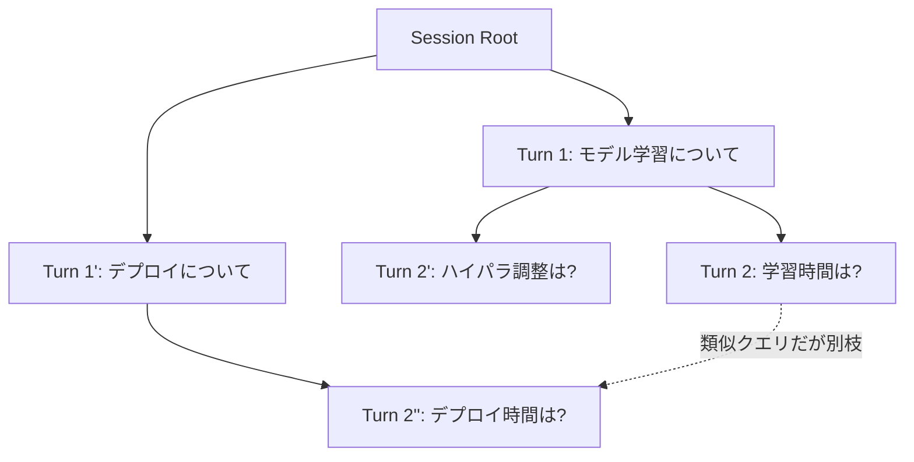

## 論文概要

本記事は [SmartCache: Context-aware Semantic Cache for Efficient Multi-turn LLM Inference](https://papers.nips.cc/paper_files/paper/2025/hash/fb74b63d225f846e6032bf3e3ab0f4ec-Abstract-Conference.html) の解説記事です。

マルチターン会話では、異なるユーザーセッション間で意味的に類似したクエリが発生しやすく、これが冗長な再計算とKVキャッシュの重複保持を引き起こす。既存のセマンティックキャッシュは単一ターンのクエリマッチングのみを対象としており、会話の文脈（コンテキスト）を考慮しないため、文脈が異なるにもかかわらず表面的に類似したクエリに誤ってキャッシュヒットしてしまうリスクを抱える。本論文は、この課題に対してSemantic Forestと呼ばれる階層インデックス構造と、標準のprefill計算中に得られるAttention Scoreを活用したトピック遷移検出を組み合わせた**system-algorithm co-design**フレームワーク「SmartCache」を提案している。

この記事は [Zenn記事: セマンティックキャッシュの安全なヒット判定：鮮度制約とコールドスタート対策の実装設計](https://zenn.dev/0h_n0/articles/20d67b309033bc) の深掘りである。Zenn記事が扱う「安全なヒット判定」というテーマと、本論文が扱う「会話コンテキストを考慮したヒット判定」というテーマは、セマンティックキャッシュの誤ヒット防止という観点で強く関連する。

## 情報源

- **種別**: カンファレンス論文
- **会議名**: NeurIPS 2025（Conference on Neural Information Processing Systems）
- **タイトル**: SmartCache: Context-aware Semantic Cache for Efficient Multi-turn LLM Inference
- **URL**: [https://papers.nips.cc/paper_files/paper/2025/hash/fb74b63d225f846e6032bf3e3ab0f4ec-Abstract-Conference.html](https://papers.nips.cc/paper_files/paper/2025/hash/fb74b63d225f846e6032bf3e3ab0f4ec-Abstract-Conference.html)

## カンファレンス情報

NeurIPS（Conference on Neural Information Processing Systems）は機械学習・人工知能分野におけるトップカンファレンスの1つであり、毎年数千件規模の投稿から厳格な査読を経て採択が行われる。本論文はLLM推論システムの効率化という実運用に直結するテーマを扱っており、アルゴリズム設計（Semantic Forestによるコンテキスト一致判定）とシステム実装（Attention Scoreの低オーバーヘッド活用）を統合した「system-algorithm co-design」というアプローチが特徴である。マルチターン会話が主流となっているLLMサービス（チャットボット、コーディングアシスタント等）において、既存のセマンティックキャッシュ手法の限界を明確に指摘し、実測ベースで大幅な効率改善を報告している点が評価されたと考えられる。

## 技術的詳細

### 既存手法の限界

従来のセマンティックキャッシュは、新規クエリ $q_t$ と過去に保存されたクエリ集合 $\{q_i\}$ との意味的類似度（一般にはコサイン類似度）を計算し、類似度が閾値を超えた場合にキャッシュされた応答を再利用する。

$$
\text{sim}(q_t, q_i) = \frac{q_t \cdot q_i}{\|q_t\| \, \|q_i\|}
$$

ここで、
- $q_t$: 現在の入力クエリの埋め込みベクトル
- $q_i$: キャッシュに保存済みのクエリ埋め込みベクトル

しかし、この定式化はクエリ単体の意味的類似度のみを見ており、そのクエリが発話された会話の文脈を考慮しない。例えば「それってどれくらい時間かかる？」という質問は、直前の会話が「モデルの学習」についてか「デプロイ」についてかによって全く異なる正解を持つが、クエリ単体の埋め込みだけでは両者を区別できない。

### Semantic Forest構造

SmartCacheは、この問題に対してSemantic Forestという階層インデックス構造を導入する。各木のノードは会話中の1ターン（ユーザー発話とその応答のペア）に対応し、親子関係は「直前のターンからの文脈的連続性」を表す。新しいクエリに対してキャッシュヒットと判定するには、以下の2条件を同時に満たす必要がある。

1. **セマンティック一致**: クエリ埋め込み同士の類似度が閾値 $\tau_{\text{sem}}$ を上回る
2. **コンテキスト一致**: 会話履歴のパスがSemantic Forest上で同一または十分に近い系譜（lineage）を辿っている



上図のように、「時間は？」という表面的に類似したクエリ（T2とT5）はSemantic Forest上で異なる枝に属するため、コンテキスト一致条件を満たさずキャッシュヒットしない。一方、同一枝内で意味的に近いクエリはヒットとして扱われ、応答とKVキャッシュを再利用できる。

### Attention Scoreによるトピック遷移検出

Semantic Forestにおいてどのノードが「新しい枝」を開始すべきかを判定するために、SmartCacheはLLM内部のAttention Scoreを活用する。これは標準のprefill計算中にすでに計算されている値であり、追加の推論パスを必要としない。

現在のターンのクエリトークン集合を $Q_t$、直前ターンの応答トークン集合を $R_{t-1}$ とすると、レイヤ $l$・ヘッド $h$ のAttentionマップ $A^{(l,h)}$ を用いて、直前ターンへの注意の集中度（コンテキスト連続性スコア）を次のように定義できる。

$$
C_t = \frac{1}{LH} \sum_{l=1}^{L} \sum_{h=1}^{H} \frac{1}{|Q_t|} \sum_{i \in Q_t} \sum_{j \in R_{t-1}} A^{(l,h)}_{i,j}
$$

ここで、
- $L$: Transformerの総レイヤ数
- $H$: 各レイヤのAttentionヘッド数
- $A^{(l,h)}_{i,j}$: レイヤ $l$・ヘッド $h$ における、クエリトークン位置 $i$ からトークン位置 $j$ へのAttention重み

$C_t$ が閾値 $\tau_{\text{attn}}$ を下回る場合、現在のターンは直前の文脈から意味的に離れた「トピック遷移」と判定され、Semantic Forest上で新しい枝が作成される。逆に $C_t$ が閾値を上回る場合は、現在のノードの子として既存の枝に接続される。この設計により、追加の埋め込みモデル呼び出しやLLM推論パスを増やすことなく、prefill計算のバイプロダクトとしてコンテキスト変化を検出できる点がSmartCacheのシステム面での貢献である。

```python
import torch


def compute_context_continuity_score(
    attention_weights: torch.Tensor,
    query_token_range: tuple[int, int],
    prev_turn_token_range: tuple[int, int],
) -> float:
    """prefill時のAttentionマップからコンテキスト連続性スコアを算出する。

    Args:
        attention_weights: 形状 (num_layers, num_heads, seq_len, seq_len) の
            Attention重みテンソル。prefill計算時にすでに得られている値を想定。
        query_token_range: 現在ターンのクエリトークンの開始・終了インデックス。
        prev_turn_token_range: 直前ターンの応答トークンの開始・終了インデックス。

    Returns:
        コンテキスト連続性スコア C_t（0以上1以下）。
    """
    q_start, q_end = query_token_range
    r_start, r_end = prev_turn_token_range

    # (num_layers, num_heads, |Q_t|, |R_{t-1}|) を切り出す
    attn_slice = attention_weights[:, :, q_start:q_end, r_start:r_end]

    # クエリトークン方向・直前ターン方向に平均を取り、
    # 全レイヤ・全ヘッドで平均することで C_t を得る
    per_query_mass = attn_slice.sum(dim=-1)  # (num_layers, num_heads, |Q_t|)
    score = per_query_mass.mean().item()
    return score


def is_topic_transition(
    continuity_score: float,
    threshold: float = 0.15,
) -> bool:
    """コンテキスト連続性スコアからトピック遷移の有無を判定する。

    Args:
        continuity_score: compute_context_continuity_score の出力値。
        threshold: トピック遷移とみなす閾値（tau_attn）。

    Returns:
        True の場合はトピック遷移とみなし、Semantic Forestに新しい枝を作成する。
    """
    return continuity_score < threshold
```

## 実装のポイント

SmartCacheをKVキャッシュ管理システムに組み込む際は、次の点に注意が必要である。

1. **セッション間共有の粒度**: Semantic Forestはセッションをまたいで共有可能な構造として設計されているため、異なるユーザーの会話であっても文脈的に同一の枝を辿る場合はKVキャッシュとレスポンスの両方を再利用できる。ただし、ユーザー固有の個人情報を含む応答をセッションをまたいで再利用しないよう、キャッシュ対象からPIIを含むターンを除外するフィルタリングが実運用上は必須となる
2. **閾値のチューニング**: $\tau_{\text{sem}}$ と $\tau_{\text{attn}}$ の2つの閾値はタスク特性に応じた調整が必要であり、閾値が緩すぎると誤ヒット（文脈の異なる応答の誤用）、厳しすぎるとキャッシュヒット率の低下を招く
3. **Attentionマップの保持コスト**: 全レイヤ・全ヘッドのAttentionマップを保持するとメモリオーバーヘッドが生じるため、実装上は代表的な数層（例: 中間層の一部）のみをサンプリングしてスコア計算に用いる近似が現実的である
4. **Semantic Forestのガベージコレクション**: 長時間運用するとForestが肥大化するため、アクセス頻度や経過時間に基づくノードの刈り込み（pruning）ポリシーを別途設計する必要がある

## Production Deployment Guide

SmartCacheのSemantic Forest構造とAttentionベースのコンテキスト検出は、マルチターン対応LLMサービスをAWS上で運用する際に直接適用可能である。以下にトラフィック規模別の実装パターンを示す。

### AWS実装パターン（コスト最適化重視）

| 構成 | トラフィック | インフラ | 月額コスト概算 |
|------|-------------|---------|---------------|
| Small | ~100 セッション/日 | EC2 g5.xlarge + ElastiCache Redis | $200-350 |
| Medium | ~1,000 セッション/日 | ECS Fargate + g5.2xlarge + ElastiCache | $900-1,600 |
| Large | 10,000+ セッション/日 | EKS + g5.12xlarge Spot + ElastiCache Cluster | $3,500-7,000 |

**Small構成 (~100セッション/日)**:
- EC2 g5.xlarge（A10G 24GB VRAM）: LLM推論とAttentionスコア計算を同一プロセスで実行
- ElastiCache Redis（cache.t3.medium）: Semantic Forestのノード（クエリ埋め込み・会話パス・応答）を保存
- Lambda: セッション管理APIのフロントエンド
- 月額概算: EC2 $150（Spot）+ Redis $50 + Lambda $5 = 約$205/月

**Medium構成 (~1,000セッション/日)**:
- ECS Fargate + g5.2xlarge: 推論とForest探索を並行実行できるようスループットを確保
- ElastiCache Redis（cache.r6g.large、レプリカ1台）: Semantic Forestの読み取りスケーラビリティを確保
- Application Load Balancer + セッションアフィニティ設定: 同一ユーザーのマルチターンリクエストを可能な限り同一ノードにルーティングし、ローカルKVキャッシュのヒット率を向上
- 月額概算: EC2 $350（Spot）+ Redis $180 + ALB $20 + 監視 $30 = 約$580/月

**Large構成 (10,000+セッション/日)**:
- EKS + Karpenter: g5.12xlarge（4x A10G）をSpot Instancesで自動スケーリング
- ElastiCache Redis Cluster Mode（シャーディング）: Semantic Forestをセッションキーでシャーディングし、水平スケール
- グローバルセッションルーティング: Attentionスコアに基づくトピック遷移をリアルタイムに反映するため、Forestの更新をイベント駆動（EventBridge）で伝播
- 月額概算: EKS $75 + EC2 Spot $2,800 + Redis Cluster $600 + ALB $50 + 監視 $150 = 約$3,675/月

**コスト削減テクニック**:
- Spot Instances活用: g5インスタンスで最大70-90%削減。SmartCacheのキャッシュヒット率が高いほど推論負荷が下がるため、Spot中断時の再計算コストも相対的に小さくなる
- ElastiCacheのTTL設計: Semantic Forestのノードに適切なTTLを設定し、古いコンテキストの保持コストを抑制（Zenn記事で扱われている「鮮度制約」の考え方と直結する）
- Reserved Instances: 安定したベーストラフィック分に1年コミットで最大72%削減

**コスト試算の注意事項**: 上記は2026年8月時点のAWS ap-northeast-1（東京）リージョン料金に基づく概算値である。実際のコストはトラフィックパターン、キャッシュヒット率、リージョンにより変動するため、AWS Pricing Calculatorでの詳細な試算を推奨する。

### Terraformインフラコード

**Medium構成（ECS Fargate + ElastiCache Redis）**:

```hcl
# Medium構成: ECS Fargate + g5.2xlarge相当のGPUノード + ElastiCache Redis
# SmartCache (Semantic Forest) 用インフラ

terraform {
  required_version = ">= 1.8"
  required_providers {
    aws = { source = "hashicorp/aws", version = "~> 5.80" }
  }
}

provider "aws" {
  region = "ap-northeast-1"
}

resource "aws_vpc" "smartcache_vpc" {
  cidr_block           = "10.1.0.0/16"
  enable_dns_hostnames = true
  tags = { Name = "smartcache-vpc" }
}

resource "aws_subnet" "private" {
  count             = 2
  vpc_id            = aws_vpc.smartcache_vpc.id
  cidr_block        = "10.1.${count.index + 1}.0/24"
  availability_zone = element(["ap-northeast-1a", "ap-northeast-1c"], count.index)
  tags = { Name = "smartcache-private-${count.index}" }
}

# ElastiCache Redis: Semantic Forestノードの永続化
resource "aws_elasticache_subnet_group" "smartcache" {
  name       = "smartcache-redis-subnet"
  subnet_ids = aws_subnet.private[*].id
}

resource "aws_elasticache_replication_group" "semantic_forest" {
  replication_group_id       = "smartcache-semantic-forest"
  description                = "Semantic Forest node store for SmartCache"
  node_type                  = "cache.r6g.large"
  num_cache_clusters         = 2
  engine                     = "redis"
  engine_version              = "7.1"
  automatic_failover_enabled = true
  subnet_group_name          = aws_elasticache_subnet_group.smartcache.name
  at_rest_encryption_enabled = true
  transit_encryption_enabled = true

  tags = { Name = "smartcache-redis" }
}

# ECS Cluster（GPU対応Fargateはg5相当のEC2キャパシティプロバイダを利用）
resource "aws_ecs_cluster" "smartcache" {
  name = "smartcache-inference-cluster"
  setting {
    name  = "containerInsights"
    value = "enabled"
  }
}

# タスク定義: LLM推論 + Attentionスコア計算を同一コンテナで実行
resource "aws_ecs_task_definition" "smartcache_inference" {
  family                   = "smartcache-inference"
  requires_compatibilities = ["EC2"]
  network_mode             = "awsvpc"
  cpu                      = "8192"
  memory                   = "32768"

  container_definitions = jsonencode([
    {
      name  = "smartcache-inference"
      image = "123456789012.dkr.ecr.ap-northeast-1.amazonaws.com/smartcache:latest"
      resourceRequirements = [
        { type = "GPU", value = "1" }
      ]
      environment = [
        { name = "REDIS_ENDPOINT", value = aws_elasticache_replication_group.semantic_forest.primary_endpoint_address },
        { name = "TAU_SEM", value = "0.85" },
        { name = "TAU_ATTN", value = "0.15" },
      ]
      logConfiguration = {
        logDriver = "awslogs"
        options = {
          "awslogs-group"         = "/ecs/smartcache-inference"
          "awslogs-region"        = "ap-northeast-1"
          "awslogs-stream-prefix" = "smartcache"
        }
      }
    }
  ])
}

resource "aws_cloudwatch_log_group" "smartcache" {
  name              = "/ecs/smartcache-inference"
  retention_in_days = 30
}
```

### 運用・監視設定

**CloudWatchアラーム（キャッシュヒット率・TTFT監視）**:

```python
import boto3


def create_smartcache_alarms(cloudwatch_client: boto3.client, sns_topic_arn: str) -> None:
    """SmartCache運用向けのCloudWatchアラームを作成する。

    Args:
        cloudwatch_client: boto3 CloudWatchクライアント。
        sns_topic_arn: アラート通知先のSNSトピックARN。
    """
    # Semantic Forestヒット率の低下を検知
    cloudwatch_client.put_metric_alarm(
        AlarmName="smartcache-hit-rate-low",
        MetricName="SemanticForestHitRate",
        Namespace="Custom/SmartCache",
        Statistic="Average",
        Period=300,
        EvaluationPeriods=3,
        Threshold=40.0,
        ComparisonOperator="LessThanThreshold",
        AlarmActions=[sns_topic_arn],
        AlarmDescription="Semantic Forest hit rate dropped below 40% for 15 minutes",
    )

    # TTFT（Time-to-First-Token）の悪化を検知
    cloudwatch_client.put_metric_alarm(
        AlarmName="smartcache-ttft-high",
        MetricName="TimeToFirstToken",
        Namespace="Custom/SmartCache",
        Statistic="p95",
        Period=60,
        EvaluationPeriods=5,
        Threshold=800.0,  # ミリ秒
        ComparisonOperator="GreaterThanThreshold",
        AlarmActions=[sns_topic_arn],
        AlarmDescription="p95 TTFT exceeds 800ms",
    )

    # 誤ヒット（コンテキスト不一致による誤応答）疑いのモニタリング
    cloudwatch_client.put_metric_alarm(
        AlarmName="smartcache-context-mismatch-high",
        MetricName="ContextMismatchRate",
        Namespace="Custom/SmartCache",
        Statistic="Average",
        Period=300,
        EvaluationPeriods=2,
        Threshold=1.0,  # %
        ComparisonOperator="GreaterThanThreshold",
        AlarmActions=[sns_topic_arn],
        AlarmDescription="Context mismatch rate exceeds 1%, possible false cache hits",
    )
```

**CloudWatch Logs Insightsクエリ（Semantic Forest分析）**:

```
# ターンごとのトピック遷移検出頻度
fields @timestamp, session_id, continuity_score, is_topic_transition
| filter is_topic_transition = 1
| stats count() as transition_count by bin(1h)
| sort transition_count desc

# キャッシュヒット/ミスの内訳（セマンティック一致のみ vs コンテキスト一致含む）
fields @timestamp, semantic_match, context_match, cache_hit
| stats
    sum(cache_hit) as hits,
    sum(semantic_match and not context_match) as semantic_only_miss
  by bin(5m)
```

**日次コストレポート（Python, boto3）**:

```python
import boto3
from datetime import datetime, timedelta


def daily_smartcache_cost_report(cost_alert_threshold_usd: float = 150.0) -> dict[str, float]:
    """SmartCache関連リソースの日次コストを集計し、閾値超過時にSNS通知する。

    Args:
        cost_alert_threshold_usd: 1日あたりのコストアラート閾値（USD）。

    Returns:
        サービス名をキー、日次コスト（USD）を値とする辞書。
    """
    ce = boto3.client("ce")
    today = datetime.utcnow().strftime("%Y-%m-%d")
    yesterday = (datetime.utcnow() - timedelta(days=1)).strftime("%Y-%m-%d")

    response = ce.get_cost_and_usage(
        TimePeriod={"Start": yesterday, "End": today},
        Granularity="DAILY",
        Metrics=["UnblendedCost"],
        Filter={"Tags": {"Key": "Project", "Values": ["smartcache"]}},
        GroupBy=[{"Type": "DIMENSION", "Key": "SERVICE"}],
    )

    costs = {
        group["Keys"][0]: float(group["Metrics"]["UnblendedCost"]["Amount"])
        for group in response["ResultsByTime"][0]["Groups"]
    }

    total = sum(costs.values())
    if total > cost_alert_threshold_usd:
        sns = boto3.client("sns")
        sns.publish(
            TopicArn="arn:aws:sns:ap-northeast-1:123456789012:smartcache-cost-alert",
            Subject=f"SmartCache Cost Alert: ${total:.2f}/day",
            Message=f"Daily cost exceeded ${cost_alert_threshold_usd}. Breakdown: {costs}",
        )
    return costs
```

### コスト最適化チェックリスト

**アーキテクチャ選択**:
- [ ] トラフィック規模に応じた構成（Small: Spot EC2 / Medium: ECS Fargate / Large: EKS）
- [ ] セッションアフィニティ設定でマルチターン会話のローカルヒット率を向上
- [ ] ElastiCache Redisのノードタイプをキャッシュサイズ（Semantic Forestのノード数）に応じて選定

**リソース最適化**:
- [ ] EC2/GPUノードのSpot Instances優先活用（70-90%削減）
- [ ] Reserved InstancesまたはSavings Plansで安定トラフィック分をコミット
- [ ] ElastiCacheのTTLとpruningポリシーでメモリコストを抑制

**SmartCache固有の最適化**:
- [ ] $\tau_{\text{sem}}$・$\tau_{\text{attn}}$ の継続的なチューニングでヒット率とレイテンシのバランスを最適化
- [ ] Attentionスコアのサンプリング層数を削減し計算オーバーヘッドを最小化
- [ ] PIIを含むターンのキャッシュ除外フィルタを必ず実装

**監視・アラート**:
- [ ] Semantic Forestヒット率、TTFT p95、誤ヒット率のダッシュボード化
- [ ] AWS Budgets: 月次予算アラート（80%/100%/120%）
- [ ] Cost Anomaly Detectionによる異常コストの自動検知

## 実験結果

著者らは、マルチターン会話質問応答データセットであるCoQAおよびSQuADを用いてSmartCacheを評価している。比較対象は (1) prefix caching（会話履歴全体のKVキャッシュをプレフィックス単位で再利用する手法）と、(2) 既存のsemantic caching（単一ターンのクエリ類似度のみに基づく手法）である。

| 指標 | vs prefix caching | vs semantic caching |
|------|-------------------|---------------------|
| KVキャッシュメモリ使用量 | 最大59.1%削減 | 最大56.0%削減 |
| Time-to-First-Token (TTFT) | 最大78.0%削減 | 最大71.7%削減 |

著者らは、これらの改善がSemantic Forestによる正確なコンテキストマッチングと、Attention Scoreを用いた低オーバーヘッドのトピック遷移検出の組み合わせによって達成されていると報告している。特にTTFTの大幅な改善は、コンテキストが一致するリクエストに対してKVキャッシュの再計算そのものを省略できることに起因すると考えられる。

## 実運用への応用

### Zenn記事との関連: 安全なヒット判定とコンテキスト一致条件

Zenn記事「セマンティックキャッシュの安全なヒット判定：鮮度制約とコールドスタート対策の実装設計」では、意味的類似度のみに頼るキャッシュヒット判定が誤った応答の再利用を招くリスクと、その対策としての鮮度制約設計が扱われている。本論文のコンテキスト一致条件（Semantic Forest上で同一系譜を辿ることを要求する設計）は、この「安全なヒット判定」というテーマに対する具体的な実装パターンを提供するものと言える。

セマンティック一致だけでなく会話コンテキストの一致も要求するというSmartCacheの二段階判定は、Zenn記事で議論されている「誤ヒットによる不整合な応答」というリスクを構造的に低減するアプローチであり、両者は補完関係にある。

### コールドスタート対策への示唆

Semantic Forestは会話が進むにつれて成長する構造であるため、新規セッション開始直後（コールドスタート時）にはキャッシュヒットが得られにくいという課題は本論文でも共通して存在すると考えられる。この点については、頻出する会話開始パターン（FAQ的な最初の質問等）をあらかじめForestの上位ノードとして事前構築しておくウォームアップ戦略が、Zenn記事のコールドスタート対策と同様に有効と考えられる。

## まとめ

本論文は、マルチターン会話におけるセマンティックキャッシュの課題であった「会話コンテキストを考慮しないクエリマッチング」に対して、Semantic Forestという階層インデックス構造と、prefill計算中のAttention Scoreを活用した低オーバーヘッドなトピック遷移検出を組み合わせたSmartCacheを提案した。著者らは、CoQA/SQuADデータセットにおいてKVキャッシュメモリ使用量を最大59.1%（prefix caching比）・56.0%（semantic caching比）、TTFTを最大78.0%（prefix caching比）・71.7%（semantic caching比）削減したと報告している。

セマンティック一致とコンテキスト一致の二段階判定という設計は、Zenn記事で論じられている「安全なヒット判定」の具体的な実装指針としても参考になる。マルチターン対応LLMサービスの運用において、単純な埋め込み類似度ベースのキャッシュから一歩進んだ、文脈を考慮したキャッシュ設計を検討する際の重要な参照点となる論文である。

## 参考文献

- **NeurIPS 2025**: [https://papers.nips.cc/paper_files/paper/2025/hash/fb74b63d225f846e6032bf3e3ab0f4ec-Abstract-Conference.html](https://papers.nips.cc/paper_files/paper/2025/hash/fb74b63d225f846e6032bf3e3ab0f4ec-Abstract-Conference.html)
- **Related Zenn article**: [https://zenn.dev/0h_n0/articles/20d67b309033bc](https://zenn.dev/0h_n0/articles/20d67b309033bc)
