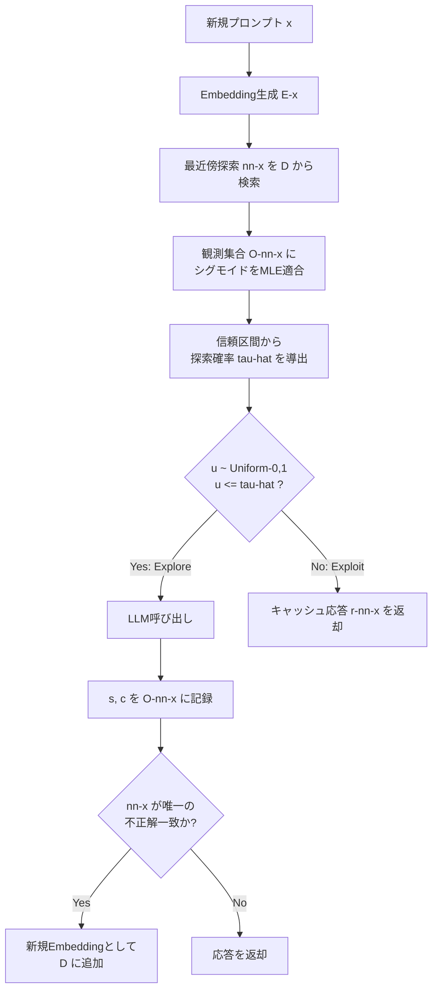

本記事は [vCache: Verified Semantic Prompt Caching](https://arxiv.org/abs/2502.03771) の解説記事です。

## 論文概要

vCacheは、ユーザー定義のエラーレート保証を提供する検証済みセマンティックキャッシュシステムである。著者らは、既存のセマンティックキャッシュが採用する静的な類似度閾値には形式的な正確性保証がなく、予期しないエラーレートとサブオプティマルなキャッシュヒット率をもたらすと指摘している。vCacheはオンライン学習アルゴリズムにより、キャッシュされたプロンプトごとに個別の最適閾値を追加トレーニングなしで推定し、予測可能な性能を実現する。著者らの実験では、静的閾値やファインチューニング済みエンベディングを用いるベースラインと比較して、キャッシュヒット率が最大12.5倍、エラーレートが最大26倍改善したと報告されている。本論文はICLR 2026に採択されている。

## この記事について

この記事は [Zenn記事: セマンティックキャッシュの安全なヒット判定：鮮度制約とコールドスタート対策の実装設計](https://zenn.dev/0h_n0/articles/20d67b309033bc) の深掘りです。Zenn記事では鮮度制約（Freshness Gate）と根拠検証（Evidence Validation）の4重ゲートにより、時間経過やドキュメントドリフトに起因するunsafe hitを防ぐ設計パターンを解説している。本論文はこれとは異なる切り口から同じ問題に取り組んでおり、「固定の類似度閾値」そのものを、統計的に検証されたプロンプトごとの動的閾値に置き換えることでエラー率を保証するアプローチを提示している。両者は「キャッシュヒット判定の安全性をどう担保するか」という共通の課題に対する、時間軸（鮮度）と統計的保証（閾値検証）という異なる軸からの解法として位置づけられる。

## 情報源

| 項目 | 内容 |
|------|------|
| タイトル | vCache: Verified Semantic Prompt Caching |
| 著者 | Luis Gaspar Schroeder, Aditya Desai, Alejandro Cuadron, Kyle Chu, Shu Liu, Mark Zhao, Stephan Krusche, Alfons Kemper, Matei Zaharia, Joseph E. Gonzalez |
| arXiv ID | 2502.03771 |
| 初稿投稿日 | 2025年2月6日（最新版v5: 2026年2月21日） |
| 発表 | ICLR 2026 採択 |
| 分野 | cs.LG（機械学習）, cs.CL（計算言語学） |
| コード | [github.com/vcache-project/vCache](https://github.com/vcache-project/vCache) |

## 背景と動機

セマンティックキャッシュは、過去のプロンプトとのEmbedding類似度が閾値を超えた場合にキャッシュ済みの応答を再利用することで、LLM呼び出しのレイテンシとコストを削減する。GPTCacheをはじめとする既存システムは、全プロンプトに対して単一の静的な類似度閾値（例: 0.85）を適用する。

著者らは、この静的閾値アプローチには根本的な限界があると指摘している。プロンプトの意味空間における「近さ」と「正解が一致する確率」の関係は、プロンプトの種類やドメインによって大きく異なる。単一の閾値ではこの不均一性を捉えられず、「閾値を上げればヒット率が下がりエラー率は下がる、閾値を下げればヒット率は上がるがエラー率も上がる」というトレードオフの中で、恣意的に選ばれた1点でしか運用できない。しかもこのトレードオフには**形式的な正確性保証が存在しない**ため、運用者は本番環境でどの程度のエラー率が発生するかを事前に見積もることができない。

著者らはさらに、ファインチューニング済みエンベディングによる改善アプローチについても、追加の教師データと学習コストを要し、オープンソースモデルに限定されるという制約があると述べている。vCacheは、追加学習なしに、かつユーザーが指定したエラー率上限を満たすことを統計的に保証する初めてのセマンティックキャッシュシステムとして提案されている。

## 主要な貢献

著者らが報告している本論文の貢献は以下の4点である。

1. **検証済みセマンティックキャッシュの定式化**: キャッシュヒット判定を、ユーザー定義のエラー率上限 $\delta$ を満たす確率的意思決定問題として定式化し、$\Pr(\text{vCache}(x) = r(x)) \geq (1-\delta)$ という保証を与える枠組みを提示
2. **プロンプトごとのオンライン閾値学習**: グローバルな単一閾値の代わりに、キャッシュされた各プロンプトについて観測データから逐次的に最適な意思決定境界を推定するオンライン学習アルゴリズムを設計
3. **統計的に保証された探索・活用（Exploit/Explore）戦略**: 信頼区間に基づく悲観的な探索確率の導出により、パラメータ推定の不確実性を考慮してもなお指定されたエラー率保証を満たす確率的意思決定則を導出
4. **ベンチマーク・実装の公開**: 4つのベンチマークデータセット（SemCacheLMArena、SemCacheClassification、SemCacheSearchQueries、SemCacheCombo）とリファレンス実装を公開し、静的閾値・ファインチューニング済みエンベディング等の既存手法との比較評価を実施

## 技術的詳細

### システムアーキテクチャ

vCacheは、キャッシュを「Embedding・応答・観測メタデータの三つ組」の集合として保持する。

$$
\mathcal{D} = \{(E(x_i),\, r(x_i),\, \mathcal{O}(x_i))\}
$$

ここで、

- $x_i$: キャッシュされたプロンプト
- $E(x_i)$: $x_i$ のEmbeddingベクトル
- $r(x_i)$: $x_i$ に対応するキャッシュ済み応答
- $\mathcal{O}(x_i)$: $x_i$ が最近傍として選ばれた過去の全クエリについて記録された観測集合

観測集合 $\mathcal{O}(x_i)$ は、以降にクエリされたプロンプト $x_j$ のうち $x_i$ が最近傍（nearest neighbor, $\mathrm{nn}(x_j) = x_i$）であった場合の類似度スコアと正誤ラベルのペアで構成される。

$$
\mathcal{O}(x_i) = \{(s(x_j),\, c(x_j)) \mid \mathrm{nn}(x_j) = x_i\}
$$

ここで、$s(x_j)$ は $x_j$ と $x_i$ の類似度スコア、$c(x_j) \in \{0, 1\}$ はキャッシュ応答 $r(x_i)$ が $x_j$ の正解と一致していれば1、そうでなければ0を取るラベルである。この観測集合は、新規クエリが到着してLLMを呼び出した（explore）際の結果を記録することで逐次的に蓄積される。



### プロンプトごとの閾値推定

vCacheの中核は、類似度スコア $s(x)$ からキャッシュ応答が正解と一致する確率をモデル化するシグモイド関数である。

$$
\Pr(c(x) = 1 \mid x, \mathcal{D}) = L(s(x), t, \gamma) = \frac{1}{1 + e^{-\gamma (s(x) - t)}}
$$

ここで、

- $s(x)$: クエリ $x$ と最近傍プロンプトとの類似度スコア
- $t$: Embeddingごとの意思決定境界パラメータ（このEmbeddingにとっての「実質的な閾値」に相当）
- $\gamma$: シグモイドの傾き（急峻さ）を制御するパラメータ

パラメータ $t$ と $\gamma$ は、観測集合 $\mathcal{O}(\mathrm{nn}(x))$ に含まれる全ペア $(s(x_j), c(x_j))$ を用いて、二値交差エントロピー損失を最小化する最尤推定（MLE）により逐次更新される。これにより、プロンプトごとに「どの類似度スコアであれば正解と一致しやすいか」という関係を個別に学習できる。全プロンプトに単一の $t$ を適用する静的閾値方式と異なり、意味的に曖昧な領域を持つプロンプトには保守的な境界を、明確に区別できる領域を持つプロンプトには積極的な境界を、データから自動的に学習する点が特徴である。

### 探索確率の導出と正確性保証

MLEで推定した $t, \gamma$ をそのまま使って決定的に閾値判定を行うと、観測数が少ない初期段階では推定誤差が大きく、ユーザーが指定したエラー率上限 $\delta$ を満たせない可能性がある。そこで著者らは、確率的な探索・活用（explore/exploit）戦略を導入している。

具体的には、シグモイドパラメータの信頼区間（信頼水準 $1-\epsilon$）を用いて、悲観的な（保証を満たす側に倒した）上限として探索確率 $\hat{\tau}$ を算出する。決定則は以下の通りである。

1. $u \sim \mathrm{Uniform}(0, 1)$ をサンプリング
2. $u \leq \hat{\tau}$ ならば **探索（Explore）**: LLMを呼び出して正解を取得し、結果 $(s, c)$ を観測集合に追加
3. $u > \hat{\tau}$ ならば **活用（Exploit）**: キャッシュ応答をそのまま返却

$\hat{\tau}$ はパラメータ推定の不確実性を織り込んで保守的に計算されるため、観測数が少ない段階では探索確率が高くなり（積極的にLLMを呼んで検証する）、観測が蓄積されて信頼区間が狭まるにつれて活用（キャッシュ再利用）の比率が自然に増加する。この設計により、著者らは以下の保証を導出している。

$$
\Pr(\text{vCache}(x) = r(x)) \geq (1 - \delta)
$$

ここで $\delta$ はユーザーが事前に指定するエラー率上限である。この保証は、パラメータ推定の不確実性を確率的探索によって吸収する仕組みに基づいており、静的閾値方式のように「経験的に妥当と思われる値」を固定するのではなく、統計的な裏付けを持ってエラー率を制御できる点が本質的な違いである。

### 実装イメージ

以下は、上記のシグモイド適合と探索確率導出のロジックを単純化して実装したPythonコード例である。

```python
from dataclasses import dataclass, field

import numpy as np
from scipy.optimize import minimize
from scipy.stats import norm


@dataclass
class Observation:
    """最近傍プロンプトに対する1回の観測結果

    Attributes:
        similarity: クエリと最近傍プロンプトの類似度スコア s(x)
        correct: キャッシュ応答が正解と一致していれば1、しなければ0
    """

    similarity: float
    correct: int


@dataclass
class PromptThresholdEstimator:
    """プロンプトごとのシグモイド閾値モデルを保持し、
    観測データから探索確率を導出するオンライン学習器

    Attributes:
        observations: このプロンプトに紐づく観測集合 O(nn(x))
        delta: ユーザー定義のエラー率上限
        confidence_level: 信頼区間の信頼水準 (1 - epsilon)
    """

    observations: list[Observation] = field(default_factory=list)
    delta: float = 0.02
    confidence_level: float = 0.95

    def add_observation(self, similarity: float, correct: int) -> None:
        """LLM呼び出し(探索)の結果を観測集合に追加する"""
        self.observations.append(Observation(similarity, correct))

    def _fit_sigmoid(self) -> tuple[float, float]:
        """観測集合に対してMLEでシグモイドパラメータ (t, gamma) を推定する

        Returns:
            推定された意思決定境界 t とシグモイドの傾き gamma
        """
        s = np.array([o.similarity for o in self.observations])
        c = np.array([o.correct for o in self.observations])

        def neg_log_likelihood(params: np.ndarray) -> float:
            t, gamma = params
            p = 1.0 / (1.0 + np.exp(-gamma * (s - t)))
            eps = 1e-9
            return -np.sum(c * np.log(p + eps) + (1 - c) * np.log(1 - p + eps))

        result = minimize(
            neg_log_likelihood, x0=np.array([0.85, 10.0]), method="Nelder-Mead"
        )
        t_hat, gamma_hat = result.x
        return float(t_hat), float(gamma_hat)

    def exploration_probability(self, query_similarity: float) -> float:
        """指定された類似度スコアに対する保守的な探索確率 tau_hat を返す

        観測数が少ないほど信頼区間が広く、保守的に高い探索確率が
        返される。観測が蓄積されるほど活用(exploit)の比率が増える。

        Args:
            query_similarity: 現在のクエリの類似度スコア s(x)

        Returns:
            探索(LLM呼び出し)を行うべき確率 tau_hat in [0, 1]
        """
        if len(self.observations) < 5:
            return 1.0  # 観測不足時は常に探索して安全側に倒す

        t_hat, gamma_hat = self._fit_sigmoid()
        n = len(self.observations)
        z = norm.ppf(self.confidence_level)
        # パラメータ推定の標準誤差を観測数から近似し、悲観的な下限を算出
        se = 1.0 / np.sqrt(n)
        p_hat = 1.0 / (1.0 + np.exp(-gamma_hat * (query_similarity - t_hat)))
        p_lower = max(0.0, p_hat - z * se)  # 正解確率の悲観的下限

        # 悲観的な正解確率が (1 - delta) を下回る分だけ探索確率を割り当てる
        tau_hat = max(0.0, min(1.0, (1.0 - self.delta) - p_lower))
        return tau_hat

    def should_exploit(self, query_similarity: float, rng: np.random.Generator) -> bool:
        """探索・活用の確率的意思決定を行う

        Args:
            query_similarity: 現在のクエリの類似度スコア s(x)
            rng: 乱数生成器

        Returns:
            True であればキャッシュ応答を返却(exploit)、
            False であればLLMを呼び出す(explore)
        """
        tau_hat = self.exploration_probability(query_similarity)
        u = rng.uniform(0.0, 1.0)
        return u > tau_hat
```

## 実装のポイント

著者らが報告している実装上の重要な特徴として、オーバーヘッドの小ささが挙げられる。$\hat{\tau}$ の計算は定数時間で完了し、著者らの計測では1.5ミリ秒未満であったと報告されている。またロジスティック回帰の適合は平均0.0017秒であり、LLM推論のレイテンシと比較して無視できる水準である。

実装上の注意点として、以下が挙げられる。

- **最近傍が唯一かつ不正解の場合の新規登録**: あるクエリの最近傍プロンプトが1件のみ存在し、かつそのキャッシュ応答が不正解であった場合、vCacheは新規Embeddingとしてキャッシュ $\mathcal{D}$ に追加する。これにより、意味的に近いが正解が異なる「near-miss」クエリ群に対して、専用の閾値モデルを持つエントリが形成される
- **観測不足時の安全側フォールバック**: 観測数が極端に少ない初期段階では信頼区間が広くなりすぎるため、実装上は一定の観測数に達するまで常に探索（LLM呼び出し）を行う安全側の初期化が必要である
- **Embeddingモデルの選択**: 著者らはGteLargeENv1-5、E5-large-v2、OpenAI text-embedding-3-smallなど複数のEmbeddingモデルで評価しており、Embeddingの品質がシグモイドの分離性能（$\gamma$ の大きさ）に直接影響する

## Production Deployment Guide

vCacheはオンライン閾値学習という計算コストの小さい追加処理を既存のセマンティックキャッシュパイプラインに組み込む構成であるため、AWS上でのプロダクション実装は「Embedding生成 + ベクトル検索 + 観測メタデータストア」の3コンポーネントを中心に設計する。以下に、論文のアーキテクチャに基づくAWSデプロイメントパターンを示す。

### AWS実装パターン（コスト最適化重視）

vCacheの推論パスは、通常のセマンティックキャッシュと同じEmbedding・ベクトル検索処理に加えて、プロンプトごとの観測集合 $\mathcal{O}(x_i)$ を保持・更新するメタデータストアが追加で必要になる。

| 構成 | トラフィック | AWSサービス | 月額概算 |
|:---|:---|:---|:---|
| Small (~100 req/日) | 単一チーム利用 | API Gateway + Lambda + Bedrock(Embedding) + DynamoDB | $50-150 |
| Medium (~1000 req/日) | 部門横断利用 | ALB + ECS Fargate + OpenSearch Serverless + DynamoDB | $300-800 |
| Large (10000+ req/日) | 全社プラットフォーム | NLB + EKS + OpenSearch(k-NN) + ElastiCache(Redis) | $2,000-5,000 |

**Small構成の内訳**:
- API Gateway: プロンプト受信用REST API（$3.50/100万リクエスト）
- Lambda: Embedding生成呼び出し、$\hat{\tau}$ 計算、explore/exploit判定（$0.20/100万リクエスト、256MB設定）
- Bedrock: Embeddingモデル呼び出し（Titan Embeddings等、$0.0001/1000トークン程度）
- DynamoDB: 観測集合 $\mathcal{O}(x_i)$ の保存（On-Demandモード、$1.25/WCU 100万）

**Large構成の内訳**:
- EKS: コントロールプレーン $72/月 + Karpenter によるSpotノード管理
- OpenSearch Service（k-NNプラグイン）: 最近傍探索（HNSWインデックス、r6g.large.search 2ノード構成で$300-400/月）
- ElastiCache（Redis）: シグモイドパラメータ $(t, \gamma)$ のホットキャッシュ（cache.r6g.large $150/月）
- CloudWatch: エラー率・探索率の統一監視

**コスト削減テクニック**:
- Spot Instancesを閾値推定ワーカーに活用し最大90%削減
- DynamoDB On-Demandモードで観測データのアイドル時コストを最小化
- Bedrock Batch API使用でEmbedding再計算コストを50%削減
- 観測数が十分に蓄積したプロンプトはシグモイドパラメータをElastiCacheにキャッシュし、DynamoDBへのアクセス頻度を削減

注: 上記は2026年8月時点のAWS ap-northeast-1（東京）リージョン料金に基づく概算値である。実際のコストはトラフィックパターン、リージョン、バースト使用量により変動する。最新料金はAWS料金計算ツールでの確認を推奨する。

### Terraformインフラコード

**Small構成（Serverless: API Gateway + Lambda + Bedrock + DynamoDB）**:

```hcl
terraform {
  required_version = ">= 1.9"
  required_providers {
    aws = { source = "hashicorp/aws", version = "~> 5.60" }
  }
}

provider "aws" {
  region = "ap-northeast-1"
}

# --- DynamoDB: 観測集合 O(x_i) の保存 ---
resource "aws_dynamodb_table" "observations" {
  name         = "vcache-observations"
  billing_mode = "PAY_PER_REQUEST"
  hash_key     = "prompt_id"
  range_key    = "observed_at"

  attribute {
    name = "prompt_id"
    type = "S"
  }
  attribute {
    name = "observed_at"
    type = "N"
  }
  server_side_encryption {
    enabled = true # KMS暗号化
  }
}

# --- Lambda: explore/exploit判定処理 ---
resource "aws_lambda_function" "vcache_router" {
  function_name = "vcache-router"
  runtime       = "python3.12"
  handler       = "handler.lambda_handler"
  architectures = ["arm64"] # Graviton2: コスト削減
  memory_size   = 256
  timeout       = 10
  filename      = "lambda.zip"
  role          = aws_iam_role.lambda_role.arn
  environment {
    variables = {
      OBS_TABLE     = aws_dynamodb_table.observations.name
      DELTA_DEFAULT = "0.02"
    }
  }
  tracing_config {
    mode = "Active" # X-Ray有効化
  }
}

resource "aws_iam_role" "lambda_role" {
  name = "vcache-router-role"
  assume_role_policy = jsonencode({
    Version = "2012-10-17"
    Statement = [{
      Action    = "sts:AssumeRole"
      Effect    = "Allow"
      Principal = { Service = "lambda.amazonaws.com" }
    }]
  })
}

resource "aws_iam_role_policy" "lambda_policy" {
  name = "vcache-router-policy"
  role = aws_iam_role.lambda_role.id
  policy = jsonencode({
    Version = "2012-10-17"
    Statement = [
      {
        Effect   = "Allow"
        Action   = ["dynamodb:GetItem", "dynamodb:PutItem", "dynamodb:Query"]
        Resource = aws_dynamodb_table.observations.arn
      },
      {
        Effect   = "Allow"
        Action   = ["bedrock:InvokeModel"]
        Resource = "arn:aws:bedrock:*::foundation-model/amazon.titan-embed-text-v2:0"
      },
      {
        Effect   = "Allow"
        Action   = ["logs:CreateLogGroup", "logs:CreateLogStream", "logs:PutLogEvents"]
        Resource = "arn:aws:logs:*:*:*"
      }
    ]
  })
}

# --- CloudWatch アラーム: エラー率の異常検知 ---
resource "aws_cloudwatch_metric_alarm" "error_rate_breach" {
  alarm_name          = "vcache-error-rate-breach"
  comparison_operator = "GreaterThanThreshold"
  evaluation_periods  = 2
  metric_name         = "CacheErrorRate"
  namespace           = "VCache"
  period              = 300
  statistic           = "Average"
  threshold           = 0.02 # ユーザー定義エラー率上限 delta
}
```

**Large構成（Container: EKS + Karpenter + OpenSearch）**:

```hcl
module "eks" {
  source  = "terraform-aws-modules/eks/aws"
  version = "~> 20.24"

  cluster_name    = "vcache-cluster"
  cluster_version = "1.31"

  vpc_id     = module.vpc.vpc_id
  subnet_ids = module.vpc.private_subnets

  cluster_endpoint_public_access = false # プライベートエンドポイントのみ
}

# --- Karpenter: Spot優先オートスケーリング ---
resource "kubectl_manifest" "karpenter_nodepool" {
  yaml_body = <<-YAML
    apiVersion: karpenter.sh/v1
    kind: NodePool
    metadata:
      name: vcache-pool
    spec:
      template:
        spec:
          requirements:
            - key: karpenter.sh/capacity-type
              operator: In
              values: ["spot", "on-demand"]
            - key: node.kubernetes.io/instance-type
              operator: In
              values: ["r7g.large", "r7g.xlarge", "c7g.large"]
      limits:
        cpu: "200"
      disruption:
        consolidationPolicy: WhenEmptyOrUnderutilized
        consolidateAfter: 60s
  YAML
}

# --- OpenSearch: 最近傍探索用k-NNドメイン ---
resource "aws_opensearch_domain" "vcache_ann" {
  domain_name    = "vcache-ann-index"
  engine_version = "OpenSearch_2.15"

  cluster_config {
    instance_type  = "r6g.large.search"
    instance_count = 2
  }
  ebs_options {
    ebs_enabled = true
    volume_size = 100
  }
  encrypt_at_rest {
    enabled = true # KMS暗号化
  }
}

# --- AWS Budgets: 予算アラート ---
resource "aws_budgets_budget" "monthly" {
  name         = "vcache-monthly"
  budget_type  = "COST"
  limit_amount = "5000"
  limit_unit   = "USD"
  time_unit    = "MONTHLY"

  notification {
    comparison_operator        = "GREATER_THAN"
    threshold                  = 80
    threshold_type             = "PERCENTAGE"
    notification_type          = "ACTUAL"
    subscriber_email_addresses = ["ops-team@example.com"]
  }
}
```

### 運用・監視設定

**CloudWatch Logs Insights: エラー率上限違反の検知**:

```
fields @timestamp, prompt_id, error_flag
| filter error_flag = 1
| stats count(*) as errors, count_distinct(prompt_id) as affected_prompts by bin(1h)
| filter errors > 0
| sort @timestamp desc
```

**CloudWatch Logs Insights: 探索/活用比率の分析**:

```
fields @timestamp, decision, tau_hat
| stats avg(tau_hat) as avg_tau,
        sum(decision = "explore") / count(*) as explore_ratio
  by bin(1h)
| sort @timestamp desc
```

**CloudWatch アラーム設定（Python）**:

```python
import boto3

cloudwatch = boto3.client("cloudwatch", region_name="ap-northeast-1")

# ユーザー定義エラー率上限(delta)の超過を検知
cloudwatch.put_metric_alarm(
    AlarmName="vcache-delta-breach",
    MetricName="CacheErrorRate",
    Namespace="VCache",
    Statistic="Average",
    Period=300,
    EvaluationPeriods=2,
    Threshold=0.02,
    ComparisonOperator="GreaterThanThreshold",
    AlarmActions=["arn:aws:sns:ap-northeast-1:123456789:vcache-alerts"],
)
```

**X-Ray トレーシング設定（Python）**:

```python
from aws_xray_sdk.core import xray_recorder, patch_all

patch_all()  # boto3等を自動計装


@xray_recorder.capture("vcache_decision")
def handle_prompt(prompt_id: str, similarity: float, tau_hat: float) -> dict:
    """explore/exploit判定処理にX-Rayトレーシングを付与"""
    subsegment = xray_recorder.current_subsegment()
    subsegment.put_annotation("tau_hat", tau_hat)
    subsegment.put_metadata("prompt_id", prompt_id, "vcache")
    # ... explore/exploit判定処理
    return {"prompt_id": prompt_id, "tau_hat": tau_hat}
```

**Cost Explorer日次レポート（Python）**:

```python
import boto3
from datetime import date, timedelta

ce = boto3.client("ce", region_name="ap-northeast-1")
sns = boto3.client("sns", region_name="ap-northeast-1")


def daily_cost_report() -> None:
    """日次コストレポートを取得し閾値超過時にSNS通知"""
    today = date.today()
    result = ce.get_cost_and_usage(
        TimePeriod={
            "Start": (today - timedelta(days=1)).isoformat(),
            "End": today.isoformat(),
        },
        Granularity="DAILY",
        Metrics=["UnblendedCost"],
        Filter={"Tags": {"Key": "Project", "Values": ["vcache"]}},
    )
    cost = float(result["ResultsByTime"][0]["Total"]["UnblendedCost"]["Amount"])
    if cost > 100:
        sns.publish(
            TopicArn="arn:aws:sns:ap-northeast-1:123456789:cost-alerts",
            Subject="vCache Cost Alert",
            Message=f"Daily cost: ${cost:.2f} (threshold: $100)",
        )
```

### コスト最適化チェックリスト

**アーキテクチャ選択**:
- [ ] トラフィック量に応じた構成選定（~100 req/日: Serverless、~1000: Hybrid、10000+: Container）
- [ ] 観測データ量に応じたDynamoDB vs OpenSearchの使い分け

**リソース最適化**:
- [ ] EKS/OpenSearch: Karpenter + Spot Instances優先（最大90%削減）
- [ ] Lambda: ARM64 (Graviton2) アーキテクチャ
- [ ] Reserved Instances: 1年コミットで最大72%削減
- [ ] DynamoDB: On-Demandモードでアイドル時コスト最小化
- [ ] OpenSearchノードサイズの右サイジング（r6g系で開始）

**LLM/Embeddingコスト削減**:
- [ ] Bedrock Batch APIによるEmbedding再計算のバッチ化
- [ ] シグモイドパラメータのElastiCacheキャッシュでDynamoDB読み取り削減
- [ ] 観測数が十分なプロンプトはtau_hat計算頻度を下げる
- [ ] Embeddingモデルの次元数とコストのトレードオフを評価

**監視・アラート**:
- [ ] AWS Budgets: 月額予算アラート設定
- [ ] CloudWatch アラーム: エラー率上限(delta)超過の検知
- [ ] Cost Anomaly Detection: 有効化
- [ ] 日次コストレポート: SNS通知設定
- [ ] X-Ray: explore/exploit判定のレイテンシ可視化

**リソース管理**:
- [ ] 未使用の観測データ(TTL経過)の自動削除
- [ ] タグ戦略: Project/Environment/Team タグ徹底
- [ ] DynamoDB TTL設定で古い観測レコードを自動削除
- [ ] CloudWatch Logsの保持期間ポリシー（30/90日）
- [ ] 開発環境のOpenSearch/EKSノードを夜間・週末停止

## 実験結果

著者らは、4つの自作ベンチマーク（SemCacheLMArena、SemCacheClassification、SemCacheSearchQueries、SemCacheCombo）を用い、GPTCache（静的閾値方式のベースライン）、GPTCache+ファインチューニング済みエンベディング、Zhu et al. 2024によるエンベディングファインチューニング手法と比較評価を実施している。

著者らが報告している主な結果は以下の通りである。

- **キャッシュヒット率**: ベースライン比で最大12.5倍高いキャッシュヒット率を達成
- **エラーレート**: ベースライン比で最大26倍低いエラーレートを達成
- **エラー率保証の遵守**: 指定したエラー率上限 $\delta$ の全範囲において、vCacheは一貫して保証を満たしたと報告されている
- **SemCacheLMArenaベンチマーク**: エラー率0.5%という厳しい制約下でも57%のヒット率を達成し、同水準のエラー率でGPTCacheは一桁劣る性能であったと報告されている
- **SemCacheClassificationベンチマーク**: エラー率上限が1.5%を超える範囲において、全ベースラインを上回るヒット率を示したと報告されている
- **計算オーバーヘッド**: 探索確率 $\hat{\tau}$ の計算は1.5ミリ秒未満、ロジスティック回帰の適合は平均0.0017秒であり、LLM推論のレイテンシと比較して無視できる水準であったと報告されている

著者らは、観測データが蓄積されるにつれてキャッシュヒット率が着実に向上する一方、エラー率上限は常に満たされ続けた点を強調している。これは、静的閾値方式では原理的に得られない、データ駆動型の性能改善とエラー率保証の両立を示す結果である。

## 実運用への応用

### Zenn記事の設計パターンとの関係

Zenn記事「セマンティックキャッシュの安全なヒット判定：鮮度制約とコールドスタート対策の実装設計」では、鮮度制約（Freshness Gate）と根拠検証（Evidence Validation）による4重ゲート設計を用いて、時間経過やドキュメントドリフトに起因するunsafe hitを防ぐアプローチが解説されている。vCacheのオンライン閾値学習は、これらのゲートとは独立に、あるいは補完的に適用できる。

具体的な対応関係は以下の通りである。

- **Zenn記事の類似度閾値（静的0.85〜0.95）**: vCacheのプロンプトごとの動的閾値 $t$ に置き換えることで、意味的に曖昧なプロンプト群に対してより保守的な、明確なプロンプト群に対してより積極的な判定を自動化できる
- **Zenn記事のGate 1（クエリ類似度）**: vCacheの最近傍探索と探索確率 $\hat{\tau}$ の算出はGate 1の判定ロジックを統計的保証付きの動的判定に置き換える形で統合可能
- **鮮度制約との併用**: vCacheは意味的類似度に対する正確性保証を提供するが、時間経過による情報の陳腐化は別軸の問題である。鮮度ゲートで時間的リスクをフィルタし、通過したエントリに対してvCacheのexplore/exploit判定を適用する2段階構成が考えられる

### 導入時の検討事項

vCacheをプロダクション導入する際の検討事項として、以下が挙げられる。

1. ユーザー定義エラー率上限 $\delta$ をドメインごとに設定する（医療・金融等の高リスクドメインではより厳格な $\delta$ が必要）
2. 観測データの蓄積に伴うコールドスタート期間中は探索確率が高くなるため、Zenn記事で紹介されているクエリログリプレイ等のウォームアップ手法との併用が有効
3. 観測集合 $\mathcal{O}(x_i)$ のストレージ増加を見込んだTTL・アーカイブ設計が必要

## 関連研究

- **GPTCache**: 静的な類似度閾値を用いる代表的なセマンティックキャッシュシステム。本論文の主要な比較対象として用いられ、正確性保証を持たない点が課題として指摘されている
- **Zhu et al. 2024（エンベディングファインチューニング）**: 教師データを用いてEmbeddingモデル自体を調整するアプローチ。追加の学習コストとオープンソースモデルへの制約があり、vCacheはこれを不要とする
- **Extreme Value Machine（Rudd et al. 2017）**: 極値理論に基づく分類手法。関連研究として言及されているが、エラー率保証を提供しない点でvCacheと異なる
- **Conformal Prediction**: 統計的な信頼区間に基づき予測の妥当性を保証する枠組み全般。vCacheの信頼区間に基づく悲観的な探索確率の導出は、この種の統計的保証の考え方と関連が深い
- **FreshCache / GroundedCache**: Zenn記事で紹介されている、時間的鮮度・情報源ドリフトに着目したセマンティックキャッシュ研究。vCacheとは異なる軸（統計的閾値検証 vs 時間的リスク推定）から安全性を扱っている

## まとめと今後の展望

著者らは、セマンティックキャッシュにおける静的閾値の限界を明確に指摘し、プロンプトごとのオンライン学習と統計的な探索・活用戦略によって、ユーザー定義のエラー率保証と高いキャッシュヒット率を両立させるvCacheを提案した。追加の教師データやファインチューニングを必要とせず、既存のセマンティックキャッシュパイプラインに組み込み可能な設計は、実務への適用障壁が低い点で評価できる。

著者らが公開しているベンチマークと実装は、静的閾値方式からの移行を検討する実務者にとって、直接的な比較評価の出発点となる。今後の研究方向としては、複数のEmbeddingモデルを併用するアンサンブル的なアプローチや、鮮度・ドリフトといった時間的要因を統合した保証枠組みへの拡張が考えられる。

## 参考文献

- **arXiv**: [https://arxiv.org/abs/2502.03771](https://arxiv.org/abs/2502.03771)
- **Code**: [https://github.com/vcache-project/vCache](https://github.com/vcache-project/vCache)
- **Related Zenn article**: [https://zenn.dev/0h_n0/articles/20d67b309033bc](https://zenn.dev/0h_n0/articles/20d67b309033bc)
