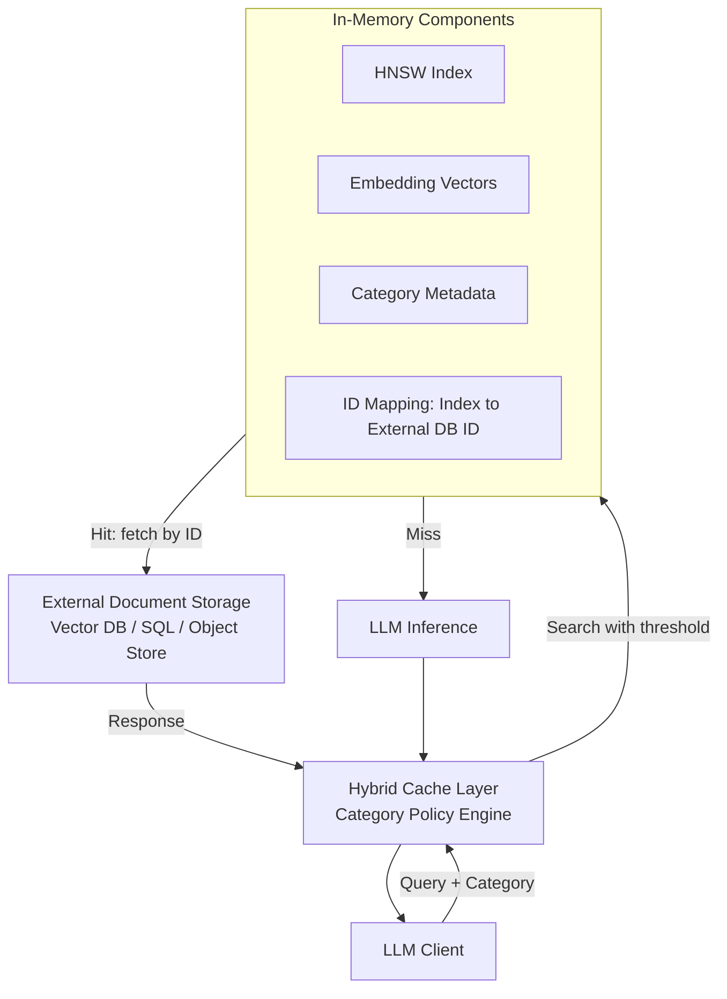

本記事は [Category-Aware Semantic Caching for Heterogeneous LLM Workloads](https://arxiv.org/abs/2510.26835) の解説記事です。

## 論文概要（Abstract）

LLMサービングシステムは異種のクエリワークロードを処理する。コードクエリはEmbedding空間で密にクラスタリングされる一方、会話クエリは疎に分布する。コンテンツの鮮度要件もカテゴリごとに大きく異なり（株価データは分単位、コードパターンは月単位）、クエリの反復パターンも高反復（べき乗則）から低反復（一様分布）までロングテールに分布する。著者らは、こうした異種性に対して均一なキャッシュポリシー（固定閾値・固定TTL）が構造的なミスマッチを生むと指摘し、類似度閾値・TTL・キャッシュクォータをクエリカテゴリごとに動的調整する**Category-Aware Semantic Caching**フレームワークと、インメモリHNSW検索を外部ドキュメントストレージから分離する**ハイブリッドアーキテクチャ**を提案している。

この記事は [Zenn記事: セマンティックキャッシュの安全なヒット判定：鮮度制約とコールドスタート対策の実装設計](https://zenn.dev/0h_n0/articles/20d67b309033bc) の深掘りである。

## 情報源

- **arXiv ID**: 2510.26835
- **URL**: [https://arxiv.org/abs/2510.26835](https://arxiv.org/abs/2510.26835)
- **著者**: Chen Wang（IBM Research）, Xunzhuo Liu（Tencent）, Yue Zhu（IBM Research）, Alaa Youssef（IBM Research）, Priya Nagpurkar（IBM Research）, Huamin Chen（Red Hat）
- **投稿日**: 2025年10月29日
- **カテゴリ**: cs.DB, cs.AI, cs.LG

## 背景と動機

セマンティックキャッシュは、クエリEmbedding間のコサイン類似度が閾値 $\tau$ を超えた場合にキャッシュ済み応答を返す仕組みであり、LLMサービングのレイテンシとAPIコストを削減する手法として普及している。しかし現行の多くのシステムは、単一の類似度閾値・単一のTTL・均等なリソース割当という**均一ポリシー**を全クエリ種別に適用している。

著者らは、これが本番ワークロードの異種性と根本的に矛盾すると論じる。コードクエリはキーワードやAPI名など語彙が制約されるため密なEmbedding空間を形成し（10-NN距離 $\approx 0.12$）、閾値0.80では意味の異なるクエリ間で15%の誤マッチが発生する。一方、会話クエリは表現のばらつきにより疎なEmbedding空間を形成し（10-NN距離 $\approx 0.38$）、同じ閾値0.80では有効な言い換えを取りこぼす。さらにベクトルデータベースはリモート検索コスト（約30ms）を伴うため、ヒット率が15〜20%を下回るカテゴリは経済的に割に合わず、キャッシュ対象から除外せざるを得ない。著者らは、本番トラフィックの30〜40%がこうした低ヒット率カテゴリ（会話・専門分野・リアルタイムデータ等）に該当し、ロングテールとしてキャッシュされないまま残ると報告している。

## 主要な貢献（Key Contributions）

- **ロングテールのキャッシュヒット率分布の特徴づけ**: 本番ワークロードにおいて2〜3の高頻度カテゴリが40〜60%のヒット率でトラフィックの60〜70%を占め、5〜10の低頻度カテゴリが5〜15%のヒット率で残り30〜40%を占めることを分析し、ベクトルデータベースが損益分岐点（15〜20%ヒット率）ゆえにテールカテゴリを除外せざるを得ない理由を明らかにした
- **カテゴリ認識型キャッシュフレームワーク**: 類似度閾値・TTL・クォータを、(1) Embedding空間密度、(2) クエリ反復パターン、(3) コンテンツ鮮度率、(4) 計算コストという4つのカテゴリ特性に基づいて動的に決定する枠組みを提示
- **ハイブリッドアーキテクチャ**: インメモリHNSW検索と外部ドキュメントストレージを分離し、ミスコストを30msから2msに削減、損益分岐ヒット率を15〜20%から3〜5%へ引き下げた
- **ロングテールカテゴリへのカバレッジ拡張の実証**: ハイブリッドアーキテクチャにより、ベクトルデータベースが除外していたテールカテゴリ全体をキャッシュ対象にできることを示した
- **負荷適応型ポリシー**: 下流モデルの負荷に応じて閾値を緩和しTTLを延長することで、過負荷モデルへのトラフィックを9〜17%削減できるという理論的試算を提示（著者ら自身、これは線形関係を仮定した理論的射影であり、本番ワークロードでの実証検証が必要と明記している）

## 技術的詳細（Technical Details）

### カテゴリ分類と4つの特性

著者らは、クエリカテゴリごとに適切なキャッシュポリシーを決定づける4つの特性を整理している。**Embedding空間密度**は語彙の制約度に依存し、密な空間（コード）は誤マッチを避けるため高い閾値（$\geq 0.88$）を要求し、疎な空間（会話）は言い換えを捉えるため低い閾値（$\leq 0.78$）を許容する。**クエリ反復パターン**はコード・ドキュメント系クエリがZipf分布（べき乗則パラメータ $\alpha \approx 1.2$、上位10%のクエリがトラフィックの45%を占める）に従う一方、会話クエリはほぼ一様分布となる。**コンテンツ鮮度率**は更新頻度に対応し、コードパターンは0.01%/日程度の緩やかな変化率であるのに対し、株価は80%/時間という急激な変化率を持つ。**計算コスト**はモデル階層によるコール単価の違いを反映し、高価なモデル（推論系モデル）へのキャッシュヒットはより大きな経済的価値を持つ。

カテゴリの判別自体は、著者らによれば (1) クライアントがリクエストメタデータでカテゴリを明示する**明示的ルーティング**、(2) 異なるAPIエンドポイントが異なるカテゴリに対応する**エンドポイントベース**、(3) 軽量分類器がプロンプトからカテゴリを推定する**プロンプト分類**、のいずれかで実現でき、前二者は追加の分類オーバーヘッドを生じない。

### 動的閾値・TTL調整のアルゴリズム

負荷適応の中核は、モデルのP95レイテンシ $L_p$ とキュー深度 $Q$ から負荷係数 $\lambda$ を算出する式である。

$$
\lambda = \min\left(1,\ \frac{L_p}{L_{target}} \cdot w_L + \frac{Q}{Q_{target}} \cdot w_Q\right)
$$

ここで $L_{target}$・$Q_{target}$ は許容できるレイテンシ・キュー深度の目標値、$w_L$・$w_Q$ は重み（$w_L + w_Q = 1$）である。この $\lambda$ を用いて、現在の閾値とTTLを次式で決定する。

$$
\tau(\lambda) = \tau_0 - \lambda \cdot \delta_{max}, \qquad t(\lambda) = t_0 \cdot \left(1 + \lambda \cdot (\beta_{max} - 1)\right)
$$

$\tau_0$・$t_0$ は基準閾値とTTL、$\delta_{max}$ は最大緩和幅、$\beta_{max}$ はTTLの最大延長係数である。論文中の例では、コード生成カテゴリで $\tau_0=0.90$、$\delta_{max}=0.05$、$t_0=7$日、$\beta_{max}=2$ とした場合、平常負荷（$\lambda=0$）では閾値0.90・TTL 7日、高負荷（$\lambda=1$）では閾値0.85・TTL 14日となる。

### TTL設計とトラフィック削減の関係

TTL延長は、鮮度率 $s$（単位時間あたりのコンテンツ変化割合）を用いて、延長後の陳腐化確率を $s \cdot t_1 = \beta \cdot s \cdot t_0$ と見積もる。例えば5分TTL・鮮度率0.20（5分あたり20%変化）の株価クエリを3倍（15分）に延長すると、陳腐化確率は20%から60%に上昇する。一方、鮮度率0.0001（0.01%/日）のコードパターンでは、TTLを3日から9日に延ばしても陳腐化確率の増加はわずか0.3%→0.9%にとどまり、大きなβでも許容できる。

閾値緩和とヒット率上昇の関係は、カテゴリ固有の感度パラメータ $k$（典型値 $0.5$〜$2.0$／0.01閾値変化あたり）を用いて $\Delta h = k \cdot \delta$ と近似される。基準ヒット率45%のカテゴリで $\delta=0.05$、$k=1.0$ とすると、ヒット率は50%へ上昇し、当該カテゴリのモデルトラフィックは55%から50%へ、約9%削減される。

### インメモリHNSWとハイブリッドアーキテクチャ



従来のベクトルデータベースは、類似度検索そのものをリモートサーバー上で実行し、検索完了後にしきい値を適用する。このためカテゴリ別の閾値を使うには複数回のクエリ（30ms × カテゴリ数）か、カテゴリごとの個別コレクションが必要になり、いずれもコストと運用複雑性を増大させる。また、TTLチェックはドキュメント取得後に行われるため、期限切れエントリに対しても無駄なネットワーク呼び出しが発生し、ポリシー適用がサーバーサイドであるためカテゴリコンテキストを検索時点で利用できない。

著者らが提示するハイブリッドアーキテクチャは、HNSWグラフ構造・384次元Embeddingベクトル（1エントリあたり約1.5KB）・カテゴリメタデータをインメモリに保持し（1エントリ約2KB）、リクエスト本文・レスポンス本文・タイムスタンプは外部ストレージ（ベクトルDB、SQL DB、オブジェクトストアいずれでも可）に分離する。HNSWグラフ探索の各ステップでカテゴリ別閾値を適用し、閾値を超える最初の候補が見つかった時点で探索を打ち切る（early stopping）ため、カテゴリ別しきい値の適用は事実上無コストになる。TTL検証は外部ストレージへのアクセス前にインメモリのメタデータで完結し、期限切れエントリは即座に削除される。ミス時（HNSW探索で閾値超えの候補が見つからない場合）はリモートアクセスなしに即座にミスを返すため、ミスコストは30msから2msへと大幅に削減される。

## 実装のポイント

Algorithm 1（Category-Aware Cache Lookup）は次の手順で構成される: (1) カテゴリ設定を取得、(2) 当該カテゴリでキャッシュが許可されているか確認（コンプライアンス対応）、(3) クエリEmbeddingを生成、(4) カテゴリ別閾値でHNSW探索、(5) ミス時は外部アクセスなしに即座にNULLを返す、(6) ヒット時はTTLを検証してから外部ストレージにフェッチする。

コンプライアンス制約（HIPAA、GDPRなど）を持つカテゴリは `allowCaching=false` として設定でき、該当クエリは一切キャッシュに入らないため、規制対象データの一時的な滞留すら発生しない。エビクションは `優先度 × 1/経過時間 × ヒット率` というスコアで行われ、単純なLRU/LFUと異なり経済的価値を反映した削除順位を実現する。負荷適応の実装では、移動平均（5〜10分ウィンドウ）による平滑化と、負荷係数が0.1以上変化しない限り調整しないヒステリシスによって、閾値の振動を防いでいる。また最小閾値（密な空間で $\tau_{min}=0.80$）と最大TTL（$t_{max}=2\times t_0$）を安全境界として設定し、誤ヒット率が閾値（例: 5%）を超えた場合は緩和幅 $\delta_{max}$ を縮小するフィードバックループを備える。

## Production Deployment Guide

本論文のアーキテクチャは、Redisのようなインメモリストアと外部ドキュメントストア（またはベクトルDB）を組み合わせることでAWS上に実装できる。以下は、Zenn記事の3層キャッシュアーキテクチャとも親和性の高い、カテゴリ認識型ハイブリッドキャッシュの実装パターンである。

### アーキテクチャ選定

トラフィック規模に応じて2つの構成を検討する。

| 構成 | インメモリ層 | 外部ストレージ層 | 想定トラフィック | 月額概算（東京リージョン） |
|------|------------|-----------------|-----------------|--------------------------|
| Small | ElastiCache for Redis（シングルノード、HNSWはRedis Stackのベクトル検索を利用） | DynamoDB（レスポンス本文） | ~10万 req/日 | $150-400 |
| Medium | ElastiCache for Redis（クラスタモード） | DynamoDB + S3（大きなレスポンス） | ~100万 req/日 | $800-2,000 |
| Large | EC2上に自前ホストしたインメモリHNSW（faiss/hnswlib）＋Redisをメタデータ層に | Aurora PostgreSQL + pgvector（コールドストレージ兼監査ログ） | 1000万+ req/日 | $3,000-8,000 |

**注意**: 以下のコスト試算は2026年8月時点のAWS ap-northeast-1リージョン料金に基づく概算値であり、実際のコストはトラフィックパターン、インスタンスタイプ、リザーブド割引の有無により変動する。最新料金はAWS Pricing Calculatorで確認することを推奨する。

### AWS実装パターン

**Small構成**: ElastiCache for Redis（Redis Stack互換、`FT.CREATE` によるベクトルインデックス）でカテゴリメタデータとEmbeddingを保持し、しきい値判定をRedis側のクエリで完結させる。レスポンス本文はDynamoDBに格納し、Redis側にはドキュメントIDのみを保持する。TTLはRedisのキー単位TTL機構とカテゴリポリシーエンジン（Lambda関数）を組み合わせて動的に設定する。

**Medium構成**: Redisクラスタモードで水平スケールし、カテゴリごとにシャーディングキーを分離することで、高頻度カテゴリ（コード等）のホットスポットを他カテゴリのトラフィックから隔離する。負荷適応ロジック（式(7)）はECS Fargate上のポリシーエンジンサービスとして実装し、CloudWatchメトリクス（モデルのP95レイテンシ、SQSキュー深度）を入力として閾値・TTLを再計算する。

**Large構成**: インメモリHNSWをEC2（メモリ最適化インスタンス、例: r7g.4xlarge）上でhnswlibまたはfaissを用いて自前ホストし、Redisはカテゴリメタデータとエビクションスコアの管理に専念させる。外部ストレージはAurora PostgreSQL + pgvectorとし、コールドパス（HNSWミス時の完全一致検索や監査ログ）を担わせる。

### Terraformインフラコード（Medium構成: ElastiCache Redisクラスタ）

```hcl
# category_aware_cache_infra.tf
# Category-Aware Semantic Cache - ElastiCache Redis クラスタ構成

provider "aws" {
  region = "ap-northeast-1"
}

# --- ElastiCache Subnet Group ---
resource "aws_elasticache_subnet_group" "cache_subnet" {
  name       = "category-cache-subnet"
  subnet_ids = var.private_subnet_ids
}

# --- ElastiCache Redis クラスタ（カテゴリ別しきい値・TTLメタデータ + HNSWベクトル） ---
resource "aws_elasticache_replication_group" "category_cache" {
  replication_group_id       = "category-aware-semantic-cache"
  description                 = "Category-aware semantic cache with per-category threshold/TTL"
  engine                       = "redis"
  engine_version               = "7.1"
  node_type                    = "cache.r7g.xlarge"
  num_node_groups               = 3
  replicas_per_node_group       = 1
  automatic_failover_enabled    = true
  multi_az_enabled              = true
  subnet_group_name             = aws_elasticache_subnet_group.cache_subnet.name
  security_group_ids            = [aws_security_group.cache_sg.id]
  at_rest_encryption_enabled    = true
  transit_encryption_enabled    = true

  parameter_group_name = aws_elasticache_parameter_group.redis_stack.name
}

resource "aws_elasticache_parameter_group" "redis_stack" {
  name   = "category-cache-params"
  family = "redis7"

  parameter {
    name  = "maxmemory-policy"
    value = "volatile-lfu"  # 経済的価値を反映したエビクションに近似
  }
}

# --- DynamoDB: レスポンス本文（外部ドキュメントストレージ） ---
resource "aws_dynamodb_table" "response_store" {
  name         = "semantic-cache-responses"
  billing_mode = "PAY_PER_REQUEST"
  hash_key     = "doc_id"

  attribute {
    name = "doc_id"
    type = "S"
  }

  ttl {
    attribute_name = "expires_at"
    enabled         = true
  }

  point_in_time_recovery {
    enabled = true
  }
}

# --- ポリシーエンジン用ECS Fargateサービス ---
resource "aws_ecs_service" "policy_engine" {
  name            = "category-policy-engine"
  cluster         = aws_ecs_cluster.cache_cluster.id
  task_definition = aws_ecs_task_definition.policy_engine.arn
  desired_count   = 2
  launch_type     = "FARGATE"

  network_configuration {
    subnets          = var.private_subnet_ids
    security_groups  = [aws_security_group.policy_sg.id]
    assign_public_ip = false
  }
}

resource "aws_ecs_cluster" "cache_cluster" {
  name = "category-aware-cache-cluster"
}

resource "aws_security_group" "cache_sg" {
  name_prefix = "category-cache-sg-"
  vpc_id      = var.vpc_id

  ingress {
    from_port       = 6379
    to_port         = 6379
    protocol        = "tcp"
    security_groups = [aws_security_group.policy_sg.id]
  }
}

resource "aws_security_group" "policy_sg" {
  name_prefix = "policy-engine-sg-"
  vpc_id      = var.vpc_id
}

variable "vpc_id" {
  type = string
}

variable "private_subnet_ids" {
  type = list(string)
}
```

### カテゴリ認識型キャッシュルックアップの実装

```python
"""Category-Aware Semantic Cache のルックアップ実装（Algorithm 1準拠）。

インメモリHNSW探索と外部ドキュメントストレージ（DynamoDB等）を分離し、
カテゴリ別の類似度閾値・TTLを適用する。
"""
from __future__ import annotations

import time
from dataclasses import dataclass
from typing import Protocol


@dataclass(frozen=True)
class CategoryConfig:
    """カテゴリ別のキャッシュポリシー設定。

    Attributes:
        allow_caching: コンプライアンス制約でキャッシュを禁止するか。
        threshold: 類似度閾値（0.0-1.0）。密な空間ほど高くする。
        ttl_seconds: キャッシュエントリの有効期限（秒）。
        priority: エビクション時の優先度スコア。
    """

    allow_caching: bool
    threshold: float
    ttl_seconds: float
    priority: float


class VectorIndex(Protocol):
    """インメモリHNSW探索のインターフェース。"""

    def search(self, embedding: list[float], threshold: float) -> list[str]:
        """threshold を超える最初の候補IDを返す（early stopping）。"""
        ...


class DocumentStore(Protocol):
    """外部ドキュメントストレージのインターフェース。"""

    def fetch_by_id(self, doc_id: str) -> dict | None:
        """ドキュメントIDでレスポンス本文を取得する。"""
        ...


@dataclass(frozen=True)
class CacheMetadata:
    """インメモリに保持するキャッシュエントリのメタデータ。"""

    doc_id: str
    created_at: float


def category_aware_lookup(
    query_embedding: list[float],
    category: str,
    configs: dict[str, CategoryConfig],
    index: VectorIndex,
    metadata_store: dict[str, CacheMetadata],
    document_store: DocumentStore,
) -> dict | None:
    """カテゴリ認識型キャッシュルックアップを実行する（Algorithm 1）。

    Args:
        query_embedding: クエリのEmbeddingベクトル。
        category: クエリのカテゴリ（例: "code_generation"）。
        configs: カテゴリごとのポリシー設定。
        index: インメモリHNSWインデックス。
        metadata_store: インデックスIDからメタデータへのマッピング。
        document_store: 外部ドキュメントストレージ。

    Returns:
        キャッシュヒット時はレスポンス本文の辞書、ミス時は None。
    """
    config = configs[category]

    if not config.allow_caching:
        return None  # コンプライアンス制約: キャッシュ自体を禁止

    candidates = index.search(query_embedding, threshold=config.threshold)
    if not candidates:
        return None  # ミス: 外部ストレージへの問い合わせなしで即座に返す

    idx = candidates[0]
    meta = metadata_store.get(idx)
    if meta is None:
        return None

    age = time.time() - meta.created_at
    if age > config.ttl_seconds:
        del metadata_store[idx]  # 期限切れエントリを即座に削除
        return None

    return document_store.fetch_by_id(meta.doc_id)
```

### 監視設定

```python
"""カテゴリ認識型キャッシュの監視アラーム設定（CloudWatch）。"""
import boto3

cloudwatch = boto3.client("cloudwatch", region_name="ap-northeast-1")


def create_cache_alarms(cluster_id: str, category: str) -> None:
    """カテゴリ別のヒット率・誤ヒット率アラームを設定する。

    Args:
        cluster_id: ElastiCache Redis クラスタID。
        category: 監視対象のクエリカテゴリ名。
    """
    # ヒット率が損益分岐点（3-5%）を下回った場合のアラーム
    cloudwatch.put_metric_alarm(
        AlarmName=f"cache-{cluster_id}-{category}-low-hit-rate",
        MetricName=f"CacheHitRate_{category}",
        Namespace="CategoryAwareCache/Custom",
        Statistic="Average",
        Period=300,
        EvaluationPeriods=3,
        Threshold=0.03,
        ComparisonOperator="LessThanThreshold",
        AlarmActions=["arn:aws:sns:ap-northeast-1:123456789:cache-ops-alerts"],
    )

    # 誤ヒット率（false positive rate）が安全境界を超えた場合のアラーム
    cloudwatch.put_metric_alarm(
        AlarmName=f"cache-{cluster_id}-{category}-false-positive",
        MetricName=f"FalsePositiveRate_{category}",
        Namespace="CategoryAwareCache/Custom",
        Statistic="Average",
        Period=300,
        EvaluationPeriods=2,
        Threshold=0.05,
        ComparisonOperator="GreaterThanThreshold",
        AlarmActions=["arn:aws:sns:ap-northeast-1:123456789:cache-ops-alerts"],
    )
```

### コスト最適化・運用チェックリスト

**アーキテクチャ選定**:
- [ ] ワークロードがロングテールのヒット率分布を持つか確認（2〜3の高頻度カテゴリ＋5〜10の低頻度カテゴリ）
- [ ] キャッシュサイズが数万エントリを超える場合のみハイブリッドアーキテクチャを検討（小規模データセットでは純インメモリキャッシュの方がシンプル）
- [ ] コンプライアンス要件（HIPAA/GDPR等）があるカテゴリを事前に洗い出し `allow_caching=false` を設定

**ポリシーチューニング**:
- [ ] 密な空間（コード等）は閾値 $\geq 0.88$、疎な空間（会話等）は閾値 $\leq 0.78$ を初期値とする
- [ ] 安定コンテンツはTTL 3日以上、揮発性コンテンツはTTL 10分以下を初期値とする
- [ ] A/Bテストでトラフィックの一部を代替しきい値にルーティングし、ヒット率と精度を計測してから採用する

**負荷適応の安全策**:
- [ ] 移動平均（5〜10分ウィンドウ）で負荷指標を平滑化し、閾値の振動を防ぐ
- [ ] ヒステリシス（負荷係数の変化が0.1未満なら調整しない）を実装する
- [ ] 最小閾値・最大TTLの安全境界を設定し、誤ヒット率の監視で $\delta_{max}$ をフィードバック調整する

**スケーリング**:
- [ ] HNSW探索は $O(\log n)$ で、1Mエントリで2〜3ms、1000万エントリで5〜8ms程度が目安（1000万エントリを超える場合はカテゴリまたはベクトル空間領域でのシャーディングを検討）
- [ ] エントリあたりのメモリオーバーヘッド（IDマッピング16B、カテゴリメタデータ64B、統計32B、合計約112B）を容量計画に含める

## 実験結果

本論文は大規模な実測ベンチマークよりも、損益分岐点の理論的導出と代表的な本番ワークロード分布の分析に重点を置いた構成になっている点に留意が必要である。著者らは、100K query/hourの代表的な本番ワークロードにおいて、コード生成（トラフィック35%・ヒット率55%）とAPIドキュメント（25%・45%）の2カテゴリでトラフィックの60%を占め、会話チャット（15%・12%）・金融データ（10%・8%）・法務クエリ（8%・10%）・医療クエリ（4%・6%）・専門分野（3%・7%）の5カテゴリで残り40%を占めるという分布を示している（Table 1）。

損益分岐分析では、ヒット率を $h$、キャッシュなしのLLM推論レイテンシを $T_{llm}$ として、ベクトルデータベース構成の期待レイテンシ $L_{vdb} = 30 + 5h + (1-h)T_{llm}$ [ms] とキャッシュなしのレイテンシ $T_{llm}$ を比較すると、損益分岐ヒット率は $h > 30 / (T_{llm}-5)$ となる。これは $T_{llm}=200$ms（高速モデル）で15.4%、$T_{llm}=500$ms（低速モデル）で6.1%であり、Table 1の低頻度5カテゴリ（6〜12%のヒット率）はいずれもこの水準を下回る。一方、ハイブリッドアーキテクチャでは $L_{hybrid} = 2 + 5h + (1-h)T_{llm}$ となり、損益分岐ヒット率は $h > 2/(T_{llm}-5)$ ── $T_{llm}=200$msで1.0%、$T_{llm}=500$msで0.4%まで低下する。著者らはこれを「高速モデルで15倍、低速モデルで10倍の損益分岐点引き下げ」と表現しており、Table 1の低頻度5カテゴリすべてがハイブリッド構成の損益分岐点を上回ることになる。

負荷適応ポリシーによるトラフィック削減（9〜17%）については、著者ら自身が「線形関係を仮定した理論的射影であり、実際の性能はクエリ分布・Embedding空間の幾何構造・カテゴリ固有の感度パラメータに依存するため、本番ワークロードでの実証検証が必要」と明記しており、実測値ではなく試算値として扱うべきである。

## 実運用への応用

本論文のフレームワークは、Zenn記事で扱われている「安全なヒット判定」の設計と補完関係にある。Zenn記事が鮮度制約（Freshness Gate）や根拠検証によって**個々のキャッシュヒットの正しさ**を保証する仕組みを論じているのに対し、本論文は**どのクエリカテゴリをどのポリシーでキャッシュすべきか**という上位のリソース配分問題を扱っている。両者を組み合わせることで、カテゴリごとに適切な閾値・TTLを設定した上で、各ヒットについてさらに鮮度・根拠を検証する多層防御が構築できる。

実装上の示唆として、著者らが提示するインメモリHNSW／外部ストレージ分離パターンは、Redisをインメモリ層に用いる3層キャッシュアーキテクチャと親和性が高い。特に、ミスコストを30msから2msへ削減する設計は、Zenn記事のコールドスタート対策（クエリログリプレイによる早期ヒット率確保）とも組み合わせやすく、低頻度カテゴリであっても短時間でヒット率を積み上げられる可能性がある。ただし、負荷適応ポリシーは理論的射影の段階にとどまるため、本番導入時にはA/Bテストや段階的ロールアウトによる実測での検証が不可欠である。

## 関連研究

- **MeanCache [Gill et al., 2024]**: ベクトルデータベースを用いたユーザー中心のセマンティックキャッシュ。本論文と同様にLLM Webサービスを対象とするが、均一ポリシーに依拠する
- **KVShare [Yang et al., 2025]**: LLM推論層でのセマンティック認識KVキャッシュ共有。マルチテナント環境での効率化を扱う
- **HNSW [Malkov & Yashunin, 2020]**: 対数計算量の近似最近傍探索アルゴリズム。本論文のインメモリ探索層の基盤
- **Milvus / Qdrant / Weaviate**: 分散ベクトル検索を提供する代表的なベクトルデータベース。本論文はこれらが抱えるポスト検索でのしきい値適用・コレクション単位の設定・サーバーサイドポリシー適用という3つの制約を指摘している

## まとめと今後の展望

本論文は、異種LLMワークロードにおける均一キャッシュポリシーの限界を、Embedding空間密度・反復パターン・鮮度率・計算コストという4つのカテゴリ特性から体系的に分析し、インメモリHNSWと外部ストレージを分離するハイブリッドアーキテクチャによって低ヒット率カテゴリの経済性を大きく改善できることを示した。ミスコストの30ms→2ms削減という設計上の効果は明確な根拠を伴う一方、負荷適応ポリシーによる9〜17%のトラフィック削減は著者ら自身が認める理論的射影であり、今後は実ワークロードでの実証実験による検証が求められる。ドキュメントキャッシング・圧縮・多層ストレージ（L1インメモリ／L2ローカルSSD／L3外部DB）といった拡張も論文中で示唆されており、大規模本番環境への適用にはこれらの拡張と組み合わせた評価が有用だろう。

## 参考文献

- **arXiv**: [https://arxiv.org/abs/2510.26835](https://arxiv.org/abs/2510.26835)
- **Related Zenn article**: [https://zenn.dev/0h_n0/articles/20d67b309033bc](https://zenn.dev/0h_n0/articles/20d67b309033bc)
- Gill, W., Chandra, J., Kumar, R., Guo, M. "MeanCache: User-Centric Semantic Caching for LLM Web Services." arXiv:2403.02694, 2024.
- Yang, H. et al. "KVShare: An LLM Service System with Efficient and Effective Multi-Tenant KV Cache Reuse." arXiv:2503.16525, 2025.
- Malkov, Y. A., Yashunin, D. A. "Efficient and Robust Approximate Nearest Neighbor Search Using Hierarchical Navigable Small World Graphs." IEEE TPAMI, 42(4):824-836, 2020.
