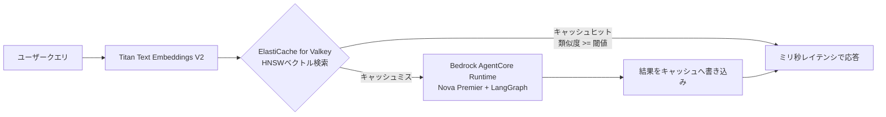
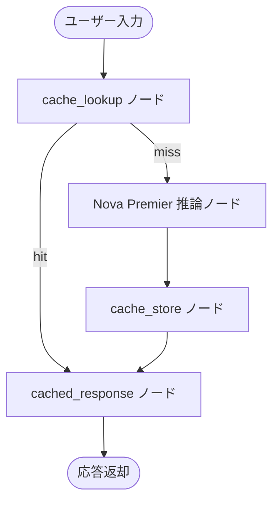

本記事は [Lower cost and latency for AI using Amazon ElastiCache as a semantic cache with Amazon Bedrock](https://aws.amazon.com/blogs/database/lower-cost-and-latency-for-ai-using-amazon-elasticache-as-a-semantic-cache-with-amazon-bedrock/) の解説記事です。

## ブログ概要

AWS Database Blogでは、Amazon ElastiCache for Valkey（v8.2以降）のベクトル検索機能を使い、Amazon Bedrockの推論結果をセマンティックキャッシュとして再利用する実装パターンが解説されています。LangGraphで構築したエージェントの前段にRead-throughキャッシュを配置し、Titan Text Embeddings V2でクエリをベクトル化してHNSWインデックスで類似検索する構成です。SemBenchmarkLmArenaデータセット（63,796クエリ）を用いた検証では、類似度閾値0.75で日次コスト86.3%削減、レイテンシ88.3%削減という結果が報告されています。

この記事は [Zenn記事: セマンティックキャッシュの安全なヒット判定：鮮度制約とコールドスタート対策の実装設計](https://zenn.dev/0h_n0/articles/20d67b309033bc) の深掘りです。

## 情報源

- **種別**: 企業テックブログ（AWS Database Blog）
- **タイトル**: Lower cost and latency for AI using Amazon ElastiCache as a semantic cache with Amazon Bedrock
- **著者**: Meet Bhagdev, Chaitanya Nuthalapati, Jungwoo Song, Utkarsh Shah
- **公開日**: 2025年11月26日
- **URL**: [https://aws.amazon.com/blogs/database/lower-cost-and-latency-for-ai-using-amazon-elasticache-as-a-semantic-cache-with-amazon-bedrock/](https://aws.amazon.com/blogs/database/lower-cost-and-latency-for-ai-using-amazon-elasticache-as-a-semantic-cache-with-amazon-bedrock/)

## 技術的背景

LLM推論はトークン単価に加えてレイテンシもコストの一部です。同一・類似の質問が繰り返されるチャットボットやFAQ応答、検索補助エージェントでは、毎回LLMを呼び出すと無駄な推論コストとレイテンシが積み上がります。従来のキャッシュは完全一致（exact match）のキー・バリュー型が中心で、「Pythonでリストをソートする方法は？」と「Pythonでリストを並び替えるには？」のような表現揺れを同一クエリとして扱えません。

セマンティックキャッシュは、クエリを埋め込みベクトルに変換し、コサイン類似度などのベクトル距離でキャッシュエントリを検索することで、表現の揺れを吸収したヒット判定を可能にします。Zenn記事「セマンティックキャッシュの安全なヒット判定」で論じられているように、類似度閾値の設計・鮮度制約（TTL）・コールドスタート時のヒット率低下は実運用上の主要な論点です。AWS公式ブログは、この課題にAmazon ElastiCache for Valkeyのベクトル検索機能とAmazon Bedrockを組み合わせて対処する具体的な実装を示しています。

## 実装アーキテクチャ

AWS公式ブログで紹介されているアーキテクチャは、Read-throughキャッシュパターンに基づきます。



処理フローは次の4段階です。

1. ユーザークエリをAmazon Titan Text Embeddings V2で1024次元ベクトルに変換する
2. Amazon ElastiCache for ValkeyのHNSWインデックスに対してベクトル検索を実行し、COSINE類似度が閾値以上の既存エントリを探索する
3. キャッシュヒット時はLLM呼び出しを行わず、ミリ秒オーダーのレイテンシで応答を返却する
4. キャッシュミス時はAmazon Bedrock AgentCore Runtime上のNova Premierモデル（LangGraphでオーケストレーション）を呼び出し、生成結果をキャッシュへ書き込む

キャッシュストア（ブログ中でValkeyStoreと呼ばれるコンポーネント）の設定は以下の通りです。

| 設定項目 | 値 |
|:---|:---|
| コレクション名 | `semantic_cache` |
| ベクトル化対象フィールド | `query` |
| ベクトル次元数 | 1024（Titan V2出力サイズ） |
| 距離メトリック | COSINE類似度 |
| インデックスアルゴリズム | HNSW |

Amazon ElastiCache for Valkey v8.2以降で提供されるネイティブベクトル検索機能により、埋め込みベクトルの保存とHNSW近似最近傍探索を専用ベクトルDBを追加導入せずに実現できる点がこのアーキテクチャの特徴です。

## Production Deployment Guide

### AWS公式ブログのリファレンス実装（LangGraph + ValkeyStore）

AWS公式ブログでは、LangGraphのカスタムStore実装としてValkeyStoreを定義し、エージェントのcheckpointerとは別にセマンティックキャッシュ層として組み込むパターンが示されています。以下は、ブログで説明されている構成要素を型ヒント・Docstring付きのPythonコードとして整理したものです。

```python
"""Amazon ElastiCache for Valkeyを用いたセマンティックキャッシュ層.

AWS公式ブログ「Lower cost and latency for AI using Amazon
ElastiCache as a semantic cache with Amazon Bedrock」で解説されている
Read-throughキャッシュパターンの実装イメージ。
実際のプロダクション実装では langgraph.store のカスタムStore
インターフェースに準拠させる。
"""

from __future__ import annotations

from dataclasses import dataclass
from typing import Protocol

import numpy as np


class EmbeddingClient(Protocol):
    """Titan Text Embeddings V2互換の埋め込みクライアント."""

    def embed(self, text: str) -> list[float]:
        """テキストを1024次元ベクトルに変換する."""
        ...


@dataclass(frozen=True)
class CacheLookupResult:
    """キャッシュ検索結果.

    Attributes:
        hit: キャッシュヒットしたかどうか
        response: ヒット時のキャッシュ済みレスポンス（ミス時はNone）
        similarity: クエリと最近傍エントリのCOSINE類似度
    """

    hit: bool
    response: str | None
    similarity: float


class ValkeySemanticCache:
    """ElastiCache for Valkeyを使ったセマンティックキャッシュ.

    AWS公式ブログのValkeyStore設定（コレクション名 semantic_cache、
    ベクトル化フィールド query、次元数1024、COSINE類似度、HNSW）
    に準拠する。

    Attributes:
        embedding_client: クエリをベクトル化するクライアント
        similarity_threshold: キャッシュヒットとみなす類似度の下限
        ttl_seconds: キャッシュエントリの有効期限（秒）
    """

    def __init__(
        self,
        embedding_client: EmbeddingClient,
        similarity_threshold: float = 0.75,
        ttl_seconds: int = 82_800,  # 23時間（日次更新データ向け）
    ) -> None:
        self._embedding_client = embedding_client
        self._similarity_threshold = similarity_threshold
        self._ttl_seconds = ttl_seconds

    def lookup(self, query: str) -> CacheLookupResult:
        """クエリに対する既存キャッシュをHNSW近似最近傍探索する.

        Args:
            query: ユーザーからの入力クエリ

        Returns:
            類似度が閾値以上のエントリが見つかればhit=Trueの結果、
            見つからなければhit=Falseの結果を返す。

        Note:
            実際のAmazon ElastiCache for Valkey呼び出しは
            FT.SEARCH（ベクトルKNNクエリ）で行う。ここでは
            アーキテクチャ理解のための擬似実装とする。
        """
        query_vector = self._embedding_client.embed(query)
        nearest = self._search_hnsw(query_vector)
        if nearest is None or nearest.similarity < self._similarity_threshold:
            return CacheLookupResult(hit=False, response=None, similarity=0.0)
        return CacheLookupResult(
            hit=True,
            response=nearest.response,
            similarity=nearest.similarity,
        )

    def store(self, query: str, response: str) -> None:
        """クエリとLLM応答をキャッシュへ書き込む（TTL付き）.

        Args:
            query: ユーザークエリ
            response: LLM生成結果
        """
        query_vector = self._embedding_client.embed(query)
        self._write_entry(query_vector, response, ttl=self._ttl_seconds)

    def _search_hnsw(self, vector: list[float]) -> "_NearestEntry | None":
        """HNSWインデックスに対するベクトル検索（実装はクライアントに委譲）."""
        raise NotImplementedError(
            "ElastiCache for Valkeyクライアント固有のFT.SEARCH呼び出しを実装する"
        )

    def _write_entry(
        self, vector: list[float], response: str, ttl: int
    ) -> None:
        """ベクトルとレスポンスをTTL付きで書き込む（実装はクライアントに委譲）."""
        raise NotImplementedError(
            "ElastiCache for Valkeyクライアント固有の書き込み処理を実装する"
        )


@dataclass(frozen=True)
class _NearestEntry:
    """HNSW検索で得られた最近傍エントリ."""

    response: str
    similarity: float


def cosine_similarity(a: list[float], b: list[float]) -> float:
    """2つのベクトル間のCOSINE類似度を計算する.

    AWS公式ブログのValkeyStore設定における距離メトリックと同一の
    定義（1に近いほど類似）を用いる。

    Args:
        a: ベクトルA
        b: ベクトルB

    Returns:
        -1.0から1.0の範囲のCOSINE類似度
    """
    vec_a, vec_b = np.asarray(a), np.asarray(b)
    denom = np.linalg.norm(vec_a) * np.linalg.norm(vec_b)
    if denom == 0.0:
        return 0.0
    return float(np.dot(vec_a, vec_b) / denom)
```

このコードはAWS公式ブログが説明する概念（埋め込み生成 → HNSW検索 → 閾値判定 → TTL付き書き込み）を型安全に表現したものであり、実際のElastiCache for Valkeyクライアント呼び出し（`FT.SEARCH`コマンド等）はマネージドライブラリ側の実装に依存します。

### LangGraphへの組み込みパターン

AWS公式ブログでは、Bedrock AgentCore Runtime上で動作するLangGraphエージェントのノードとして、セマンティックキャッシュのlookup/storeを組み込む構成が説明されています。エージェントの推論ノードに入る前にキャッシュlookupノードを配置し、ヒットした場合はLLM呼び出しノードをスキップするグラフ構造です。



マルチターン対話では、AWS公式ブログは会話履歴全体をベクトル化するのではなく「現在のメッセージ＋検索コンテキストのみ」を埋め込み対象とすることを推奨しています。これは、会話が長くなるほど履歴全体のベクトルがクエリごとに固有になり、類似クエリでもキャッシュヒットしにくくなる問題を避けるためです。

### インフラ構築（Terraform）

AWS公式ブログの構成をTerraformで表現すると、ElastiCache for Valkeyレプリケーショングループとセキュリティグループの定義は以下のようになります。

```hcl
# ElastiCache for Valkey（v8.2以降、ベクトル検索対応）
# semantic_cacheコレクション用のレプリケーショングループ

resource "aws_elasticache_replication_group" "semantic_cache" {
  replication_group_id       = "semantic-cache-valkey"
  description                 = "Semantic cache for Bedrock inference results"
  engine                      = "valkey"
  engine_version               = "8.2"
  node_type                   = "cache.r7g.large"
  num_cache_clusters           = 2
  automatic_failover_enabled   = true
  at_rest_encryption_enabled   = true
  transit_encryption_enabled   = true
  security_group_ids           = [aws_security_group.semantic_cache.id]
  subnet_group_name            = aws_elasticache_subnet_group.semantic_cache.name

  parameter_group_name = aws_elasticache_parameter_group.semantic_cache.name
}

resource "aws_elasticache_parameter_group" "semantic_cache" {
  name   = "semantic-cache-params"
  family = "valkey8"

  # ベクトル検索インデックスの永続化を有効化
  parameter {
    name  = "search-enabled"
    value = "yes"
  }
}

resource "aws_security_group" "semantic_cache" {
  name_prefix = "semantic-cache-"
  vpc_id      = var.vpc_id

  ingress {
    from_port       = 6379
    to_port         = 6379
    protocol        = "tcp"
    security_groups = [var.agentcore_runtime_sg_id]
  }
}
```

IAM権限は、Bedrock AgentCore Runtime実行ロールに対してTitan Text Embeddings V2およびNova Premierの`bedrock:InvokeModel`アクションを許可し、ElastiCacheへのアクセスはVPC内のセキュリティグループで制御します。

```hcl
resource "aws_iam_role_policy" "bedrock_invoke" {
  name = "bedrock-semantic-cache-invoke"
  role = aws_iam_role.agentcore_runtime.id

  policy = jsonencode({
    Version = "2012-10-17"
    Statement = [
      {
        Effect = "Allow"
        Action = ["bedrock:InvokeModel"]
        Resource = [
          "arn:aws:bedrock:*::foundation-model/amazon.titan-embed-text-v2:0",
          "arn:aws:bedrock:*::foundation-model/amazon.nova-premier-v1:0",
        ]
      }
    ]
  })
}
```

### 監視設計

AWS公式ブログの構成に基づき、キャッシュヒット率とコスト削減効果を継続的に監視するには、CloudWatchカスタムメトリクスとして「lookup回数」「hit回数」「LLM呼び出しコスト」を記録し、ヒット率が想定レンジ（ブログの検証では閾値0.75で90.3%）から乖離した場合にアラートする設計が現実的です。

```hcl
resource "aws_cloudwatch_metric_alarm" "cache_hit_rate_drop" {
  alarm_name          = "semantic-cache-hit-rate-drop"
  comparison_operator = "LessThanThreshold"
  evaluation_periods  = 3
  metric_name         = "CacheHitRate"
  namespace           = "Custom/SemanticCache"
  period              = 300
  statistic           = "Average"
  threshold           = 70 # ヒット率70%を下回ったらアラート
  alarm_description   = "Semantic cache hit rate dropped below expected range"
  alarm_actions       = [aws_sns_topic.cache_alerts.arn]
}

resource "aws_sns_topic" "cache_alerts" {
  name = "semantic-cache-alerts"
}
```

## パフォーマンス最適化

AWS公式ブログでは、SemBenchmarkLmArenaデータセット（63,796クエリ、Claude 3 Haiku使用）を用いた検証結果として、類似度閾値ごとのトレードオフが定量的に示されています。

| 類似度閾値 | キャッシュヒット率 | 精度 | 日次コスト削減 | レイテンシ削減 |
|:---:|:---:|:---:|:---:|:---:|
| 0.8 | 87.6% | 91.8% | 84.6% | 86.1% |
| 0.75 | 90.3% | 91.2% | 86.3% | 88.3% |
| 0.5 | 94.3% | 87.5% | 88.0% | 89.3% |

ベースライン（キャッシュなし）は日次$49.50・平均レイテンシ4.35秒であるのに対し、閾値0.75のキャッシュありでは日次$6.80・平均レイテンシ0.51秒まで削減されたとAWS公式ブログでは報告されています。個別クエリ単位では最大59倍のレイテンシ改善（6.51秒→0.11秒）も観測されています。

閾値を下げるほどヒット率とコスト削減率は向上しますが、精度（正しい応答が返る割合）はトレードオフとして低下します。AWS公式ブログの結果を見る限り、0.75付近がヒット率・精度・コスト削減のバランス点として妥当な初期値と考えられます。Zenn記事「セマンティックキャッシュの安全なヒット判定」で論じられている閾値設計の議論とも整合的で、閾値はユースケースの許容誤答率に応じて調整すべきパラメータです。

## 運用での学び

AWS公式ブログでは、セマンティックキャッシュ導入時の実践的な注意点として以下が挙げられています。

**対象クエリの選定**: 安定した繰り返しクエリ（FAQ、定型的な問い合わせ）にフォーカスし、リアルタイム性が求められる動的データ（在庫状況、株価等）を含むクエリはキャッシュ対象から除外することが推奨されています。

**マルチターン対話の埋め込み設計**: 会話履歴全体ではなく、現在のメッセージと検索コンテキストのみを埋め込み対象とすることで、会話が長くなるほどキャッシュヒット率が下がる問題を回避します。

**TTL管理**: キャッシュの鮮度はデータ更新頻度に合わせて設計する必要があり、AWS公式ブログでは日次更新されるカタログ情報に対して23時間TTLを設定する例が示されています。データ更新サイクルより短いTTLを設定することで、古い情報がキャッシュヒットとして返却されるリスクを抑えられます。

**パーソナライゼーション**: ユーザーやセグメントによって応答が異なるべきクエリでは、キャッシュのルックアップスコープをユーザー/セグメント単位に分離する必要があると指摘されています。全ユーザー共通のキャッシュ空間を使うと、パーソナライズされた回答が別ユーザーに誤って返却されるリスクが生じます。

## 学術研究との関連

セマンティックキャッシュの研究領域では、キャッシュヒット判定における意味的類似度の閾値設計と、鮮度制約の両立が主要な論点となっています。GPTCache等のOSS実装は本ブログと同様にベクトル類似度検索によるヒット判定を採用しており、FreshCacheやGroundedCacheのような研究提案では、埋め込み類似度だけでなく検索拡張生成（RAG）のコンテキストや時間的鮮度シグナルを組み合わせたヒット判定が検討されています。AWS公式ブログのアプローチはTTLベースの鮮度制約というシンプルな設計に留まっており、より高度な鮮度検証（例えば情報源の更新検知に基づく動的な無効化）は今後の発展余地として位置づけられます。

## まとめと実践への示唆

AWS公式ブログでは、Amazon ElastiCache for ValkeyのHNSWベクトル検索とAmazon Bedrock（Titan Text Embeddings V2 + Nova Premier + LangGraph）を組み合わせたセマンティックキャッシュにより、SemBenchmarkLmArenaデータセット上で日次コスト86.3%削減・レイテンシ88.3%削減（類似度閾値0.75時点）という成果が報告されています。実装にあたっては、類似度閾値をユースケースの許容誤答率に応じて選定し、TTLをデータ更新頻度に合わせ、マルチターン対話では履歴全体でなく直近メッセージのみを埋め込み対象とすることが重要です。Zenn記事で論じたヒット判定の安全性設計と組み合わせることで、コスト削減と応答品質を両立するキャッシュ層を構築できます。

## 参考文献

1. Bhagdev, M., Nuthalapati, C., Song, J., & Shah, U. (2025). "Lower cost and latency for AI using Amazon ElastiCache as a semantic cache with Amazon Bedrock." AWS Database Blog. [https://aws.amazon.com/blogs/database/lower-cost-and-latency-for-ai-using-amazon-elasticache-as-a-semantic-cache-with-amazon-bedrock/](https://aws.amazon.com/blogs/database/lower-cost-and-latency-for-ai-using-amazon-elasticache-as-a-semantic-cache-with-amazon-bedrock/)
2. 0h-n0. (2026). "セマンティックキャッシュの安全なヒット判定：鮮度制約とコールドスタート対策の実装設計." Zenn. [https://zenn.dev/0h_n0/articles/20d67b309033bc](https://zenn.dev/0h_n0/articles/20d67b309033bc)
