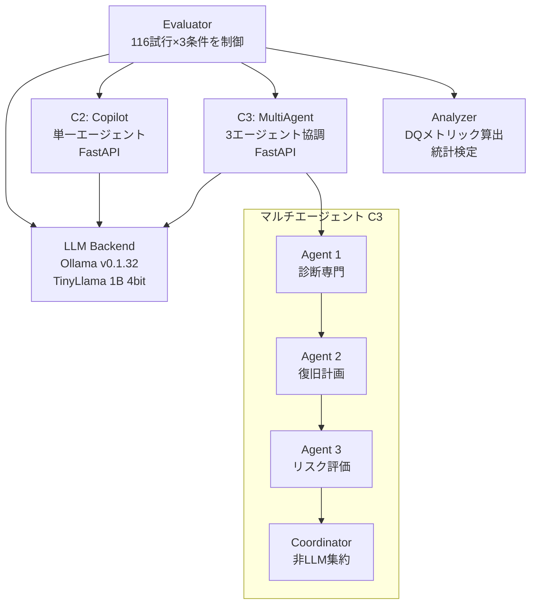

本記事は [Multi-Agent LLM Orchestration Achieves Deterministic, High-Quality Decision Support for Incident Response](https://arxiv.org/abs/2511.15755) の解説記事です。

## 論文概要

インシデント対応において単一エージェントLLMは「ログを確認せよ」のような曖昧なガイダンスを生成しがちであり、運用現場で実行可能な推奨には至らないことが多い。著者は、マルチエージェントオーケストレーションにより推奨品質を根本的に改善できることを348回の制御実験で実証している。コンテナ化フレームワークMyAntFarm.aiを用いた評価では、実行可能な推奨率が単一エージェントの1.7%から100%に向上し、アクション具体性80倍・解決策正確性140倍の改善が報告されている。品質分散がゼロとなる決定論的出力を達成した点がSLA保証の観点で注目される。

## 情報源

| 項目 | 内容 |
|------|------|
| タイトル | Multi-Agent LLM Orchestration Achieves Deterministic, High-Quality Decision Support for Incident Response |
| 著者 | Philip Drammeh |
| arXiv ID | 2511.15755 |
| 初版投稿日 | 2025年11月19日 |
| 改訂日 | 2026年1月7日（v2） |
| 分野 | cs.AI（人工知能）, cs.SE（ソフトウェア工学） |

## 背景と動機

SRE（Site Reliability Engineering）やインシデント対応の現場では、障害発生時の迅速な原因特定と復旧が求められる。Mean Time to Detect（MTTD）やMean Time to Resolve（MTTR）といった指標が重視される中、LLMを活用した意思決定支援への関心が高まっている。

しかし、単一エージェントに対して「根本原因の診断」「復旧手順の策定」「リスク評価」を同時に要求すると、LLMは複数の目標を一度に処理する必要に直面し、出力は「最近の変更を調査せよ」「システムメトリクスを確認せよ」のような汎用的な提案にとどまりやすい。著者はこの現象を単一エージェントが抱える「同時多目標推論の困難さ」として捉え、タスク分解と専門化による品質改善の可能性を検証するためにマルチエージェントアーキテクチャの制御実験を設計している。

## 主要な貢献

著者が報告している本論文の貢献は以下の3点である。

1. **MyAntFarm.aiフレームワーク**: マルチエージェントの優位性を再現可能に実証するコンテナ化システム。Docker Compose上で5つのマイクロサービスを構成し、ソースコードと全試行データを公開している
2. **Decision Quality（DQ）メトリック**: 従来のBLEUやBERTScoreでは捉えにくい運用上の「実行可能性」を評価するため、妥当性（Validity）・具体性（Specificity）・正確性（Correctness）の3軸で定量化する新しい評価指標を提案している
3. **本番対応性の再定義**: マルチエージェントシステムが品質分散ゼロの決定論的出力を達成し、SLAコミットメントの基盤となりうることを実証。マルチエージェントオーケストレーションを「性能最適化のオプション」から「本番展開の必要条件」へと位置づけ直している

## 技術的詳細

### MyAntFarm.aiアーキテクチャ

MyAntFarm.aiは5つのコンテナ化マイクロサービスで構成されている。



著者は本論文における「エージェント」を「専門化されたプロンプトを持つ単一のLLM推論呼び出し」と定義しており、別のモデルやAPIを使用するものではないことを明示している。すべてのエージェントが同一のTinyLlama（1Bパラメータ、4ビット量子化）バックエンドを共有しており、単一エージェントとマルチエージェントの差異はモデルの多様性ではなくプロンプト分解と逐次合成にあるとしている。

#### 単一エージェント条件（C2）

1回のLLM推論呼び出しで、根本原因の診断・復旧アクションの推奨・リスク評価を同時に要求する複合的なプロンプトを使用する。反復や改善は行われない。

#### マルチエージェント条件（C3）

3つの専門エージェントが逐次的にプロンプトチェーンで連携する。

- **Agent 1（診断専門）**: テレメトリデータから根本原因を特定する。入力はサービス名、エラー率、データベースメトリクス、デプロイ履歴であり、出力は根本原因の記述のみに限定される
- **Agent 2（復旧計画）**: Agent 1の出力と元のテレメトリを受け取り、具体的なコマンド・バージョン番号・設定パラメータを含む復旧手順を生成する
- **Agent 3（リスク評価）**: Agent 2の出力と本番環境のコンテキストを受け取り、提案されたアクションのリスク評価と緩和策を生成する
- **Coordinator（非LLM）**: 3エージェントの出力を構造化されたインシデントブリーフに集約する。LLMは使用しない

### Decision Quality（DQ）メトリック

著者は、運用展開に適した品質評価指標としてDecision Quality（DQ）を提案している。

$$
DQ_i = \alpha \cdot V_i + \beta \cdot S_i + \gamma \cdot R_i
$$

ここで $\alpha = 0.40$, $\beta = 0.30$, $\gamma = 0.30$ であり、妥当性（Validity）を最も重視する重み付けとなっている。条件 $c$ における集約値は次式で算出される。

$$
DQ^{(c)} = \frac{1}{N_c} \sum_{i=1}^{N_c} DQ_i
$$

各成分の定義は以下の通りである。

**妥当性 $V_i \in [0, 1]$**: 技術的に実行可能なアクションの割合。

$$
V_i = \frac{A_{\text{valid},i}}{A_{\text{total},i}}
$$

不可能な値（例: 「CPU 500%」）、矛盾する指示、構文的に不正なコマンドを含むアクションを無効と判定する。本実験ではすべてのシステムが $V_i = 1.0$ を達成している。

**具体性 $S_i \in [0, 1]$**: 自動化された正規表現パターンマッチングによるスコアリング。

| スコア | 条件 | 例 |
|:---|:---|:---|
| 1.0 | バージョン番号やコマンドを含む | `kubectl rollout undo`, `v2.3.0` |
| 0.67 | サービス名を含むがバージョンなし | `rollback auth-service` |
| 0.33 | 汎用カテゴリのみ | `rollback recent deployment` |
| 0.0 | 曖昧な指示 | `check logs`, `investigate` |

パターンマッチには `v?\d+\.\d+` によるバージョン番号検出、`kubectl`, `docker`, `systemctl` 等のコマンド検出、`auth`, `payment`, `api`, `database` 等のサービス名検出が使用されている。

**正確性 $R_i \in [0, 1]$**: Ground truthとのトークンオーバーラップ比率に基づく。

$$
\text{overlap\_ratio} = \frac{|\text{tokens}(\text{action}) \cap \text{tokens}(\text{ground\_truth})|}{|\text{tokens}(\text{ground\_truth})|}
$$

トークンは小文字化・空白分割後の単語である。オーバーラップ率に応じて1.0（70%以上）、0.75（50-69%）、0.50（30-49%）、0.25（10-29%）、0.0（10%未満）のスコアが付与される。

$DQ > 0.5$ を推奨のアクション可能性閾値と定義している。

### Time to Usable Understanding（T2U）

著者はインシデント検知から「復旧開始に十分な理解」に至るまでの時間をT2Uとして定義している。

$$
T_{2U}^{(c)} = \frac{1}{N_c} \sum_{i=1}^{N_c} (t_{\text{understanding},i} - t_{\text{incident},i})
$$

MTTDやMTTRとは異なり、検知後の「理解フェーズ」に特化した指標である。

## 実装のポイント

### コンテナ化と再現性

MyAntFarm.aiはDocker Compose上で全サービスを管理し、永続ボリュームにより環境間での決定論的な再現を保証している。LLMバックエンドにはOllama v0.1.32を採用し、TinyLlama 1Bの4ビット量子化モデルを提供する。温度パラメータは0.7に固定、ランダムシードは42に設定されている。

### レート制限と実行時間

Evaluatorコンテナが10回/分のAPI呼び出し制限を適用し、LLMバックエンドの飽和を防止している。16GB RAMシステムで348試行全体の実行時間は25-30分であり、GPUは不要である（TinyLlamaはCPU上で効率的に動作する）。

### 再現手順

ソースコードはGitHub（[https://github.com/Phildram1/myantfarm-ai](https://github.com/Phildram1/myantfarm-ai)）で公開されており、Docker ComposeとOllamaが利用可能な環境であれば手元で全試行を再現できる。

## Production Deployment Guide

本論文のマルチエージェントオーケストレーションパターン（診断→復旧計画→リスク評価の逐次合成 + 非LLMコーディネータによる集約）は、インシデント対応自動化基盤として実装可能である。以下に、AWS上でのマルチエージェントインシデント対応システムの構築パターンを示す。

### アーキテクチャ構成

論文のMyAntFarm.aiアーキテクチャをAWSサービスにマッピングすると、以下の構成要素に分解できる。

| 論文の構成要素 | 役割 | AWSサービス |
|:---|:---|:---|
| LLM Backend | エージェント推論 | Amazon Bedrock / SageMaker Endpoint |
| Agent 1-3 | 専門タスク実行 | AWS Step Functions（各ステート） |
| Coordinator | 出力集約 | Step Functions内のLambda |
| Evaluator | 品質評価 | Lambda + CloudWatch Custom Metrics |

トラフィック規模別の推奨構成は以下の通りである。

| 構成 | トラフィック | AWSサービス | 月額概算 |
|:---|:---|:---|:---|
| Small (~50 incidents/日) | PoC・社内検証 | Step Functions + Lambda + Bedrock (Claude Haiku) | $100-300 |
| Medium (~500 incidents/日) | 部門利用 | Step Functions + ECS Fargate + Bedrock (Claude Sonnet) | $800-2,000 |
| Large (5000+ incidents/日) | 全社NOC | EKS + SageMaker専用エンドポイント + ElastiCache | $5,000-15,000 |

注: 上記は2026年8月時点のAWS ap-northeast-1（東京）リージョン料金に基づく概算値である。実際のコストはインシデント頻度、プロンプト長、モデル選択により変動するため、AWS料金計算ツールでの確認を推奨する。

### Terraformインフラコード

**Small構成（Step Functions + Lambda + Bedrock）**:

```hcl
# マルチエージェントインシデント対応 - Small構成
terraform {
  required_version = ">= 1.9"
  required_providers {
    aws = { source = "hashicorp/aws", version = "~> 5.60" }
  }
}

provider "aws" {
  region = "ap-northeast-1"
}

# --- Step Functions (エージェントオーケストレーション) ---
resource "aws_sfn_state_machine" "incident_response" {
  name     = "multi-agent-incident-response"
  role_arn = aws_iam_role.sfn_role.arn

  definition = jsonencode({
    Comment = "Multi-Agent Incident Response Pipeline"
    StartAt = "DiagnosisAgent"
    States = {
      DiagnosisAgent = {
        Type     = "Task"
        Resource = aws_lambda_function.diagnosis_agent.arn
        Next     = "RemediationAgent"
        Retry = [{
          ErrorEquals     = ["States.TaskFailed"]
          IntervalSeconds = 5
          MaxAttempts     = 2
          BackoffRate     = 2.0
        }]
      }
      RemediationAgent = {
        Type     = "Task"
        Resource = aws_lambda_function.remediation_agent.arn
        Next     = "RiskAssessmentAgent"
        Retry = [{
          ErrorEquals     = ["States.TaskFailed"]
          IntervalSeconds = 5
          MaxAttempts     = 2
          BackoffRate     = 2.0
        }]
      }
      RiskAssessmentAgent = {
        Type     = "Task"
        Resource = aws_lambda_function.risk_agent.arn
        Next     = "Coordinator"
        Retry = [{
          ErrorEquals     = ["States.TaskFailed"]
          IntervalSeconds = 5
          MaxAttempts     = 2
          BackoffRate     = 2.0
        }]
      }
      Coordinator = {
        Type     = "Task"
        Resource = aws_lambda_function.coordinator.arn
        Next     = "EvaluateQuality"
      }
      EvaluateQuality = {
        Type     = "Task"
        Resource = aws_lambda_function.dq_evaluator.arn
        End      = true
      }
    }
  })
}

# --- Lambda Functions (各エージェント) ---
resource "aws_lambda_function" "diagnosis_agent" {
  function_name = "incident-agent-diagnosis"
  runtime       = "python3.12"
  handler       = "agents.diagnosis_handler"
  architectures = ["arm64"]
  memory_size   = 512
  timeout       = 60
  filename      = "agents.zip"
  role          = aws_iam_role.lambda_role.arn

  environment {
    variables = {
      BEDROCK_MODEL_ID = "anthropic.claude-3-haiku-20240307-v1:0"
      AGENT_ROLE       = "diagnosis"
      TEMPERATURE      = "0.3"
    }
  }
}

resource "aws_lambda_function" "remediation_agent" {
  function_name = "incident-agent-remediation"
  runtime       = "python3.12"
  handler       = "agents.remediation_handler"
  architectures = ["arm64"]
  memory_size   = 512
  timeout       = 60
  filename      = "agents.zip"
  role          = aws_iam_role.lambda_role.arn

  environment {
    variables = {
      BEDROCK_MODEL_ID = "anthropic.claude-3-haiku-20240307-v1:0"
      AGENT_ROLE       = "remediation"
      TEMPERATURE      = "0.3"
    }
  }
}

resource "aws_lambda_function" "risk_agent" {
  function_name = "incident-agent-risk"
  runtime       = "python3.12"
  handler       = "agents.risk_handler"
  architectures = ["arm64"]
  memory_size   = 512
  timeout       = 60
  filename      = "agents.zip"
  role          = aws_iam_role.lambda_role.arn

  environment {
    variables = {
      BEDROCK_MODEL_ID = "anthropic.claude-3-haiku-20240307-v1:0"
      AGENT_ROLE       = "risk_assessment"
      TEMPERATURE      = "0.3"
    }
  }
}

resource "aws_lambda_function" "coordinator" {
  function_name = "incident-coordinator"
  runtime       = "python3.12"
  handler       = "coordinator.handler"
  architectures = ["arm64"]
  memory_size   = 256
  timeout       = 15
  filename      = "coordinator.zip"
  role          = aws_iam_role.lambda_role.arn
}

resource "aws_lambda_function" "dq_evaluator" {
  function_name = "incident-dq-evaluator"
  runtime       = "python3.12"
  handler       = "evaluator.handler"
  architectures = ["arm64"]
  memory_size   = 256
  timeout       = 15
  filename      = "evaluator.zip"
  role          = aws_iam_role.lambda_role.arn

  environment {
    variables = {
      DQ_ALPHA     = "0.40"
      DQ_BETA      = "0.30"
      DQ_GAMMA     = "0.30"
      DQ_THRESHOLD = "0.50"
    }
  }
}

# --- IAM ---
resource "aws_iam_role" "sfn_role" {
  name = "incident-sfn-role"
  assume_role_policy = jsonencode({
    Version = "2012-10-17"
    Statement = [{
      Action    = "sts:AssumeRole"
      Effect    = "Allow"
      Principal = { Service = "states.amazonaws.com" }
    }]
  })
}

resource "aws_iam_role" "lambda_role" {
  name = "incident-agent-lambda-role"
  assume_role_policy = jsonencode({
    Version = "2012-10-17"
    Statement = [{
      Action    = "sts:AssumeRole"
      Effect    = "Allow"
      Principal = { Service = "lambda.amazonaws.com" }
    }]
  })
}

resource "aws_iam_role_policy" "lambda_policy" {
  name = "incident-agent-lambda-policy"
  role = aws_iam_role.lambda_role.id
  policy = jsonencode({
    Version = "2012-10-17"
    Statement = [
      {
        Effect   = "Allow"
        Action   = ["bedrock:InvokeModel"]
        Resource = "*"
      },
      {
        Effect   = "Allow"
        Action   = ["logs:CreateLogGroup", "logs:CreateLogStream", "logs:PutLogEvents"]
        Resource = "arn:aws:logs:*:*:*"
      }
    ]
  })
}
```

### エージェント実装（Python）

論文のマルチエージェントパターンをBedrock APIで実装する例を示す。各エージェントは専門化されたプロンプトで単一目標のみを担当する。

```python
from dataclasses import dataclass
from enum import Enum

import boto3
from pydantic import BaseModel, Field


class AgentRole(str, Enum):
    """エージェントの役割を定義する列挙型"""

    DIAGNOSIS = "diagnosis"
    REMEDIATION = "remediation"
    RISK_ASSESSMENT = "risk_assessment"


class IncidentContext(BaseModel):
    """インシデントのテレメトリ情報を保持するモデル

    Attributes:
        service_name: 障害が発生しているサービス名
        error_rate: エラー率(%)
        affected_endpoints: 影響を受けているエンドポイント
        deployment_version: 現在のデプロイバージョン
        previous_stable: 前回の安定バージョン
        db_connection_utilization: DB接続プール使用率(%)
        p95_latency_multiplier: p95レイテンシの劣化倍率
    """

    service_name: str
    error_rate: float = Field(ge=0, le=100)
    affected_endpoints: list[str]
    deployment_version: str
    previous_stable: str
    db_connection_utilization: float = Field(ge=0, le=100)
    p95_latency_multiplier: float = Field(ge=1.0)


class AgentOutput(BaseModel):
    """各エージェントの出力を保持するモデル

    Attributes:
        role: エージェントの役割
        content: エージェントの出力内容
    """

    role: AgentRole
    content: str


AGENT_PROMPTS: dict[AgentRole, str] = {
    AgentRole.DIAGNOSIS: (
        "あなたはインシデント診断の専門家です。"
        "以下のテレメトリデータから根本原因を特定してください。"
        "根本原因の記述のみを出力し、復旧手順やリスク評価は含めないでください。"
    ),
    AgentRole.REMEDIATION: (
        "あなたはインシデント復旧計画の専門家です。"
        "診断結果に基づき、具体的な復旧手順を生成してください。"
        "各手順にはコマンド、バージョン番号、設定パラメータを含めてください。"
        "リスク評価は含めないでください。"
    ),
    AgentRole.RISK_ASSESSMENT: (
        "あなたはリスク評価の専門家です。"
        "提案された復旧手順のリスクを評価し、緩和策を提示してください。"
        "診断や追加の復旧手順は含めないでください。"
    ),
}


@dataclass(frozen=True)
class BedrockAgent:
    """Bedrock APIを用いたエージェント推論を行うクラス

    Attributes:
        model_id: Bedrockモデル識別子
        temperature: 生成温度パラメータ
    """

    model_id: str = "anthropic.claude-3-haiku-20240307-v1:0"
    temperature: float = 0.3

    def invoke(self, role: AgentRole, context: str) -> AgentOutput:
        """指定された役割でLLM推論を実行する

        Args:
            role: エージェントの役割
            context: 入力コンテキスト(テレメトリまたは前段エージェントの出力)

        Returns:
            エージェントの出力
        """
        client = boto3.client("bedrock-runtime", region_name="ap-northeast-1")
        response = client.invoke_model(
            modelId=self.model_id,
            body={
                "anthropic_version": "bedrock-2023-05-31",
                "max_tokens": 1024,
                "temperature": self.temperature,
                "system": AGENT_PROMPTS[role],
                "messages": [{"role": "user", "content": context}],
            },
            contentType="application/json",
        )
        result = response["body"].read().decode()
        return AgentOutput(role=role, content=result)
```

### DQメトリック評価（Python）

論文のDecision Quality評価ロジックをPythonで実装する例を示す。

```python
import re
from dataclasses import dataclass


@dataclass(frozen=True)
class DQWeights:
    """DQメトリックの重み係数

    Attributes:
        alpha: 妥当性の重み
        beta: 具体性の重み
        gamma: 正確性の重み
    """

    alpha: float = 0.40
    beta: float = 0.30
    gamma: float = 0.30


@dataclass(frozen=True)
class DQScore:
    """Decision Qualityスコアの算出結果

    Attributes:
        validity: 妥当性スコア [0, 1]
        specificity: 具体性スコア [0, 1]
        correctness: 正確性スコア [0, 1]
        overall: 総合DQスコア
        actionable: DQ > 0.5 を満たすか
    """

    validity: float
    specificity: float
    correctness: float
    overall: float
    actionable: bool


VERSION_PATTERN = re.compile(r"v?\d+\.\d+(\.\d+)?")
COMMAND_PATTERN = re.compile(
    r"\b(kubectl|docker|systemctl|helm|terraform)\b"
)
SERVICE_PATTERN = re.compile(
    r"\b(auth|payment|api|database|gateway|cache)\b", re.IGNORECASE
)


def compute_specificity(action: str) -> float:
    """アクション文字列の具体性をスコアリングする

    Args:
        action: 推奨アクションのテキスト

    Returns:
        具体性スコア (0.0, 0.33, 0.67, 1.0)
    """
    if VERSION_PATTERN.search(action) or COMMAND_PATTERN.search(action):
        return 1.0
    if SERVICE_PATTERN.search(action):
        return 0.67
    generic_patterns = ["rollback", "restart", "scale", "update"]
    if any(p in action.lower() for p in generic_patterns):
        return 0.33
    return 0.0


def compute_correctness(action: str, ground_truth: str) -> float:
    """Ground truthとのトークンオーバーラップで正確性を算出する

    Args:
        action: 推奨アクションのテキスト
        ground_truth: 正解アクションのテキスト

    Returns:
        正確性スコア (0.0, 0.25, 0.50, 0.75, 1.0)
    """
    action_tokens = set(action.lower().split())
    truth_tokens = set(ground_truth.lower().split())
    if not truth_tokens:
        return 0.0
    overlap = len(action_tokens & truth_tokens) / len(truth_tokens)
    if overlap >= 0.70:
        return 1.0
    if overlap >= 0.50:
        return 0.75
    if overlap >= 0.30:
        return 0.50
    if overlap >= 0.10:
        return 0.25
    return 0.0


def evaluate_dq(
    actions: list[str],
    ground_truth: str,
    weights: DQWeights | None = None,
) -> DQScore:
    """推奨アクションのDecision Qualityを算出する

    Args:
        actions: 推奨アクションのリスト
        ground_truth: 正解アクションのテキスト
        weights: DQ重み係数(省略時はデフォルト値)

    Returns:
        DQスコア
    """
    if weights is None:
        weights = DQWeights()

    if not actions:
        return DQScore(
            validity=0.0,
            specificity=0.0,
            correctness=0.0,
            overall=0.0,
            actionable=False,
        )

    validity = 1.0  # 本実装では構文チェックを省略
    specificity = sum(compute_specificity(a) for a in actions) / len(actions)
    correctness = sum(
        compute_correctness(a, ground_truth) for a in actions
    ) / len(actions)

    overall = (
        weights.alpha * validity
        + weights.beta * specificity
        + weights.gamma * correctness
    )
    return DQScore(
        validity=validity,
        specificity=specificity,
        correctness=correctness,
        overall=overall,
        actionable=overall > 0.5,
    )
```

### 運用・監視設定

**CloudWatch Logs Insights: DQスコア分布の監視**:

```
# 5分間あたりのDQスコア分布とアクション可能率を監視
fields @timestamp, incident_id, dq_score, actionable
| stats count(*) as total,
        sum(case when actionable = 1 then 1 else 0 end) as actionable_count,
        avg(dq_score) as avg_dq,
        min(dq_score) as min_dq
  by bin(5m)
| filter total > 0
| sort @timestamp desc
```

**CloudWatch Logs Insights: エージェント別レイテンシ分析**:

```
fields @timestamp, agent_role, latency_ms
| stats percentile(latency_ms, 50) as p50,
        percentile(latency_ms, 95) as p95,
        percentile(latency_ms, 99) as p99,
        avg(latency_ms) as avg_ms
  by agent_role
| sort p95 desc
```

**CloudWatch アラーム: DQスコア低下検知（Python）**:

```python
import boto3

cloudwatch = boto3.client("cloudwatch", region_name="ap-northeast-1")


def emit_dq_metrics(incident_id: str, dq_score: float, actionable: bool) -> None:
    """DQスコアをCloudWatchカスタムメトリクスとして送信する

    Args:
        incident_id: インシデント識別子
        dq_score: 算出されたDQスコア
        actionable: アクション可能判定結果
    """
    cloudwatch.put_metric_data(
        Namespace="IncidentResponse/MultiAgent",
        MetricData=[
            {
                "MetricName": "DecisionQualityScore",
                "Value": dq_score,
                "Unit": "None",
                "Dimensions": [
                    {"Name": "IncidentId", "Value": incident_id},
                ],
            },
            {
                "MetricName": "ActionableRate",
                "Value": 1.0 if actionable else 0.0,
                "Unit": "None",
            },
        ],
    )
```

### コスト最適化チェックリスト

**アーキテクチャ選択**:
- [ ] インシデント頻度に応じた構成（Serverless/Hybrid/専用エンドポイント）を選定
- [ ] 各エージェントの目標に応じたモデルサイズを選択（診断: 高精度モデル、リスク評価: 軽量モデル等）

**リソース最適化**:
- [ ] Step Functions Express Workflowの利用を検討（実行時間5分未満のインシデント対応向け）
- [ ] Lambda: 各エージェントのメモリとタイムアウトをプロンプト長に応じて調整
- [ ] Bedrock: Provisioned Throughputの利用を検討（高頻度利用時）

**品質保証**:
- [ ] DQスコアのベースラインを記録し、モデル更新時の品質回帰を検知
- [ ] Ground truthデータベースを定期的に更新し、正確性評価の妥当性を維持
- [ ] 品質分散ゼロ（論文のC3相当）をSLA目標として設定する場合、温度パラメータと入力正規化を厳密に管理

## 実験結果

著者は、認証サービスのデプロイ後障害（エラー率45%、DB接続プール使用率85%、p95レイテンシ13倍劣化）を対象に、C1（手動ベースライン）・C2（単一エージェント）・C3（マルチエージェント）の3条件で各116試行、計348試行の制御実験を実施したと報告している。

| 条件 | 平均T2U (秒) | 標準偏差T2U | 平均DQ | 標準偏差DQ | アクション数 |
|:---|:---|:---|:---|:---|:---|
| C1（ベースライン） | 120.39 | 5.92 | 0.000 | 0.000 | 0.00 |
| C2（単一エージェント） | 41.61 | 17.31 | 0.403 | 0.023 | 2.01 |
| C3（マルチエージェント） | 40.31 | 17.32 | 0.692 | 0.000 | 3.00 |

DQ成分の内訳を以下に示す。

| 成分 | C2 平均 | C3 平均 | 改善倍率 |
|:---|:---|:---|:---|
| 妥当性 | 1.000 (±0.000) | 1.000 (±0.000) | - |
| 具体性 | 0.007 (±0.052) | 0.557 (±0.000) | 80倍 |
| 正確性 | 0.003 (±0.026) | 0.417 (±0.000) | 140倍 |
| 総合DQ | 0.403 (±0.023) | 0.692 (±0.000) | 71.7%向上 |

統計的検証として、一元配置分散分析で $F(2, 345) = 18472.3$, $p < 0.001$ が確認されている。C2対C3のペアワイズt検定では $t = -137.2$, $p < 0.001$, Cohen's $d = 18.2$（非常に大きい効果量）であった。

アクション可能率（$DQ > 0.5$）はC3で116/116（100%）、C2で2/115（1.7%、外れ値1件除外後）であった。C3の品質分散ゼロ（$\sigma_{DQ} = 0.000$）は、同一のインシデント入力に対して常に同一品質の推奨を生成することを意味し、SLAの根拠となりうると著者は主張している。

レイテンシについてはC2が41.61秒、C3が40.31秒であり、マルチエージェントによる速度低下は観察されていない（差異3.2%）。これは、単一エージェントの複雑なプロンプト処理時間と、マルチエージェントの逐次呼び出しの合計時間が同程度であることを示唆している。

## 実運用への応用

### Zenn記事のマルチエージェント基盤との関係

Zenn記事「Bedrock AgentCore×Strands Agentsでヘルプデスクマルチエージェント基盤を構築する」では、AWS Bedrock AgentCoreとStrands Agentsフレームワークを用いたヘルプデスク向けマルチエージェントシステムの構築が扱われている。本論文のMyAntFarm.aiは、こうしたマルチエージェント基盤が「なぜ単一エージェントより優れるのか」を定量的に示す実験的根拠を提供するものであり、アーキテクチャ選定の判断材料として参照できる。

具体的には、Zenn記事で構築されるヘルプデスクエージェントにおいても、問い合わせ分類・回答生成・品質チェックをそれぞれ専門エージェントに分離し、非LLMコーディネータで集約するパターンを適用することで、本論文が報告する品質の安定化（分散ゼロ）に近づけられる可能性がある。

### 導入時のチェックポイント

1. タスク分解の粒度を決定する際、本論文の知見（3エージェントによる診断・復旧・リスクの分離で80倍の具体性改善）を参考に、各エージェントの目標を単一に限定する
2. 非LLMコーディネータによる集約パターンは、LLMの推論コストを追加せずに構造化出力を保証する手法として採用を検討する
3. DQメトリックの3成分（妥当性・具体性・正確性）をカスタムメトリクスとして監視し、品質SLAの基盤とする
4. 品質分散ゼロの達成には、温度パラメータの固定と入力テレメトリの正規化が前提条件となる点に留意する

## 関連研究

- **ChatDev** (Qian et al., 2023): ソフトウェア開発におけるタスク分解と専門エージェント間の協調を先駆的に実証した研究。本論文はこの考え方をインシデント対応領域に適用したものと位置づけられる
- **Generative Agents** (Park et al., 2023): エージェント間の対話的協調の可能性を示した研究。本論文はより構造化された逐次合成パターンを採用している
- **AIOps with LLMs Survey** (Zhang et al., 2025): LLM時代のAIOpsを包括的にサーベイした研究。多くのAIOpsツールが異常検知に焦点を当てる中、本論文はその後段の「実行可能な推奨生成」に特化している点で差別化されている

## まとめと今後の展望

著者は、348回の制御実験を通じて、マルチエージェントLLMオーケストレーションが単一エージェントに対してアクション具体性80倍・解決策正確性140倍の改善を達成し、品質分散ゼロの決定論的出力を実現したと報告している。レイテンシの増加なく品質を大幅に改善した点、そしてこの改善がTinyLlama 1Bという小規模モデルでも観察された点は、アーキテクチャ設計（タスク分解と専門化）の重要性を示唆している。

一方、著者自身が認めている通り、本論文には以下の制約がある。単一のインシデントシナリオ（認証サービス障害）のみを対象としており、データベースデッドロックやネットワーク分断など多様な障害タイプへの汎化は検証されていない。また、正確性評価はトークンオーバーラップに基づく自動スコアリングであり、SRE実務者による人間評価は未実施である。DQスコアが妥当性 $V_i = 1.0$ に固定されている点も、より挑戦的なシナリオでの再検証が必要である。

今後の研究方向として、著者はマルチシナリオ検証（Phase 2、2026年Q1）、10-15名のSRE実務者による人間評価研究（Q1-Q2）、RAG統合による過去のポストモーテム活用（Q2）、Model Context Protocol（MCP）を用いた可観測性プラットフォーム連携（Phase 3）、大規模モデル（Llama 3.3 70B, GPT-5.2, Claude Sonnet 4.5）でのスケーリング検証を計画していると報告している。

## 参考文献

- **arXiv**: [https://arxiv.org/abs/2511.15755](https://arxiv.org/abs/2511.15755)
- **GitHub**: [https://github.com/Phildram1/myantfarm-ai](https://github.com/Phildram1/myantfarm-ai)
- **Related Zenn article**: [https://zenn.dev/0h_n0/articles/b6fbcbbe118e75](https://zenn.dev/0h_n0/articles/b6fbcbbe118e75)
