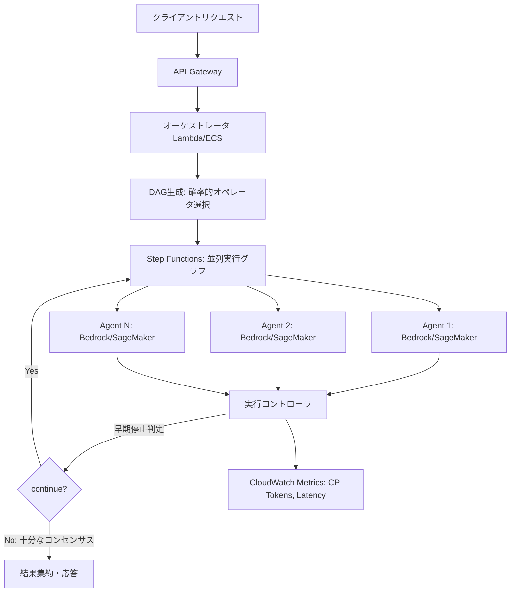

本記事は [Learning Latency-Aware Orchestration for Multi-Agent Systems](https://arxiv.org/abs/2601.10560) の解説記事です。

## 論文概要

LLMを活用したマルチエージェントシステム（MAS）では、タスク精度や推論コストの最適化が研究されてきたが、エンドツーエンドのレイテンシ最適化は見過ごされてきた。著者らは、エンドツーエンドのレイテンシが実行グラフのクリティカルパス（最長依存チェーン）によって支配されるため、単純なコスト削減ではレイテンシ最小化には不十分であることを指摘している。本論文では、訓練時に制約付き最適化とクリティカルパス認識型クレジット割り当てによりレイテンシ認識型実行グラフを学習し、推論時に軽量コントローラで冗長なエージェント間インタラクションを適応的に除去するフレームワーク「LAMaS」を提案している。4つのベンチマークにおいて、学習ベースのMASベースラインと比較して50%以上のレイテンシ削減を達成しつつ、競争力のあるタスク精度を維持したと報告されている。

## 情報源

| 項目 | 内容 |
|------|------|
| タイトル | Learning Latency-Aware Orchestration for Multi-Agent Systems |
| 著者 | Xi Shi, Mengxin Zheng, Qian Lou |
| arXiv ID | 2601.10560 |
| 投稿日 | 2026年1月15日（v1）、2026年8月12日（v2） |
| 分野 | cs.MA（マルチエージェントシステム）, cs.AI（人工知能）, cs.CL（計算言語学） |

## 背景と動機

LLMを活用したマルチエージェントシステムは、コード生成、数学的推論、知識推論などのタスクで高い精度を達成しているが、複数のエージェントが協調する構造上、推論レイテンシが大きくなる傾向がある。既存のMASオーケストレーション手法（GDesigner、AgentDropout、MaASなど）はタスク精度と推論コストを最適化するが、レイテンシの最適化は考慮されていない。

著者らは、レイテンシとコストの根本的な違いを指摘している。コストは全オペレータの消費を加算的に積み上げるのに対し、レイテンシは実行グラフの**クリティカルパス**（最長依存チェーン）によって支配される。並列実行可能なオペレータのコストを削減してもクリティカルパス上のオペレータが変わらなければ、エンドツーエンドのレイテンシは改善しない。さらに、ナイーブにレイテンシを最適化しようとすると、オペレータレベルのクレジット割り当てを誤り、精度が低下するリスクがあることも報告されている。

## 主要な貢献

著者らが報告している本論文の貢献は以下の4点である。

1. **レイテンシ認識型MASの定式化**: MASオーケストレーションをクリティカルパス認識型クレジット割り当てを伴う制約付き最適化問題として定式化し、精度を保証しながらレイテンシを最小化する枠組みを構築
2. **推論時の軽量実行コントローラ**: 実行が進むにつれて冗長な将来のエージェント間インタラクションを適応的に除去するMLPベースのコントローラを導入し、追加のレイテンシ削減を実現
3. **ベンチマークでの大幅なレイテンシ削減**: GSM8K、HumanEval、MATH、MMLU-Proの4ベンチマークにおいて、学習ベースのMASベースラインに対して55〜76%のレイテンシ削減を達成しつつ、競争力のあるまたは優位な精度を維持
4. **他アーキテクチャへの転用性**: モジュラー設計により、GDesignerやAgentDropoutなど他のMAS実装に最小限の修正で適用可能であり、27〜39%の一貫したレイテンシ削減を確認

## 技術的詳細

### 問題設定：コストとレイテンシの違い

MASの実行グラフは有向非巡回グラフ（DAG）としてモデル化される。ノードはオペレータ呼び出し、エッジはデータ依存関係を表す。エンドツーエンドのレイテンシはクリティカルパスの総実行時間として定義される。

$$
T = \max_{p \in \text{Paths}(\mathcal{G})} \sum_{o \in p} t(o)
$$

一方、総コストは全オペレータのコストの単純な和である。

$$
C = \sum_{o \in \mathcal{V}} c(o)
$$

ここで $t(o)$ はオペレータ $o$ の実行時間、$c(o)$ はそのコストである。この構造上の違いにより、コスト最適化とレイテンシ最適化は異なるアプローチを必要とする。

### オーケストレータアーキテクチャ

オーケストレータは候補オペレータ上の確率的DAGを生成する。各層 $\ell$ でオペレータの選択確率を出力し、累積確率が閾値 $\tau$ を超えるまでオペレータをサンプリングする。

$$
P_{\theta}(\mathcal{G} \mid x) = \prod_{\ell=1}^{L} \pi_{\theta}(\mathcal{V}_{\ell} \mid x, \mathcal{G}_{1:\ell-1})
$$

$$
\mathcal{V}_{\ell} = \{o_1, \ldots, o_k\}, \quad k = \min\left\{j : \sum_{i=1}^{j} s_{o_i} > \tau\right\}
$$

ここで $L$ はスーパーネットの層数、$s_{o_i}$ はオペレータ $o_i$ の選択スコアである。

### 制約付き最適化

オーケストレーション問題は、精度制約付きのレイテンシ・コスト最小化として定式化される。

$$
\min_{\theta} \; \mathbb{E}\left[\lambda_t T + \lambda_c C\right], \quad \text{s.t.} \quad \mathbb{E}[S] \geq S_0
$$

ここで $\lambda_t$, $\lambda_c$ はレイテンシとコストの重み係数、$S_0$ は精度の下限値である。この制約付き最適化はラグランジュ緩和により解かれる。

$$
R = \lambda_S \frac{S}{S_0} - \lambda_t T - \lambda_c C
$$

双対変数 $\lambda_S$ は射影勾配上昇法により適応的に更新される。

$$
\lambda_S \leftarrow \max\left(0, \lambda_S + \eta\left(1 - \frac{\bar{S}}{S_0}\right)\right)
$$

ここで $\bar{S}$ はバッチ平均精度、$\eta$ は双対学習率である。精度が下限 $S_0$ を下回ると $\lambda_S$ が増加して精度を重視し、上回ると減少してレイテンシ削減を優先する。

### クリティカルパス認識型クレジット割り当て

ナイーブなレイテンシ最適化では全オペレータに一様なレイテンシペナルティを課すが、これではクリティカルパス外のオペレータにも不要なペナルティが割り当てられ、精度が低下する。著者らは、パスの重要度に応じた重み付けを導入している。

$$
w(o) = \frac{\ell(o)}{T} \in [0, 1]
$$

ここで $\ell(o)$ はオペレータ $o$ を通る最長パスのレイテンシである。オペレータレベルの報酬は以下のように定義される。

$$
R(o) = \lambda_S \frac{S}{S_0} - \lambda_t w(o) T - \lambda_c C
$$

クリティカルパス上のオペレータは $w(o) = 1$ で完全なレイテンシペナルティを受け、パスから離れたオペレータは $w(o) \ll 1$ で減衰したペナルティを受ける。これにより、精度に寄与するがレイテンシへの影響が小さいオペレータの不要な除去を防ぐ。

### 学習目的関数

オーケストレータは方策勾配法で学習される。

$$
\mathcal{L}(\theta) = -\mathbb{E}_{\xi \sim \pi_{\theta}}\left[\sum_{\ell=1}^{L} \sum_{o \in \mathcal{V}_{\ell}} R(o) \log p_{\theta}(o \mid x, \mathcal{G}_{1:\ell-1})\right]
$$

報酬は指数移動平均を用いて正規化され、分散を低減している。

### 推論時の実行コントローラ

訓練されたオーケストレータに加え、推論時には軽量なMLPベースのコントローラが実行を監視する。コントローラは**制御アドバンテージ**（現在の部分実行を停止した場合と全実行を完了した場合の報酬差）を予測する。

$$
\Delta_k = R_k - R_N
$$

コントローラへの入力は実行状態を要約する3つの特徴量である。

$$
\hat{\Delta}_k = \text{Controller}_{\phi}\left(\frac{n_{\text{completed}}}{n_{\text{total}}}, \; \frac{\max\_\text{agree}}{n_{\text{completed}}}, \; \text{Compress}(q)\right)
$$

各特徴量は以下を表す。

- $n_{\text{completed}} / n_{\text{total}}$: 実行進捗率（完了したオペレータ数/総オペレータ数）
- $\max\_\text{agree} / n_{\text{completed}}$: 回答コンセンサス率（最も多い回答の一致度）
- $\text{Compress}(q)$: クエリ埋め込みの圧縮表現（クエリ難易度の近似）

予測されたアドバンテージは選択確率に変換される。

$$
p(\text{select current}) = \sigma\left(\hat{\Delta}_k / \sigma_{\Delta}\right)
$$

ここで $\sigma_{\Delta} = \text{std}(\{\Delta_k \mid \Delta_k > 0\})$ は訓練データから計算される正規化定数である。コントローラはオーケストレータの収束後、凍結されたオーケストレータのトレースに対してMSE回帰で学習される。

$$
\min_{\phi} \; \mathbb{E}\left[(\hat{\Delta}_k - \Delta_k)^2\right]
$$

## 実装のポイント

著者らが報告している主要なハイパーパラメータと実装上の注意点は以下の通りである。

| パラメータ | 値 | 説明 |
|:---|:---|:---|
| バックボーンLLM | gpt-4o-mini-0718 | 各オペレータのLLMエンジン |
| レイテンシ重み $\lambda_t$ | 0.005 | レイテンシペナルティの強さ |
| コスト重み $\lambda_c$ | 3.0 | コストペナルティの強さ |
| 活性化閾値 $\tau$ | 0.3 | オペレータ選択の累積確率閾値 |
| スーパーネット層数 $L$ | 4 | オーケストレータDAGの最大深さ |
| 双対学習率 $\eta$ | 0.01 | 精度制約の双対変数更新率 |
| バッチサイズ | 44 | 訓練バッチサイズ |
| 訓練反復回数 | 44 | 各バッチの反復回数 |
| クエリエンコーダ | all-MiniLM-L6-v2 | 凍結SentenceTransformer |

$\lambda_t$ と $\lambda_c$ のバランスは精度・レイテンシ・コストのトレードオフを決定する。$\lambda_t$ が大きすぎるとクリティカルパス上のオペレータが過度に除去され精度が低下し、小さすぎるとレイテンシ削減が不十分になる。著者らはアブレーションスタディにより $\lambda_t = 0.005$ が4ベンチマークで安定した結果を示すことを確認している。

クリティカルパストークン数（CP Tokens）とウォールクロックレイテンシの相関はPearson $r = 0.901$ と報告されており、CP Tokensがレイテンシのプロキシ指標として有効であることが示されている。

## Production Deployment Guide

LAMaSのアーキテクチャ（確率的DAGオーケストレータ + クリティカルパス認識型クレジット割り当て + 推論時実行コントローラ）をAWS上のマルチエージェント基盤に適用するパターンを示す。

### AWS実装パターン

LAMaSの構成要素は、オーケストレータ（DAG生成・オペレータ選択）、実行コントローラ（早期停止判定）、エージェント群（LLMオペレータ）、メトリクス収集（レイテンシ・CP Tokens計測）の4つに分解できる。

| 構成 | ユースケース | AWSサービス | 月額概算 |
|:---|:---|:---|:---|
| Small (~100 req/日) | PoC・社内検証 | Lambda + Step Functions + Bedrock | $50-150 |
| Medium (~5000 req/日) | 部門利用 | ECS Fargate + Step Functions + SageMaker Serverless | $800-2,000 |
| Large (100000+ req/日) | プロダクト全社展開 | EKS + SageMaker専用エンドポイント + ElastiCache | $5,000-15,000 |

注: 上記は2026年8月時点のAWS ap-northeast-1（東京）リージョン料金に基づく概算値である。実際のコストはモデルサイズ、エージェント数、リージョンにより変動するため、AWS料金計算ツールでの確認を推奨する。

**Small構成の内訳**:
- AWS Step Functions: DAGの実行グラフをワークフローとして定義し、並列ブランチとクリティカルパスを管理
- Amazon Bedrock: 各エージェントのLLM呼び出しをオンデマンドで実行
- Lambda: オーケストレータのDAG生成ロジックと実行コントローラのMLP推論を実行

**Large構成の内訳**:
- EKS: オーケストレータとコントローラをマイクロサービスとしてデプロイし、Pod単位でスケーリング
- SageMaker専用エンドポイント: エージェントLLMのホスティング（レイテンシ保証のためプロビジョンド）
- ElastiCache(Redis): オペレータ実行結果のキャッシュとクエリ埋め込みの一時保存

### アーキテクチャ図



### Terraformインフラコード

**Small構成（Serverless: Lambda + Step Functions + Bedrock）**:

```hcl
# LAMaS風レイテンシ認識型MASオーケストレータ - Small構成
terraform {
  required_version = ">= 1.9"
  required_providers {
    aws = { source = "hashicorp/aws", version = "~> 5.60" }
  }
}

provider "aws" {
  region = "ap-northeast-1"
}

# --- Lambda (オーケストレータ: DAG生成 + コントローラ推論) ---
resource "aws_lambda_function" "orchestrator" {
  function_name = "lamas-orchestrator"
  runtime       = "python3.12"
  handler       = "orchestrator.handler"
  architectures = ["arm64"]
  memory_size   = 1024
  timeout       = 120
  filename      = "orchestrator.zip"
  role          = aws_iam_role.orchestrator_role.arn

  environment {
    variables = {
      LAMBDA_T         = "0.005"   # レイテンシ重み
      LAMBDA_C         = "3.0"     # コスト重み
      TAU              = "0.3"     # 活性化閾値
      L_LAYERS         = "4"       # スーパーネット層数
      CONTROLLER_MODEL = "controller_weights.pt"
    }
  }
}

# --- Lambda (実行コントローラ: 早期停止判定) ---
resource "aws_lambda_function" "controller" {
  function_name = "lamas-exec-controller"
  runtime       = "python3.12"
  handler       = "controller.handler"
  architectures = ["arm64"]
  memory_size   = 512
  timeout       = 10
  filename      = "controller.zip"
  role          = aws_iam_role.orchestrator_role.arn

  environment {
    variables = {
      SIGMA_DELTA = "0.15"  # アドバンテージ正規化定数
    }
  }
}

resource "aws_iam_role" "orchestrator_role" {
  name = "lamas-orchestrator-role"
  assume_role_policy = jsonencode({
    Version = "2012-10-17"
    Statement = [{
      Action    = "sts:AssumeRole"
      Effect    = "Allow"
      Principal = { Service = "lambda.amazonaws.com" }
    }]
  })
}

resource "aws_iam_role_policy" "orchestrator_policy" {
  name = "lamas-orchestrator-policy"
  role = aws_iam_role.orchestrator_role.id
  policy = jsonencode({
    Version = "2012-10-17"
    Statement = [
      {
        Effect   = "Allow"
        Action   = ["bedrock:InvokeModel"]
        Resource = "*"
      },
      {
        Effect   = "Allow"
        Action   = ["states:StartExecution", "states:DescribeExecution"]
        Resource = aws_sfn_state_machine.agent_dag.arn
      },
      {
        Effect   = "Allow"
        Action   = ["logs:CreateLogGroup", "logs:CreateLogStream", "logs:PutLogEvents"]
        Resource = "arn:aws:logs:*:*:*"
      }
    ]
  })
}

# --- Step Functions (DAG実行グラフ) ---
resource "aws_sfn_state_machine" "agent_dag" {
  name     = "lamas-agent-dag"
  role_arn = aws_iam_role.sfn_role.arn
  definition = jsonencode({
    Comment = "LAMaS DAG execution with parallel agents and early stopping"
    StartAt = "Layer1"
    States = {
      Layer1 = {
        Type = "Parallel"
        Branches = [
          { StartAt = "Agent1", States = { Agent1 = { Type = "Task", Resource = "arn:aws:states:::bedrock:invokeModel", End = true } } },
          { StartAt = "Agent2", States = { Agent2 = { Type = "Task", Resource = "arn:aws:states:::bedrock:invokeModel", End = true } } }
        ]
        Next = "ControllerCheck"
      }
      ControllerCheck = {
        Type     = "Task"
        Resource = aws_lambda_function.controller.arn
        Next     = "ShouldContinue"
      }
      ShouldContinue = {
        Type = "Choice"
        Choices = [{
          Variable          = "$.should_continue"
          BooleanEquals     = true
          Next              = "Layer2"
        }]
        Default = "Aggregate"
      }
      Layer2 = {
        Type = "Parallel"
        Branches = [
          { StartAt = "Agent3", States = { Agent3 = { Type = "Task", Resource = "arn:aws:states:::bedrock:invokeModel", End = true } } }
        ]
        Next = "Aggregate"
      }
      Aggregate = { Type = "Task", Resource = aws_lambda_function.orchestrator.arn, End = true }
    }
  })
}

resource "aws_iam_role" "sfn_role" {
  name = "lamas-sfn-role"
  assume_role_policy = jsonencode({
    Version = "2012-10-17"
    Statement = [{
      Action    = "sts:AssumeRole"
      Effect    = "Allow"
      Principal = { Service = "states.amazonaws.com" }
    }]
  })
}

# --- CloudWatch アラーム (レイテンシ SLA 違反検知) ---
resource "aws_cloudwatch_metric_alarm" "latency_sla" {
  alarm_name          = "lamas-latency-sla-breach"
  comparison_operator = "GreaterThanThreshold"
  evaluation_periods  = 3
  metric_name         = "EndToEndLatency"
  namespace           = "LAMaS"
  period              = 300
  statistic           = "p95"
  threshold           = 30  # 30秒を超えるとSLA違反
  dimensions = {
    Service = "lamas-orchestrator"
  }
}
```

**Large構成（EKS + SageMaker専用エンドポイント）**:

```hcl
# LAMaS風レイテンシ認識型MASオーケストレータ - Large構成
# SageMaker専用エンドポイント + EKS

# --- SageMaker エンドポイント (エージェントLLM) ---
resource "aws_sagemaker_endpoint_configuration" "agent_llm" {
  name = "lamas-agent-llm-config"
  production_variants {
    variant_name           = "primary"
    instance_type          = "ml.g5.2xlarge"
    initial_instance_count = 3
    model_name             = aws_sagemaker_model.agent_llm.name
  }
}

resource "aws_sagemaker_endpoint" "agent_llm" {
  name                 = "lamas-agent-llm"
  endpoint_config_name = aws_sagemaker_endpoint_configuration.agent_llm.name
}

# --- EKS (オーケストレータ + コントローラ) ---
resource "aws_eks_cluster" "lamas" {
  name     = "lamas-cluster"
  role_arn = aws_iam_role.eks_role.arn
  version  = "1.30"

  vpc_config {
    subnet_ids = var.subnet_ids
  }
}

resource "aws_eks_node_group" "orchestrator" {
  cluster_name    = aws_eks_cluster.lamas.name
  node_group_name = "orchestrator-nodes"
  node_role_arn   = aws_iam_role.eks_node_role.arn
  subnet_ids      = var.subnet_ids
  instance_types  = ["c7g.xlarge"]

  scaling_config {
    desired_size = 2
    max_size     = 10
    min_size     = 1
  }
}

# --- ElastiCache Redis (オペレータ結果キャッシュ) ---
resource "aws_elasticache_replication_group" "result_cache" {
  replication_group_id = "lamas-result-cache"
  description          = "LAMaS operator result cache"
  node_type            = "cache.r7g.large"
  num_cache_clusters   = 2
  engine               = "redis"
  automatic_failover_enabled = true
}

# --- AWS Budgets ---
resource "aws_budgets_budget" "monthly" {
  name         = "lamas-monthly"
  budget_type  = "COST"
  limit_amount = "15000"
  limit_unit   = "USD"
  time_unit    = "MONTHLY"

  notification {
    comparison_operator       = "GREATER_THAN"
    threshold                 = 80
    threshold_type            = "PERCENTAGE"
    notification_type         = "ACTUAL"
    subscriber_email_addresses = ["ops-team@example.com"]
  }
}
```

### 運用・監視設定

**CloudWatch Logs Insights: クリティカルパスレイテンシ分析**:

```
# レイヤー別のクリティカルパスレイテンシを分析
fields @timestamp, request_id, layer, operator_id, latency_ms, is_critical_path
| filter is_critical_path = 1
| stats avg(latency_ms) as avg_cp_latency,
        percentile(latency_ms, 95) as p95_cp_latency,
        count(*) as cp_operator_count
  by bin(5m)
| sort @timestamp desc
```

**CloudWatch Logs Insights: コントローラ早期停止率の監視**:

```
# 実行コントローラによる早期停止の頻度と効果を監視
fields @timestamp, request_id, total_layers, stopped_at_layer, consensus_ratio
| stats count(*) as total_requests,
        sum(case when stopped_at_layer < total_layers then 1 else 0 end) as early_stopped,
        avg(consensus_ratio) as avg_consensus
  by bin(15m)
| sort @timestamp desc
```

**CloudWatch メトリクス送信（Python）**:

```python
from dataclasses import dataclass

import boto3

cloudwatch = boto3.client("cloudwatch", region_name="ap-northeast-1")


@dataclass(frozen=True)
class DAGExecutionResult:
    """DAG実行結果のメトリクスを表す値オブジェクト

    Attributes:
        end_to_end_latency_ms: エンドツーエンドレイテンシ(ms)
        critical_path_tokens: クリティカルパス上の総トークン数
        total_cost_usd: 全オペレータの推論コスト合計(USD)
        layers_executed: 実際に実行されたDAG層数
        total_layers: DAGの総層数
        early_stopped: コントローラにより早期停止されたか
    """

    end_to_end_latency_ms: float
    critical_path_tokens: int
    total_cost_usd: float
    layers_executed: int
    total_layers: int
    early_stopped: bool


def emit_lamas_metrics(result: DAGExecutionResult) -> None:
    """LAMaS実行結果をCloudWatchカスタムメトリクスとして送信する

    Args:
        result: DAG実行の計測結果
    """
    cloudwatch.put_metric_data(
        Namespace="LAMaS",
        MetricData=[
            {
                "MetricName": "EndToEndLatency",
                "Value": result.end_to_end_latency_ms,
                "Unit": "Milliseconds",
            },
            {
                "MetricName": "CriticalPathTokens",
                "Value": float(result.critical_path_tokens),
                "Unit": "Count",
            },
            {
                "MetricName": "TotalCostUSD",
                "Value": result.total_cost_usd,
                "Unit": "None",
            },
            {
                "MetricName": "EarlyStopRate",
                "Value": 1.0 if result.early_stopped else 0.0,
                "Unit": "None",
            },
            {
                "MetricName": "LayerUtilization",
                "Value": result.layers_executed / result.total_layers,
                "Unit": "None",
            },
        ],
    )
```

**クリティカルパスレイテンシ計算（Python）**:

```python
from collections import defaultdict
from dataclasses import dataclass, field


@dataclass
class Operator:
    """DAG上のオペレータ(ノード)を表す

    Attributes:
        op_id: オペレータの一意識別子
        latency_ms: 実行レイテンシ(ms)
        cost_usd: 推論コスト(USD)
        dependencies: 依存先オペレータIDのリスト
    """

    op_id: str
    latency_ms: float
    cost_usd: float
    dependencies: list[str] = field(default_factory=list)


def compute_critical_path(operators: list[Operator]) -> tuple[float, list[str]]:
    """DAGのクリティカルパス(最長パス)を計算する

    トポロジカルソートに基づく動的計画法でDAGの最長パスを求める。

    Args:
        operators: DAGを構成するオペレータのリスト

    Returns:
        (クリティカルパスのレイテンシ合計, クリティカルパス上のオペレータIDリスト)
    """
    op_map = {op.op_id: op for op in operators}
    longest = {op.op_id: op.latency_ms for op in operators}
    predecessor: dict[str, str | None] = {op.op_id: None for op in operators}
    children: dict[str, list[str]] = defaultdict(list)

    for op in operators:
        for dep in op.dependencies:
            children[dep].append(op.op_id)

    # トポロジカル順序で最長パスを計算
    in_degree = {op.op_id: len(op.dependencies) for op in operators}
    queue = [op_id for op_id, deg in in_degree.items() if deg == 0]
    topo_order: list[str] = []

    while queue:
        node = queue.pop(0)
        topo_order.append(node)
        for child in children[node]:
            candidate = longest[node] + op_map[child].latency_ms
            if candidate > longest[child]:
                longest[child] = candidate
                predecessor[child] = node
            in_degree[child] -= 1
            if in_degree[child] == 0:
                queue.append(child)

    # クリティカルパスを復元
    end_node = max(longest, key=longest.get)  # type: ignore[arg-type]
    path: list[str] = []
    current: str | None = end_node
    while current is not None:
        path.append(current)
        current = predecessor[current]
    path.reverse()

    return longest[end_node], path


def compute_credit_weights(
    operators: list[Operator],
    critical_path_latency: float,
) -> dict[str, float]:
    """各オペレータのクリティカルパス認識型クレジット重み w(o) を計算する

    w(o) = ell(o) / T で、ell(o)はオペレータoを通る最長パスのレイテンシ。

    Args:
        operators: DAGを構成するオペレータのリスト
        critical_path_latency: DAG全体のクリティカルパスレイテンシ T

    Returns:
        オペレータIDをキー、クレジット重み w(o) を値とする辞書
    """
    if critical_path_latency <= 0:
        return {op.op_id: 0.0 for op in operators}

    weights: dict[str, float] = {}
    for op in operators:
        # 簡易実装: 各オペレータを通る最長パスを計算
        # 実運用では前方・後方パスの事前計算で O(V+E) に最適化
        longest_through = _longest_path_through(op.op_id, operators)
        weights[op.op_id] = min(longest_through / critical_path_latency, 1.0)
    return weights


def _longest_path_through(target_id: str, operators: list[Operator]) -> float:
    """指定オペレータを通る最長パスのレイテンシを計算する

    Args:
        target_id: 対象オペレータのID
        operators: DAGを構成するオペレータのリスト

    Returns:
        対象オペレータを通る最長パスのレイテンシ
    """
    op_map = {op.op_id: op for op in operators}

    # 前方最長パス(rootからtargetまで)
    forward = {op.op_id: op.latency_ms for op in operators}
    in_degree = {op.op_id: len(op.dependencies) for op in operators}
    children: dict[str, list[str]] = defaultdict(list)
    for op in operators:
        for dep in op.dependencies:
            children[dep].append(op.op_id)

    queue = [op_id for op_id, deg in in_degree.items() if deg == 0]
    while queue:
        node = queue.pop(0)
        for child in children[node]:
            forward[child] = max(
                forward[child],
                forward[node] + op_map[child].latency_ms,
            )
            in_degree[child] -= 1
            if in_degree[child] == 0:
                queue.append(child)

    # 後方最長パス(targetからleafまで)
    backward = {op.op_id: op.latency_ms for op in operators}
    out_degree = {op.op_id: len(children[op.op_id]) for op in operators}
    rev_queue = [op_id for op_id, deg in out_degree.items() if deg == 0]
    while rev_queue:
        node = rev_queue.pop(0)
        for dep in op_map[node].dependencies:
            backward[dep] = max(
                backward[dep],
                backward[node] + op_map[dep].latency_ms,
            )
            out_degree[dep] -= 1
            if out_degree[dep] == 0:
                rev_queue.append(dep)

    # target を通る最長パス = forward[target] + backward[target] - latency(target)
    target_latency = op_map[target_id].latency_ms
    return forward[target_id] + backward[target_id] - target_latency
```

### コスト最適化チェックリスト

**アーキテクチャ選択**:
- [ ] トラフィック量に応じた構成（Serverless/Hybrid/専用エンドポイント）を選定
- [ ] エージェント数とDAG層数 $L$ をタスク複雑度に応じて調整（過剰なエージェント配置を回避）

**レイテンシ最適化**:
- [ ] $\lambda_t$ の値をユースケースごとにチューニングし、精度・レイテンシのトレードオフを事前に評価
- [ ] 実行コントローラの $\sigma_{\Delta}$ を本番トラフィックで再キャリブレーション
- [ ] CP Tokensをレイテンシのプロキシ指標として監視し、ウォールクロックレイテンシとの相関を定期的に検証

**リソース最適化**:
- [ ] SageMaker: エージェントLLMのインスタンスタイプをレイテンシ要件に応じて選択（GPU種別・メモリ）
- [ ] Step Functions: Express Workflowを使用し、短時間実行のDAGではStandard Workflowのコストを回避
- [ ] ElastiCache: オペレータ結果のキャッシュTTLを設定し、重複クエリの再実行を削減

**監視・運用**:
- [ ] エンドツーエンドレイテンシのSLAを設定し、p95/p99でアラートを構成
- [ ] コントローラの早期停止率を監視し、極端な値（常に停止/常に継続）を異常として検知
- [ ] AWS Budgets・Cost Anomaly Detectionを有効化し、エージェント呼び出し数の急増を検知

## 実験結果

著者らは、GSM8K（算術推論）、HumanEval（コード生成）、MATH（数学競技）、MMLU-Pro（知識推論）の4ベンチマークにおいてLAMaSを評価している。バックボーンLLMはgpt-4o-mini-0718、ベースラインとして非MAS手法（Generate、CoT、SC）と学習ベースMAS手法（GDesigner、AgentDropout、MaAS）を使用している。

| ベンチマーク | 手法 | 精度 (%) | コスト ($\times 10^{-4}$) | レイテンシ (s) | CP Tokens |
|:---|:---|:---|:---|:---|:---|
| GSM8K | MaAS | 93.36 | 31.52 | 48.11 | 2501 |
| | **LAMaS** | **93.65** | **7.71** | **11.73** | **622** |
| HumanEval | MaAS | 93.38 | 28.18 | 47.32 | 2708 |
| | **LAMaS** | **95.42** | **12.92** | **21.00** | **1180** |
| MATH | AgentDropout | 52.47 | 97.23 | 176.42 | 8693 |
| | **LAMaS** | **53.29** | **28.74** | **28.41** | **1452** |
| MMLU-Pro | MaAS | 65.40 | 30.37 | 49.12 | 2985 |
| | **LAMaS** | **66.27** | **10.93** | **14.81** | **845** |

LAMaSは全ベンチマークで学習ベースMASの最高精度を上回りつつ、レイテンシを55〜84%削減している。アブレーションスタディでは、コントローラの除去で16〜21%のレイテンシ増加、クリティカルパスクレジットの除去で精度とレイテンシの両方が悪化、レイテンシ目的関数の除去（$\lambda_t = 0$）で24〜70%のレイテンシ増加が確認されており、各コンポーネントの寄与が示されている。

他アーキテクチャへの転用実験では、GDesignerにLAMaSパイプラインを適用すると27〜39%のレイテンシ削減、AgentDropoutでも同様の削減が確認されており、モジュラー設計の汎用性が示されている。

## 実運用への応用

### Zenn記事のヘルプデスクマルチエージェントとの関連

Zenn記事「Bedrock AgentCore×Strands Agentsでヘルプデスクマルチエージェント基盤を構築する」では、AWS Bedrock AgentCoreとStrands Agentsを用いてヘルプデスク業務を複数エージェントで分担するアーキテクチャが扱われている。本論文のLAMaSは、こうしたマルチエージェント基盤においてエンドツーエンドのレイテンシを最適化する手法として直接的に関連する。

ヘルプデスクシステムでは、ユーザーからの問い合わせに対して情報検索エージェント、FAQ応答エージェント、エスカレーション判定エージェントなどが協調するが、全エージェントが逐次的に動作するとレスポンスタイムが長くなる。LAMaSのクリティカルパス認識型アプローチを適用することで、並列実行可能なエージェントを特定し、クリティカルパス上のエージェントのみにリソースを集中させることができる。また、実行コントローラの早期停止メカニズムにより、十分なコンセンサスが得られた時点で残りのエージェント呼び出しをスキップし、応答時間を短縮できる。

ただし、LAMaSは訓練データを必要とする学習ベースのアプローチであるため、ヘルプデスクドメイン固有の訓練セットの構築が前提となる点には注意が必要である。

## 関連研究

- **GDesigner** (Zhang et al.): エージェント間の通信グラフをグラフニューラルネットワークで学習する手法。タスク精度は高いが、全エージェントの通信がフル接続に近くなりレイテンシが増大する傾向がある。LAMaSはこの上にパイプラインとして適用でき、36〜39%のレイテンシ削減を実現している
- **AgentDropout** (Wang et al.): 不要なエージェントやエッジを確率的にドロップする手法。コスト削減には有効だが、ドロップの判断がレイテンシのクリティカルパスを考慮していないため、レイテンシ最適化は限定的であると著者らは分析している
- **MaAS (Multi-agent as a Service)**: マルチエージェントシステムをサービスとして提供するフレームワーク。コストと精度のバランスを取るが、LAMaSと同様にレイテンシは明示的な最適化対象としていない
- **制約付き最適化によるLLM制御**: 著者らの定式化はラグランジュ緩和に基づく制約付き最適化であり、LLMの推論制御において精度制約を明示的に取り扱う枠組みとして、コスト最適化やリソース割り当ての先行研究と関連する

## まとめと今後の展望

著者らは、マルチエージェントシステムのレイテンシ最適化という未開拓の課題に対し、クリティカルパス認識型クレジット割り当てと適応的実行コントローラを組み合わせたLAMaSフレームワークを提案した。4ベンチマークで50%以上のレイテンシ削減を達成しつつ精度を維持した点、および他のMASアーキテクチャへの転用可能性を示した点は、実用的なマルチエージェントシステムの設計に重要な示唆を与えている。

今後の研究方向としては、動的なタスク依存構造への対応（静的DAGではなく実行時にグラフが変化するケース）、クリティカルパスの予測精度向上（現在のCP Tokensプロキシの改善）、および実運用環境でのネットワークレイテンシやAPIレート制限を考慮した拡張などが考えられる。

## 参考文献

- **arXiv**: [https://arxiv.org/abs/2601.10560](https://arxiv.org/abs/2601.10560)
- **Related Zenn article**: [https://zenn.dev/0h_n0/articles/b6fbcbbe118e75](https://zenn.dev/0h_n0/articles/b6fbcbbe118e75)
